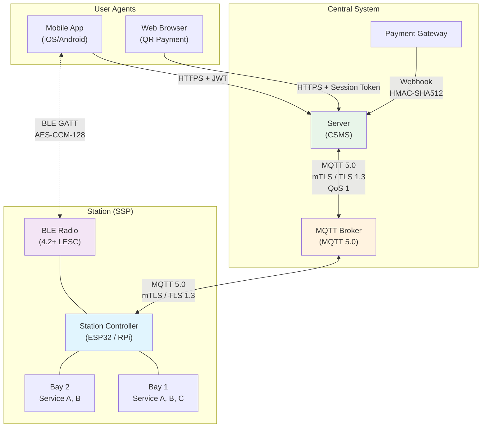

# OSPP — Open Self-Service Point Protocol

[]()
[]()
[](LICENSE)
[]()
[]()

---

> **Draft Specification** — This protocol is under active development.
> It has NOT been security-audited, is NOT production-ready, and
> breaking changes SHOULD be expected before v1.0.0 stable.
> Feedback and contributions are welcome via [Issues](https://github.com/ospp-org/ospp/issues).

---

## What is OSPP?

OSPP is an **open, vendor-neutral communication protocol** for self-service stations (car wash, laundry, vending, EV charging) and central management systems. It defines the wire protocol for station lifecycle, session management, payments, device management, and offline operation — so that stations from different manufacturers can work with any compatible server.

Think of it as **OCPP for self-service industries**. Where OCPP standardized EV charger-to-server communication, OSPP does the same for any station that delivers a time-bounded service through a physical bay. The protocol supports **online operation** (MQTT 5.0 over TLS 1.3), **offline operation** (BLE 4.2+ GATT with cryptographically signed passes), and **four hybrid connectivity scenarios** — ensuring service continuity even when internet is unavailable.

OSPP covers **34 messages** (21 MQTT + 13 BLE), **67 JSON Schemas**, **95 error codes**, **5 compliance profiles**, and a complete security model with mTLS, selective HMAC-SHA256 message signing, ECDSA P-256 offline authorization and receipt signing, and ECDSA P-384 root CA. It does NOT cover server-to-app REST APIs, payment gateway integration, business logic, or hardware internals — those are implementation-specific.

---

## Table of Contents

- [Architecture](#architecture)
- [Quick Start](#quick-start)
- [Specification](#specification)
  - [Chapters](#chapters)
  - [Profiles](#profiles)
  - [Message Catalog](#message-catalog)
- [JSON Schemas](#json-schemas)
- [Examples](#examples)
- [Using the Examples](#using-the-examples)
- [Guides](#guides)
- [Conformance Testing](#conformance-testing)
- [Repository Structure](#repository-structure)
- [Compliance Levels](#compliance-levels)
- [Roadmap](#roadmap)
- [Contributing](#contributing)
- [License](#license)

---

## Architecture



**Four connectivity scenarios:**

| Phone | Station | Strategy | Transport |
|:-----:|:-------:|----------|-----------|
| Online | Online | **Online** | HTTPS → Server → MQTT → Station |
| Online | Offline | **Partial A** | HTTPS (server signs auth) → BLE → Station |
| Offline | Online | **Partial B** ¹ | BLE → Station → MQTT (server validates) |
| Offline | Offline | **Full Offline** | BLE only (OfflinePass, local validation) |

> ¹ Partial B is required only at **Complete** compliance level. For Extended compliance, this scenario falls back to Full Offline.

---

## Quick Start

**Step 1 — Understand the protocol.** Read the [Introduction](spec/00-introduction.md) and [Architecture](spec/01-architecture.md), then skim the [Transport](spec/02-transport.md) chapter to understand MQTT topics, BLE characteristics, and the message envelope format.

**Step 2 — Walk through a flow.** Pick a flow from [`examples/flows/`](examples/flows/) and read it end-to-end. Start with [02-online-session.md](examples/flows/02-online-session.md) — it shows a complete service session with every HTTP request, MQTT message, and what the user sees at each step.

**Step 3 — Read the messages.** Open the [Message Catalog](spec/03-messages.md) and the [JSON Schemas](schemas/) side by side. Every field, constraint, and validation rule is formally defined.

**Ready to build?** Read the [Implementor's Guide](guides/implementors-guide.md) — a practical, developer-friendly walkthrough for building a station, server, or user agent.

**Validate a message against its schema:**

```bash
npx ajv-cli validate \
  -s schemas/mqtt/boot-notification-request.schema.json \
  -r "schemas/common/*.schema.json" \
  -d examples/payloads/mqtt/boot-notification.request.json
```

---

## Specification

### Chapters

| # | Chapter | Description | Status |
|:-:|---------|-------------|:------:|
| [00](spec/00-introduction.md) | Introduction | Scope, audience, normative language (RFC 2119/8174) | Draft |
| [01](spec/01-architecture.md) | Architecture | System topology, hardware model, identity scheme, protocol stack | Draft |
| [02](spec/02-transport.md) | Transport | MQTT 5.0, TLS 1.3, topic structure, QoS, BLE GATT, reconnection | Draft |
| [03](spec/03-messages.md) | Message Catalog | JSON envelope, messageType, correlation, timestamps; all 34 messages — fields, types, constraints, directions | Draft |
| [04](spec/04-flows.md) | Protocol Flows | 12 end-to-end flows with sequence diagrams and step-by-step detail | Draft |
| [05](spec/05-state-machines.md) | State Machines | Bay, Session, Reservation, BLE Connection, Firmware Update FSMs | Draft |
| [06](spec/06-security.md) | Security | Threat model, mTLS, HMAC-SHA256, PKI, OfflinePass, receipts, fraud scoring | Draft |
| [07](spec/07-errors.md) | Error Codes | 95 codes (6 categories), retry policies, circuit breaker, graceful degradation | Draft |
| [08](spec/08-configuration.md) | Configuration | 39 standard configuration keys, data types, access modes | Draft |
| [--](spec/glossary.md) | Glossary | Terms and definitions | Draft |

### Profiles

Each profile defines a subset of protocol actions. Implementations declare which profiles they support.

| Profile | Messages | Description | Spec |
|---------|:--------:|-------------|------|
| **Core** | 4 | BootNotification, Heartbeat, StatusNotification, ConnectionLost | [spec/profiles/core/](spec/profiles/core/) |
| **Transaction** | 6 | StartService, StopService, TransactionEvent, MeterValues, ReserveBay, CancelReservation | [spec/profiles/transaction/](spec/profiles/transaction/) |
| **Security** | 1 | SecurityEvent | [spec/profiles/security/](spec/profiles/security/) |
| **Device Management** | 9 | Config, Reset, Firmware, Diagnostics, Maintenance, ServiceCatalog | [spec/profiles/device-management/](spec/profiles/device-management/) |
| **Offline / BLE** | 14 | AuthorizeOfflinePass (MQTT), BLE transport, handshake, offline sessions, OfflinePass, reconciliation | [spec/profiles/offline/](spec/profiles/offline/) |

### Message Catalog

**21 MQTT Messages:**

| # | Action | Direction | Type | Timeout |
|:-:|--------|-----------|------|:-------:|
| 1 | BootNotification | Station → Server | REQ/RES | 30s |
| 2 | AuthorizeOfflinePass | Station → Server | REQ/RES | 15s |
| 3 | ReserveBay | Server → Station | REQ/RES | 5s |
| 4 | CancelReservation | Server → Station | REQ/RES | 5s |
| 5 | StartService | Server → Station | REQ/RES | 10s |
| 6 | StopService | Server → Station | REQ/RES | 10s |
| 7 | TransactionEvent | Station → Server | REQ/RES | 60s |
| 8 | Heartbeat | Station → Server | REQ/RES | 30s |
| 9 | StatusNotification | Station → Server | EVENT | — |
| 10 | MeterValues | Station → Server | EVENT | — |
| 11 | ConnectionLost | Broker → Server | EVENT (LWT) | — |
| 12 | SecurityEvent | Station → Server | EVENT | — |
| 13 | ChangeConfiguration | Server → Station | REQ/RES | 60s |
| 14 | GetConfiguration | Server → Station | REQ/RES | 30s |
| 15 | Reset | Server → Station | REQ/RES | 30s |
| 16 | UpdateFirmware | Server → Station | REQ/RES | 300s |
| 17 | FirmwareStatusNotification | Station → Server | EVENT | — |
| 18 | GetDiagnostics | Server → Station | REQ/RES | 300s |
| 19 | DiagnosticsNotification | Station → Server | EVENT | — |
| 20 | SetMaintenanceMode | Server → Station | REQ/RES | 30s |
| 21 | UpdateServiceCatalog | Server → Station | REQ/RES | 30s |

**13 BLE Messages:** StationInfo (FFF1), AvailableServices (FFF2), HELLO, CHALLENGE, OfflineAuthRequest, ServerSignedAuth, AuthResponse, START/StopServiceRequest/RESPONSE, ServiceStatus (FFF5), Receipt (FFF6)

Full definitions: [Chapter 03 — Message Catalog](spec/03-messages.md)

---

## JSON Schemas

**67 schema files** in [`schemas/`](schemas/) — JSON Schema Draft 2020-12, strict validation (`additionalProperties: false`).

| Directory | Count | Content |
|-----------|:-----:|---------|
| [`schemas/common/`](schemas/common/) | 18 | Shared types: identifiers, timestamps, credit amounts, error objects, OfflinePass, receipt, envelope |
| [`schemas/mqtt/`](schemas/mqtt/) | 36 | REQUEST/RESPONSE/EVENT payload schemas for all 21 MQTT actions |
| [`schemas/ble/`](schemas/ble/) | 13 | BLE message schemas for all 13 BLE message types |

Full index: [schemas/README.md](schemas/README.md)

---

## Examples

**68 example files** in [`examples/`](examples/) — realistic, production-quality data.

| Directory | Count | Content |
|-----------|:-----:|---------|
| [`examples/payloads/mqtt/`](examples/payloads/mqtt/) | 36 | JSON payloads for every MQTT message |
| [`examples/payloads/ble/`](examples/payloads/ble/) | 15 | JSON payloads for every BLE message |
| [`examples/flows/`](examples/flows/) | 12 | Narrative walkthroughs with complete message sequences |
| [`examples/error-scenarios/`](examples/error-scenarios/) | 5 | Common error scenarios with full messages |

**Flow examples:**

| # | Flow | Transport |
|:-:|------|-----------|
| [01](examples/flows/01-boot-sequence.md) | Station Boot & Registration | MQTT |
| [02](examples/flows/02-online-session.md) | Online Session — Mobile App | HTTPS + MQTT |
| [03](examples/flows/03-web-payment-session.md) | Web Payment — Anonymous QR | HTTPS + MQTT |
| [04](examples/flows/04-full-offline-session.md) | Full Offline — BLE Only | BLE |
| [05](examples/flows/05-partial-a-session.md) | Partial A — Phone Online, Station Offline | HTTPS + BLE |
| [06](examples/flows/06-partial-b-session.md) | Partial B — Phone Offline, Station Online | BLE + MQTT |
| [07](examples/flows/07-session-stop.md) | Session Stop & Early Termination | MQTT |
| [08](examples/flows/08-credit-purchase.md) | Credit Purchase / Top-up | HTTPS |
| [09](examples/flows/09-heartbeat-monitoring.md) | Heartbeat & Status Monitoring | MQTT |
| [10](examples/flows/10-error-recovery.md) | Error Recovery & Reconnection | MQTT |
| [11](examples/flows/11-reconciliation.md) | Offline → Online Reconciliation | MQTT |
| [12](examples/flows/12-firmware-update.md) | Firmware Update (OTA) | MQTT + HTTPS |

---

## Using the Examples

### MQTT Payloads

Example files in `examples/payloads/mqtt/` contain **payload-only** JSON — the content of the `payload` field in the MQTT envelope. To construct a complete wire-level message, wrap the payload in the standard envelope defined by [`schemas/common/mqtt-envelope.schema.json`](schemas/common/mqtt-envelope.schema.json):

```json
{
  "messageId": "msg_b1a2c3d4-e5f6-7890-abcd-ef1234567890",
  "messageType": "Request",
  "action": "BootNotification",
  "timestamp": "2026-02-13T10:00:00.000Z",
  "source": "Station",
  "protocolVersion": "0.1.0",
  "payload": {
    "stationId": "stn_a1b2c3d4e5f6",
    "firmwareVersion": "1.2.3",
    "stationModel": "SSP-3000",
    "stationVendor": "AcmeCorp",
    "serialNumber": "ACME-SSP-20250187",
    "bayCount": 3,
    "uptimeSeconds": 42,
    "pendingOfflineTransactions": 2,
    "timezone": "Europe/London",
    "bootReason": "PowerOn",
    "capabilities": {
      "bleSupported": true,
      "offlineModeSupported": true,
      "meterValuesSupported": true,
      "deviceManagementSupported": true
    },
    "networkInfo": {
      "connectionType": "Ethernet",
      "signalStrength": null
    }
  },
  "mac": "base64-encoded-hmac-sha256-signature"
}
```

The `payload` field above corresponds to the content in `examples/payloads/mqtt/boot-notification.request.json`. The envelope fields (`messageId`, `messageType`, `action`, `timestamp`, `source`, `protocolVersion`, `mac`) are described in [Chapter 02 — Transport](spec/02-transport.md) and [Chapter 03 — Message Catalog](spec/03-messages.md).

### BLE Payloads

BLE examples in `examples/payloads/ble/` are **complete messages** — no envelope wrapper. Each message includes a `type` field for identification. BLE messages are written to or read from GATT characteristics as defined in [Chapter 02](spec/02-transport.md), Section 8.

---

## Guides

| Guide | Audience |
|-------|---------|
| [Implementor's Guide](guides/implementors-guide.md) | Developers building stations, servers, or apps — practical guide with code examples, checklists, and common pitfalls |

---

## Conformance Testing

The [`conformance/`](conformance/) directory contains the test framework:

```
conformance/
├── harness/          Test execution framework
├── test-cases/       TC-{PROFILE}-{NNN} test cases (Core, TX, DM, SEC, OFF)
├── test-vectors/     Valid and invalid payload sets
└── reports/          Test execution reports
```

Test cases: `TC-CORE-001`, `TC-TX-001`..`003`, `TC-DM-001`..`002`, `TC-SEC-001`..`002`, `TC-OFF-001`..`003`

---

## Repository Structure

```
ospp/
├── spec/                    Specification chapters + profile docs
│   ├── 00-introduction.md       Chapter 00: Introduction
│   ├── 01-architecture.md       Chapter 01: Architecture
│   ├── 02-transport.md          Chapter 02: Transport (MQTT + BLE)
│   ├── 03-messages.md           Chapter 03: Message Catalog (34 messages)
│   ├── 04-flows.md              Chapter 04: Protocol Flows (12 flows)
│   ├── 05-state-machines.md     Chapter 05: State Machines
│   ├── 06-security.md           Chapter 06: Security Model
│   ├── 07-errors.md             Chapter 07: Error Codes (95 codes)
│   ├── 08-configuration.md      Chapter 08: Configuration Keys
│   ├── glossary.md              Glossary of terms
│   └── profiles/                Profile specifications
│       ├── core/                    4 actions (BootNotification, Heartbeat, ...)
│       ├── transaction/             6 actions (StartService, StopService, ...)
│       ├── security/                1 action (SecurityEvent)
│       ├── device-management/       9 actions (Config, Firmware, Diagnostics, ...)
│       └── offline/                 6 docs (AuthorizeOfflinePass, BLE transport, handshake, ...)
├── schemas/                 JSON Schema definitions (67 files)
│   ├── common/                  18 shared type schemas ($ref targets)
│   ├── mqtt/                    36 MQTT message payload schemas
│   └── ble/                     13 BLE message schemas
├── examples/                Example payloads and narrative flows (68 files)
│   ├── payloads/mqtt/           36 MQTT payload examples
│   ├── payloads/ble/            15 BLE payload examples
│   ├── flows/                   12 end-to-end flow narratives
│   └── error-scenarios/         5 error scenario walkthroughs
├── guides/                  Developer guides
│   └── implementors-guide.md    Practical guide for building OSPP implementations
├── conformance/             Conformance testing framework
│   ├── harness/                 Test runner + server simulator
│   ├── test-cases/              Test cases by profile
│   ├── test-vectors/            Valid/invalid payload sets
│   └── reports/                 Test execution reports
├── tools/                   Developer tooling (schema validation, codegen)
├── .github/                 Issue templates, PR template, CI workflows
├── README.md                This file
├── CHANGELOG.md             Version history
├── CONTRIBUTING.md          How to contribute
├── VERSIONING.md            Versioning policy (semver)
├── GOVERNANCE.md            Project governance
├── SECURITY.md              Security policy
├── CODE_OF_CONDUCT.md       Contributor Covenant
├── LICENSE                  Apache 2.0 (all content)
├── NOTICE                   Copyright notice
└── TRADEMARKS.md            Name usage guidelines
```

---

## Compliance Levels

OSPP defines four compliance levels. Each level builds on the previous one.

| Level | Required Profiles | Description |
|-------|-------------------|-------------|
| **Development** | Core | Testing and prototyping only. Security optional. **NOT for production.** |
| **Standard** | Core + Transaction + Security | Minimum for production: sessions, metering, TLS + mTLS + HMAC |
| **Extended** | Standard + Device Management + Offline/BLE | + remote config, firmware OTA, diagnostics, maintenance, BLE, OfflinePass, offline sessions (Online + Partial A + Full Offline) |
| **Complete** | Extended + Partial B scenario | + Partial B connectivity (phone offline, station online → station relays auth to server via MQTT) |

> **Development compliance is for testing and prototyping ONLY.** Production deployments MUST achieve Standard compliance or higher. See [`conformance/README.md`](conformance/README.md) for the full testing framework.

---

## Roadmap

### v1.0.0 stable (planned)

- [x] Schema validation CI pipeline
- [x] 4-tier compliance model (Development, Standard, Extended, Complete)
- [ ] Reference implementation — TypeScript station simulator
- [ ] Reference implementation — TypeScript server stub
- [ ] Automated conformance test runner (executable harness)
- [ ] BLE fragmentation protocol — formal specification for messages > MTU
- [ ] REST API informative appendix — endpoint catalog for flows that reference REST
- [ ] Interoperability test results (2+ implementations)
- [ ] Security audit of crypto primitives

### Post v1.0.0 (future)

- [ ] Multi-service sessions (select multiple services in one session)
- [ ] Dynamic pricing (time-of-day, demand-based)
- [ ] Reservation calendar (advance booking)
- [ ] Station-to-station communication (mesh scenarios)
- [ ] WebSocket transport option (alongside MQTT)
- [ ] Protocol Buffers option (alongside JSON)
- [ ] Localization framework for user-facing error messages
- [ ] Telemetry and analytics profile

### Under Discussion

- Station group management (fleet operations)
- Third-party service provider integration
- Geographic discovery (mDNS / DNS-SD for local station finding)
- QoS 2 support for critical financial messages
- Post-quantum cryptography migration path

---

## Contributing

We welcome contributions from station manufacturers, platform operators, and protocol enthusiasts.

See **[CONTRIBUTING.md](CONTRIBUTING.md)** for the full process, including:

- How to propose protocol changes (RFC process)
- Protocol Change Request (PCR) template
- JSON Schema coding style
- Review and approval process

**Quick version:**

1. Read the [Implementor's Guide](guides/implementors-guide.md) to understand the protocol
2. Open an [Issue](https://github.com/ospp-org/ospp/issues) describing your proposed change
3. Fork, branch, and submit a Pull Request
4. Ensure schemas and examples stay in sync
5. One maintainer review required; breaking changes need two reviewers

---

## License

All content in this repository — specification text, JSON Schemas, example payloads, tools, and code — is licensed under the [Apache License 2.0](https://www.apache.org/licenses/LICENSE-2.0). See [LICENSE](LICENSE).

---

<p align="center">
  <strong>OSPP</strong> is maintained by the <a href="https://github.com/ospp-org">OSPP Organization</a>.<br>
  <sub>Inspired by <a href="https://openchargealliance.org/">OCPP</a>, <a href="https://csa-iot.org/all-solutions/matter/">Matter</a>, and the belief that open standards make industries better.</sub>
</p>
