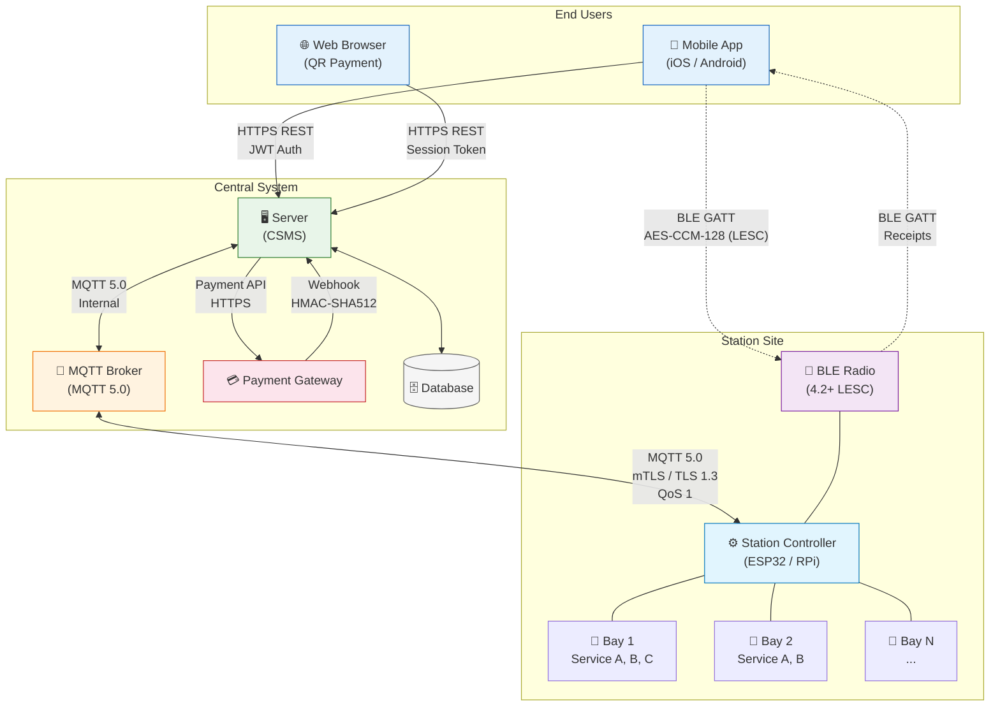
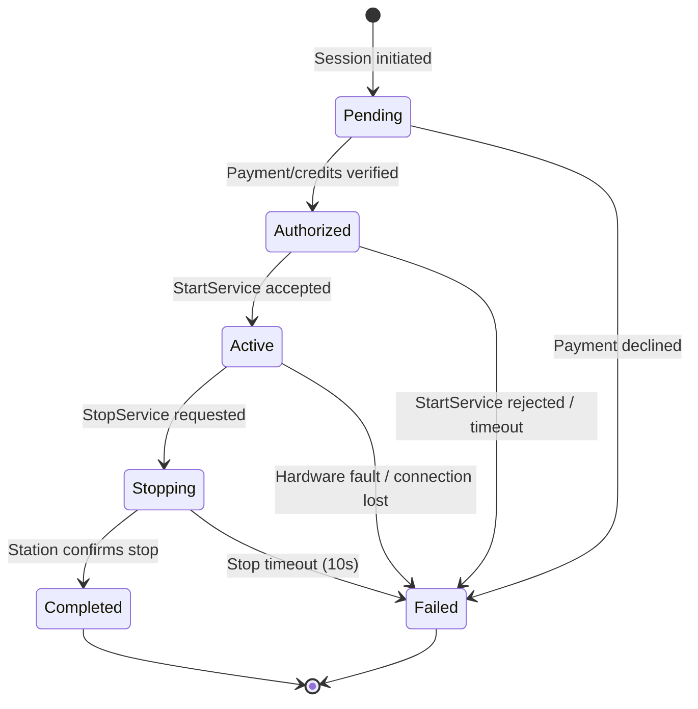
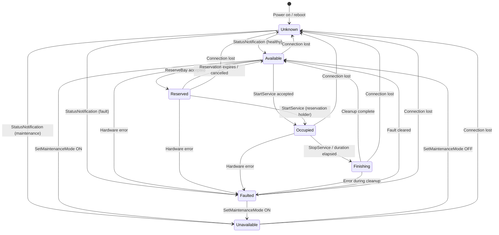
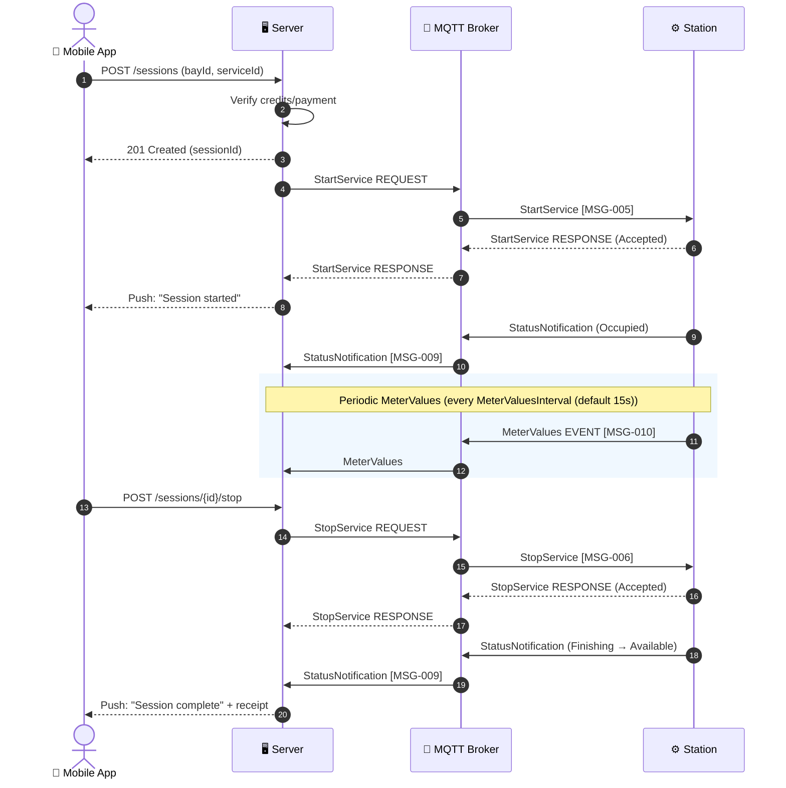
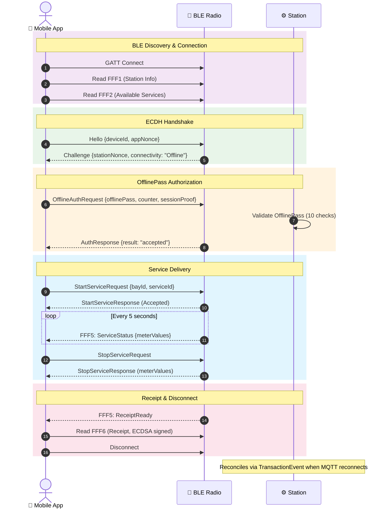
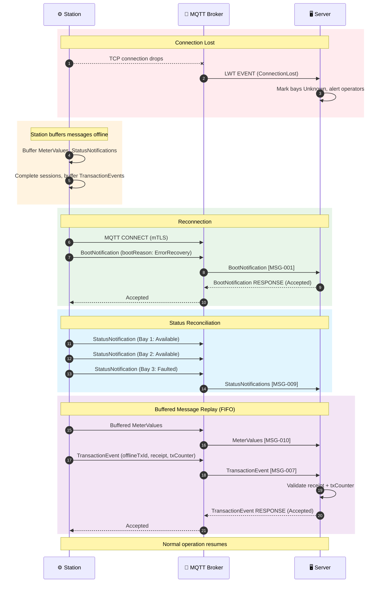

# OSPP Diagrams

> Standalone Mermaid diagrams for the OSPP specification. All diagrams render
> natively on GitHub. Source files (`.mmd`) can also be rendered with the
> [Mermaid CLI](https://github.com/mermaid-js/mermaid-cli) or any Mermaid-compatible tool.

---

## 1. Architecture Overview

System topology showing all participants and communication channels.

**Source:** [`architecture-overview.mmd`](architecture-overview.mmd) | **Spec ref:** [Chapter 01 — Architecture](../spec/01-architecture.md)



---

## 2. Session Lifecycle State Machine

The 6-state session FSM from initiation through completion or failure.

**Source:** [`state-machine-session.mmd`](state-machine-session.mmd) | **Spec ref:** [Chapter 05 — State Machines, Section 2](../spec/05-state-machines.md)



**Key timeouts:** Pending ack 10s | StartService 10s | Max duration configurable (default 600s) | StopService confirm 10s | Connection lost grace 300s

---

## 3. Bay State Machine

The 7-state bay FSM governing each physical service bay on a station.

**Source:** [`state-machine-station.mmd`](state-machine-station.mmd) | **Spec ref:** [Chapter 05 — State Machines, Section 1](../spec/05-state-machines.md)



---

## 4. Online Payment Session Sequence

The most common flow: mobile app user starts a session at a station.

**Source:** [`sequence-online-payment.mmd`](sequence-online-payment.mmd) | **Spec ref:** [Chapter 04 — Flows, Section 3](../spec/04-flows.md)



---

## 5. Full Offline BLE Session Sequence

Complete offline session via BLE when both phone and station lack internet.

**Source:** [`sequence-offline-ble.mmd`](sequence-offline-ble.mmd) | **Spec ref:** [Chapter 04 — Flows, Section 5a](../spec/04-flows.md)



---

## 6. Error Recovery Sequence

Station reconnection and message replay after an MQTT disconnection.

**Source:** [`sequence-error-recovery.mmd`](sequence-error-recovery.mmd) | **Spec ref:** [Chapter 04 — Flows, Section 9](../spec/04-flows.md)



---

## Rendering

### On GitHub

All diagrams above render automatically in this README. Navigate to any
diagram section to see the rendered output.

### Locally with Mermaid CLI

```bash
npm install -g @mermaid-js/mermaid-cli

# Render a single diagram to SVG
mmdc -i diagrams/architecture-overview.mmd -o diagrams/output/architecture-overview.svg

# Render all diagrams
for f in diagrams/*.mmd; do
  mmdc -i "$f" -o "${f%.mmd}.svg"
done
```

### In VS Code

Install the [Mermaid Preview](https://marketplace.visualstudio.com/items?itemName=bierner.markdown-mermaid)
extension to render `.mmd` files and Mermaid blocks in Markdown previews.
