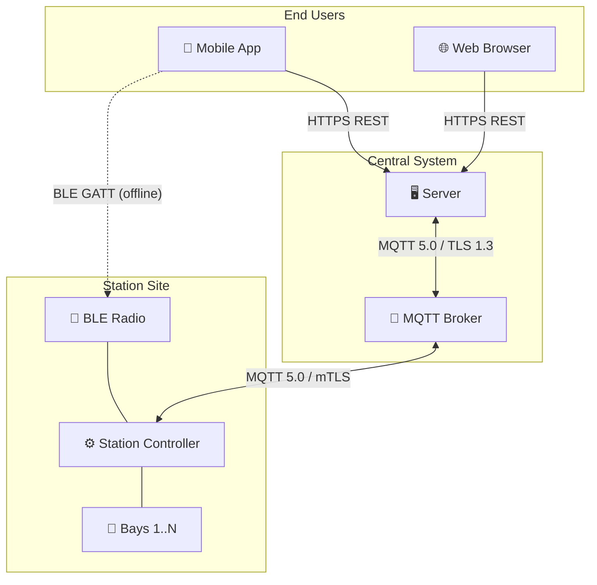

# Chapter 00 — Introduction

> **Status:** Draft | **OSPP Version:** 0.1.0-draft.1

This chapter establishes the purpose, scope, and conventions for the Open Self-Service Point Protocol (OSPP) specification. It identifies the target audience, defines how normative language is used throughout the document, describes notation and formatting conventions, and provides the normative and informative reference bibliography.

The keywords **MUST**, **MUST NOT**, **REQUIRED**, **SHALL**, **SHALL NOT**, **SHOULD**, **SHOULD NOT**, **RECOMMENDED**, **MAY**, and **OPTIONAL** in this document are to be interpreted as described in [RFC 2119](https://www.rfc-editor.org/rfc/rfc2119) and [RFC 8174](https://www.rfc-editor.org/rfc/rfc8174).

---

## 1. Purpose and Scope

### 1.1 Purpose

The **Open Self-Service Point Protocol (OSPP)** defines a secure, interoperable communication protocol between self-service stations and a central server (also known as CSMS — Central Self-service Management System). OSPP enables station manufacturers, backend operators, and integrators to build systems that work together without proprietary lock-in.

OSPP targets a broad range of self-service verticals, including but not limited to:

- **Car wash stations** -- automated wash bays, self-service pressure wash points
- **Laundry facilities** -- coin-op and app-controlled washers and dryers
- **Vending machines** -- food, beverage, and general merchandise dispensers
- **EV charging stations** -- AC and DC charging points
- **Locker systems** -- parcel lockers, luggage storage

The protocol defines a common set of operations -- boot registration, session lifecycle, status reporting, device management, security, and offline operation -- that apply across these verticals. Domain-specific behavior is captured in **profiles** that extend the core protocol without modifying it.



> **Figure 1** — OSPP system topology. Solid lines are online paths; dashed lines indicate the BLE offline fallback. See [Chapter 01 — Architecture](01-architecture.md) for the full topology and [diagrams/](../diagrams/) for standalone diagram files.

### 1.2 Scope

This specification covers the following areas:

| Area | Description | Chapters |
|------|-------------|----------|
| **Architecture** | System topology, identity model, hardware abstraction, communication stack | [01](01-architecture.md) |
| **Transport** | MQTT 5.0, BLE GATT, and HTTPS REST bindings with connection lifecycle and QoS | [02](02-transport.md) |
| **Message Catalog** | Normative payload schemas, metadata, and examples for every OSPP message | [03](03-messages.md) |
| **Protocol Flows** | End-to-end sequences for boot, sessions, reservations, offline scenarios | [04](04-flows.md) |
| **Security** | Threat model, PKI trust chain, cryptographic key inventory, provisioning | [06](06-security.md) |
| **State Machines** | Finite state machines for bays, sessions, reservations, BLE connections | [05-state-machines](05-state-machines.md) |
| **Error Handling** | Error code registry, severity levels, retry policies, circuit breakers | [07](07-errors.md) |
| **Configuration** | Configuration key registry with types, defaults, and access modes | [08](08-configuration.md) |

### 1.3 Out of Scope

The following topics are explicitly **outside** the scope of this specification:

- **Station hardware design** -- physical enclosure, sensor selection, actuator wiring, or PCB layout.
- **User interface design** -- mobile app screens, on-station display layouts, or UX flows.
- **Business logic** -- pricing models, loyalty programs, subscription rules, or revenue sharing.
- **Payment processing internals** -- integration with specific payment gateways, PCI DSS compliance procedures, or card-present terminal protocols.
- **Cloud infrastructure** -- server deployment architecture, database schema, or hosting provider selection.
- **Regulatory compliance** -- jurisdiction-specific requirements (e.g., fiscal receipt formats, local data protection law) beyond the general security model defined herein.

Implementers **SHOULD** consult domain-specific standards and local regulations for these areas.

---

## 2. Target Audience

This specification is intended for the following audiences:

| Audience | Interest |
|----------|----------|
| **Station manufacturers** | Implementing the station-side protocol stack (MQTT client, BLE peripheral, message handling, state machines) |
| **Server developers** | Building the server-side components (MQTT broker integration, session management, device management, offline reconciliation) |
| **System integrators** | Connecting OSPP-compliant stations to existing fleet management, payment, or IoT platforms |
| **Mobile application developers** | Implementing the app-side BLE transport and REST API client for session control and offline authorization |
| **IoT platform teams** | Evaluating OSPP for integration into broader IoT ecosystems and device management frameworks |
| **Security auditors** | Reviewing the threat model, cryptographic requirements, and trust chain for compliance assessments |
| **Conformance testers** | Validating implementations against the normative message schemas and protocol flows |

Readers are assumed to have working knowledge of JSON, MQTT, TLS, and REST APIs. Familiarity with BLE GATT is required only for implementers of the offline profile. Prior exposure to OCPP is helpful but not required.

---

## 3. Document Conventions

### 3.1 Normative Keywords

The key words **MUST**, **MUST NOT**, **REQUIRED**, **SHALL**, **SHALL NOT**, **SHOULD**, **SHOULD NOT**, **RECOMMENDED**, **NOT RECOMMENDED**, **MAY**, and **OPTIONAL** in this specification are to be interpreted as described in BCP 14 [[RFC 2119](https://www.rfc-editor.org/rfc/rfc2119)] [[RFC 8174](https://www.rfc-editor.org/rfc/rfc8174)] when, and only when, they appear in **BOLD UPPERCASE**.

When these words appear in lowercase or mixed case (e.g., "the station must be powered on" or "implementations should consider"), they carry their ordinary English meaning and are not normative requirements.

### 3.2 Notation and Formatting

The following notation conventions apply throughout this specification:

- **Monospace** (`code font`) is used for field names, message actions, identifier values, topic patterns, and code examples.
- **Angle brackets** (`{field}`) denote variable substitution in topic patterns and URI templates -- e.g., `ospp/v1/stations/{station_id}/to-server`.
- **Enumeration values** are written in **PascalCase** monospace -- e.g., `status: "Available"`, `bootReason: "PowerOn"`.
- **Cross-references** between chapters use the format `see [Chapter NN](NN-name.md), Section X.Y` — for example, "see [Chapter 02](02-transport.md), Section 3.1".
- **Message references** use the format **[MSG-NNN]** where NNN is the zero-padded message number from the Message Catalog.

### 3.3 Identifier Prefixes

All OSPP identifiers use a typed prefix to avoid ambiguity and enable quick visual identification. Implementations **MUST** use these prefixes when generating identifiers.

| Prefix | Entity | Example |
|--------|--------|---------|
| `stn_` | Station | `stn_a1b2c3d4` |
| `bay_` | Bay | `bay_a1b2c3d4` |
| `sess_` | Session | `sess_9f8e7d6c` |
| `svc_` | Service | `svc_premium_wash` |
| `sub_` | Subscriber (user) | `sub_x7y8z9` |
| `rsv_` | Reservation | `rsv_f1e2d3c4` |
| `otx_` | Offline transaction | `otx_b5a6c7d8` |
| `opass_` | Offline pass | `opass_e9f0a1b2` |
| `msg_` | Message | `msg_c3d4e5f6` |
| `fwupd_` | Firmware update | `fwupd_d7e8f9a0` |
| `sec_` | Security event | `sec_e1f2a3b4` |

### 3.4 JSON Representation

All OSPP messages are serialized as JSON [[RFC 8259](https://www.rfc-editor.org/rfc/rfc8259)]. JSON examples in this specification are pretty-printed for readability. On the wire, implementations **MAY** transmit compact (whitespace-stripped) JSON.

Comments appearing in JSON examples (prefixed with `//`) are for illustration only and **MUST NOT** appear in actual messages. Ellipsis (`...`) in examples indicates omitted fields or repetition.

```json
{
  "messageId": "msg_c3d4e5f6",         // UUID v4 — unique per message
  "messageType": "Request",
  "action": "StartService",
  "timestamp": "2026-02-13T10:30:00.000Z",  // ISO 8601 — always UTC, milliseconds required
  "source": "Server",
  "protocolVersion": "0.1.0",
  "payload": { ... }
}
```

### 3.5 Schema Language

Message payload schemas are defined using **JSON Schema Draft 2020-12**. Machine-readable schema files are provided in the companion `schemas/` directory. Where the prose description and the JSON Schema disagree, the JSON Schema is authoritative.

### 3.6 Timestamps

All timestamps in OSPP messages **MUST** be formatted as ISO 8601 strings in UTC with the `Z` suffix -- e.g., `"2026-02-13T10:30:00Z"`. Millisecond precision **MUST** be included -- e.g., `"2026-02-13T10:30:00.123Z"`. Implementations **MUST NOT** use timezone offsets other than `Z`.

### 3.7 Encoding

All text in OSPP messages **MUST** be encoded as UTF-8. Implementations **MUST** reject messages containing invalid UTF-8 sequences with error code `1005 INVALID_MESSAGE_FORMAT` (see [Chapter 07](07-errors.md)).

### 3.8 Diagrams

Protocol flows and state machines are illustrated with [Mermaid](https://mermaid.js.org/) diagrams embedded directly in the specification markdown. These diagrams are informative -- the normative behavior is defined by the accompanying prose.

### 3.9 Chapter Organization

The specification is organized into numbered chapters for stable cross-referencing:

| Chapter | Title |
|---------|-------|
| 00 | Introduction (this chapter) |
| 01 | Architecture |
| 02 | Transport |
| 03 | Message Catalog |
| 04 | Protocol Flows |
| 05 | State Machines |
| 06 | Security |
| 07 | Error Codes & Resilience |
| 08 | Configuration |
| -- | Glossary |

---

## 4. Normative References

The following documents are referenced normatively in this specification. Implementations claiming OSPP conformance **MUST** comply with the applicable requirements from these references.

| Reference | Title | Link |
|-----------|-------|------|
| [RFC 2119] | Key words for use in RFCs to Indicate Requirement Levels | https://www.rfc-editor.org/rfc/rfc2119 |
| [RFC 8174] | Ambiguity of Uppercase vs Lowercase in RFC 2119 Key Words | https://www.rfc-editor.org/rfc/rfc8174 |
| [RFC 8446] | The Transport Layer Security (TLS) Protocol Version 1.3 | https://www.rfc-editor.org/rfc/rfc8446 |
| [RFC 8259] | The JavaScript Object Notation (JSON) Data Interchange Format | https://www.rfc-editor.org/rfc/rfc8259 |
| [RFC 4122] | A Universally Unique IDentifier (UUID) URN Namespace | https://www.rfc-editor.org/rfc/rfc4122 |
| [MQTT 5.0] | MQTT Version 5.0 (OASIS Standard) | https://docs.oasis-open.org/mqtt/mqtt/v5.0/mqtt-v5.0.html |
| [JSON Schema 2020-12] | JSON Schema: A Media Type for Describing JSON Documents | https://json-schema.org/draft/2020-12/json-schema-core |
| [ISO 8601] | Date and time -- Representations for information interchange | https://www.iso.org/standard/70907.html |
| [BT Core 5.3] | Bluetooth Core Specification v5.3 | https://www.bluetooth.com/specifications/specs/core-specification-5-3/ |

---

## 5. Informative References

The following documents provide additional context and prior art. They are not normatively binding but are recommended reading for implementers.

| Reference | Title | Link |
|-----------|-------|------|
| [OCPP 2.0.1] | Open Charge Point Protocol 2.0.1 | https://openchargealliance.org/protocols/ocpp-201/ |
| [OWASP IoT Top 10] | OWASP Internet of Things Top 10 (2018) | https://owasp.org/www-project-internet-of-things/ |
| [NIST SP 800-183] | Networks of 'Things' (IoT Reference Architecture) | https://csrc.nist.gov/publications/detail/sp/800-183/final |
| [AsyncAPI 3.0] | AsyncAPI Specification 3.0 | https://www.asyncapi.com/docs/reference/specification/v3.0.0 |
| [NIST SP 800-57] | Recommendation for Key Management | https://csrc.nist.gov/publications/detail/sp/800-57-part-1/rev-5/final |

---

## 6. Document History

| Version | Date | Author | Changes |
|---------|------|--------|---------|
| 0.1.0-draft.1 | 2026-02-13 | OSPP Authors | Initial public draft. |
