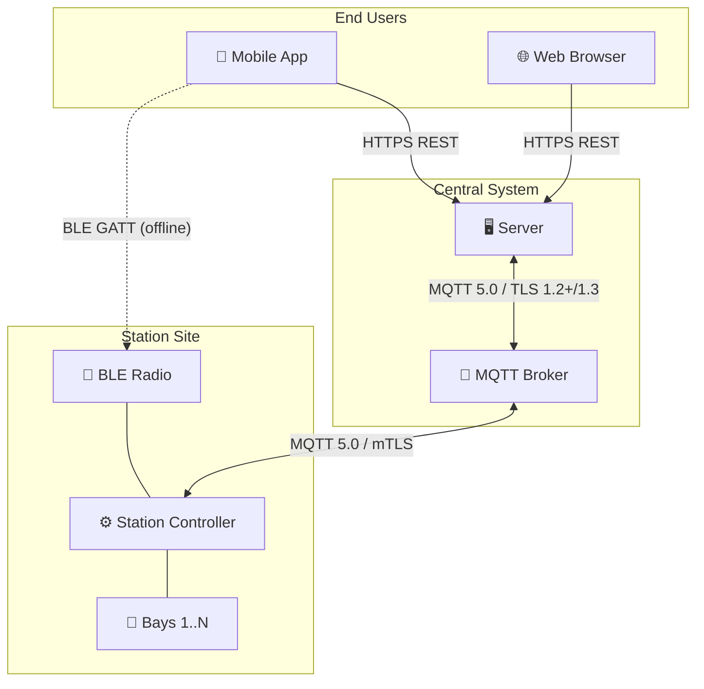

# Chapter 00 — Introduction

> **Status:** Draft | **OSPP Version:** 0.35.0

This chapter establishes the purpose, scope, and conventions for the Open Self-Service Point Protocol (OSPP) specification. It identifies the target audience, defines how normative language is used throughout the document, describes notation and formatting conventions, and provides the normative and informative reference bibliography.

The keywords **MUST**, **MUST NOT**, **REQUIRED**, **SHALL**, **SHALL NOT**, **SHOULD**, **SHOULD NOT**, **RECOMMENDED**, **MAY**, and **OPTIONAL** in this document are to be interpreted as described in [RFC 2119](https://www.rfc-editor.org/rfc/rfc2119) and [RFC 8174](https://www.rfc-editor.org/rfc/rfc8174).

---

## 1. Purpose and Scope

### 1.1 Purpose

The **Open Self-Service Point Protocol (OSPP)** defines a secure, interoperable communication protocol between self-service stations and a central server (also known as CSMS — Central Self-service Management System). OSPP enables station manufacturers, backend operators, and integrators to build systems that work together without proprietary lock-in.

OSPP targets a broad range of self-service verticals, including but not limited to:

- **Car wash stations** -- automated wash bays, self-service pressure wash points
- **Laundry facilities** -- coin-op and app-controlled washers and dryers
- **Vending machines** -- food, beverage, and general merchandise dispensers
- **EV charging stations** -- AC and DC charging points
- **Locker systems** -- parcel lockers, luggage storage

The protocol defines a common set of operations -- boot registration, session lifecycle, status reporting, device management, security, and offline operation -- that apply across these verticals. Domain-specific behavior is captured in **profiles** that extend the core protocol without modifying it.


```mermaid
graph TB
    subgraph "End Users"
        APP["📱 Mobile App"]
        WEB["🌐 Web Browser"]
    end

    subgraph "Central System"
        SERVER["🖥️ Server"]
        BROKER["📡 MQTT Broker"]
    end

    subgraph "Station Site"
        CTRL["⚙️ Station Controller"]
        BLE["📶 BLE Radio"]
        BAY["🚿 Bays 1..N"]
    end

    APP -->|"HTTPS REST"| SERVER
    WEB -->|"HTTPS REST"| SERVER
    SERVER <-->|"MQTT 5.0 / TLS 1.2+/1.3"| BROKER
    BROKER <-->|"MQTT 5.0 / mTLS"| CTRL
    APP -. "BLE GATT (offline)" .-> BLE
    BLE --- CTRL
    CTRL --- BAY
```

> **Figure 1** — OSPP system topology. Solid lines are online paths; dashed lines indicate the BLE offline fallback. See [Chapter 01 — Architecture](01-architecture.md) for the full topology and [diagrams/](../diagrams/) for standalone diagram files.

### 1.2 Scope

This specification covers the following areas:

| Area | Description | Chapters |
|------|-------------|----------|
| **Architecture** | System topology, identity model, hardware abstraction, communication stack | [01](01-architecture.md) |
| **Transport** | MQTT 5.0, BLE GATT, and HTTPS REST bindings with connection lifecycle and QoS | [02](02-transport.md) |
| **Message Catalog** | Normative payload schemas, metadata, and examples for every OSPP message | [03](03-messages.md) |
| **Protocol Flows** | End-to-end sequences for boot, sessions, reservations, offline scenarios | [04](04-flows.md) |
| **Security** | Threat model, PKI trust chain, cryptographic key inventory, provisioning | [06](06-security.md) |
| **State Machines** | Finite state machines for the station, bays, sessions, reservations, BLE connections | [05-state-machines](05-state-machines.md) |
| **Error Handling** | Error code registry, severity levels, retry policies, circuit breakers | [07](07-errors.md) |
| **Configuration** | Configuration key registry with types, defaults, and access modes | [08](08-configuration.md) |

### 1.3 Out of Scope

The following topics are explicitly **outside** the scope of this specification:

- **Station hardware design** -- physical enclosure, sensor selection, actuator wiring, or PCB layout.
- **User interface design** -- mobile app screens, on-station display layouts, or UX flows.
- **Business logic** -- pricing models, loyalty programs, subscription rules, or revenue sharing.
- **Payment processing internals** -- integration with specific payment gateways, PCI DSS compliance procedures, or card-present terminal protocols.
- **Cloud infrastructure** -- server deployment architecture, database schema, or hosting provider selection.
- **Regulatory compliance** -- jurisdiction-specific requirements (e.g., fiscal receipt formats, local data protection law) beyond the general security model defined herein.
- **Change of station ownership** -- moving a provisioned station from one operator or tenant to another. The protocol carries no owner, no transfer operation, and no rule about what becomes of sessions, receipts or retained receipt-signing keys across such a move. An operator performing one acts entirely outside this specification.
- **Decommissioning and disposal** -- taking a station permanently out of service. There is no terminal station state, no remote credential wipe, and no protocol event that ends a station's life. `NotProvisioned` ([Chapter 05 §1](05-state-machines.md#1-station-state-machine)) is a pre-provisioning state with no incoming edge, and it is deliberately unreachable: a station **MUST NOT** enter it autonomously. Withdrawal from service is achieved by operator-side means the protocol does not define; the nearest in-band effect is that the server stops accepting the station, which `2001 STATION_NOT_REGISTERED` reports.

Implementers **SHOULD** consult domain-specific standards and local regulations for these areas.

> **Why the last two rows exist, when their subject is simply absent.** Every other row here excludes a
> topic no reader would expect to find. These two exclude topics a reader **does** go looking for, and
> until `0.25.0` they found nothing: measured over `spec/` and `schemas/`, the terms *decommission*,
> *dispose*, *unregister*, *deregister*, *tombstone*, *handover*, *RMA* and *owner* each occurred **zero**
> times, `ownership` once in an unrelated sense, and all ten occurrences of *transfer* were the
> `DataTransfer` message. An absence that large is indistinguishable from an oversight, and a reader who
> concludes "not written yet" builds something and expects it to interoperate. Stating the exclusion is
> the difference between a decision and a hole. It is recorded with its option space in
> [`KNOWN-ISSUES.md`](../KNOWN-ISSUES.md#decided-0250--station-ownership-transfer-and-decommissioning-stay-undefined-and-the-specification-now-says-so),
> and reopening it is a protocol addition, not a clarification.

---

## 2. Target Audience

This specification is intended for the following audiences:

| Audience | Interest |
|----------|----------|
| **Station manufacturers** | Implementing the station-side protocol stack (MQTT client, BLE peripheral, message handling, state machines) |
| **Server developers** | Building the server-side components (MQTT broker integration, session management, device management, offline reconciliation) |
| **System integrators** | Connecting OSPP-compliant stations to existing fleet management, payment, or IoT platforms |
| **Mobile application developers** | Implementing the app-side BLE transport and REST API client for session control and offline authorization |
| **IoT platform teams** | Evaluating OSPP for integration into broader IoT ecosystems and device management frameworks |
| **Security auditors** | Reviewing the threat model, cryptographic requirements, and trust chain for compliance assessments |
| **Conformance testers** | Validating implementations against the normative message schemas and protocol flows |

Readers are assumed to have working knowledge of JSON, MQTT, TLS, and REST APIs. Familiarity with BLE GATT is required only for implementers of the offline profile. Prior exposure to OCPP is helpful but not required.

---

## 3. Document Conventions

### 3.1 Normative Keywords

The key words **MUST**, **MUST NOT**, **REQUIRED**, **SHALL**, **SHALL NOT**, **SHOULD**, **SHOULD NOT**, **RECOMMENDED**, **NOT RECOMMENDED**, **MAY**, and **OPTIONAL** in this specification are to be interpreted as described in BCP 14 [[RFC 2119](https://www.rfc-editor.org/rfc/rfc2119)] [[RFC 8174](https://www.rfc-editor.org/rfc/rfc8174)] when, and only when, they appear in **ALL CAPITALS**.

When these words appear in lowercase or mixed case (e.g., "the station must be powered on" or "implementations should consider"), they carry their ordinary English meaning and are not normative requirements.

> **Bold is house style, not a condition of binding.** This paragraph previously read "when, and
> only when, they appear in **BOLD UPPERCASE**", which is stricter than RFC 8174 — the RFC's own
> condition is "all capitals" and it says nothing about weight. The stricter reading was never
> what the specification practised: **496 of the 1391 capitalised MUST/SHALL keywords in `spec/`
> were unbolded**, and 457 of those are plainly obligations — the entire MQTT topic-ACL apparatus
> ([Chapter 02 §6](02-transport.md#6-access-control-acl)), all ten OfflinePass checks
> ([Chapter 06 §6.1.1](06-security.md)), and most of [Chapter 08](08-configuration.md). Nor did
> any other document adopt it: all eighteen chapters and profiles that restate this paragraph
> state the plain BCP 14 form, and the paragraph contradicted itself — the sentence below
> identifies the non-binding case as *lowercase or mixed case*, never as unbolded capitals.
> Authors **SHOULD** still bold normative keywords, per
> [CONTRIBUTING.md](../CONTRIBUTING.md); a keyword that is not bolded is a style defect, not a
> keyword that fails to bind.

### 3.2 Notation and Formatting

The following notation conventions apply throughout this specification:

- **Monospace** (`code font`) is used for field names, message actions, identifier values, topic patterns, and code examples.
- **Angle brackets** (`{field}`) denote variable substitution in topic patterns and URI templates -- e.g., `ospp/v1/stations/{station_id}/to-server`.
- **Enumeration values** are written in **PascalCase** monospace -- e.g., `status: "Available"`, `bootReason: "PowerOn"`.
- **Cross-references** between chapters use the format `see [Chapter NN](NN-name.md), Section X.Y` — for example, "see [Chapter 02](02-transport.md), Section 3.1".
- **Message references** use the format **[MSG-NNN]** where NNN is the zero-padded message number from the Message Catalog.

### 3.3 Identifier Prefixes

All OSPP identifiers use a typed prefix to avoid ambiguity and enable quick visual identification. Implementations **MUST** use these prefixes when generating identifiers.

| Prefix | Entity | Example |
|--------|--------|---------|
| `stn_` | Station | `stn_a1b2c3d4` |
| `bay_` | Bay | `bay_a1b2c3d4` |
| `sess_` | Session | `sess_9f8e7d6c` |
| `svc_` | Service | `svc_premium_wash` |
| `sub_` | Subscriber (user) | `sub_x7y8z9` |
| `rsv_` | Reservation | `rsv_f1e2d3c4` |
| `otx_` | Offline transaction | `otx_b5a6c7d8` |
| `opass_` | Offline pass | `opass_e9f0a1b2` |
| `msg_` | Message | `msg_c3d4e5f6` |
| `fwupd_` | Firmware update | `fwupd_d7e8f9a0` |
| `sec_` | Security event | `sec_e1f2a3b4` |

### 3.4 JSON Representation

All OSPP messages are serialized as JSON [[RFC 8259](https://www.rfc-editor.org/rfc/rfc8259)]. JSON examples in this specification are pretty-printed for readability. On the wire, implementations **MAY** transmit compact (whitespace-stripped) JSON.

Comments appearing in JSON examples (prefixed with `//`) are for illustration only and **MUST NOT** appear in actual messages. Ellipsis (`...`) in examples indicates omitted fields or repetition.

```json
{
  "messageId": "msg_c3d4e5f6",         // RFC 4122 UUID — unique per message
  "messageType": "Request",
  "action": "StartService",
  "timestamp": "2026-02-13T10:30:00.000Z",  // ISO 8601 — always UTC, milliseconds required
  "source": "Server",
  "protocolVersion": "0.3.0",
  "payload": { ... }
}
```

### 3.5 Schema Language

Message payload schemas are defined using **JSON Schema Draft 2020-12**. Machine-readable schema files are provided in the companion `schemas/` directory. Where the prose description and the JSON Schema disagree, the JSON Schema is authoritative.

### 3.6 Timestamps

All timestamps in OSPP messages **MUST** be formatted as ISO 8601 strings in UTC with the `Z` suffix and millisecond precision -- e.g., `"2026-02-13T10:30:00.000Z"` or `"2026-02-13T10:30:00.123Z"`. Exactly three decimal places **MUST** be present, including when they are zero: a timestamp that omits them, or that carries any other number of them, is rejected by [`timestamp.schema.json`](../schemas/common/timestamp.schema.json). Implementations **MUST NOT** use timezone offsets other than `Z`.

### 3.7 Encoding

All text in OSPP messages **MUST** be encoded as UTF-8. Implementations **MUST** reject messages containing invalid UTF-8 sequences with error code `1005 INVALID_MESSAGE_FORMAT` (see [Chapter 07](07-errors.md)).

### 3.8 Diagrams

Protocol flows and state machines are illustrated with [Mermaid](https://mermaid.js.org/) diagrams embedded directly in the specification markdown. These diagrams are informative -- the normative behavior is defined by the accompanying prose.

### 3.9 Chapter Organization

The specification is organized into numbered chapters for stable cross-referencing:

| Chapter | Title |
|---------|-------|
| 00 | Introduction (this chapter) |
| 01 | Architecture |
| 02 | Transport |
| 03 | Message Catalog |
| 04 | Protocol Flows |
| 05 | State Machines |
| 06 | Security |
| 07 | Error Codes & Resilience |
| 08 | Configuration |
| -- | Glossary |

---

## 4. Normative References

The following documents are referenced normatively in this specification. Implementations claiming OSPP conformance **MUST** comply with the applicable requirements from these references.

| Reference | Title | Link |
|-----------|-------|------|
| [RFC 2119] | Key words for use in RFCs to Indicate Requirement Levels | https://www.rfc-editor.org/rfc/rfc2119 |
| [RFC 8174] | Ambiguity of Uppercase vs Lowercase in RFC 2119 Key Words | https://www.rfc-editor.org/rfc/rfc8174 |
| [RFC 8446] | The Transport Layer Security (TLS) Protocol Version 1.3 | https://www.rfc-editor.org/rfc/rfc8446 |
| [RFC 8259] | The JavaScript Object Notation (JSON) Data Interchange Format | https://www.rfc-editor.org/rfc/rfc8259 |
| [RFC 4122] | A Universally Unique IDentifier (UUID) URN Namespace | https://www.rfc-editor.org/rfc/rfc4122 |
| [MQTT 5.0] | MQTT Version 5.0 (OASIS Standard) | https://docs.oasis-open.org/mqtt/mqtt/v5.0/mqtt-v5.0.html |
| [JSON Schema 2020-12] | JSON Schema: A Media Type for Describing JSON Documents | https://json-schema.org/draft/2020-12/json-schema-core |
| [ISO 8601] | Date and time -- Representations for information interchange | https://www.iso.org/standard/70907.html |
| [BT Core 5.3] | Bluetooth Core Specification v5.3 | https://www.bluetooth.com/specifications/specs/core-specification-5-3/ |

---

## 5. Informative References

The following documents provide additional context and prior art. They are not normatively binding but are recommended reading for implementers.

| Reference | Title | Link |
|-----------|-------|------|
| [OCPP 2.0.1] | Open Charge Point Protocol 2.0.1 | https://openchargealliance.org/protocols/ocpp-201/ |
| [OWASP IoT Top 10] | OWASP Internet of Things Top 10 (2018) | https://owasp.org/www-project-internet-of-things/ |
| [NIST SP 800-183] | Networks of 'Things' (IoT Reference Architecture) | https://csrc.nist.gov/publications/detail/sp/800-183/final |
| [AsyncAPI 3.0] | AsyncAPI Specification 3.0 | https://www.asyncapi.com/docs/reference/specification/v3.0.0 |
| [NIST SP 800-57] | Recommendation for Key Management | https://csrc.nist.gov/publications/detail/sp/800-57-part-1/rev-5/final |

---

## 6. Document History

| Version | Date | Author | Changes |
|---------|------|--------|---------|
| 0.1.0-draft.1 | 2026-02-13 | OSPP Authors | Initial public draft. |
| 0.2.0 | 2026-03-20 | OSPP Authors | SessionEnded EVENT (MSG-040), Unknown bay state handling, TransactionEvent authoring fixes, example validation fixes. |
| 0.2.1 | 2026-03-21 | OSPP Authors | `supportedVersions` in BootNotification RESPONSE for protocol version negotiation (1007). |
| 0.2.2 | 2026-03-22 | OSPP Authors | Update all `protocolVersion` example values from 0.1.0 to 0.2.1. |
| 0.2.3 | 2026-03-22 | OSPP Authors | Add SessionEnded EVENT to HMAC signing table in 06-security.md. |
| 0.2.4 | 2026-03-22 | OSPP Authors | Reclassify SessionEnded as HMAC-signed (YES) — contains billing data. |
| 0.2.5 | 2026-04-30 | OSPP Authors | `provisioning-response.schema.json` (top-level HTTP schema) for `POST /api/v1/stations/provision` response body. |
| 0.3.0 | 2026-05-06 | OSPP Authors | Provisioning trust anchors split (`stationCaChain` + `brokerRootCa`); normative MUST that station consumes `mqttConfig.brokerUri`. |
| 0.4.0 | 2026-05-07 | OSPP Authors | Brief Q comprehensive patches: CSMS as cost authority, <50% refund scope clarified, OSPP Session Retention Horizon (24h), MeterValues + SessionEnded message-expiry, OSPP Canonical Form formalized (§4.8), per-session seqNo + finalSeqNo + NVS persistence, SessionEnded reason vocabulary extended (Local, LocalOutOfCredit, Deauthorized). |
| 0.4.1 | 2026-06-04 | OSPP Authors | SecurityEvent dedup contract tightening: `security-event.md` §6 (rule 2) normative MUST for `eventId` stability across QoS-1 retransmits and buffered replays; `authorize-offline-pass.md` §6 (rule 7) SHOULD→MUST with negative-space clause (only checks #1 and #5 emit; other Rejected outcomes MUST NOT), `type` MUST be `OfflinePassRejected`, and `eventId` MUST be deterministically derived from the originating REQUEST's `messageId` (preserves per-attempt visibility for forgery probing and cross-station replay attempts). |
| 0.4.2 | 2026-06-05 | OSPP Authors | Reconcile-Time Re-validation Gate (`reconciliation.md` §6, NEW) — 11 hard-reject checks before fraud scoring (receipt cross-checks, pass-found, pass-user, deviceId, org, station, expiry, revocation epoch, individual revoke). `06-security.md` §6.2 receipt_fields expanded to 12 (added offlinePassId/userId/deviceId, signed). (M) fix: signing + verification converge on canonical-bytes hash (drops the dead-code base64 intermediate). `offline-pass.md` §2 + §7: new `organization_id` field + Org-scoped property; "unscoped" semantics defined as "any station of the issuing org." 4 new error codes (2014/2015/2016/2017), 2003 promoted to hard-reject at reconcile-time. BLE FFF6 wrapper extended for symmetry with signed inner. Coordinated v0.4.1 → v0.4.2 stack upgrade; pre-launch context (0 offline_passes on prod) makes the break clean. |
| 0.5.0 | 2026-06-06 | OSPP Authors | Lockstep re-synchronization release across `spec` + `ospp-sdk-php` + `sdk-ts` ([ADR-001](../adr/ADR-001-cross-repo-lockstep-versioning.md)). `transaction-event-response.schema.json` `status` enum gains `Deferred` (closes the §4.2:52 spec gap — server already emitted the value, schema didn't admit it). `reconciliation.md §4.1`/`§4.2` document the `Deferred` wire shape + the `Deferred`-vs-`RetryLater` semantic distinction (operator-manual unblock vs. transient-backoff-retry). `§6.3`/`§6.5` clarify gate-emit-before-INSERT ordering for check #4 (FK is belt-and-suspenders for non-gate paths, not the conforming reconciliation path). |
| 0.6.0 | 2026-06-20 | OSPP Authors | BLE handshake security (D1, [ADR-002](../adr/ADR-002-ble-handshake-security-architecture.md)): authenticated application-layer ECDH (`IKM = es ‖ ee ‖ appNonce ‖ stationNonce`), StationIdentity certificate (§6.5.2), BLE AEAD channel (ChaCha20-Poly1305 IETF, §6.5.3), `Hello`/`Challenge` ephemeral-key wire format, BLE pairing demoted to OPTIONAL, `sessionProof` canonical definition moved to `ble-handshake.md` §4.1. Lockstep with `ospp-sdk-php` + `sdk-ts`. |
| 0.6.1 | 2026-06-21 | OSPP Authors | Reconciliation + Partial-A (S2, decisions D2/D3): the reconcile-time re-validation gate grows to 13 checks (passCounter receipt cross-check #12 + cross-station `(offlinePassId, passCounter)` uniqueness #13, finding N7); revocation epoch anchored at transaction time (#10, §6.6, N8); discriminated (`oneOf`) signed receipt + envelope (pass-form `{offlinePassId, passCounter}` vs auth-form `{authId, sessionId}`, N2/Q4) making Partial-A reconcilable; ServerSignedAuth claims gain signed `durationSeconds`/`creditsAuthorized` (10→12, N3); settle-once wallet true-up (§8.2, N11); `ServerSignedAuthReplay` SecurityEvent type (error 2018). Lockstep re-vendor of `spec/schemas/`. |
| 0.6.2 | 2026-06-22 | OSPP Authors | SDK enum catch-up (lockstep, ADR-001), no spec content change: `ServerSignedAuthReplay` SecurityEvent type + error `2018 SERVER_AUTH_NONCE_MISMATCH` — both fully specified in 0.6.1 — are mirrored into the `ospp-sdk-php` / `sdk-ts` enum types (Critical, non-recoverable, httpStatus 401). `spec/schemas/` byte-identical to 0.6.1; version-header cascade only. |
| 0.8.0 | 2026-07-13 | OSPP Authors | Config vocabulary alignment: removed 12 unused keys (SecurityProfile, 8 BLE keys, Locale, StatusNotificationInterval, EventThrottleSeconds); corrected 4 key defaults/ranges; total 41→29. Wire protocolVersion unchanged (0.2.1). |
| 0.7.0 | 2026-07-10 | OSPP Authors | TLS 1.2 floor amendment: `02-transport.md` §1.3 relaxes the TLS-1.3-only rule to a TLS-1.2 floor with TLS 1.3 RECOMMENDED-and-negotiated-when-supported, admitting constrained cellular modems (e.g. SIMCom A7608E-H) with no firmware path to 1.3; cipher suite list extended to 4 entries (2× TLS 1.3 AES-GCM + 2× TLS 1.2 ECDHE-ECDSA-GCM, `TLS_CHACHA20_POLY1305_SHA256` dropped from the offered set); `06-security.md` cipher table, threat-model, and checklist references updated to match. All other chapter/profile mentions of a hard TLS-1.3-only requirement (connection-sequence diagrams, protocol summary tables, algorithm inventory) updated for consistency. `04-flows.md` §2 (Station Provisioning) gains a "Single-use and idempotent retry" subsection formalizing same-token retry idempotency within the 24h TTL and the 401 conditions (expired/beyond TTL, superseded, revoked); the error-path table's 401 row is broadened to match, and `02-transport.md` §9.3 gains a provisioning-token idempotency note cross-referencing it. |
| 0.9.0 | 2026-07-29 | OSPP Authors | **Three independent breaking bodies, each for a different audience.** **(A) Station certificate validation is fail-closed — breaking for conformance claims, no wire change.** `06-security.md` §2.1 gains the consequence it never stated: a station that cannot validate a server certificate **MUST refuse**, across all four cells (no anchor obtainable / anchor present with a failing chain, on the MQTT leg and the pre-credential HTTPS provisioning leg), with *refuse* defined as the connection not completed and the call not made, and "recording the failure and continuing" explicitly non-conforming. Previously, connecting without authenticating the server was conforming — and on hardware with no system trust store it was the *default* outcome. `01-architecture.md` §7.2 gains a *Broker trust policy* row (row 5, placement chosen to preserve two dependent sentences); `reset.md` makes that row survive a reset as the HTTPS row already did; `provisioning-response.schema.json`'s `stationCaChain` description no longer names `brokerRootCa` as the universal anchor (description-only, no validation change); conformance gains **TC-SEC-008** — the first case with the **station** as implementation under test — and **TC-SEC-007**, pinning the provisioning success response. **(B) BREAKING (response enum): `Deferred` is retired.** `status` returns to four values — `Accepted` / `Duplicate` / `Rejected` / `RetryLater`. The txCounter gap-detection and gap-blocking machinery it existed to express goes with it: `reconciliation.md` §4 becomes "Transaction Counter (Forensic)" — the counter is persisted as evidence and **gates nothing** — the strict-ordering MUST becomes a SHOULD, the `lastReconciledCounter` watermark and its `Duplicate`-on-low-counter branch are deleted (that branch destroyed money on a power cycle), and every "operator-manual unblock" reference goes (an exit referenced in five documents and defined in none). §6.3 is rewritten as forensic framing with a new §6.3.1; the §7.4 `Counter gap detected +0.30` fraud factor is removed — it scored a **station** property against **user** sanctions. Replay protection is unchanged and was never carried by `txCounter`: it is `(offlinePassId, passCounter)` uniqueness (§6.1 check #13) on an **app**-generated counter, plus the §7.4 cross-station cumulative factors. See the 0.5.0 row below — `Deferred` was ratified into the schema on 2026-06-06 *after* the server had already emitted it; it never had a rationale independent of the gap rule. **(C) BREAKING (validation): `errorText` is enforced as UPPER_SNAKE_CASE** on the 16 declarations across 15 schemas where it pairs with `errorCode`. Fifteen constrained length only, so a raw validator diagnostic reached firmware in the field §1.3 reserves for programmatic matching. Breaking for **producers**; no shipped valid vector breaks. Eight contradictory field descriptions corrected and five invalid vectors given the registry name of the code they declare. Also: `03-messages.md` §6.4's UpdateFirmware example gains the `signature` it lists as Required. |
| 0.10.0 | 2026-07-30 | OSPP Authors | **`Unknown` leaves the wire — breaking for stations, no change to the state machine.** `bay-status.schema.json` narrows from seven values to the six **reportable** ones; `Unknown` is entered only at power-on (station) and on connection loss (server) and is carried by no message, so a station **MUST NOT** report it in `status` or `previousStatus`. `previousStatus` is now **MUST-omit** on the post-boot report rather than merely permitted to be absent, since the state being left is one the field cannot express. The bay FSM keeps all seven states and its transition table is untouched; neither SDK loses an enum member, because both need `Unknown` for state they hold and never send. `protocolVersion` does not move. |
| 0.11.0 | 2026-08-05 | OSPP Authors | **Five arcs, breaking on the wire, and the wire version moves with them: `protocolVersion` → `0.3.0`.** **(A) Topology.** The station declares `bays[]` with each bay's `programNumbers`; `bayIds` and `bayCount` are deleted outright. A bay's **programs** (firmware constants the station owns) are separated from **services** (commercial offers the server mints), so StatusNotification reports `programs[]` — the old shape made a conforming first boot impossible. Bounds set at 64 bays × 32 programs. `3017` and `3018` added; registry 114 → 116. **(B) TLS identity — breaking for conformance, no wire change.** The station **MUST** verify the server certificate's *identity* over RFC 9525 on both the MQTT and the pre-credential HTTPS leg, CN fallback prohibited; `TC-SEC-009` pins it. **(C) Reset and negotiation.** Remote credential wipe leaves the wire — one reboot operation with an optional `force`; factory reset is physical. Version negotiation becomes **exact match** against a server-held set, replacing a MAJOR gate that classified every `0.x` pair as compatible. **(D) Boot and signing.** The station gains its own state machine at §1, with `Pending` and `Rejected` defined as **restricted** states; `bootReason` gains `Reconnect`. Everything on the wire is signed — 44 of 47 message types — and `sessionKey` becomes REQUIRED on every `Accepted` **and** every `Pending` response, without which the repair channel `Pending` exists for could not be used. **(E) Bay FSM and reconcile.** One canonical transition table with an `Effected by` column — 20 `Station` rows, 6 `Server`, 26 in all — `Unavailable → Faulted` made legal, `Unknown` given five exits so a station that reboots mid-session has a truthful report, and an invalid transition accepted as authoritative rather than refused. The reconcile pass closed the counts and cross-references the other four left inconsistent, and the compose pass found that a restricted station was required to settle a session it was forbidden to report. |
| 0.11.1 | 2026-08-07 | OSPP Authors | **Arc 6 — the eleven defects the reference implementation hit while building against v0.11.0**, most found on a live wire rather than by reading. `SessionEndReason` gains `OperatorStopped` and `04-flows.md` gains **the operator-disable policy** it belongs to — named in four places and defined in none; a forced Reset had no reason to settle with, and the nearest member (`Deauthorized`) mandates billing at zero, so a correct reading delivered a wash and charged nothing. This is the release's one wire-touching change. `3019 SERVICE_NOT_BOUND` (the server holds no service→program binding, the mirror of `3017`) and `6008 COMMAND_PRE_EMPTED` (carrying `details.wouldBe`, so a refusal that never left the server is distinguishable from one the station gave) are added. `4020`'s recommended action stops directing an integrator to compare two **counts** — a swapped bay leaves both equal, the exact case the set comparison exists to catch. `05-state-machines.md` states that a **generated type** must not gain `Unknown` back, addressed to a code generator rather than to a reader. `VERSIONING.md` gains *Adding a REQUIRED field, and which side moves first*. `protocolVersion` stays `0.3.0`. |
| 0.11.2 | 2026-08-07 | OSPP Authors | **Arc 7 — the twelve defects taken back to the spec and verified before being acted on; eleven were already closed, and the twelfth had been closed on the SDK side.** What the arc found was not on the list: **the repair for the headline defect was itself defective.** Arc 6 rewrote `4020`'s *Recommended Action* correctly and, at **1245** characters against Appendix C's `maxLength` of **500**, made it unemittable — a right answer in a form no conforming server can put on the wire — and `3017` (551) and `3018` (534) had gone the same way. All three shortened in full, and the bound §1.4 only asserted is now **measured** by `tools/verify-protocol.sh`, read from Appendix C rather than hardcoded. Registry counts, the LWT signing exemption's missing citation, and a BLE `StationInfo` still carrying the count scalar MQTT deleted in v0.11.0 are also repaired. **The document version moves, and gains a rule.** It had not moved across two releases — a reader holding `v0.11.1` saw `0.11.0` in all 22 headers — because nothing said it had to; [VERSIONING.md](../VERSIONING.md) now states that it equals the release tag, enumerates the sites that carry it, and `verify-protocol.sh` checks they agree. No wire change, no schema change: `protocolVersion` stays `0.3.0`. |
| 0.12.0 | 2026-08-11 | OSPP Authors | **The RFC 2119 bold-only qualifier is dropped, and 457 obligations that did not bind now bind.** §3.1 read "when, and only when, they appear in **BOLD UPPERCASE**" — a condition on *weight* that [RFC 8174](https://www.rfc-editor.org/rfc/rfc8174), the authority it cites, does not impose. **496 of the 1391** capitalised `MUST`/`SHALL` keywords in `spec/` are unbolded and were therefore non-binding; **457 are genuine obligations**, including the whole MQTT topic-ACL apparatus, all ten OfflinePass checks, and most of Chapter 08. **Conformance-breaking without being wire-breaking** — an implementation conformant against v0.11.2 may be non-conformant against v0.12.0 having changed nothing — which is why the release is MINOR and not PATCH. Nothing on the wire moves: no message shape, field, enum or schema constraint changes and `protocolVersion` stays `0.3.0`. Out of a corpus-wide sweep for *prose claiming enforcement nothing performs* — **58 instances found, 28 closed** — three checkable sub-shapes became ratchet gates in `tools/` with a workflow that calls them. `maxCreditsPerTx` is restated as a **decline threshold**: the Full Offline example taught capping with a formula and a rationale, against three normative sites that reject with `4004`, and now shows the client sizing its request from the limit the pass carries. |
| 0.12.1 | 2026-08-11 | OSPP Authors | **A duplicate `offlineTxId` was two situations wearing one word, and the corpus could not be repaired around it.** Three conformance cases stimulated the same condition and two mandated `Duplicate` while one mandated `Accepted`; the spec said both, four normative sites each way, all from the initial commit. Resolved by comparison: a **byte-identical** signed `receipt.data` is a retransmission and is answered `Duplicate`; a **differing** one is two claims under one identifier and is answered `Rejected`, with both records retained and an operator alert. `Duplicate` could not cover the second case because it orders the station to delete its local copy — one of the two records [§9](../spec/profiles/offline/reconciliation.md) requires be kept. So each status now states **two separate obligations**, whether to send again and what to do with the local record, which the text had conflated under the single word *delete*. **No wire change:** `Rejected` is already in the enum and already carries the `MUST NOT` retry obligation; no new status, no `reason` enum, no new field or error code. Also repaired: `Accepted`'s delete-versus-purge-after-72h contradiction, `Rejected`'s `MUST`-flag versus `MAY`-flag, `RetryLater` pointing at a `retryInterval` the closed response schema cannot carry, and the cross-channel case, now explicitly marked unspecified. **The conformance corpus:** `TC-OFF-001` taught an unauthenticated BLE handshake and a key schedule two versions stale, contradicting its own golden vector; `TC-SEC-001` MAC'd the payload rather than the envelope; `TC-DM-002` omitted the REQUIRED firmware `signature`; `programNumber` was missing from 13 StartService payloads. A firmware example carried `sha256("test")` as the checksum of an image whose signature was over the real binary — which is also why the repo's signer was not idempotent at `v0.12.0`. PATCH: the corpus changes what gets tested, not what binds, so a compliance claim resting on the corrected cases was never valid. `protocolVersion` stays `0.3.0`. |
| 0.13.0 | 2026-08-11 | OSPP Authors | **Four defects that each survived because the check that should have caught them was looking somewhere else.** **(A)** CORE-010 stated **MUST** where `heartbeat.md` §6 — the document firmware implements — states `MUST` compare / `SHOULD` adjust. `SHOULD` is correct, decided from what the rule protects: duration runs on a monotonic timer, anti-replay uses `messageId` binding and counters, and the one consumer of station timestamps declares its own tolerance as *several minutes*. The hard boundary is 5 minutes and it is a `MUST`. The rule was stated in **four** places — `02-transport.md` §10.3 also carried an unconditional `MUST` and a **5-second** warning threshold against §6's **5 minutes** — and all four now agree, because a partial repair is the failure this registry already named *worse than the original defect*. **(B)** §3.6 mandated millisecond precision and demonstrated it with a value its own schema rejects, untouched since the initial commit, while KNOWN-ISSUES V2-050 recorded the repair as done; the false row is the larger defect and now says so. The gate that missed it did not scan `spec/` and, in the trees it did scan, read only parsed JSON blocks — prose was invisible; roots extended and the markdown path now reads raw text, 95 files to 126. **(C)** §5.4's `HMAC-SHA256(sessionKey, …)` never said the key is the **decoded 32 bytes** rather than the 44-character Base64 text, though the spec says exactly that for the BLE nonces and the receipt. Both SDKs already decoded, making it convention rather than requirement. Now stated, and pinned by the corpus's first MQTT MAC vector — four independent oracles, recording the value the literal reading produces so the two are distinguishable, and recomputed on every run as Category 19. **(D)** `SessionEnded` belonged to **no profile**: 39 of 40 messages were assigned and it was the fortieth, so a station implementing every profile as written would not implement the sole billing source for autonomous terminations. Assigned to **Transaction**, mandatory from Standard upward. That assignment is what makes this MINOR. **(E)** §4.8.1 is now implemented once in the toolchain and pinned by 17 vectors. `verify-mqtt-mac.mjs` had shipped `Object.keys().sort()` — UTF-16 order where :679 requires UTF-8 **bytes** — the third implementation of that rule carrying the defect both SDKs had just been repaired for, passing only because its vector was ASCII. The new module is written from the text and deliberately does **not** import the SDK's: a gate that canonicalizes with the SDK verifies the SDK against itself. The vectors were recomputed from the rules before adoption, and Category 20 asserts they still **reject** a broken canonicalizer. §4.8.1's own gaps closed with it — the escape example was literally `A`, mangled out of `\u0041`, and `U+007F` DEL is now stated as literal, since *minimal required* means required by RFC 8259, which does not require it. `protocolVersion` stays `0.3.0`. |
| 0.14.0 | 2026-08-12 | OSPP Authors | **A session-cycle consistency pass: 31 claimed self-contradictions re-verified one at a time, one disproved, the rest repaired.** The disproof matters as much as the repairs — the claim that timer expiry orders *both* a StopService *and* a SessionEnded rested on a quote cut at a semicolon; the transition row's Action column already reads *"if duration elapsed, station auto-transitions"*, and **no site anywhere** says the server commands a stop on timer expiry. One loose state description was reworded instead. **MINOR is carried by two obligation changes:** the CancelReservation StatusNotification moves **SHOULD → MUST** (the sibling repair already made in `reserve-bay.md` and never swept to the cancel path), and `TC-TX-003` stops requiring a conforming station to answer `3006` to a duplicate StopService that three chapters mandate be answered with the **cached response** — a case unchanged since the initial commit and never reconciled with the rule `0.4.0` added. That case carried two further defects: it applied the `Fault`-only low-delivery override to a **server-commanded stop**, contradicting its own Purpose line, and demanded *"strictly proportional"* credits, a third billing basis the normative rounded-up formula cannot satisfy. **The refund override** was defined once as the configurable `faultFullRefundThreshold` and hardcoded as `50%`/`0.5` on **24 lines across 11 files**, two of them in the chapter that forbids hardcoding; its definition also mandated configurability and *"lockstep"* with the spec value in one sentence. Every policy site now names the parameter. **Settlement by service kind** named the OSPP catalog as its carrier, whose schema is `additionalProperties: false` and would reject it `5023`; it is now stated as server-side product data, and therefore not conformance-testable — which is why no case exercises it. Three sites that restated pro-rata unconditionally now **defer** rather than restate. Also: the credit formula's canonical worked example overcharged by **9 credits (29%)** and a second by 1; `SessionEnded`'s `seqNo` was defined as a repeat where four sites require an increment of 1; `values: {}` validated against a `MUST` that it not; `deviceId` sat at the top level of four TransactionEvent payloads that `additionalProperties: false` rejects; and six profile documents' error-code trailers understated their own tables. **Four contradictions are deliberately left open** and recorded in the changelog — each needs a product decision about money or firmware behaviour, not a choice of which sentence is older. No wire change; `protocolVersion` stays `0.3.0`. |
| 0.15.0 | 2026-08-12 | OSPP Authors | **A command-cycle consistency pass that opens by repairing the release before it.** `0.14.0`'s MeterValues expiry correction landed on the **wrong message**: two per-message blocks carried the byte-identical string `\| **Message Expiry** \| 30 seconds \|` and the edit took the first, which is AuthorizeOfflinePass. The announced defect therefore shipped unfixed (MeterValues still `30 s` against the defining table's `120 s`) and a second was created (AuthorizeOfflinePass `120 s` against its own Appendix B row of `30 s`, citing a §5.1 category whose only member is MeterValues). The companion Appendix B edit was correct, which is why it looked done, and **Category 4 *Numeric Consistency* passed 29/29 throughout** — nothing cross-checks a per-message block against the category it names. Both restored, each now naming its category so the lines are no longer interchangeable. **CertificateInstall** read `300 s` against §5.1's `60 s`, the lone dissenter in a category row whose two other members both state `60 s` in their own blocks, and unusable anyway against a **30 s Station Max Age**. **MINOR is carried by two obligation changes:** TriggerMessage gains the **MUST**/**MUST NOT** separating `NotImplemented` (the **argument** is unsupported) from `2007` (the **action** is), which the spec carried as two answers to one question; and `03-messages.md` §6.9 loses a station-side *"MAY retry once after 10 seconds"* for a **Server → Station** command the station receives and therefore cannot re-send — three sites give that retry to the server, and it now defers to §5.3. Also: §6.3 told the server to probe a HALF-OPEN breaker with **Heartbeat**, which is Station → Server and has no server-sent schema, contradicting both §6.1 and its own *any action* success threshold; §5.3 never said what its retry delays are measured **from**, and read from first dispatch the second attempt goes out while the first is still inside its own timeout; and **Appendix C gains the `6008` block** its own rule has required since `0.8.0` — `6008` arrived three minors later and was the first branching entry added after that rule and the first to break it. **Five contradictions were decided rather than merely reported.** A station refusing on a **full command queue** answered `6001 SERVER_INTERNAL_ERROR`, which `§1.1` ranges as a **server** code and `§3.6` defines as *"generated by the server"*; it is **`5107 OPERATION_IN_PROGRESS`** now — an existing code already describing the condition, extended rather than duplicated. **`6008` is widened to the two kinds of pre-empt it always had**: a predicted station refusal carrying `details.wouldBe`, and a **server-protective** one carrying none, which is how §6.3's open circuit breaker stops answering `6002 ACK_TIMEOUT` to a command it says outright it never sent. `details.reason` moves **SHOULD → MUST** as the member common to both; `6002` is left exactly as it is, because amending it would rebuild the confusion `6008` exists to prevent. The **fail-safe default** for an absent `wouldBe` is the **refusal** — if what the station would have said cannot be stated, neither can the safety of proceeding. `6008`'s **scope** is stated: reachable from the two in-scope session endpoints, and from operator surfaces `§2.4` declines to define, where it is therefore **not conformance-testable**. And the TriggerMessage rate limit is **per station**, since fleet-wide would let one mute station throttle the estate. `protocolVersion` stays `0.3.0`, but two answers change on the wire — the queue refusal and the pre-empted dispatch. |
| 0.16.0 | 2026-08-13 | OSPP Authors | **A configuration-cycle consistency pass, and the finding that matters most is a disproof.** A server-side note held that two conformance cases still taught a ChangeConfiguration response shape the schema forbids — a bare top-level `status`. They do not: `f872b23` repaired TC-DM-001 and TC-DM-006 on 2026-08-10, released in `0.12.0`, and both now assert the opposite explicitly. The note was correct when written and was carried forward unmeasured. **`Accepted` meant two incompatible things and one of them could revoke a signing key.** §8.2's status table and `change-configuration.md` §5 both defined it as *applied*, while the atomicity **MUST** three chapters state makes it a per-key **validation verdict** that applies nothing if any sibling entry is `Rejected` or `NotSupported`. `06-security.md` §6.7 then counted a station as holding a rotated OfflinePass key *"when, and only when, it has returned `Accepted`"* — so a batch carrying one rejected key would mark the station rolled out and the old signing key would be revoked out from under it. Both definitions are batch-conditional now, §6.7 carries the proviso and a **RECOMMENDED** single-key batch, and the implementors' guide gains a Security Pitfall and a checklist item naming the rotation finalizer as the code to audit. **Two examples taught the wrong shape:** §8.4 answered for `FirmwareVersion` against a request that never sent it, breaking the one-entry-per-request-key **MUST** in the same file, and §8.5 answered `RebootRequired` for a **Dynamic** key with the same `messageId` as §8.2's `Accepted`. **The registry states itself twice and nothing compared the statements:** §§2--6 carry Range and Description, §9 an index and a profile label, and the two live gates each read only one. §9 is declared derived, §§2--6 normative, and `tools/check-config-ranges.py` compares them. **Four contradictions were decided.** The heartbeat range: the registry read `30--3600` against `10--3600` at four sites including its own schema, and the registry was the wrong side — widened, since the schema is what validates and `heartbeat.md` had clamped to the lower floor all along; the staleness threshold can now fall to 35 s, which detects a dead station sooner. Its **disposition** was a separate disagreement that widening does not settle — §8.2 rule 4 rejects an out-of-range value where `heartbeat.md` clamped it — and `TC-DM-006` Part E is the executable witness for rejection, so the clamp is scoped to intervals arriving by any path other than ChangeConfiguration. §1.5 gains a normative **Profile ID** column, because `Offline / BLE` does not survive being made an enum case and two SDKs produced three spellings with nothing to compare against; each SDK now has exactly one value to change. **Device Management becomes capability-conditional**, matching the Offline / BLE row: its four keys have no protocol surface of their own, since GetConfiguration and ChangeConfiguration are themselves Device Management actions. **`retryInterval` against `BootRetryInterval` was examined and left open** — that schema states `minimum` 1 and no maximum, a type floor rather than a considered range, so the heartbeat reasoning does not reach it and aligning the registry would delete the constraint instead of correcting it. **MINOR is carried by four obligation changes.** `protocolVersion` stays `0.3.0` and no schema changes, but what a station must accept in one of them does. |
| 0.17.0 | 2026-08-13 | OSPP Authors | **§6.7 described one rotation, and the other one needs the opposite behaviour from the same step.** The section opens with *"**MUST** be rotated periodically"*, gives an annual cadence, and ends with a step 5 forbidding revocation of the previous key while any station remains unconfirmed — right for a scheduled rotation, which faces no adversary, and silent on rotating a key **because it is believed to be compromised**. Two conformant servers could disagree about when revocation is permitted, each citing the same paragraph. **The measurement inverted the premise the arc started from.** The concern was that waiting for the cohort keeps a compromised key alive; it does not, because destroying the server's copy was never what kills the key — this specification defines no CRL, no epoch and no distribution mechanism for the server signing key, so the only thing that ends an attacker's capability at a station is that station receiving the replacement. What happens to an unconfirmed station is the reverse of the scheduled case: under scheduled rotation it **loses** the ability to verify passes the server signed, an availability failure; under compromise it **keeps** verifying, including everything the attacker signs. It does not fail closed, it stays open — the harm is integrity and settlement, and the priority inverts with it from *revoke last* to **reach every station first**. **§6.7.1 names the two postures and adds nothing to the wire**, which is the form §4.7.2 already uses for a compromised station certificate (one of three triggers into one unchanged renewal flow, on a message with no reason field) and §4.3 for a compromised receipt-signing key. The posture is an operator declaration, and it can only be one: no station can detect the compromise of a *server* key, and the nearest SecurityEvent type reports a pass that **failed** verification — the opposite signal, since a pass forged under a valid key passes every check. Under compromise the server **SHOULD** destroy the previous private key immediately: the key's only remaining use is signing, which no updated station accepts and which is what the attacker is already doing with the copy the server cannot destroy. **Dual signing is unconstructible, not unimplemented**, and the section now says so — an updated station **MUST** have discarded the cached previous key, an un-updated one holds only the previous key, and per-station selection is impossible because the registry key is single-valued, an OfflinePass carries no key identifier, and a pass is not bound to a station on the wire. **The certificate escalation was written down nowhere:** StationIdentity issuance reuses the OfflinePass signing path, so a holder of the key can mint an identity for a station that does not exist and harvest **real** passes from apps — updating every station closes the forgery half and leaves this one open. **Why the gate exists here and nowhere else** is now stated rather than left accidental: step 5 is OSPP's only revocation conditioned on fleet confirmation, against CRL for station certificates, an immediate epoch bump for OfflinePasses, and expiry for StationIdentity. **The previous-key acceptance window is bounded at the two sites that stated it without a bound** — the registry row and `offline-pass.md` §3, against five sites that bound it — because the unbounded reading leaves a superseded key acceptable at every updated station indefinitely, until a second rotation displaces it. A wire mechanism to cut the grace period short was evaluated and **rejected**, recorded in `KNOWN-ISSUES.md` with its cost and with what would reopen it. **MINOR is carried by two obligation changes.** `protocolVersion` stays `0.3.0`, no schema changes, and no field, message or configuration key is added in either direction. |
| 0.17.1 | 2026-08-13 | OSPP Authors | **A certificate-cycle consistency pass: three index-level statements corrected, three contradictions recorded rather than guessed at.** All three corrections sit in documents that *index* normative text and disagree with the file they point at — and `profiles/security/README.md` §1 states the rule it then broke twice in its own tables: it *"indexes them and states nothing about them that file does not."* **SecurityEvent was `[MSG-021]` in one place and MSG-012 in forty-eight**; MSG-021 is UpdateServiceCatalog, so the single dissenting site was the index of a profile mandatory at Standard and above, and a station built from that line emits a message nothing recognises. **CertificateInstall was said to deliver *"an issued certificate, or a trust anchor"***, which it has no way to carry: `certificate-install-request.schema.json` is a two-value enum — `StationCertificate`, `MQTTClientCertificate` — with `additionalProperties: false`, and the optional `caCertificateChain` is not the anchor either, since `04-flows.md` §2 and `provisioning-response.schema.json` both say a CA chain is what the station **presents** and is *"NOT the station's own trust anchor for the broker, under any deployment shape"*. **The reading guide described the Security profile without the certificate lifecycle**, half of a mandatory profile. **Three contradictions were measured and left open**, each needing a decision that changes station behaviour: §1.4's *Command sent to a `Pending` station* table refuses a station-originated SignCertificate in one row and requires it in another, so a renewal cannot conclude in the state kept open for repairs — GetDiagnostics carries the same defect with a remedy the table already applies to SetMaintenanceMode; `1004`'s four causes are all instances of `1003`'s stated second cause, and `TC-SEC-002` pins one code in two steps then accepts either for every scenario in its summary; and the certificate urgency scale is stated twice with the expired row differing, neither copy carrying an RFC 2119 keyword and no precedence rule reaching a chapter against a profile. **PATCH.** Every corrected statement was already contradicted by a normative source that did not move, so an implementation built against the normative text was always correct and only its index was wrong. No schema, vector or example payload changed; `protocolVersion` stays `0.3.0`. |
| 0.18.0 | 2026-08-14 | OSPP Authors | **Two contradictions from the certificate-cycle pass decided, and both were decided against the duplication rather than against one of the copies.** **`1003` and `1004` described the same event and nothing said which won.** `1003`'s stated causes were *"cipher negotiation, certificate validation, or version mismatch"*; `1004`'s were *"expired, revoked, self-signed, or has an invalid chain"* — every one of them a certificate-validation failure, so `1004` named a strict subset of `1003`'s second cause. `02-transport.md` sent everything but expiry to `1003` while `06-security.md` §7.5 and the `1004` registry row sent revocation to `1004`. **Specificity wins:** every failure a certificate caused is `1004` with its required `details.cause`, and `1003` narrows to a handshake that failed for a reason no certificate caused. **The missing convention was treated as the cause, not the symptom** — `07-errors.md` already carried an explicit *"Distinct from"* clause on `2014`, `2015`, `4017` and `4020`, and on neither of these two; both now carry one. **The instrument could not adjudicate itself and was repaired in the same change.** `TC-SEC-002` pinned `1004` in two steps, accepted either code in a third, then accepted either for *every* scenario in its Expected Results, with a Failure Criterion that failed a station only if it logged neither — so a station logging `1003` for a revoked certificate failed step 31 and passed both summary criteria. It now requires `1004` with the matching `details.cause` throughout. **Narrowing `1003` surfaced a case that fits neither code** — a station refusing because no trust anchor is obtainable, where the presented certificate is sound and only the anchor is missing — recorded OPEN with its option space, with `TC-SEC-008` Part C annotated to show the latitude rather than inherit it. **The certificate urgency scale was stated twice and the expired row differed**, one copy inserting a reconnection attempt the other did not have, neither carrying an RFC 2119 keyword, and no precedence rule reaching a chapter against a profile document. **It now binds once.** `06-security.md` §4.7.3 is the normative home, chosen on the measurable criterion that it is the site the rest of the specification already cites — the `1004` entry names it as the fixed recovery for its `expired` branch — where nothing cited `certificate-renewal.md` §5, which is now a pointer. **The reconnection step was dropped:** it cannot succeed, since an expired certificate fails every attempt for the reason that started it, and nothing bounded the cycle. The one station it would serve is one whose clock is fast; that case is narrow, its shape is a single probe rather than a cycle, and it is recorded rather than smuggled in under a de-duplication. **MINOR is carried by obligation changes, exactly as `0.17.0` was.** Four table rows that carried no RFC 2119 keyword now carry **SHOULD**, and the expired row **MUST**; `1003` and `1004` each gain a precedence obligation. `protocolVersion` stays `0.3.0`, no schema changes, and no field, message or configuration key is added in either direction. |
| 0.19.0 | 2026-08-14 | OSPP Authors | **A restricted station could not renew its own certificate, and the fix was to restate the reason for an exception rather than add a second name to a list.** §1.4 forbade a restricted station any originated message but BootNotification, and SignCertificate [MSG-022] is originated — so **automatic** renewal was blocked as categorically as the server-triggered kind, and more cleanly, since §4.7.1's flow is unsolicited by construction and no counter-text existed anywhere. The triggered case was never the defect; it was the only place the defect was **visible**, because the *Command sent to a `Pending` station* table happened to give two answers there — refusing TriggerMessage/`SignCertificate` at one row while answering *"a certificate operation"* normally at the next. **Three measurements decided it against the cheaper option of simply refusing the command.** The restricted state is **unbounded**: retries are unlimited, no edge leaves `Pending` but an `Accepted` boot, and both entry reasons — an outstanding operator approval and a `3018 TOPOLOGY_MISMATCH` — are cleared by a person and never by time. A station certificate is valid for **one year** and renewal opens **30 days** before expiry (configurable 7–90), so the renewal window is about **one twelfth** of the certificate's life; and the two ways into `Pending` are exactly the state a station is in just after a technician has been on site, which is also when a topology record is most likely half-updated. Renewal exists so that expiry — whose recovery is a site visit — does not happen, so a rule suspending it in an unbounded state **specifies the failure the mechanism was built to prevent**. **The rule now states a test, not a pair.** A restricted station may originate exactly those messages that **repair its own standing with the server**: BootNotification restores its registration, SignCertificate restores the credential without which it cannot connect at all. Nothing else qualifies — every other originated message reports on the station's *work*, which a restricted station has not been cleared to do. Naming SignCertificate beside BootNotification would have left the previously stated reason (*"the act that ends the restriction"*) false for one of the two members, which is the same mechanism that produced the contradiction: a list must be remembered, a test can be applied. **The exception limits itself, and §1.4 says so and tells the reader not to add a scope rule.** SignCertificate is in the signed 44 and a sender with no key **MUST** refuse to send rather than send unsigned; `Booting` and `Rejected` hold no session key, so the permission is structurally exercisable only in `Pending`. A redundant restriction is how a rule starts drifting from what it duplicates. **Fourteen restatement sites moved with the definition**, across five chapters, three profile documents, the implementors' guide, a worked example and two conformance cases; `TC-SEC-003` gains **Part F**, the first Part in that case to run against a restricted station. The *Command sent to a `Pending` station* table is now grouped by an explicit discriminator — whether a command has an effect independent of the message it would emit — which also repaired **GetDiagnostics**, whose progress EVENTs are now suppressed exactly as SetMaintenanceMode's StatusNotification already was. `TriggerMessage` was mislabelled `[MSG-018]` at one site, the only one in the tree against six giving that ID to GetDiagnostics; corrected. **MINOR, and breaking for anything that enforced the old prohibition.** `protocolVersion` stays `0.3.0`, no schema changes, and no field, message or configuration key is added — SignCertificate already existed and was already a legal `requestedMessage`. What changes is when it may be sent. Both SDKs model the old row as an exported predicate returning `state === Operational`, contract-tested in each; that is a real API change and this release is **not** pin-only for them. |
| 0.20.0 | 2026-08-17 | OSPP Authors | **The code-signing conformance case could not fail, and the corpus could not hold the fix.** `TC-DM-004` Part E exists to prove a station rejects a firmware image whose ECDSA P-256 signature does not verify; the value it supplied as *"an invalid (corrupted) signature"* was **byte-identical** to the valid one in Parts A--D of the same file. A vendor running it sent a valid signature and recorded a pass, and an implementation that never verified a firmware signature passed identically. The reason it survived is structural: `tools/sign-inline-md.mjs` overwrites `signature` on every block carrying `firmwareUrl`, the CI guard gates on that signer being a no-op, and the placeholder scan blocks marker strings -- so a corrupted value typed into the file was reverted and then reported clean. **There was no way to express a negative signature fixture.** The corruption is now *generated* from the same key and binary as the valid value, on every run, by a `firmware-corrupted` signing mode: one bit flipped in the low byte of `s`, DER framing intact, so it fails the verification maths rather than the parser -- and a station that rejects it as malformed fails a new criterion, because it never reached the path under test. A directive claiming no block is a hard error, since a directive that quietly no-ops is how a negative fixture reverts to a positive one. **Alongside it, the state contradictions the cycle rested on.** `Accepted` was listed as a FirmwareStatusNotification status the schema forbids, so a conforming station could not obey the **MUST** that named it. `Installed` was six sites *before* the reboot and five *after*, with both flow documents on the unimplementable side; *before* wins, and `Installed` now says the image is written and the boot target set, leaving the BootNotification to say the station came back on it. `Downloaded` still meant checksum-only at four sites `13c5c56` never swept, including a sequence diagram in which the word `signature` did not appear at all -- and the wire consequence is now stated: a station whose signature check fails does **not** send `Downloaded`. Four of the ten FSM states have no notification value, which §6.6 now shows as rows rather than leaving to be inferred from absence, and §6.3 states that its **fourteen rows are thirteen edges** -- the miscount one SDK made. **Two contradictions were decided and four recorded with their option spaces.** The active-session gate had been stated at three stages, two of them contradicting each other inside one chapter, and four implementations had picked four different ones; it gates the **install**, never the download, and `scheduledAt` defers the install with it — a busy station must be able to *prepare*, and a station deferring its download would sit in `Downloading` downloading nothing. The cost was closed rather than absorbed: `Verified` becomes an unbounded wait with no notification value, so the stall rule was scoped to the moment the gate opens rather than `Verified` being given a wire value. UpdateFirmware to a restricted station is **`Rejected`**, and §1.4's table now carries the row whose absence produced the ambiguity — the discriminator gained a second clause, because *"an effect independent of the message it would emit"* alone grouped it with commands whose suppressed message merely *reports on* an effect, where FirmwareStatusNotification is the entire account of the update. Recorded, not guessed: `5016` required for two conditions one of which is its opposite, idempotency against `5107`, the missing code for a non-HTTPS URL, and `offeredVersion` against `attemptedVersion` under an open `details` object. **The same fixture class was swept out of the offline corpus, where it was worse:** four narrative documents sat in neither the signer's list nor the CI guard's, so one OfflinePass `signature` was shared by an **expired** pass and three valid ones — and was 64 printable ASCII bytes, not DER at all, so the negative scenario proved the parser rather than the rule — a `sessionProof` was identical between the negative scenario and the valid flow, and one nonce pair appeared in four documents depicting four different handshakes while §4.2.2 rests the replay defence on those nonces never being reused. All four are now generated and guarded, with the nonces derived per handshake and checked for cross-document reuse. **MINOR, and breaking for a vendor holding a passing `TC-DM-004`.** `protocolVersion` stays `0.3.0`, no schema changes, nothing added to any registry. `ospp-sdk-php` disagrees with §6.3 on three edges and pins the row count as the edge count, so this release is **not** pin-only for it. |
| 0.20.1 | 2026-08-17 | OSPP Authors | **Nine of the fifteen gates in `tools/` were reachable from no job at all — not failing, unstarted.** `verify-all-signatures.sh` has always passed and nothing has ever run it, so the whole signed-conformance guard existed only as something a person could type: every vector signature against five committed keys, the RFC-anchored BLE crypto oracle, the signer-idempotency check that keeps a *negative* signature fixture from being regenerated into a valid one, the placeholder scan, the canonical-form oracle and the MQTT MAC vectors. This is the quietest failure in the family and the reason is structural: a gate that verifies the wrong thing still emits a verdict, and a verdict can later be found wrong, but a gate nothing starts emits nothing — no pass, no failure, no log line, no run to re-read — so it can be found only by enumerating the tools, enumerating the callers, and subtracting. That is a census, and a census has to be remembered. **It is now a check.** `tools/check-tool-callers.py` computes reachability from the workflows through tool-to-tool calls and fails when a gate has no caller; `EXCLUSIONS` carries a written reason per entry and a stale one is a hard failure, and `BASELINE` is a ratchet that may fall and must not rise. It nearly shipped green and wrong twice — matching any `tools/<name>` string counted a **comment** as a caller, and prose about a tool is the opposite of a caller for it, so the more carefully an absence is documented the more confident the scan becomes; and after comments were stripped a workflow `paths:` trigger still counted, naming exactly the tool the job calls, so deleting the `run:` line changed nothing. **The two scripts that reported 100% failure were repaired and the duplication behind them removed.** Each had a second, divergent implementation inline in the workflow of the same name, and CI ran the copy that could not be reproduced locally — so the copy in `tools/` rotted unwatched. `validate-schemas.sh` called `npx ajv`, which resolves to the ajv *library* (no `bin`) and cannot be fixed by PATH because npm resolves by package name; it also passed only `schemas/common` as `-r` and globbed four directories by name. **86 of 86 now compile — the two "genuine failures" were entirely the ref-passing defect and no schema was ever wrong.** `validate-examples.sh` used an unquoted `$REFS` that word-split a glob into 22 paths after one `-r`; **52 of 52 now pass**. The workflows are thin callers, so what CI runs is what a developer can run, and the one pair only the unrun script covered — the HTTP provisioning payload — is now the pair CI covers, raising that gate from 51 to 52. Both scripts now **exit 2 with a diagnosis** when no ajv binary is found rather than reporting a failure count equal to their denominator, and `2>/dev/null` is gone from both: hiding stderr is what turned a fixable environment fault into an unattributable number, and the number is what got them walked past. `verify-protocol.sh` remains the single baseline entry — not broken, not wired, exiting 1 from 9 pre-existing findings with no ratchet of its own. **PATCH.** No chapter, profile, schema, vector or conformance case changed; `protocolVersion` stays `0.3.0`; pin-only for both SDKs and the server. |
| 0.20.2 | 2026-08-17 | OSPP Authors | **`verify-protocol.sh` reported nine findings and three of them were the checker's own assumption.** Two of its categories held that `03-messages.md` is the only place a message can be documented; it is not. `ble-secure-frame` is specified in `profiles/offline/ble-transport.md` and `06-security.md`, `station-identity` in `ble-handshake.md` and `06-security.md`, and the BLE field tables live in the offline profiles — `durationSeconds` appears in seven files under `spec/`. Not an exception to add but an assumption to correct, and the same instrument defect corrected three times in this arc: a gate asserting a narrower home than the corpus has. The criterion is exact rather than fuzzy — a document documents a schema when it names the schema **file** — so an orphaned schema still fails, verified by injecting an undocumented member. **Nine to six**, and the first attempt at the field half unioned the profile tables into the spec-side set, turning the other direction into **60 false failures**: a profile carries the field tables of every message it specifies, so the relaxation must suppress **one direction only**. `ConnectionTimeout` is exempted with its reason: a key restated nowhere else is the *correct* state, the Chapter 08 registry being its single normative home, and it is transport-local — nothing in the protocol observes it. The six survivors are all BLE, all in a surface marked EXPERIMENTAL with three open blockers, and the gate **stays unwired**: six coherent findings read better than nine mixed ones, but a job that is always red communicates nothing, and a seventh finding would arrive invisible. **PATCH**, tooling only; `protocolVersion` stays `0.3.0`. |
| 0.21.0 | 2026-08-17 | OSPP Authors | **`0.20.0` refused UpdateFirmware to a `Pending` station, and the refusal could not be expressed on the wire.** `update-firmware-response.schema.json` requires `errorCode` **and** `errorText` on every `Rejected`, and the nine codes [§4](07-errors.md) lists for UpdateFirmware — `5014`, `5015`, `5016`, `5017`, `5018`, `5103`, `5107`, `5112`, `1011` — contain nothing that describes a restricted station, so a station obeying the rule emitted either a schema-invalid response or a code meaning something else. That is the class `0.20.0` repaired two paragraphs away, where a notification status the schema forbids made a **MUST** unobeyable; it shipped a second instance in the same release. **Its premise was contradicted 600 lines down its own chapter.** The refusal rested on FirmwareStatusNotification being *"the entire account of the update"*; [§6.6](05-state-machines.md) already gave the terminal state `Activated` no notification value and said in terms that it is *reported via BootNotification [MSG-001]* — and `firmwareVersion` is **REQUIRED** on every BootNotification, which a restricted station **MUST** keep sending at `retryInterval` without limit. The outcome travels on the one message the restriction **compels**, arriving sooner than from an `Operational` station that need never boot again; the account was the only one for a **bounded** interval and was read as permanent. **The citation supporting it was a misquotation, and that is why nothing cascaded.** It cited `07-errors.md`'s `1007` entry for *"cannot be handed a firmware update while **restricted**"*; that entry says *"while it is **rejected**"*, as do all five other sites carrying the argument — `VERSIONING.md`, `04-flows.md`, `boot-notification.md` §6, and `TC-CORE-001` step 45 and failure criterion 9. Every one is about `Rejected`, where the limit is **structural**: no session key, and signing fails closed in both directions. **All six are unchanged by this release**, which is the tell that they were never evidence for refusing in `Pending`. **So `Accepted`, notifications suppressed — scoped to `Pending` alone**, `Rejected` being untouched and untouchable. Nothing about the update changes but the reporting, which is **suppressed, not deferred**, and the result is read from the next BootNotification. **The discriminator's second clause is kept verbatim** — the reading failed, not the test — and gains its application rule: look for the later account on **any** message the station may send, and refuse only when no message it may ever send would carry the outcome. §1.4 also now states that the two restricted-state permissions are **two mechanisms with one reason and not two exceptions to one rule**: the origination test governs what the station sends, the discriminator what it does with a command it receives, and merging them would invite the question `0.19.0`'s test exists to refuse. **Three consequences swept with it.** The stall rule of `firmware-status.md` §6 rule 3 is **suspended, not scoped** — both its anchors are *absent* on a restricted station, since no notification is ever sent and every bay is held at `Unknown`, which is what the `Verified` scoping itself leans on — and an inoperative clock whose remedies are a re-issue or a **Reset** is worse than none. Its twin, `diagnostics-status.md` §5 rule 6, had the identical defect and was never scoped, live since GetDiagnostics was first answered `Accepted` while restricted. And the station FSM's **`Reboot` row named one `From` state**, now three — adding **no edge**, since `Pending -> Booting` and `Rejected -> Booting` are already listed under *`retryInterval` elapsed*. `TC-DM-002` gains **Part E**, the first Part there to run against a restricted station, verifying silence across the install **plus five minutes** and the new version on a boot still answered `Pending`. An OCPP citation was also narrowed to what its source says: **OCPP decides the firmware question in neither generation**. **MINOR, and breaking for anything that implemented the refusal** — four days of exposure. `protocolVersion` stays `0.3.0`, no schema changes, and **nothing added to any registry**: the reversal is the outcome that needs no new error code, where keeping `0.20.0` would have required one. |
| 0.22.0 | 2026-08-18 | OSPP Authors | **A gate written for exactly this defect missed it on one word, and the word list was not the whole of it.** `tools/check-schema-conditionals.py` flags a schema description asserting a conditional the schema does not enforce; `common/service-item.schema.json` wrote *"(applicable when pricingType is PerMinute)"* and the matcher wanted one of five presence words, none of which is *applicable*. Both shipped in `v0.1.0-draft.1`, and the gate reported `31 candidates / 28 enforced / 3 flagged, exit 0` throughout — indistinguishable from a clean tree. Swept properly, `schemas/**` carries **41** descriptions of the form *"when `<field>` is `<value>`"*, of which the word list selected 31; three of the misses carry no lead-in word at all — *"Error code when status is Rejected"*, where the noun phrase **is** the assertion — so no synonym would have reached them. The matcher now keys on the shape, reads descriptions from the parsed document rather than by regex over raw text (an escaped quote in `ble/auth-response.schema.json` truncated one), and bounds its compound filter by the sentence. **39 / 33 / 6**, and all three previously-flagged findings are still flagged. **The pricing conditional is now enforced in the schema**, so both SDKs receive it by vendoring: the credit price is required for the declared `pricingType` and the other type's prices are forbidden — the first definition `3015`'s *"conflicting pricing fields"* has ever had. Three prose sites asserted the rule and disagreed about which fields it covered; the local-currency prices are informational and are now marked Required = No everywhere, agreeing with the dual-pricing note that already said so. **`5024 UNSUPPORTED_SERVICE` mandated a partial application no implementation performs**: both station simulators are all-or-nothing, no vector exercises it, and no response member can name what was dropped, so the server tracked a `catalogVersion` for a catalog no station had. It is now a rejection cause, decidable from the payload because `bindings` names the bay and program ordinal the station declares at provisioning and re-declares at every boot — and its severity moves `Warning` → `Error`, which changes a vendor branching on severity rather than on the code. Rule 2 keeps its text and gains its subject: it is about **tearing**, and whether a subset may be applied at all is now rule 8's question. `TC-DM-008` was unpassable for two independent reasons — all **nine** of its catalog entries omitted the REQUIRED `bindings`, and Part B demanded `3015` for a missing field that rule 1 and the registry both send to `5023`. Part D was already right, so the reported two-way inversion was one-way: the stale artefact is the profile's `3015` row. `bindings` was present in **every** CI-validated body and absent from **every** markdown-embedded one, because no gate parses JSON out of a fence — the mechanism, not an accident. **MINOR, and breaking**: a price-less service item, a mismatched price, a partial application, and a `3015` for a missing catalog field all stop being conforming. `protocolVersion` stays `0.3.0` and nothing is added to any registry. |
| 0.23.0 | 2026-08-18 | OSPP Authors | **Diagnostics had no state machine, so two SDKs each built one from the same four status words and the two disagreed — both suites green, neither able to cite a table.** PHP starts at `pending`, allows `pending -> failed`, and makes `uploaded` and `failed` terminal (**6** edges); TypeScript starts at `Idle`, refuses `Idle -> Failed`, and returns both outcomes to `Idle` (**7** edges); its own header says *"implied from DiagnosticsNotification status values"*, which is the only honest thing either of them says about provenance. §8 of Chapter 05 now derives the machine from what the station physically does and from the two rules that already bind it — `get-diagnostics.md` §6 rule 2 fixes the entry edge to `Collecting`, `diagnostics-status.md` §5 rule 1 makes every edge observable — giving **five states and seven edges**, with §8.4 mapping four of the five to a notification value and §8.5 stating where the sixth PHP edge belongs: a server's *record* of a request is not the station's machine, and `Rejected` closes the row without the machine ever leaving `Idle`. **Both SDKs break, in the same place from opposite directions**: PHP's terminal `uploaded` runs one upload and jams, and TypeScript's `Uploaded -> Idle` has no wire trigger, so a notification-driven consumer jams there too. **The `progress` rule is now in the schema, not only in prose.** `diagnostics-status.md` §5 rule 4 forbids `progress` on three of the four statuses and `diagnostics-notification.schema.json` expressed no condition at all, so a station emitting `Collecting`/`0` validated clean — and one shipped scenario does exactly that. `errorText` gains the mirror: **REQUIRED** on `Failed`, forbidden elsewhere, which caught the delivered `valid` vector carrying free prose on `Uploading`. Seven negative vectors now exercise both, plus the `if`/`then` branches of `get-diagnostics-response` and `set-maintenance-mode-response`, **which no vector had ever entered** — both `allOf` blocks could have been deleted with the whole corpus still passing, in both SDKs, which vendor it byte-identically. **Two idempotency rows said the opposite of the rule beneath them**: DiagnosticsNotification and FirmwareStatusNotification both read *"duplicate status updates are ignored"* over profiles asking for a progress report every 10%, all carrying one status. Both are now bounded to a repeat carrying no new `progress` — the reading the reference server already implemented and nothing recorded. **Chapter 03's message numbering was not the `MSG-0NN` numbering, and Chapter 04 said it was**: off by one from `SessionEnded` onward for seventeen messages, so GetDiagnostics was *19* against `MSG-018`, and `27` named TriggerMessage in one table of that chapter and StationInfo in the next. The column is now the registry. **Also**: SetMaintenanceMode's registry row listed two of the four codes its own profile mandates, and neither `3002` nor `3014` named it in their *Used By* rows; the archive manifest was three different lists in three documents; the naming convention it states normatively was violated by four delivered artefacts including a `valid` vector; `03-messages.md` restated the StatusNotification obligation without the restricted-station derogation that overrides it; two tables claiming to consolidate *all* timeouts and *each* retry policy omitted eight and four; `DiagnosticsStatusNotification` was a message name used once in the repository; `4010` mandated a `details.phase` the SignCertificate response schema cannot carry, which is a third instance of the unconstructible-refusal class. `TC-DM-005` and `TC-DM-007` gain the restricted-station Parts their firmware twin got at `0.21.0`, and `TC-CORE-004` is new — DataTransfer and TriggerMessage were Core-mandatory with no example payload and no conformance case. **`DiagnosticsUploadUrl` is withdrawn**, not defined: a `Static` key whose documented default no rule could act on and which no implementation reads — measured across the server, both SDKs and the simulator. The registry is 28 keys. Its cost is operational: an unknown key is `NotSupported` and the batch is atomic, so a server still pushing it loses the whole ChangeConfiguration against a `0.23.0` station. **Recorded, not guessed**: the loop where `3018` sends an operator to re-provision and `4020` refuses the re-provision, with no endpoint anywhere that adds or removes a bay. **MINOR, and breaking**: `progress` outside `Uploading`, `errorText` outside `Failed`, and a server implementing the literal idempotency rows all stop being conforming. `protocolVersion` stays `0.3.0` and nothing is added to any registry. |
| 0.24.0 | 2026-08-18 | OSPP Authors | **The offline profile contradicted itself in eight places, and seven of them were obligations nothing could satisfy.** `MaxOfflineTransactions` was capped at **500** while §6.5 mandates a **1000**-event minimum capacity and sizes the `MUST` hardware level for it — no legal configuration was conformant (default `50`→`1000`, range `10--500`→`1000--10000`). Settle-once was keyed on `sessionId`, which the pass-form branch of both the envelope and the receipt schema sets to `false` — unsatisfiable on the one form the rule guards; now keyed per form, `(authId, sessionId)` and `(offlinePassId, passCounter)`. *"The station MUST perform all 10 checks"* stood in two documents whose own prose already said nine — check #5 is unrepresentable in the signed pass — now a per-actor table (station nine, server eleven). Checks #6/#7 disagreed on `<` versus "MUST NOT exceed" and **neither stated its counter's referent**; measured, the sole implementation permits exactly `maxUses`, so the referent is named rather than an operator flipped. One transaction now consumes exactly one use, against two independent counters that burned two. The §10 diagram settled the wallet **before** fraud scoring, which no implementation does. `07-errors.md` §1.2's *"SecurityEvent is Station→Server only"* stood against four server-emit MUSTs in this profile; separated into carriage versus authorship. **Billing Authority versus §8.1 is decided: the server is the authority**, §8.1 now recomputes from the signed duration and the tariff, and the mechanism that makes it affordable is stated — the pass is **re-issued** on app start, each consumption and each top-up, and the residue is a **debt** that restricts service until covered rather than a dispute. `OfflinePassMaxAge` is **kept and wired into check #2** rather than mandating a refusal nothing performed; signed validity and the age threshold stay independent, and the default moves to `86400`, deliberately inert, because an unexpired pass is by construction younger than 24 hours. `KNOWN-ISSUES.md` gains a named **class** — *an obligation no field, no code and no actor can carry* — with its seven instances indexed. |
| 0.24.1 | 2026-08-18 | OSPP Authors | **`0.24.0` raised `MaxOfflineTransactions` past the values its own corpus carries.** The range became `1000--10000`; a `valid` conformance vector and an example flow's payload and prose went on depicting `50`, which a conformant station must now refuse with `5109`. All three moved. **The reason none of them failed anything: no gate reads a configuration value out of a payload and range-checks it** — `check-config-defaults.py` compares restated defaults in prose, `check-config-ranges.py` compares range statements, and a literal inside an example's `configuration` block is neither. Recorded OPEN. |
| 0.25.0 | 2026-08-19 | OSPP Authors | **A Critical error had three rules naming its SecurityEvent `type` and eight codes had none, and the storage contract budgeted zero bytes for a stream it forbids discarding.** `07-errors.md` §1.2 said *"There is no blanket `HardwareFault`/`SoftwareFault` rule"* while both `security-event.md` rows asserted one, and `5xxx` **contains** `51xx`, so every Critical `51xx` code was answered twice and `5112` three times — while `5001`, `5009`, `5018`, `5101`, `5104`, `5105`, `5110` and `5111`, named by no row, were addressed by a SHOULD with no type to carry. Now a two-step selection: named first, then `51xx`, then any other `5xxx`. **`5111` was Critical in the registry and Warning in the profile**, and severity is what decides whether that SecurityEvent is emitted at all. **A station that cannot write to storage was told to report a full buffer** — the accurate code `5103 STORAGE_ERROR` existed and was simply absent from StartService's permitted set, so the inaccurate one was the only legal answer; `5103` is added and the rule renamed, adding no code and no field. StartService's codes were **restated in a second place and the sets disagreed both ways**, sweeping in a StopService code and dropping eight `50xx`; the restatement becomes a citation. **§6.5's per-message byte figures were about a third of what the corpus carries** — TransactionEvent 1091 B against an implied 300 B, of which 607 B is the signed receipt that **MUST** be retained byte-identically — and **SessionEnded, a stream the same table forbids discarding, had no line at all**; its floor is now 1000, the same as TransactionEvent, because no offline session can terminate *with* a StopService. The derived totals (~1.6 MB / ~3.2 MB against levels of 512 KB / 1 MB) are stated with their measurement point; raising the levels is a bill-of-materials decision recorded rather than taken. **OfflinePass validity rides a wall clock the station cannot correct while offline**, and `heartbeat.md` §6 had already enumerated what does *not* ride it and stopped one field short; the station now uses its best clock and **MUST NOT** refuse for want of a better one — a refusal rule there would withhold service for the whole of every outage — and `stationOfflineWindowHours` becomes **monotonic**, answering an open ROADMAP item. That reconcile check #9 reads the same station clock is stated rather than papered over. **Complete compliance was unclaimable**: it required Partial B test cases that did not exist (`TC-OFF-005` is now that case) and enumerated fewer offline cases than the Extended level it is a superset of. Catalog: the profile was the lone dissenter on `errorCode`/`errorText`, `previousCatalogVersion` was a `MUST` that no schema enforced, and NVS persistence was one `SHOULD` against two `MUST`s. **`0.24.0`'s settle-once repair had left a second site**: §8.2's forward-guard note still required a `sessionId`-derived idempotency key on the pass-form, where the schema forbids `sessionId` — the same class instance, in the one sentence an implementer of that path reads. And AuthorizeOfflinePass declared an idempotency on `offlinePassId` that its own checks contradict by construction; re-keyed to `(offlinePassId, counter)`. **`offlineAllowance.allowedServiceTypes` is WITHDRAWN**, step one of two: a signed member no check in any of the three gates has ever read, kept accepted-and-ignored for one release because `offlineAllowance` is `additionalProperties: false` and a one-step deletion would invalidate every pass in circulation. Defining it instead was not available unilaterally — enforcement would refuse passes every conformant station accepts. **FirmwareStatusNotification gains the two conditions its diagnostics twin already had**: `progress` permitted only while the update moves (rule 3 had allowed *omitted **or** `0`* — two spellings of one absence), and `errorText` **REQUIRED** on `Failed` and forbidden elsewhere, where the schema had neither required nor bounded it. Neither invents a form. **Ownership transfer and decommissioning are declared out of scope in §1.3** rather than left absent — measured at **zero** occurrences for eight terms, with all ten `transfer` hits being `DataTransfer`; an absence that large reads as an oversight, and a reader who concludes *not written yet* builds something and expects it to interoperate. **Two reprovisioning findings were false and are recorded as such.** **MINOR, and breaking**; `protocolVersion` stays `0.3.0` and nothing is added to any registry. |
| 0.26.0 | 2026-08-28 | OSPP Authors | **Six obligations no implementation could have satisfied, repaired without widening a single schema.** **Nine sites required the SERVER to emit a SecurityEvent** — `authorize-offline-pass.md` rule 7, `reconciliation.md` §3/§6.3/§6.7, and the Recommended Action cells of `2014`–`2018` — while `security-event.md` said *"sent by the station"*, *"Direction: Station to Server"*, gave every processing rule to the station and timestamped the record *"on the station"*. Two of the nine invert that timestamp explicitly. §6.4 of reconciliation leans its whole argument on the emission: it is the second of the *"two routes"* and the reason the offline profile carries no `errorCode` — **an unconstructible rule was load-bearing for a decision already taken**. The profile had contradicted itself in one row all along: §4's `ServerSignedAuthReplay` ends *"the server logs this type at the next reconciliation"*. New §2.1 names **two origins** — the station-originated wire EVENT, and a **server-originated audit record that is never published** and which a server **MUST NOT** send to a station — both validating against the one existing schema. Rules 1–6 scope to the station form; rule 7 widens so both land in one append-only log. Rule 7 of the authorize profile keeps its prohibition and gains its scope, *at authorize time*, with the reason the two gates differ written down. **Heartbeat listed four codes on a RESPONSE that is `{serverTime}`, closed, with no `status` at all** — so a rejection is not merely uncoded but inexpressible. Checked one by one: `1010` is raised by the station when no response arrives, so a response carrying it would disprove it; `5106` is a station-side clock condition diagnosed *from* a successful response; `1005`'s own action is *"Log the malformed message"*; `6001`'s recovery is what a station does anyway when a Heartbeat goes unanswered. **Not one was ever a response value**, and `heartbeat.md` §8 had the true behaviours all along — the chapter is reconciled to its profile. **The topology comparison never named its referent**, and read as *every bay ever registered* one retired bay is `3018`+`Pending` for ever, which by §1.4 refuses StartService and ReserveBay with `3002` on every transport: retiring one bay stops the whole station selling. §1.5 now defines the **in-service topology** once and six sites cite it; the comparison is not relaxed and the reverse direction is untouched. **A `programNumber`-set drift was sent to `4020`**, which compares `bayNumber` values only and **MUST** carry two members with no program counterpart; the refusal moves to `3018` at first boot rather than a code being added, because refusing at provisioning leaves the station without a certificate. **`1006` prescribed one action for two paths** — a §1.4 breach inside §1.4's own chapter — and now states both branches. `2015` joins AuthorizeOfflinePass's §4.1 row, which its own profile has carried since check #11 was written. **Widening a closed schema was available three times and rejected three times**: an added member is backward-compatible for the emitter and not for a receiver validating against an older vendored copy, and that failure has already been measured once, on the offline pair. **MINOR, non-breaking**: no message, field, schema, enum value or registry code is added, removed or retyped, no SDK re-vendor is required, and `protocolVersion` stays `0.3.0`. |
| 0.27.0 | 2026-08-30 | OSPP Authors | **The certificate was REQUIRED to carry the address of the revocation list, and not one normative keyword anywhere obliged any party to read it.** Revocation is the only mechanism this specification has against a compromised station identity before that identity expires — **up to a year** (§4.2) — and nothing substitutes: §6.6's epoch is OfflinePass-only and explicitly avoids revocation lists, a renewal issues a new certificate without withdrawing the old one, and §4.7.6 bounds multiplicity without ending anything early. Two threat-model rows described the mitigation **as though it were in force**, and the reference deployment reported the check switched off in production — conforming, under the text as written. **The vocabulary a policy would be written in was absent entirely**: `nextUpdate`, `soft-fail`, `hard-fail`, `fail-open`, `stapl` all **0** across `spec/`, `schemas/` and `conformance/`. New **§2.1.1** decides all three axes the option space named. **Obligation:** the broker **MUST** check, and so **MUST** whichever other party terminates the station's client certificate — a control one leg of the fleet can route around is not a control. **Freshness: bounded twice**, by the list's own `nextUpdate` and by a configured maximum age, because a CA free to publish a `nextUpdate` a year out has bounded nothing and a maximum age alone would ignore an issuer saying its own list is superseded; nothing is added to the wire, both fields already being the CRL's. **Failure: permissive with a bounded grace, then restrictive, and the alert fires on ENTERING the grace** — at expiry it would carry nothing the refusal does not. The grace is **derived**, not chosen: above the band this document already treats as ordinary transient unavailability (`ReconnectBackoffMax`, `ConnectionLostGracePeriod`) and far below §4.7.4's own *"Alerts operator after 24 hours"* for an unreachable CA — **3600 s**, which with the 86400 s freshness default puts the worst case at **25 hours**, so an operator is told twice before the first station is turned away. **The two refusals could not be the same refusal:** applying `1004` to a grace expiry would turn away valid certificates on a `recoverable: false` branch that says *stay off the broker*, so a list outage would take the fleet off and **leave** it off — worse than the disconnection the grace exists to prevent. That one refuses at **CONNACK** instead, where the station already retries with backoff. **No fifth `details.cause`** — the four name what is wrong with the certificate, and this is a property of the broker. The two bounds are **broker settings, ranged and deliberately outside the Chapter 08 registry**, because §1.5 would make a registry key a *station* obligation for a key no station holds; a new gate check enforces that boundary rather than asserting it, and RED-testing it surfaced that no range with a zero lower bound had ever been comparable. **The clause is verified by declaration**, in the conformance report, because no message carries the fact — the weakest verification this specification uses, chosen because the alternative was not a stronger check but no statement at all. **MINOR on the wire and breaking for a conformance claim**, the shape `0.9.0` already took: no message, field, schema, enum value or configuration key moves, and `protocolVersion` stays `0.3.0`. |
| 0.28.0 | 2026-09-02 | OSPP Authors | **This specification asked implementers for a test it could not itself pass, and had done so for four releases.** `TC-SEC-001` §50-51 instructs an implementer to *"alter one byte of the `mac` value"* and prove the message is refused; `TC-SEC-004` §34, `TC-OFF-002` §122 and `TC-OFF-005` §220 ask the same of four further surfaces. **No machine-readable vector existed for any of them, and no gate checked one**: `tools/verify-all-signatures.sh` named **only** `conformance/test-vectors/valid/**`, and `tools/verify-ble-crypto.mjs` carried no tamper branch. Every artefact here proved a **good** signature verifies; **nothing proved a bad one is refused** — and by extension nothing did in either SDK, both of which vendor this corpus and gate on it. **The negatives could not join the existing ones**: a tampered message *satisfies* its schema, which is exactly what makes it a cryptographic test rather than a structural one, while every vector under `invalid/` is schema-invalid by construction and `tools/verify-schemas.py` exists to assert that everything there **fails** validation. They sit in `crypto/`, beside `mqtt-mac.json`, the other vector whose truth is arithmetic. **12 vectors over 8 surfaces in three classes, all three load-bearing**: `BODY` moves the message and holds the signature byte-identical, proving binding to **content**; `SIG` flips **exactly one bit** of the DER `s` scalar with framing intact, proving the signature is **checked** and not merely parsed; `KEY` moves nothing and offers a different published key, proving binding to an **identity**. Each carries a **portable** form — the signed bytes, the signature and the key inline — so no consumer restates a canonicalisation rule. **The first assertion is anti-vacuity, not the refusal**: the untampered base **MUST** verify, because otherwise a mistyped path or a missing key produces *"verification failed"* and scores as a pass. **MINOR and non-normative**: `schemas/` moves **zero bytes**, `protocolVersion` stays `0.3.0`, and the 163 valid and 171 invalid vectors are unchanged, so every byte-identity gate in every consuming tree stays green. |
| 0.31.0 | 2026-09-04 | OSPP Authors | **The seven gaps whose only repair was a schema byte were adjudicated one at a time, and four of them did not need one.** Three schema files move — the first release in six to move any — and **zero of the 334 schema-mapped vectors break**, measured before the edit and confirmed after. **`Inactivity` is the seventh `SessionEnded` `reason`**: the enum was closed at six, none of them was true of an idle stop, and the one event required to report it had nothing to report it with. It closes **all three** gaps of the `SessionTimeout` note — the trigger disagreement resolves to the registry that already governed (*user interaction*, **not** MeterValues), §3.3 gains the transition row §3.4 had been naming into a table that lacked it, and the note's failure at **legal** settings in both directions **dissolves** rather than being fixed, once MeterValues no longer reset the timer. **`messageSigningMode` is OPTIONAL and top-level on BootNotification REQUEST**, because a station and a server that disagree about the mode are both correct and neither can tell the other: every channel that could say so is closed by the condition it would report, GetConfiguration included, and BootNotification REQUEST is one of three structural exemptions and so the only message that still arrives. It is **not** a fifth `capabilities` flag — that object describes what a station *supports*, this describes what it is *doing* — and its absence carries no meaning. **`Reconnect` is widened by DEFINITION, not by member**: it already meant *no boot occurred*, and only its second clause excluded a Boot the server asked for by TriggerMessage, leaving that case with no truthful member — the very bind `Reconnect` was invented to end. **A boot generation is answered with prose and its limit written down**: the `bootReason`/`uptimeSeconds` cross-check becomes a server **MUST** that refuses the *claim* rather than the message, and it catches a station contradicting **itself** and nothing else — a coherent falsehood stays undetectable, which is what a persisted generation would buy and is not bought here. **The catalog ceiling binds the emitter**, the only party that can measure a payload before sending it; a schema `maxItems` would have to choose between 25 (forbidding legal catalogs) and 318 (permitting undeliverable ones). **Two beliefs about cost were false and were corrected first:** zero of the 334 vectors carry an envelope, and **both SDKs now byte-diff the vector corpus**, so a corpus change is loud rather than silent. **Declined with reasons:** a shape for `SecurityEvent.details` (largest radius, 17 vectors, buys only enforcement of prose that already exists) and a physical-stop field on a closed RESPONSE (the shape refused four times; the reporting route was built at 0.30.0). `3003` gains `details.cause` on the `1004` pattern **without adding a code**. **MINOR, non-breaking**; `protocolVersion` stays `0.3.0`; both SDKs must re-vendor and re-tag, and the server pin follows. |
| 0.33.0 | 2026-09-05 | OSPP Authors | **Every defect here was created by a repair, and that is the finding.** `0.32.0`'s brand-new rule 12 mandated a StatusNotification reporting the bay `Faulted` and named no `errorCode`, while `status-notification.schema.json` requires one on `Faulted` and CORE-012 says so as a **MUST** — a station following it had the whole message discarded, `sessionId` and all. Measured over all **34** codes in the range: every one names something the station **observed**, and this rule's condition is that it observed nothing, so **a code was missing rather than a list**. `5113 OUTCOME_INDETERMINATE` is added — registry **118 → 119**, and **zero schema bytes**, because `errorCode` is a free integer everywhere it appears. Its twin `stop-service.md` rule 9 had half the same gap and is closed with it. Three more repairs-of-repairs: the `3003` cell carried *"branching entry … **MUST** carry `details.cause`"* and *"does not branch, and `details` stays OPTIONAL"* in one cell, the second sentence unchanged since `v0.29.0` and left standing by the `v0.31.0` edit that added the first — now gated by `check-registry-self-consistency.py`, which reads a **use** and not a mention; the anti-brick rollback trigger had **two owners** across **three** sites, one of them a conformance criterion, and the 5-minute figure it used is the *server's* stall timer, so a station that merely lost the network was obliged to revert a good image; and `1005` at boot was repaired in `boot-notification.md` at `0.30.0` and left contradicting it in the Station FSM table, which is the artefact a firmware author implements. `Unknown → Reserved`, normative since `0.30.0`, was drawn in **none** of the three diagrams and mis-counted in **nine** places — re-derived mechanically as **21 `Station` / 6 `Server` / 27**. **MINOR, non-breaking**; `protocolVersion` stays `0.3.0`; 0 schemas and 0 of the 334 existing vectors move, 3 are added. **The SDK cascade is the 119th code and the `Unknown → Reserved` transition, which both SDKs currently refuse.** |
| 0.32.0 | 2026-09-05 | OSPP Authors | **Two rules that could not be broken, and neither repair moved a schema byte.** `2008 ACTION_NOT_PERMITTED` was listed under **both** `401` and `403` in §2.4 — the only one of the thirty codes that table names to appear twice, measured across all 31 code–status pairs, and present in **all 49 tags** since `v0.1.0-draft.1`. Nothing had ever repaired it because **there was no rule it broke**: §4.4 declares the table illustrative and expressly permits one code under two statuses, so both reference SDKs chose, chose differently (`php` `401`, `ts` `403`), and **both were conformant**. Deleting the row would therefore have changed nothing normative, and was not the repair. Two sentences were: §4.4's *the HTTP status **MUST** be the one that is true* is **un-scoped** from the outside-the-list case it was written under to the whole in-scope REST surface — inventing no rule, removing a fence from one already there — and the multi-status licence gains its condition, that a code listed twice **MUST** have a registry entry naming the discriminator. `2008`'s entry names one condition, so the row was **unselectable rather than redundant** and fell out as a consequence. **`2001` is untouched and stays open**: it is named by no row at all, which is the `3003` shape, and **88 of the 118 codes** are in that position. **On the station side, `start-service.md` rule 9 mandated a durable pre-effect record and named its reader — *the anchor that tells the station whether the command already ran* — and nothing said what to do when the anchor answers *maybe*.** §3.5 partitioned the reboot on whether the prior state is *recoverable*, giving an arm to a lost record and an arm to a resumable one and none to a record that survives describing a delivery that does not; a station following the text took the resume arm and asserted `Occupied` for a bay doing nothing. Rule 12 and §3.5 rule 6 add the third arm, reporting through **two messages that already exist** — a `HardwareFault` SecurityEvent carrying the `sessionId`, and a `Faulted` StatusNotification — which is verbatim the pattern `stop-service.md` rule 9 was given at `0.30.0` for the mirror-image failure, because it is one failure seen from two ends: **settlement running on a figure nobody measured.** A **live contradiction** was closed with it — `session-ended.md` rule 1 demanded a SessionEnded for every session ending without a StopService while §3.5 rule 3 forbids further events for an orphaned one, two **MUST**s pointing opposite ways — and the word *orphaned*, which had named a station-side and a server-side condition indifferently, now names one. **Two stronger remedies were refused with their costs**: a new `SessionEnded.reason` (a settlement ruling in schema costume — every value carries a row in **two** money tables, and the negative vector asserting rejection uses `UserStopped`, so that member would make a test that must fail start passing) and a queryable terminal session state (**0 of 86 schemas** define a session status at all; `completed`/`failed` are prose in three files). **MINOR, non-breaking**; `protocolVersion` stays `0.3.0`; **0 schema files and 0 of the 334 vectors move**, so no SDK re-vendor is required — one line moves in `ospp-sdk-php`, which is the first time either `httpStatus()` has been decidable against the specification rather than against the other library. |
| 0.34.0 | 2026-09-06 | OSPP Authors | **PATCH, non-normative — every number here is one this specification states about ITSELF, and none of them was derived until now.** §1.1 said `Total: 118 standard error codes` against **119** rows in §3, and the cell that produced the 118 — the `5000–5999` count — said **34** against **35**; the missing member is `5113`, added the day before. Four more copies stood in `README.md` and the implementors guide. The chapter-05 summary named **six** state machines where the chapter defines **seven**, dropping **Diagnostics Upload** — the one both SDKs gate — while keeping **BLE Connection**, which they do not. **Eleven** release-status claims still said `0.8`. And `### BLE is experimental in 0.8` was the anchor target of **11 links across 10 files**, of which `verify-protocol.sh` sees only the four under `spec/`: a heading is a URL, so a version inside one rots in two places at once — it is version-free now. `tools/check-doc-claims.py` derives all four claims, compares the roster **in both directions**, and resolves **864** anchors; both narrower designs it replaced were measured passing the mutation that matters. **0 schemas, 0 of 334 vectors, 0 obligations**; `protocolVersion` stays `0.3.0`. **No SDK cascade.** |
| 0.35.0 | 2026-09-06 | OSPP Authors | **MINOR, normative — the last Server → Station action whose response could not express a refusal.** The *Implicit Error Codes* note makes `1005`, `2007` and `6001` implicit for **ALL** Server → Station REQUESTs; measured across the **14** such actions, **two** had a response schema with nowhere to put any code. `0.34.0` fixed TriggerMessage; this release fixes `get-configuration-response`, and the class index in `KNOWN-ISSUES.md` records both (instances **17** and **18**, taking it to eighteen). The finding worth keeping is what did **not** change: `configuration` looked as though it had to be relaxed out of `required` before a refusal could be expressed at all, and it did not, because `configuration: []` was **already** the mandated answer when every requested key is unknown — so a refusing station reports zero entries and says nothing false. The relaxation was measured and **rejected**: it turns `get-configuration-response-missing-required` from an invalid vector into a valid one, and buys nothing the empty array does not already say. That is the eighth time this check has paid, after `0.26.0`'s Heartbeat, `0.32.0`'s instances 15/16 and `0.34.0`'s `reason` convention. **1 schema** (+2 optional members, +2 `if`/`then` arms), **4 new vectors of 341**, `protocolVersion` stays `0.3.0`. Station → server, the direction in which widening a response cannot break a validator. |
| 0.30.0 | 2026-09-04 | OSPP Authors | **Eight live normative contradictions, and not one needed a schema widened.** The implementor's guide reduced an **anti-brick MUST** — two firmware partitions — to *"use A/B partitioning if possible"*, and gave a rollback trigger that is the server's stall timer rather than either of the station's own; both texts were original and neither had ever been edited. `06-security.md` described a **live security mechanism falsely**, calling the `RevocationEpoch` *"global"* at **nine** sites where the implementation is per-tenant — a global counter makes one tenant's revocation a platform-wide outage reachable from an ordinary tenant permission. `1005` was answered two ways: Chapter 07 put it on a boot RESPONSE at four sites, the profile said the message is dropped, and the two describe **different failures** — a bad payload is answerable because the envelope parsed, an unparseable envelope is not a BootNotification failure at all. Its *"do NOT retry"* also stood against CORE-011 with **none** of the reconciliation clause `1007` and `2001` each carry twice; implemented literally it **bricks the station**, which then cannot receive the update that would fix it. `sessionKey` was conditional in one prose line and unconditional in the schema, both SDKs and the server. The duplicate-ReserveBay summary missed a sweep four sibling files received at 0.14.0. `3003` opened with an existence formulation in two documents. And the 512 KB storage claim survived in a **third** site — the Chapter 08 registry entry — still asserting a sufficiency §6.5 disproved at 0.25.0; the figure is **not** raised, because that decides a bill-of-materials question left open on purpose. **Obligations with no bearer:** `3009`'s activation timeout named no value and is now bounded by the 10 s response deadline; a command **MUST** be durably recorded **before** energising; `Unknown` gains a sixth exit so a rebooted bay can report a reservation, and maintenance becomes durable so a rebooted bay is not sold with a technician inside it; configuration gains write-then-swap ordering, without which a half-applied batch pairs a new signing key with an old epoch undetectably; an unconfirmed stop **MUST** now report through two messages that already exist; the offline-pass ceilings gain maxima by precedence rather than by invention; `3003` gains an HTTP status the three implementations had each guessed differently. **Seven backlog items did not survive measurement** — `messageId` already carries command correlation, the "circular boot clock" line *is* the bootstrap path, the `RetryLater` backoff is fixed in three places, and a lost `SessionEnded` is an **overcharge**, not lost revenue. One registry key added (`StationIdentityCertificate`, #29), closing a class instance where the specification mandated a rotation every conformant station had to refuse. **MINOR, non-breaking**; `protocolVersion` stays `0.3.0` and `schemas/` moves zero bytes. |
| 0.29.0 | 2026-09-04 | OSPP Authors | `02-transport.md` §10.1 unknown-field rule replaced: schemas are closed (73/73) and forward compatibility comes from exact-match negotiation, not receiver tolerance. Post-boot `protocolVersion` mismatch is accepted, recorded and alerted, never refused; `1007` stays boot-bound. `3003` names the program ordinal, which every transport already carries. §4.6 states both firmware trust-anchor branches with their costs. `TC-DM-008` Part E covers `5024`. `verify-protocol.sh` given a ratchet and wired into CI. |
