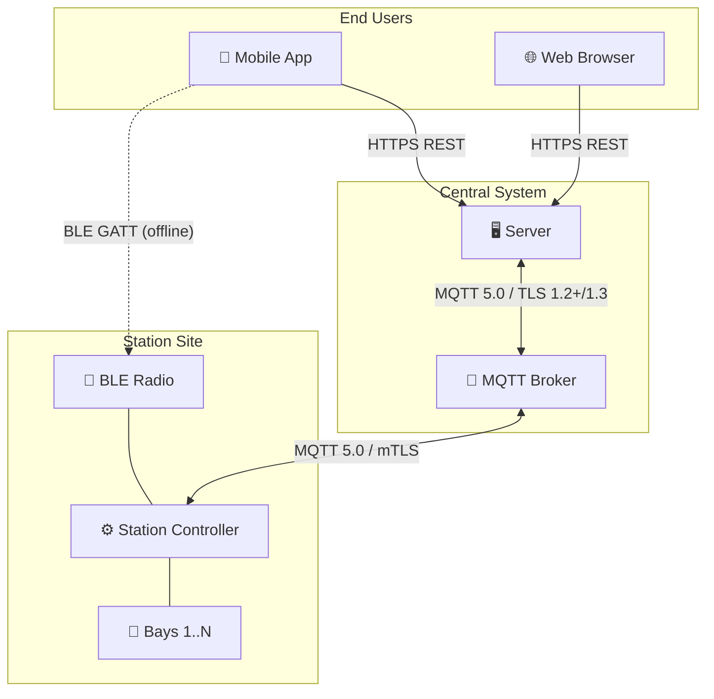

# Chapter 00 — Introduction

> **Status:** Draft | **OSPP Version:** 0.18.0

This chapter establishes the purpose, scope, and conventions for the Open Self-Service Point Protocol (OSPP) specification. It identifies the target audience, defines how normative language is used throughout the document, describes notation and formatting conventions, and provides the normative and informative reference bibliography.

The keywords **MUST**, **MUST NOT**, **REQUIRED**, **SHALL**, **SHALL NOT**, **SHOULD**, **SHOULD NOT**, **RECOMMENDED**, **MAY**, and **OPTIONAL** in this document are to be interpreted as described in [RFC 2119](https://www.rfc-editor.org/rfc/rfc2119) and [RFC 8174](https://www.rfc-editor.org/rfc/rfc8174).

---

## 1. Purpose and Scope

### 1.1 Purpose

The **Open Self-Service Point Protocol (OSPP)** defines a secure, interoperable communication protocol between self-service stations and a central server (also known as CSMS — Central Self-service Management System). OSPP enables station manufacturers, backend operators, and integrators to build systems that work together without proprietary lock-in.

OSPP targets a broad range of self-service verticals, including but not limited to:

- **Car wash stations** -- automated wash bays, self-service pressure wash points
- **Laundry facilities** -- coin-op and app-controlled washers and dryers
- **Vending machines** -- food, beverage, and general merchandise dispensers
- **EV charging stations** -- AC and DC charging points
- **Locker systems** -- parcel lockers, luggage storage

The protocol defines a common set of operations -- boot registration, session lifecycle, status reporting, device management, security, and offline operation -- that apply across these verticals. Domain-specific behavior is captured in **profiles** that extend the core protocol without modifying it.


```mermaid
graph TB
    subgraph "End Users"
        APP["📱 Mobile App"]
        WEB["🌐 Web Browser"]
    end

    subgraph "Central System"
        SERVER["🖥️ Server"]
        BROKER["📡 MQTT Broker"]
    end

    subgraph "Station Site"
        CTRL["⚙️ Station Controller"]
        BLE["📶 BLE Radio"]
        BAY["🚿 Bays 1..N"]
    end

    APP -->|"HTTPS REST"| SERVER
    WEB -->|"HTTPS REST"| SERVER
    SERVER <-->|"MQTT 5.0 / TLS 1.2+/1.3"| BROKER
    BROKER <-->|"MQTT 5.0 / mTLS"| CTRL
    APP -. "BLE GATT (offline)" .-> BLE
    BLE --- CTRL
    CTRL --- BAY
```

> **Figure 1** — OSPP system topology. Solid lines are online paths; dashed lines indicate the BLE offline fallback. See [Chapter 01 — Architecture](01-architecture.md) for the full topology and [diagrams/](../diagrams/) for standalone diagram files.

### 1.2 Scope

This specification covers the following areas:

| Area | Description | Chapters |
|------|-------------|----------|
| **Architecture** | System topology, identity model, hardware abstraction, communication stack | [01](01-architecture.md) |
| **Transport** | MQTT 5.0, BLE GATT, and HTTPS REST bindings with connection lifecycle and QoS | [02](02-transport.md) |
| **Message Catalog** | Normative payload schemas, metadata, and examples for every OSPP message | [03](03-messages.md) |
| **Protocol Flows** | End-to-end sequences for boot, sessions, reservations, offline scenarios | [04](04-flows.md) |
| **Security** | Threat model, PKI trust chain, cryptographic key inventory, provisioning | [06](06-security.md) |
| **State Machines** | Finite state machines for the station, bays, sessions, reservations, BLE connections | [05-state-machines](05-state-machines.md) |
| **Error Handling** | Error code registry, severity levels, retry policies, circuit breakers | [07](07-errors.md) |
| **Configuration** | Configuration key registry with types, defaults, and access modes | [08](08-configuration.md) |

### 1.3 Out of Scope

The following topics are explicitly **outside** the scope of this specification:

- **Station hardware design** -- physical enclosure, sensor selection, actuator wiring, or PCB layout.
- **User interface design** -- mobile app screens, on-station display layouts, or UX flows.
- **Business logic** -- pricing models, loyalty programs, subscription rules, or revenue sharing.
- **Payment processing internals** -- integration with specific payment gateways, PCI DSS compliance procedures, or card-present terminal protocols.
- **Cloud infrastructure** -- server deployment architecture, database schema, or hosting provider selection.
- **Regulatory compliance** -- jurisdiction-specific requirements (e.g., fiscal receipt formats, local data protection law) beyond the general security model defined herein.

Implementers **SHOULD** consult domain-specific standards and local regulations for these areas.

---

## 2. Target Audience

This specification is intended for the following audiences:

| Audience | Interest |
|----------|----------|
| **Station manufacturers** | Implementing the station-side protocol stack (MQTT client, BLE peripheral, message handling, state machines) |
| **Server developers** | Building the server-side components (MQTT broker integration, session management, device management, offline reconciliation) |
| **System integrators** | Connecting OSPP-compliant stations to existing fleet management, payment, or IoT platforms |
| **Mobile application developers** | Implementing the app-side BLE transport and REST API client for session control and offline authorization |
| **IoT platform teams** | Evaluating OSPP for integration into broader IoT ecosystems and device management frameworks |
| **Security auditors** | Reviewing the threat model, cryptographic requirements, and trust chain for compliance assessments |
| **Conformance testers** | Validating implementations against the normative message schemas and protocol flows |

Readers are assumed to have working knowledge of JSON, MQTT, TLS, and REST APIs. Familiarity with BLE GATT is required only for implementers of the offline profile. Prior exposure to OCPP is helpful but not required.

---

## 3. Document Conventions

### 3.1 Normative Keywords

The key words **MUST**, **MUST NOT**, **REQUIRED**, **SHALL**, **SHALL NOT**, **SHOULD**, **SHOULD NOT**, **RECOMMENDED**, **NOT RECOMMENDED**, **MAY**, and **OPTIONAL** in this specification are to be interpreted as described in BCP 14 [[RFC 2119](https://www.rfc-editor.org/rfc/rfc2119)] [[RFC 8174](https://www.rfc-editor.org/rfc/rfc8174)] when, and only when, they appear in **ALL CAPITALS**.

When these words appear in lowercase or mixed case (e.g., "the station must be powered on" or "implementations should consider"), they carry their ordinary English meaning and are not normative requirements.

> **Bold is house style, not a condition of binding.** This paragraph previously read "when, and
> only when, they appear in **BOLD UPPERCASE**", which is stricter than RFC 8174 — the RFC's own
> condition is "all capitals" and it says nothing about weight. The stricter reading was never
> what the specification practised: **496 of the 1391 capitalised MUST/SHALL keywords in `spec/`
> were unbolded**, and 457 of those are plainly obligations — the entire MQTT topic-ACL apparatus
> ([Chapter 02 §6](02-transport.md#6-access-control-acl)), all ten OfflinePass checks
> ([Chapter 06 §6.1.1](06-security.md)), and most of [Chapter 08](08-configuration.md). Nor did
> any other document adopt it: all eighteen chapters and profiles that restate this paragraph
> state the plain BCP 14 form, and the paragraph contradicted itself — the sentence below
> identifies the non-binding case as *lowercase or mixed case*, never as unbolded capitals.
> Authors **SHOULD** still bold normative keywords, per
> [CONTRIBUTING.md](../CONTRIBUTING.md); a keyword that is not bolded is a style defect, not a
> keyword that fails to bind.

### 3.2 Notation and Formatting

The following notation conventions apply throughout this specification:

- **Monospace** (`code font`) is used for field names, message actions, identifier values, topic patterns, and code examples.
- **Angle brackets** (`{field}`) denote variable substitution in topic patterns and URI templates -- e.g., `ospp/v1/stations/{station_id}/to-server`.
- **Enumeration values** are written in **PascalCase** monospace -- e.g., `status: "Available"`, `bootReason: "PowerOn"`.
- **Cross-references** between chapters use the format `see [Chapter NN](NN-name.md), Section X.Y` — for example, "see [Chapter 02](02-transport.md), Section 3.1".
- **Message references** use the format **[MSG-NNN]** where NNN is the zero-padded message number from the Message Catalog.

### 3.3 Identifier Prefixes

All OSPP identifiers use a typed prefix to avoid ambiguity and enable quick visual identification. Implementations **MUST** use these prefixes when generating identifiers.

| Prefix | Entity | Example |
|--------|--------|---------|
| `stn_` | Station | `stn_a1b2c3d4` |
| `bay_` | Bay | `bay_a1b2c3d4` |
| `sess_` | Session | `sess_9f8e7d6c` |
| `svc_` | Service | `svc_premium_wash` |
| `sub_` | Subscriber (user) | `sub_x7y8z9` |
| `rsv_` | Reservation | `rsv_f1e2d3c4` |
| `otx_` | Offline transaction | `otx_b5a6c7d8` |
| `opass_` | Offline pass | `opass_e9f0a1b2` |
| `msg_` | Message | `msg_c3d4e5f6` |
| `fwupd_` | Firmware update | `fwupd_d7e8f9a0` |
| `sec_` | Security event | `sec_e1f2a3b4` |

### 3.4 JSON Representation

All OSPP messages are serialized as JSON [[RFC 8259](https://www.rfc-editor.org/rfc/rfc8259)]. JSON examples in this specification are pretty-printed for readability. On the wire, implementations **MAY** transmit compact (whitespace-stripped) JSON.

Comments appearing in JSON examples (prefixed with `//`) are for illustration only and **MUST NOT** appear in actual messages. Ellipsis (`...`) in examples indicates omitted fields or repetition.

```json
{
  "messageId": "msg_c3d4e5f6",         // RFC 4122 UUID — unique per message
  "messageType": "Request",
  "action": "StartService",
  "timestamp": "2026-02-13T10:30:00.000Z",  // ISO 8601 — always UTC, milliseconds required
  "source": "Server",
  "protocolVersion": "0.3.0",
  "payload": { ... }
}
```

### 3.5 Schema Language

Message payload schemas are defined using **JSON Schema Draft 2020-12**. Machine-readable schema files are provided in the companion `schemas/` directory. Where the prose description and the JSON Schema disagree, the JSON Schema is authoritative.

### 3.6 Timestamps

All timestamps in OSPP messages **MUST** be formatted as ISO 8601 strings in UTC with the `Z` suffix and millisecond precision -- e.g., `"2026-02-13T10:30:00.000Z"` or `"2026-02-13T10:30:00.123Z"`. Exactly three decimal places **MUST** be present, including when they are zero: a timestamp that omits them, or that carries any other number of them, is rejected by [`timestamp.schema.json`](../schemas/common/timestamp.schema.json). Implementations **MUST NOT** use timezone offsets other than `Z`.

### 3.7 Encoding

All text in OSPP messages **MUST** be encoded as UTF-8. Implementations **MUST** reject messages containing invalid UTF-8 sequences with error code `1005 INVALID_MESSAGE_FORMAT` (see [Chapter 07](07-errors.md)).

### 3.8 Diagrams

Protocol flows and state machines are illustrated with [Mermaid](https://mermaid.js.org/) diagrams embedded directly in the specification markdown. These diagrams are informative -- the normative behavior is defined by the accompanying prose.

### 3.9 Chapter Organization

The specification is organized into numbered chapters for stable cross-referencing:

| Chapter | Title |
|---------|-------|
| 00 | Introduction (this chapter) |
| 01 | Architecture |
| 02 | Transport |
| 03 | Message Catalog |
| 04 | Protocol Flows |
| 05 | State Machines |
| 06 | Security |
| 07 | Error Codes & Resilience |
| 08 | Configuration |
| -- | Glossary |

---

## 4. Normative References

The following documents are referenced normatively in this specification. Implementations claiming OSPP conformance **MUST** comply with the applicable requirements from these references.

| Reference | Title | Link |
|-----------|-------|------|
| [RFC 2119] | Key words for use in RFCs to Indicate Requirement Levels | https://www.rfc-editor.org/rfc/rfc2119 |
| [RFC 8174] | Ambiguity of Uppercase vs Lowercase in RFC 2119 Key Words | https://www.rfc-editor.org/rfc/rfc8174 |
| [RFC 8446] | The Transport Layer Security (TLS) Protocol Version 1.3 | https://www.rfc-editor.org/rfc/rfc8446 |
| [RFC 8259] | The JavaScript Object Notation (JSON) Data Interchange Format | https://www.rfc-editor.org/rfc/rfc8259 |
| [RFC 4122] | A Universally Unique IDentifier (UUID) URN Namespace | https://www.rfc-editor.org/rfc/rfc4122 |
| [MQTT 5.0] | MQTT Version 5.0 (OASIS Standard) | https://docs.oasis-open.org/mqtt/mqtt/v5.0/mqtt-v5.0.html |
| [JSON Schema 2020-12] | JSON Schema: A Media Type for Describing JSON Documents | https://json-schema.org/draft/2020-12/json-schema-core |
| [ISO 8601] | Date and time -- Representations for information interchange | https://www.iso.org/standard/70907.html |
| [BT Core 5.3] | Bluetooth Core Specification v5.3 | https://www.bluetooth.com/specifications/specs/core-specification-5-3/ |

---

## 5. Informative References

The following documents provide additional context and prior art. They are not normatively binding but are recommended reading for implementers.

| Reference | Title | Link |
|-----------|-------|------|
| [OCPP 2.0.1] | Open Charge Point Protocol 2.0.1 | https://openchargealliance.org/protocols/ocpp-201/ |
| [OWASP IoT Top 10] | OWASP Internet of Things Top 10 (2018) | https://owasp.org/www-project-internet-of-things/ |
| [NIST SP 800-183] | Networks of 'Things' (IoT Reference Architecture) | https://csrc.nist.gov/publications/detail/sp/800-183/final |
| [AsyncAPI 3.0] | AsyncAPI Specification 3.0 | https://www.asyncapi.com/docs/reference/specification/v3.0.0 |
| [NIST SP 800-57] | Recommendation for Key Management | https://csrc.nist.gov/publications/detail/sp/800-57-part-1/rev-5/final |

---

## 6. Document History

| Version | Date | Author | Changes |
|---------|------|--------|---------|
| 0.1.0-draft.1 | 2026-02-13 | OSPP Authors | Initial public draft. |
| 0.2.0 | 2026-03-20 | OSPP Authors | SessionEnded EVENT (MSG-040), Unknown bay state handling, TransactionEvent authoring fixes, example validation fixes. |
| 0.2.1 | 2026-03-21 | OSPP Authors | `supportedVersions` in BootNotification RESPONSE for protocol version negotiation (1007). |
| 0.2.2 | 2026-03-22 | OSPP Authors | Update all `protocolVersion` example values from 0.1.0 to 0.2.1. |
| 0.2.3 | 2026-03-22 | OSPP Authors | Add SessionEnded EVENT to HMAC signing table in 06-security.md. |
| 0.2.4 | 2026-03-22 | OSPP Authors | Reclassify SessionEnded as HMAC-signed (YES) — contains billing data. |
| 0.2.5 | 2026-04-30 | OSPP Authors | `provisioning-response.schema.json` (top-level HTTP schema) for `POST /api/v1/stations/provision` response body. |
| 0.3.0 | 2026-05-06 | OSPP Authors | Provisioning trust anchors split (`stationCaChain` + `brokerRootCa`); normative MUST that station consumes `mqttConfig.brokerUri`. |
| 0.4.0 | 2026-05-07 | OSPP Authors | Brief Q comprehensive patches: CSMS as cost authority, <50% refund scope clarified, OSPP Session Retention Horizon (24h), MeterValues + SessionEnded message-expiry, OSPP Canonical Form formalized (§4.8), per-session seqNo + finalSeqNo + NVS persistence, SessionEnded reason vocabulary extended (Local, LocalOutOfCredit, Deauthorized). |
| 0.4.1 | 2026-06-04 | OSPP Authors | SecurityEvent dedup contract tightening: `security-event.md` §6 (rule 2) normative MUST for `eventId` stability across QoS-1 retransmits and buffered replays; `authorize-offline-pass.md` §6 (rule 7) SHOULD→MUST with negative-space clause (only checks #1 and #5 emit; other Rejected outcomes MUST NOT), `type` MUST be `OfflinePassRejected`, and `eventId` MUST be deterministically derived from the originating REQUEST's `messageId` (preserves per-attempt visibility for forgery probing and cross-station replay attempts). |
| 0.4.2 | 2026-06-05 | OSPP Authors | Reconcile-Time Re-validation Gate (`reconciliation.md` §6, NEW) — 11 hard-reject checks before fraud scoring (receipt cross-checks, pass-found, pass-user, deviceId, org, station, expiry, revocation epoch, individual revoke). `06-security.md` §6.2 receipt_fields expanded to 12 (added offlinePassId/userId/deviceId, signed). (M) fix: signing + verification converge on canonical-bytes hash (drops the dead-code base64 intermediate). `offline-pass.md` §2 + §7: new `organization_id` field + Org-scoped property; "unscoped" semantics defined as "any station of the issuing org." 4 new error codes (2014/2015/2016/2017), 2003 promoted to hard-reject at reconcile-time. BLE FFF6 wrapper extended for symmetry with signed inner. Coordinated v0.4.1 → v0.4.2 stack upgrade; pre-launch context (0 offline_passes on prod) makes the break clean. |
| 0.5.0 | 2026-06-06 | OSPP Authors | Lockstep re-synchronization release across `spec` + `ospp-sdk-php` + `sdk-ts` ([ADR-001](../adr/ADR-001-cross-repo-lockstep-versioning.md)). `transaction-event-response.schema.json` `status` enum gains `Deferred` (closes the §4.2:52 spec gap — server already emitted the value, schema didn't admit it). `reconciliation.md §4.1`/`§4.2` document the `Deferred` wire shape + the `Deferred`-vs-`RetryLater` semantic distinction (operator-manual unblock vs. transient-backoff-retry). `§6.3`/`§6.5` clarify gate-emit-before-INSERT ordering for check #4 (FK is belt-and-suspenders for non-gate paths, not the conforming reconciliation path). |
| 0.6.0 | 2026-06-20 | OSPP Authors | BLE handshake security (D1, [ADR-002](../adr/ADR-002-ble-handshake-security-architecture.md)): authenticated application-layer ECDH (`IKM = es ‖ ee ‖ appNonce ‖ stationNonce`), StationIdentity certificate (§6.5.2), BLE AEAD channel (ChaCha20-Poly1305 IETF, §6.5.3), `Hello`/`Challenge` ephemeral-key wire format, BLE pairing demoted to OPTIONAL, `sessionProof` canonical definition moved to `ble-handshake.md` §4.1. Lockstep with `ospp-sdk-php` + `sdk-ts`. |
| 0.6.1 | 2026-06-21 | OSPP Authors | Reconciliation + Partial-A (S2, decisions D2/D3): the reconcile-time re-validation gate grows to 13 checks (passCounter receipt cross-check #12 + cross-station `(offlinePassId, passCounter)` uniqueness #13, finding N7); revocation epoch anchored at transaction time (#10, §6.6, N8); discriminated (`oneOf`) signed receipt + envelope (pass-form `{offlinePassId, passCounter}` vs auth-form `{authId, sessionId}`, N2/Q4) making Partial-A reconcilable; ServerSignedAuth claims gain signed `durationSeconds`/`creditsAuthorized` (10→12, N3); settle-once wallet true-up (§8.2, N11); `ServerSignedAuthReplay` SecurityEvent type (error 2018). Lockstep re-vendor of `spec/schemas/`. |
| 0.6.2 | 2026-06-22 | OSPP Authors | SDK enum catch-up (lockstep, ADR-001), no spec content change: `ServerSignedAuthReplay` SecurityEvent type + error `2018 SERVER_AUTH_NONCE_MISMATCH` — both fully specified in 0.6.1 — are mirrored into the `ospp-sdk-php` / `sdk-ts` enum types (Critical, non-recoverable, httpStatus 401). `spec/schemas/` byte-identical to 0.6.1; version-header cascade only. |
| 0.8.0 | 2026-07-13 | OSPP Authors | Config vocabulary alignment: removed 12 unused keys (SecurityProfile, 8 BLE keys, Locale, StatusNotificationInterval, EventThrottleSeconds); corrected 4 key defaults/ranges; total 41→29. Wire protocolVersion unchanged (0.2.1). |
| 0.7.0 | 2026-07-10 | OSPP Authors | TLS 1.2 floor amendment: `02-transport.md` §1.3 relaxes the TLS-1.3-only rule to a TLS-1.2 floor with TLS 1.3 RECOMMENDED-and-negotiated-when-supported, admitting constrained cellular modems (e.g. SIMCom A7608E-H) with no firmware path to 1.3; cipher suite list extended to 4 entries (2× TLS 1.3 AES-GCM + 2× TLS 1.2 ECDHE-ECDSA-GCM, `TLS_CHACHA20_POLY1305_SHA256` dropped from the offered set); `06-security.md` cipher table, threat-model, and checklist references updated to match. All other chapter/profile mentions of a hard TLS-1.3-only requirement (connection-sequence diagrams, protocol summary tables, algorithm inventory) updated for consistency. `04-flows.md` §2 (Station Provisioning) gains a "Single-use and idempotent retry" subsection formalizing same-token retry idempotency within the 24h TTL and the 401 conditions (expired/beyond TTL, superseded, revoked); the error-path table's 401 row is broadened to match, and `02-transport.md` §9.3 gains a provisioning-token idempotency note cross-referencing it. |
| 0.9.0 | 2026-07-29 | OSPP Authors | **Three independent breaking bodies, each for a different audience.** **(A) Station certificate validation is fail-closed — breaking for conformance claims, no wire change.** `06-security.md` §2.1 gains the consequence it never stated: a station that cannot validate a server certificate **MUST refuse**, across all four cells (no anchor obtainable / anchor present with a failing chain, on the MQTT leg and the pre-credential HTTPS provisioning leg), with *refuse* defined as the connection not completed and the call not made, and "recording the failure and continuing" explicitly non-conforming. Previously, connecting without authenticating the server was conforming — and on hardware with no system trust store it was the *default* outcome. `01-architecture.md` §7.2 gains a *Broker trust policy* row (row 5, placement chosen to preserve two dependent sentences); `reset.md` makes that row survive a reset as the HTTPS row already did; `provisioning-response.schema.json`'s `stationCaChain` description no longer names `brokerRootCa` as the universal anchor (description-only, no validation change); conformance gains **TC-SEC-008** — the first case with the **station** as implementation under test — and **TC-SEC-007**, pinning the provisioning success response. **(B) BREAKING (response enum): `Deferred` is retired.** `status` returns to four values — `Accepted` / `Duplicate` / `Rejected` / `RetryLater`. The txCounter gap-detection and gap-blocking machinery it existed to express goes with it: `reconciliation.md` §4 becomes "Transaction Counter (Forensic)" — the counter is persisted as evidence and **gates nothing** — the strict-ordering MUST becomes a SHOULD, the `lastReconciledCounter` watermark and its `Duplicate`-on-low-counter branch are deleted (that branch destroyed money on a power cycle), and every "operator-manual unblock" reference goes (an exit referenced in five documents and defined in none). §6.3 is rewritten as forensic framing with a new §6.3.1; the §7.4 `Counter gap detected +0.30` fraud factor is removed — it scored a **station** property against **user** sanctions. Replay protection is unchanged and was never carried by `txCounter`: it is `(offlinePassId, passCounter)` uniqueness (§6.1 check #13) on an **app**-generated counter, plus the §7.4 cross-station cumulative factors. See the 0.5.0 row below — `Deferred` was ratified into the schema on 2026-06-06 *after* the server had already emitted it; it never had a rationale independent of the gap rule. **(C) BREAKING (validation): `errorText` is enforced as UPPER_SNAKE_CASE** on the 16 declarations across 15 schemas where it pairs with `errorCode`. Fifteen constrained length only, so a raw validator diagnostic reached firmware in the field §1.3 reserves for programmatic matching. Breaking for **producers**; no shipped valid vector breaks. Eight contradictory field descriptions corrected and five invalid vectors given the registry name of the code they declare. Also: `03-messages.md` §6.4's UpdateFirmware example gains the `signature` it lists as Required. |
| 0.10.0 | 2026-07-30 | OSPP Authors | **`Unknown` leaves the wire — breaking for stations, no change to the state machine.** `bay-status.schema.json` narrows from seven values to the six **reportable** ones; `Unknown` is entered only at power-on (station) and on connection loss (server) and is carried by no message, so a station **MUST NOT** report it in `status` or `previousStatus`. `previousStatus` is now **MUST-omit** on the post-boot report rather than merely permitted to be absent, since the state being left is one the field cannot express. The bay FSM keeps all seven states and its transition table is untouched; neither SDK loses an enum member, because both need `Unknown` for state they hold and never send. `protocolVersion` does not move. |
| 0.11.0 | 2026-08-05 | OSPP Authors | **Five arcs, breaking on the wire, and the wire version moves with them: `protocolVersion` → `0.3.0`.** **(A) Topology.** The station declares `bays[]` with each bay's `programNumbers`; `bayIds` and `bayCount` are deleted outright. A bay's **programs** (firmware constants the station owns) are separated from **services** (commercial offers the server mints), so StatusNotification reports `programs[]` — the old shape made a conforming first boot impossible. Bounds set at 64 bays × 32 programs. `3017` and `3018` added; registry 114 → 116. **(B) TLS identity — breaking for conformance, no wire change.** The station **MUST** verify the server certificate's *identity* over RFC 9525 on both the MQTT and the pre-credential HTTPS leg, CN fallback prohibited; `TC-SEC-009` pins it. **(C) Reset and negotiation.** Remote credential wipe leaves the wire — one reboot operation with an optional `force`; factory reset is physical. Version negotiation becomes **exact match** against a server-held set, replacing a MAJOR gate that classified every `0.x` pair as compatible. **(D) Boot and signing.** The station gains its own state machine at §1, with `Pending` and `Rejected` defined as **restricted** states; `bootReason` gains `Reconnect`. Everything on the wire is signed — 44 of 47 message types — and `sessionKey` becomes REQUIRED on every `Accepted` **and** every `Pending` response, without which the repair channel `Pending` exists for could not be used. **(E) Bay FSM and reconcile.** One canonical transition table with an `Effected by` column — 20 `Station` rows, 6 `Server`, 26 in all — `Unavailable → Faulted` made legal, `Unknown` given five exits so a station that reboots mid-session has a truthful report, and an invalid transition accepted as authoritative rather than refused. The reconcile pass closed the counts and cross-references the other four left inconsistent, and the compose pass found that a restricted station was required to settle a session it was forbidden to report. |
| 0.11.1 | 2026-08-07 | OSPP Authors | **Arc 6 — the eleven defects the reference implementation hit while building against v0.11.0**, most found on a live wire rather than by reading. `SessionEndReason` gains `OperatorStopped` and `04-flows.md` gains **the operator-disable policy** it belongs to — named in four places and defined in none; a forced Reset had no reason to settle with, and the nearest member (`Deauthorized`) mandates billing at zero, so a correct reading delivered a wash and charged nothing. This is the release's one wire-touching change. `3019 SERVICE_NOT_BOUND` (the server holds no service→program binding, the mirror of `3017`) and `6008 COMMAND_PRE_EMPTED` (carrying `details.wouldBe`, so a refusal that never left the server is distinguishable from one the station gave) are added. `4020`'s recommended action stops directing an integrator to compare two **counts** — a swapped bay leaves both equal, the exact case the set comparison exists to catch. `05-state-machines.md` states that a **generated type** must not gain `Unknown` back, addressed to a code generator rather than to a reader. `VERSIONING.md` gains *Adding a REQUIRED field, and which side moves first*. `protocolVersion` stays `0.3.0`. |
| 0.11.2 | 2026-08-07 | OSPP Authors | **Arc 7 — the twelve defects taken back to the spec and verified before being acted on; eleven were already closed, and the twelfth had been closed on the SDK side.** What the arc found was not on the list: **the repair for the headline defect was itself defective.** Arc 6 rewrote `4020`'s *Recommended Action* correctly and, at **1245** characters against Appendix C's `maxLength` of **500**, made it unemittable — a right answer in a form no conforming server can put on the wire — and `3017` (551) and `3018` (534) had gone the same way. All three shortened in full, and the bound §1.4 only asserted is now **measured** by `tools/verify-protocol.sh`, read from Appendix C rather than hardcoded. Registry counts, the LWT signing exemption's missing citation, and a BLE `StationInfo` still carrying the count scalar MQTT deleted in v0.11.0 are also repaired. **The document version moves, and gains a rule.** It had not moved across two releases — a reader holding `v0.11.1` saw `0.11.0` in all 22 headers — because nothing said it had to; [VERSIONING.md](../VERSIONING.md) now states that it equals the release tag, enumerates the sites that carry it, and `verify-protocol.sh` checks they agree. No wire change, no schema change: `protocolVersion` stays `0.3.0`. |
| 0.12.0 | 2026-08-11 | OSPP Authors | **The RFC 2119 bold-only qualifier is dropped, and 457 obligations that did not bind now bind.** §3.1 read "when, and only when, they appear in **BOLD UPPERCASE**" — a condition on *weight* that [RFC 8174](https://www.rfc-editor.org/rfc/rfc8174), the authority it cites, does not impose. **496 of the 1391** capitalised `MUST`/`SHALL` keywords in `spec/` are unbolded and were therefore non-binding; **457 are genuine obligations**, including the whole MQTT topic-ACL apparatus, all ten OfflinePass checks, and most of Chapter 08. **Conformance-breaking without being wire-breaking** — an implementation conformant against v0.11.2 may be non-conformant against v0.12.0 having changed nothing — which is why the release is MINOR and not PATCH. Nothing on the wire moves: no message shape, field, enum or schema constraint changes and `protocolVersion` stays `0.3.0`. Out of a corpus-wide sweep for *prose claiming enforcement nothing performs* — **58 instances found, 28 closed** — three checkable sub-shapes became ratchet gates in `tools/` with a workflow that calls them. `maxCreditsPerTx` is restated as a **decline threshold**: the Full Offline example taught capping with a formula and a rationale, against three normative sites that reject with `4004`, and now shows the client sizing its request from the limit the pass carries. |
| 0.12.1 | 2026-08-11 | OSPP Authors | **A duplicate `offlineTxId` was two situations wearing one word, and the corpus could not be repaired around it.** Three conformance cases stimulated the same condition and two mandated `Duplicate` while one mandated `Accepted`; the spec said both, four normative sites each way, all from the initial commit. Resolved by comparison: a **byte-identical** signed `receipt.data` is a retransmission and is answered `Duplicate`; a **differing** one is two claims under one identifier and is answered `Rejected`, with both records retained and an operator alert. `Duplicate` could not cover the second case because it orders the station to delete its local copy — one of the two records [§9](../spec/profiles/offline/reconciliation.md) requires be kept. So each status now states **two separate obligations**, whether to send again and what to do with the local record, which the text had conflated under the single word *delete*. **No wire change:** `Rejected` is already in the enum and already carries the `MUST NOT` retry obligation; no new status, no `reason` enum, no new field or error code. Also repaired: `Accepted`'s delete-versus-purge-after-72h contradiction, `Rejected`'s `MUST`-flag versus `MAY`-flag, `RetryLater` pointing at a `retryInterval` the closed response schema cannot carry, and the cross-channel case, now explicitly marked unspecified. **The conformance corpus:** `TC-OFF-001` taught an unauthenticated BLE handshake and a key schedule two versions stale, contradicting its own golden vector; `TC-SEC-001` MAC'd the payload rather than the envelope; `TC-DM-002` omitted the REQUIRED firmware `signature`; `programNumber` was missing from 13 StartService payloads. A firmware example carried `sha256("test")` as the checksum of an image whose signature was over the real binary — which is also why the repo's signer was not idempotent at `v0.12.0`. PATCH: the corpus changes what gets tested, not what binds, so a compliance claim resting on the corrected cases was never valid. `protocolVersion` stays `0.3.0`. |
| 0.13.0 | 2026-08-11 | OSPP Authors | **Four defects that each survived because the check that should have caught them was looking somewhere else.** **(A)** CORE-010 stated **MUST** where `heartbeat.md` §6 — the document firmware implements — states `MUST` compare / `SHOULD` adjust. `SHOULD` is correct, decided from what the rule protects: duration runs on a monotonic timer, anti-replay uses `messageId` binding and counters, and the one consumer of station timestamps declares its own tolerance as *several minutes*. The hard boundary is 5 minutes and it is a `MUST`. The rule was stated in **four** places — `02-transport.md` §10.3 also carried an unconditional `MUST` and a **5-second** warning threshold against §6's **5 minutes** — and all four now agree, because a partial repair is the failure this registry already named *worse than the original defect*. **(B)** §3.6 mandated millisecond precision and demonstrated it with a value its own schema rejects, untouched since the initial commit, while KNOWN-ISSUES V2-050 recorded the repair as done; the false row is the larger defect and now says so. The gate that missed it did not scan `spec/` and, in the trees it did scan, read only parsed JSON blocks — prose was invisible; roots extended and the markdown path now reads raw text, 95 files to 126. **(C)** §5.4's `HMAC-SHA256(sessionKey, …)` never said the key is the **decoded 32 bytes** rather than the 44-character Base64 text, though the spec says exactly that for the BLE nonces and the receipt. Both SDKs already decoded, making it convention rather than requirement. Now stated, and pinned by the corpus's first MQTT MAC vector — four independent oracles, recording the value the literal reading produces so the two are distinguishable, and recomputed on every run as Category 19. **(D)** `SessionEnded` belonged to **no profile**: 39 of 40 messages were assigned and it was the fortieth, so a station implementing every profile as written would not implement the sole billing source for autonomous terminations. Assigned to **Transaction**, mandatory from Standard upward. That assignment is what makes this MINOR. **(E)** §4.8.1 is now implemented once in the toolchain and pinned by 17 vectors. `verify-mqtt-mac.mjs` had shipped `Object.keys().sort()` — UTF-16 order where :679 requires UTF-8 **bytes** — the third implementation of that rule carrying the defect both SDKs had just been repaired for, passing only because its vector was ASCII. The new module is written from the text and deliberately does **not** import the SDK's: a gate that canonicalizes with the SDK verifies the SDK against itself. The vectors were recomputed from the rules before adoption, and Category 20 asserts they still **reject** a broken canonicalizer. §4.8.1's own gaps closed with it — the escape example was literally `A`, mangled out of `\u0041`, and `U+007F` DEL is now stated as literal, since *minimal required* means required by RFC 8259, which does not require it. `protocolVersion` stays `0.3.0`. |
| 0.14.0 | 2026-08-12 | OSPP Authors | **A session-cycle consistency pass: 31 claimed self-contradictions re-verified one at a time, one disproved, the rest repaired.** The disproof matters as much as the repairs — the claim that timer expiry orders *both* a StopService *and* a SessionEnded rested on a quote cut at a semicolon; the transition row's Action column already reads *"if duration elapsed, station auto-transitions"*, and **no site anywhere** says the server commands a stop on timer expiry. One loose state description was reworded instead. **MINOR is carried by two obligation changes:** the CancelReservation StatusNotification moves **SHOULD → MUST** (the sibling repair already made in `reserve-bay.md` and never swept to the cancel path), and `TC-TX-003` stops requiring a conforming station to answer `3006` to a duplicate StopService that three chapters mandate be answered with the **cached response** — a case unchanged since the initial commit and never reconciled with the rule `0.4.0` added. That case carried two further defects: it applied the `Fault`-only low-delivery override to a **server-commanded stop**, contradicting its own Purpose line, and demanded *"strictly proportional"* credits, a third billing basis the normative rounded-up formula cannot satisfy. **The refund override** was defined once as the configurable `faultFullRefundThreshold` and hardcoded as `50%`/`0.5` on **24 lines across 11 files**, two of them in the chapter that forbids hardcoding; its definition also mandated configurability and *"lockstep"* with the spec value in one sentence. Every policy site now names the parameter. **Settlement by service kind** named the OSPP catalog as its carrier, whose schema is `additionalProperties: false` and would reject it `5023`; it is now stated as server-side product data, and therefore not conformance-testable — which is why no case exercises it. Three sites that restated pro-rata unconditionally now **defer** rather than restate. Also: the credit formula's canonical worked example overcharged by **9 credits (29%)** and a second by 1; `SessionEnded`'s `seqNo` was defined as a repeat where four sites require an increment of 1; `values: {}` validated against a `MUST` that it not; `deviceId` sat at the top level of four TransactionEvent payloads that `additionalProperties: false` rejects; and six profile documents' error-code trailers understated their own tables. **Four contradictions are deliberately left open** and recorded in the changelog — each needs a product decision about money or firmware behaviour, not a choice of which sentence is older. No wire change; `protocolVersion` stays `0.3.0`. |
| 0.15.0 | 2026-08-12 | OSPP Authors | **A command-cycle consistency pass that opens by repairing the release before it.** `0.14.0`'s MeterValues expiry correction landed on the **wrong message**: two per-message blocks carried the byte-identical string `\| **Message Expiry** \| 30 seconds \|` and the edit took the first, which is AuthorizeOfflinePass. The announced defect therefore shipped unfixed (MeterValues still `30 s` against the defining table's `120 s`) and a second was created (AuthorizeOfflinePass `120 s` against its own Appendix B row of `30 s`, citing a §5.1 category whose only member is MeterValues). The companion Appendix B edit was correct, which is why it looked done, and **Category 4 *Numeric Consistency* passed 29/29 throughout** — nothing cross-checks a per-message block against the category it names. Both restored, each now naming its category so the lines are no longer interchangeable. **CertificateInstall** read `300 s` against §5.1's `60 s`, the lone dissenter in a category row whose two other members both state `60 s` in their own blocks, and unusable anyway against a **30 s Station Max Age**. **MINOR is carried by two obligation changes:** TriggerMessage gains the **MUST**/**MUST NOT** separating `NotImplemented` (the **argument** is unsupported) from `2007` (the **action** is), which the spec carried as two answers to one question; and `03-messages.md` §6.9 loses a station-side *"MAY retry once after 10 seconds"* for a **Server → Station** command the station receives and therefore cannot re-send — three sites give that retry to the server, and it now defers to §5.3. Also: §6.3 told the server to probe a HALF-OPEN breaker with **Heartbeat**, which is Station → Server and has no server-sent schema, contradicting both §6.1 and its own *any action* success threshold; §5.3 never said what its retry delays are measured **from**, and read from first dispatch the second attempt goes out while the first is still inside its own timeout; and **Appendix C gains the `6008` block** its own rule has required since `0.8.0` — `6008` arrived three minors later and was the first branching entry added after that rule and the first to break it. **Five contradictions were decided rather than merely reported.** A station refusing on a **full command queue** answered `6001 SERVER_INTERNAL_ERROR`, which `§1.1` ranges as a **server** code and `§3.6` defines as *"generated by the server"*; it is **`5107 OPERATION_IN_PROGRESS`** now — an existing code already describing the condition, extended rather than duplicated. **`6008` is widened to the two kinds of pre-empt it always had**: a predicted station refusal carrying `details.wouldBe`, and a **server-protective** one carrying none, which is how §6.3's open circuit breaker stops answering `6002 ACK_TIMEOUT` to a command it says outright it never sent. `details.reason` moves **SHOULD → MUST** as the member common to both; `6002` is left exactly as it is, because amending it would rebuild the confusion `6008` exists to prevent. The **fail-safe default** for an absent `wouldBe` is the **refusal** — if what the station would have said cannot be stated, neither can the safety of proceeding. `6008`'s **scope** is stated: reachable from the two in-scope session endpoints, and from operator surfaces `§2.4` declines to define, where it is therefore **not conformance-testable**. And the TriggerMessage rate limit is **per station**, since fleet-wide would let one mute station throttle the estate. `protocolVersion` stays `0.3.0`, but two answers change on the wire — the queue refusal and the pre-empted dispatch. |
| 0.16.0 | 2026-08-13 | OSPP Authors | **A configuration-cycle consistency pass, and the finding that matters most is a disproof.** A server-side note held that two conformance cases still taught a ChangeConfiguration response shape the schema forbids — a bare top-level `status`. They do not: `f872b23` repaired TC-DM-001 and TC-DM-006 on 2026-08-10, released in `0.12.0`, and both now assert the opposite explicitly. The note was correct when written and was carried forward unmeasured. **`Accepted` meant two incompatible things and one of them could revoke a signing key.** §8.2's status table and `change-configuration.md` §5 both defined it as *applied*, while the atomicity **MUST** three chapters state makes it a per-key **validation verdict** that applies nothing if any sibling entry is `Rejected` or `NotSupported`. `06-security.md` §6.7 then counted a station as holding a rotated OfflinePass key *"when, and only when, it has returned `Accepted`"* — so a batch carrying one rejected key would mark the station rolled out and the old signing key would be revoked out from under it. Both definitions are batch-conditional now, §6.7 carries the proviso and a **RECOMMENDED** single-key batch, and the implementors' guide gains a Security Pitfall and a checklist item naming the rotation finalizer as the code to audit. **Two examples taught the wrong shape:** §8.4 answered for `FirmwareVersion` against a request that never sent it, breaking the one-entry-per-request-key **MUST** in the same file, and §8.5 answered `RebootRequired` for a **Dynamic** key with the same `messageId` as §8.2's `Accepted`. **The registry states itself twice and nothing compared the statements:** §§2--6 carry Range and Description, §9 an index and a profile label, and the two live gates each read only one. §9 is declared derived, §§2--6 normative, and `tools/check-config-ranges.py` compares them. **Four contradictions were decided.** The heartbeat range: the registry read `30--3600` against `10--3600` at four sites including its own schema, and the registry was the wrong side — widened, since the schema is what validates and `heartbeat.md` had clamped to the lower floor all along; the staleness threshold can now fall to 35 s, which detects a dead station sooner. Its **disposition** was a separate disagreement that widening does not settle — §8.2 rule 4 rejects an out-of-range value where `heartbeat.md` clamped it — and `TC-DM-006` Part E is the executable witness for rejection, so the clamp is scoped to intervals arriving by any path other than ChangeConfiguration. §1.5 gains a normative **Profile ID** column, because `Offline / BLE` does not survive being made an enum case and two SDKs produced three spellings with nothing to compare against; each SDK now has exactly one value to change. **Device Management becomes capability-conditional**, matching the Offline / BLE row: its four keys have no protocol surface of their own, since GetConfiguration and ChangeConfiguration are themselves Device Management actions. **`retryInterval` against `BootRetryInterval` was examined and left open** — that schema states `minimum` 1 and no maximum, a type floor rather than a considered range, so the heartbeat reasoning does not reach it and aligning the registry would delete the constraint instead of correcting it. **MINOR is carried by four obligation changes.** `protocolVersion` stays `0.3.0` and no schema changes, but what a station must accept in one of them does. |
| 0.17.0 | 2026-08-13 | OSPP Authors | **§6.7 described one rotation, and the other one needs the opposite behaviour from the same step.** The section opens with *"**MUST** be rotated periodically"*, gives an annual cadence, and ends with a step 5 forbidding revocation of the previous key while any station remains unconfirmed — right for a scheduled rotation, which faces no adversary, and silent on rotating a key **because it is believed to be compromised**. Two conformant servers could disagree about when revocation is permitted, each citing the same paragraph. **The measurement inverted the premise the arc started from.** The concern was that waiting for the cohort keeps a compromised key alive; it does not, because destroying the server's copy was never what kills the key — this specification defines no CRL, no epoch and no distribution mechanism for the server signing key, so the only thing that ends an attacker's capability at a station is that station receiving the replacement. What happens to an unconfirmed station is the reverse of the scheduled case: under scheduled rotation it **loses** the ability to verify passes the server signed, an availability failure; under compromise it **keeps** verifying, including everything the attacker signs. It does not fail closed, it stays open — the harm is integrity and settlement, and the priority inverts with it from *revoke last* to **reach every station first**. **§6.7.1 names the two postures and adds nothing to the wire**, which is the form §4.7.2 already uses for a compromised station certificate (one of three triggers into one unchanged renewal flow, on a message with no reason field) and §4.3 for a compromised receipt-signing key. The posture is an operator declaration, and it can only be one: no station can detect the compromise of a *server* key, and the nearest SecurityEvent type reports a pass that **failed** verification — the opposite signal, since a pass forged under a valid key passes every check. Under compromise the server **SHOULD** destroy the previous private key immediately: the key's only remaining use is signing, which no updated station accepts and which is what the attacker is already doing with the copy the server cannot destroy. **Dual signing is unconstructible, not unimplemented**, and the section now says so — an updated station **MUST** have discarded the cached previous key, an un-updated one holds only the previous key, and per-station selection is impossible because the registry key is single-valued, an OfflinePass carries no key identifier, and a pass is not bound to a station on the wire. **The certificate escalation was written down nowhere:** StationIdentity issuance reuses the OfflinePass signing path, so a holder of the key can mint an identity for a station that does not exist and harvest **real** passes from apps — updating every station closes the forgery half and leaves this one open. **Why the gate exists here and nowhere else** is now stated rather than left accidental: step 5 is OSPP's only revocation conditioned on fleet confirmation, against CRL for station certificates, an immediate epoch bump for OfflinePasses, and expiry for StationIdentity. **The previous-key acceptance window is bounded at the two sites that stated it without a bound** — the registry row and `offline-pass.md` §3, against five sites that bound it — because the unbounded reading leaves a superseded key acceptable at every updated station indefinitely, until a second rotation displaces it. A wire mechanism to cut the grace period short was evaluated and **rejected**, recorded in `KNOWN-ISSUES.md` with its cost and with what would reopen it. **MINOR is carried by two obligation changes.** `protocolVersion` stays `0.3.0`, no schema changes, and no field, message or configuration key is added in either direction. |
| 0.17.1 | 2026-08-13 | OSPP Authors | **A certificate-cycle consistency pass: three index-level statements corrected, three contradictions recorded rather than guessed at.** All three corrections sit in documents that *index* normative text and disagree with the file they point at — and `profiles/security/README.md` §1 states the rule it then broke twice in its own tables: it *"indexes them and states nothing about them that file does not."* **SecurityEvent was `[MSG-021]` in one place and MSG-012 in forty-eight**; MSG-021 is UpdateServiceCatalog, so the single dissenting site was the index of a profile mandatory at Standard and above, and a station built from that line emits a message nothing recognises. **CertificateInstall was said to deliver *"an issued certificate, or a trust anchor"***, which it has no way to carry: `certificate-install-request.schema.json` is a two-value enum — `StationCertificate`, `MQTTClientCertificate` — with `additionalProperties: false`, and the optional `caCertificateChain` is not the anchor either, since `04-flows.md` §2 and `provisioning-response.schema.json` both say a CA chain is what the station **presents** and is *"NOT the station's own trust anchor for the broker, under any deployment shape"*. **The reading guide described the Security profile without the certificate lifecycle**, half of a mandatory profile. **Three contradictions were measured and left open**, each needing a decision that changes station behaviour: §1.4's *Command sent to a `Pending` station* table refuses a station-originated SignCertificate in one row and requires it in another, so a renewal cannot conclude in the state kept open for repairs — GetDiagnostics carries the same defect with a remedy the table already applies to SetMaintenanceMode; `1004`'s four causes are all instances of `1003`'s stated second cause, and `TC-SEC-002` pins one code in two steps then accepts either for every scenario in its summary; and the certificate urgency scale is stated twice with the expired row differing, neither copy carrying an RFC 2119 keyword and no precedence rule reaching a chapter against a profile. **PATCH.** Every corrected statement was already contradicted by a normative source that did not move, so an implementation built against the normative text was always correct and only its index was wrong. No schema, vector or example payload changed; `protocolVersion` stays `0.3.0`. |
| 0.18.0 | 2026-08-14 | OSPP Authors | **Two contradictions from the certificate-cycle pass decided, and both were decided against the duplication rather than against one of the copies.** **`1003` and `1004` described the same event and nothing said which won.** `1003`'s stated causes were *"cipher negotiation, certificate validation, or version mismatch"*; `1004`'s were *"expired, revoked, self-signed, or has an invalid chain"* — every one of them a certificate-validation failure, so `1004` named a strict subset of `1003`'s second cause. `02-transport.md` sent everything but expiry to `1003` while `06-security.md` §7.5 and the `1004` registry row sent revocation to `1004`. **Specificity wins:** every failure a certificate caused is `1004` with its required `details.cause`, and `1003` narrows to a handshake that failed for a reason no certificate caused. **The missing convention was treated as the cause, not the symptom** — `07-errors.md` already carried an explicit *"Distinct from"* clause on `2014`, `2015`, `4017` and `4020`, and on neither of these two; both now carry one. **The instrument could not adjudicate itself and was repaired in the same change.** `TC-SEC-002` pinned `1004` in two steps, accepted either code in a third, then accepted either for *every* scenario in its Expected Results, with a Failure Criterion that failed a station only if it logged neither — so a station logging `1003` for a revoked certificate failed step 31 and passed both summary criteria. It now requires `1004` with the matching `details.cause` throughout. **Narrowing `1003` surfaced a case that fits neither code** — a station refusing because no trust anchor is obtainable, where the presented certificate is sound and only the anchor is missing — recorded OPEN with its option space, with `TC-SEC-008` Part C annotated to show the latitude rather than inherit it. **The certificate urgency scale was stated twice and the expired row differed**, one copy inserting a reconnection attempt the other did not have, neither carrying an RFC 2119 keyword, and no precedence rule reaching a chapter against a profile document. **It now binds once.** `06-security.md` §4.7.3 is the normative home, chosen on the measurable criterion that it is the site the rest of the specification already cites — the `1004` entry names it as the fixed recovery for its `expired` branch — where nothing cited `certificate-renewal.md` §5, which is now a pointer. **The reconnection step was dropped:** it cannot succeed, since an expired certificate fails every attempt for the reason that started it, and nothing bounded the cycle. The one station it would serve is one whose clock is fast; that case is narrow, its shape is a single probe rather than a cycle, and it is recorded rather than smuggled in under a de-duplication. **MINOR is carried by obligation changes, exactly as `0.17.0` was.** Four table rows that carried no RFC 2119 keyword now carry **SHOULD**, and the expired row **MUST**; `1003` and `1004` each gain a precedence obligation. `protocolVersion` stays `0.3.0`, no schema changes, and no field, message or configuration key is added in either direction. |
