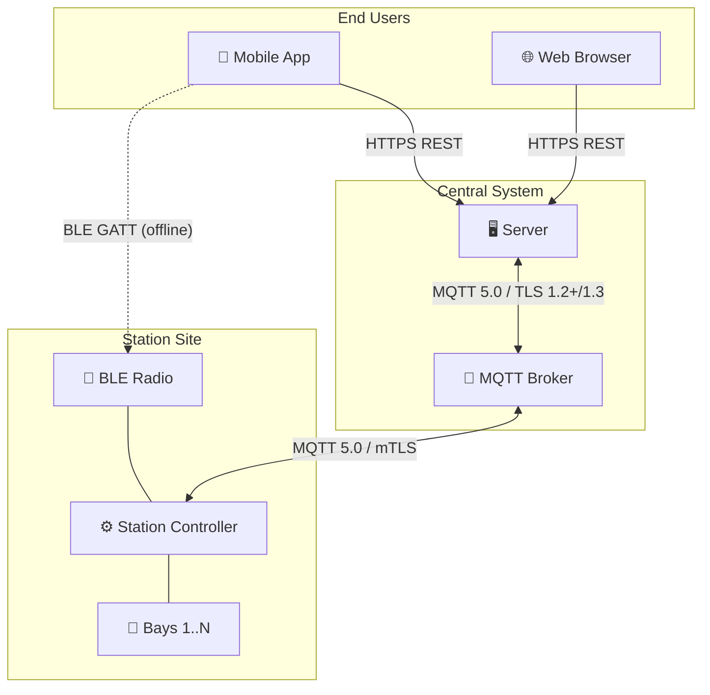

# Chapter 00 — Introduction

> **Status:** Draft | **OSPP Version:** 0.12.1

This chapter establishes the purpose, scope, and conventions for the Open Self-Service Point Protocol (OSPP) specification. It identifies the target audience, defines how normative language is used throughout the document, describes notation and formatting conventions, and provides the normative and informative reference bibliography.

The keywords **MUST**, **MUST NOT**, **REQUIRED**, **SHALL**, **SHALL NOT**, **SHOULD**, **SHOULD NOT**, **RECOMMENDED**, **MAY**, and **OPTIONAL** in this document are to be interpreted as described in [RFC 2119](https://www.rfc-editor.org/rfc/rfc2119) and [RFC 8174](https://www.rfc-editor.org/rfc/rfc8174).

---

## 1. Purpose and Scope

### 1.1 Purpose

The **Open Self-Service Point Protocol (OSPP)** defines a secure, interoperable communication protocol between self-service stations and a central server (also known as CSMS — Central Self-service Management System). OSPP enables station manufacturers, backend operators, and integrators to build systems that work together without proprietary lock-in.

OSPP targets a broad range of self-service verticals, including but not limited to:

- **Car wash stations** -- automated wash bays, self-service pressure wash points
- **Laundry facilities** -- coin-op and app-controlled washers and dryers
- **Vending machines** -- food, beverage, and general merchandise dispensers
- **EV charging stations** -- AC and DC charging points
- **Locker systems** -- parcel lockers, luggage storage

The protocol defines a common set of operations -- boot registration, session lifecycle, status reporting, device management, security, and offline operation -- that apply across these verticals. Domain-specific behavior is captured in **profiles** that extend the core protocol without modifying it.


```mermaid
graph TB
    subgraph "End Users"
        APP["📱 Mobile App"]
        WEB["🌐 Web Browser"]
    end

    subgraph "Central System"
        SERVER["🖥️ Server"]
        BROKER["📡 MQTT Broker"]
    end

    subgraph "Station Site"
        CTRL["⚙️ Station Controller"]
        BLE["📶 BLE Radio"]
        BAY["🚿 Bays 1..N"]
    end

    APP -->|"HTTPS REST"| SERVER
    WEB -->|"HTTPS REST"| SERVER
    SERVER <-->|"MQTT 5.0 / TLS 1.2+/1.3"| BROKER
    BROKER <-->|"MQTT 5.0 / mTLS"| CTRL
    APP -. "BLE GATT (offline)" .-> BLE
    BLE --- CTRL
    CTRL --- BAY
```

> **Figure 1** — OSPP system topology. Solid lines are online paths; dashed lines indicate the BLE offline fallback. See [Chapter 01 — Architecture](01-architecture.md) for the full topology and [diagrams/](../diagrams/) for standalone diagram files.

### 1.2 Scope

This specification covers the following areas:

| Area | Description | Chapters |
|------|-------------|----------|
| **Architecture** | System topology, identity model, hardware abstraction, communication stack | [01](01-architecture.md) |
| **Transport** | MQTT 5.0, BLE GATT, and HTTPS REST bindings with connection lifecycle and QoS | [02](02-transport.md) |
| **Message Catalog** | Normative payload schemas, metadata, and examples for every OSPP message | [03](03-messages.md) |
| **Protocol Flows** | End-to-end sequences for boot, sessions, reservations, offline scenarios | [04](04-flows.md) |
| **Security** | Threat model, PKI trust chain, cryptographic key inventory, provisioning | [06](06-security.md) |
| **State Machines** | Finite state machines for the station, bays, sessions, reservations, BLE connections | [05-state-machines](05-state-machines.md) |
| **Error Handling** | Error code registry, severity levels, retry policies, circuit breakers | [07](07-errors.md) |
| **Configuration** | Configuration key registry with types, defaults, and access modes | [08](08-configuration.md) |

### 1.3 Out of Scope

The following topics are explicitly **outside** the scope of this specification:

- **Station hardware design** -- physical enclosure, sensor selection, actuator wiring, or PCB layout.
- **User interface design** -- mobile app screens, on-station display layouts, or UX flows.
- **Business logic** -- pricing models, loyalty programs, subscription rules, or revenue sharing.
- **Payment processing internals** -- integration with specific payment gateways, PCI DSS compliance procedures, or card-present terminal protocols.
- **Cloud infrastructure** -- server deployment architecture, database schema, or hosting provider selection.
- **Regulatory compliance** -- jurisdiction-specific requirements (e.g., fiscal receipt formats, local data protection law) beyond the general security model defined herein.

Implementers **SHOULD** consult domain-specific standards and local regulations for these areas.

---

## 2. Target Audience

This specification is intended for the following audiences:

| Audience | Interest |
|----------|----------|
| **Station manufacturers** | Implementing the station-side protocol stack (MQTT client, BLE peripheral, message handling, state machines) |
| **Server developers** | Building the server-side components (MQTT broker integration, session management, device management, offline reconciliation) |
| **System integrators** | Connecting OSPP-compliant stations to existing fleet management, payment, or IoT platforms |
| **Mobile application developers** | Implementing the app-side BLE transport and REST API client for session control and offline authorization |
| **IoT platform teams** | Evaluating OSPP for integration into broader IoT ecosystems and device management frameworks |
| **Security auditors** | Reviewing the threat model, cryptographic requirements, and trust chain for compliance assessments |
| **Conformance testers** | Validating implementations against the normative message schemas and protocol flows |

Readers are assumed to have working knowledge of JSON, MQTT, TLS, and REST APIs. Familiarity with BLE GATT is required only for implementers of the offline profile. Prior exposure to OCPP is helpful but not required.

---

## 3. Document Conventions

### 3.1 Normative Keywords

The key words **MUST**, **MUST NOT**, **REQUIRED**, **SHALL**, **SHALL NOT**, **SHOULD**, **SHOULD NOT**, **RECOMMENDED**, **NOT RECOMMENDED**, **MAY**, and **OPTIONAL** in this specification are to be interpreted as described in BCP 14 [[RFC 2119](https://www.rfc-editor.org/rfc/rfc2119)] [[RFC 8174](https://www.rfc-editor.org/rfc/rfc8174)] when, and only when, they appear in **ALL CAPITALS**.

When these words appear in lowercase or mixed case (e.g., "the station must be powered on" or "implementations should consider"), they carry their ordinary English meaning and are not normative requirements.

> **Bold is house style, not a condition of binding.** This paragraph previously read "when, and
> only when, they appear in **BOLD UPPERCASE**", which is stricter than RFC 8174 — the RFC's own
> condition is "all capitals" and it says nothing about weight. The stricter reading was never
> what the specification practised: **496 of the 1391 capitalised MUST/SHALL keywords in `spec/`
> were unbolded**, and 457 of those are plainly obligations — the entire MQTT topic-ACL apparatus
> ([Chapter 02 §6](02-transport.md#6-access-control-acl)), all ten OfflinePass checks
> ([Chapter 06 §6.1.1](06-security.md)), and most of [Chapter 08](08-configuration.md). Nor did
> any other document adopt it: all eighteen chapters and profiles that restate this paragraph
> state the plain BCP 14 form, and the paragraph contradicted itself — the sentence below
> identifies the non-binding case as *lowercase or mixed case*, never as unbolded capitals.
> Authors **SHOULD** still bold normative keywords, per
> [CONTRIBUTING.md](../CONTRIBUTING.md); a keyword that is not bolded is a style defect, not a
> keyword that fails to bind.

### 3.2 Notation and Formatting

The following notation conventions apply throughout this specification:

- **Monospace** (`code font`) is used for field names, message actions, identifier values, topic patterns, and code examples.
- **Angle brackets** (`{field}`) denote variable substitution in topic patterns and URI templates -- e.g., `ospp/v1/stations/{station_id}/to-server`.
- **Enumeration values** are written in **PascalCase** monospace -- e.g., `status: "Available"`, `bootReason: "PowerOn"`.
- **Cross-references** between chapters use the format `see [Chapter NN](NN-name.md), Section X.Y` — for example, "see [Chapter 02](02-transport.md), Section 3.1".
- **Message references** use the format **[MSG-NNN]** where NNN is the zero-padded message number from the Message Catalog.

### 3.3 Identifier Prefixes

All OSPP identifiers use a typed prefix to avoid ambiguity and enable quick visual identification. Implementations **MUST** use these prefixes when generating identifiers.

| Prefix | Entity | Example |
|--------|--------|---------|
| `stn_` | Station | `stn_a1b2c3d4` |
| `bay_` | Bay | `bay_a1b2c3d4` |
| `sess_` | Session | `sess_9f8e7d6c` |
| `svc_` | Service | `svc_premium_wash` |
| `sub_` | Subscriber (user) | `sub_x7y8z9` |
| `rsv_` | Reservation | `rsv_f1e2d3c4` |
| `otx_` | Offline transaction | `otx_b5a6c7d8` |
| `opass_` | Offline pass | `opass_e9f0a1b2` |
| `msg_` | Message | `msg_c3d4e5f6` |
| `fwupd_` | Firmware update | `fwupd_d7e8f9a0` |
| `sec_` | Security event | `sec_e1f2a3b4` |

### 3.4 JSON Representation

All OSPP messages are serialized as JSON [[RFC 8259](https://www.rfc-editor.org/rfc/rfc8259)]. JSON examples in this specification are pretty-printed for readability. On the wire, implementations **MAY** transmit compact (whitespace-stripped) JSON.

Comments appearing in JSON examples (prefixed with `//`) are for illustration only and **MUST NOT** appear in actual messages. Ellipsis (`...`) in examples indicates omitted fields or repetition.

```json
{
  "messageId": "msg_c3d4e5f6",         // RFC 4122 UUID — unique per message
  "messageType": "Request",
  "action": "StartService",
  "timestamp": "2026-02-13T10:30:00.000Z",  // ISO 8601 — always UTC, milliseconds required
  "source": "Server",
  "protocolVersion": "0.3.0",
  "payload": { ... }
}
```

### 3.5 Schema Language

Message payload schemas are defined using **JSON Schema Draft 2020-12**. Machine-readable schema files are provided in the companion `schemas/` directory. Where the prose description and the JSON Schema disagree, the JSON Schema is authoritative.

### 3.6 Timestamps

All timestamps in OSPP messages **MUST** be formatted as ISO 8601 strings in UTC with the `Z` suffix and millisecond precision -- e.g., `"2026-02-13T10:30:00.000Z"` or `"2026-02-13T10:30:00.123Z"`. Exactly three decimal places **MUST** be present, including when they are zero: a timestamp that omits them, or that carries any other number of them, is rejected by [`timestamp.schema.json`](../schemas/common/timestamp.schema.json). Implementations **MUST NOT** use timezone offsets other than `Z`.

### 3.7 Encoding

All text in OSPP messages **MUST** be encoded as UTF-8. Implementations **MUST** reject messages containing invalid UTF-8 sequences with error code `1005 INVALID_MESSAGE_FORMAT` (see [Chapter 07](07-errors.md)).

### 3.8 Diagrams

Protocol flows and state machines are illustrated with [Mermaid](https://mermaid.js.org/) diagrams embedded directly in the specification markdown. These diagrams are informative -- the normative behavior is defined by the accompanying prose.

### 3.9 Chapter Organization

The specification is organized into numbered chapters for stable cross-referencing:

| Chapter | Title |
|---------|-------|
| 00 | Introduction (this chapter) |
| 01 | Architecture |
| 02 | Transport |
| 03 | Message Catalog |
| 04 | Protocol Flows |
| 05 | State Machines |
| 06 | Security |
| 07 | Error Codes & Resilience |
| 08 | Configuration |
| -- | Glossary |

---

## 4. Normative References

The following documents are referenced normatively in this specification. Implementations claiming OSPP conformance **MUST** comply with the applicable requirements from these references.

| Reference | Title | Link |
|-----------|-------|------|
| [RFC 2119] | Key words for use in RFCs to Indicate Requirement Levels | https://www.rfc-editor.org/rfc/rfc2119 |
| [RFC 8174] | Ambiguity of Uppercase vs Lowercase in RFC 2119 Key Words | https://www.rfc-editor.org/rfc/rfc8174 |
| [RFC 8446] | The Transport Layer Security (TLS) Protocol Version 1.3 | https://www.rfc-editor.org/rfc/rfc8446 |
| [RFC 8259] | The JavaScript Object Notation (JSON) Data Interchange Format | https://www.rfc-editor.org/rfc/rfc8259 |
| [RFC 4122] | A Universally Unique IDentifier (UUID) URN Namespace | https://www.rfc-editor.org/rfc/rfc4122 |
| [MQTT 5.0] | MQTT Version 5.0 (OASIS Standard) | https://docs.oasis-open.org/mqtt/mqtt/v5.0/mqtt-v5.0.html |
| [JSON Schema 2020-12] | JSON Schema: A Media Type for Describing JSON Documents | https://json-schema.org/draft/2020-12/json-schema-core |
| [ISO 8601] | Date and time -- Representations for information interchange | https://www.iso.org/standard/70907.html |
| [BT Core 5.3] | Bluetooth Core Specification v5.3 | https://www.bluetooth.com/specifications/specs/core-specification-5-3/ |

---

## 5. Informative References

The following documents provide additional context and prior art. They are not normatively binding but are recommended reading for implementers.

| Reference | Title | Link |
|-----------|-------|------|
| [OCPP 2.0.1] | Open Charge Point Protocol 2.0.1 | https://openchargealliance.org/protocols/ocpp-201/ |
| [OWASP IoT Top 10] | OWASP Internet of Things Top 10 (2018) | https://owasp.org/www-project-internet-of-things/ |
| [NIST SP 800-183] | Networks of 'Things' (IoT Reference Architecture) | https://csrc.nist.gov/publications/detail/sp/800-183/final |
| [AsyncAPI 3.0] | AsyncAPI Specification 3.0 | https://www.asyncapi.com/docs/reference/specification/v3.0.0 |
| [NIST SP 800-57] | Recommendation for Key Management | https://csrc.nist.gov/publications/detail/sp/800-57-part-1/rev-5/final |

---

## 6. Document History

| Version | Date | Author | Changes |
|---------|------|--------|---------|
| 0.1.0-draft.1 | 2026-02-13 | OSPP Authors | Initial public draft. |
| 0.2.0 | 2026-03-20 | OSPP Authors | SessionEnded EVENT (MSG-040), Unknown bay state handling, TransactionEvent authoring fixes, example validation fixes. |
| 0.2.1 | 2026-03-21 | OSPP Authors | `supportedVersions` in BootNotification RESPONSE for protocol version negotiation (1007). |
| 0.2.2 | 2026-03-22 | OSPP Authors | Update all `protocolVersion` example values from 0.1.0 to 0.2.1. |
| 0.2.3 | 2026-03-22 | OSPP Authors | Add SessionEnded EVENT to HMAC signing table in 06-security.md. |
| 0.2.4 | 2026-03-22 | OSPP Authors | Reclassify SessionEnded as HMAC-signed (YES) — contains billing data. |
| 0.2.5 | 2026-04-30 | OSPP Authors | `provisioning-response.schema.json` (top-level HTTP schema) for `POST /api/v1/stations/provision` response body. |
| 0.3.0 | 2026-05-06 | OSPP Authors | Provisioning trust anchors split (`stationCaChain` + `brokerRootCa`); normative MUST that station consumes `mqttConfig.brokerUri`. |
| 0.4.0 | 2026-05-07 | OSPP Authors | Brief Q comprehensive patches: CSMS as cost authority, <50% refund scope clarified, OSPP Session Retention Horizon (24h), MeterValues + SessionEnded message-expiry, OSPP Canonical Form formalized (§4.8), per-session seqNo + finalSeqNo + NVS persistence, SessionEnded reason vocabulary extended (Local, LocalOutOfCredit, Deauthorized). |
| 0.4.1 | 2026-06-04 | OSPP Authors | SecurityEvent dedup contract tightening: `security-event.md` §6 (rule 2) normative MUST for `eventId` stability across QoS-1 retransmits and buffered replays; `authorize-offline-pass.md` §6 (rule 7) SHOULD→MUST with negative-space clause (only checks #1 and #5 emit; other Rejected outcomes MUST NOT), `type` MUST be `OfflinePassRejected`, and `eventId` MUST be deterministically derived from the originating REQUEST's `messageId` (preserves per-attempt visibility for forgery probing and cross-station replay attempts). |
| 0.4.2 | 2026-06-05 | OSPP Authors | Reconcile-Time Re-validation Gate (`reconciliation.md` §6, NEW) — 11 hard-reject checks before fraud scoring (receipt cross-checks, pass-found, pass-user, deviceId, org, station, expiry, revocation epoch, individual revoke). `06-security.md` §6.2 receipt_fields expanded to 12 (added offlinePassId/userId/deviceId, signed). (M) fix: signing + verification converge on canonical-bytes hash (drops the dead-code base64 intermediate). `offline-pass.md` §2 + §7: new `organization_id` field + Org-scoped property; "unscoped" semantics defined as "any station of the issuing org." 4 new error codes (2014/2015/2016/2017), 2003 promoted to hard-reject at reconcile-time. BLE FFF6 wrapper extended for symmetry with signed inner. Coordinated v0.4.1 → v0.4.2 stack upgrade; pre-launch context (0 offline_passes on prod) makes the break clean. |
| 0.5.0 | 2026-06-06 | OSPP Authors | Lockstep re-synchronization release across `spec` + `ospp-sdk-php` + `sdk-ts` ([ADR-001](../adr/ADR-001-cross-repo-lockstep-versioning.md)). `transaction-event-response.schema.json` `status` enum gains `Deferred` (closes the §4.2:52 spec gap — server already emitted the value, schema didn't admit it). `reconciliation.md §4.1`/`§4.2` document the `Deferred` wire shape + the `Deferred`-vs-`RetryLater` semantic distinction (operator-manual unblock vs. transient-backoff-retry). `§6.3`/`§6.5` clarify gate-emit-before-INSERT ordering for check #4 (FK is belt-and-suspenders for non-gate paths, not the conforming reconciliation path). |
| 0.6.0 | 2026-06-20 | OSPP Authors | BLE handshake security (D1, [ADR-002](../adr/ADR-002-ble-handshake-security-architecture.md)): authenticated application-layer ECDH (`IKM = es ‖ ee ‖ appNonce ‖ stationNonce`), StationIdentity certificate (§6.5.2), BLE AEAD channel (ChaCha20-Poly1305 IETF, §6.5.3), `Hello`/`Challenge` ephemeral-key wire format, BLE pairing demoted to OPTIONAL, `sessionProof` canonical definition moved to `ble-handshake.md` §4.1. Lockstep with `ospp-sdk-php` + `sdk-ts`. |
| 0.6.1 | 2026-06-21 | OSPP Authors | Reconciliation + Partial-A (S2, decisions D2/D3): the reconcile-time re-validation gate grows to 13 checks (passCounter receipt cross-check #12 + cross-station `(offlinePassId, passCounter)` uniqueness #13, finding N7); revocation epoch anchored at transaction time (#10, §6.6, N8); discriminated (`oneOf`) signed receipt + envelope (pass-form `{offlinePassId, passCounter}` vs auth-form `{authId, sessionId}`, N2/Q4) making Partial-A reconcilable; ServerSignedAuth claims gain signed `durationSeconds`/`creditsAuthorized` (10→12, N3); settle-once wallet true-up (§8.2, N11); `ServerSignedAuthReplay` SecurityEvent type (error 2018). Lockstep re-vendor of `spec/schemas/`. |
| 0.6.2 | 2026-06-22 | OSPP Authors | SDK enum catch-up (lockstep, ADR-001), no spec content change: `ServerSignedAuthReplay` SecurityEvent type + error `2018 SERVER_AUTH_NONCE_MISMATCH` — both fully specified in 0.6.1 — are mirrored into the `ospp-sdk-php` / `sdk-ts` enum types (Critical, non-recoverable, httpStatus 401). `spec/schemas/` byte-identical to 0.6.1; version-header cascade only. |
| 0.8.0 | 2026-07-13 | OSPP Authors | Config vocabulary alignment: removed 12 unused keys (SecurityProfile, 8 BLE keys, Locale, StatusNotificationInterval, EventThrottleSeconds); corrected 4 key defaults/ranges; total 41→29. Wire protocolVersion unchanged (0.2.1). |
| 0.7.0 | 2026-07-10 | OSPP Authors | TLS 1.2 floor amendment: `02-transport.md` §1.3 relaxes the TLS-1.3-only rule to a TLS-1.2 floor with TLS 1.3 RECOMMENDED-and-negotiated-when-supported, admitting constrained cellular modems (e.g. SIMCom A7608E-H) with no firmware path to 1.3; cipher suite list extended to 4 entries (2× TLS 1.3 AES-GCM + 2× TLS 1.2 ECDHE-ECDSA-GCM, `TLS_CHACHA20_POLY1305_SHA256` dropped from the offered set); `06-security.md` cipher table, threat-model, and checklist references updated to match. All other chapter/profile mentions of a hard TLS-1.3-only requirement (connection-sequence diagrams, protocol summary tables, algorithm inventory) updated for consistency. `04-flows.md` §2 (Station Provisioning) gains a "Single-use and idempotent retry" subsection formalizing same-token retry idempotency within the 24h TTL and the 401 conditions (expired/beyond TTL, superseded, revoked); the error-path table's 401 row is broadened to match, and `02-transport.md` §9.3 gains a provisioning-token idempotency note cross-referencing it. |
| 0.9.0 | 2026-07-29 | OSPP Authors | **Three independent breaking bodies, each for a different audience.** **(A) Station certificate validation is fail-closed — breaking for conformance claims, no wire change.** `06-security.md` §2.1 gains the consequence it never stated: a station that cannot validate a server certificate **MUST refuse**, across all four cells (no anchor obtainable / anchor present with a failing chain, on the MQTT leg and the pre-credential HTTPS provisioning leg), with *refuse* defined as the connection not completed and the call not made, and "recording the failure and continuing" explicitly non-conforming. Previously, connecting without authenticating the server was conforming — and on hardware with no system trust store it was the *default* outcome. `01-architecture.md` §7.2 gains a *Broker trust policy* row (row 5, placement chosen to preserve two dependent sentences); `reset.md` makes that row survive a reset as the HTTPS row already did; `provisioning-response.schema.json`'s `stationCaChain` description no longer names `brokerRootCa` as the universal anchor (description-only, no validation change); conformance gains **TC-SEC-008** — the first case with the **station** as implementation under test — and **TC-SEC-007**, pinning the provisioning success response. **(B) BREAKING (response enum): `Deferred` is retired.** `status` returns to four values — `Accepted` / `Duplicate` / `Rejected` / `RetryLater`. The txCounter gap-detection and gap-blocking machinery it existed to express goes with it: `reconciliation.md` §4 becomes "Transaction Counter (Forensic)" — the counter is persisted as evidence and **gates nothing** — the strict-ordering MUST becomes a SHOULD, the `lastReconciledCounter` watermark and its `Duplicate`-on-low-counter branch are deleted (that branch destroyed money on a power cycle), and every "operator-manual unblock" reference goes (an exit referenced in five documents and defined in none). §6.3 is rewritten as forensic framing with a new §6.3.1; the §7.4 `Counter gap detected +0.30` fraud factor is removed — it scored a **station** property against **user** sanctions. Replay protection is unchanged and was never carried by `txCounter`: it is `(offlinePassId, passCounter)` uniqueness (§6.1 check #13) on an **app**-generated counter, plus the §7.4 cross-station cumulative factors. See the 0.5.0 row below — `Deferred` was ratified into the schema on 2026-06-06 *after* the server had already emitted it; it never had a rationale independent of the gap rule. **(C) BREAKING (validation): `errorText` is enforced as UPPER_SNAKE_CASE** on the 16 declarations across 15 schemas where it pairs with `errorCode`. Fifteen constrained length only, so a raw validator diagnostic reached firmware in the field §1.3 reserves for programmatic matching. Breaking for **producers**; no shipped valid vector breaks. Eight contradictory field descriptions corrected and five invalid vectors given the registry name of the code they declare. Also: `03-messages.md` §6.4's UpdateFirmware example gains the `signature` it lists as Required. |
| 0.10.0 | 2026-07-30 | OSPP Authors | **`Unknown` leaves the wire — breaking for stations, no change to the state machine.** `bay-status.schema.json` narrows from seven values to the six **reportable** ones; `Unknown` is entered only at power-on (station) and on connection loss (server) and is carried by no message, so a station **MUST NOT** report it in `status` or `previousStatus`. `previousStatus` is now **MUST-omit** on the post-boot report rather than merely permitted to be absent, since the state being left is one the field cannot express. The bay FSM keeps all seven states and its transition table is untouched; neither SDK loses an enum member, because both need `Unknown` for state they hold and never send. `protocolVersion` does not move. |
| 0.11.0 | 2026-08-05 | OSPP Authors | **Five arcs, breaking on the wire, and the wire version moves with them: `protocolVersion` → `0.3.0`.** **(A) Topology.** The station declares `bays[]` with each bay's `programNumbers`; `bayIds` and `bayCount` are deleted outright. A bay's **programs** (firmware constants the station owns) are separated from **services** (commercial offers the server mints), so StatusNotification reports `programs[]` — the old shape made a conforming first boot impossible. Bounds set at 64 bays × 32 programs. `3017` and `3018` added; registry 114 → 116. **(B) TLS identity — breaking for conformance, no wire change.** The station **MUST** verify the server certificate's *identity* over RFC 9525 on both the MQTT and the pre-credential HTTPS leg, CN fallback prohibited; `TC-SEC-009` pins it. **(C) Reset and negotiation.** Remote credential wipe leaves the wire — one reboot operation with an optional `force`; factory reset is physical. Version negotiation becomes **exact match** against a server-held set, replacing a MAJOR gate that classified every `0.x` pair as compatible. **(D) Boot and signing.** The station gains its own state machine at §1, with `Pending` and `Rejected` defined as **restricted** states; `bootReason` gains `Reconnect`. Everything on the wire is signed — 44 of 47 message types — and `sessionKey` becomes REQUIRED on every `Accepted` **and** every `Pending` response, without which the repair channel `Pending` exists for could not be used. **(E) Bay FSM and reconcile.** One canonical transition table with an `Effected by` column — 20 `Station` rows, 6 `Server`, 26 in all — `Unavailable → Faulted` made legal, `Unknown` given five exits so a station that reboots mid-session has a truthful report, and an invalid transition accepted as authoritative rather than refused. The reconcile pass closed the counts and cross-references the other four left inconsistent, and the compose pass found that a restricted station was required to settle a session it was forbidden to report. |
| 0.11.1 | 2026-08-07 | OSPP Authors | **Arc 6 — the eleven defects the reference implementation hit while building against v0.11.0**, most found on a live wire rather than by reading. `SessionEndReason` gains `OperatorStopped` and `04-flows.md` gains **the operator-disable policy** it belongs to — named in four places and defined in none; a forced Reset had no reason to settle with, and the nearest member (`Deauthorized`) mandates billing at zero, so a correct reading delivered a wash and charged nothing. This is the release's one wire-touching change. `3019 SERVICE_NOT_BOUND` (the server holds no service→program binding, the mirror of `3017`) and `6008 COMMAND_PRE_EMPTED` (carrying `details.wouldBe`, so a refusal that never left the server is distinguishable from one the station gave) are added. `4020`'s recommended action stops directing an integrator to compare two **counts** — a swapped bay leaves both equal, the exact case the set comparison exists to catch. `05-state-machines.md` states that a **generated type** must not gain `Unknown` back, addressed to a code generator rather than to a reader. `VERSIONING.md` gains *Adding a REQUIRED field, and which side moves first*. `protocolVersion` stays `0.3.0`. |
| 0.11.2 | 2026-08-07 | OSPP Authors | **Arc 7 — the twelve defects taken back to the spec and verified before being acted on; eleven were already closed, and the twelfth had been closed on the SDK side.** What the arc found was not on the list: **the repair for the headline defect was itself defective.** Arc 6 rewrote `4020`'s *Recommended Action* correctly and, at **1245** characters against Appendix C's `maxLength` of **500**, made it unemittable — a right answer in a form no conforming server can put on the wire — and `3017` (551) and `3018` (534) had gone the same way. All three shortened in full, and the bound §1.4 only asserted is now **measured** by `tools/verify-protocol.sh`, read from Appendix C rather than hardcoded. Registry counts, the LWT signing exemption's missing citation, and a BLE `StationInfo` still carrying the count scalar MQTT deleted in v0.11.0 are also repaired. **The document version moves, and gains a rule.** It had not moved across two releases — a reader holding `v0.11.1` saw `0.11.0` in all 22 headers — because nothing said it had to; [VERSIONING.md](../VERSIONING.md) now states that it equals the release tag, enumerates the sites that carry it, and `verify-protocol.sh` checks they agree. No wire change, no schema change: `protocolVersion` stays `0.3.0`. |
| 0.12.0 | 2026-08-11 | OSPP Authors | **The RFC 2119 bold-only qualifier is dropped, and 457 obligations that did not bind now bind.** §3.1 read "when, and only when, they appear in **BOLD UPPERCASE**" — a condition on *weight* that [RFC 8174](https://www.rfc-editor.org/rfc/rfc8174), the authority it cites, does not impose. **496 of the 1391** capitalised `MUST`/`SHALL` keywords in `spec/` are unbolded and were therefore non-binding; **457 are genuine obligations**, including the whole MQTT topic-ACL apparatus, all ten OfflinePass checks, and most of Chapter 08. **Conformance-breaking without being wire-breaking** — an implementation conformant against v0.11.2 may be non-conformant against v0.12.0 having changed nothing — which is why the release is MINOR and not PATCH. Nothing on the wire moves: no message shape, field, enum or schema constraint changes and `protocolVersion` stays `0.3.0`. Out of a corpus-wide sweep for *prose claiming enforcement nothing performs* — **58 instances found, 28 closed** — three checkable sub-shapes became ratchet gates in `tools/` with a workflow that calls them. `maxCreditsPerTx` is restated as a **decline threshold**: the Full Offline example taught capping with a formula and a rationale, against three normative sites that reject with `4004`, and now shows the client sizing its request from the limit the pass carries. |
| 0.12.1 | 2026-08-11 | OSPP Authors | **A duplicate `offlineTxId` was two situations wearing one word, and the corpus could not be repaired around it.** Three conformance cases stimulated the same condition and two mandated `Duplicate` while one mandated `Accepted`; the spec said both, four normative sites each way, all from the initial commit. Resolved by comparison: a **byte-identical** signed `receipt.data` is a retransmission and is answered `Duplicate`; a **differing** one is two claims under one identifier and is answered `Rejected`, with both records retained and an operator alert. `Duplicate` could not cover the second case because it orders the station to delete its local copy — one of the two records [§9](../spec/profiles/offline/reconciliation.md) requires be kept. So each status now states **two separate obligations**, whether to send again and what to do with the local record, which the text had conflated under the single word *delete*. **No wire change:** `Rejected` is already in the enum and already carries the `MUST NOT` retry obligation; no new status, no `reason` enum, no new field or error code. Also repaired: `Accepted`'s delete-versus-purge-after-72h contradiction, `Rejected`'s `MUST`-flag versus `MAY`-flag, `RetryLater` pointing at a `retryInterval` the closed response schema cannot carry, and the cross-channel case, now explicitly marked unspecified. **The conformance corpus:** `TC-OFF-001` taught an unauthenticated BLE handshake and a key schedule two versions stale, contradicting its own golden vector; `TC-SEC-001` MAC'd the payload rather than the envelope; `TC-DM-002` omitted the REQUIRED firmware `signature`; `programNumber` was missing from 13 StartService payloads. A firmware example carried `sha256("test")` as the checksum of an image whose signature was over the real binary — which is also why the repo's signer was not idempotent at `v0.12.0`. PATCH: the corpus changes what gets tested, not what binds, so a compliance claim resting on the corrected cases was never valid. `protocolVersion` stays `0.3.0`. |
