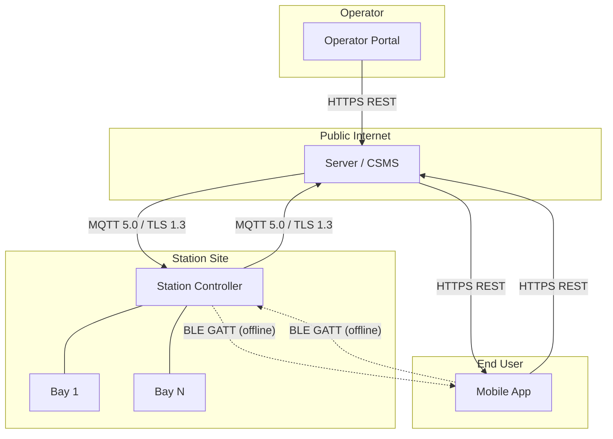

# Chapter 01 — Architecture

> **Status:** Draft | **OSPP Version:** 0.1.0-draft.1

This chapter defines the foundational system model upon which all subsequent chapters build: the participants, their communication channels, the hardware model, the identity scheme, the controller topologies, and the layered communication stack.

The keywords **MUST**, **MUST NOT**, **REQUIRED**, **SHALL**, **SHALL NOT**, **SHOULD**, **SHOULD NOT**, **RECOMMENDED**, **MAY**, and **OPTIONAL** in this document are to be interpreted as described in [RFC 2119](https://www.rfc-editor.org/rfc/rfc2119) and [RFC 8174](https://www.rfc-editor.org/rfc/rfc8174).

---

## 1. System Topology

### 1.1 Participants

The OSPP ecosystem consists of four participants, each with a distinct role and trust boundary.

| Participant | Role | Trust Level |
|-------------|------|-------------|
| **Station** | Physical self-service point with one or more bays, a controller, and network connectivity. Executes service commands, reports status, and collects meter values. | Semi-trusted — operates in a hostile physical environment; authenticated via mTLS client certificate. |
| **Server (CSMS)** | Central Station Management System. Manages provisioning, session lifecycle, billing, configuration, firmware, and offline pass issuance. Acts as the authoritative source of truth. | Trusted — the highest-privilege participant. |
| **Mobile App** | Consumer-facing smartphone application. Initiates sessions, manages reservations, handles payments, and provides offline authorization via BLE when connectivity is degraded. | Untrusted client — authenticated via short-lived JWTs issued by the Server. |
| **Operator Portal** | Web-based management dashboard for station operators. Provides fleet monitoring, configuration management, diagnostics, and reporting. Communicates exclusively with the Server via HTTPS REST. | Trusted client — authenticated via operator credentials and role-based access control. |

### 1.2 Communication Channels

Three communication channels connect the participants:

| Channel | Participants | Transport | Purpose |
|---------|-------------|-----------|---------|
| **Online** | Station ↔ Server | MQTT 5.0 over TLS 1.3 | Primary path for all station operations: boot, sessions, status, config, firmware, security events. |
| **Mobile API** | Mobile App ↔ Server | HTTPS REST | App operations: authentication, session initiation, payments, offline pass provisioning, push notifications. |
| **Offline** | Mobile App ↔ Station | BLE GATT | Fallback path when MQTT is unavailable: offline authorization, session start, receipt retrieval. |

The Operator Portal communicates with the Server via the same HTTPS REST API (or a dedicated management API) and has **no direct channel** to stations. All operator commands are relayed through the Server.



> **Note:** Dashed lines indicate the BLE offline path, which is used only when MQTT connectivity between the station and server is degraded or unavailable. See [Chapter 02 — Transport](02-transport.md), Section 8 for BLE transport details.

---

## 2. Hardware Model

### 2.1 Station

A **Station** is a physical self-service installation consisting of:

- **Controller** — The embedded computing unit that runs the station firmware, manages bay hardware, maintains the MQTT connection to the server, and optionally advertises a BLE interface. Each station has exactly one controller.
- **One or more Bays** — The individual service points where consumers receive services. A station MUST have at least one bay.
- **Network Connectivity** — Ethernet, WiFi, or cellular. The controller MUST support at least one network interface and SHOULD support failover between interfaces where hardware permits.
- **BLE Interface** (OPTIONAL) — A Bluetooth Low Energy peripheral for offline authorization scenarios. Stations that declare `capabilities.bleSupported: true` in their BootNotification MUST implement the BLE GATT service defined in [Chapter 02 — Transport](02-transport.md), Section 8.

A station is identified by a unique `stationId` with the `stn_` prefix (see Section 3). The station reports its hardware metadata — `stationModel`, `stationVendor`, `serialNumber`, `firmwareVersion`, `bayCount`, capabilities, and network information — in the BootNotification message sent at startup (see [Chapter 03 — Message Catalog](03-messages.md), Section 1.1).

### 2.2 Bay

A **Bay** is an individual service point within a station. Each bay operates independently and maintains its own state, meter, and set of available services.

A bay is identified by a unique `bayId` with the `bay_` prefix. Bays are provisioned by the server during station configuration.

A bay MUST be in exactly one of the following seven states at any given time:

| State | Description |
|-------|-------------|
| **Available** | Bay is idle and ready to accept a session or reservation. |
| **Reserved** | Bay has been reserved for a specific subscriber. No other session may start until the reservation expires or is cancelled. |
| **Occupied** | An active session is in progress — a service is being dispensed. |
| **Finishing** | The session has ended but the bay is performing post-session cleanup (e.g., draining, resetting actuator position). |
| **Faulted** | The bay has detected a hardware or software fault and cannot provide service. Operator intervention MAY be required. |
| **Unavailable** | The bay has been administratively disabled (e.g., for maintenance). |
| **Unknown** | The bay state cannot be determined, typically during controller startup before the first status poll. |

State transitions are reported to the server via StatusNotification events (see [Chapter 03 — Message Catalog](03-messages.md), Section 5.2). The complete bay state machine is defined in [Chapter 05 — State Machines](05-state-machines.md).

### 2.3 Service

A **Service** represents a discrete dispenser type or operation that a bay can perform — for example, high-pressure water, rinse, vacuum, air, or specialty programs.

A service is identified by a descriptive `serviceId` with the `svc_` prefix (e.g., `svc_eco`, `svc_standard`, `svc_vacuum`). Unlike other entity identifiers, service identifiers use a human-readable name component rather than a hex suffix.

Each bay supports one or more services. The available services for a station are defined in the service catalog, which the server pushes to the station via UpdateServiceCatalog (see [Chapter 03 — Message Catalog](03-messages.md), Section 6.9). Each service entry includes:

- **Service ID** — The `svc_` prefixed identifier.
- **Display name** — Human-readable label for the mobile app (e.g., "Eco Program").
- **Metering unit** — The unit used for consumption measurement (seconds, liters, pulses).
- **Pricing metadata** — Per-unit cost information used for billing.

---

## 3. Identity Scheme

### 3.1 Identifier Format

All OSPP entities use **prefixed identifiers** to ensure type safety and human readability. Each identifier consists of a type prefix followed by a hex string or descriptive name.

| Entity | Prefix | Format | Regex | Example |
|--------|--------|--------|-------|---------|
| Station | `stn_` | `stn_` + 8+ hex chars | `^stn_[a-f0-9]{8,}$` | `stn_a1b2c3d4e5f6` |
| Bay | `bay_` | `bay_` + 8+ hex chars | `^bay_[a-f0-9]{8,}$` | `bay_a1b2c3d4` |
| Session | `sess_` | `sess_` + 8+ hex chars | `^sess_[a-f0-9]{8,}$` | `sess_a1b2c3d4e5f6` |
| Service | `svc_` | `svc_` + snake_case name | `^svc_[a-z0-9_]+$` | `svc_eco` |
| Subscriber | `sub_` | `sub_` + alphanumeric chars | `^sub_[a-zA-Z0-9]+$` | `sub_9a8b7c6d` |
| Reservation | `rsv_` | `rsv_` + 8+ hex chars | `^rsv_[a-f0-9]{8,}$` | `rsv_a1b2c3d4e5f6` |
| Offline Tx | `otx_` | `otx_` + 8+ hex chars | `^otx_[a-f0-9]{8,}$` | `otx_a1b2c3d4e5f6` |
| Offline Pass | `opass_` | `opass_` + 8+ hex chars | `^opass_[a-f0-9]{8,}$` | `opass_a1b2c3d4e5f6` |
| Message | `msg_` | Per-action prefix + UUID v4 (see [Appendix A](03-messages.md#appendix-a--message-id-prefix-convention)) | See below | `boot_550e8400-e29b-41d4-a716-446655440000` |

**Rules:**

- All hex characters MUST be **lowercase** (`a-f`, not `A-F`).
- Identifiers MUST NOT be empty and MUST conform to their respective regex pattern.
- Service identifiers (`svc_`) use descriptive snake_case names rather than random hex, since they represent well-known service types.
- Message identifiers use per-action prefixes (`boot_`, `hb_`, `evt_`, `cmd_`, etc.) followed by a UUID v4 for global uniqueness across distributed systems. See [Chapter 03, Appendix A](03-messages.md#appendix-a--message-id-prefix-convention).
- Implementations MUST treat identifiers as **opaque strings** — no semantic meaning should be derived from the hex or name portion beyond the prefix.

### 3.2 Identifier Assignment

| Entity | Assigned By | When |
|--------|-------------|------|
| Station (`stn_`) | Server | During station provisioning, before first boot. |
| Bay (`bay_`) | Server | During station configuration, pushed to the station. |
| Session (`sess_`) | Server | When a session is initiated (online) or by the station (offline, as `otx_`). |
| Service (`svc_`) | Server | During service catalog setup, pushed via UpdateServiceCatalog. |
| Subscriber (`sub_`) | Identity Provider | During user registration (maps to the authentication subject claim). |
| Reservation (`rsv_`) | Server | When a bay reservation is created. |
| Offline Tx (`otx_`) | Station | When an offline session is started without server connectivity. |
| Offline Pass (`opass_`) | Server | When an offline pass is issued to a subscriber's mobile app. |
| Message (`msg_`) | Sender | At message creation time. The sender (station or server) generates a UUID v4. |

**Uniqueness guarantees:**

- Station, bay, session, reservation, offline tx, and offline pass identifiers MUST be globally unique. The server is responsible for ensuring uniqueness for all identifiers it assigns.
- Offline transaction identifiers (`otx_`) are generated by stations. Stations MUST use a cryptographically secure random number generator. The probability of collision is acceptably low given the hex length and deployment scale. The server MUST detect and reject duplicate `otx_` identifiers during offline transaction reconciliation.
- Message identifiers (`msg_`) are UUID v4 and are unique per sender. Receivers maintain a deduplication window as described in [Chapter 02 — Transport](02-transport.md), Section 3.3.

---

## 4. Controller Topologies

OSPP supports multiple deployment topologies. The station controller is the logical unit that maintains the MQTT connection and manages one or more bays.

### 4.1 Single-Bay

The simplest topology: one controller manages exactly one bay.

```
┌─────────────────────────┐
│  Station (stn_...)      │
│  ┌───────────────────┐  │
│  │  Controller       │  │
│  │  ┌─────────────┐  │  │
│  │  │   Bay 1     │  │  │
│  │  └─────────────┘  │  │
│  └───────────────────┘  │
└─────────────────────────┘
        │
    MQTT 5.0 / TLS 1.3
        │
   ┌─────────┐
   │  Server  │
   └─────────┘
```

All implementations MUST support the single-bay topology. This is the default and the most common deployment for standalone self-service points.

In this topology, the `bayId` in all messages refers to the single bay. The `bayCount` field in BootNotification MUST be `1`.

### 4.2 Multi-Bay

A single controller manages **N** bays (e.g., a station site with 4 bays). The controller maintains one MQTT connection to the server and multiplexes all bay operations over that single connection.

```
┌───────────────────────────────────────┐
│  Station (stn_...)                    │
│  ┌─────────────────────────────────┐  │
│  │  Controller                     │  │
│  │  ┌─────────┐  ┌─────────┐      │  │
│  │  │  Bay 1  │  │  Bay 2  │ ...  │  │
│  │  └─────────┘  └─────────┘      │  │
│  └─────────────────────────────────┘  │
└───────────────────────────────────────┘
        │
    MQTT 5.0 / TLS 1.3 (single connection)
        │
   ┌─────────┐
   │  Server  │
   └─────────┘
```

**Key characteristics:**

- The controller establishes a **single MQTT connection** using the station's `stationId` as the client ID.
- All messages include a `bayId` field to identify which bay the message pertains to. The controller MUST correctly dispatch incoming commands to the appropriate bay and aggregate outgoing status from all bays.
- Each bay maintains **independent state** — one bay may be `Occupied` while another is `Available`.
- The `bayCount` field in BootNotification MUST equal the total number of bays.
- StatusNotification events MUST include the specific `bayId` that changed state.
- Session commands (StartService, StopService) are always addressed to a specific `bayId`.

Implementations SHOULD support multi-bay topologies. The maximum number of bays per controller is implementation-defined but MUST NOT exceed **255**.

### 4.3 Gateway

In the **gateway topology**, a single network gateway aggregates connectivity for multiple stations that may lack individual network interfaces.

```
┌────────┐  ┌────────┐  ┌────────┐
│ Stn A  │  │ Stn B  │  │ Stn C  │
└───┬────┘  └───┬────┘  └───┬────┘
    │           │           │
    └─────┬─────┘───────────┘
          │  (local bus: RS-485, CAN, etc.)
    ┌─────┴─────┐
    │  Gateway  │
    └─────┬─────┘
          │
     MQTT 5.0 / TLS 1.3
          │
    ┌─────┴─────┐
    │  Server   │
    └───────────┘
```

This topology is a **future consideration** and is NOT REQUIRED for OSPP 1.0 compliance. It is documented here for awareness and to inform future protocol extensions.

In a gateway topology, each station behind the gateway retains its own `stationId` and identity. The gateway acts as a transparent proxy — it establishes one MQTT connection per station or a shared connection with per-station routing. The protocol-level behavior for each station is identical to the single-bay or multi-bay topology. The gateway layer is invisible to the server.

---

## 5. Communication Stack

OSPP defines a five-layer communication stack. Each layer has a distinct responsibility, and implementations MUST support all five layers for the online path. BLE offline path support is OPTIONAL and declared via the `bleSupported` capability.

### 5.1 Layer Overview

```
┌─────────────────────────────────────────────────────────┐
│  L5  Application     Profiles: Core, Transaction,       │
│                      Device Management, Security,       │
│                      Offline                            │
├─────────────────────────────────────────────────────────┤
│  L4  Protocol        OSPP message envelope, JSON        │
│                      payloads, HMAC-SHA256 integrity    │
├─────────────────────────────────────────────────────────┤
│  L3  Messaging       MQTT 5.0 (station↔server)         │
│                      HTTPS REST (mobile↔server)         │
│                      BLE GATT (mobile↔station)          │
├─────────────────────────────────────────────────────────┤
│  L2  Transport       TCP/IP, TLS 1.3                    │
│                      BLE L2CAP                          │
├─────────────────────────────────────────────────────────┤
│  L1  Physical        Ethernet, WiFi, Cellular, BLE      │
└─────────────────────────────────────────────────────────┘
```

| Layer | Name | Online Path (MQTT) | Offline Path (BLE) |
|:-----:|------|--------------------|--------------------|
| **L1** | Physical | Ethernet / WiFi / Cellular | Bluetooth Low Energy 4.2+ |
| **L2** | Transport | TCP/IP + TLS 1.3 (mTLS) | BLE L2CAP + LESC (LE Secure Connections) |
| **L3** | Messaging | MQTT 5.0 (QoS 1) | BLE GATT characteristics |
| **L4** | Protocol | OSPP envelope (`messageId`, `messageType`, `action`, `timestamp`, `source`, `protocolVersion`, `payload`, `mac`) | BLE JSON payloads with `type` field |
| **L5** | Application | Profiles (see Section 5.4) | Offline profile only |

### 5.2 Online Path — MQTT

The **online path** is the primary communication channel between the station and the server. All operations — boot registration, session lifecycle, status reporting, device management, and security events — flow over MQTT 5.0.

- **Direction:** Bidirectional. The station publishes to a station-to-server topic; the server publishes to a server-to-station topic.
- **Topic pattern:** `ospp/v1/stations/{station_id}/to-server` and `ospp/v1/stations/{station_id}/to-station`.
- **QoS:** All messages use QoS 1 (at-least-once delivery).
- **Security:** mTLS with X.509 client certificates. HMAC-SHA256 message integrity on applicable envelopes per `MessageSigningMode` configuration (see [Chapter 06 — Security](06-security.md), §5.6).

For full transport details — connection parameters, TLS requirements, topic structure, QoS, session persistence, reconnection, and Last Will and Testament — see [Chapter 02 — Transport](02-transport.md).

### 5.3 Offline Path — BLE

The **offline path** provides a fallback channel between the mobile app and the station when MQTT connectivity is degraded or unavailable. The mobile app communicates directly with the station's BLE GATT service to authorize sessions, start services, and retrieve receipts.

- **Direction:** Bidirectional via GATT characteristics (Read, Write, Notify).
- **Security:** BLE LE Secure Connections (LESC) with AES-CCM-128 encryption. Session keys derived via HKDF-SHA256 from fresh nonces per handshake.
- **Scope:** The offline path supports only the Offline profile. Configuration, firmware updates, and diagnostics are NOT available over BLE.

For BLE GATT service definition, characteristic UUIDs, MTU, and fragmentation — see [Chapter 02 — Transport](02-transport.md), Section 8.

### 5.4 Application Profiles

OSPP organizes functionality into five **profiles**. Each profile groups related messages and behaviors:

| Profile | Description | Transport | Key Messages |
|---------|-------------|-----------|--------------|
| **Core** | Boot, heartbeat, status, connection monitoring | MQTT | BootNotification, Heartbeat, StatusNotification, ConnectionLost |
| **Transaction** | Session and reservation lifecycle, metering | MQTT | ReserveBay, CancelReservation, StartService, StopService, TransactionEvent, MeterValues |
| **Device Management** | Configuration, firmware, diagnostics, maintenance mode | MQTT | ChangeConfiguration, GetConfiguration, Reset, UpdateFirmware, GetDiagnostics, SetMaintenanceMode, UpdateServiceCatalog |
| **Security** | Security event reporting, certificate lifecycle | MQTT | SecurityEvent, SignCertificate, CertificateInstall, TriggerCertificateRenewal |
| **Offline** | Offline authorization, BLE session management | MQTT + BLE | AuthorizeOfflinePass (MQTT), StationInfo, AvailableServices, OfflineAuthRequest, AuthResponse, ServiceStatus, Receipt (BLE) |

A station at **Standard** compliance or above MUST implement the **Core**, **Transaction**, and **Security** profiles. The **Device Management** and **Offline** profiles are RECOMMENDED. A station that declares `offlineModeSupported: true` in its BootNotification MUST implement the Offline profile in its entirety. See the [Compliance Levels](profiles/README.md) in the Profiles specification for the full 4-tier model.

---

## 6. Station Responsibilities

A station participating in the OSPP protocol MUST fulfill the following core responsibilities:

### 6.1 Boot and Registration

- On startup, the station MUST establish an MQTT connection and send a **BootNotification** message to the server, reporting its firmware version, hardware model, serial number, bay count, capabilities, network information, boot reason, and pending offline transactions.
- The station MUST NOT process session commands (StartService, StopService) until it has received an **Accepted** BootNotification response from the server.
- If the server responds with **Pending** or **Rejected**, the station MUST follow the retry behavior defined in [Chapter 03 — Message Catalog](03-messages.md), Section 1.1.

### 6.2 Heartbeat

- The station MUST send a **Heartbeat** message at the interval specified by the server in the BootNotification response (`heartbeatIntervalSec`).
- The server uses heartbeats for liveness detection and time synchronization. If the server does not receive a heartbeat within the expected window, it MAY publish a ConnectionLost event (supplemented by the MQTT Last Will and Testament).

### 6.3 Status Reporting

- The station MUST send a **StatusNotification** event whenever any bay transitions between states (e.g., `Available` to `Occupied`, `Occupied` to `Finishing`).
- Each StatusNotification MUST include the `bayId` of the bay whose state changed and the new state value.
- On boot (after BootNotification acceptance), the station MUST send a StatusNotification for every bay to establish initial state at the server.

### 6.4 Command Execution

- The station MUST respond to server commands (**StartService**, **StopService**, **ReserveBay**, **CancelReservation**, **ChangeConfiguration**, **Reset**, etc.) within the timeout specified for each message type.
- If the station cannot execute a command, it MUST respond with an appropriate error status and reason rather than silently dropping the message.

### 6.5 Offline Message Buffering

During connectivity loss (MQTT disconnection), the station MUST implement selective buffering based on message category. Only messages with post-reconnection value are buffered; regenerable messages are discarded. Maximum offline transactions is configurable via `MaxOfflineTransactions` (see §8 Configuration).

#### Category 1 — MUST Buffer (Billing & Audit)

| Message | Min Capacity | Discard Policy | Justification |
|---------|-------------|----------------|---------------|
| TransactionEvent | 1000 events | MUST NOT discard | Billing-critical. Each offline transaction must be reconciled. 1000 events covers 3+ days at high-traffic stations (300 events/day). |
| SecurityEvent | 200 events | FIFO (oldest discarded first) | Audit trail for compliance. Recent events are more actionable than older ones. |

When the TransactionEvent buffer reaches 90% capacity (900 of 1000 events), the station SHOULD reject new session requests (StartService → Rejected with error `5111 BUFFER_FULL`) to prevent buffer overflow. The station MUST NOT discard existing TransactionEvent messages under any circumstances. If the buffer reaches 100% capacity despite rejecting new sessions, the station MUST enter degraded mode: continue reporting status via StatusNotification but refuse all new sessions until buffered events are delivered after reconnection.

#### Category 2 — MAY Discard (Regenerable at Reconnection)

The following messages do not require offline buffering. At reconnection, the station regenerates them fresh or the server re-requests them:

| Message | Reason |
|---------|--------|
| Heartbeat | Resumed at reconnection. Historical heartbeats have no operational value. |
| BootNotification | Sent fresh at reconnection with current firmware version and capabilities. |
| StatusNotification | Protocol requires StatusNotification per bay immediately after BootNotification Accepted. Server receives current state at reconnection. |
| MeterValues | Intermediate values from completed offline sessions are redundant — TransactionEvent contains final totals. For sessions active at reconnection, the station resumes live reporting. |
| FirmwareStatusNotification | BootNotification contains firmwareVersion. Server determines update outcome by comparing reported version with expected version. |
| DiagnosticsNotification | GetDiagnostics requires upload to external URL, which is impossible offline. Server re-requests at reconnection if needed. |

#### Hardware Requirements

| Level | Storage | Capacity |
|-------|---------|----------|
| MUST | 512 KB dedicated to offline message buffering | 1000 TransactionEvents (~300 KB) + 200 SecurityEvents (~40 KB) + 20 KB overhead + 150 KB headroom (~40% safety margin) |
| SHOULD | 1 MB dedicated to offline message buffering | 2000 TransactionEvents + 500 SecurityEvents. Covers approximately 7 days of high-traffic operation without connectivity. |

> **Note:** Any controller capable of running MQTT + TLS (minimum ESP32 class with 4 MB flash) has sufficient capacity for the 512 KB MUST requirement without additional hardware cost.

Buffered messages MUST be stored in persistent local storage (survives reboot and power loss).

**BLE offline session persistence:** The station **SHOULD** persist offline session state (ServiceStatus updates, elapsed time, meter readings) to non-volatile storage after each ServiceStatus update. On unexpected restart, the station **SHOULD** recover partial session data and include it in the next TransactionEvent reconciliation with `bootReason: ErrorRecovery`.

#### Reconnection Transmission Order

Upon successful reconnection, the station transmits in the following order:

1. BootNotification (fresh)
2. StatusNotification per bay (fresh, current state)
3. Buffered SecurityEvents (chronological)
4. Buffered TransactionEvents (chronological)
5. Resume Heartbeat at configured interval

### 6.6 Meter Reporting

- If the station declares `meterValuesSupported: true`, it MUST send **MeterValues** events at the interval configured by the server during active sessions.
- Meter values enable real-time consumption tracking and are used for billing verification.

### 6.7 BLE Advertising (Optional)

- If the station declares `bleSupported: true`, it MUST advertise the OSPP BLE GATT service when the station is operational.
- The station MAY disable BLE advertising when all bays are in `Unavailable` or `Faulted` state.
- BLE advertising behavior is defined in [Chapter 02 — Transport](02-transport.md), Section 8.

---

## 7. Station Provisioning Lifecycle

This section describes the end-to-end provisioning journey of an OSPP station, from manufacturing to operational state. Provisioning is **out-of-band** — the OSPP protocol begins at BootNotification. Everything before that is implementation-specific.

### 7.1 Manufacturing

1. **Firmware** is flashed to the station controller (ESP32 class or above).
2. **Secure element / TPM:** A private key is generated **on-chip** during manufacturing. The private key MUST NOT be exportable — it never leaves the secure element.
3. **Station identity:** A `stationId` is allocated (format: `stn_` + 8+ hex characters) and embedded in firmware or secure storage.
4. **Client certificate:** The manufacturer generates a Certificate Signing Request (CSR) using the on-chip private key. The operator CA signs the CSR, producing the station's X.509 client certificate (CN = `stn_{station_id}`).

### 7.2 Physical Configuration

Before first boot, the station must be configured with network and security credentials. Configuration methods (implementation-specific):

| Method | Use Case | Security |
|--------|----------|----------|
| SD card config file | Factory / mass production | Card is consumed and wiped after boot |
| BLE provisioning mode | Field installation | Station advertises a provisioning GATT service (separate from OSPP service) |
| USB serial | Development / debugging | MUST NOT be used in production deployments |
| JTAG | Development only | MUST be disabled via eFuse in production |

**Required configuration:**

| Parameter | Description |
|-----------|-------------|
| Network | WiFi SSID + password, or cellular APN |
| MQTT broker URL | `mqtts://{broker}:8883` (TLS 1.3, port 8883) |
| TLS credentials | Station certificate + CA chain → stored in secure element or encrypted NVS |
| `stationId` | Confirmed (matches certificate CN) |

### 7.3 First Boot

1. All bays initialize to **Unknown** state.
2. Station establishes a **TLS 1.3 connection** to the MQTT broker (mTLS — both sides present certificates).
3. Station subscribes to its `to-station` topic, then sends a **BootNotification REQUEST** [MSG-001].
4. Server responds with one of:

| Status | Meaning | Station Behavior |
|--------|---------|------------------|
| **Accepted** | Station is registered and authorized | Proceed to operational state |
| **Pending** | Admin approval needed | Enter restricted state, retry BootNotification at `retryInterval` |
| **Rejected** | Invalid credentials or policy violation | Enter restricted state, retry with exponential backoff |

### 7.4 Server-Side Registration

Servers SHOULD support one or more registration strategies:

| Strategy | Description |
|----------|-------------|
| **Pre-registration** | Admin adds the `stationId` and expected certificate fingerprint to the database before deployment. BootNotification is accepted immediately. |
| **Zero-touch** | Server auto-accepts stations presenting a certificate signed by the trusted CA. Admin confirms later. |
| **Manual approval** | Server responds `Pending`. Admin reviews the station in the management portal and approves it. Next BootNotification receives `Accepted`. |

### 7.5 Post-Acceptance Configuration

After receiving `Accepted`:

1. Server sends **GetConfiguration** [MSG-014] to verify the station's current configuration.
2. Server sends **ChangeConfiguration** [MSG-013] to set any missing or non-default values (heartbeat interval, meter values interval, security profile, etc.).
3. Station sends **StatusNotification** [MSG-009] per bay (reporting initial bay states).
4. Station is now **operational** — ready to accept session commands.

> **Note:** The provisioning lifecycle is entirely out-of-band from the OSPP protocol perspective. The protocol begins at BootNotification. Manufacturers and operators are free to implement the pre-boot steps using any mechanism appropriate to their hardware and deployment model.

---

## 8. Scope and Boundaries

OSPP defines **station-to-server communication** (MQTT 5.0) and **app-to-station communication** (BLE GATT). The following are explicitly **out of scope** for OSPP v0.1:

| Area | Rationale |
|------|-----------|
| **Mobile App ↔ Server API** | The REST/HTTP interface between mobile applications and the server (account management, credit purchases, session initiation via web payment) is implementation-specific. Each operator defines their own API. OSPP does not constrain this interface. |
| **Customer Data Management** | GDPR compliance, right-to-deletion, and personal data handling are server-side and application-side concerns. OSPP messages carry operational identifiers (`sessionId`, `userId` tokens), not personally identifiable information. |
| **Deployment Topology** | Broker clustering, database selection, server-side HA, network segmentation, and monitoring stack are operator concerns. OSPP specifies protocol-level requirements (e.g., TLS 1.3, mTLS, shared subscriptions) but does not mandate specific infrastructure. A dedicated deployment chapter is planned for v0.2. |

> These boundaries are intentional. OSPP focuses on the interoperability surface between station hardware and backend systems. Server-side APIs, mobile client design, and infrastructure topology vary widely across operators and are best left to implementation.
