# Chapter 04 — Protocol Flows

> **Status:** Draft | **OSPP Version:** 0.1.0-draft.1

This chapter documents every end-to-end protocol flow as a sequence of messages defined in [Chapter 03 — Message Catalog](03-messages.md). Each flow includes preconditions, a Mermaid sequence diagram, numbered happy-path steps, alternative paths, error paths, and postconditions.

The keywords **MUST**, **MUST NOT**, **REQUIRED**, **SHALL**, **SHALL NOT**, **SHOULD**, **SHOULD NOT**, **RECOMMENDED**, **MAY**, and **OPTIONAL** in this document are to be interpreted as described in [RFC 2119](https://www.rfc-editor.org/rfc/rfc2119) and [RFC 8174](https://www.rfc-editor.org/rfc/rfc8174).

---

## Conventions

### Participants

| Abbreviation | Full Name | Description |
|:------------:|-----------|-------------|
| **SSP** | Self-Service Point | The station (embedded device) |
| **Server** | Central Self-service Management System (Server) | The backend server |
| **App** | Mobile Application | User's mobile app (iOS/Android) |
| **Browser** | Web Browser | Anonymous web payment client |
| **Broker** | MQTT Broker | MQTT 5.0 compliant message broker cluster |
| **PG** | Payment Gateway | External payment processor |

### Message References

Messages are referenced as **[MSG-XXX]** corresponding to the numbering in [Chapter 03](03-messages.md):

| Ref | Message | Ref | Message |
|-----|---------|-----|---------|
| MSG-001 | BootNotification | MSG-021 | UpdateServiceCatalog |
| MSG-002 | AuthorizeOfflinePass | MSG-022 | SignCertificate |
| MSG-003 | ReserveBay | MSG-023 | CertificateInstall |
| MSG-004 | CancelReservation | MSG-024 | TriggerCertificateRenewal |
| MSG-005 | StartService | MSG-025 | DataTransfer |
| MSG-006 | StopService | MSG-026 | TriggerMessage |
| MSG-007 | TransactionEvent | MSG-027 | StationInfo (FFF1) |
| MSG-008 | Heartbeat | MSG-028 | AvailableServices (FFF2) |
| MSG-009 | StatusNotification | MSG-029 | Hello |
| MSG-010 | MeterValues | MSG-030 | Challenge |
| MSG-011 | ConnectionLost | MSG-031 | OfflineAuthRequest |
| MSG-012 | SecurityEvent | MSG-032 | ServerSignedAuth |
| MSG-013 | ChangeConfiguration | MSG-033 | AuthResponse |
| MSG-014 | GetConfiguration | MSG-034 | StartServiceRequest |
| MSG-015 | Reset | MSG-035 | StartServiceResponse |
| MSG-016 | UpdateFirmware | MSG-036 | StopServiceRequest |
| MSG-017 | FirmwareStatusNotification | MSG-037 | StopServiceResponse |
| MSG-018 | GetDiagnostics | MSG-038 | ServiceStatus (FFF5) |
| MSG-019 | DiagnosticsNotification | MSG-039 | Receipt (FFF6) |
| MSG-020 | SetMaintenanceMode | | |

### Diagram Notation

- **Solid arrows** (`->>`) — requests and commands
- **Dashed arrows** (`-->>`) — responses
- **`alt`/`else`** — decision branches
- **`loop`** — repeated operations
- **`opt`** — optional steps
- **`Note`** — timeouts, side effects, or annotations

---

## Flow Index

| # | Flow | Transport | Section |
|--:|------|-----------|---------|
| 1 | [Station Boot & Registration](#1-station-boot--registration) | MQTT | [§1](#1-station-boot--registration) |
| 2 | [Station Provisioning](#2-station-provisioning) | HTTPS | [§2](#2-station-provisioning) |
| 3 | [Online Session — Mobile App](#3-online-session--mobile-app) | HTTPS + MQTT | [§3](#3-online-session--mobile-app) |
| 4 | [Web Payment Session — Anonymous](#4-web-payment-session--anonymous) | HTTPS + MQTT | [§4](#4-web-payment-session--anonymous) |
| 5a | [Full Offline Session — BLE](#5a-full-offline-session--ble) | BLE | [§5a](#5a-full-offline-session--ble) |
| 5b | [Partial A — Phone Online, Station Offline](#5b-partial-a--phone-online-station-offline) | HTTPS + BLE | [§5b](#5b-partial-a--phone-online-station-offline) |
| 5c | [Partial B — Phone Offline, Station Online](#5c-partial-b--phone-offline-station-online) | BLE + MQTT | [§5c](#5c-partial-b--phone-offline-station-online) |
| 6 | [Session Stop & Completion](#6-session-stop--completion) | MQTT / BLE | [§6](#6-session-stop--completion) |
| 7 | [Credit Purchase / Top-up](#7-credit-purchase--top-up) | HTTPS | [§7](#7-credit-purchase--top-up) |
| 8 | [Heartbeat & Status Monitoring](#8-heartbeat--status-monitoring) | MQTT | [§8](#8-heartbeat--status-monitoring) |
| 9 | [Error Recovery & Reconnection](#9-error-recovery--reconnection) | MQTT | [§9](#9-error-recovery--reconnection) |
| 10 | [Offline → Online Reconciliation](#10-offline--online-reconciliation) | MQTT | [§10](#10-offline--online-reconciliation) |
| 11 | [Firmware Update](#11-firmware-update) | MQTT + HTTPS | [§11](#11-firmware-update) |
| 12 | [Configuration Change & Maintenance](#12-configuration-change--maintenance) | MQTT | [§12](#12-configuration-change--maintenance) |

---

## 1. Station Boot & Registration

**Description:** The station powers on, initializes hardware and BLE, connects to the MQTT broker, registers with the server, reports its bay layout, and enters normal operation.

### Preconditions

- Station has valid TLS client certificate and private key in NVS
- Station has been provisioned (see [Flow §2](#2-station-provisioning))
- MQTT broker is reachable on port 8883
- BLE hardware is functional (if supported)

### Sequence Diagram

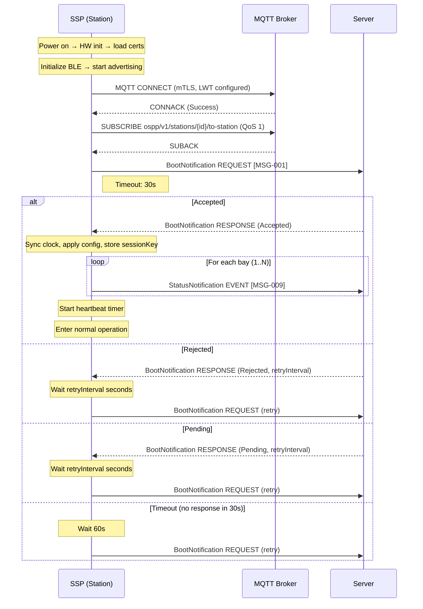
```mermaid
sequenceDiagram
    participant SSP as SSP (Station)
    participant Broker as MQTT Broker
    participant Server

    Note over SSP: Power on → HW init → load certs
    Note over SSP: Initialize BLE → start advertising

    SSP->>Broker: MQTT CONNECT (mTLS, LWT configured)
    Broker-->>SSP: CONNACK (Success)
    SSP->>Broker: SUBSCRIBE ospp/v1/stations/{id}/to-station (QoS 1)
    Broker-->>SSP: SUBACK

    SSP->>Server: BootNotification REQUEST [MSG-001]
    Note right of SSP: Timeout: 30s

    alt Accepted
        Server-->>SSP: BootNotification RESPONSE (Accepted)
        Note over SSP: Sync clock, apply config, store sessionKey

        loop For each bay (1..N)
            SSP->>Server: StatusNotification EVENT [MSG-009]
        end

        Note over SSP: Start heartbeat timer
        Note over SSP: Enter normal operation

    else Rejected
        Server-->>SSP: BootNotification RESPONSE (Rejected, retryInterval)
        Note over SSP: Wait retryInterval seconds
        SSP->>Server: BootNotification REQUEST (retry)

    else Pending
        Server-->>SSP: BootNotification RESPONSE (Pending, retryInterval)
        Note over SSP: Wait retryInterval seconds
        SSP->>Server: BootNotification REQUEST (retry)

    else Timeout (no response in 30s)
        Note over SSP: Wait 60s
        SSP->>Server: BootNotification REQUEST (retry)
    end
```

### Happy Path

1. SSP powers on, initializes hardware, loads certificates and configuration from NVS
2. SSP initializes BLE radio and starts advertising as `OSPP-{station_id_last6}` (BLE starts **before** MQTT)
3. SSP opens MQTT connection to broker (mTLS on port 8883, LWT pre-configured as ConnectionLost [MSG-011])
4. Broker authenticates the client certificate, returns CONNACK success
5. SSP subscribes to `ospp/v1/stations/{station_id}/to-station` with QoS 1
6. SSP sends **BootNotification REQUEST** [MSG-001] with station identity, firmware version, capabilities, and `pendingOfflineTransactions` count
7. Server validates the station, returns **BootNotification RESPONSE** [MSG-001] with `status: "Accepted"`, `serverTime`, `heartbeatIntervalSec`, optional `configuration` overrides, and `sessionKey` (if message signing is enabled)
8. SSP synchronizes its clock to `serverTime`, applies any configuration overrides, stores the HMAC session key
9. SSP sends one **StatusNotification EVENT** [MSG-009] per bay, reporting `bayNumber`, `status`, and available `services[]`
10. SSP starts the heartbeat timer at `heartbeatIntervalSec` seconds
11. SSP enters normal operation — ready to accept commands

### Alternative Paths

**A1 — Rejected:** Server returns `Rejected` with `retryInterval`. The SSP waits `retryInterval` seconds and retries from step 6. Common causes: station not registered, certificate revoked, station decommissioned.

**A2 — Pending:** Server returns `Pending` with `retryInterval`. The SSP waits and retries. This occurs when the server is starting up or performing maintenance.

**A3 — Timeout:** No response received within 30 seconds. The SSP waits 60 seconds and retries from step 6. The SSP MUST NOT send any other messages until BootNotification succeeds.

**A4 — Reconnect (not first boot):** If the SSP was previously connected and has `pendingOfflineTransactions > 0`, it proceeds through the normal boot sequence first, then begins [Offline → Online Reconciliation (Flow §10)](#10-offline--online-reconciliation) after step 11.

### Error Paths

| Error | Cause | SSP Action |
|-------|-------|------------|
| CONNACK refused | Invalid certificate, broker unreachable | Reconnect with exponential backoff (see [Flow §9](#9-error-recovery--reconnection)) |
| `1007 PROTOCOL_VERSION_MISMATCH` | Major version incompatible | Log error, await firmware update; do NOT retry |
| `2001 STATION_NOT_REGISTERED` | Station unknown to server | Log error, enter provisioning mode |
| TLS handshake failure | Certificate expired or revoked | Send SecurityEvent [MSG-012] (if possible), await manual intervention |

### Postconditions

| Component | State |
|-----------|-------|
| SSP | Normal operation, heartbeat timer running |
| SSP Bays | Reported to Server (Available, Faulted, Unavailable, etc.) |
| Server | Station marked online, last boot time recorded, bay status updated |
| BLE | Advertising active (independent of MQTT) |
| HMAC Session Key | Established (if signing enabled) |

---

## 2. Station Provisioning

**Description:** A new station is registered in the management portal, a provisioning token is generated, and the physical station is configured with certificates and identifiers via a one-time HTTPS call.

### Preconditions

- Administrator has created the station entry in the management portal
- A provisioning token has been generated (24-hour TTL, single-use)
- The station has network connectivity (Ethernet, WiFi, or cellular)
- The station is in "not provisioned" state (no certificates in NVS)

### Sequence Diagram

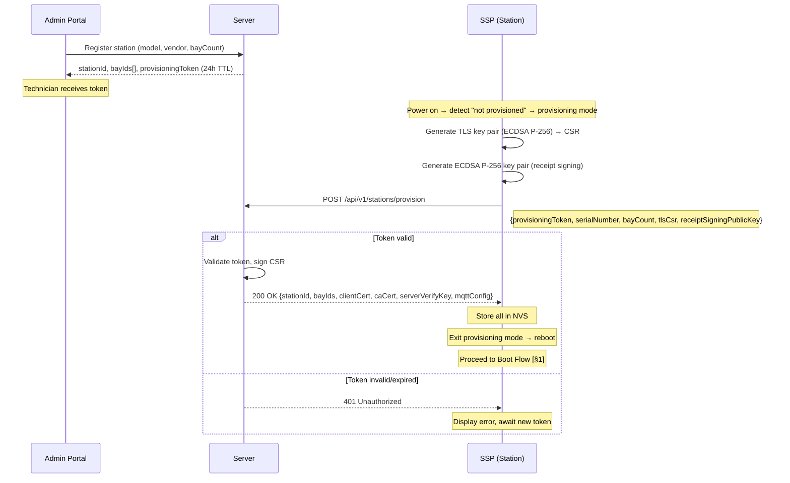
```mermaid
sequenceDiagram
    participant Admin as Admin Portal
    participant Server
    participant SSP as SSP (Station)

    Admin->>Server: Register station (model, vendor, bayCount)
    Server-->>Admin: stationId, bayIds[], provisioningToken (24h TTL)
    Note over Admin: Technician receives token

    Note over SSP: Power on → detect "not provisioned" → provisioning mode

    SSP->>SSP: Generate TLS key pair (ECDSA P-256) → CSR
    SSP->>SSP: Generate ECDSA P-256 key pair (receipt signing)

    SSP->>Server: POST /api/v1/stations/provision
    Note right of SSP: {provisioningToken, serialNumber, bayCount, tlsCsr, receiptSigningPublicKey}

    alt Token valid
        Server->>Server: Validate token, sign CSR
        Server-->>SSP: 200 OK {stationId, bayIds, clientCert, caCert, serverVerifyKey, mqttConfig}
        Note over SSP: Store all in NVS
        Note over SSP: Exit provisioning mode → reboot
        Note over SSP: Proceed to Boot Flow [§1]
    else Token invalid/expired
        Server-->>SSP: 401 Unauthorized
        Note over SSP: Display error, await new token
    end
```

### Happy Path

1. Administrator registers a new station in the management portal with model, vendor, serial number, and bay count
2. Server generates `stationId` (`stn_{uuid}`), `bayIds[]` (`bay_{uuid}` per bay), and a provisioning token (UUID, 24-hour TTL, single-use)
3. Technician installs the station and provides the provisioning token (via USB, local AP, or physical keypad)
4. SSP powers on, detects no certificates in NVS, enters provisioning mode
5. SSP generates a TLS key pair (ECDSA P-256) and produces a Certificate Signing Request (CSR) with CN = `stn_{station_id}`
6. SSP generates an ECDSA P-256 key pair for offline receipt signing (private key never leaves the device)
7. SSP sends `POST /api/v1/stations/provision` with the provisioning token, serial number, bay count, TLS CSR, and receipt-signing public key
8. Server validates the token (not expired, not used), signs the CSR with the Station CA, and returns: `stationId`, `bayIds[]`, signed client certificate, CA certificate chain, server ECDSA P-256 verify key, and MQTT broker configuration
9. SSP stores all credentials and configuration in NVS, marks itself as provisioned
10. SSP exits provisioning mode and reboots
11. SSP proceeds to [Station Boot & Registration (Flow §1)](#1-station-boot--registration)

### Error Paths

| Error | Cause | SSP Action |
|-------|-------|------------|
| 401 Unauthorized | Token expired or already used | Display error, await new provisioning token |
| 400 Bad Request | Invalid CSR or missing fields | Log error, regenerate keys, retry |
| Network unreachable | No connectivity | Retry with backoff, await network |

### Postconditions

| Component | State |
|-----------|-------|
| SSP NVS | Contains: stationId, bayIds, TLS cert+key, ECDSA key pair, CA cert, serverVerifyKey, mqttConfig |
| SSP | Provisioned, ready to boot |
| Server | Station registered, certificate issued, provisioning token consumed |
| Provisioning Token | Invalidated (single-use) |

---

## 3. Online Session — Mobile App

**Description:** An authenticated mobile app user starts a service session. The server validates the request, debits credits from the user's wallet, and instructs the station to activate the service via MQTT.

### Preconditions

- User is authenticated in the mobile app (valid JWT access token)
- User has sufficient credit balance
- Station is online (MQTT connected, boot accepted)
- Target bay is in `Available` or `Reserved` (by this user) status
- User has no other active session

### Sequence Diagram

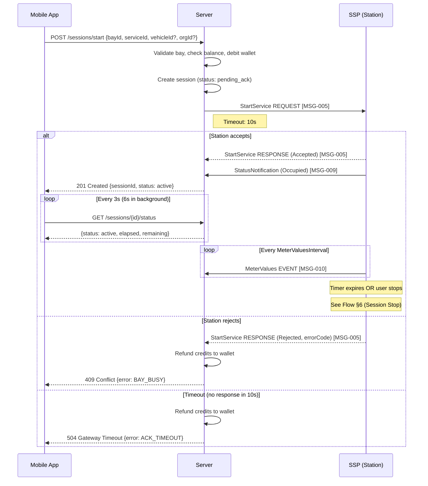
```mermaid
sequenceDiagram
    participant App as Mobile App
    participant Server
    participant SSP as SSP (Station)

    App->>Server: POST /sessions/start {bayId, serviceId, vehicleId?, orgId?}
    Server->>Server: Validate bay, check balance, debit wallet
    Server->>Server: Create session (status: pending_ack)
    Server->>SSP: StartService REQUEST [MSG-005]
    Note right of Server: Timeout: 10s

    alt Station accepts
        SSP-->>Server: StartService RESPONSE (Accepted) [MSG-005]
        SSP->>Server: StatusNotification (Occupied) [MSG-009]
        Server-->>App: 201 Created {sessionId, status: active}

        loop Every 3s (6s in background)
            App->>Server: GET /sessions/{id}/status
            Server-->>App: {status: active, elapsed, remaining}
        end

        loop Every MeterValuesInterval
            SSP->>Server: MeterValues EVENT [MSG-010]
        end

        Note over SSP: Timer expires OR user stops
        Note over SSP: See Flow §6 (Session Stop)

    else Station rejects
        SSP-->>Server: StartService RESPONSE (Rejected, errorCode) [MSG-005]
        Server->>Server: Refund credits to wallet
        Server-->>App: 409 Conflict {error: BAY_BUSY}

    else Timeout (no response in 10s)
        Server->>Server: Refund credits to wallet
        Server-->>App: 504 Gateway Timeout {error: ACK_TIMEOUT}
    end
```

### Happy Path

1. **App** sends `POST /sessions/start` with `bayId`, `serviceId`, optional `vehicleId` and `organizationId`
2. **Server** validates: bay exists, bay is Available (or Reserved by this user), service is in catalog, user has sufficient credits, user has no active session
3. **Server** debits credits from user's wallet (pre-authorization for max duration)
4. **Server** creates a session record with `status: pending_ack`
5. **Server** sends **StartService REQUEST** [MSG-005] to the SSP via MQTT with `sessionId`, `bayId`, `serviceId`, `durationSeconds`, `sessionSource: "MobileApp"`
6. **SSP** validates the bay state, activates the hardware
7. **SSP** sends **StartService RESPONSE** [MSG-005] with `status: "Accepted"`
8. **SSP** sends **StatusNotification** [MSG-009] with `status: "Occupied"`
9. **Server** updates session to `status: active`, returns `201 Created` to the App
10. **App** polls `GET /sessions/{id}/status` every 3 seconds (6 seconds when in background)
11. **SSP** sends periodic **MeterValues** [MSG-010] events (every `MeterValuesInterval` seconds, default 15)
12. Session continues until stopped (see [Flow §6](#6-session-stop--completion))

### Alternative Paths

**A1 — Bay already reserved by this user:** If the bay was previously reserved (e.g., from web payment flow), the SSP consumes the reservation at step 6 and transitions directly from `Reserved` to `Occupied`. The `reservationId` is included in the StartService REQUEST.

**A2 — Corporate session:** If `organizationId` is provided, Server validates the corporate policy (time restrictions, vehicle matching, credit limit) before step 3. Credits are debited from the organization's wallet.

### Error Paths

| Step | Error | Cause | Action |
|:----:|-------|-------|--------|
| 2 | `400 VALIDATION_ERROR` | Missing/invalid fields | Return error details to App |
| 2 | `402 INSUFFICIENT_BALANCE` | Not enough credits | App shows top-up prompt |
| 2 | `409 BAY_BUSY` | Bay occupied or reserved | App suggests another bay |
| 2 | `409 SESSION_ALREADY_ACTIVE` | User has an active session | App shows active session |
| 2 | `409 STATION_OFFLINE` | Station not connected via MQTT | App shows offline message |
| 5 | `504 ACK_TIMEOUT` | SSP did not respond within 10s | Server refunds 100%, App shows retry prompt |
| 7 | `3001 BAY_BUSY` | Bay became occupied between validation and command | Server refunds 100% |
| 7 | `3009 HARDWARE_ACTIVATION_FAILED` | Hardware failed to start | Server refunds 100% |

**Refund policy:** Any failure at or after step 3 (credits debited) triggers an automatic full refund to the user's wallet.

### Postconditions

| Component | State |
|-----------|-------|
| SSP Bay | `Occupied` — hardware active, timer running |
| Server Session | `active` — elapsed time tracked |
| User Wallet | Debited (pre-authorization for max duration) |
| App | Polling session status |

---

## 4. Web Payment Session — Anonymous

**Description:** An anonymous user scans a QR code at the station, selects a service, pays with a card (3D Secure), and the station starts the service. No account or app required.

### Preconditions

- Station has a QR code displayed (encoding the station/bay code)
- Station is online (MQTT connected)
- Payment gateway is operational
- Target bay is in `Available` status

### Sequence Diagram

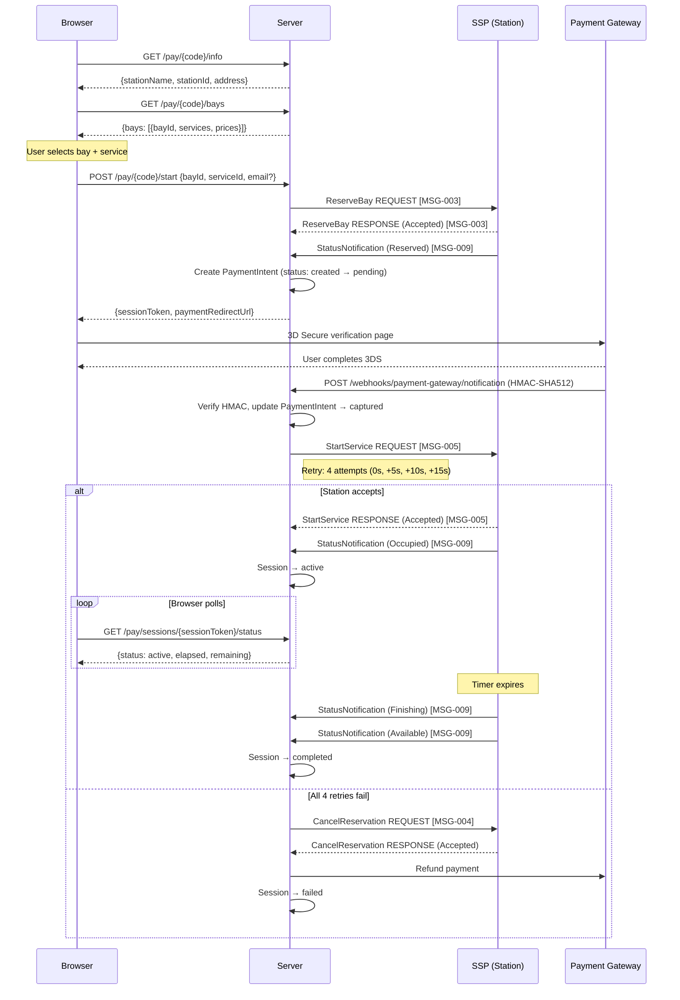
```mermaid
sequenceDiagram
    participant Browser as Browser
    participant Server
    participant SSP as SSP (Station)
    participant PG as Payment Gateway

    Browser->>Server: GET /pay/{code}/info
    Server-->>Browser: {stationName, stationId, address}
    Browser->>Server: GET /pay/{code}/bays
    Server-->>Browser: {bays: [{bayId, services, prices}]}

    Note over Browser: User selects bay + service

    Browser->>Server: POST /pay/{code}/start {bayId, serviceId, email?}
    Server->>SSP: ReserveBay REQUEST [MSG-003]
    SSP-->>Server: ReserveBay RESPONSE (Accepted) [MSG-003]
    SSP->>Server: StatusNotification (Reserved) [MSG-009]

    Server->>Server: Create PaymentIntent (status: created → pending)
    Server-->>Browser: {sessionToken, paymentRedirectUrl}

    Browser->>PG: 3D Secure verification page
    PG-->>Browser: User completes 3DS

    PG->>Server: POST /webhooks/payment-gateway/notification (HMAC-SHA512)
    Server->>Server: Verify HMAC, update PaymentIntent → captured

    Server->>SSP: StartService REQUEST [MSG-005]
    Note right of Server: Retry: 4 attempts (0s, +5s, +10s, +15s)

    alt Station accepts
        SSP-->>Server: StartService RESPONSE (Accepted) [MSG-005]
        SSP->>Server: StatusNotification (Occupied) [MSG-009]
        Server->>Server: Session → active

        loop Browser polls
            Browser->>Server: GET /pay/sessions/{sessionToken}/status
            Server-->>Browser: {status: active, elapsed, remaining}
        end

        Note over SSP: Timer expires
        SSP->>Server: StatusNotification (Finishing) [MSG-009]
        SSP->>Server: StatusNotification (Available) [MSG-009]
        Server->>Server: Session → completed

    else All 4 retries fail
        Server->>SSP: CancelReservation REQUEST [MSG-004]
        SSP-->>Server: CancelReservation RESPONSE (Accepted)
        Server->>PG: Refund payment
        Server->>Server: Session → failed
    end
```

### Happy Path

1. **Browser** scans QR code → `GET /pay/{code}/info` — retrieves station name, address, and location
2. **Browser** calls `GET /pay/{code}/bays` — retrieves bay list with services and prices
3. User selects a bay and service
4. **Browser** sends `POST /pay/{code}/start` with `bayId`, `serviceId`, and optional `email` (for receipt)
5. **Server** sends **ReserveBay REQUEST** [MSG-003] to the SSP with `reservationId`, bay, and expiration (default 180s TTL)
6. **SSP** transitions bay to `Reserved`, sends **ReserveBay RESPONSE** [MSG-003] `Accepted`
7. **SSP** sends **StatusNotification** [MSG-009] with `status: "Reserved"`
8. **Server** creates a PaymentIntent (`created` → `pending`), returns a `sessionToken` (UUID v4, 10-min TTL) and payment gateway redirect URL to the Browser
9. **Browser** redirects to the payment gateway 3D Secure verification page
10. User completes 3DS authentication
11. **PG** sends `POST /webhooks/payment-gateway/notification` (HMAC-SHA512 signed) to Server
12. **Server** verifies webhook HMAC (timing-safe comparison), updates PaymentIntent to `captured`
13. **Server** sends **StartService REQUEST** [MSG-005] to the SSP
14. **SSP** activates hardware, sends **StartService RESPONSE** [MSG-005] `Accepted`
15. **SSP** sends **StatusNotification** [MSG-009] with `status: "Occupied"`
16. **Server** updates session to `active`
17. **Browser** polls `GET /pay/sessions/{sessionToken}/status` for progress
18. Timer expires → **SSP** sends **StatusNotification** [MSG-009] `Finishing` then `Available`
19. **Server** marks session as `completed`
20. If `email` was provided, Server sends a receipt email

### Alternative Paths

**A1 — Station offline at reservation:** Server creates a server-side BayLock (3-minute TTL) instead of sending ReserveBay MQTT. If the station does not come online before payment completes, the session fails and payment is refunded.

**A2 — Optional email receipt:** After completion, the Browser MAY call `POST /pay/sessions/{sessionToken}/receipt` with an email address. If provided at step 4, the receipt is sent automatically.

**A3 — Post-payment account creation:** After session completion, the Browser MAY call `POST /pay/register` to create an account and receive credit for the session (loyalty conversion).

### Error Paths

| Step | Error | Cause | Action |
|:----:|-------|-------|--------|
| 5-6 | ReserveBay `Rejected` | Bay busy/faulted/maintenance | Server returns 409 to Browser, no payment initiated |
| 9-10 | 3DS timeout (3 min) | User did not complete payment | Server sends CancelReservation [MSG-004], session → failed |
| 11 | Webhook HMAC invalid | Tampered or replayed webhook | Server rejects silently, log SecurityEvent |
| 11 | PaymentIntent expired (5 min) | Payment took too long | Server sends CancelReservation [MSG-004], refund |
| 13 | StartService timeout / reject | All 4 retries fail | Server sends CancelReservation [MSG-004], refund 100% |
| 17 | Session token expired (10 min) | Browser lost connection | Session continues on station; no status updates to Browser |

**StartService retry policy (web payment):** Server retries up to 4 times with delays of 0s, +5s, +10s, +15s (each with 10s timeout). If all retries fail, CancelReservation is sent and the payment is refunded.

**Anti-abuse (5 layers):**
1. IP rate limiting: 5 sessions / 30 min per IP
2. Device fingerprint: 3 sessions / 30 min per fingerprint
3. Progressive CAPTCHA (Cloudflare Turnstile) on suspicious patterns
4. Abandon scoring: 5+ abandoned → 15-min block
5. Bay lock only at `POST /pay/{code}/start` (not at browse)

### Postconditions

| Component | State |
|-----------|-------|
| SSP Bay | `Occupied` → `Finishing` → `Available` (timer-driven) |
| Server Session | `completed` |
| PaymentIntent | `captured` → `settled` (async settlement) |
| Browser | Shows "service complete" status |

---

## 5a. Full Offline Session — BLE

**Description:** Both the phone and the station are offline. The user connects via BLE, authenticates with a pre-armed OfflinePass, and the station runs the service using only local validation. The transaction is reconciled when connectivity is restored.

### Preconditions

- User has a valid OfflinePass in the app (pre-armed while online)
- Station BLE is advertising
- Station has the server's ECDSA P-256 verify key in NVS
- Station `OfflineModeEnabled` configuration is `true`
- Station has not exceeded `stationMaxOfflineTx` limit
- App has biometric/PIN capability

### Sequence Diagram

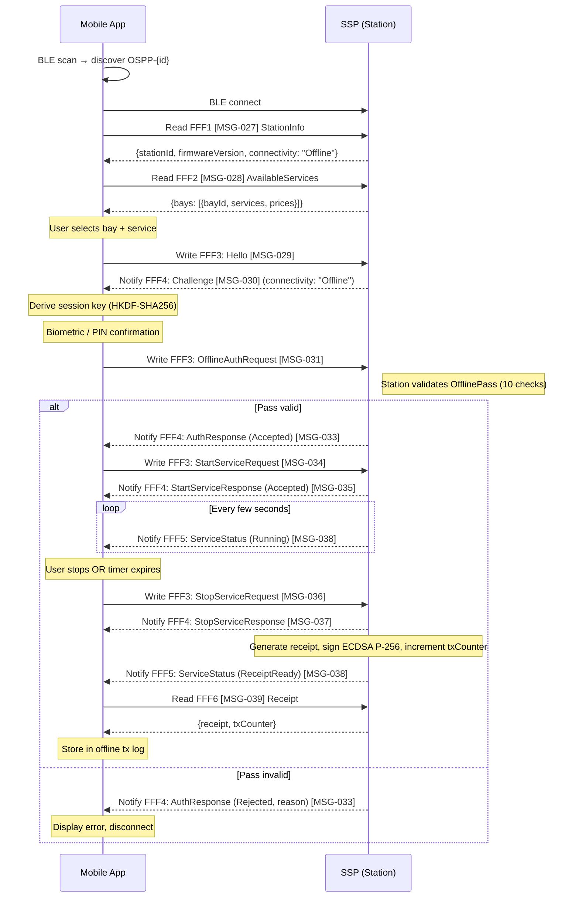
```mermaid
sequenceDiagram
    participant App as Mobile App
    participant SSP as SSP (Station)

    App->>App: BLE scan → discover OSPP-{id}
    App->>SSP: BLE connect

    App->>SSP: Read FFF1 [MSG-027] StationInfo
    SSP-->>App: {stationId, firmwareVersion, connectivity: "Offline"}
    App->>SSP: Read FFF2 [MSG-028] AvailableServices
    SSP-->>App: {bays: [{bayId, services, prices}]}

    Note over App: User selects bay + service

    App->>SSP: Write FFF3: Hello [MSG-029]
    SSP-->>App: Notify FFF4: Challenge [MSG-030] (connectivity: "Offline")

    Note over App: Derive session key (HKDF-SHA256)
    Note over App: Biometric / PIN confirmation

    App->>SSP: Write FFF3: OfflineAuthRequest [MSG-031]
    Note right of SSP: Station validates OfflinePass (10 checks)

    alt Pass valid
        SSP-->>App: Notify FFF4: AuthResponse (Accepted) [MSG-033]

        App->>SSP: Write FFF3: StartServiceRequest [MSG-034]
        SSP-->>App: Notify FFF4: StartServiceResponse (Accepted) [MSG-035]

        loop Every few seconds
            SSP-->>App: Notify FFF5: ServiceStatus (Running) [MSG-038]
        end

        Note over App: User stops OR timer expires
        App->>SSP: Write FFF3: StopServiceRequest [MSG-036]
        SSP-->>App: Notify FFF4: StopServiceResponse [MSG-037]

        Note over SSP: Generate receipt, sign ECDSA P-256, increment txCounter
        SSP-->>App: Notify FFF5: ServiceStatus (ReceiptReady) [MSG-038]

        App->>SSP: Read FFF6 [MSG-039] Receipt
        SSP-->>App: {receipt, txCounter}
        Note over App: Store in offline tx log

    else Pass invalid
        SSP-->>App: Notify FFF4: AuthResponse (Rejected, reason) [MSG-033]
        Note over App: Display error, disconnect
    end
```

### Happy Path

1. **App** scans for BLE devices, discovers station advertising as `OSPP-{station_id_last6}`
2. **App** establishes BLE connection
3. **App** reads **StationInfo** [MSG-027] from FFF1 — verifies station identity, checks `connectivity: "Offline"`
4. **App** reads **AvailableServices** [MSG-028] from FFF2 — displays service catalog with prices
5. User selects a bay and service
6. **App** writes **HELLO** [MSG-029] to FFF3 with `deviceId`, `appNonce`, `appVersion`
7. **SSP** responds with **CHALLENGE** [MSG-030] on FFF4 with `stationNonce`, `stationConnectivity: "Offline"`
8. **App** derives the session key via HKDF-SHA256 (`ikm = LTK || appNonce || stationNonce`)
9. **App** requests biometric or PIN confirmation from the user
10. **App** writes **OfflineAuthRequest** [MSG-031] to FFF3 with the OfflinePass, counter, and session proof
11. **SSP** validates the OfflinePass (10 checks — signature, expiry, epoch, device, limits, interval, counter)
12. **SSP** sends **AuthResponse** [MSG-033] `Accepted` on FFF4 with session key confirmation
13. **App** writes **StartServiceRequest** [MSG-034] to FFF3 with `bayId`, `serviceId`, `requestedDurationSeconds`
14. **SSP** activates hardware, sends **StartServiceResponse** [MSG-035] `Accepted` with `sessionId` and `offlineTxId`
15. **SSP** sends periodic **ServiceStatus** [MSG-038] on FFF5 (`Running`, elapsed, remaining, meter values)
16. User stops (or timer expires) → **App** writes **StopServiceRequest** [MSG-036] to FFF3
17. **SSP** deactivates hardware, sends **StopServiceResponse** [MSG-037] with `actualDurationSeconds` and `creditsCharged`
18. **SSP** generates receipt: signs with ECDSA P-256 (RFC 6979), increments `txCounter`
19. **SSP** sends **ServiceStatus** [MSG-038] with `status: "ReceiptReady"`
20. **App** reads **Receipt** [MSG-039] from FFF6 — stores the signed receipt in its offline transaction log
21. **App** disconnects BLE

**Later, when connectivity is restored:**
- **SSP** reconciles via [Flow §10](#10-offline--online-reconciliation) (TransactionEvent [MSG-007])
- **App** syncs via `POST /me/offline-txs` (backup reconciliation path)

### Alternative Paths

**A1 — Timer auto-stop:** If the user does not send StopServiceRequest, the station automatically stops when `requestedDurationSeconds` expires. The station still generates a receipt and notifies via FFF5.

**A2 — BLE disconnect during session:** If BLE disconnects during an active session, the station continues the service until the timer expires. The receipt remains readable on FFF6 for the next BLE connection (within a configurable window).

### Error Paths

| Step | Error | Code | App Action |
|:----:|-------|------|------------|
| 11 | Signature invalid | `2002` | Display "Pass invalid", disconnect |
| 11 | Pass expired | `2003` | Display "Pass expired, go online to renew" |
| 11 | Epoch revoked | `2004` | Display "Pass revoked" |
| 11 | Limits exceeded | `4002` | Display "Offline limit reached, go online" |
| 11 | Rate limited | `4003` | Display "Wait before next session" |
| 11 | Counter replay | `2005` | Display "Security error" |
| 11 | OfflinePass stationId constraint does not match | `2006` | Display "Station mismatch" |
| 14 | Bay busy | `3001` | Display "Bay occupied" |
| 14 | Hardware failure | `3009` | Display "Hardware error" |

### Postconditions

| Component | State |
|-----------|-------|
| SSP Bay | `Available` (after stop and wind-down) |
| SSP Offline Log | New transaction with receipt, incremented txCounter |
| App Offline Log | Signed receipt stored, pending server sync |
| User Wallet | Not debited (debit occurs during reconciliation [Flow §10]) |

---

## 5b. Partial A — Phone Online, Station Offline

**Description:** The user's phone has internet, but the station is offline (MQTT disconnected). The app obtains a server-signed authorization and delivers it to the station via BLE.

### Preconditions

- App has internet connectivity
- Station is offline (no MQTT) but BLE is advertising
- User is authenticated (valid JWT)
- User has sufficient credits

### Sequence Diagram

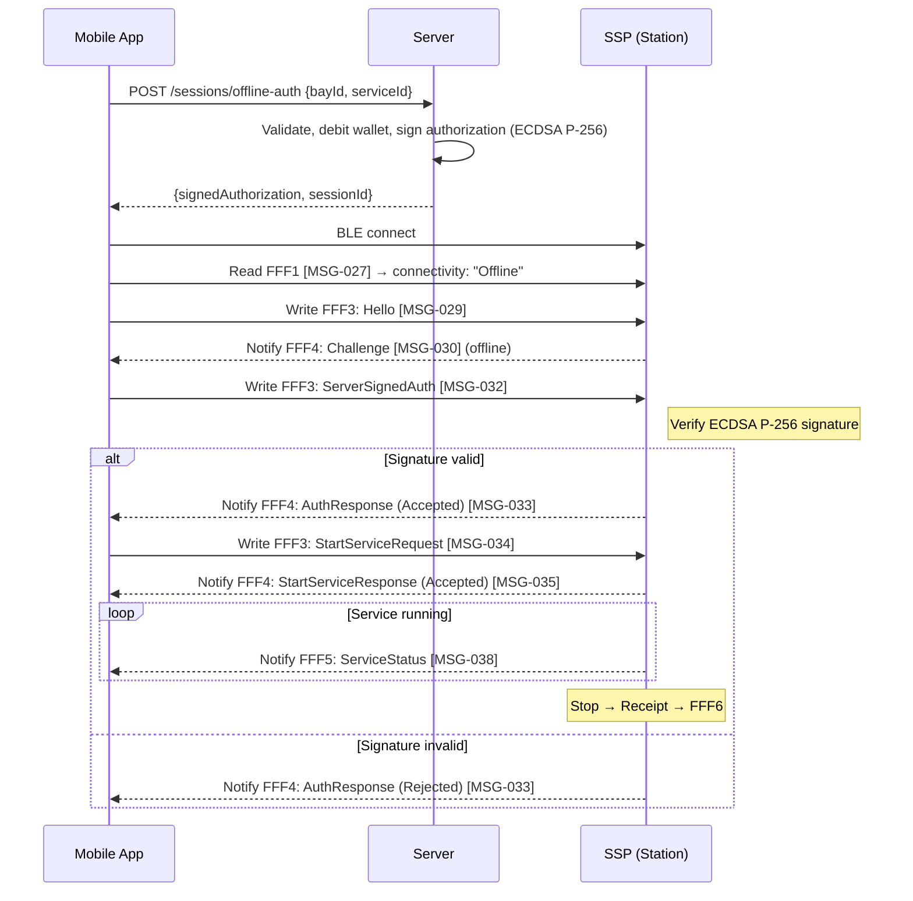
```mermaid
sequenceDiagram
    participant App as Mobile App
    participant Server
    participant SSP as SSP (Station)

    App->>Server: POST /sessions/offline-auth {bayId, serviceId}
    Server->>Server: Validate, debit wallet, sign authorization (ECDSA P-256)
    Server-->>App: {signedAuthorization, sessionId}

    App->>SSP: BLE connect
    App->>SSP: Read FFF1 [MSG-027] → connectivity: "Offline"
    App->>SSP: Write FFF3: Hello [MSG-029]
    SSP-->>App: Notify FFF4: Challenge [MSG-030] (offline)

    App->>SSP: Write FFF3: ServerSignedAuth [MSG-032]
    Note right of SSP: Verify ECDSA P-256 signature

    alt Signature valid
        SSP-->>App: Notify FFF4: AuthResponse (Accepted) [MSG-033]
        App->>SSP: Write FFF3: StartServiceRequest [MSG-034]
        SSP-->>App: Notify FFF4: StartServiceResponse (Accepted) [MSG-035]

        loop Service running
            SSP-->>App: Notify FFF5: ServiceStatus [MSG-038]
        end

        Note over SSP: Stop → Receipt → FFF6
    else Signature invalid
        SSP-->>App: Notify FFF4: AuthResponse (Rejected) [MSG-033]
    end
```

### Happy Path

1. **App** sends `POST /sessions/offline-auth` to Server with `bayId` and `serviceId`
2. **Server** validates the user, debits credits, signs an authorization blob with ECDSA P-256 server key (includes `bayId`, `serviceId`, `durationSeconds`, `issuedAt`, `expiresAt`)
3. **Server** returns `signedAuthorization` (Base64) and `sessionId` to the App
4. **App** connects to the SSP via BLE
5. **App** reads **StationInfo** [MSG-027] — confirms `connectivity: "Offline"`
6. **App** writes **HELLO** [MSG-029] → SSP responds with **CHALLENGE** [MSG-030]
7. **App** writes **ServerSignedAuth** [MSG-032] with the server-signed authorization blob and `sessionId`
8. **SSP** verifies the ECDSA P-256 signature using `OfflinePassPublicKey` (cached previous key also accepted during the grace period)
9. **SSP** sends **AuthResponse** [MSG-033] `Accepted`
10. **App** writes **StartServiceRequest** [MSG-034] → SSP starts service
11. Service runs with **ServiceStatus** [MSG-038] updates
12. Stop → **Receipt** [MSG-039] generation (same as Full Offline steps 16-21)

### Error Paths

| Step | Error | Action |
|:----:|-------|--------|
| 2 | `402 INSUFFICIENT_BALANCE` | App shows top-up prompt |
| 2 | `409 STATION_OFFLINE` | Server cannot verify bay status — proceeds with signed auth (optimistic) |
| 8 | ECDSA P-256 signature invalid | SSP rejects — key mismatch or tampered auth |
| 8 | Authorization expired | SSP rejects — user took too long between server call and BLE |

### Postconditions

| Component | State |
|-----------|-------|
| User Wallet | Debited at step 2 (by Server) |
| SSP | Has server-signed proof; transaction logged locally |
| Server | Session created (status: pending — awaiting reconciliation) |

---

## 5c. Partial B — Phone Offline, Station Online

**Description:** The user's phone is offline, but the station has MQTT connectivity. The app presents an OfflinePass via BLE, and the station forwards it to the server for real-time validation.

### Preconditions

- Station is online (MQTT connected)
- App has no internet but has a valid OfflinePass
- User completed biometric/PIN setup

### Sequence Diagram

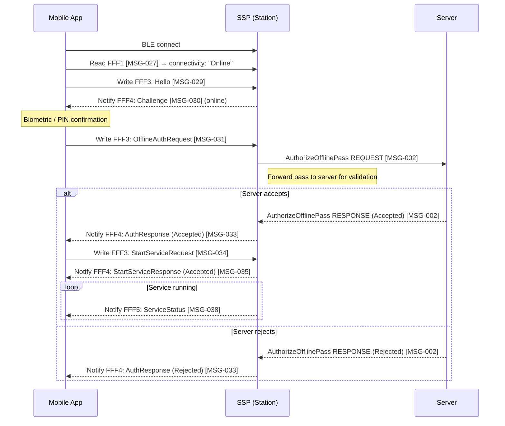
```mermaid
sequenceDiagram
    participant App as Mobile App
    participant SSP as SSP (Station)
    participant Server

    App->>SSP: BLE connect
    App->>SSP: Read FFF1 [MSG-027] → connectivity: "Online"
    App->>SSP: Write FFF3: Hello [MSG-029]
    SSP-->>App: Notify FFF4: Challenge [MSG-030] (online)

    Note over App: Biometric / PIN confirmation

    App->>SSP: Write FFF3: OfflineAuthRequest [MSG-031]

    SSP->>Server: AuthorizeOfflinePass REQUEST [MSG-002]
    Note right of SSP: Forward pass to server for validation

    alt Server accepts
        Server-->>SSP: AuthorizeOfflinePass RESPONSE (Accepted) [MSG-002]
        SSP-->>App: Notify FFF4: AuthResponse (Accepted) [MSG-033]
        App->>SSP: Write FFF3: StartServiceRequest [MSG-034]
        SSP-->>App: Notify FFF4: StartServiceResponse (Accepted) [MSG-035]

        loop Service running
            SSP-->>App: Notify FFF5: ServiceStatus [MSG-038]
        end

    else Server rejects
        Server-->>SSP: AuthorizeOfflinePass RESPONSE (Rejected) [MSG-002]
        SSP-->>App: Notify FFF4: AuthResponse (Rejected) [MSG-033]
    end
```

### Happy Path

1. **App** connects to SSP via BLE
2. **App** reads **StationInfo** [MSG-027] — sees `connectivity: "Online"`
3. **App** writes **HELLO** [MSG-029] → SSP responds with **CHALLENGE** [MSG-030] (`stationConnectivity: "Online"`)
4. **App** requests biometric/PIN confirmation
5. **App** writes **OfflineAuthRequest** [MSG-031] with the OfflinePass
6. **SSP** does NOT validate locally — instead forwards the pass to the Server via **AuthorizeOfflinePass REQUEST** [MSG-002] over MQTT
7. **Server** validates the pass (checks signature, expiry, epoch, limits, user balance), debits user wallet
8. **Server** sends **AuthorizeOfflinePass RESPONSE** [MSG-002] `Accepted` with `sessionId`, `durationSeconds`, `creditsAuthorized`
9. **SSP** relays result as **AuthResponse** [MSG-033] `Accepted` to App via BLE
10. **App** writes **StartServiceRequest** [MSG-034] → SSP starts service
11. Service runs with **ServiceStatus** [MSG-038] updates, then stop/receipt
12. Since the station is online, the session is tracked in real-time by Server (no later reconciliation needed)

### Error Paths

| Step | Error | Action |
|:----:|-------|--------|
| 6 | MQTT send failure | SSP falls back to local validation (like Full Offline) |
| 7 | Pass rejected by server | SSP relays rejection to App with error code |
| 7 | AuthorizeOfflinePass timeout (15s) | SSP falls back to local validation (degraded mode) |

### Postconditions

| Component | State |
|-----------|-------|
| User Wallet | Debited by Server (real-time, step 7) |
| Server Session | `active` (real-time tracking) |
| SSP | Online session — no reconciliation needed |

---

## 6. Session Stop & Completion

**Description:** An active session is stopped either by the user, by the session timer, or by an error condition. Applies to both online (MQTT) and offline (BLE) sessions.

### Preconditions

- A session is currently active on a bay
- Bay status is `Occupied`

### Sequence Diagram (Online — MQTT)

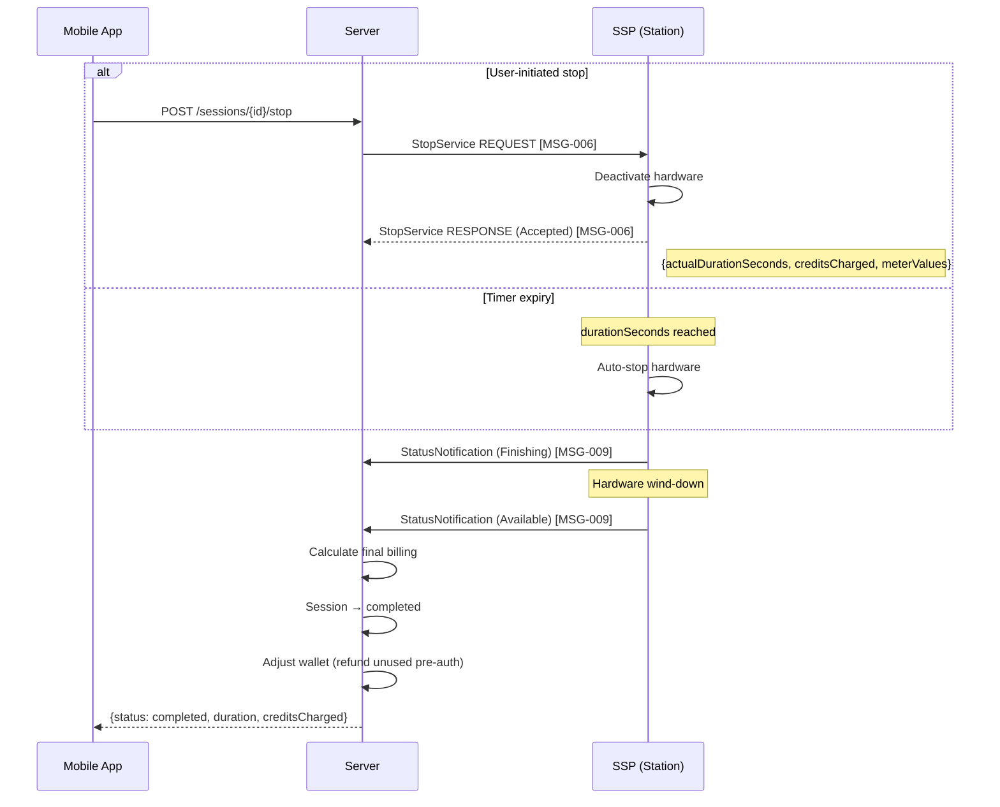
```mermaid
sequenceDiagram
    participant App as Mobile App
    participant Server
    participant SSP as SSP (Station)

    alt User-initiated stop
        App->>Server: POST /sessions/{id}/stop
        Server->>SSP: StopService REQUEST [MSG-006]
        SSP->>SSP: Deactivate hardware
        SSP-->>Server: StopService RESPONSE (Accepted) [MSG-006]
        Note right of SSP: {actualDurationSeconds, creditsCharged, meterValues}

    else Timer expiry
        Note over SSP: durationSeconds reached
        SSP->>SSP: Auto-stop hardware
    end

    SSP->>Server: StatusNotification (Finishing) [MSG-009]
    Note over SSP: Hardware wind-down
    SSP->>Server: StatusNotification (Available) [MSG-009]

    Server->>Server: Calculate final billing
    Server->>Server: Session → completed
    Server->>Server: Adjust wallet (refund unused pre-auth)
    Server-->>App: {status: completed, duration, creditsCharged}
```

### Happy Path (Online)

1. **Trigger:** User taps "Stop" in App, or session timer expires on SSP, or Server sends StopService
2. If user-initiated: **App** sends `POST /sessions/{id}/stop` → **Server** sends **StopService REQUEST** [MSG-006]
3. **SSP** deactivates hardware, calculates actual duration and credits charged
4. **SSP** sends **StopService RESPONSE** [MSG-006] with `actualDurationSeconds`, `creditsCharged`, final `meterValues`
5. **SSP** sends **StatusNotification** [MSG-009] `Finishing` (hardware winding down)
6. **SSP** sends **StatusNotification** [MSG-009] `Available` (bay ready for next user)
7. **Server** calculates final billing: `creditsCharged = ceil(actualDurationSeconds / 60 * priceCreditsPerMinute)`
8. **Server** adjusts wallet — refunds the difference between pre-authorized amount and actual charge
9. **Server** transitions session to `completed`
10. **App** receives completion status on next poll

### Happy Path (BLE / Offline)

1. **Trigger:** User taps "Stop" in App, or timer expires
2. **App** writes **StopServiceRequest** [MSG-036] to FFF3
3. **SSP** deactivates hardware, sends **StopServiceResponse** [MSG-037] with billing
4. **SSP** generates signed receipt (ECDSA P-256), increments `txCounter`
5. **SSP** notifies **ServiceStatus** [MSG-038] `ReceiptReady` on FFF5
6. **App** reads **Receipt** [MSG-039] from FFF6, stores in offline log

### Alternative Paths

**A1 — Hardware error during session:** SSP detects a hardware fault → auto-stops → sends StatusNotification `Faulted` [MSG-009]. Server applies pro-rated billing (if < 50% duration delivered → full refund).

**A2 — MQTT disconnect during session:** SSP continues the service (does NOT stop the service). On reconnection, SSP re-boots (BootNotification [MSG-001]) and reports the session outcome.

**A3 — StopService timeout:** If Server sends StopService and SSP does not respond within 10 seconds, Server marks the session as `failed`. SSP will report the actual outcome on next reconnection.

### Refund Policy

| Scenario | Refund | Amount |
|----------|--------|--------|
| Station NACK on StartService | Full | 100% |
| All retry attempts fail | Full | 100% |
| ACK_TIMEOUT (no response) | Full | 100% |
| Hardware error during active | Partial (pro-rated) | Based on time used |
| Station offline during active | Partial (pro-rated) | Based on time used |
| If < 50% duration delivered | Full | 100% (override pro-rate) |

### Postconditions

| Component | State |
|-----------|-------|
| SSP Bay | `Available` (or `Faulted` if hardware error) |
| Server Session | `completed` (or `failed`) |
| User Wallet | Final balance = pre-auth - actual charge (unused portion refunded) |

---

## 7. Credit Purchase / Top-up

**Description:** A mobile app user purchases credits using a real-currency payment. Credits are the internal currency used for all sessions.

### Preconditions

- User is authenticated in the mobile app
- Payment gateway is operational

### Sequence Diagram

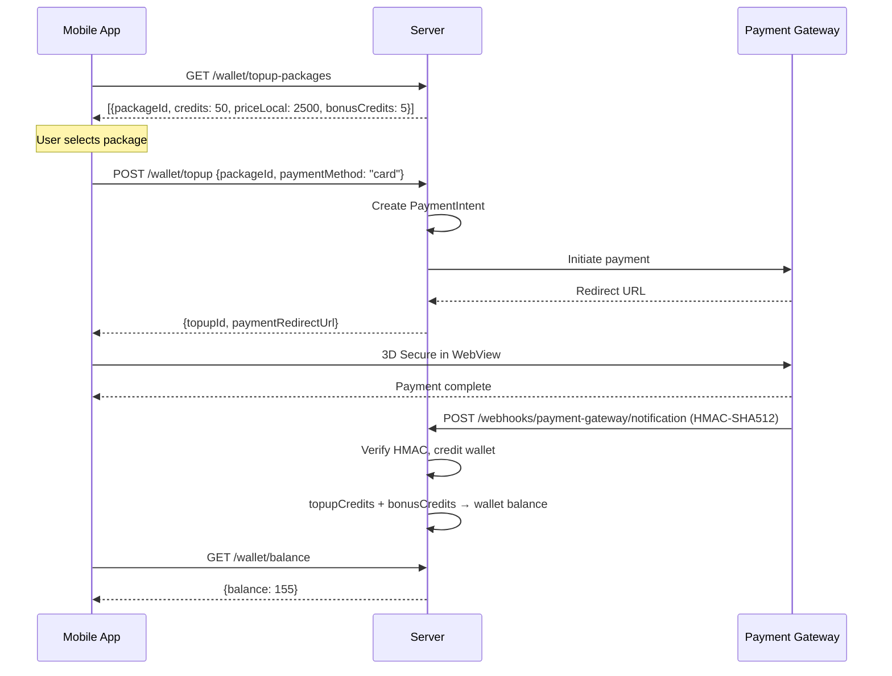
```mermaid
sequenceDiagram
    participant App as Mobile App
    participant Server
    participant PG as Payment Gateway

    App->>Server: GET /wallet/topup-packages
    Server-->>App: [{packageId, credits: 50, priceLocal: 2500, bonusCredits: 5}]

    Note over App: User selects package

    App->>Server: POST /wallet/topup {packageId, paymentMethod: "card"}
    Server->>Server: Create PaymentIntent
    Server->>PG: Initiate payment
    PG-->>Server: Redirect URL
    Server-->>App: {topupId, paymentRedirectUrl}

    App->>PG: 3D Secure in WebView
    PG-->>App: Payment complete

    PG->>Server: POST /webhooks/payment-gateway/notification (HMAC-SHA512)
    Server->>Server: Verify HMAC, credit wallet
    Server->>Server: topupCredits + bonusCredits → wallet balance

    App->>Server: GET /wallet/balance
    Server-->>App: {balance: 155}
```

### Happy Path

1. **App** calls `GET /wallet/topup-packages` — receives available packages (credits amount, local-currency price in minor units, bonus credits)
2. User selects a package
3. **App** sends `POST /wallet/topup` with `packageId` and `paymentMethod` (`"card"`, `"apple_pay"`, or `"google_pay"`)
4. **Server** creates a PaymentIntent, initiates payment with the gateway
5. **Server** returns `topupId` and payment redirect URL
6. **App** opens 3D Secure verification in a WebView
7. User completes payment authentication
8. **PG** sends webhook to Server with payment confirmation (HMAC-SHA512 signed)
9. **Server** verifies webhook, credits the user's wallet: `balance += packageCredits + bonusCredits`
10. **Server** generates a fiscal invoice for the transaction
11. **App** refreshes wallet balance

### Error Paths

| Step | Error | Action |
|:----:|-------|--------|
| 6-7 | Payment cancelled by user | PaymentIntent → cancelled, no credits |
| 7 | 3DS authentication failed | PaymentIntent → failed, no credits |
| 8 | Webhook timeout (5 min) | PaymentIntent → expired, no credits |
| 8 | HMAC verification failed | Reject webhook, log SecurityEvent |

### Postconditions

| Component | State |
|-----------|-------|
| User Wallet | Balance increased by `packageCredits + bonusCredits` |
| PaymentIntent | `captured` → `settled` |
| Fiscal Invoice | Generated for local-currency amount |

---

## 8. Heartbeat & Status Monitoring

**Description:** The station periodically sends heartbeats to prove liveness and synchronize its clock. The server uses missed heartbeats to detect offline stations.

### Preconditions

- Station has completed boot (BootNotification `Accepted`)
- Heartbeat timer is running at `heartbeatIntervalSec` seconds

### Sequence Diagram

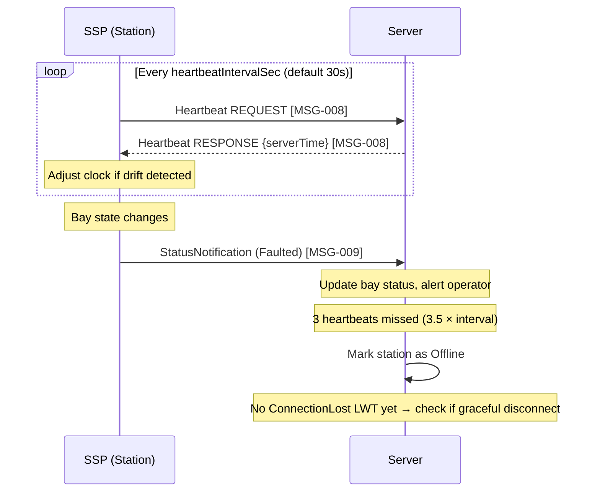
```mermaid
sequenceDiagram
    participant SSP as SSP (Station)
    participant Server

    loop Every heartbeatIntervalSec (default 30s)
        SSP->>Server: Heartbeat REQUEST [MSG-008]
        Server-->>SSP: Heartbeat RESPONSE {serverTime} [MSG-008]
        Note over SSP: Adjust clock if drift detected
    end

    Note over SSP: Bay state changes

    SSP->>Server: StatusNotification (Faulted) [MSG-009]
    Note over Server: Update bay status, alert operator

    Note over Server: 3 heartbeats missed (3.5 × interval)

    Server->>Server: Mark station as Offline
    Note over Server: No ConnectionLost LWT yet → check if graceful disconnect
```

### Happy Path

1. **SSP** sends **Heartbeat REQUEST** [MSG-008] every `heartbeatIntervalSec` seconds (default: 30)
2. **Server** responds with **Heartbeat RESPONSE** [MSG-008] containing `serverTime`
3. **SSP** compares `serverTime` with local clock; if drift exceeds threshold, adjusts clock
4. **Server** records last heartbeat timestamp per station

### Station Offline Detection

The Server MUST track the last heartbeat time for each station. Offline detection logic:

| Condition | Server Action |
|-----------|---------------|
| 1 missed heartbeat | No action (network jitter) |
| 2 missed heartbeats | Mark station as `degraded` (internal) |
| 3+ missed heartbeats (`heartbeatIntervalSec * 3.5` elapsed) | Mark station as `Offline` |
| ConnectionLost LWT [MSG-011] received | Immediately mark as `Offline` |
| Station sends BootNotification [MSG-001] | Mark as `Online`, process boot sequence |

### Postconditions

| Component | State |
|-----------|-------|
| SSP Clock | Synchronized with server (±1 second) |
| Server | Station online status confirmed, last heartbeat time updated |

---

## 9. Error Recovery & Reconnection

**Description:** When the MQTT connection drops, the station continues active sessions, buffers events, and attempts to reconnect with exponential backoff. On reconnection, it re-registers with the server.

### Preconditions

- Station was previously connected (boot accepted)
- MQTT connection has been lost (TCP disconnect, broker failure, network outage)

### Sequence Diagram

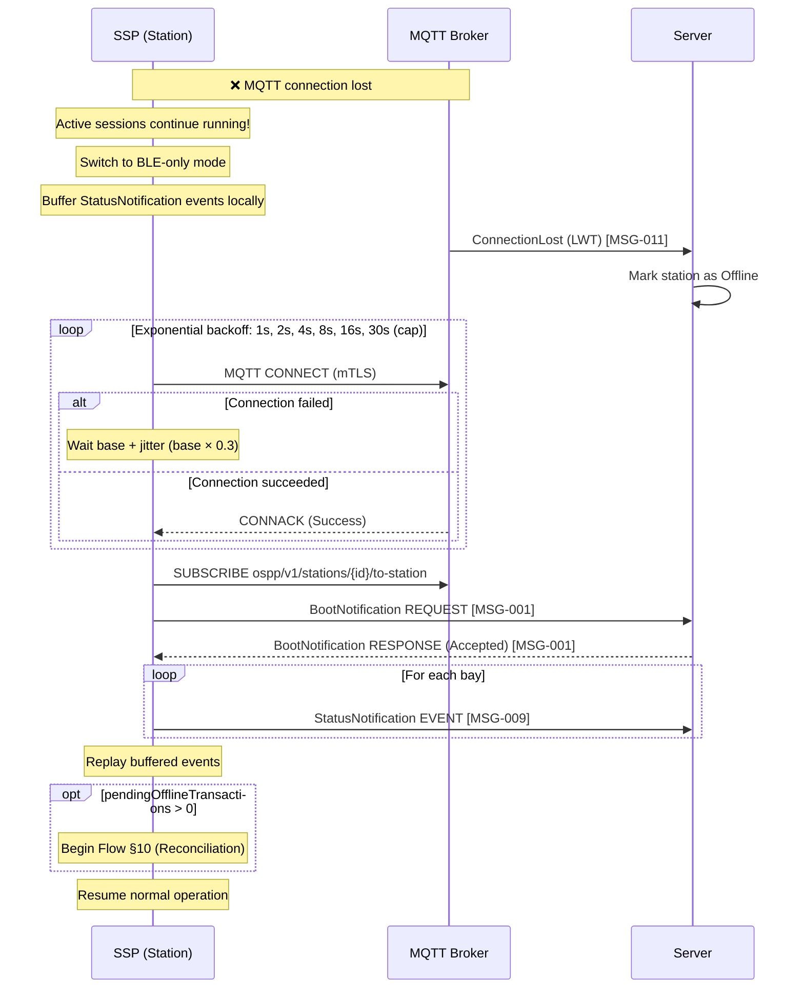
```mermaid
sequenceDiagram
    participant SSP as SSP (Station)
    participant Broker as MQTT Broker
    participant Server

    Note over SSP,Broker: ❌ MQTT connection lost

    Note over SSP: Active sessions continue running!
    Note over SSP: Switch to BLE-only mode
    Note over SSP: Buffer StatusNotification events locally

    Broker->>Server: ConnectionLost (LWT) [MSG-011]
    Server->>Server: Mark station as Offline

    loop Exponential backoff: 1s, 2s, 4s, 8s, 16s, 30s (cap)
        SSP->>Broker: MQTT CONNECT (mTLS)
        alt Connection failed
            Note over SSP: Wait base + jitter (base × 0.3)
        else Connection succeeded
            Broker-->>SSP: CONNACK (Success)
        end
    end

    SSP->>Broker: SUBSCRIBE ospp/v1/stations/{id}/to-station
    SSP->>Server: BootNotification REQUEST [MSG-001]
    Server-->>SSP: BootNotification RESPONSE (Accepted) [MSG-001]

    loop For each bay
        SSP->>Server: StatusNotification EVENT [MSG-009]
    end

    Note over SSP: Replay buffered events

    opt pendingOfflineTransactions > 0
        Note over SSP: Begin Flow §10 (Reconciliation)
    end

    Note over SSP: Resume normal operation
```

### Happy Path

1. MQTT connection drops (TCP reset, broker crash, network outage)
2. **SSP** immediately takes these actions:
   - **Active sessions continue running** — the station MUST NOT stop a service due to connectivity loss
   - Switch to BLE-only mode for new sessions (if BLE is enabled)
   - Buffer all StatusNotification and MeterValues events locally
3. **Broker** publishes the pre-configured **ConnectionLost** [MSG-011] LWT to the station's `to-server` topic
4. **Server** receives the LWT and marks the station as `Offline`
5. **SSP** begins reconnection with exponential backoff:
   - Delays: 1s, 2s, 4s, 8s, 16s, 30s (cap)
   - Jitter: `actual_delay = base + random(0, base × 0.3)`
   - Each attempt: full MQTT CONNECT with mTLS
6. On successful CONNACK, SSP subscribes to its `to-station` topic
7. **SSP** sends **BootNotification REQUEST** [MSG-001] (same as fresh boot)
8. **Server** accepts the boot, marks station as `Online`, returns session key
9. **SSP** sends **StatusNotification** [MSG-009] for each bay (current status, which may include sessions that completed during offline)
10. **SSP** replays any buffered events
11. If `pendingOfflineTransactions > 0`, SSP begins [Offline → Online Reconciliation (Flow §10)](#10-offline--online-reconciliation)
12. Resume normal operation (heartbeat, command processing)

### Error Paths

| Condition | Action |
|-----------|--------|
| All backoff attempts fail (30s cap reached) | Continue retrying every 30s + jitter indefinitely |
| TLS certificate expired during outage | SSP cannot reconnect — await manual certificate update |
| Broker permanently unavailable | SSP operates in BLE-only mode indefinitely |
| BootNotification `Rejected` after reconnect | SSP may have been decommissioned — await intervention |
| Session completed during offline | SSP reports final status via StatusNotification post-boot |

### Postconditions

| Component | State |
|-----------|-------|
| SSP | Reconnected, boot accepted, normal operation |
| Server | Station marked online, bay statuses updated, buffered events processed |
| Sessions (if any were active during outage) | Statuses reconciled via StatusNotification |

---

## 10. Offline → Online Reconciliation

**Description:** When a station that served offline transactions regains MQTT connectivity, it sends each offline transaction to the server for reconciliation, credit deduction, and fraud scoring.

### Preconditions

- Station has reconnected to MQTT (BootNotification `Accepted`)
- Station has `pendingOfflineTransactions > 0`
- Post-boot StatusNotification per bay has been sent

### Sequence Diagram

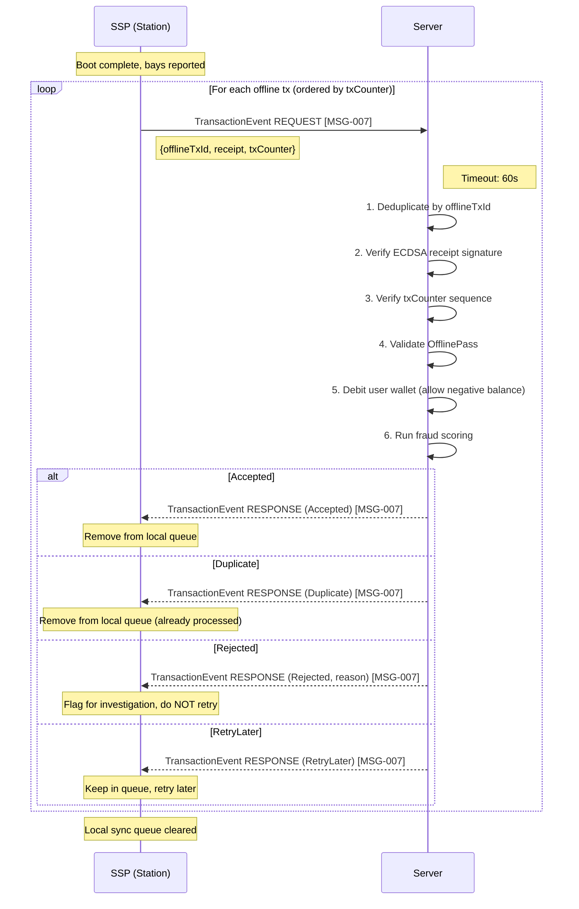
```mermaid
sequenceDiagram
    participant SSP as SSP (Station)
    participant Server

    Note over SSP: Boot complete, bays reported

    loop For each offline tx (ordered by txCounter)
        SSP->>Server: TransactionEvent REQUEST [MSG-007]
        Note right of SSP: {offlineTxId, receipt, txCounter}
        Note right of Server: Timeout: 60s

        Server->>Server: 1. Deduplicate by offlineTxId
        Server->>Server: 2. Verify ECDSA receipt signature
        Server->>Server: 3. Verify txCounter sequence
        Server->>Server: 4. Validate OfflinePass
        Server->>Server: 5. Debit user wallet (allow negative balance)
        Server->>Server: 6. Run fraud scoring

        alt Accepted
            Server-->>SSP: TransactionEvent RESPONSE (Accepted) [MSG-007]
            Note over SSP: Remove from local queue
        else Duplicate
            Server-->>SSP: TransactionEvent RESPONSE (Duplicate) [MSG-007]
            Note over SSP: Remove from local queue (already processed)
        else Rejected
            Server-->>SSP: TransactionEvent RESPONSE (Rejected, reason) [MSG-007]
            Note over SSP: Flag for investigation, do NOT retry
        else RetryLater
            Server-->>SSP: TransactionEvent RESPONSE (RetryLater) [MSG-007]
            Note over SSP: Keep in queue, retry later
        end
    end

    Note over SSP: Local sync queue cleared
```

### Happy Path

1. SSP boot is complete; all bays have been reported via StatusNotification [MSG-009]
2. SSP begins sending offline transactions **in order of `txCounter`** (ascending)
3. For each transaction, SSP sends **TransactionEvent REQUEST** [MSG-007] containing the full transaction data, signed receipt, `txCounter`, and meter values
4. SSP waits for the RESPONSE before sending the next transaction (sequential processing preserves `txCounter` order)
5. **Server** processes each transaction:
   - **Step 1:** Deduplicate by `offlineTxId` (if already seen → `Duplicate`)
   - **Step 2:** Verify ECDSA P-256 receipt signature — CRITICAL alert if invalid
   - **Step 3:** Verify `txCounter` sequence (monotonically increasing, no gaps) — WARNING if gap detected, process anyway
   - **Step 4:** Validate that the OfflinePass was valid at transaction time (check epoch, expiry, limits)
   - **Step 5:** Debit user wallet (allow negative balance for offline transactions)
   - **Step 6:** Run fraud scoring (see below)
   - **Step 7:** Create session record
6. Server responds `Accepted`
7. SSP removes the transaction from its local queue
8. Repeat for all pending transactions
9. When all transactions are processed, SSP clears its local sync queue

### Fraud Scoring

Server computes a fraud score (0.00 -- 1.00) for each offline transaction:

| Factor | Score |
|--------|------:|
| Counter gap detected | +0.30 |
| Invalid timestamps (out of order, future) | +0.50 |
| Duration exceeds offline allowance | +0.20 |
| High offline frequency (> 10 tx / 24h) | +0.20 |
| Exceeds per-transaction credit limit | +0.15 |
| Station not in user's allowlist | +0.10 |
| Pass was revoked at transaction time | +0.30 |
| User has negative wallet balance | +0.10 |

**Thresholds:**

| Score Range | Action |
|-------------|--------|
| 0.00 -- 0.29 | Normal — accept silently |
| 0.30 -- 0.59 | Review — flag for manual review |
| 0.60 -- 0.79 | Alert — disable offline mode for user, notify admin |
| 0.80 -- 1.00 | Block — revoke OfflinePass, block user, notify security |

### App-Side Reconciliation (Backup)

When the mobile app regains connectivity, it SHOULD also sync its offline transaction log:

1. App calls `POST /me/offline-txs` with its locally stored receipts
2. Server deduplicates against transactions already received from the station
3. This serves as a **backup reconciliation path** in case the station's sync fails

### Postconditions

| Component | State |
|-----------|-------|
| SSP Offline Queue | Empty (all transactions synced) |
| Server | Session records created, user wallets debited |
| User Wallets | Debited (may be negative for high-fraud-score transactions) |
| Fraud Alerts | Generated for scores >= 0.30 |

---

## 11. Firmware Update

**Description:** The server pushes a firmware update to the station via MQTT. The station downloads the binary, installs it on the inactive A/B partition, and reboots. On failure, automatic rollback occurs.

### Preconditions

- Station is online (MQTT connected, boot accepted)
- No other long-running operation in progress (firmware update, diagnostics upload)
- Firmware binary is available at the specified HTTPS URL

### Sequence Diagram

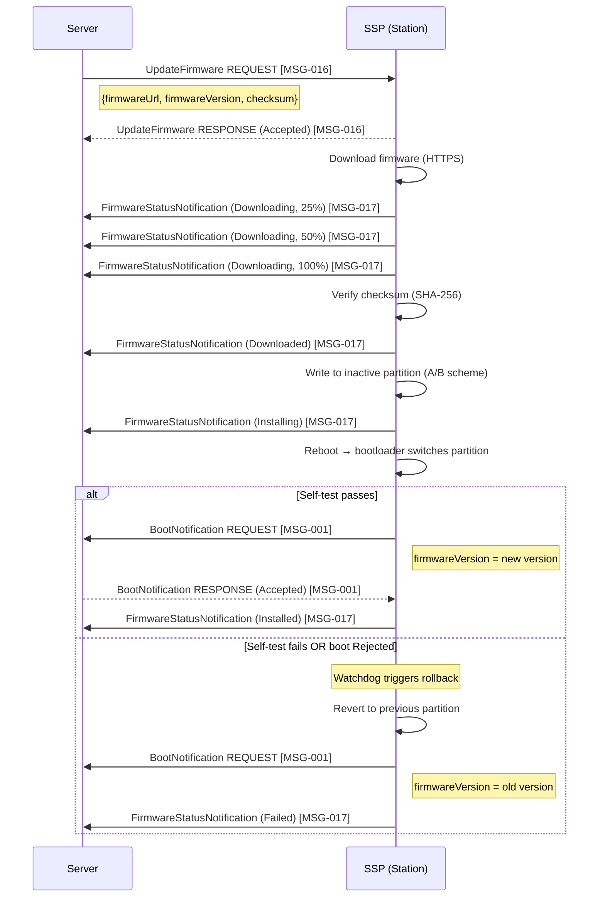
```mermaid
sequenceDiagram
    participant Server
    participant SSP as SSP (Station)

    Server->>SSP: UpdateFirmware REQUEST [MSG-016]
    Note right of Server: {firmwareUrl, firmwareVersion, checksum}
    SSP-->>Server: UpdateFirmware RESPONSE (Accepted) [MSG-016]

    SSP->>SSP: Download firmware (HTTPS)
    SSP->>Server: FirmwareStatusNotification (Downloading, 25%) [MSG-017]
    SSP->>Server: FirmwareStatusNotification (Downloading, 50%) [MSG-017]
    SSP->>Server: FirmwareStatusNotification (Downloading, 100%) [MSG-017]

    SSP->>SSP: Verify checksum (SHA-256)
    SSP->>Server: FirmwareStatusNotification (Downloaded) [MSG-017]

    SSP->>SSP: Write to inactive partition (A/B scheme)
    SSP->>Server: FirmwareStatusNotification (Installing) [MSG-017]

    SSP->>SSP: Reboot → bootloader switches partition

    alt Self-test passes
        SSP->>Server: BootNotification REQUEST [MSG-001]
        Note right of SSP: firmwareVersion = new version
        Server-->>SSP: BootNotification RESPONSE (Accepted) [MSG-001]
        SSP->>Server: FirmwareStatusNotification (Installed) [MSG-017]
    else Self-test fails OR boot Rejected
        Note over SSP: Watchdog triggers rollback
        SSP->>SSP: Revert to previous partition
        SSP->>Server: BootNotification REQUEST [MSG-001]
        Note right of SSP: firmwareVersion = old version
        SSP->>Server: FirmwareStatusNotification (Failed) [MSG-017]
    end
```

### Happy Path

1. **Server** sends **UpdateFirmware REQUEST** [MSG-016] with `firmwareUrl`, `firmwareVersion`, and `checksum` (SHA-256)
2. **SSP** validates the request (no other operation in progress, sufficient storage), responds `Accepted`
3. **SSP** downloads the firmware binary via HTTPS
4. **SSP** sends periodic **FirmwareStatusNotification** [MSG-017] `Downloading` with progress %
5. **SSP** verifies the SHA-256 checksum — sends `Downloaded` status
6. **SSP** writes firmware to the inactive A/B partition — sends `Installing` status
7. **SSP** reboots; bootloader switches to the new partition
8. New firmware runs self-test
9. **SSP** sends **BootNotification** [MSG-001] with the new `firmwareVersion`
10. **Server** accepts the boot — firmware update is confirmed
11. **SSP** sends **FirmwareStatusNotification** [MSG-017] `Installed`

### Error Paths

| Step | Error | Action |
|:----:|-------|--------|
| 2 | `5107 OPERATION_IN_PROGRESS` | SSP rejects — retry later |
| 2 | `5103 STORAGE_ERROR` | SSP rejects — insufficient space |
| 3 | Download fails / `1011 URL_UNREACHABLE` | SSP sends `Failed`, no partition change |
| 5 | Checksum mismatch | SSP sends `Failed`, discards download |
| 8 | Self-test fails | Watchdog triggers → rollback to previous partition → boot with old version |
| 9 | BootNotification `Rejected` (new version) | Rollback to previous partition |

### Postconditions (Success)

| Component | State |
|-----------|-------|
| SSP | Running new firmware, boot accepted |
| SSP Inactive Partition | Contains previous firmware (rollback target) |
| Server | Station firmware version updated in records |

### Postconditions (Failure / Rollback)

| Component | State |
|-----------|-------|
| SSP | Running previous firmware (rollback successful) |
| Server | Firmware update flagged as failed, alert generated |

---

## 12. Configuration Change & Maintenance

**Description:** Administrative operations for remotely configuring the station, enabling maintenance mode, and retrieving diagnostics.

### 12.1 Configuration Change

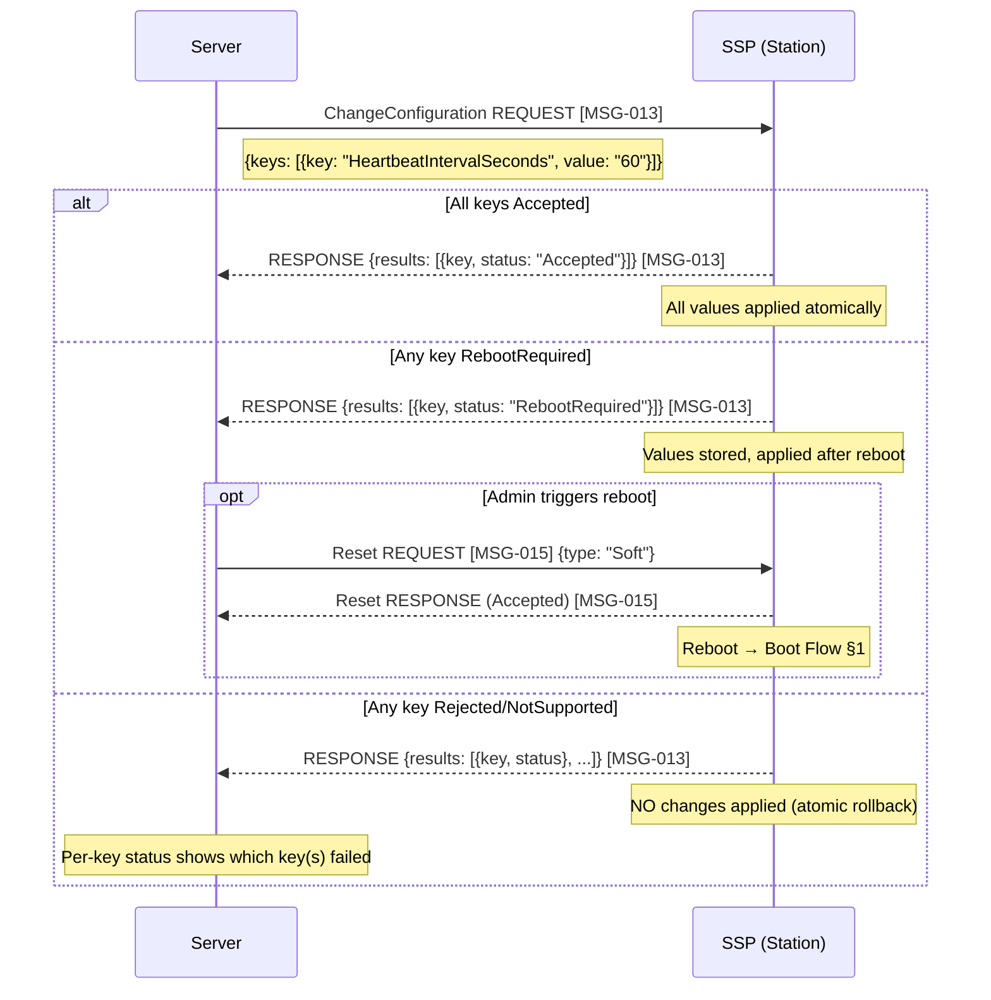
```mermaid
sequenceDiagram
    participant Server
    participant SSP as SSP (Station)

    Server->>SSP: ChangeConfiguration REQUEST [MSG-013]
    Note right of Server: {keys: [{key: "HeartbeatIntervalSeconds", value: "60"}]}

    alt All keys Accepted
        SSP-->>Server: RESPONSE {results: [{key, status: "Accepted"}]} [MSG-013]
        Note over SSP: All values applied atomically
    else Any key RebootRequired
        SSP-->>Server: RESPONSE {results: [{key, status: "RebootRequired"}]} [MSG-013]
        Note over SSP: Values stored, applied after reboot
        opt Admin triggers reboot
            Server->>SSP: Reset REQUEST [MSG-015] {type: "Soft"}
            SSP-->>Server: Reset RESPONSE (Accepted) [MSG-015]
            Note over SSP: Reboot → Boot Flow §1
        end
    else Any key Rejected/NotSupported
        SSP-->>Server: RESPONSE {results: [{key, status}, ...]} [MSG-013]
        Note over SSP: NO changes applied (atomic rollback)
        Note over Server: Per-key status shows which key(s) failed
    end
```

#### Steps

1. **Server** sends **ChangeConfiguration REQUEST** [MSG-013] with `keys` array (1–20 key-value pairs)
2. **SSP** validates ALL key names, parses values, checks constraints for the entire batch
3. If ANY key would be `Rejected` or `NotSupported`, the station applies NONE (atomic all-or-nothing)
4. **SSP** responds with `results` array containing per-key status in the same order as the request
5. If any key returns `RebootRequired`, the admin MAY follow up with a **Reset** [MSG-015] to apply the change

### 12.2 Maintenance Mode

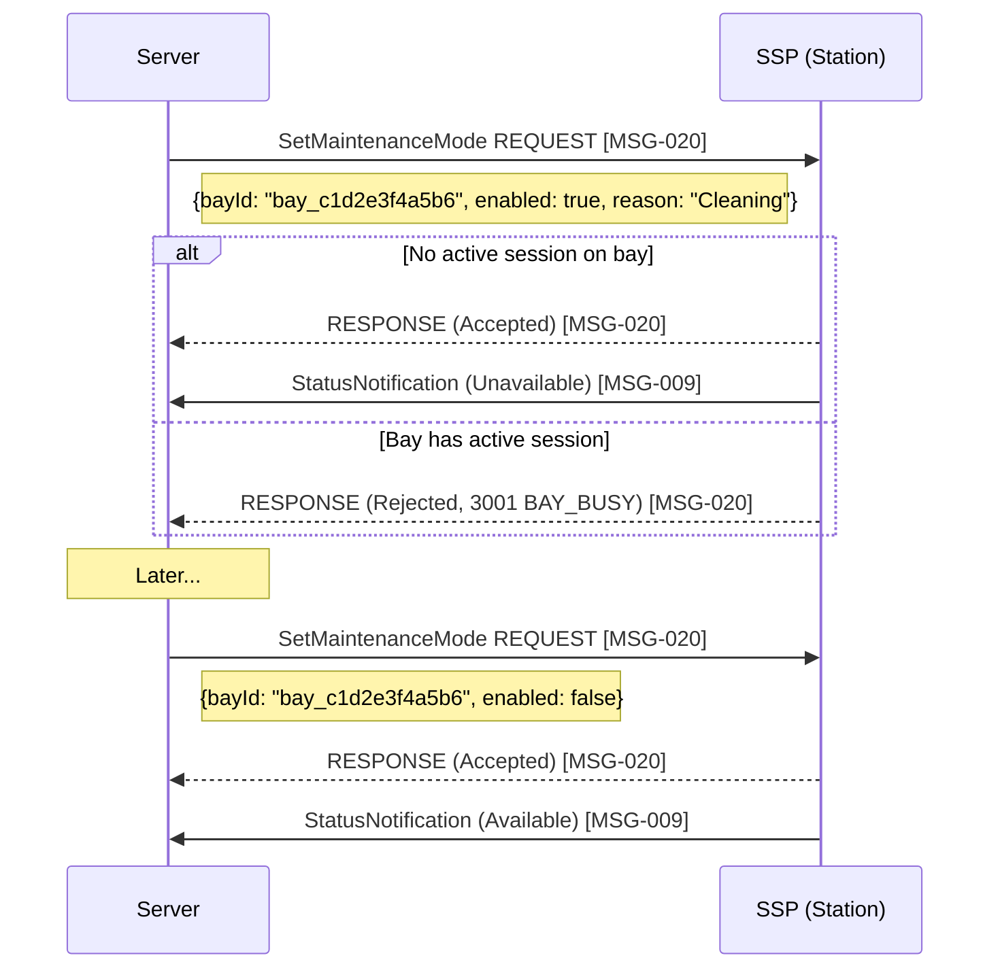
```mermaid
sequenceDiagram
    participant Server
    participant SSP as SSP (Station)

    Server->>SSP: SetMaintenanceMode REQUEST [MSG-020]
    Note right of Server: {bayId: "bay_c1d2e3f4a5b6", enabled: true, reason: "Cleaning"}

    alt No active session on bay
        SSP-->>Server: RESPONSE (Accepted) [MSG-020]
        SSP->>Server: StatusNotification (Unavailable) [MSG-009]
    else Bay has active session
        SSP-->>Server: RESPONSE (Rejected, 3001 BAY_BUSY) [MSG-020]
    end

    Note over Server: Later...

    Server->>SSP: SetMaintenanceMode REQUEST [MSG-020]
    Note right of Server: {bayId: "bay_c1d2e3f4a5b6", enabled: false}
    SSP-->>Server: RESPONSE (Accepted) [MSG-020]
    SSP->>Server: StatusNotification (Available) [MSG-009]
```

#### Steps

1. **Server** sends **SetMaintenanceMode REQUEST** [MSG-020] with `bayId` (or all bays if absent), `enabled: true`, and optional `reason`
2. **SSP** checks if the bay has an active session — if yes, rejects with `3001 BAY_BUSY`
3. **SSP** transitions bay to `Unavailable`, sends **StatusNotification** [MSG-009]
4. To exit maintenance: Server sends the same message with `enabled: false`
5. **SSP** transitions bay to `Available`, sends **StatusNotification** [MSG-009]

### 12.3 Diagnostics Retrieval

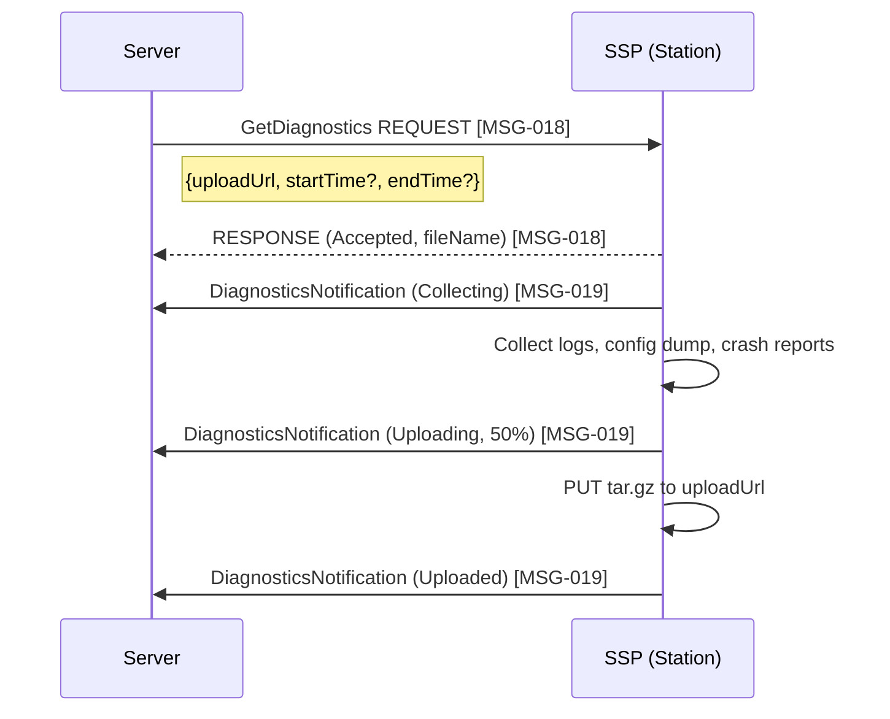
```mermaid
sequenceDiagram
    participant Server
    participant SSP as SSP (Station)

    Server->>SSP: GetDiagnostics REQUEST [MSG-018]
    Note right of Server: {uploadUrl, startTime?, endTime?}
    SSP-->>Server: RESPONSE (Accepted, fileName) [MSG-018]

    SSP->>Server: DiagnosticsNotification (Collecting) [MSG-019]
    SSP->>SSP: Collect logs, config dump, crash reports
    SSP->>Server: DiagnosticsNotification (Uploading, 50%) [MSG-019]
    SSP->>SSP: PUT tar.gz to uploadUrl
    SSP->>Server: DiagnosticsNotification (Uploaded) [MSG-019]
```

#### Steps

1. **Server** sends **GetDiagnostics REQUEST** [MSG-018] with `uploadUrl` and optional time range
2. **SSP** accepts, returns the diagnostic archive file name
3. **SSP** collects logs, configuration dump, and crash reports into a `tar.gz` archive
4. **SSP** sends **DiagnosticsNotification** [MSG-019] progress events (`Collecting` → `Uploading` → `Uploaded`)
5. **SSP** uploads the archive via HTTPS PUT to the `uploadUrl`
6. On failure, SSP sends `Failed` status with error description

### 12.4 Service Catalog Update

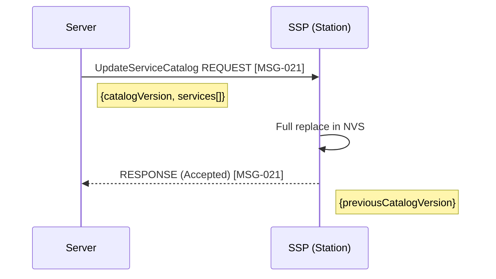
```mermaid
sequenceDiagram
    participant Server
    participant SSP as SSP (Station)

    Server->>SSP: UpdateServiceCatalog REQUEST [MSG-021]
    Note right of Server: {catalogVersion, services[]}
    SSP->>SSP: Full replace in NVS
    SSP-->>Server: RESPONSE (Accepted) [MSG-021]
    Note right of SSP: {previousCatalogVersion}
```

#### Steps

1. **Server** sends **UpdateServiceCatalog REQUEST** [MSG-021] with `catalogVersion` and complete `services[]` array
2. **SSP** performs a **full replacement** of the service catalog in NVS (not a merge)
3. **SSP** responds `Accepted` with the `previousCatalogVersion`
4. New prices and service availability take effect immediately for BLE (FFF2 updated) and future sessions

---

## 13. Certificate Renewal

### 13.1 Automatic Renewal (Station-Initiated)

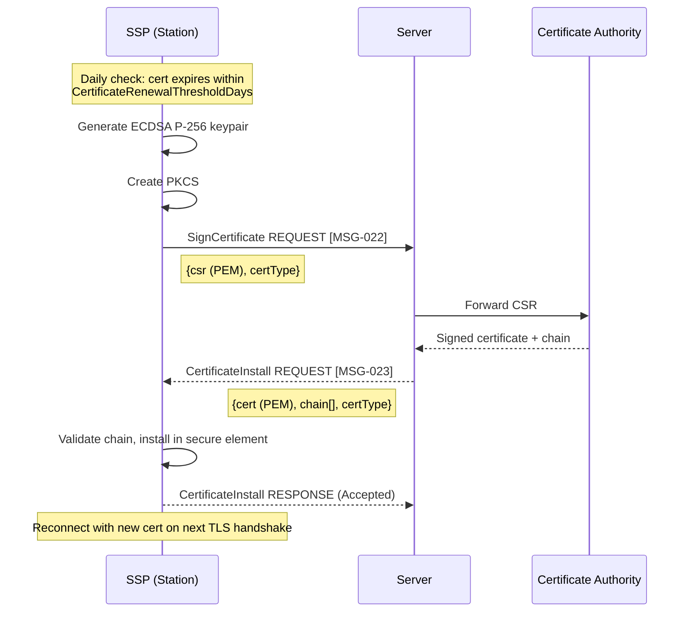
```mermaid
sequenceDiagram
    participant SSP as SSP (Station)
    participant Server
    participant CA as Certificate Authority

    Note over SSP: Daily check: cert expires within<br/>CertificateRenewalThresholdDays

    SSP->>SSP: Generate ECDSA P-256 keypair
    SSP->>SSP: Create PKCS#10 CSR (CN=stn_{id})
    SSP->>Server: SignCertificate REQUEST [MSG-022]
    Note right of SSP: {csr (PEM), certType}
    Server->>CA: Forward CSR
    CA-->>Server: Signed certificate + chain
    Server-->>SSP: CertificateInstall REQUEST [MSG-023]
    Note left of Server: {cert (PEM), chain[], certType}
    SSP->>SSP: Validate chain, install in secure element
    SSP-->>Server: CertificateInstall RESPONSE (Accepted)
    Note over SSP: Reconnect with new cert on next TLS handshake
```

#### Steps

1. **Station** detects its certificate is within `CertificateRenewalThresholdDays` of expiry (daily check)
2. **Station** generates a new ECDSA P-256 keypair on-device (private key never leaves the station)
3. **Station** creates a PKCS#10 CSR with `CN=stn_{stationId}` and sends **SignCertificate REQUEST** [MSG-022]
4. **Server** validates the CSR and forwards it to the Certificate Authority
5. **CA** signs the certificate and returns it with the chain
6. **Server** sends **CertificateInstall REQUEST** [MSG-023] with the signed certificate and chain
7. **Station** validates the certificate chain against its trust store, installs the certificate in the secure element
8. **Station** responds `Accepted` and uses the new certificate on the next TLS reconnection

### 13.2 Server-Triggered Renewal

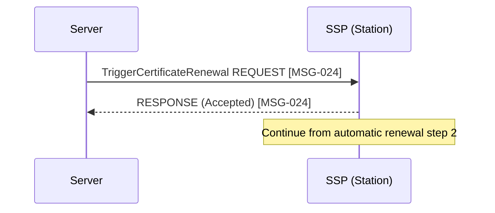
```mermaid
sequenceDiagram
    participant Server
    participant SSP as SSP (Station)

    Server->>SSP: TriggerCertificateRenewal REQUEST [MSG-024]
    SSP-->>Server: RESPONSE (Accepted) [MSG-024]
    Note over SSP: Continue from automatic renewal step 2
```

1. **Server** sends **TriggerCertificateRenewal REQUEST** [MSG-024] (e.g., proactive rotation, CA policy change)
2. **Station** responds `Accepted`
3. Flow continues from step 2 of §13.1 (generate keypair → CSR → install)

For detailed lifecycle phases, emergency thresholds, error handling, and retry logic, see [Chapter 06 — Security](06-security.md), §4.7 Certificate Lifecycle Management.

---

## Appendix A — Timeout Reference

Consolidated timeout values across all flows:

| Phase / Operation | Timeout | On Timeout |
|-------------------|--------:|------------|
| MQTT CONNECT | 10s | Reconnect with backoff |
| BootNotification | 30s | Wait 60s, retry |
| Heartbeat | 30s | Log, continue |
| Offline detection | 3.5 × heartbeatIntervalSec | Mark station offline |
| ReserveBay | 5s | Session → failed |
| Reserved → 3DS (web) | 3 min | CancelReservation |
| Reserved → start (mobile) | 30s | CancelReservation |
| StartService (pending_ack) | 10s | Refund, session → failed |
| StopService (stopping) | 10s | Session → failed |
| Active session (max) | durationSeconds | Station auto-stops |
| Session token (web) | 10 min | Session expired |
| BayLock fallback | 3 min | Auto-released |
| PaymentIntent pending | 5 min | Marked expired |
| BLE scan | 10-30s | Return to IDLE |
| BLE handshake step | 10s | ERROR state |
| AuthorizeOfflinePass | 15s | Fallback to local validation |
| TransactionEvent | 60s | Retry later |
| ChangeConfiguration | 60s | Log failure |
| GetConfiguration | 30s | Log failure |
| Reset | 30s | Log failure |
| UpdateFirmware | 300s | Log failure |
| GetDiagnostics | 300s | Log failure |
| SetMaintenanceMode | 30s | Log failure |
| UpdateServiceCatalog | 30s | Retry once after 10s (boot only) |
| DataTransfer | 30s | Log warning, MAY retry |
| TriggerMessage | 10s | Log warning |
| SignCertificate | 30s | Retry per §4.7 |
| CertificateInstall | 30s | Log failure |
| TriggerCertificateRenewal | 10s | Log failure |

---

## Appendix B — Retry Policy Reference

| Operation | Strategy | Max Attempts | Delays |
|-----------|----------|:------------:|--------|
| MQTT reconnect | Exponential backoff + jitter | Infinite | 1s, 2s, 4s, 8s, 16s, 30s cap |
| BootNotification (rejected) | Fixed interval | Infinite | `retryInterval` from response |
| BootNotification (timeout) | Fixed interval | Infinite | 60s |
| StartService (web payment) | Fixed delays | 4 | 0s, +5s, +10s, +15s |
| StartService (mobile app) | Single attempt | 1 | — |
| UpdateServiceCatalog (boot) | Single retry | 2 | 10s |
| Payment processor API | Exponential backoff | 3 | 1s, 2s, 4s |
| BLE connect | Exponential backoff | 3 | 1s, 2s, 4s |
| TransactionEvent (RetryLater) | Server-directed | Varies | Wait `retryInterval` |

---

## Appendix C — State Transitions per Flow

Summary of state machine transitions triggered by each flow (see [Chapter 05 — State Machines](05-state-machines.md) for full state machine definitions):

### Bay State Transitions

| Flow | Transition |
|------|------------|
| Boot (§1) | → reported state (Available, Faulted, Unavailable) |
| Online Session (§3) | Available → Reserved* → Occupied → Finishing → Available |
| Web Payment (§4) | Available → Reserved → Occupied → Finishing → Available |
| BLE Session (§5a/b/c) | Available → Occupied → Finishing → Available |
| Session Stop (§6) | Occupied → Finishing → Available |
| Error during session | Occupied → Faulted |
| Maintenance (§12.2) | Available ↔ Unavailable |
| Error resolved | Faulted → Available |

*Reserved step is optional for mobile app sessions.

### Session State Transitions

| Flow | Transition |
|------|------------|
| Online Session (§3) | idle → pending_ack → active → stopping → completed |
| Web Payment (§4) | idle → reserving → reserved → pending_ack → active → completed |
| Timeout/failure | Any pending state → failed |

### PaymentIntent State Transitions (Web Payment)

| Flow | Transition |
|------|------------|
| Web Payment (§4) | created → pending → processing → authorized → captured → settled |
| Payment cancelled | pending → cancelled |
| Payment expired | pending → expired |
| Refund | captured/settled → refunded |
