# Chapter 04 — Protocol Flows

> **Status:** Draft | **OSPP Version:** 0.8.0

This chapter documents every end-to-end protocol flow as a sequence of messages defined in [Chapter 03 — Message Catalog](03-messages.md). Each flow includes preconditions, a Mermaid sequence diagram, numbered happy-path steps, alternative paths, error paths, and postconditions.

The keywords **MUST**, **MUST NOT**, **REQUIRED**, **SHALL**, **SHALL NOT**, **SHOULD**, **SHOULD NOT**, **RECOMMENDED**, **MAY**, and **OPTIONAL** in this document are to be interpreted as described in [RFC 2119](https://www.rfc-editor.org/rfc/rfc2119) and [RFC 8174](https://www.rfc-editor.org/rfc/rfc8174).

---

## Conventions

### Participants

| Abbreviation | Full Name | Description |
|:------------:|-----------|-------------|
| **SSP** | Self-Service Point | The station (embedded device) |
| **Server** | Central Self-service Management System (Server) | The backend server |
| **App** | Mobile Application | User's mobile app (iOS/Android) |
| **Browser** | Web Browser | Anonymous web payment client |
| **Broker** | MQTT Broker | MQTT 5.0 compliant message broker cluster |
| **PG** | Payment Gateway | External payment processor |

### Message References

Messages are referenced as **[MSG-XXX]** corresponding to the numbering in [Chapter 03](03-messages.md):

| Ref | Message | Ref | Message |
|-----|---------|-----|---------|
| MSG-001 | BootNotification | MSG-021 | UpdateServiceCatalog |
| MSG-002 | AuthorizeOfflinePass | MSG-022 | SignCertificate |
| MSG-003 | ReserveBay | MSG-023 | CertificateInstall |
| MSG-004 | CancelReservation | MSG-024 | TriggerCertificateRenewal |
| MSG-005 | StartService | MSG-025 | DataTransfer |
| MSG-006 | StopService | MSG-026 | TriggerMessage |
| MSG-007 | TransactionEvent | MSG-027 | StationInfo (FFF1) |
| MSG-008 | Heartbeat | MSG-028 | AvailableServices (FFF2) |
| MSG-009 | StatusNotification | MSG-029 | Hello |
| MSG-010 | MeterValues | MSG-030 | Challenge |
| MSG-011 | ConnectionLost | MSG-031 | OfflineAuthRequest |
| MSG-012 | SecurityEvent | MSG-032 | ServerSignedAuth |
| MSG-013 | ChangeConfiguration | MSG-033 | AuthResponse |
| MSG-014 | GetConfiguration | MSG-034 | StartServiceRequest |
| MSG-015 | Reset | MSG-035 | StartServiceResponse |
| MSG-016 | UpdateFirmware | MSG-036 | StopServiceRequest |
| MSG-017 | FirmwareStatusNotification | MSG-037 | StopServiceResponse |
| MSG-018 | GetDiagnostics | MSG-038 | ServiceStatus (FFF5) |
| MSG-019 | DiagnosticsNotification | MSG-039 | Receipt (FFF6) |
| MSG-020 | SetMaintenanceMode | MSG-040 | SessionEnded |

### Diagram Notation

- **Solid arrows** (`->>`) — requests and commands
- **Dashed arrows** (`-->>`) — responses
- **`alt`/`else`** — decision branches
- **`loop`** — repeated operations
- **`opt`** — optional steps
- **`Note`** — timeouts, side effects, or annotations

---

## Flow Index

| # | Flow | Transport | Section |
|--:|------|-----------|---------|
| 1 | [Station Boot & Registration](#1-station-boot--registration) | MQTT | [§1](#1-station-boot--registration) |
| 2 | [Station Provisioning](#2-station-provisioning) | HTTPS | [§2](#2-station-provisioning) |
| 3 | [Online Session — Mobile App](#3-online-session--mobile-app) | HTTPS + MQTT | [§3](#3-online-session--mobile-app) |
| 4 | [Web Payment Session — Anonymous](#4-web-payment-session--anonymous) | HTTPS + MQTT | [§4](#4-web-payment-session--anonymous) |
| 5a | [Full Offline Session — BLE](#5a-full-offline-session--ble) | BLE | [§5a](#5a-full-offline-session--ble) |
| 5b | [Partial A — Phone Online, Station Offline](#5b-partial-a--phone-online-station-offline) | HTTPS + BLE | [§5b](#5b-partial-a--phone-online-station-offline) |
| 5c | [Partial B — Phone Offline, Station Online](#5c-partial-b--phone-offline-station-online) | BLE + MQTT | [§5c](#5c-partial-b--phone-offline-station-online) |
| 6 | [Session Stop & Completion](#6-session-stop--completion) | MQTT / BLE | [§6](#6-session-stop--completion) |
| 7 | [Credit Purchase / Top-up](#7-credit-purchase--top-up) | HTTPS | [§7](#7-credit-purchase--top-up) |
| 8 | [Heartbeat & Status Monitoring](#8-heartbeat--status-monitoring) | MQTT | [§8](#8-heartbeat--status-monitoring) |
| 9 | [Error Recovery & Reconnection](#9-error-recovery--reconnection) | MQTT | [§9](#9-error-recovery--reconnection) |
| 10 | [Offline → Online Reconciliation](#10-offline--online-reconciliation) | MQTT | [§10](#10-offline--online-reconciliation) |
| 11 | [Firmware Update](#11-firmware-update) | MQTT + HTTPS | [§11](#11-firmware-update) |
| 12 | [Configuration Change & Maintenance](#12-configuration-change--maintenance) | MQTT | [§12](#12-configuration-change--maintenance) |

---

## 1. Station Boot & Registration

**Description:** The station powers on, initializes hardware and BLE, connects to the MQTT broker, registers with the server, reports its bay layout, and enters normal operation.

### Preconditions

- Station has valid TLS client certificate and private key in NVS
- Station has been provisioned (see [Flow §2](#2-station-provisioning))
- MQTT broker is reachable on port 8883
- BLE hardware is functional (if supported)

### Sequence Diagram

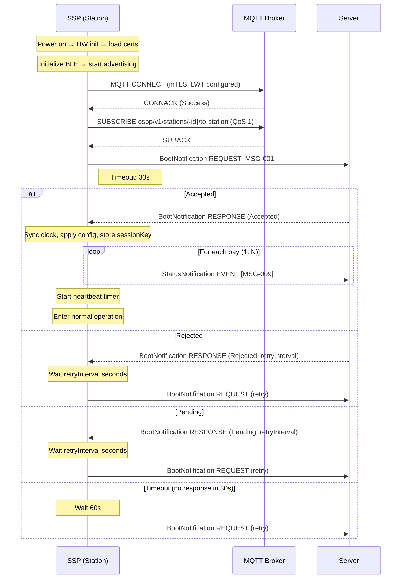
```mermaid
sequenceDiagram
    participant SSP as SSP (Station)
    participant Broker as MQTT Broker
    participant Server

    Note over SSP: Power on → HW init → load certs
    Note over SSP: Initialize BLE → start advertising

    SSP->>Broker: MQTT CONNECT (mTLS, LWT configured)
    Broker-->>SSP: CONNACK (Success)
    SSP->>Broker: SUBSCRIBE ospp/v1/stations/{id}/to-station (QoS 1)
    Broker-->>SSP: SUBACK

    SSP->>Server: BootNotification REQUEST [MSG-001]
    Note right of SSP: Timeout: 30s

    alt Accepted
        Server-->>SSP: BootNotification RESPONSE (Accepted)
        Note over SSP: Sync clock, apply config, store sessionKey

        loop For each bay (1..N)
            SSP->>Server: StatusNotification EVENT [MSG-009]
        end

        Note over SSP: Start heartbeat timer
        Note over SSP: Enter normal operation

    else Rejected
        Server-->>SSP: BootNotification RESPONSE (Rejected, retryInterval)
        Note over SSP: Wait retryInterval seconds
        SSP->>Server: BootNotification REQUEST (retry)

    else Pending
        Server-->>SSP: BootNotification RESPONSE (Pending, retryInterval)
        Note over SSP: Wait retryInterval seconds
        SSP->>Server: BootNotification REQUEST (retry)

    else Timeout (no response in 30s)
        Note over SSP: Wait 60s
        SSP->>Server: BootNotification REQUEST (retry)
    end
```

### Happy Path

1. SSP powers on, initializes hardware, loads certificates and configuration from NVS
2. SSP initializes BLE radio and starts advertising as `OSPP-{station_id_last6}` (BLE starts **before** MQTT)
3. SSP opens MQTT connection to broker (mTLS on port 8883, LWT pre-configured as ConnectionLost [MSG-011])
4. Broker authenticates the client certificate, returns CONNACK success
5. SSP subscribes to `ospp/v1/stations/{station_id}/to-station` with QoS 1
6. SSP sends **BootNotification REQUEST** [MSG-001] with station identity, firmware version, capabilities, and `pendingOfflineTransactions` count
7. Server validates the station, returns **BootNotification RESPONSE** [MSG-001] with `status: "Accepted"`, `serverTime`, `heartbeatIntervalSec`, optional `configuration` overrides, and `sessionKey` (if message signing is enabled)
8. SSP synchronizes its clock to `serverTime`, applies any configuration overrides, stores the HMAC session key
9. SSP sends one **StatusNotification EVENT** [MSG-009] per bay, reporting `bayNumber`, `status`, and available `services[]`
10. SSP starts the heartbeat timer at `heartbeatIntervalSec` seconds
11. SSP enters normal operation — ready to accept commands

### Alternative Paths

**A1 — Rejected:** Server returns `Rejected` with `retryInterval`. The SSP waits `retryInterval` seconds and retries from step 6. Common causes: station not registered, certificate revoked, station decommissioned.

**A2 — Pending:** Server returns `Pending` with `retryInterval`. The SSP waits and retries. This occurs when the server is starting up or performing maintenance.

**A3 — Timeout:** No response received within 30 seconds. The SSP waits 60 seconds and retries from step 6. The SSP MUST NOT send any other messages until BootNotification succeeds.

**A4 — Reconnect (not first boot):** If the SSP was previously connected and has `pendingOfflineTransactions > 0`, it proceeds through the normal boot sequence first, then begins [Offline → Online Reconciliation (Flow §10)](#10-offline--online-reconciliation) after step 11.

### Error Paths

| Error | Cause | SSP Action |
|-------|-------|------------|
| CONNACK refused | Invalid certificate, broker unreachable | Reconnect with exponential backoff (see [Flow §9](#9-error-recovery--reconnection)) |
| `1007 PROTOCOL_VERSION_MISMATCH` | Major version incompatible | Log error, record `supportedVersions`, and **keep retrying BootNotification** at `retryInterval` (default 30 s), per [Core profile CORE-011](profiles/core/README.md); stay in limited mode meanwhile. The mismatch is fixed by new station firmware **or** by the server regaining support for the station's MAJOR — the retry is what recovers the second case without a site visit, and a rejected station accepts no commands, so it cannot be handed firmware while stopped |
| `2001 STATION_NOT_REGISTERED` | Station unknown to server | Log error and **keep retrying BootNotification** at `retryInterval` (default 30 s), per [Core profile CORE-011](profiles/core/README.md). Do **not** enter provisioning mode and do **not** alter stored credentials: the station holds credentials the broker accepted, and [§2](#re-provisioning-an-already-provisioned-station) forbids re-provisioning autonomously while holding them. The cause is fixed operator-side, and the next retry then succeeds |
| TLS handshake failure | Certificate expired or revoked | Send SecurityEvent [MSG-012] (if possible), await manual intervention |

### Postconditions

| Component | State |
|-----------|-------|
| SSP | Normal operation, heartbeat timer running |
| SSP Bays | Reported to Server (Available, Faulted, Unavailable, etc.) |
| Server | Station marked online, last boot time recorded, bay status updated |
| BLE | Advertising active (independent of MQTT) |
| HMAC Session Key | Established (if signing enabled) |

---

## 2. Station Provisioning

**Description:** A new station is registered in the management portal, a provisioning token is generated, and the physical station is configured with certificates and identifiers via a one-time HTTPS call.

### Preconditions

- Administrator has created the station entry in the management portal
- A provisioning token has been generated (single-use, with a TTL fixed at issuance)
- The station has network connectivity (Ethernet, WiFi, or cellular)
- The station holds the out-of-band bootstrap inputs this call consumes — its `stationId`, the **absolute HTTPS origin** of the provisioning endpoint, the **HTTPS trust policy** that validates that server's certificate, and an **initial time source** able to evaluate a certificate validity period. These are the *Required configuration* of [Chapter 01 — Architecture §7.2](01-architecture.md#72-physical-configuration); none of them is carried by this flow, and none can be derived from the provisioning token, which is opaque and **MUST NOT** be parsed
- The station is in "not provisioned" state (no certificates in NVS) **or** is being deliberately re-provisioned (see [Re-provisioning an already provisioned station](#re-provisioning-an-already-provisioned-station))

### Sequence Diagram

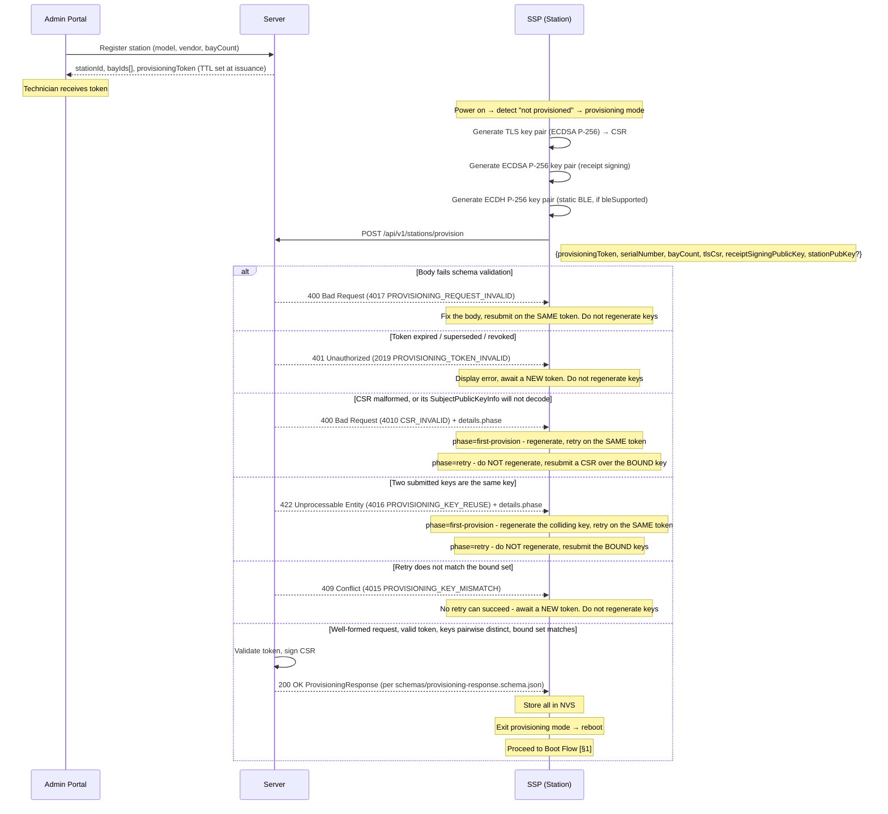
```mermaid
sequenceDiagram
    participant Admin as Admin Portal
    participant Server
    participant SSP as SSP (Station)

    Admin->>Server: Register station (model, vendor, bayCount)
    Server-->>Admin: stationId, bayIds[], provisioningToken (TTL set at issuance)
    Note over Admin: Technician receives token

    Note over SSP: Power on → detect "not provisioned" → provisioning mode

    SSP->>SSP: Generate TLS key pair (ECDSA P-256) → CSR
    SSP->>SSP: Generate ECDSA P-256 key pair (receipt signing)
    SSP->>SSP: Generate ECDH P-256 key pair (static BLE, if bleSupported)

    SSP->>Server: POST /api/v1/stations/provision
    Note right of SSP: {provisioningToken, serialNumber, bayCount, tlsCsr, receiptSigningPublicKey, stationPubKey?}

    alt Body fails schema validation
        Server-->>SSP: 400 Bad Request (4017 PROVISIONING_REQUEST_INVALID)
        Note over SSP: Fix the body, resubmit on the SAME token. Do not regenerate keys
    else Token expired / superseded / revoked
        Server-->>SSP: 401 Unauthorized (2019 PROVISIONING_TOKEN_INVALID)
        Note over SSP: Display error, await a NEW token. Do not regenerate keys
    else CSR malformed, or its SubjectPublicKeyInfo will not decode
        Server-->>SSP: 400 Bad Request (4010 CSR_INVALID) + details.phase
        Note over SSP: phase=first-provision - regenerate, retry on the SAME token
        Note over SSP: phase=retry - do NOT regenerate, resubmit a CSR over the BOUND key
    else Two submitted keys are the same key
        Server-->>SSP: 422 Unprocessable Entity (4016 PROVISIONING_KEY_REUSE) + details.phase
        Note over SSP: phase=first-provision - regenerate the colliding key, retry on the SAME token
        Note over SSP: phase=retry - do NOT regenerate, resubmit the BOUND keys
    else Retry does not match the bound set
        Server-->>SSP: 409 Conflict (4015 PROVISIONING_KEY_MISMATCH)
        Note over SSP: No retry can succeed - await a NEW token. Do not regenerate keys
    else Well-formed request, valid token, keys pairwise distinct, bound set matches
        Server->>Server: Validate token, sign CSR
        Server-->>SSP: 200 OK ProvisioningResponse (per schemas/provisioning-response.schema.json)
        Note over SSP: Store all in NVS
        Note over SSP: Exit provisioning mode → reboot
        Note over SSP: Proceed to Boot Flow [§1]
    end
```

### Happy Path

1. Administrator registers a new station in the management portal with model, vendor, serial number, and bay count
2. Server generates `stationId` (`stn_{uuid}`), `bayIds[]` (`bay_{uuid}` per bay), and a provisioning token (UUID, single-use, with a TTL fixed at issuance)
3. Technician installs the station and provides the provisioning token (via USB, local AP, or physical keypad)
4. SSP powers on, detects no certificates in NVS, enters provisioning mode
5. SSP generates a TLS key pair (ECDSA P-256) and produces a Certificate Signing Request (CSR) with CN = `stn_{station_id}`
6. SSP generates an ECDSA P-256 key pair for offline receipt signing (private key never leaves the device)
6a. A station that supports BLE generates a **dedicated static ECDH P-256** key pair for the BLE handshake — distinct from the keys above, per the key-separation rule in [Chapter 06 — Security §6.5.2](06-security.md) (private key never leaves the device)
6b. **Before** step 7 leaves the device, the SSP **MUST** commit every private key generated in steps 5–6a to non-volatile storage, durably — the write **MUST** be flushed, not merely buffered — and **MUST** retain them until the provision succeeds or reaches a terminal outcome. See *Persisting the key set* under this flow's *Postconditions*
7. SSP sends `POST /api/v1/stations/provision` with the provisioning token, serial number, bay count, TLS CSR, receipt-signing public key, and — when BLE is supported — the static BLE ECDH public key (`stationPubKey`), over which the server signs the StationIdentity certificate returned in the response — see [`provisioning-request.schema.json`](../schemas/provisioning-request.schema.json) for the canonical field set and constraints
8. Server validates the token (not expired, not used), signs the CSR with the Station CA, and returns the provisioning response per [`provisioning-response.schema.json`](../schemas/provisioning-response.schema.json) — see schema for the canonical field set and constraints (`stationId`, `bayIds[]`, `clientCert`, `stationCaChain`, `brokerRootCa` (optional, broker server-cert trust anchor), `rootCaThumbprint` (optional, SHA-256 Root CA thumbprint for local trust-anchor pinning), `serverVerifyKey`, and the `mqttConfig` block: broker host/port/URI, client-ID template, topic prefix, QoS level, keep-alive, clean-start, session-expiry, TLS version, MQTT version, optional LWT topic). Defaults align with the normative MQTT connection parameters in [Chapter 02 — Transport §1.2](02-transport.md#12-connection-parameters)
9. SSP stores the response — issued certificate, `stationCaChain`, `brokerRootCa`, `rootCaThumbprint`, `serverVerifyKey`, `mqttConfig`, `stationId`, `bayIds` — in NVS alongside the keys already committed at step 6b, and marks itself as provisioned
10. SSP exits provisioning mode and reboots
11. SSP proceeds to [Station Boot & Registration (Flow §1)](#1-station-boot--registration)

### Consumption Requirements

- The station MUST use `mqttConfig.brokerUri` from the provisioning response as the MQTT connection target on every connect attempt. If the field is absent, the station MAY use a pre-configured fallback URL.
- Other `mqttConfig` fields follow the same MUST/MAY pattern: when present in the provisioning response, the station MUST honor them (`brokerHost`, `brokerPort`, `tlsVersion`, `qosLevel`, `cleanStart`, `mqttVersion`, `clientIdTemplate`, `topicPrefix`, `keepAliveSeconds`); when absent, the station MAY use pre-configured defaults.
- Two of those fields were also fixed by [Chapter 02 — Transport §1.2](02-transport.md#12-connection-parameters), which left a station holding two MUSTs and no rule for choosing. Each now has **one** authority:
  - **`clientIdTemplate` — Transport governs.** The value is `{stationId}` and the schema pins it there. The Client ID is not a tunable: the broker enforces topic ACLs on the certificate CN ([Chapter 06 §3.3](06-security.md)), so a Client ID that is anything other than the `stationId` is a Client ID whose ACL does not match its own topics. A server **MUST NOT** advertise another value, and a station that receives one **MUST** use `{stationId}` regardless.
  - **`keepAliveSeconds` — the provisioning response governs.** Transport's `30` is the value to use **when the field is absent**, not a ceiling on what may be advertised. Keep Alive is a liveness parameter with no cryptographic binding, and deployments on constrained cellular links legitimately need a different one; the broker's 1.5× disconnect multiplier follows whatever value is in force.

### Error Paths

Rows are listed in the order the server evaluates them (see *Error precedence* below).

| Error | Cause | SSP Action |
|-------|-------|------------|
| 400 Bad Request (`4017 PROVISIONING_REQUEST_INVALID`) | The request body failed schema validation ([`provisioning-request.schema.json`](../schemas/provisioning-request.schema.json)) — a required property is absent, or a value violates its declared type, pattern, or bound | Fix the request body and resubmit **on the same token**. Do **not** regenerate keys: the keys are not what was rejected, and a fresh key would be answered `4015` |
| 401 Unauthorized (`2019 PROVISIONING_TOKEN_INVALID`) | The token did not authenticate: it does not resolve to a token bound to this station, or it is expired / beyond TTL, superseded, or revoked — carried in `details.reason` (`not_found`, `expired`, `superseded`, `revoked`) | Display error, await new provisioning token. Do **not** regenerate keys: the keys are not what was rejected |
| 409 Conflict (`4018 PROVISIONING_TOKEN_CONSUMED`) | The token authenticated but is already consumed and left **no certificate to replay** — carried in `details.reason`. A consumed token that did issue one is answered as a replay, or as `4015` if the keys drifted. `already_consumed`: a concurrent request won the race, and is **transient**. `consumed_without_certificate`: the consuming request failed before issuing, and is **terminal** | Depends on `details.reason`. `already_consumed` — retry unchanged after a short delay, bounded; it resolves to the issued certificate or to the terminal branch. `consumed_without_certificate` — request a **new** token. If `details.reason` is absent, assume `already_consumed`. **Do not regenerate keys on either branch** |
| 400 Bad Request (`4010 CSR_INVALID`) | The `tlsCsr` is not a well-formed PKCS#10 CSR, uses a prohibited key algorithm, carries a Subject CN that is not the `stationId`, or its `SubjectPublicKeyInfo` cannot be decoded | Depends on `details.phase`, which the server **MUST** carry. `first-provision` — regenerate the keypair and CSR and resubmit on the same token. `retry` — **do NOT regenerate**: resubmit a well-formed CSR over the **already-bound** key. If `details.phase` is absent, assume `retry` and do not regenerate |
| 400 Bad Request (`4019 PUBLIC_KEY_INVALID`) | A bare submitted key — `receiptSigningPublicKey`, or `stationPubKey` when present — does not decode, or is not an ECDSA P-256 public key. The schema constrains only the PEM armour and the SEC1 length and alphabet, so such a key passes `4017` and fails here; `details.field` names it | Depends on `details.phase`. `first-provision` — generate a correct P-256 key for the named role and resubmit on the **same** token. `retry` — **do NOT generate a new key**: resubmit the key already bound, because a fresh key is answered `4015`. If `details.phase` is absent, assume `retry` |
| 422 Unprocessable Entity (`4016 PROVISIONING_KEY_REUSE`) | Two of the submitted keys are the same key — any of the three pairs among the `tlsCsr` subject key, `receiptSigningPublicKey` and `stationPubKey` ([Chapter 06 §4.3](06-security.md)) | Depends on `details.phase`. `first-provision` — generate a **separate** key pair for the colliding role and resubmit on the **same** token. `retry` — **do NOT regenerate**: resubmit the keys already bound, because a fresh key is answered `4015`. If `details.phase` is absent, assume `retry` |
| 409 Conflict (`4015 PROVISIONING_KEY_MISMATCH`) | This token already issued a certificate, and this retry does not match the bound set — a **different** public key for a bound kind, or a **different set** of key kinds (one added, or one dropped) | **Do NOT retry with this token** — no retry can succeed. Request a **new** provisioning token from the operator, then provision again with the keys currently held. Do **not** regenerate keys first: that is what caused the mismatch |
| Network unreachable | No connectivity | Retry with backoff, await network |

> **Why `4010`, `4016` and `4019` branch on `details.phase`.** All three are reachable both before and after this
> token has issued a certificate, and the safe recovery is **opposite** in the two cases. Before
> issuance nothing is bound, so regenerating a key is free. After issuance the bound set is what the
> certificate certifies, so regenerating a key converts a recoverable error into `4015`, which is
> `recoverable: false` — the station would have destroyed its own identity while following the
> advice the error told it to follow. The server knows which case applies; the retrying station may
> not, since it cannot tell a lost response from a rejected request. So the server states it, and a
> station that does not receive it **MUST** assume the binding exists and leave its keys alone.

### Postconditions

| Component | State |
|-----------|-------|
| SSP NVS | Contains: `stationId`, `bayIds`, TLS certificate + private key, the **receipt-signing** ECDSA P-256 key pair, the **static BLE ECDH** P-256 key pair together with the server-signed `stationIdentity` certificate issued over it (both only when BLE is supported), Station CA chain, broker root CA (optional, when broker uses private CA hierarchy for server cert), `serverVerifyKey`, `mqttConfig` |
| SSP | Provisioned, ready to boot |
| Server | Station registered, certificate issued, provisioning token consumed. The server **MUST** retain every public key submitted in the request, bound to the consumed token — this binding is what a later retry is compared against (see [Single-use and idempotent retry](#single-use-and-idempotent-retry)); without it the comparison cannot be performed |
| Provisioning Token | Invalidated (single-use) |

**Persisting the key set — before the request, not after.** The station **MUST** commit the complete set of private keys it generated for this provision — the mTLS client key, the receipt-signing key, and the static BLE ECDH key where BLE is supported — to non-volatile storage **before** it sends the first `POST /api/v1/stations/provision`. The write **MUST** be durable: flushed to NVS, not left in a buffer that a reset discards. The station **MUST** retain that key set until one of:

- the provision **succeeds** and the issued certificate has itself been persisted; or
- a **terminal** outcome is reached — `4015 PROVISIONING_KEY_MISMATCH`, or `4018 PROVISIONING_TOKEN_CONSUMED` with `details.reason: consumed_without_certificate`, or the token's TTL elapses ([Chapter 07 §3.4](07-errors.md)).

Until then the keys **MUST** survive a power cut, a watchdog reset, and a firmware restart, and the station **MUST** resubmit **those** keys on every retry rather than generating new ones.

The ordering is the whole requirement, and generating-then-posting-then-persisting inverts it. The submitted keys *are* the identity the token binds: from the moment the server answers step 8, that token can certify no other key. A station that loses its keys in the window between the request and the response cannot recover by regenerating — the retry it makes on the same token presents a fresh key for a bound kind, which is drift, and drift is answered `409 Conflict` / `4015`, which is `recoverable: false` and from which **no** retry on that token can succeed. Recovery then requires an operator to mint a new token, which is out of band by construction. The station cannot even detect that this has happened, because it cannot distinguish a lost response from a rejected request — that is the same asymmetry `details.phase` exists to close. Committing the keys first costs one flash write before a network round trip; committing them last costs the station its identity and the operator a site visit.

**Persisting the response — the station side of the replay rule.** The station **MUST** persist the trust and configuration fields of the provisioning response — `stationCaChain`, `brokerRootCa`, `rootCaThumbprint`, `serverVerifyKey`, `mqttConfig` — **exactly as received**, replacing any values it already holds. This applies to **every** successful response, **including a replay of an already-completed provision**.

The replay case is the one that matters, and it is the one firmware is most likely to skip: a station retrying after a transport failure may treat itself as already provisioned and ignore the body. It **MUST NOT**. A replay can legitimately carry a Station CA chain extended by a rotation, a re-anchored broker trust anchor, a rotated `serverVerifyKey`, or a migrated `mqttConfig` — see *What a replay returns* under [Single-use and idempotent retry](#single-use-and-idempotent-retry) — and a station that keeps its stored copy is left holding a trust anchor that no longer validates or a broker address that no longer answers, with no in-band way to be told. Re-persisting the identity fields is a no-op, since those are byte-identical on a replay; it is the trust and configuration fields that change, and they are the reason the body must be read.

**`bayIds` carries the bay-number mapping, and carries it by order.** The array is **ordered and dense**: the element at index *i* is the `bayId` of the bay whose `bayNumber` is *i + 1*, so `bayIds[0]` is bay number 1. It **MUST** cover `bayNumber` 1..`bayCount` with no gaps, and its length **MUST** equal the station's registered bay count — the same count step 5 of *Error precedence* validates the request's `bayCount` against.

This is the **only** mapping the station is given, and it exists because the station is required to produce the pair. A station knows how many bays it physically has and can number them, but `bayId` values are **server-assigned** ([Chapter 01 — Architecture §3.2](01-architecture.md)) and arrive only here; nothing else in any profile relates one to a bay number. Yet the first message the station sends after `BootNotification` `Accepted` is one StatusNotification per bay carrying **both** `bayId` and `bayNumber` ([Core profile CORE-004](profiles/core/README.md), [StatusNotification §7](profiles/core/status-notification.md)) — so if the correspondence were not fixed here, it could not be established anywhere. Servers **MUST NOT** reorder `bayIds` between the original response and a replay; that is part of why the field is byte-identical above.

### Single-use and idempotent retry

A provisioning token is **single-use**: it authorises the issuance of **exactly one certificate**. The token is consumed on the first successful `POST /api/v1/stations/provision`, which binds the issued certificate to the token.

Because provisioning traverses unreliable links, the station **MAY** retry with the **same** token. Within the token's TTL, how the server treats that retry depends on **what** differs in the body. Descriptive fields and submitted public keys are **not** equivalent: the former describe the hardware, the latter *are* the identity being certified.

**Descriptive drift MUST be ignored.** A retry whose descriptive fields differ — `serialNumber`, `bayCount` — is a replay. These are the only descriptive fields the request carries: the body is a closed field set ([`provisioning-request.schema.json`](../schemas/provisioning-request.schema.json)), and station model and firmware version are reported in BootNotification ([Chapter 03 — Messages](03-messages.md)), not at provisioning. The server **MUST** return `200 OK` with the **byte-identical** certificate already issued and **MUST NOT** mint a second certificate. For these fields the token, not the body, determines the certificate. What the rest of the response carries is governed by *What a replay returns* below.

**What a replay returns.** A replay is answered with `200 OK` and a response that is **schema-valid in full** ([`provisioning-response.schema.json`](../schemas/provisioning-response.schema.json)). Its fields divide into three groups, and the division is normative: byte-identity applies to the first group and **MUST NOT** be applied to the third; the second is bound to the certificate the response itself carries.

**Identity — MUST be byte-identical to the original response.** These are what the token bound and certified; returning anything else would mean one token issued two identities:

| Field | Why it is fixed |
|---|---|
| `stationId` | the identifier the token is bound to; re-provisioning **MUST NOT** allocate a new one (§ *Re-provisioning*) |
| `bayIds` | assigned at station registration, before the token was issued; **order included**, since the order is what carries the bay-number mapping (below) |
| `clientCert` | the issued certificate itself |
| `stationIdentity` | where present — the certificate issued over the station's **bound** BLE ECDH key |

**Bound to the certificate in this response — MUST verify the `clientCert` returned alongside them.** These are not free to track current state on their own, because their whole function is to make the returned certificate usable:

| Field | What binds it |
|---|---|
| `stationCaChain` | it is the chain the broker walks to verify **this** `clientCert` ([`provisioning-response.schema.json`](../schemas/provisioning-response.schema.json); [Chapter 06 §2.1](06-security.md)) |
| `rootCaThumbprint` | it pins the apex of the chain actually returned, so it moves with that chain and not with any other |

The rule is intra-response: **`stationCaChain` MUST contain a chain that verifies the `clientCert` carried in the same response, up to the apex `rootCaThumbprint` names.** On a first provision that is trivially the current chain. On a **replay after a Station CA rotation** it is not, because `clientCert` is frozen to the certificate the token issued and the current Station CA did not sign it. In that case the server **MUST** return a chain that still verifies the frozen leaf, and **MUST** additionally carry the current Station CA in the same field — the schema permits multiple concatenated PEM blocks precisely so one field can carry both — so the station holds the path that validates the certificate it is using **and** the path it will need once it renews. `rootCaThumbprint` **MUST** pin the apex of what was returned.

> **Why this is not in the current-state group.** `stationCaChain` is not the station's trust anchor — it is what the station **presents** so the broker can build a path to *its* anchor ([Chapter 06 §2.1](06-security.md)). The station's own anchor for the broker is `brokerRootCa`. Grouping the two together, as earlier revisions did, produced a requirement no server could satisfy: replace the chain with the current one, and it no longer verifies the frozen certificate returned beside it; keep the issuing chain, and it is not current. Separating them dissolves that: the chain follows the certificate, the anchor follows the broker. No cross-signing or validity-overlap requirement exists anywhere in this specification, so a rotated Station CA cannot be assumed to verify leaves it did not sign.

**Trust and configuration — MUST reflect the server's current state**, even where that differs from the original response:

| Field | Why it is current |
|---|---|
| `brokerRootCa` | the broker's server-certificate trust anchor may have been re-anchored |
| `serverVerifyKey` | the server signing key has its own rotation protocol ([Chapter 06 §6.7](06-security.md)) |
| `mqttConfig` | the broker may have moved, or its parameters changed |

This is a **requirement, not a tolerance.** A token's TTL is fixed at issuance and may be days, so a replay can legitimately arrive after a CA rotation, a broker migration, or a server-key rotation. A server that froze these fields would hand the station a trust anchor that no longer validates, a broker address that no longer answers, or a verify key that cannot check the next OfflinePass — and each of those is unrecoverable **in band**, because the station needs a working connection before it can be told anything else. The station is required to persist what the response carries, replacing what it holds — see *Persisting the response* under this flow's *Postconditions* above — so a replay **MUST** carry values that work at the moment it is answered.

Where these fields are interdependent the values returned **MUST** be mutually consistent **within the one response**, in both directions the response spans: `stationCaChain` **MUST** verify the `clientCert` returned beside it, and `rootCaThumbprint` **MUST** pin the apex of the `stationCaChain` returned beside *it* — never a superseded one, and never the apex of some other chain the server also holds.

**Key drift MUST be rejected.** A retry that presents a **different public key** than the one bound to the already-issued certificate **MUST NOT** be treated as a replay. The server **MUST** reject it with `409 Conflict` and error `4015 PROVISIONING_KEY_MISMATCH` ([Chapter 07 §3.4](07-errors.md)), and **MUST NOT** issue a second certificate on that token. Returning a certificate bound to a key the requester does not hold is not idempotency — it is a failure the requester cannot detect.

This applies to the station's **complete provisioned identity**, not only its TLS identity: what the token binds is the **bound set** — the set of key kinds submitted at first provision, together with the key each carried. Every key kind in that set is compared. Partial drift is still drift.

The comparison is **per key kind**, against the bound set. **A retry is a replay only if it presents the same set of key kinds, each carrying the same key, as the provision the token bound.** This single sentence decides every case, including presence: a key kind in **neither** the bound set nor the retry is not part of that station's identity and is never compared — a station declaring `capabilities.bleSupported: false` submitted no BLE key at first provision and submits none on retry, and that is a replay. Absence is exempt only when it is absence on **both** sides; a key kind that **is** in the bound set but is omitted from the retry is drift, exactly as a differing key is — see *A change in which key kinds are present is also drift* below. The key kinds currently defined are:

| Submitted key | What it certifies | Consequence if drift were ignored |
|---|---|---|
| CSR public key (`tlsCsr`) | the mTLS client certificate | the station holds a certificate that does not match its private key — every mTLS connection fails |
| `receiptSigningPublicKey` | offline receipt signatures | the server verifies receipts against a key the station no longer holds — every offline receipt fails at reconciliation, days later |
| static BLE ECDH public key ([Chapter 06 §6.5.2](06-security.md)) — **only when BLE is supported** | the StationIdentity certificate | `es = ECDH(appEphemeral, stationStaticPub)` is never reproduced — every BLE handshake fails |

A retry whose key kinds and keys match the bound set exactly is a replay, and is answered as described above.

**Comparison basis.** The comparison **MUST** be made on the **decoded public key**, never on the transmitted bytes. For the CSR this means the DER-encoded `SubjectPublicKeyInfo`, **not** the raw CSR bytes: a CSR is self-signed with ECDSA, whose signatures are randomised, so two honest CSRs for the same key differ byte-wise and a byte comparison would reject a legitimate retry. Equivalently, for the other keys a re-encoding of the same point — compressed vs. uncompressed SEC1, PEM whitespace — is **not** drift, whereas a different point **is**.

**A change in which key kinds are present is also drift.** Presence is part of the bound identity, so a retry whose **set** of key kinds differs from the bound set **MUST** be rejected exactly as a differing key is — `409 Conflict` with `4015 PROVISIONING_KEY_MISMATCH` — in **both** directions:

- **Key kind added.** A retry introduces a key kind absent from the first provision (for example a BLE ECDH key where none was submitted). There is nothing to compare it against, and the station is asking to be certified for a **broader** identity than the token bound. The server **MUST NOT** bind the new key kind to the consumed token, and **MUST NOT** issue a second certificate.
- **Key kind dropped.** A retry omits a key kind that **was** bound at first provision. This is not a replay of that provision — the identity presented is **narrower** than the one bound — and it **MUST NOT** silently succeed, because doing so would leave the caller believing an identity was re-confirmed when part of it was never presented.

In either direction the recovery is the same as for a differing key: obtain a **new** provisioning token and provision the intended identity in full. A station whose set of key kinds has legitimately changed — BLE retrofitted onto a station provisioned without it — is performing [re-provisioning](#re-provisioning-an-already-provisioned-station), not a retry, and requires a new token accordingly.

Once the TTL elapses the token is invalid for **all** purposes: any further call — **including** a retry of an already-completed provision — **MUST** be rejected with `401 Unauthorized` and error `2019 PROVISIONING_TOKEN_INVALID` ([Chapter 07 §3.2](07-errors.md)), and the station **MUST** obtain a new provisioning token. A token that has been **superseded** by a re-issuance for the same station, or administratively **revoked**, is likewise invalid and **MUST** be rejected the same way. A token that does **not resolve** to a token bound to the requested station **MUST** also be rejected the same way, with the same status: answering an unknown token differently from a known-but-dead one would let an unauthenticated caller use the endpoint to test token values for existence. The discriminator (`not_found`, `expired`, `superseded`, `revoked`) **SHOULD** be carried in `details.reason`.

**Error precedence.** A request that fails more than one of these checks **MUST** be answered by the **first** that applies, in this order:

1. **Request well-formedness.** The body **MUST** validate against [`provisioning-request.schema.json`](../schemas/provisioning-request.schema.json) — every required property present, every value within its declared type, pattern and bounds. Failure → `400 Bad Request` / `4017 PROVISIONING_REQUEST_INVALID` ([Chapter 07 §3.4](07-errors.md)). Evaluated first because every later check reads a field out of this body: a body that does not validate yields no token to check and no keys to compare. A `4017` rejection **MUST NOT** consume the token and **MUST NOT** create or alter any binding.
2. **Token authentication.** The token does not resolve to a token bound to this station, or is expired, superseded, or revoked → `401 Unauthorized` / `2019 PROVISIONING_TOKEN_INVALID` ([Chapter 07 §3.2](07-errors.md)), with the discriminator in `details.reason`. Evaluated before any key in the body is examined: a token that does not authenticate yields `401` regardless of which keys the request carries. A token that does **not resolve** answers here, with the same status as one that resolves but is dead, so that the response cannot be used to test token values for existence.
3. **Token state.** The token authenticated, but has been consumed **without leaving a certificate to replay** — either a concurrent request consumed it and has not yet written its certificate (`already_consumed`), or the consuming request failed before issuing (`consumed_without_certificate`) → `409 Conflict` / `4018 PROVISIONING_TOKEN_CONSUMED` ([Chapter 07 §3.4](07-errors.md)), with the discriminator in `details.reason`. Those two causes are the whole of this step, and in both of them no certificate exists and therefore no bound set exists — which is what makes the step decidable from token state alone. Evaluated after authentication and before any key is examined, for that reason: the token's state settles whether a certificate can be issued at all, and no key in the body can change it. A consumed token that **did** issue a certificate is **not** answered here. It carries a bound set, so the request continues to step 4 and is judged a replay or drift at step 8 — which is the only place the key comparison that distinguishes them is performed. A `4018` rejection issues no certificate and alters no binding.
4. **CSR decodability.** The `tlsCsr` **MUST** parse as a PKCS#10 CSR whose self-signature verifies, whose `SubjectPublicKeyInfo` decodes to an ECDSA P-256 public key, and whose Subject CN is the `stationId` the token is bound to. Failure → `400 Bad Request` / `4010 CSR_INVALID` ([Chapter 07 §3.4](07-errors.md)). Evaluated before both key comparisons because both compare **decoded** keys: a CSR whose `SubjectPublicKeyInfo` cannot be decoded cannot be compared against the other submitted keys or against the bound set, so neither `4016` nor `4015` is decidable. A `4010` rejection **MUST NOT** consume the token and **MUST NOT** create or alter any binding.
5. **Declared bay count.** The body's `bayCount` **MUST** equal the number of bays registered for the station the token is bound to → `422 Unprocessable Entity` / `4020 BAY_COUNT_MISMATCH` ([Chapter 07 §3.4](07-errors.md)). Evaluated after step 4 and before step 6 because it depends only on the token and one declared integer: it is decidable without examining any key, so a request that cannot succeed is refused before the remaining key validation is spent on it. It follows step 4 rather than preceding it because the CSR carries the identity being certified, the same reason step 4 precedes the comparisons. Reachable only on a first provision — on a replay the token is the key and body drift is ignored. A `4020` rejection **MUST NOT** consume the token and **MUST NOT** create or alter any binding.
6. **Submitted public key validity.** Every **bare** public key the request carries — `receiptSigningPublicKey`, and `stationPubKey` when present — **MUST** decode, and **MUST** decode to an ECDSA P-256 public key. Failure → `400 Bad Request` / `4019 PUBLIC_KEY_INVALID` ([Chapter 07 §3.4](07-errors.md)), naming the member in `details.field`. Evaluated **after** step 4 and **before** both key comparisons. After step 4 because the `tlsCsr` carries the identity being certified, so where both are unusable the answer names the credential rather than an attribute of it; before the comparisons for exactly the reason step 4 precedes them — they compare **decoded** keys, and an undecodable bare key makes `4016` and `4015` undecidable rather than merely unequal. Step 1 does not subsume this: the request schema constrains the PEM armour and the SEC1 length and alphabet, not the DER body, the SEC1 prefix, or whether the point lies on the curve. A `4019` rejection **MUST NOT** consume the token and **MUST NOT** create or alter any binding.
7. **Request self-consistency.** Two of the submitted key kinds carry the same public key → `422 Unprocessable Entity` / `4016 PROVISIONING_KEY_REUSE` ([Chapter 06 §4.3](06-security.md)). A `4016` rejection **MUST NOT** consume the token and **MUST NOT** create or alter any binding.
8. **Comparison against the bound set.** A key kind carries a different key, or the set of key kinds differs → `409 Conflict` / `4015 PROVISIONING_KEY_MISMATCH` ([Chapter 07 §3.4](07-errors.md)). Reachable only on a well-formed request whose token authenticated, has **already issued a certificate**, and carries decodable, pairwise-distinct keys. The consumption is a **precondition, not a bar**: the bound set this step compares against is created by that issuance (§ *Postconditions*), so a token that has not yet issued a certificate has nothing to compare and never reaches this step — it is answered at step 3 or provisioned for the first time.

The order is not arbitrary. A body that fails schema validation is judged first because it is the only failure that can prevent the server reading the token at all, and because its recovery — correct the body — is free. A token that does not authenticate then fails fast with the only answer that helps, obtain a new token, and no key comparison could change that; a token that authenticates but is spent **without having issued a certificate** is judged next, because its state decides whether any certificate can be issued and no key in the body bears on it — whereas a token that is spent and *did* issue one carries the bound set the last step needs, so it is passed down the chain rather than answered here. The declared bay count is judged between the CSR and the bare keys because it is the cheapest check that can still refuse the request: it reads one integer against stored state and needs no key at all, so spending the remaining key validation on a request already known to fail buys nothing. The two decodability steps precede the two key comparisons for a mechanical reason rather than a policy one: those comparisons operate on decoded keys, so material that will not decode makes them undecidable rather than merely unequal. Between the two, the CSR is judged first because it carries the identity being certified — a station told its CSR is unusable learns the more fundamental fact — and stating the order at all is what stops two implementations answering a request with both defects differently. Reused keys are a defect in the request itself, visible without reference to any stored state; judging them before the bound-set comparison means a station whose firmware derived two roles from one key slot is told the one thing it can act on, and is told it while the token is still usable. `4015` is last because it is the only one that depends on state the requester cannot see, and because its recovery — obtain a new token — is the most expensive of the eight.

**An undecodable CSR, before and after consumption.** The *code* is `4010` in both cases, because the defect is the same. The state it leaves behind, and the only safe recovery, are opposite:

- **Before this token has issued a certificate.** Nothing is bound. The server answers `4010`, the token remains unconsumed, and the station **MAY** regenerate its keypair and CSR and retry on the same token. This is the case the code's recovery advice was originally written for, and it remains correct here.
- **After this token has issued a certificate.** The binding exists and the server cannot decode the key it would compare against it. It **MUST NOT** answer as a replay — the identity is unverified — and **MUST NOT** answer as drift, because drift is unproven; it **MUST** answer `4010`, leaving the binding and the issued certificate untouched. The station **MUST NOT** regenerate its keypair: the bound key is what the already-issued certificate certifies, so a fresh key is answered `4015` on this and every later attempt, and `4015` is `recoverable: false`. The station **MUST** resubmit a well-formed CSR over the key already bound. A station that can no longer produce one has lost the identity rather than merely the request, and its recovery is a **new** provisioning token and [re-provisioning](#re-provisioning-an-already-provisioned-station) — not a retry.

The server can always tell the two apart, because it knows whether the token has been consumed; a station retrying after a transport failure often cannot, because it cannot distinguish a lost response from a rejected request. The server therefore **MUST** carry the case in `details.phase` — `first-provision` or `retry` — on `4010`, `4016` and `4019`, the three codes whose correct recovery inverts between them. A station that receives no `details.phase` **MUST** assume `retry` and leave its keys alone: regenerating when it should not have is unrecoverable, while resubmitting when it need not have costs one round trip.

**Retention.** The server **MUST** retain the issued certificate and the bound set of public keys, associated with the consumed token, for **at least the token's full TTL**. This is what makes the rules above executable: a retry may legitimately arrive at any point up to expiry, and the comparison has nothing to compare against once the binding is discarded. The generic ≥ 24 h floor of [Transport §9.3](02-transport.md#93-idempotency) is **not** sufficient here — a deployment issuing tokens with a TTL longer than 24 hours that retained for only 24 would leave a window in which a retry is still permitted but no longer decidable.

Supersession or revocation does **not** shorten this floor. It ends the window in which a retry on that token can be answered as a replay — both yield `401` / `2019` — but the certificate that token issued remains the station's live credential, and the bound key set remains the record of what the token certified. A token may be superseded at any point in its TTL, so retention cannot be made conditional on supersession not having happened.

This is the provisioning-endpoint instance of the idempotency-retention rule in [Transport §9.3](02-transport.md#93-idempotency), keyed on the provisioning token rather than an `Idempotency-Key` header, and scoped to the token's TTL rather than to a fixed 24 hours.

### Re-provisioning an already provisioned station

**Re-provisioning** is this same flow performed for a station that already holds credentials. It is a **supported** operation, not an error condition. It is the expected recovery path after:

- a **Hard** reset, which clears cached credentials (see [Reset](profiles/device-management/reset.md));
- **certificate expiry** where in-band renewal is no longer possible, because an expired certificate cannot establish the mTLS session that renewal requires (see [Chapter 06 — Security §4.7.3](06-security.md));
- **controller replacement**, where the replacement hardware holds no credentials;
- **key compromise**, where the station's existing private key must be retired.

Preconditions specific to re-provisioning:

- A **new** provisioning token has been generated. A consumed token **MUST NOT** be reused to re-provision. Issuing the new token **supersedes** the station's existing tokens, and a superseded token is invalid for **all** purposes from that moment: presenting it **MUST** be rejected with `401 Unauthorized` and `2019 PROVISIONING_TOKEN_INVALID` (`details.reason: superseded`). It is **not** answered as a replay and **not** as a key mismatch — token validity is decided before either.
- The `stationId` is **unchanged**. Re-provisioning re-credentials an existing station; it does not create a new one, and the server **MUST NOT** allocate a new `stationId` (see [Chapter 01 — Architecture §2.1](01-architecture.md)).
- The operator has deliberately initiated the operation. A station **MUST NOT** re-provision itself autonomously while holding valid credentials.

On success the server issues a certificate bound to the new token, and the station's previously issued certificate is superseded. The number of certificates that may be valid simultaneously is bounded — see [Chapter 06 — Security §4.7.6](06-security.md).

---

## 3. Online Session — Mobile App

**Description:** An authenticated mobile app user starts a service session. The server validates the request, debits credits from the user's wallet, and instructs the station to activate the service via MQTT.

### Preconditions

- User is authenticated in the mobile app (valid JWT access token)
- User has sufficient credit balance
- Station is online (MQTT connected, boot accepted)
- Target bay is in `Available` or `Reserved` (by this user) status
- User has no other active session

### Sequence Diagram

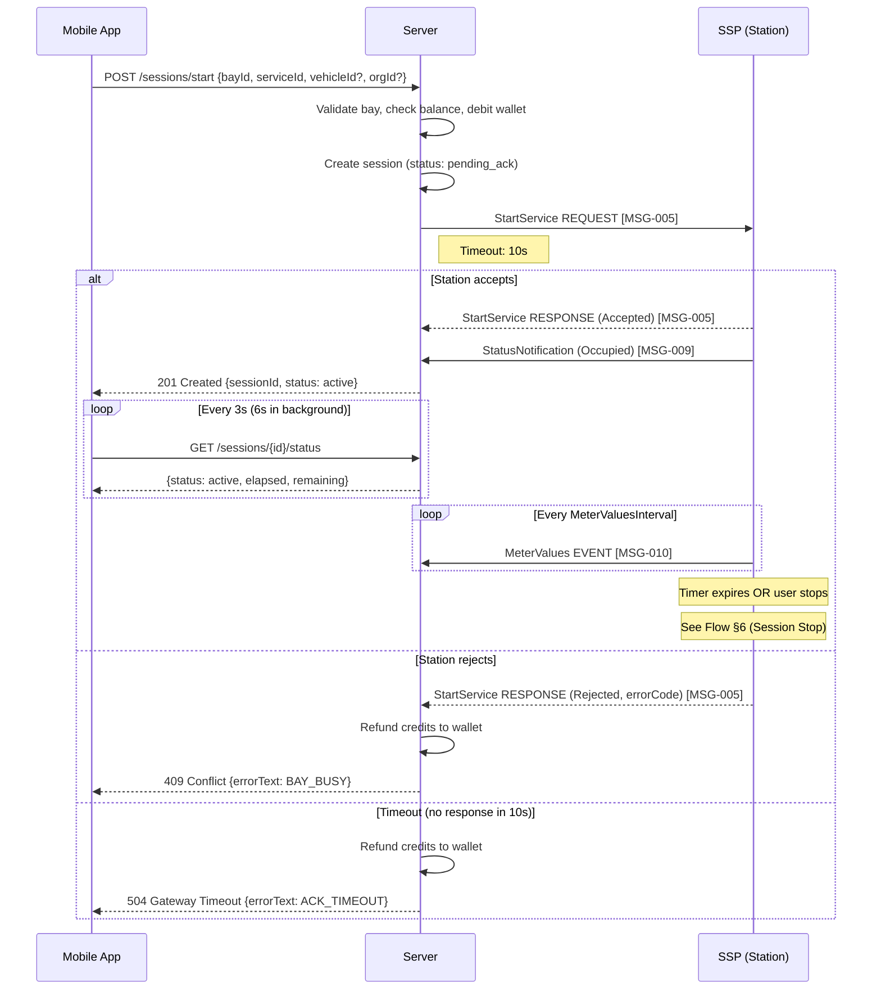
```mermaid
sequenceDiagram
    participant App as Mobile App
    participant Server
    participant SSP as SSP (Station)

    App->>Server: POST /sessions/start {bayId, serviceId, vehicleId?, orgId?}
    Server->>Server: Validate bay, check balance, debit wallet
    Server->>Server: Create session (status: pending_ack)
    Server->>SSP: StartService REQUEST [MSG-005]
    Note right of Server: Timeout: 10s

    alt Station accepts
        SSP-->>Server: StartService RESPONSE (Accepted) [MSG-005]
        SSP->>Server: StatusNotification (Occupied) [MSG-009]
        Server-->>App: 201 Created {sessionId, status: active}

        loop Every 3s (6s in background)
            App->>Server: GET /sessions/{id}/status
            Server-->>App: {status: active, elapsed, remaining}
        end

        loop Every MeterValuesInterval
            SSP->>Server: MeterValues EVENT [MSG-010]
        end

        Note over SSP: Timer expires OR user stops
        Note over SSP: See Flow §6 (Session Stop)

    else Station rejects
        SSP-->>Server: StartService RESPONSE (Rejected, errorCode) [MSG-005]
        Server->>Server: Refund credits to wallet
        Server-->>App: 409 Conflict {errorText: BAY_BUSY}

    else Timeout (no response in 10s)
        Server->>Server: Refund credits to wallet
        Server-->>App: 504 Gateway Timeout {errorText: ACK_TIMEOUT}
    end
```

### Happy Path

1. **App** sends `POST /sessions/start` with `bayId`, `serviceId`, optional `vehicleId` and `organizationId`
2. **Server** validates: bay exists, bay is Available (or Reserved by this user), service is in catalog, user has sufficient credits, user has no active session
3. **Server** debits credits from user's wallet (pre-authorization for max duration)
4. **Server** creates a session record with `status: pending_ack`
5. **Server** sends **StartService REQUEST** [MSG-005] to the SSP via MQTT with `sessionId`, `bayId`, `serviceId`, `durationSeconds`, `sessionSource: "MobileApp"`
6. **SSP** validates the bay state, activates the hardware
7. **SSP** sends **StartService RESPONSE** [MSG-005] with `status: "Accepted"`
8. **SSP** sends **StatusNotification** [MSG-009] with `status: "Occupied"`
9. **Server** updates session to `status: active`, returns `201 Created` to the App
10. **App** polls `GET /sessions/{id}/status` every 3 seconds (6 seconds when in background)
11. **SSP** sends periodic **MeterValues** [MSG-010] events (every `MeterValuesInterval` seconds, default 60)
12. Session continues until stopped (see [Flow §6](#6-session-stop--completion))

### Alternative Paths

**A1 — Bay already reserved by this user:** If the bay was previously reserved (e.g., from web payment flow), the SSP consumes the reservation at step 6 and transitions directly from `Reserved` to `Occupied`. The `reservationId` is included in the StartService REQUEST.

**A2 — Corporate session:** If `organizationId` is provided, Server validates the corporate policy (time restrictions, vehicle matching, credit limit) before step 3. Credits are debited from the organization's wallet.

### Error Paths

| Step | Error | Cause | Action |
|:----:|-------|-------|--------|
| 2 | `400 VALIDATION_ERROR` | Missing/invalid fields | Return error details to App |
| 2 | `402 INSUFFICIENT_BALANCE` | Not enough credits | App shows top-up prompt |
| 2 | `409 BAY_BUSY` | Bay occupied or reserved | App suggests another bay |
| 2 | `409 SESSION_ALREADY_ACTIVE` | User has an active session | App shows active session |
| 2 | `409 STATION_OFFLINE` | Station not connected via MQTT | App shows offline message |
| 5 | `504 ACK_TIMEOUT` | SSP did not respond within 10s | Server refunds 100%, App shows retry prompt |
| 7 | `3001 BAY_BUSY` | Bay became occupied between validation and command | Server refunds 100% |
| 7 | `3009 HARDWARE_ACTIVATION_FAILED` | Hardware failed to start | Server refunds 100% |

**Refund policy:** Any failure at or after step 3 (credits debited) but **before the service begins delivering** triggers an automatic full refund to the user's wallet — every error above occurs pre-delivery, so `delivered = 0`. Once the service has begun delivering, a terminal failure is settled by the per-reason **Refund Policy** in the Session End flow (pro-rated by delivered time; a full refund only when `< 50%` was delivered **and** the reason is `Fault`), not an automatic full refund.

### Postconditions

| Component | State |
|-----------|-------|
| SSP Bay | `Occupied` — hardware active, timer running |
| Server Session | `active` — elapsed time tracked |
| User Wallet | Debited (pre-authorization for max duration) |
| App | Polling session status |

---

## 4. Web Payment Session — Anonymous

**Description:** An anonymous user scans a QR code at the station, selects a service, pays with a card (3D Secure), and the station starts the service. No account or app required.

### Preconditions

- Station has a QR code displayed (encoding the station/bay code)
- Station is online (MQTT connected)
- Payment gateway is operational
- Target bay is in `Available` status

### Sequence Diagram

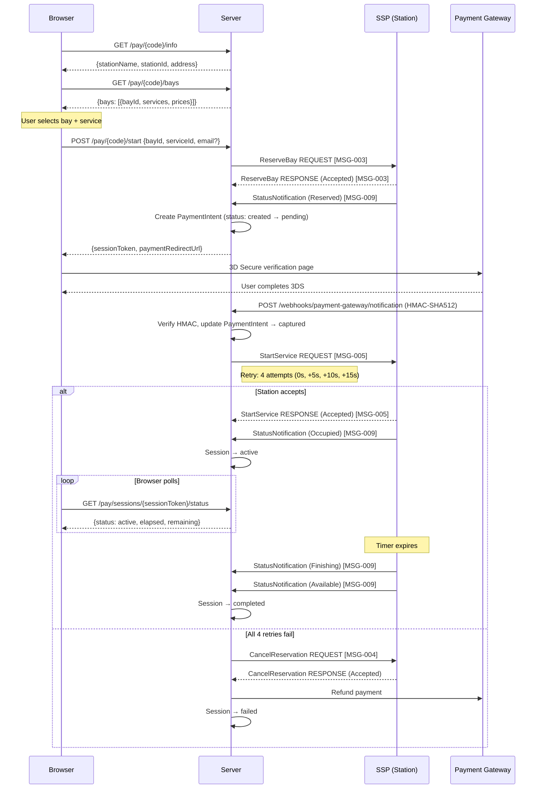
```mermaid
sequenceDiagram
    participant Browser as Browser
    participant Server
    participant SSP as SSP (Station)
    participant PG as Payment Gateway

    Browser->>Server: GET /pay/{code}/info
    Server-->>Browser: {stationName, stationId, address}
    Browser->>Server: GET /pay/{code}/bays
    Server-->>Browser: {bays: [{bayId, services, prices}]}

    Note over Browser: User selects bay + service

    Browser->>Server: POST /pay/{code}/start {bayId, serviceId, email?}
    Server->>SSP: ReserveBay REQUEST [MSG-003]
    SSP-->>Server: ReserveBay RESPONSE (Accepted) [MSG-003]
    SSP->>Server: StatusNotification (Reserved) [MSG-009]

    Server->>Server: Create PaymentIntent (status: created → pending)
    Server-->>Browser: {sessionToken, paymentRedirectUrl}

    Browser->>PG: 3D Secure verification page
    PG-->>Browser: User completes 3DS

    PG->>Server: POST /webhooks/payment-gateway/notification (HMAC-SHA512)
    Server->>Server: Verify HMAC, update PaymentIntent → captured

    Server->>SSP: StartService REQUEST [MSG-005]
    Note right of Server: Retry: 4 attempts (0s, +5s, +10s, +15s)

    alt Station accepts
        SSP-->>Server: StartService RESPONSE (Accepted) [MSG-005]
        SSP->>Server: StatusNotification (Occupied) [MSG-009]
        Server->>Server: Session → active

        loop Browser polls
            Browser->>Server: GET /pay/sessions/{sessionToken}/status
            Server-->>Browser: {status: active, elapsed, remaining}
        end

        Note over SSP: Timer expires
        SSP->>Server: StatusNotification (Finishing) [MSG-009]
        SSP->>Server: StatusNotification (Available) [MSG-009]
        Server->>Server: Session → completed

    else All 4 retries fail
        Server->>SSP: CancelReservation REQUEST [MSG-004]
        SSP-->>Server: CancelReservation RESPONSE (Accepted)
        Server->>PG: Refund payment
        Server->>Server: Session → failed
    end
```

### Happy Path

1. **Browser** scans QR code → `GET /pay/{code}/info` — retrieves station name, address, and location
2. **Browser** calls `GET /pay/{code}/bays` — retrieves bay list with services and prices
3. User selects a bay and service
4. **Browser** sends `POST /pay/{code}/start` with `bayId`, `serviceId`, and optional `email` (for receipt)
5. **Server** sends **ReserveBay REQUEST** [MSG-003] to the SSP with `reservationId`, bay, and expiration (default 180s TTL)
6. **SSP** transitions bay to `Reserved`, sends **ReserveBay RESPONSE** [MSG-003] `Accepted`
7. **SSP** sends **StatusNotification** [MSG-009] with `status: "Reserved"`
8. **Server** creates a PaymentIntent (`created` → `pending`), returns a `sessionToken` (RFC 4122 UUID, any version; 10-min TTL) and payment gateway redirect URL to the Browser
9. **Browser** redirects to the payment gateway 3D Secure verification page
10. User completes 3DS authentication
11. **PG** sends `POST /webhooks/payment-gateway/notification` (HMAC-SHA512 signed) to Server
12. **Server** verifies webhook HMAC (timing-safe comparison), updates PaymentIntent to `captured`
13. **Server** sends **StartService REQUEST** [MSG-005] to the SSP
14. **SSP** activates hardware, sends **StartService RESPONSE** [MSG-005] `Accepted`
15. **SSP** sends **StatusNotification** [MSG-009] with `status: "Occupied"`
16. **Server** updates session to `active`
17. **Browser** polls `GET /pay/sessions/{sessionToken}/status` for progress
18. Timer expires → **SSP** sends **StatusNotification** [MSG-009] `Finishing` then `Available`
19. **Server** marks session as `completed`
20. If `email` was provided, Server sends a receipt email

### Alternative Paths

**A1 — Station offline at reservation:** Server creates a server-side BayLock (3-minute TTL) instead of sending ReserveBay MQTT. If the station does not come online before payment completes, the session fails and payment is refunded.

**A2 — Optional email receipt:** After completion, the Browser MAY call `POST /pay/sessions/{sessionToken}/receipt` with an email address. If provided at step 4, the receipt is sent automatically.

**A3 — Post-payment account creation:** After session completion, the Browser MAY call `POST /pay/register` to create an account and receive credit for the session (loyalty conversion).

### Error Paths

| Step | Error | Cause | Action |
|:----:|-------|-------|--------|
| 5-6 | ReserveBay `Rejected` | Bay busy/faulted/maintenance | Server returns 409 to Browser, no payment initiated |
| 9-10 | 3DS timeout (3 min) | User did not complete payment | Server sends CancelReservation [MSG-004], session → failed |
| 11 | Webhook HMAC invalid | Tampered or replayed webhook | Server rejects silently, log SecurityEvent |
| 11 | PaymentIntent expired (5 min) | Payment took too long | Server sends CancelReservation [MSG-004], refund |
| 13 | StartService timeout / reject | All 4 retries fail | Server sends CancelReservation [MSG-004], refund 100% |
| 17 | Session token expired (10 min) | Browser lost connection | Session continues on station; no status updates to Browser |

**StartService retry policy (web payment):** Server retries up to 4 times with delays of 0s, +5s, +10s, +15s (each with 10s timeout). If all retries fail, CancelReservation is sent and the payment is refunded.

**Anti-abuse (5 layers):**
1. IP rate limiting: 5 sessions / 30 min per IP
2. Device fingerprint: 3 sessions / 30 min per fingerprint
3. Progressive CAPTCHA (Cloudflare Turnstile) on suspicious patterns
4. Abandon scoring: 5+ abandoned → 15-min block
5. Bay lock only at `POST /pay/{code}/start` (not at browse)

### Postconditions

| Component | State |
|-----------|-------|
| SSP Bay | `Occupied` → `Finishing` → `Available` (timer-driven) |
| Server Session | `completed` |
| PaymentIntent | `captured` → `settled` (async settlement) |
| Browser | Shows "service complete" status |

---

## 5a. Full Offline Session — BLE

**Description:** Both the phone and the station are offline. The user connects via BLE, authenticates with a pre-armed OfflinePass, and the station runs the service using only local validation. The transaction is reconciled when connectivity is restored.

### Preconditions

- User has a valid OfflinePass in the app (pre-armed while online)
- Station BLE is advertising
- Station has the server's ECDSA P-256 verify key in NVS
- Station `OfflineModeEnabled` configuration is `true`
- Station has not exceeded `stationMaxOfflineTx` limit
- App has biometric/PIN capability

### Sequence Diagram

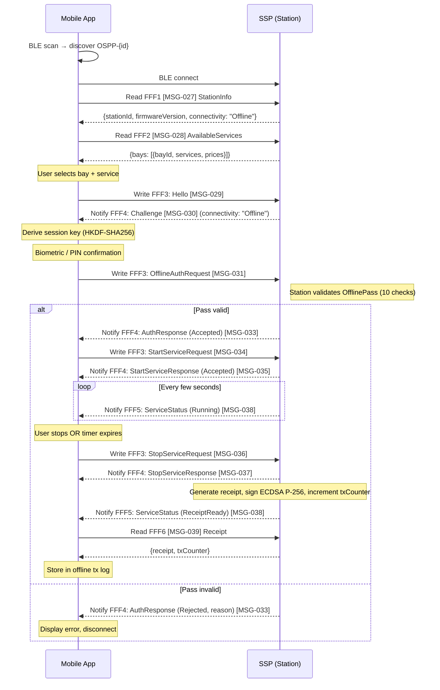
```mermaid
sequenceDiagram
    participant App as Mobile App
    participant SSP as SSP (Station)

    App->>App: BLE scan → discover OSPP-{id}
    App->>SSP: BLE connect

    App->>SSP: Read FFF1 [MSG-027] StationInfo
    SSP-->>App: {stationId, firmwareVersion, connectivity: "Offline"}
    App->>SSP: Read FFF2 [MSG-028] AvailableServices
    SSP-->>App: {bays: [{bayId, services, prices}]}

    Note over App: User selects bay + service

    App->>SSP: Write FFF3: Hello [MSG-029]
    SSP-->>App: Notify FFF4: Challenge [MSG-030] (connectivity: "Offline")

    Note over App: Derive session key (HKDF-SHA256)
    Note over App: Biometric / PIN confirmation

    App->>SSP: Write FFF3: OfflineAuthRequest [MSG-031]
    Note right of SSP: Station validates OfflinePass (10 checks)

    alt Pass valid
        SSP-->>App: Notify FFF4: AuthResponse (Accepted) [MSG-033]

        App->>SSP: Write FFF3: StartServiceRequest [MSG-034]
        SSP-->>App: Notify FFF4: StartServiceResponse (Accepted) [MSG-035]

        loop Every few seconds
            SSP-->>App: Notify FFF5: ServiceStatus (Running) [MSG-038]
        end

        Note over App: User stops OR timer expires
        App->>SSP: Write FFF3: StopServiceRequest [MSG-036]
        SSP-->>App: Notify FFF4: StopServiceResponse [MSG-037]

        Note over SSP: Generate receipt, sign ECDSA P-256, increment txCounter
        SSP-->>App: Notify FFF5: ServiceStatus (ReceiptReady) [MSG-038]

        App->>SSP: Read FFF6 [MSG-039] Receipt
        SSP-->>App: {receipt, txCounter}
        Note over App: Store in offline tx log

    else Pass invalid
        SSP-->>App: Notify FFF4: AuthResponse (Rejected, reason) [MSG-033]
        Note over App: Display error, disconnect
    end
```

### Happy Path

1. **App** scans for BLE devices, discovers station advertising as `OSPP-{station_id_last6}`
2. **App** establishes BLE connection
3. **App** reads **StationInfo** [MSG-027] from FFF1 — verifies station identity, checks `connectivity: "Offline"`
4. **App** reads **AvailableServices** [MSG-028] from FFF2 — displays service catalog with prices
5. User selects a bay and service
6. **App** writes **HELLO** [MSG-029] to FFF3 with `deviceId`, `appNonce`, `appVersion`, `appEphemeralPubKey`
7. **SSP** responds with **CHALLENGE** [MSG-030] on FFF4 with `stationNonce`, `stationCert` (StationIdentity), `stationEphemeralPubKey`, `stationConnectivity: "Offline"`
8. **App** verifies `stationCert` against the server signing key (§6.5.2) — **aborts and sends no pass if invalid** — then derives the session key via ECDH P-256 + HKDF-SHA256 (`ikm = es ‖ ee ‖ appNonce ‖ stationNonce`; the LTK is not used). The post-Challenge AEAD channel is now established.
9. **App** requests biometric or PIN confirmation from the user
10. **App** writes **OfflineAuthRequest** [MSG-031] to FFF3 (inside the AEAD channel) with the OfflinePass, counter, and `sessionProof`
11. **SSP** validates the OfflinePass (10 checks — signature, expiry, epoch, device, limits, interval, counter)
12. **SSP** sends **AuthResponse** [MSG-033] `Accepted` on FFF4 with session key confirmation
13. **App** writes **StartServiceRequest** [MSG-034] to FFF3 with `bayId`, `serviceId`, `requestedDurationSeconds`
14. **SSP** activates hardware, sends **StartServiceResponse** [MSG-035] `Accepted` with `sessionId` and `offlineTxId`
15. **SSP** sends periodic **ServiceStatus** [MSG-038] on FFF5 (`Running`, elapsed, remaining, meter values)
16. User stops (or timer expires) → **App** writes **StopServiceRequest** [MSG-036] to FFF3
17. **SSP** deactivates hardware, sends **StopServiceResponse** [MSG-037] with `actualDurationSeconds` and `creditsCharged`
18. **SSP** generates receipt: signs with ECDSA P-256 (RFC 6979), increments `txCounter`
19. **SSP** sends **ServiceStatus** [MSG-038] with `status: "ReceiptReady"`
20. **App** reads **Receipt** [MSG-039] from FFF6 — stores the signed receipt in its offline transaction log
21. **App** disconnects BLE

**Later, when connectivity is restored:**
- **SSP** reconciles via [Flow §10](#10-offline--online-reconciliation) (TransactionEvent [MSG-007])
- **App** syncs via `POST /me/offline-txs` (backup reconciliation path)

### Alternative Paths

**A1 — Timer auto-stop:** If the user does not send StopServiceRequest, the station automatically stops when `requestedDurationSeconds` expires. The station still generates a receipt and notifies via FFF5.

**A2 — BLE disconnect during session:** If BLE disconnects during an active session, the station continues the service until the timer expires. The receipt remains readable on FFF6 for the next BLE connection (within a configurable window).

### Error Paths

| Step | Error | Code | App Action |
|:----:|-------|------|------------|
| 11 | Signature invalid | `2002` | Display "Pass invalid", disconnect |
| 11 | Pass expired | `2003` | Display "Pass expired, go online to renew" |
| 11 | Epoch revoked | `2004` | Display "Pass revoked" |
| 11 | Limits exceeded | `4002` | Display "Offline limit reached, go online" |
| 11 | Rate limited | `4003` | Display "Wait before next session" |
| 11 | Counter replay | `2005` | Display "Security error" |
| 11 | OfflinePass stationId constraint does not match | `2006` | Display "Station mismatch" |
| 14 | Bay busy | `3001` | Display "Bay occupied" |
| 14 | Hardware failure | `3009` | Display "Hardware error" |

### Postconditions

| Component | State |
|-----------|-------|
| SSP Bay | `Available` (after stop and wind-down) |
| SSP Offline Log | New transaction with receipt, incremented txCounter |
| App Offline Log | Signed receipt stored, pending server sync |
| User Wallet | Not debited (debit occurs during reconciliation [Flow §10]) |

---

## 5b. Partial A — Phone Online, Station Offline

**Description:** The user's phone has internet, but the station is offline (MQTT disconnected). The app obtains a server-signed authorization and delivers it to the station via BLE.

### Preconditions

- App has internet connectivity
- Station is offline (no MQTT) but BLE is advertising
- User is authenticated (valid JWT)
- User has sufficient credits

### Sequence Diagram

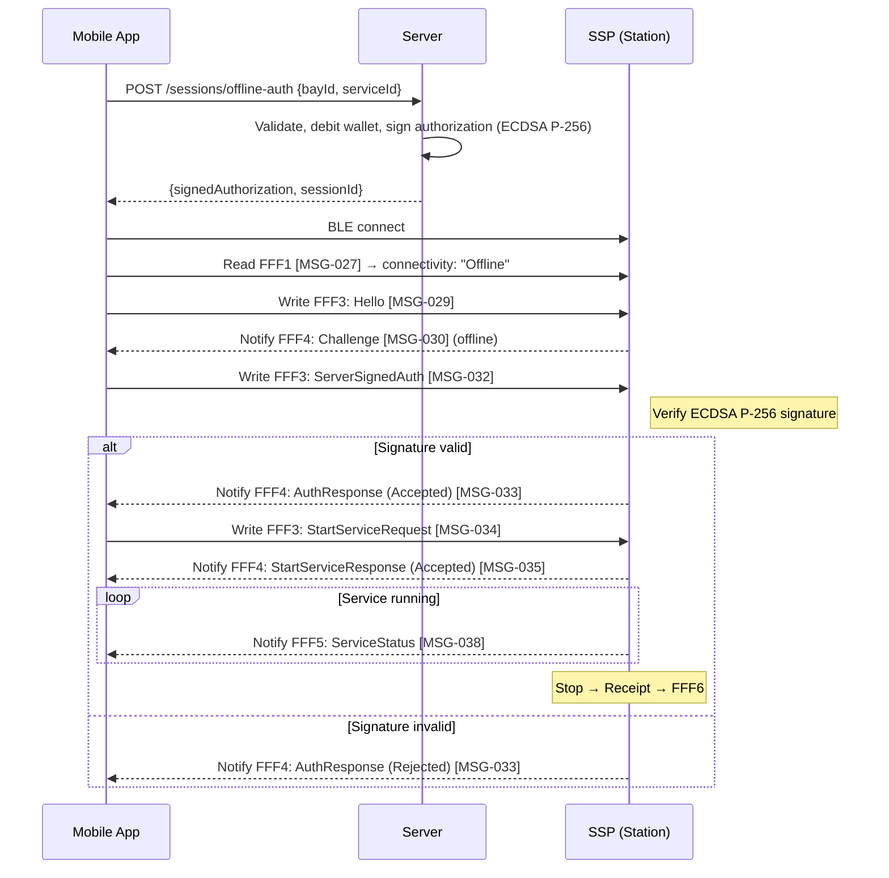
```mermaid
sequenceDiagram
    participant App as Mobile App
    participant Server
    participant SSP as SSP (Station)

    App->>Server: POST /sessions/offline-auth {bayId, serviceId}
    Server->>Server: Validate, debit wallet, sign authorization (ECDSA P-256)
    Server-->>App: {signedAuthorization, sessionId}

    App->>SSP: BLE connect
    App->>SSP: Read FFF1 [MSG-027] → connectivity: "Offline"
    App->>SSP: Write FFF3: Hello [MSG-029]
    SSP-->>App: Notify FFF4: Challenge [MSG-030] (offline)

    App->>SSP: Write FFF3: ServerSignedAuth [MSG-032]
    Note right of SSP: Verify ECDSA P-256 signature

    alt Signature valid
        SSP-->>App: Notify FFF4: AuthResponse (Accepted) [MSG-033]
        App->>SSP: Write FFF3: StartServiceRequest [MSG-034]
        SSP-->>App: Notify FFF4: StartServiceResponse (Accepted) [MSG-035]

        loop Service running
            SSP-->>App: Notify FFF5: ServiceStatus [MSG-038]
        end

        Note over SSP: Stop → Receipt → FFF6
    else Signature invalid
        SSP-->>App: Notify FFF4: AuthResponse (Rejected) [MSG-033]
    end
```

### Happy Path

1. **App** sends `POST /sessions/offline-auth` to Server with `bayId` and `serviceId`
2. **Server** validates the user, debits the issue-time pre-debit, signs the ServerSignedAuth authorization blob with ECDSA P-256 server key — the signed claims carry `durationSeconds` (which the station clamps the session duration to) and `creditsAuthorized` (the pre-debit basis — **not** a settlement cap; the server recomputes final billing per the Billing Authority §6 / reconciliation §8.2, so settled cost MAY exceed it), alongside `authId`, `sessionId`, `bayId`, `serviceId`, `appNonce`, `issuedAt`, `expiresAt` (full claim set: `server-signed-auth-claims.schema.json`, finding N3)
3. **Server** returns `signedAuthorization` (Base64) and `sessionId` to the App
4. **App** connects to the SSP via BLE
5. **App** reads **StationInfo** [MSG-027] — confirms `connectivity: "Offline"`
6. **App** writes **HELLO** [MSG-029] → SSP responds with **CHALLENGE** [MSG-030]
7. **App** writes **ServerSignedAuth** [MSG-032] with the server-signed authorization blob and `sessionId`
8. **SSP** verifies the ECDSA P-256 signature using `OfflinePassPublicKey` (cached previous key also accepted during the grace period)
9. **SSP** sends **AuthResponse** [MSG-033] `Accepted`
10. **App** writes **StartServiceRequest** [MSG-034] → SSP starts service
11. Service runs with **ServiceStatus** [MSG-038] updates
12. Stop → **Receipt** [MSG-039] generation (same as Full Offline steps 16-21)

### Error Paths

| Step | Error | Action |
|:----:|-------|--------|
| 2 | `402 INSUFFICIENT_BALANCE` | App shows top-up prompt |
| 2 | `409 STATION_OFFLINE` | Server cannot verify bay status — proceeds with signed auth (optimistic) |
| 8 | ECDSA P-256 signature invalid | SSP rejects — key mismatch or tampered auth |
| 8 | Authorization expired | SSP rejects — user took too long between server call and BLE |

### Postconditions

| Component | State |
|-----------|-------|
| User Wallet | Debited at step 2 (by Server) |
| SSP | Has server-signed proof; transaction logged locally |
| Server | Session created (status: pending — awaiting reconciliation) |

---

## 5c. Partial B — Phone Offline, Station Online

**Description:** The user's phone is offline, but the station has MQTT connectivity. The app presents an OfflinePass via BLE, and the station forwards it to the server for real-time validation.

### Preconditions

- Station is online (MQTT connected)
- App has no internet but has a valid OfflinePass
- User completed biometric/PIN setup

### Sequence Diagram

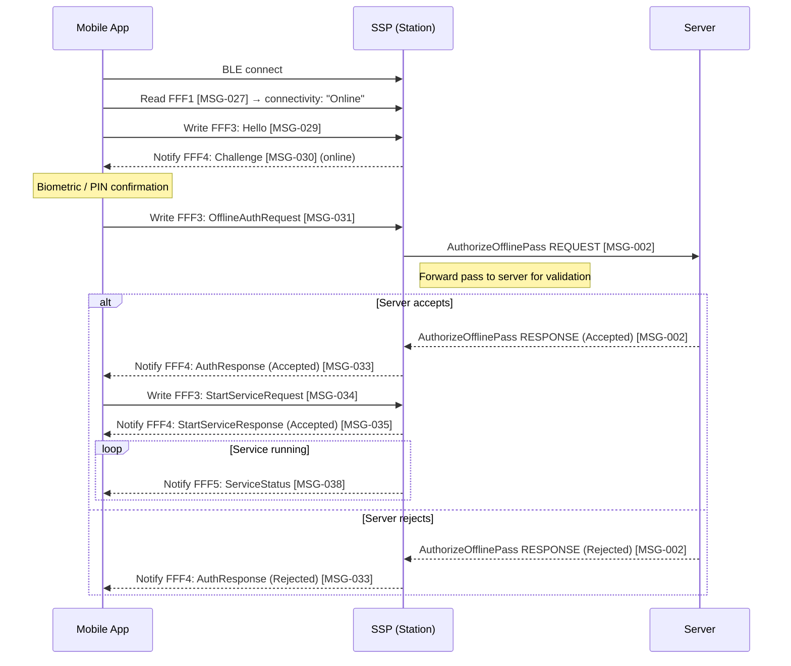
```mermaid
sequenceDiagram
    participant App as Mobile App
    participant SSP as SSP (Station)
    participant Server

    App->>SSP: BLE connect
    App->>SSP: Read FFF1 [MSG-027] → connectivity: "Online"
    App->>SSP: Write FFF3: Hello [MSG-029]
    SSP-->>App: Notify FFF4: Challenge [MSG-030] (online)

    Note over App: Biometric / PIN confirmation

    App->>SSP: Write FFF3: OfflineAuthRequest [MSG-031]

    SSP->>Server: AuthorizeOfflinePass REQUEST [MSG-002]
    Note right of SSP: Forward pass to server for validation

    alt Server accepts
        Server-->>SSP: AuthorizeOfflinePass RESPONSE (Accepted) [MSG-002]
        SSP-->>App: Notify FFF4: AuthResponse (Accepted) [MSG-033]
        App->>SSP: Write FFF3: StartServiceRequest [MSG-034]
        SSP-->>App: Notify FFF4: StartServiceResponse (Accepted) [MSG-035]

        loop Service running
            SSP-->>App: Notify FFF5: ServiceStatus [MSG-038]
        end

    else Server rejects
        Server-->>SSP: AuthorizeOfflinePass RESPONSE (Rejected) [MSG-002]
        SSP-->>App: Notify FFF4: AuthResponse (Rejected) [MSG-033]
    end
```

### Happy Path

1. **App** connects to SSP via BLE
2. **App** reads **StationInfo** [MSG-027] — sees `connectivity: "Online"`
3. **App** writes **HELLO** [MSG-029] → SSP responds with **CHALLENGE** [MSG-030] (`stationConnectivity: "Online"`)
4. **App** requests biometric/PIN confirmation
5. **App** writes **OfflineAuthRequest** [MSG-031] with the OfflinePass
6. **SSP** does NOT validate locally — instead forwards the pass to the Server via **AuthorizeOfflinePass REQUEST** [MSG-002] over MQTT
7. **Server** validates the pass (checks signature, expiry, epoch, limits, user balance), debits user wallet
8. **Server** sends **AuthorizeOfflinePass RESPONSE** [MSG-002] `Accepted` with `sessionId`, `durationSeconds`, `creditsAuthorized`
9. **SSP** relays result as **AuthResponse** [MSG-033] `Accepted` to App via BLE
10. **App** writes **StartServiceRequest** [MSG-034] → SSP starts service
11. Service runs with **ServiceStatus** [MSG-038] updates, then stop/receipt
12. Since the station is online, the session is tracked in real-time by Server (no later reconciliation needed)

### Error Paths

| Step | Error | Action |
|:----:|-------|--------|
| 6 | MQTT send failure | SSP falls back to local validation (like Full Offline) |
| 7 | Pass rejected by server | SSP relays rejection to App with error code |
| 7 | AuthorizeOfflinePass timeout (15s) | SSP falls back to local validation (degraded mode) |

### Postconditions

| Component | State |
|-----------|-------|
| User Wallet | Debited by Server (real-time, step 7) |
| Server Session | `active` (real-time tracking) |
| SSP | Online session — no reconciliation needed |

---

## 6. Session Stop & Completion

**Description:** An active session is stopped either by the user, by the session timer, or by an error condition. Applies to both online (MQTT) and offline (BLE) sessions.

### Preconditions

- A session is currently active on a bay
- Bay status is `Occupied`

### Sequence Diagram (Online — MQTT)

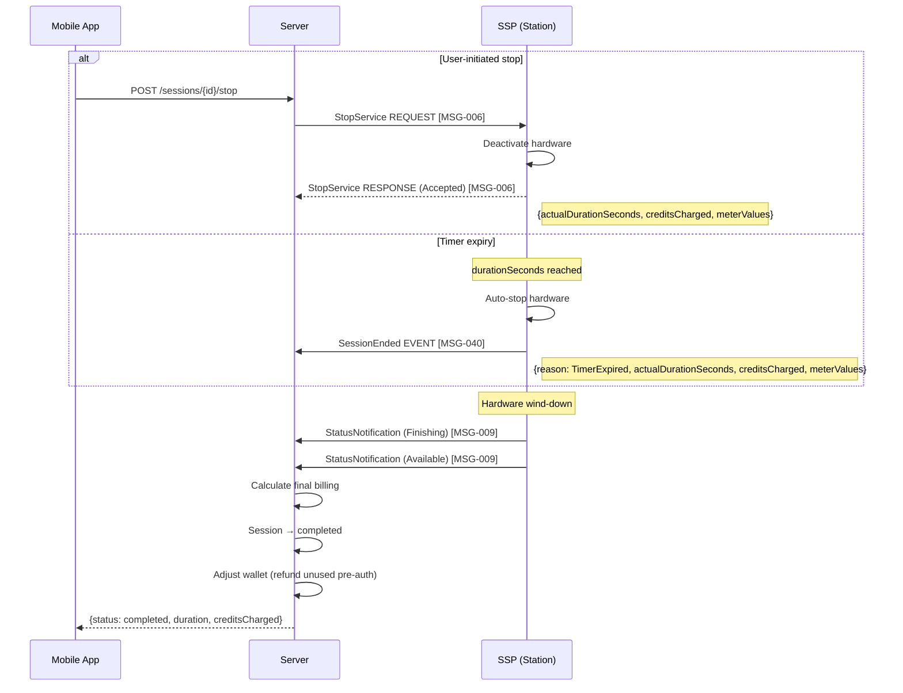
```mermaid
sequenceDiagram
    participant App as Mobile App
    participant Server
    participant SSP as SSP (Station)

    alt User-initiated stop
        App->>Server: POST /sessions/{id}/stop
        Server->>SSP: StopService REQUEST [MSG-006]
        SSP->>SSP: Deactivate hardware
        SSP-->>Server: StopService RESPONSE (Accepted) [MSG-006]
        Note right of SSP: {actualDurationSeconds, creditsCharged, meterValues}

    else Timer expiry
        Note over SSP: durationSeconds reached
        SSP->>SSP: Auto-stop hardware
        SSP->>Server: SessionEnded EVENT [MSG-040]
        Note right of SSP: {reason: TimerExpired, actualDurationSeconds, creditsCharged, meterValues}
    end

    Note over SSP: Hardware wind-down
    SSP->>Server: StatusNotification (Finishing) [MSG-009]
    SSP->>Server: StatusNotification (Available) [MSG-009]

    Server->>Server: Calculate final billing
    Server->>Server: Session → completed
    Server->>Server: Adjust wallet (refund unused pre-auth)
    Server-->>App: {status: completed, duration, creditsCharged}
```

### Billing Authority

The **CSMS (server) is the authoritative billing engine** for all sessions. The station's role is to report raw resource counters (`actualDurationSeconds`, `creditsCharged`, `meterValues`); the server applies the active tariff, reconciles the values against the pre-authorization, and produces the final invoice or wallet adjustment.

The following rules are normative:

- The station **MUST NOT** be the source of truth for monetary cost. The `creditsCharged` field reported by the station is **advisory** — it represents the station's estimate based on the service rate active at session start.
- The server **MUST** recompute final billing using the actual duration and the tariff in force when the session ran, regardless of the station-reported `creditsCharged`. Implementations MAY accept the station value as-is when it matches the server-side recomputation; they MUST NOT accept it blindly when it diverges.
- For sessions that end via `StopService` RESPONSE [MSG-006], the server uses the response's `actualDurationSeconds` (and `meterValues` when relevant) as billing input.
- For sessions that end autonomously via `SessionEnded` EVENT [MSG-040] (timer expiry or hardware fault), the server uses the event's `actualDurationSeconds` as billing input and applies the refund policy described below.
- Tariff lookup, currency conversion, tax handling, and any operator-specific pricing rules are server-side concerns. Stations remain unaware of the priced amount in user-facing currency.

This separation ensures that a misconfigured or compromised station cannot overcharge a user, and that pricing changes can be deployed server-side without firmware updates.

### Happy Path (Online)

1. **Trigger:** User taps "Stop" in App, or session timer expires on SSP, or Server sends StopService
2. If user-initiated: **App** sends `POST /sessions/{id}/stop` → **Server** sends **StopService REQUEST** [MSG-006]
3. **SSP** deactivates hardware, calculates actual duration and credits charged
4. **SSP** sends **StopService RESPONSE** [MSG-006] with `actualDurationSeconds`, `creditsCharged`, final `meterValues` (user-initiated stop only). For timer expiry, **SSP** sends **SessionEnded EVENT** [MSG-040] with `reason: "TimerExpired"`, `actualDurationSeconds`, `creditsCharged`, final `meterValues` instead. The server uses the reported duration and meter values as billing **input** — it remains the billing authority (see the **Billing Authority** rules above and step 7).
5. **SSP** sends **StatusNotification** [MSG-009] `Finishing` (hardware winding down)
6. **SSP** sends **StatusNotification** [MSG-009] `Available` (bay ready for next user)
7. **Server** processes billing (the server is the billing authority — the station-reported `creditsCharged` is advisory per the **Billing Authority** rules above): for a user-initiated stop it recomputes `creditsCharged = ceil(actualDurationSeconds / 60 * priceCreditsPerMinute)` from the reported duration; for timer expiry the booked duration was delivered in full, so it charges the **full pre-authorized amount** (not the station-reported `creditsCharged`, and regardless of meter values)
8. **Server** adjusts wallet — refunds the difference between pre-authorized amount and actual charge
9. **Server** transitions session to `completed`
10. **App** receives completion status on next poll

### Happy Path (BLE / Offline)

1. **Trigger:** User taps "Stop" in App, or timer expires
2. **App** writes **StopServiceRequest** [MSG-036] to FFF3
3. **SSP** deactivates hardware, sends **StopServiceResponse** [MSG-037] with billing
4. **SSP** generates signed receipt (ECDSA P-256), increments `txCounter`
5. **SSP** notifies **ServiceStatus** [MSG-038] `ReceiptReady` on FFF5
6. **App** reads **Receipt** [MSG-039] from FFF6, stores in offline log

### Alternative Paths

**A1 — Hardware error during session:** SSP detects a hardware fault → auto-stops → sends **SessionEnded EVENT** [MSG-040] with `reason: "Fault"`, followed by StatusNotification `Faulted` [MSG-009]. Server uses `creditsCharged` from SessionEnded for billing and applies refund policy (if < 50% duration delivered → full refund).

**A2 — MQTT disconnect during session:** SSP continues the service (does NOT stop the service). On reconnection, SSP re-boots (BootNotification [MSG-001]) and reports the session outcome.

**A3 — StopService timeout:** If Server sends StopService and SSP does not respond within 10 seconds, Server marks the session as `failed`. SSP will report the actual outcome on next reconnection.

### Refund Policy

| Scenario | Refund | Amount |
|----------|--------|--------|
| Station NACK on StartService | Full | 100% |
| All retry attempts fail | Full | 100% |
| ACK_TIMEOUT (no response) | Full | 100% |
| Hardware error during active (SessionEnded `reason=Fault`) | Partial (pro-rated) | Based on time used |
| Station offline during active | Partial (pro-rated) | Based on time used |
| User manual stop at station (SessionEnded `reason=Local`) | Partial (pro-rated) | Based on time used (charge `creditsCharged` from event) |
| Offline credit exhausted mid-session (SessionEnded `reason=LocalOutOfCredit`) | Full | 100% (no charge — `creditsCharged` MUST be 0) |
| Offline pass revoked mid-session (SessionEnded `reason=Deauthorized`) | Full | 100% (no charge — session not billable; `creditsCharged` MUST be 0) |
| Timer ran to completion (SessionEnded `reason=TimerExpired`) | None | Charge full pre-authorized amount (user received the booked duration regardless of meter values) |
| If less than `faultFullRefundThreshold` of duration delivered AND reason=`Fault` | Full | 100% (override pro-rate) |

> **Refund scope clarification:** The low-delivery override applies **only** when SessionEnded reason is `Fault`. It does **not** apply to `TimerExpired` sessions: a session that runs to its booked timer is billed for the full pre-authorized duration regardless of meter values, because the user received the time they paid for. The override formula is `actualDurationSeconds < faultFullRefundThreshold × durationSeconds`, evaluated against the booked `durationSeconds` from StartService.
>
> **`faultFullRefundThreshold` (explicit, configurable product parameter — default `0.50`).** The fraction of the booked duration below which a `Fault`-terminated session is deemed to have delivered nothing of value and is refunded in full. This is a **product decision** — *below what fraction is the delivered service worthless?* — so it is a **named, documented, server-configurable value**, never a constant baked into an implementation. A conforming server MUST read it from configuration and MUST keep its configured value and this specification value in lockstep; the default is `0.50` (the historical "< 50%" rule). It is `Fault`-only: a voluntary (`Local`) stop below the threshold is still billed pro-rata, not made free.

### Settlement by Service Kind

The refund matrix above is the **pro-rata baseline**. The settlement a session actually receives on a terminal reason is modulated by its **service kind** — a settlement attribute each service in the operator catalog declares, describing *what kind of thing the session delivers*. The kind is **snapshot onto the session at start**, so a later catalog edit never retroactively changes how an in-flight or already-settled session bills. The **server is the sole settlement authority** (see **Billing Authority** above); a station never computes a refund and never reports a kind.

Three kinds are defined:

| Kind | What it is | Settlement model |
|------|-----------|------------------|
| `UserDuration` | The user chooses the duration at start | **Pro-rata on delivered time** — the baseline matrix above, unchanged. |
| `FixedDuration` | A preset programme of fixed length (e.g. a 5-minute wash) | **All-or-nothing** — a started programme is consumed; a broken one delivered nothing. |
| `MultiUnit` | A discrete actuation (e.g. a 1–5 s dispense pulse) | **All-or-nothing per unit** — a dispensed unit is charged; a missed one is refunded. |

For `UserDuration`, settlement is exactly the reason-keyed matrix above. `FixedDuration` and `MultiUnit` are both **all-or-nothing**: the kind overrides the pro-rata amount on the two reasons where the models diverge, and matches it on the rest.

| SessionEnded reason | `UserDuration` | `FixedDuration` / `MultiUnit` |
|---------------------|----------------|-------------------------------|
| `TimerExpired` — delivered in full | Full charge | **Full charge** (same) |
| `Local` — voluntary stop mid-service | Pro-rata on delivered time | **Full charge** — a preset the user started is consumed |
| `Fault` — hardware fault mid-service | Pro-rata (full refund if less than `faultFullRefundThreshold` delivered) | **Full refund** — a service the station broke delivered nothing of value |
| `LocalOutOfCredit` / `Deauthorized` | Full refund (`creditsCharged` MUST be `0`) | **Full refund** (same) |

Only the `Local` and `Fault` rows diverge; `TimerExpired` (full charge) and `LocalOutOfCredit` / `Deauthorized` (full refund) are already kind-invariant. An all-or-nothing override is always the pre-authorized amount **in full** or **`0`** — never a partial amount.

**Delivery outcome (`MultiUnit`).** A `MultiUnit` session additionally records what physically happened — `Dispensed` on a clean `TimerExpired`, `Missed` on a `Fault`. When the physical outcome is genuinely ambiguous from control-plane signals alone (e.g. a mid-pulse voluntary stop) it is left unrecorded rather than guessed; settlement never depends on it (it stays derived from the kind). A jam the firmware does not itself detect runs the timer to expiry and is therefore billed as delivered; the corrective path is an operator-issued refund, not an automatic one.

### Postconditions

| Component | State |
|-----------|-------|
| SSP Bay | `Available` (or `Faulted` if hardware error) |
| Server Session | `completed` (or `failed`) |
| User Wallet | Final balance = pre-auth - actual charge (unused portion refunded) |

---

## 7. Credit Purchase / Top-up

**Description:** A mobile app user purchases credits using a real-currency payment. Credits are the internal currency used for all sessions.

### Preconditions

- User is authenticated in the mobile app
- Payment gateway is operational

### Sequence Diagram

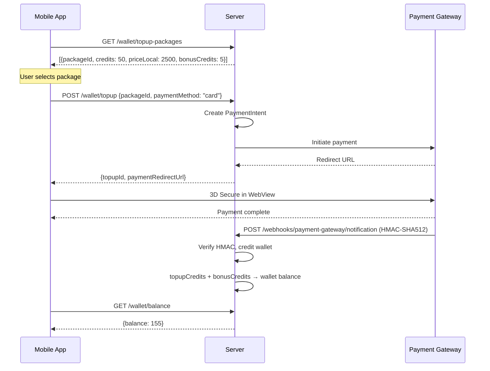
```mermaid
sequenceDiagram
    participant App as Mobile App
    participant Server
    participant PG as Payment Gateway

    App->>Server: GET /wallet/topup-packages
    Server-->>App: [{packageId, credits: 50, priceLocal: 2500, bonusCredits: 5}]

    Note over App: User selects package

    App->>Server: POST /wallet/topup {packageId, paymentMethod: "card"}
    Server->>Server: Create PaymentIntent
    Server->>PG: Initiate payment
    PG-->>Server: Redirect URL
    Server-->>App: {topupId, paymentRedirectUrl}

    App->>PG: 3D Secure in WebView
    PG-->>App: Payment complete

    PG->>Server: POST /webhooks/payment-gateway/notification (HMAC-SHA512)
    Server->>Server: Verify HMAC, credit wallet
    Server->>Server: topupCredits + bonusCredits → wallet balance

    App->>Server: GET /wallet/balance
    Server-->>App: {balance: 155}
```

### Happy Path

1. **App** calls `GET /wallet/topup-packages` — receives available packages (credits amount, local-currency price in minor units, bonus credits)
2. User selects a package
3. **App** sends `POST /wallet/topup` with `packageId` and `paymentMethod` (`"card"`, `"apple_pay"`, or `"google_pay"`)
4. **Server** creates a PaymentIntent, initiates payment with the gateway
5. **Server** returns `topupId` and payment redirect URL
6. **App** opens 3D Secure verification in a WebView
7. User completes payment authentication
8. **PG** sends webhook to Server with payment confirmation (HMAC-SHA512 signed)
9. **Server** verifies webhook, credits the user's wallet: `balance += packageCredits + bonusCredits`
10. **Server** generates a fiscal invoice for the transaction
11. **App** refreshes wallet balance

### Error Paths

| Step | Error | Action |
|:----:|-------|--------|
| 6-7 | Payment cancelled by user | PaymentIntent → cancelled, no credits |
| 7 | 3DS authentication failed | PaymentIntent → failed, no credits |
| 8 | Webhook timeout (5 min) | PaymentIntent → expired, no credits |
| 8 | HMAC verification failed | Reject webhook, log SecurityEvent |

### Postconditions

| Component | State |
|-----------|-------|
| User Wallet | Balance increased by `packageCredits + bonusCredits` |
| PaymentIntent | `captured` → `settled` |
| Fiscal Invoice | Generated for local-currency amount |

---

## 8. Heartbeat & Status Monitoring

**Description:** The station periodically sends heartbeats to prove liveness and synchronize its clock. The server uses missed heartbeats to detect offline stations.

### Preconditions

- Station has completed boot (BootNotification `Accepted`)
- Heartbeat timer is running at `heartbeatIntervalSec` seconds

### Sequence Diagram

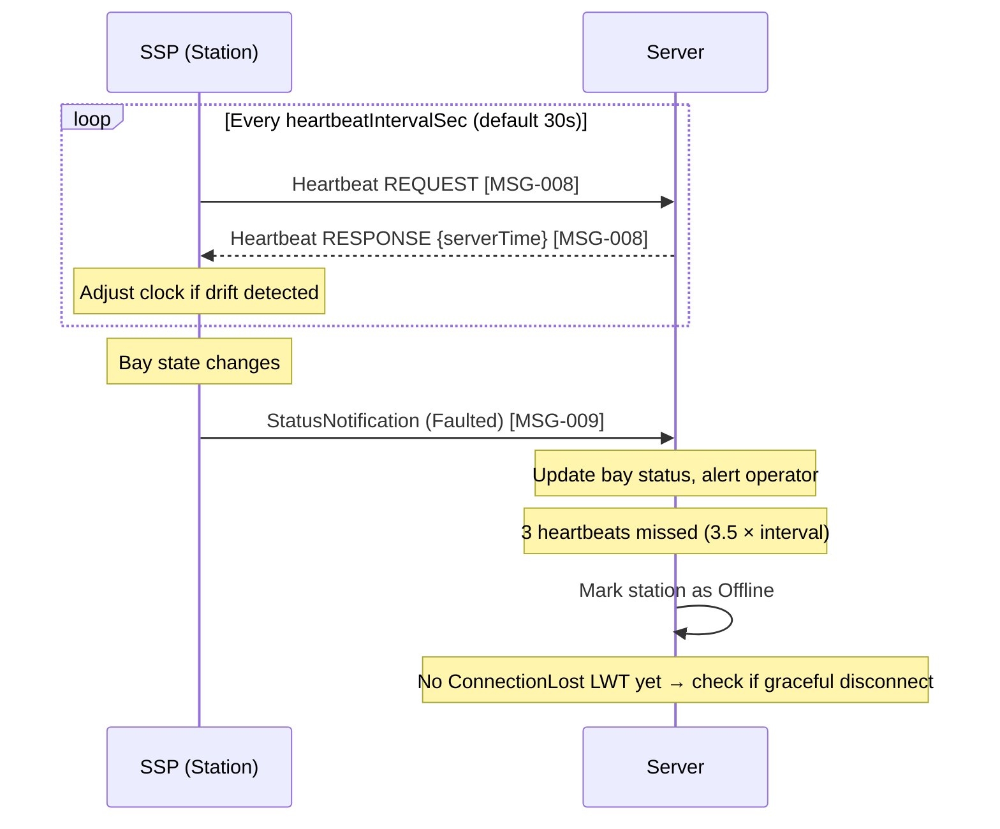
```mermaid
sequenceDiagram
    participant SSP as SSP (Station)
    participant Server

    loop Every heartbeatIntervalSec (default 30s)
        SSP->>Server: Heartbeat REQUEST [MSG-008]
        Server-->>SSP: Heartbeat RESPONSE {serverTime} [MSG-008]
        Note over SSP: Adjust clock if drift detected
    end

    Note over SSP: Bay state changes

    SSP->>Server: StatusNotification (Faulted) [MSG-009]
    Note over Server: Update bay status, alert operator

    Note over Server: 3 heartbeats missed (3.5 × interval)

    Server->>Server: Mark station as Offline
    Note over Server: No ConnectionLost LWT yet → check if graceful disconnect
```

### Happy Path

1. **SSP** sends **Heartbeat REQUEST** [MSG-008] every `heartbeatIntervalSec` seconds (default: 30)
2. **Server** responds with **Heartbeat RESPONSE** [MSG-008] containing `serverTime`
3. **SSP** compares `serverTime` with local clock; if drift exceeds threshold, adjusts clock
4. **Server** records last heartbeat timestamp per station

### Station Offline Detection

The Server MUST track the last heartbeat time for each station. Offline detection logic:

| Condition | Server Action |
|-----------|---------------|
| 1 missed heartbeat | No action (network jitter) |
| 2 missed heartbeats | Mark station as `degraded` (internal) |
| 3+ missed heartbeats (`heartbeatIntervalSec * 3.5` elapsed) | Mark station as `Offline` |
| ConnectionLost LWT [MSG-011] received | Immediately mark as `Offline` |
| Station sends BootNotification [MSG-001] | Mark as `Online`, process boot sequence |

### Postconditions

| Component | State |
|-----------|-------|
| SSP Clock | Synchronized with server (±1 second) |
| Server | Station online status confirmed, last heartbeat time updated |

---

## 9. Error Recovery & Reconnection

**Description:** When the MQTT connection drops, the station continues active sessions, buffers events, and attempts to reconnect with exponential backoff. On reconnection, it re-registers with the server.

### Preconditions

- Station was previously connected (boot accepted)
- MQTT connection has been lost (TCP disconnect, broker failure, network outage)

### Sequence Diagram

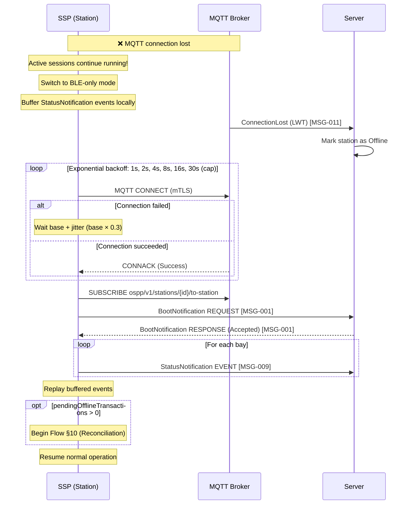
```mermaid
sequenceDiagram
    participant SSP as SSP (Station)
    participant Broker as MQTT Broker
    participant Server

    Note over SSP,Broker: ❌ MQTT connection lost

    Note over SSP: Active sessions continue running!
    Note over SSP: Switch to BLE-only mode
    Note over SSP: Buffer StatusNotification events locally

    Broker->>Server: ConnectionLost (LWT) [MSG-011]
    Server->>Server: Mark station as Offline

    loop Exponential backoff: 1s, 2s, 4s, 8s, 16s, 30s (cap)
        SSP->>Broker: MQTT CONNECT (mTLS)
        alt Connection failed
            Note over SSP: Wait base + jitter (base × 0.3)
        else Connection succeeded
            Broker-->>SSP: CONNACK (Success)
        end
    end

    SSP->>Broker: SUBSCRIBE ospp/v1/stations/{id}/to-station
    SSP->>Server: BootNotification REQUEST [MSG-001]
    Server-->>SSP: BootNotification RESPONSE (Accepted) [MSG-001]

    loop For each bay
        SSP->>Server: StatusNotification EVENT [MSG-009]
    end

    Note over SSP: Replay buffered events

    opt pendingOfflineTransactions > 0
        Note over SSP: Begin Flow §10 (Reconciliation)
    end

    Note over SSP: Resume normal operation
```

### Happy Path

1. MQTT connection drops (TCP reset, broker crash, network outage)
2. **SSP** immediately takes these actions:
   - **Active sessions continue running** — the station MUST NOT stop a service due to connectivity loss
   - Switch to BLE-only mode for new sessions (if BLE is enabled)
   - Buffer all StatusNotification and MeterValues events locally
3. **Broker** publishes the pre-configured **ConnectionLost** [MSG-011] LWT to the station's `to-server` topic
4. **Server** receives the LWT and marks the station as `Offline`
5. **SSP** begins reconnection with exponential backoff:
   - Delays: 1s, 2s, 4s, 8s, 16s, 30s (cap)
   - Jitter: `actual_delay = base + random(0, base × 0.3)`
   - Each attempt: full MQTT CONNECT with mTLS
6. On successful CONNACK, SSP subscribes to its `to-station` topic
7. **SSP** sends **BootNotification REQUEST** [MSG-001] (same as fresh boot)
8. **Server** accepts the boot, marks station as `Online`, returns session key
9. **SSP** sends **StatusNotification** [MSG-009] for each bay (current status, which may include sessions that completed during offline)
10. **SSP** replays any buffered events
11. If `pendingOfflineTransactions > 0`, SSP begins [Offline → Online Reconciliation (Flow §10)](#10-offline--online-reconciliation)
12. Resume normal operation (heartbeat, command processing)

### Error Paths

| Condition | Action |
|-----------|--------|
| All backoff attempts fail (30s cap reached) | Continue retrying every 30s + jitter indefinitely |
| TLS certificate expired during outage | SSP cannot reconnect — await manual certificate update |
| Broker permanently unavailable | SSP operates in BLE-only mode indefinitely |
| BootNotification `Rejected` after reconnect | SSP may have been decommissioned — await intervention |
| Session completed during offline | SSP reports final status via StatusNotification post-boot |

### Postconditions

| Component | State |
|-----------|-------|
| SSP | Reconnected, boot accepted, normal operation |
| Server | Station marked online, bay statuses updated, buffered events processed |
| Sessions (if any were active during outage) | Statuses reconciled via StatusNotification |

---

## 10. Offline → Online Reconciliation

**Description:** When a station that served offline transactions regains MQTT connectivity, it sends each offline transaction to the server for reconciliation, credit deduction, and fraud scoring.

### Preconditions

- Station has reconnected to MQTT (BootNotification `Accepted`)
- Station has `pendingOfflineTransactions > 0`
- Post-boot StatusNotification per bay has been sent

### Sequence Diagram

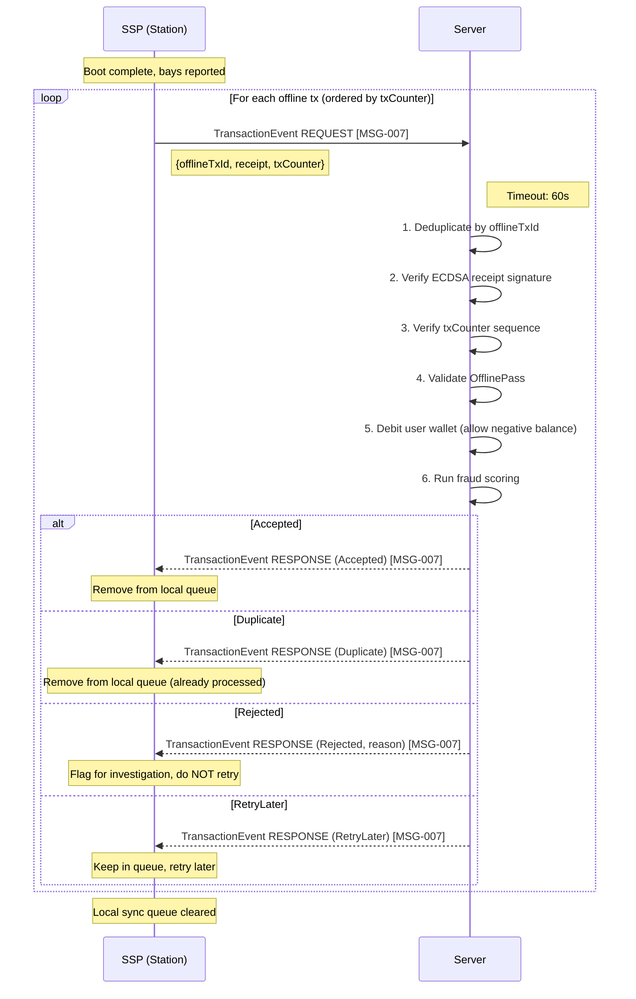
```mermaid
sequenceDiagram
    participant SSP as SSP (Station)
    participant Server

    Note over SSP: Boot complete, bays reported

    loop For each offline tx (ordered by txCounter)
        SSP->>Server: TransactionEvent REQUEST [MSG-007]
        Note right of SSP: {offlineTxId, receipt, txCounter}
        Note right of Server: Timeout: 60s

        Server->>Server: 1. Deduplicate by offlineTxId
        Server->>Server: 2. Verify ECDSA receipt signature
        Server->>Server: 3. Verify txCounter sequence
        Server->>Server: 4. Validate OfflinePass
        Server->>Server: 5. Debit user wallet (allow negative balance)
        Server->>Server: 6. Run fraud scoring

        alt Accepted
            Server-->>SSP: TransactionEvent RESPONSE (Accepted) [MSG-007]
            Note over SSP: Remove from local queue
        else Duplicate
            Server-->>SSP: TransactionEvent RESPONSE (Duplicate) [MSG-007]
            Note over SSP: Remove from local queue (already processed)
        else Rejected
            Server-->>SSP: TransactionEvent RESPONSE (Rejected, reason) [MSG-007]
            Note over SSP: Flag for investigation, do NOT retry
        else RetryLater
            Server-->>SSP: TransactionEvent RESPONSE (RetryLater) [MSG-007]
            Note over SSP: Keep in queue, retry later
        end
    end

    Note over SSP: Local sync queue cleared
```

### Happy Path

1. SSP boot is complete; all bays have been reported via StatusNotification [MSG-009]
2. SSP begins sending offline transactions **in order of `txCounter`** (ascending)
3. For each transaction, SSP sends **TransactionEvent REQUEST** [MSG-007] containing the full transaction data, signed receipt, `txCounter`, and meter values
4. SSP waits for the RESPONSE before sending the next transaction (sequential processing preserves `txCounter` order)
5. **Server** processes each transaction:
   - **Step 1:** Deduplicate by `offlineTxId` (if already seen → `Duplicate`)
   - **Step 2:** Verify ECDSA P-256 receipt signature — CRITICAL alert if invalid
   - **Step 3:** Verify `txCounter` sequence (monotonically increasing, no gaps) — WARNING if gap detected, process anyway
   - **Step 4:** Validate that the OfflinePass was valid at transaction time (check epoch, expiry, limits)
   - **Step 5:** Debit user wallet (allow negative balance for offline transactions)
   - **Step 6:** Run fraud scoring (see below)
   - **Step 7:** Create session record
6. Server responds `Accepted`
7. SSP removes the transaction from its local queue
8. Repeat for all pending transactions
9. When all transactions are processed, SSP clears its local sync queue

### Fraud Scoring

The server computes a fraud score (`0.00`–`1.00`) for each offline transaction. The factor list, the **cross-station cumulative** `maxUses` / `maxTotalCredits` computation (finding N7), and the threshold→action bands are defined authoritatively in [06-security.md §7.4](06-security.md#74-fraud-detection--offline-transactions). This flow does not restate them — finding F3: §7.4 is the single source; this section and `profiles/offline/reconciliation.md` §7 are pointers.

### App-Side Reconciliation (Backup)

When the mobile app regains connectivity, it SHOULD also sync its offline transaction log:

1. App calls `POST /me/offline-txs` with its locally stored receipts
2. Server deduplicates against transactions already received from the station
3. This serves as a **backup reconciliation path** in case the station's sync fails

### Postconditions

| Component | State |
|-----------|-------|
| SSP Offline Queue | Empty (all transactions synced) |
| Server | Session records created, user wallets debited |
| User Wallets | Debited (may be negative for high-fraud-score transactions) |
| Fraud Alerts | Generated for scores >= 0.30 |

---

## 11. Firmware Update

**Description:** The server pushes a firmware update to the station via MQTT. The station downloads the binary, installs it on the inactive A/B partition, and reboots. On failure, automatic rollback occurs.

### Preconditions

- Station is online (MQTT connected, boot accepted)
- No other long-running operation in progress (firmware update, diagnostics upload)
- Firmware binary is available at the specified HTTPS URL

### Sequence Diagram

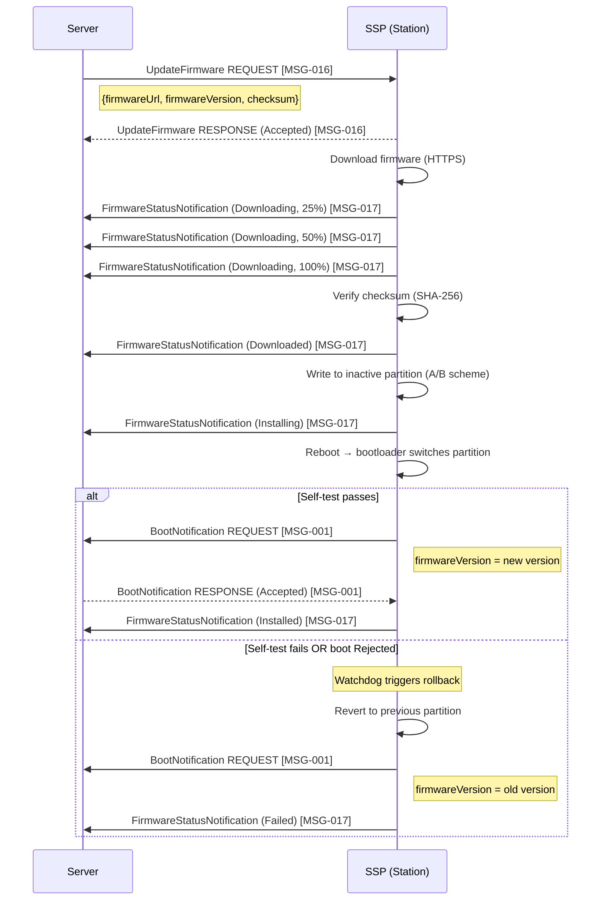
```mermaid
sequenceDiagram
    participant Server
    participant SSP as SSP (Station)

    Server->>SSP: UpdateFirmware REQUEST [MSG-016]
    Note right of Server: {firmwareUrl, firmwareVersion, checksum}
    SSP-->>Server: UpdateFirmware RESPONSE (Accepted) [MSG-016]

    SSP->>SSP: Download firmware (HTTPS)
    SSP->>Server: FirmwareStatusNotification (Downloading, 25%) [MSG-017]
    SSP->>Server: FirmwareStatusNotification (Downloading, 50%) [MSG-017]
    SSP->>Server: FirmwareStatusNotification (Downloading, 100%) [MSG-017]

    SSP->>SSP: Verify checksum (SHA-256)
    SSP->>Server: FirmwareStatusNotification (Downloaded) [MSG-017]

    SSP->>SSP: Write to inactive partition (A/B scheme)
    SSP->>Server: FirmwareStatusNotification (Installing) [MSG-017]

    SSP->>SSP: Reboot → bootloader switches partition

    alt Self-test passes
        SSP->>Server: BootNotification REQUEST [MSG-001]
        Note right of SSP: firmwareVersion = new version
        Server-->>SSP: BootNotification RESPONSE (Accepted) [MSG-001]
        SSP->>Server: FirmwareStatusNotification (Installed) [MSG-017]
    else Self-test fails OR boot Rejected
        Note over SSP: Watchdog triggers rollback
        SSP->>SSP: Revert to previous partition
        SSP->>Server: BootNotification REQUEST [MSG-001]
        Note right of SSP: firmwareVersion = old version
        SSP->>Server: FirmwareStatusNotification (Failed) [MSG-017]
    end
```

### Happy Path

1. **Server** sends **UpdateFirmware REQUEST** [MSG-016] with `firmwareUrl`, `firmwareVersion`, and `checksum` (SHA-256)
2. **SSP** validates the request (no other operation in progress, sufficient storage), responds `Accepted`
3. **SSP** downloads the firmware binary via HTTPS
4. **SSP** sends periodic **FirmwareStatusNotification** [MSG-017] `Downloading` with progress %
5. **SSP** verifies the SHA-256 checksum — sends `Downloaded` status
6. **SSP** writes firmware to the inactive A/B partition — sends `Installing` status
7. **SSP** reboots; bootloader switches to the new partition
8. New firmware runs self-test
9. **SSP** sends **BootNotification** [MSG-001] with the new `firmwareVersion`
10. **Server** accepts the boot — firmware update is confirmed
11. **SSP** sends **FirmwareStatusNotification** [MSG-017] `Installed`

### Error Paths

| Step | Error | Action |
|:----:|-------|--------|
| 2 | `5107 OPERATION_IN_PROGRESS` | SSP rejects — retry later |
| 2 | `5103 STORAGE_ERROR` | SSP rejects — insufficient space |
| 3 | Download fails / `1011 URL_UNREACHABLE` | SSP sends `Failed`, no partition change |
| 5 | Checksum mismatch | SSP sends `Failed`, discards download |
| 8 | Self-test fails | Watchdog triggers → rollback to previous partition → boot with old version |
| 9 | BootNotification `Rejected` (new version) | Rollback to previous partition |

### Postconditions (Success)

| Component | State |
|-----------|-------|
| SSP | Running new firmware, boot accepted |
| SSP Inactive Partition | Contains previous firmware (rollback target) |
| Server | Station firmware version updated in records |

### Postconditions (Failure / Rollback)

| Component | State |
|-----------|-------|
| SSP | Running previous firmware (rollback successful) |
| Server | Firmware update flagged as failed, alert generated |

---

## 12. Configuration Change & Maintenance

**Description:** Administrative operations for remotely configuring the station, enabling maintenance mode, and retrieving diagnostics.

### 12.1 Configuration Change

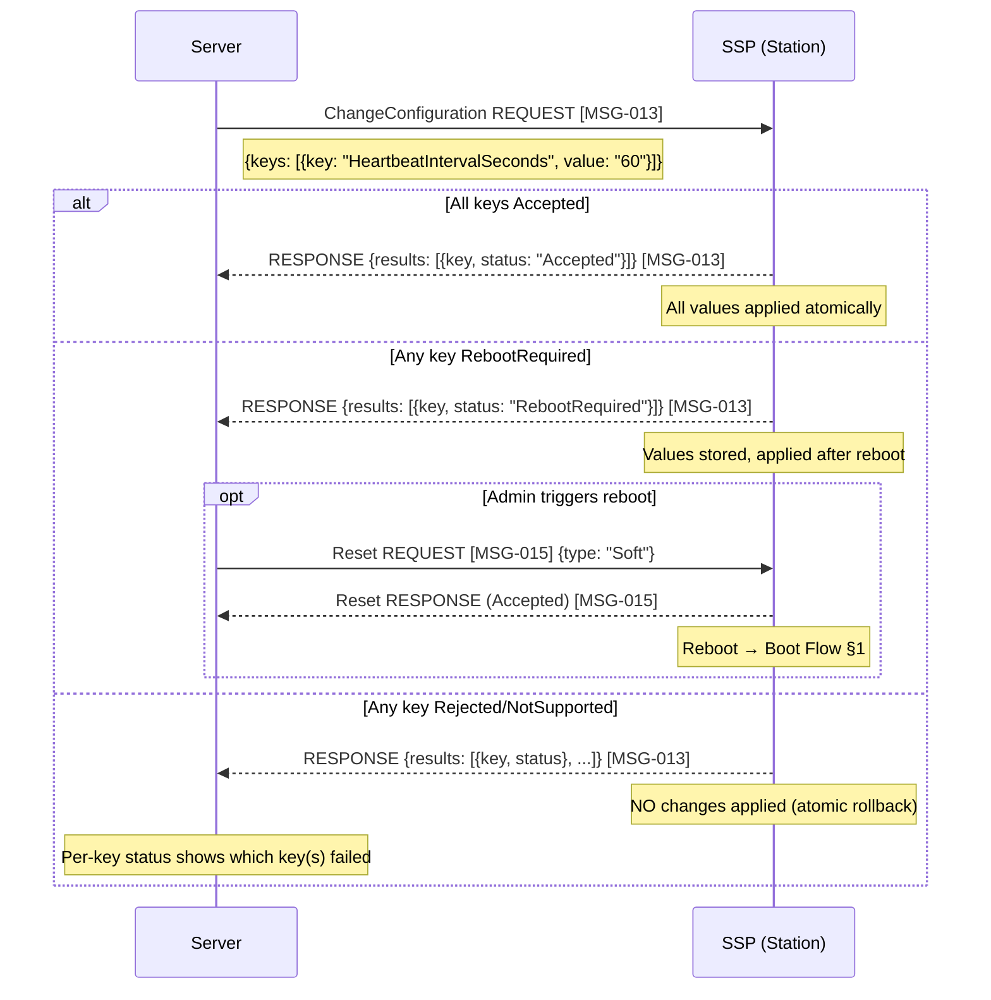
```mermaid
sequenceDiagram
    participant Server
    participant SSP as SSP (Station)

    Server->>SSP: ChangeConfiguration REQUEST [MSG-013]
    Note right of Server: {keys: [{key: "HeartbeatIntervalSeconds", value: "60"}]}

    alt All keys Accepted
        SSP-->>Server: RESPONSE {results: [{key, status: "Accepted"}]} [MSG-013]
        Note over SSP: All values applied atomically
    else Any key RebootRequired
        SSP-->>Server: RESPONSE {results: [{key, status: "RebootRequired"}]} [MSG-013]
        Note over SSP: Values stored, applied after reboot
        opt Admin triggers reboot
            Server->>SSP: Reset REQUEST [MSG-015] {type: "Soft"}
            SSP-->>Server: Reset RESPONSE (Accepted) [MSG-015]
            Note over SSP: Reboot → Boot Flow §1
        end
    else Any key Rejected/NotSupported
        SSP-->>Server: RESPONSE {results: [{key, status}, ...]} [MSG-013]
        Note over SSP: NO changes applied (atomic rollback)
        Note over Server: Per-key status shows which key(s) failed
    end
```

#### Steps

1. **Server** sends **ChangeConfiguration REQUEST** [MSG-013] with `keys` array (1–20 key-value pairs)
2. **SSP** validates ALL key names, parses values, checks constraints for the entire batch
3. If ANY key would be `Rejected` or `NotSupported`, the station applies NONE (atomic all-or-nothing)
4. **SSP** responds with `results` array containing per-key status in the same order as the request
5. If any key returns `RebootRequired`, the admin MAY follow up with a **Reset** [MSG-015] to apply the change

### 12.2 Maintenance Mode

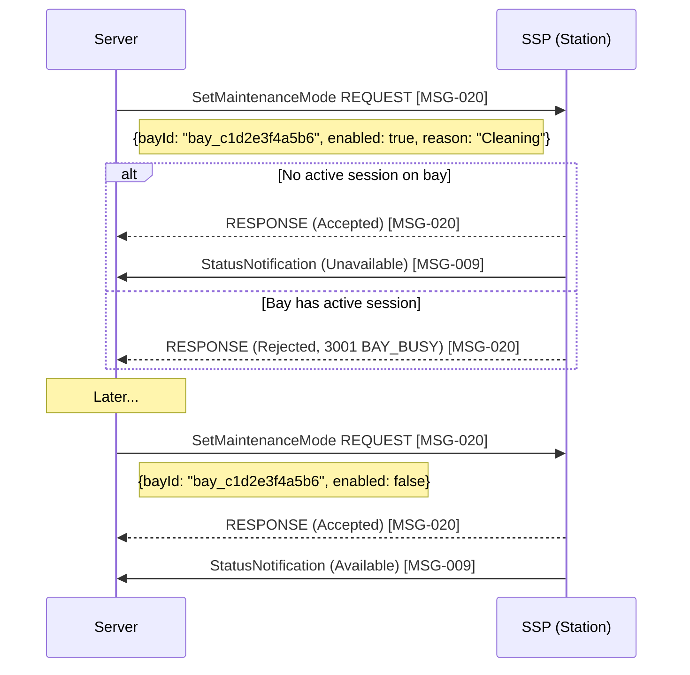
```mermaid
sequenceDiagram
    participant Server
    participant SSP as SSP (Station)

    Server->>SSP: SetMaintenanceMode REQUEST [MSG-020]
    Note right of Server: {bayId: "bay_c1d2e3f4a5b6", enabled: true, reason: "Cleaning"}

    alt No active session on bay
        SSP-->>Server: RESPONSE (Accepted) [MSG-020]
        SSP->>Server: StatusNotification (Unavailable) [MSG-009]
    else Bay has active session
        SSP-->>Server: RESPONSE (Rejected, 3001 BAY_BUSY) [MSG-020]
    end

    Note over Server: Later...

    Server->>SSP: SetMaintenanceMode REQUEST [MSG-020]
    Note right of Server: {bayId: "bay_c1d2e3f4a5b6", enabled: false}
    SSP-->>Server: RESPONSE (Accepted) [MSG-020]
    SSP->>Server: StatusNotification (Available) [MSG-009]
```

#### Steps

1. **Server** sends **SetMaintenanceMode REQUEST** [MSG-020] with `bayId` (or all bays if absent), `enabled: true`, and optional `reason`
2. **SSP** checks if the bay has an active session — if yes, rejects with `3001 BAY_BUSY`
3. **SSP** transitions bay to `Unavailable`, sends **StatusNotification** [MSG-009]
4. To exit maintenance: Server sends the same message with `enabled: false`
5. **SSP** transitions bay to `Available`, sends **StatusNotification** [MSG-009]

### 12.3 Diagnostics Retrieval

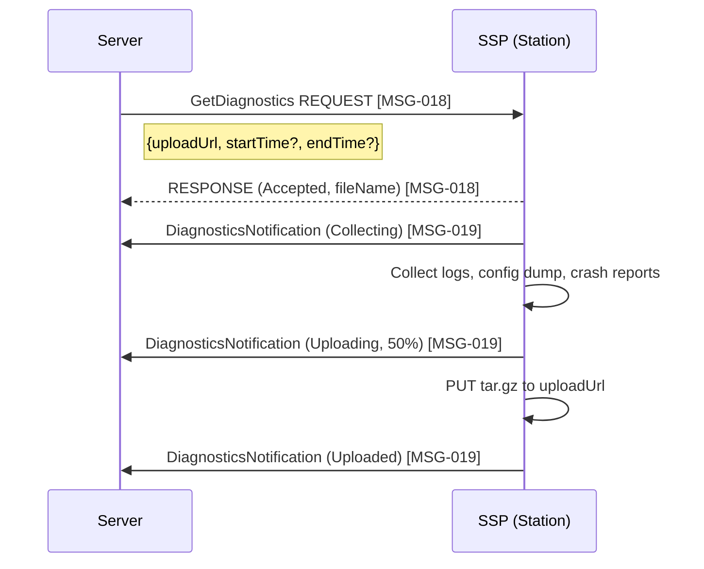
```mermaid
sequenceDiagram
    participant Server
    participant SSP as SSP (Station)

    Server->>SSP: GetDiagnostics REQUEST [MSG-018]
    Note right of Server: {uploadUrl, startTime?, endTime?}
    SSP-->>Server: RESPONSE (Accepted, fileName) [MSG-018]

    SSP->>Server: DiagnosticsNotification (Collecting) [MSG-019]
    SSP->>SSP: Collect logs, config dump, crash reports
    SSP->>Server: DiagnosticsNotification (Uploading, 50%) [MSG-019]
    SSP->>SSP: PUT tar.gz to uploadUrl
    SSP->>Server: DiagnosticsNotification (Uploaded) [MSG-019]
```

#### Steps

1. **Server** sends **GetDiagnostics REQUEST** [MSG-018] with `uploadUrl` and optional time range
2. **SSP** accepts, returns the diagnostic archive file name
3. **SSP** collects logs, configuration dump, and crash reports into a `tar.gz` archive
4. **SSP** sends **DiagnosticsNotification** [MSG-019] progress events (`Collecting` → `Uploading` → `Uploaded`)
5. **SSP** uploads the archive via HTTPS PUT to the `uploadUrl`
6. On failure, SSP sends `Failed` status with error description

### 12.4 Service Catalog Update

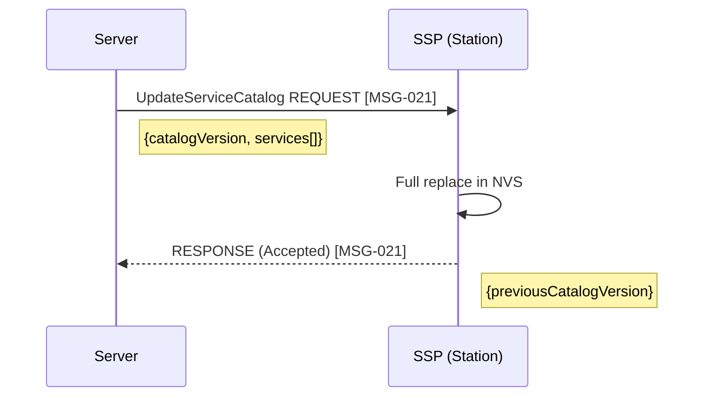
```mermaid
sequenceDiagram
    participant Server
    participant SSP as SSP (Station)

    Server->>SSP: UpdateServiceCatalog REQUEST [MSG-021]
    Note right of Server: {catalogVersion, services[]}
    SSP->>SSP: Full replace in NVS
    SSP-->>Server: RESPONSE (Accepted) [MSG-021]
    Note right of SSP: {previousCatalogVersion}
```

#### Steps

1. **Server** sends **UpdateServiceCatalog REQUEST** [MSG-021] with `catalogVersion` and complete `services[]` array
2. **SSP** performs a **full replacement** of the service catalog in NVS (not a merge)
3. **SSP** responds `Accepted` with the `previousCatalogVersion`
4. New prices and service availability take effect immediately for BLE (FFF2 updated) and future sessions

---

## 13. Certificate Renewal

### 13.1 Automatic Renewal (Station-Initiated)

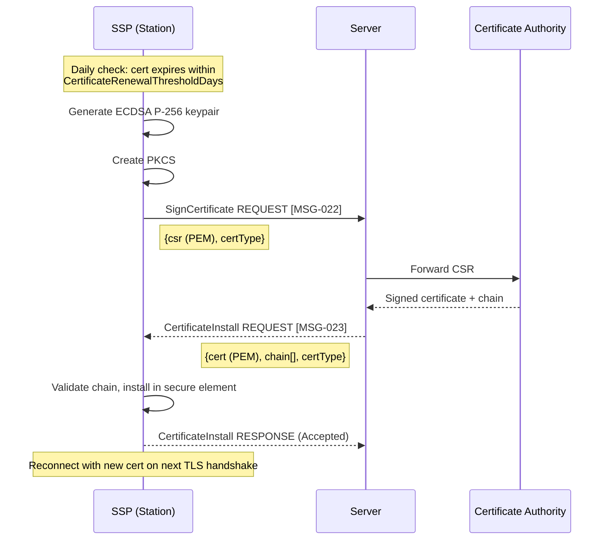
```mermaid
sequenceDiagram
    participant SSP as SSP (Station)
    participant Server
    participant CA as Certificate Authority

    Note over SSP: Daily check: cert expires within<br/>CertificateRenewalThresholdDays

    SSP->>SSP: Generate ECDSA P-256 keypair
    SSP->>SSP: Create PKCS#10 CSR (CN=stn_{id})
    SSP->>Server: SignCertificate REQUEST [MSG-022]
    Note right of SSP: {csr (PEM), certType}
    Server->>CA: Forward CSR
    CA-->>Server: Signed certificate + chain
    Server-->>SSP: CertificateInstall REQUEST [MSG-023]
    Note left of Server: {cert (PEM), chain[], certType}
    SSP->>SSP: Validate chain, install in secure element
    SSP-->>Server: CertificateInstall RESPONSE (Accepted)
    Note over SSP: Reconnect with new cert on next TLS handshake
```

#### Steps

1. **Station** detects its certificate is within `CertificateRenewalThresholdDays` of expiry (daily check)
2. **Station** generates a new ECDSA P-256 keypair on-device (private key never leaves the station)
3. **Station** creates a PKCS#10 CSR with `CN=stn_{stationId}` and sends **SignCertificate REQUEST** [MSG-022]
4. **Server** validates the CSR and forwards it to the Certificate Authority
5. **CA** signs the certificate and returns it with the chain
6. **Server** sends **CertificateInstall REQUEST** [MSG-023] with the signed certificate and chain
7. **Station** validates the certificate chain against its trust store, installs the certificate in the secure element
8. **Station** responds `Accepted` and uses the new certificate on the next TLS reconnection

### 13.2 Server-Triggered Renewal

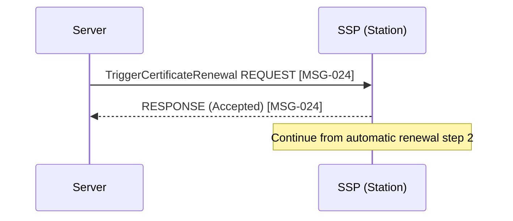
```mermaid
sequenceDiagram
    participant Server
    participant SSP as SSP (Station)

    Server->>SSP: TriggerCertificateRenewal REQUEST [MSG-024]
    SSP-->>Server: RESPONSE (Accepted) [MSG-024]
    Note over SSP: Continue from automatic renewal step 2
```

1. **Server** sends **TriggerCertificateRenewal REQUEST** [MSG-024] (e.g., proactive rotation, CA policy change)
2. **Station** responds `Accepted`
3. Flow continues from step 2 of §13.1 (generate keypair → CSR → install)

For detailed lifecycle phases, emergency thresholds, error handling, and retry logic, see [Chapter 06 — Security](06-security.md), §4.7 Certificate Lifecycle Management.

---

## Appendix A — Timeout Reference

Consolidated timeout values across all flows:

| Phase / Operation | Timeout | On Timeout |
|-------------------|--------:|------------|
| MQTT CONNECT | 10s | Reconnect with backoff |
| BootNotification | 30s | Wait 60s, retry |
| Heartbeat | 30s | Log, continue |
| Offline detection | 3.5 × heartbeatIntervalSec | Mark station offline |
| ReserveBay | 5s | Session → failed |
| Reserved → 3DS (web) | 3 min | CancelReservation |
| Reserved → start (mobile) | 30s | CancelReservation |
| StartService (pending_ack) | 10s | Refund, session → failed |
| StopService (stopping) | 10s | Session → failed |
| Active session (max) | durationSeconds | Station auto-stops |
| Session token (web) | 10 min | Session expired |
| BayLock fallback | 3 min | Auto-released |
| PaymentIntent pending | 5 min | Marked expired |
| BLE scan | 10-30s | Return to IDLE |
| BLE handshake step | 10s | ERROR state |
| AuthorizeOfflinePass | 15s | Fallback to local validation |
| TransactionEvent | 60s | Retry later |
| ChangeConfiguration | 60s | Log failure |
| GetConfiguration | 30s | Log failure |
| Reset | 30s | Log failure |
| UpdateFirmware | 300s | Log failure |
| GetDiagnostics | 300s | Log failure |
| SetMaintenanceMode | 30s | Log failure |
| UpdateServiceCatalog | 30s | Retry once after 10s (boot only) |
| DataTransfer | 30s | Log warning, MAY retry |
| TriggerMessage | 10s | Log warning |
| SignCertificate | 30s | Retry per §4.7 |
| CertificateInstall | 30s | Log failure |
| TriggerCertificateRenewal | 10s | Log failure |

---

## Appendix B — Retry Policy Reference

| Operation | Strategy | Max Attempts | Delays |
|-----------|----------|:------------:|--------|
| MQTT reconnect | Exponential backoff + jitter | Infinite | 1s, 2s, 4s, 8s, 16s, 30s cap |
| BootNotification (rejected) | Fixed interval | Infinite | `retryInterval` from response |
| BootNotification (timeout) | Fixed interval | Infinite | 60s |
| StartService (web payment) | Fixed delays | 4 | 0s, +5s, +10s, +15s |
| StartService (mobile app) | Single attempt | 1 | — |
| UpdateServiceCatalog (boot) | Single retry | 2 | 10s |
| Payment processor API | Exponential backoff | 3 | 1s, 2s, 4s |
| BLE connect | Exponential backoff | 3 | 1s, 2s, 4s |
| TransactionEvent (RetryLater) | Server-directed | Varies | Wait `retryInterval` |

---

## Appendix C — State Transitions per Flow

Summary of state machine transitions triggered by each flow (see [Chapter 05 — State Machines](05-state-machines.md) for full state machine definitions):

### Bay State Transitions

| Flow | Transition |
|------|------------|
| Boot (§1) | → reported state (Available, Faulted, Unavailable) |
| Online Session (§3) | Available → Reserved* → Occupied → Finishing → Available |
| Web Payment (§4) | Available → Reserved → Occupied → Finishing → Available |
| BLE Session (§5a/b/c) | Available → Occupied → Finishing → Available |
| Session Stop (§6) | Occupied → Finishing → Available |
| Error during session | Occupied → Faulted |
| Maintenance (§12.2) | Available ↔ Unavailable |
| Error resolved | Faulted → Available |

*Reserved step is optional for mobile app sessions.

### Session State Transitions

| Flow | Transition |
|------|------------|
| Online Session (§3) | idle → pending_ack → active → stopping → completed |
| Web Payment (§4) | idle → reserving → reserved → pending_ack → active → completed |
| Timeout/failure | Any pending state → failed |

### PaymentIntent State Transitions (Web Payment)

| Flow | Transition |
|------|------------|
| Web Payment (§4) | created → pending → processing → authorized → captured → settled |
| Payment cancelled | pending → cancelled |
| Payment expired | pending → expired |
| Refund | captured/settled → refunded |
