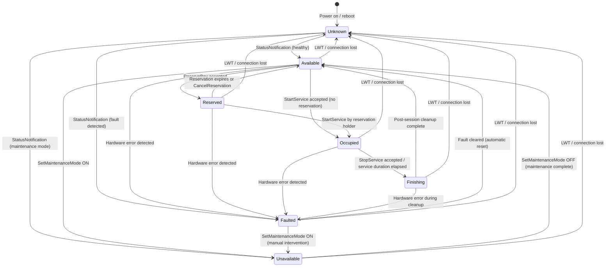
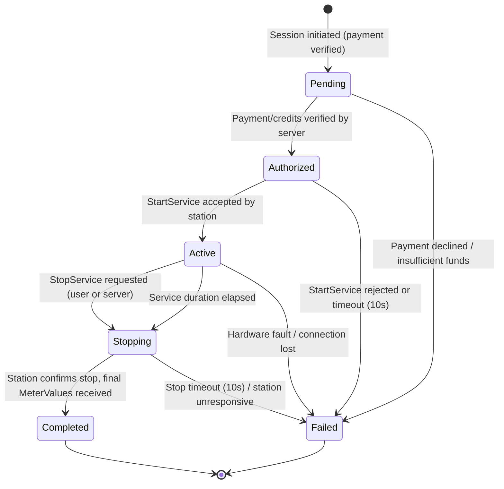
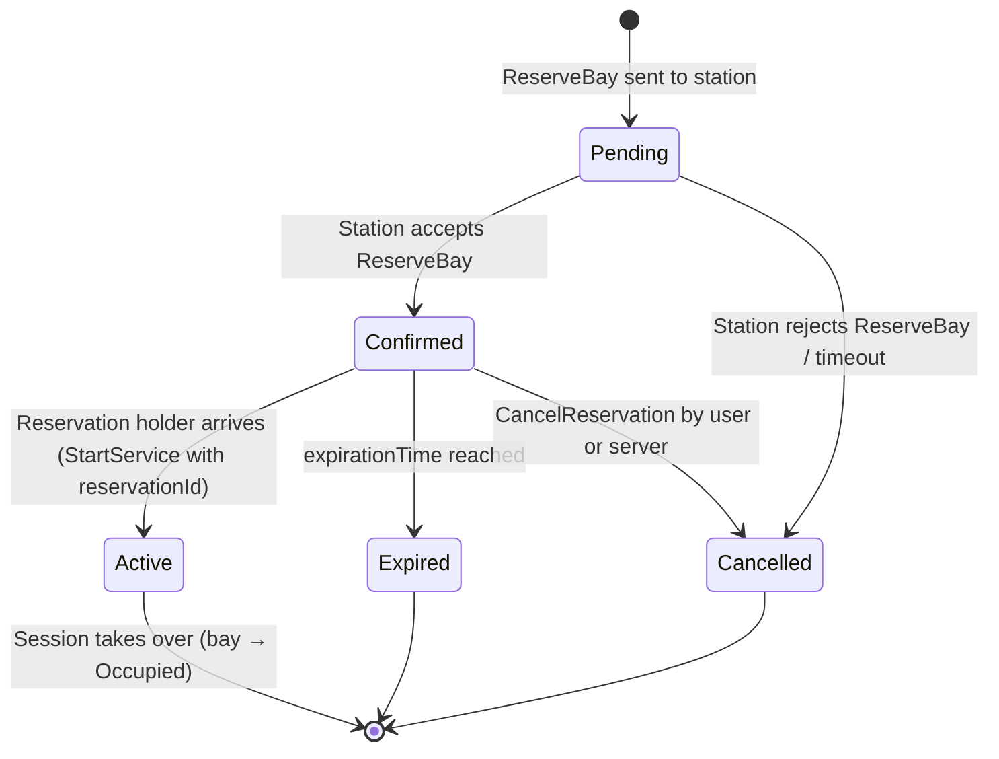
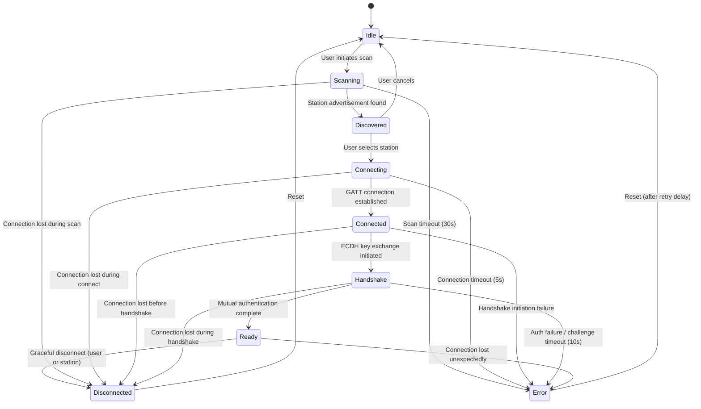
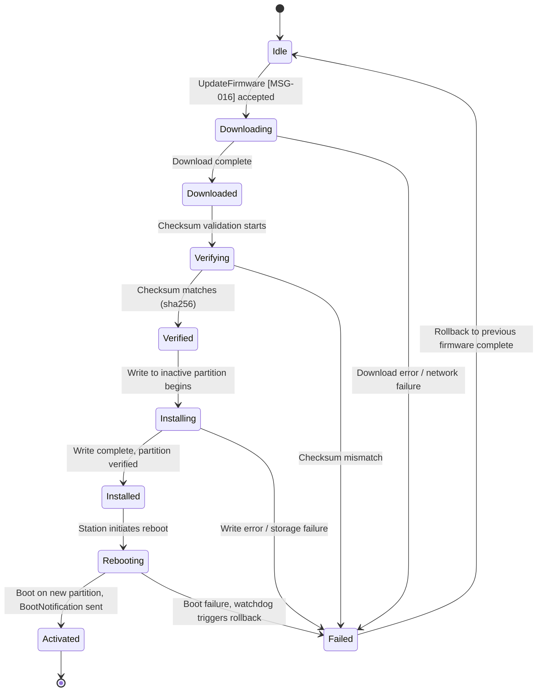

# Chapter 05 — State Machines

> **Status:** Draft | **OSPP Version:** 0.1.0-draft.1

This chapter defines all finite state machines (FSMs) governing OSPP entities. Each FSM specifies the complete set of states, valid transitions, guards, actions, and a Mermaid diagram. Implementations MUST enforce these state machines; any transition not explicitly listed here is invalid and MUST be rejected.

The keywords **MUST**, **MUST NOT**, **REQUIRED**, **SHALL**, **SHALL NOT**, **SHOULD**, **SHOULD NOT**, **RECOMMENDED**, **MAY**, and **OPTIONAL** in this document are to be interpreted as described in [RFC 2119](https://www.rfc-editor.org/rfc/rfc2119) and [RFC 8174](https://www.rfc-editor.org/rfc/rfc8174).

For message references, see [Chapter 03 — Message Catalog](03-messages.md). Messages are referenced as **[MSG-XXX]**. For flow references, see [Chapter 04 -- Flows](04-flows.md). For error codes, see [Chapter 07 — Error Codes & Resilience](07-errors.md).

---

## 1. Bay State Machine

The bay state machine governs the operational status of each physical service bay on a station. Every bay MUST be in exactly one of the seven defined states at all times. The station MUST send a StatusNotification [MSG-009] on every state transition.

### 1.1 State Diagram

### 1.2 States (7)

| State | Description |
|-------|-------------|
| **Available** | Bay is idle and ready to accept a session or reservation. All hardware subsystems are operational. |
| **Reserved** | Bay is reserved for a specific user via ReserveBay [MSG-003]. A countdown timer is active; the bay MUST reject StartService from any session other than the reservation holder. |
| **Occupied** | A session is active on the bay. The station is delivering the requested service and sending periodic MeterValues [MSG-010]. |
| **Finishing** | The session has ended (via StopService or duration elapsed). The station is performing post-session hardware wind-down (depressurization, actuator retraction, etc.). |
| **Faulted** | The bay has encountered a hardware or software fault. The station MUST include `errorCode` and `errorText` in the StatusNotification. The bay MUST NOT accept StartService or ReserveBay while faulted. |
| **Unavailable** | The bay is administratively disabled or under maintenance. Entered via SetMaintenanceMode [MSG-020] or as a consequence of a fault requiring manual intervention. |
| **Unknown** | The bay state is indeterminate. This is the initial state after station power-on or reboot, and the state the server transitions to when it receives a ConnectionLost [MSG-011] (LWT). The station MUST resolve this state by sending a StatusNotification on boot. |

### 1.3 Transition Table

| Trigger | From | To | Condition | Action |
|---------|------|----|-----------|--------|
| StatusNotification (healthy) | Unknown | Available | Bay hardware passes self-test | Station sends StatusNotification [MSG-009] with bay layout and services |
| StatusNotification (fault) | Unknown | Faulted | Bay hardware fails self-test | Station sends StatusNotification with `errorCode` |
| StatusNotification (maintenance) | Unknown | Unavailable | Bay was in maintenance before reboot | Station sends StatusNotification with `status: "Unavailable"` |
| ReserveBay [MSG-003] accepted | Available | Reserved | Bay has no active session or existing reservation | Station starts reservation expiry timer, sends StatusNotification |
| StartService [MSG-005] accepted (no reservation) | Available | Occupied | Bay has no reservation conflict; hardware activates successfully | Station activates hardware, starts session timer, sends StatusNotification |
| StartService [MSG-005] by reservation holder | Reserved | Occupied | `reservationId` matches the active reservation; within TTL | Station consumes reservation, activates hardware, sends StatusNotification |
| Reservation expires | Reserved | Available | `expirationTime` reached without StartService | Station releases bay, sends StatusNotification |
| CancelReservation [MSG-004] accepted | Reserved | Available | Valid `reservationId` matches active reservation | Station releases bay, sends StatusNotification |
| StopService [MSG-006] accepted | Occupied | Finishing | Session is active on this bay | Station begins hardware wind-down, sends StatusNotification |
| Service duration elapsed | Occupied | Finishing | `durationSeconds` timer expires | Station auto-stops service, sends TransactionEvent [MSG-007] `Ended`, sends StatusNotification |
| Post-session cleanup complete | Finishing | Available | Hardware wind-down finished (hardware off, actuator retracted) | Station sends StatusNotification; bay is ready for next session |
| Hardware error detected | Available, Reserved, Occupied, Finishing | Faulted | Station detects hardware fault (actuator, fluid, consumable, electrical, or emergency stop) | Station sends StatusNotification with `errorCode` (5001-5009); if Occupied, sends TransactionEvent `Ended` with `reason: "fault"` |
| Fault cleared | Faulted | Available | Automatic reset or operator clears fault | Station sends StatusNotification |
| SetMaintenanceMode ON [MSG-020] | Available, Faulted | Unavailable | Operator initiates maintenance | Station sends StatusNotification |
| SetMaintenanceMode OFF [MSG-020] | Unavailable | Available | Operator completes maintenance | Station sends StatusNotification |
| LWT / connection lost | Any except Unknown | Unknown | Broker publishes ConnectionLost [MSG-011] | Server marks bay as Unknown; station resolves via StatusNotification on reconnect |

### 1.4 StatusNotification Triggers

A station MUST send a StatusNotification EVENT [MSG-009] in the following circumstances:

1. **Post-boot report:** One StatusNotification per bay immediately after a successful BootNotification [MSG-001], reporting `bayNumber`, `status`, and available `services[]`.
2. **State transition:** On every bay state transition listed in section 1.3.
3. **Periodic (optional):** If the `StatusNotificationInterval` configuration key is set to a value greater than zero, the station SHOULD send a StatusNotification for each bay at that interval (in seconds) even if the state has not changed.

The station MAY throttle StatusNotification events using the `EventThrottleSeconds` configuration key (minimum interval between same-type events per bay). Default: 0 (no throttle).

### 1.5 Invalid Transitions

Any state transition not explicitly listed in section 1.3 is invalid. If the server receives a StatusNotification with an invalid transition (e.g., `Available` directly to `Finishing`), the server SHOULD log a warning and MAY request a station Reset [MSG-015]. If the station receives a command that would require an invalid transition (e.g., StopService while bay is `Available`), the station MUST reject the command with the appropriate error code from [Chapter 07](07-errors.md) (e.g., `3006 SESSION_NOT_FOUND`).

---

## 2. Session State Machine

The session state machine governs the lifecycle of a single service session from initiation through completion or failure. Sessions are managed primarily by the server, with the station reporting transitions via TransactionEvent [MSG-007] and responding to StartService/StopService commands.

### 2.1 State Diagram

### 2.2 States (6)

| State | Description |
|-------|-------------|
| **Pending** | Session has been initiated by the user (mobile app or web payment). The server is verifying payment authorization or credit balance. |
| **Authorized** | Payment or credits have been verified. The server is sending StartService [MSG-005] to the station and awaiting acknowledgment. |
| **Active** | The station has accepted the StartService command and is delivering the service. MeterValues [MSG-010] are being sent periodically. The session duration timer is running. |
| **Stopping** | A StopService [MSG-006] command has been sent (user-initiated, server-initiated, or duration elapsed). The station is performing hardware wind-down. |
| **Completed** | The session has ended normally. The station has confirmed the stop, final MeterValues have been received, and the receipt has been generated. |
| **Failed** | The session terminated abnormally due to an error, timeout, or fault. The server MUST initiate a refund if payment was collected and no service was delivered. |

### 2.3 Transition Table

| Trigger | From | To | Condition | Action |
|---------|------|----|-----------|--------|
| Session initiated | -- | Pending | User requests session start | Server creates session record, begins payment verification |
| Payment/credits verified | Pending | Authorized | Sufficient balance or payment capture succeeds | Server sends StartService [MSG-005] to station |
| Payment declined | Pending | Failed | Insufficient credits or payment processor rejects | Server notifies user; no refund needed (nothing charged) |
| StartService accepted | Authorized | Active | Station responds with `status: "Accepted"` | Server records session start time, begins MeterValues tracking |
| StartService rejected | Authorized | Failed | Station responds with `status: "Rejected"` or 10s timeout | Server initiates refund, notifies user with error code |
| StopService requested | Active | Stopping | User stops session, server sends StopService, or `durationSeconds` timer elapses | Server sends StopService [MSG-006] to station; if duration elapsed, station auto-transitions |
| Station confirms stop | Stopping | Completed | Station sends TransactionEvent [MSG-007] with final `meterValues` | Server calculates final cost, generates receipt, updates wallet |
| Stop timeout | Stopping | Failed | 10 seconds elapse without station confirmation | Server marks session as failed, initiates partial refund based on last known MeterValues |
| Hardware fault | Active | Failed | Station sends StatusNotification with `Faulted` for the session bay | Server marks session as failed, initiates refund for unused portion |
| Connection lost | Active | Failed | ConnectionLost [MSG-011] received and station does not reconnect within `ConnectionLostGracePeriod` (default: 300s) | Server marks session as failed after grace period; on reconnect, reconciles via TransactionEvent |

### 2.4 Timeouts

| Timeout | Duration | Configurable | Behavior on Expiry |
|---------|----------|:------------:|-------------------|
| Pending acknowledgment | 10 seconds | No | Transition to `Failed`; refund if payment was captured |
| StartService response | 10 seconds (per attempt) | No | Retry per policy (web: up to 4 retries; mobile: single attempt), then transition to `Failed` |
| Maximum session duration | `MaxSessionDurationSeconds` config key (default: 600s) | Yes | Station auto-stops service; session transitions to `Stopping` |
| StopService confirmation | 10 seconds | No | Transition to `Failed`; partial refund based on last MeterValues |
| MeterValues interval | `MeterValuesInterval` config key (default: 15s) | Yes | Station sends MeterValues at this interval; server uses last-known values if a report is missed |
| Session inactivity | `SessionTimeout` config key (see §8 Configuration) | Yes | If no MeterValues or user interaction within the timeout period, session transitions to `Stopping` |
| Connection lost grace | `ConnectionLostGracePeriod` config key (default: 300s) | Yes | If station reconnects within grace period, session continues; otherwise transitions to `Failed` |

---

## 3. Reservation State Machine

The reservation state machine governs the lifecycle of a bay reservation. Reservations hold a bay for a specific user for a limited time, allowing them to arrive and start a session without risk of the bay being taken.

### 3.1 State Diagram

### 3.2 States (5)

| State | Description |
|-------|-------------|
| **Pending** | The server has sent ReserveBay [MSG-003] to the station and is awaiting a response. |
| **Confirmed** | The station has accepted the reservation. The bay is in `Reserved` state and held for the reservation holder. The expiry countdown is active. |
| **Active** | The reservation holder has arrived and sent StartService [MSG-005] with the matching `reservationId`. The reservation is being consumed and the session is starting. |
| **Expired** | The `expirationTime` was reached without the reservation being consumed. The station automatically releases the bay back to `Available`. |
| **Cancelled** | The reservation was explicitly cancelled via CancelReservation [MSG-004], or was rejected by the station at creation time. |

### 3.3 Transition Table

| Trigger | From | To | Condition | Action |
|---------|------|----|-----------|--------|
| ReserveBay [MSG-003] sent | -- | Pending | Server initiates reservation for user | Server creates reservation record with TTL |
| Station accepts | Pending | Confirmed | Station responds `status: "Accepted"` | Bay transitions to `Reserved`; station starts expiry timer; StatusNotification [MSG-009] sent |
| Station rejects or timeout | Pending | Cancelled | Station responds `status: "Rejected"` or 5s timeout | Server notifies user; bay remains unchanged |
| StartService with `reservationId` | Confirmed | Active | `reservationId` matches; reservation is within TTL | Bay transitions to `Occupied`; reservation consumed |
| `expirationTime` reached | Confirmed | Expired | No StartService received before TTL elapses | Station releases bay to `Available`; sends StatusNotification; server marks reservation expired |
| CancelReservation [MSG-004] by user | Confirmed | Cancelled | User cancels from app or web | Station releases bay to `Available`; sends StatusNotification |
| CancelReservation by server | Confirmed | Cancelled | Server cancels (e.g., payment failure, administrative action) | Station releases bay to `Available`; sends StatusNotification |

### 3.4 TTL Behavior

- The default reservation TTL is defined by the `ReservationDefaultTTL` configuration key (default: 180 seconds).
- The `expirationTime` in the ReserveBay request is an absolute ISO 8601 UTC timestamp. The station MUST use this timestamp, not a relative duration, to determine expiry.
- The station MUST automatically release the bay when `expirationTime` is reached, transitioning it back to `Available` and sending a StatusNotification.
- The server SHOULD send a CancelReservation if it determines the reservation should end before `expirationTime` (e.g., user cancels, payment fails).

### 3.5 Conversion to Session

When the reservation holder starts a session:

1. User sends a session start request to the server with the `reservationId`.
2. Server sends StartService [MSG-005] to the station with the `reservationId` field populated.
3. Station verifies that `reservationId` matches the currently active reservation on the specified bay.
4. If matched: reservation transitions to `Active`, bay transitions from `Reserved` to `Occupied`.
5. If not matched: station rejects with error `3012 RESERVATION_NOT_FOUND` or `3014 BAY_RESERVED` (if a different reservation is active).
6. If the reservation has expired by the time StartService arrives, the station rejects with `3013 RESERVATION_EXPIRED`.

---

## 4. BLE Connection State Machine

The BLE connection state machine governs the Bluetooth Low Energy link between the mobile application (central) and the station (peripheral). This FSM operates independently of the MQTT connection and enables offline session scenarios.

### 4.1 State Diagram

### 4.2 States (9)

| State | Description |
|-------|-------------|
| **Idle** | BLE interface is inactive. Not scanning or connected. This is the initial and reset state. |
| **Scanning** | The app (central) is actively scanning for BLE peripherals advertising the OSPP service UUID. |
| **Discovered** | A station peripheral has been discovered via its advertisement (`OSPP-{station_id_last6}`). The app has not yet initiated a connection. |
| **Connecting** | The app is establishing a GATT connection to the discovered peripheral. |
| **Connected** | GATT connection is established. The app has discovered the OSPP service and characteristics, but no authentication has occurred. |
| **Handshake** | ECDH key exchange and challenge-response authentication are in progress. The app has sent a Hello [MSG-029] and is processing the Challenge [MSG-030]. |
| **Ready** | Mutual authentication is complete. The BLE session is encrypted and the app may exchange data (OfflineAuthRequest [MSG-031], ServerSignedAuth [MSG-032], START/StopServiceRequest [MSG-034/MSG-036], etc.). |
| **Error** | A BLE error has occurred: scan timeout, connection failure, authentication failure, or unexpected disconnection. Recovery actions are pending. |
| **Disconnected** | The BLE connection has been gracefully terminated by either side, or lost due to the station or app moving out of range. |

### 4.3 Transition Table

| Trigger | From | To | Condition | Action |
|---------|------|----|-----------|--------|
| User initiates scan | Idle | Scanning | BLE radio is enabled on device | App starts BLE scan with OSPP service UUID filter |
| Station advertisement found | Scanning | Discovered | Advertisement matches OSPP service UUID | App stops scanning, presents station to user (StationInfo [MSG-027]) |
| Scan timeout | Scanning | Error | 10--30 seconds (default 30s, configurable via BLEScanTimeout if defined) elapsed without discovering a station | App stops scanning, sets error `"scan_timeout"` |
| User selects station | Discovered | Connecting | User confirms station selection in UI | App initiates GATT connection to peripheral |
| User cancels | Discovered | Idle | User dismisses station selection | App discards discovery, returns to idle |
| GATT connection established | Connecting | Connected | OS reports successful GATT connection | App discovers OSPP service and characteristics |
| Connection timeout | Connecting | Error | 5 seconds elapsed without GATT connection | App cancels connection attempt, sets error `"connection_timeout"` |
| ECDH key exchange initiated | Connected | Handshake | OSPP characteristics discovered successfully | App sends Hello [MSG-029] to station |
| Handshake initiation failure | Connected | Error | Characteristic discovery fails or write fails | App sets error `"handshake_init_failed"` |
| Mutual auth complete | Handshake | Ready | Station sends AuthResponse [MSG-033] with `success: true` | Shared secret established; BLE session encrypted |
| Auth failure | Handshake | Error | Station sends AuthResponse with `success: false` or Challenge fails | App sets error `"auth_failed"` |
| Challenge timeout | Handshake | Error | 10 seconds elapsed without AuthResponse | App sets error `"challenge_timeout"` |
| Graceful disconnect | Ready | Disconnected | User ends session or station terminates BLE link | App closes GATT connection cleanly |
| Connection lost | Ready, Connected, Handshake, Scanning, Connecting | Error or Disconnected | BLE link lost unexpectedly (out of range, hardware failure) | App detects disconnection callback; if in Ready state, marks as Error for recovery |
| Reset | Error, Disconnected | Idle | Retry delay elapsed or user initiates new scan | App clears BLE state, returns to Idle |

### 4.4 Error Recovery

When the BLE connection enters the `Error` state, the app SHOULD follow this recovery procedure:

1. **Retry delay:** Wait 1 second before attempting to reconnect. This prevents rapid reconnection loops that drain battery.
2. **Maximum retries:** The app SHOULD attempt up to 3 reconnection attempts (configurable via `BLEMaxRetries`). Each retry starts from the `Idle` state.
3. **Exponential backoff:** Retry delays SHOULD follow 1s, 2s, 4s progression.
4. **Fallback:** After exhausting retries, the app SHOULD:
   - If the phone has internet connectivity: fall back to online mode (HTTPS + MQTT session flow).
   - If the phone is offline: inform the user that the station is unreachable and suggest moving closer or trying again later.
5. **Station behavior:** The station MUST continue BLE advertising after a client disconnects. The station SHOULD NOT require a reboot to accept new BLE connections.

---

## 5. Firmware Update State Machine

The firmware update state machine governs the over-the-air (OTA) update process for station firmware. The station uses an A/B partition scheme, writing new firmware to the inactive partition while the active partition continues running. This ensures safe rollback on failure.

### 5.1 State Diagram

### 5.2 States (10)

| State | Description |
|-------|-------------|
| **Idle** | No firmware update is in progress. The station is running its current firmware normally. |
| **Downloading** | The station is downloading the firmware binary from the URL specified in UpdateFirmware [MSG-016]. Progress is reported via FirmwareStatusNotification [MSG-017] with percentage. |
| **Downloaded** | The firmware binary has been fully downloaded to a staging area. The station is ready to verify integrity. |
| **Verifying** | The station is computing the SHA-256 checksum of the downloaded binary and comparing it against the `checksum` field from the UpdateFirmware command. |
| **Verified** | The checksum matches. The firmware binary is authenticated and ready for installation. |
| **Installing** | The firmware binary is being written to the inactive partition (A or B, whichever is not currently running). Progress MAY be reported via FirmwareStatusNotification. |
| **Installed** | The firmware has been written to the inactive partition and the partition metadata has been updated to mark it as the next boot target. |
| **Rebooting** | The station is rebooting. During this state, the station is offline (MQTT disconnected, BLE advertising stopped). The bootloader loads the newly written partition. |
| **Activated** | The station has successfully booted on the new firmware and sent a BootNotification [MSG-001] with the new `firmwareVersion` and `reason: "FirmwareUpdate"`. The new partition is committed as active. |
| **Failed** | The firmware update failed at some stage. The station automatically rolls back to the previous partition and resumes normal operation. |

### 5.3 Transition Table

| Trigger | From | To | Condition | Action |
|---------|------|----|-----------|--------|
| UpdateFirmware [MSG-016] accepted | Idle | Downloading | No other firmware update or diagnostics upload in progress | Station responds `Accepted`, sends FirmwareStatusNotification `Downloading` |
| Download complete | Downloading | Downloaded | Entire binary received, staged successfully | Station logs download completion |
| Download error | Downloading | Failed | Network failure, URL unreachable (`1011`), or storage error (`5103`) | Station sends FirmwareStatusNotification `Failed` with `errorText` |
| Checksum validation starts | Downloaded | Verifying | Download staging area is intact | Station computes SHA-256 hash |
| Checksum matches | Verifying | Verified | Computed hash equals `checksum` from UpdateFirmware | Station logs verification success |
| Checksum mismatch | Verifying | Failed | Computed hash does not match expected `checksum` | Station sends FirmwareStatusNotification `Failed` with `errorText: "Checksum mismatch"` |
| Write to inactive partition | Verified | Installing | Inactive partition is writable and has sufficient space | Station begins flash write, sends FirmwareStatusNotification `Installing` |
| Write complete | Installing | Installed | Partition write verified (read-back check) | Station marks inactive partition as next boot target |
| Write error | Installing | Failed | Flash write error or read-back mismatch (`5103 STORAGE_ERROR`) | Station sends FirmwareStatusNotification `Failed`, does NOT modify boot target |
| Station reboots | Installed | Rebooting | Station initiates reboot; all active sessions MUST be completed or stopped first | Station sends FirmwareStatusNotification `Installed`, disconnects MQTT, reboots |
| Boot on new partition | Rebooting | Activated | Bootloader loads new partition; station passes self-test | Station reconnects, sends BootNotification with new `firmwareVersion` and `reason: "FirmwareUpdate"` |
| Boot failure / watchdog | Rebooting | Failed | Station fails to send BootNotification within 5 minutes (watchdog timer) | Bootloader reverts to previous partition; station boots on old firmware and sends FirmwareStatusNotification `Failed` |

> **Note:** The 5-minute watchdog includes ~3 minutes for boot and local health check (BootFailureTimeout 60s + HealthCheckTimeout 120s) plus ~2 minutes margin for MQTT/TLS connection establishment and BootNotification round-trip over potentially slow cellular networks.

| Rollback complete | Failed | Idle | Station is running on previous (known-good) firmware | Station resumes normal operation; server records update failure |

### 5.4 A/B Partition Scheme

The station MUST maintain two firmware partitions:

| Partition | Role | Description |
|-----------|------|-------------|
| **A** | Active or Inactive | One of the two firmware slots |
| **B** | Active or Inactive | The other firmware slot |

At any time, exactly one partition is **active** (the one the station booted from) and the other is **inactive**. The update process:

1. New firmware is always written to the **inactive** partition.
2. After successful write, the inactive partition is marked as the **next boot target**.
3. On reboot, the bootloader loads the next boot target partition.
4. If the new firmware passes validation (BootNotification succeeds), the new partition is **committed** as active.
5. If the new firmware fails (watchdog expires), the bootloader automatically reverts to the **previous** partition.

This scheme ensures the station always has a known-good firmware image to fall back to.

### 5.5 Rollback Behavior

Rollback MUST be automatic and safe:

1. **Automatic rollback:** If the station fails to send a BootNotification within 5 minutes of rebooting (hardware watchdog timer), the bootloader MUST revert to the previous active partition and reboot again.
2. **Manual rollback:** The server MAY send a Reset [MSG-015] command with `type: "hard"` to force a reboot. If the current firmware is unstable, the station will fail the watchdog and roll back automatically.
3. **Data preservation:** Rollback MUST NOT erase configuration data, NVS storage, session logs, or pending offline transactions.
4. **Notification:** After a rollback, the station MUST send a FirmwareStatusNotification [MSG-017] with `status: "Failed"` and an `errorText` describing the rollback reason.
5. **Scheduling constraint:** The station MUST NOT begin a firmware update (transition from Idle to Downloading) while any bay is in `Occupied` or `Finishing` state. If sessions are active, the station MUST wait until all sessions complete before proceeding. The UpdateFirmware command MAY include a `scheduledAt` field to defer the update.

### 5.6 FirmwareStatusNotification Mapping

Each state transition maps to a FirmwareStatusNotification [MSG-017] `status` value:

| FSM State | FirmwareStatusNotification `status` | Notes |
|-----------|--------------------------------------|-------|
| Downloading | `Downloading` | Sent periodically (at least every 30s) with `progress` percentage |
| Downloaded | `Downloaded` | Sent once on download completion |
| Installing | `Installing` | Sent at start of partition write; MAY include `progress` |
| Installed | `Installed` | Sent before reboot |
| Failed | `Failed` | Sent with `errorText` describing the failure |
| Activated | -- | Reported via BootNotification [MSG-001], not FirmwareStatusNotification |

---

## 6. Cross-Machine Interactions

The five state machines defined in this chapter are not isolated; they interact at well-defined synchronization points.

### 6.1 Bay -- Session Coupling

The bay and session state machines are tightly coupled:

| Session State | Expected Bay State | Coupling Rule |
|---------------|-------------------|---------------|
| Authorized | Available or Reserved | Bay MUST be in `Available` (direct start) or `Reserved` (with matching `reservationId`) for StartService to succeed |
| Active | Occupied | Bay MUST transition to `Occupied` when session becomes `Active` |
| Stopping | Finishing | Bay MUST transition to `Finishing` when session enters `Stopping` |
| Completed | Available | Bay MUST return to `Available` after session `Completed` |
| Failed | Available or Faulted | Bay returns to `Available` if failure was non-hardware; transitions to `Faulted` if caused by hardware error |

### 6.2 Reservation -- Bay -- Session Coupling

| Event | Reservation State | Bay State | Session State |
|-------|-------------------|-----------|---------------|
| ReserveBay accepted | Confirmed | Reserved | -- |
| User starts session | Active | Reserved -> Occupied | Authorized -> Active |
| Reservation expires | Expired | Available | -- |
| Reservation cancelled | Cancelled | Available | -- |

### 6.3 Firmware Update -- Bay Constraint

A firmware update MUST NOT proceed to the `Rebooting` state while any bay is in `Occupied` or `Finishing` state. The station MUST complete or fail all active sessions before rebooting. If the `scheduledAt` field is provided in UpdateFirmware, the station SHOULD download and verify the firmware immediately but defer the reboot until the scheduled time and all bays are idle.
