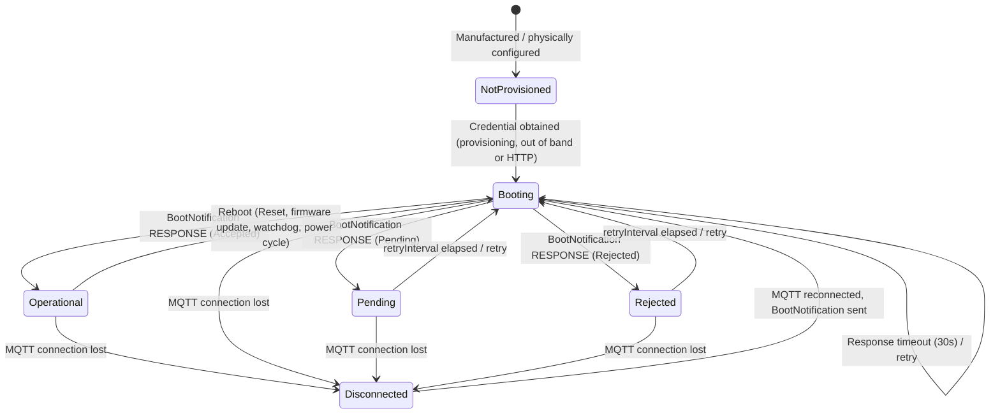
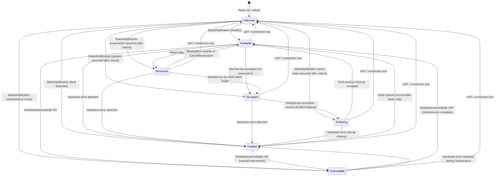
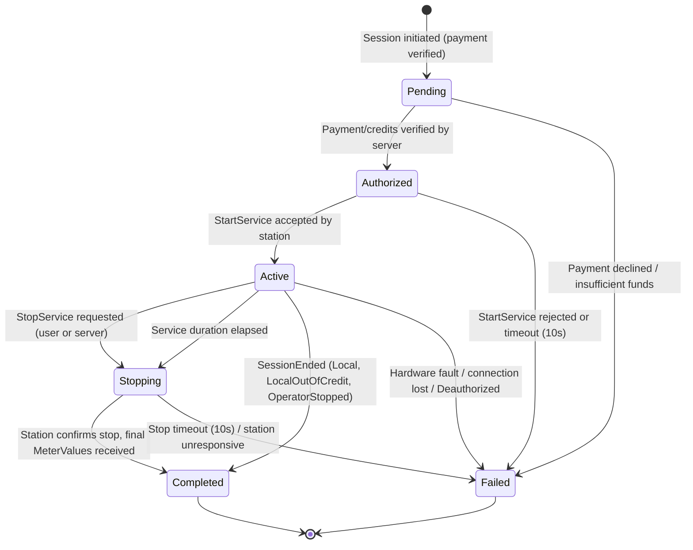
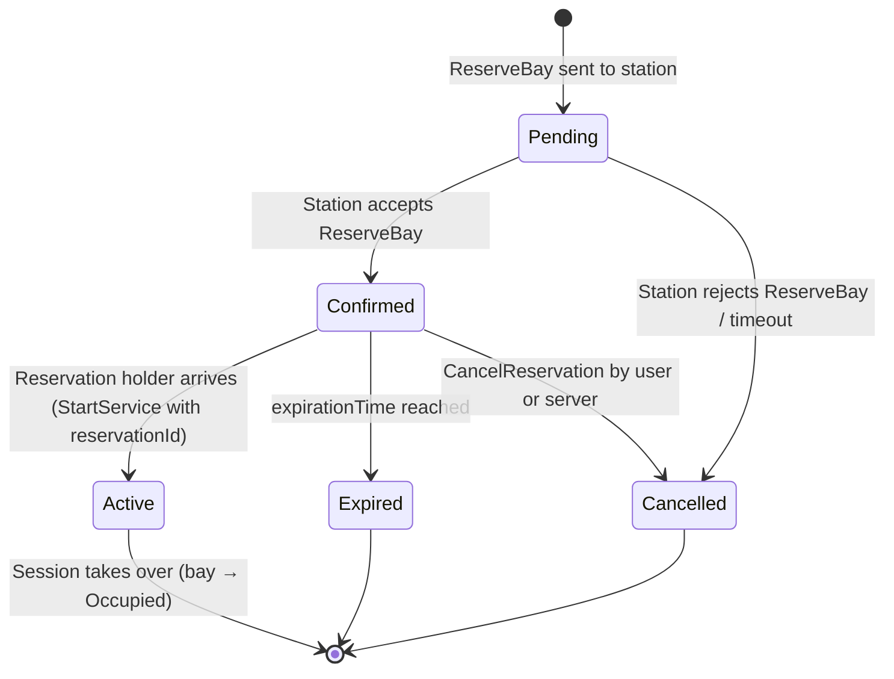
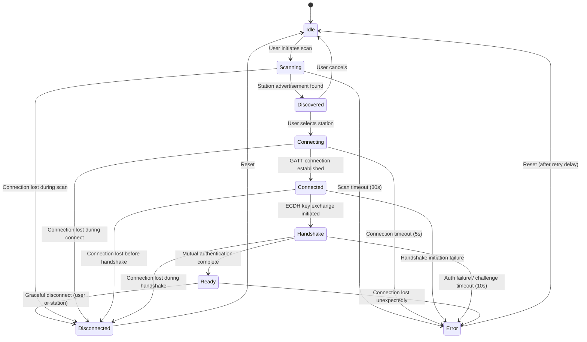
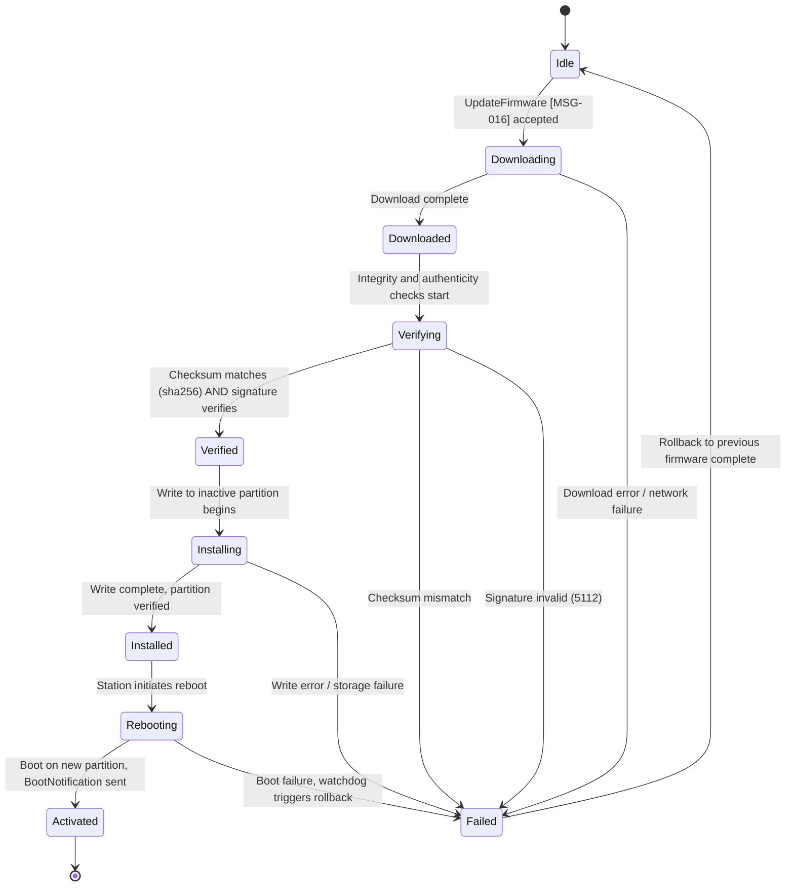
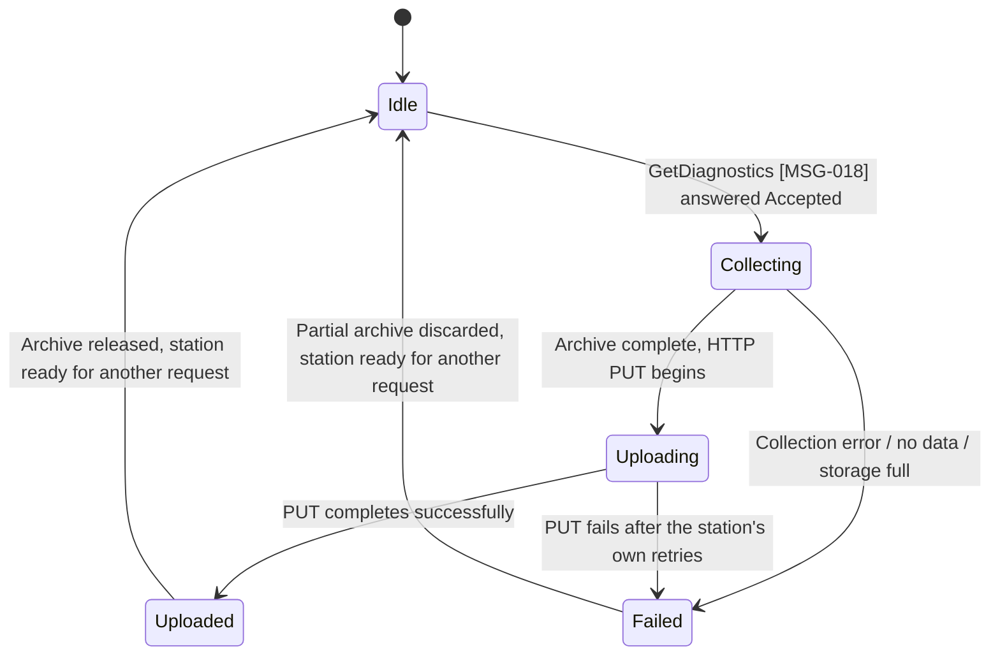

# Chapter 05 — State Machines

> **Status:** Draft | **OSPP Version:** 0.34.0

This chapter defines all finite state machines (FSMs) governing OSPP entities — the station, its bays, sessions, reservations, BLE connections, firmware updates and diagnostics uploads. Each FSM specifies the complete set of states, valid transitions, guards, actions, and a Mermaid diagram. A transition not listed for a machine is invalid, and implementations MUST NOT perform one.

**What a party does on *receiving* a report of an invalid transition is stated per machine, not here, because the answer is not the same for all of them.** It turns on who owns the fact being reported. Where the sender is the authority — a station reporting its own hardware — the receiver accepts and records rather than refuses, because refusing does not undo the fact, it only discards the news of it; that is the bay machine, and the rule is [§2.5](#25-invalid-transitions). Where the receiver owns the fact — a station being commanded into a state it cannot be in — the receiver refuses, with an error code. A single chapter-wide "MUST be rejected" collapsed those two into one answer and was the source of a direct contradiction with the rule the reference server actually implements.

The **station** machine ([§1](#1-station-state-machine)) is the outermost: every other machine on a station is scoped inside it, and [§7.1](#71-station----bay----session-coupling) states how.

The diagnostics upload machine is [§8](#8-diagnostics-upload-state-machine) rather than §7, because §7's ordinal and sub-ordinals are cited from other documents and renumbering them to gain an ordering would break those citations.

The keywords **MUST**, **MUST NOT**, **REQUIRED**, **SHALL**, **SHALL NOT**, **SHOULD**, **SHOULD NOT**, **RECOMMENDED**, **MAY**, and **OPTIONAL** in this document are to be interpreted as described in [RFC 2119](https://www.rfc-editor.org/rfc/rfc2119) and [RFC 8174](https://www.rfc-editor.org/rfc/rfc8174).

For message references, see [Chapter 03 — Message Catalog](03-messages.md). Messages are referenced as **[MSG-XXX]**. For flow references, see [Chapter 04 -- Flows](04-flows.md). For error codes, see [Chapter 07 — Error Codes & Resilience](07-errors.md).

---

## 1. Station State Machine

The station state machine governs the station as a whole — whether it may talk to the server, whether it may accept commands, and whether it may serve a customer. Every other machine in this chapter is scoped inside it: a bay transition is only reportable, and a session only startable, while the station is `Operational`. A station MUST be in exactly one of the six defined states at all times.

Two other machines in this chapter also have a state named `Pending` — the session machine ([§3.2](#32-states-6)) and the reservation machine ([§4.2](#42-states-5)). They are unrelated. Where ambiguity is possible this specification writes **station-`Pending`**, and it is the only `Pending` a BootNotification RESPONSE can carry.

### 1.1 State Diagram

```mermaid
stateDiagram-v2
    [*] --> NotProvisioned : Manufactured / physically configured

    NotProvisioned --> Booting : Credential obtained (provisioning, out of band or HTTP)

    Booting --> Operational : BootNotification RESPONSE (Accepted)
    Booting --> Pending : BootNotification RESPONSE (Pending)
    Booting --> Rejected : BootNotification RESPONSE (Rejected)
    Booting --> Booting : Response timeout (30s) / retry

    Pending --> Booting : retryInterval elapsed / retry
    Rejected --> Booting : retryInterval elapsed / retry

    Operational --> Disconnected : MQTT connection lost
    Booting --> Disconnected : MQTT connection lost
    Pending --> Disconnected : MQTT connection lost
    Rejected --> Disconnected : MQTT connection lost

    Disconnected --> Booting : MQTT reconnected, BootNotification sent

    Operational --> Booting : Reboot (Reset, firmware update, watchdog, power cycle)
```

### 1.2 States (6)

| State | Description |
|-------|-------------|
| **NotProvisioned** | The station holds no operator-issued client certificate and cannot open an mTLS connection to the broker. OSPP does not begin here: the exit is provisioning ([Chapter 04 — Flows §2](04-flows.md#2-station-provisioning)) or the out-of-band manufacturing path ([Chapter 01 — Architecture §7.1](01-architecture.md)). A station **MUST NOT** enter this state autonomously — there is no remote credential wipe ([Reset §5.1](profiles/device-management/reset.md)). |
| **Booting** | The MQTT connection is established, the station has subscribed to its `to-station` topic and published a BootNotification REQUEST [MSG-001], and it is waiting for the RESPONSE. Restricted more tightly than `Pending`: it holds no session key yet, so it can neither sign nor verify, and therefore cannot process a command even if one arrives. |
| **Pending** | The server accepted the connection but has not cleared the station for service — an operator approval is outstanding, or a `3018 TOPOLOGY_MISMATCH` needs repair. A **restricted** state: the station answers commands and sends nothing unsolicited. It **does** hold a session key — the response that put it here carries one — because every command it answers is signed. See [§1.4](#14-the-restricted-states). |
| **Rejected** | The server refused the boot and said why, with `errorCode` and `errorText`. A **restricted** state, and stricter than `Pending`: the station also refuses commands, because the server that would send them does not consider it registered — and it holds no session key, so it could not verify one. See [§1.4](#14-the-restricted-states). |
| **Operational** | The boot was `Accepted`. The station has a session key, has reported every bay, is heartbeating, accepts and executes commands, and serves customers. This is the only state in which a bay can leave `Unknown` **on the server** ([§2.2](#22-states-7)) — a restricted station may have resolved its bays by self-test, but it may not report them — and the only state in which a session may start. |
| **Disconnected** | No MQTT connection. Hardware keeps running: active sessions continue on the station's local timer, BLE stays available, and TransactionEvent and SecurityEvent are buffered ([Chapter 02 — Transport §4.4](02-transport.md)). The station is not idle here — it is operating without a server. The server infers this state from the LWT [MSG-011] or a heartbeat timeout and holds every bay at `Unknown` ([CORE-008](profiles/core/README.md)). |

> **Which party holds which state.** The station holds all six about itself. The server holds five: it never observes `Booting` as a state, because the REQUEST that opens it and the RESPONSE that closes it are one exchange the server completes synchronously. `NotProvisioned` is the server's record of a station it has registered but not yet credentialled; a station it has never heard of has no state at all, and its boot is answered `Rejected` with `2001 STATION_NOT_REGISTERED`. `Disconnected` is the server's inference, exactly as `Unknown` is for a bay, and the two are the same event seen at two scopes.

### 1.3 Transition Table

| Trigger | From | To | Condition | Action |
|---------|------|----|-----------|--------|
| Credential obtained | NotProvisioned | Booting | The station holds a client certificate whose Subject CN carries its `stationId`, and a broker trust anchor | Station connects (mTLS), subscribes to `to-station`, publishes BootNotification [MSG-001] |
| BootNotification RESPONSE `Accepted` | Booting | Operational | Server recognises the `stationId`, the declared topology matches, and the protocol version matches | Station stores `sessionKey`, applies `configuration`, syncs its clock to `serverTime`, sends one StatusNotification [MSG-009] per bay, starts the heartbeat timer |
| BootNotification RESPONSE `Pending` | Booting | Pending | Operator approval outstanding, or `3018 TOPOLOGY_MISMATCH` | Station stores `sessionKey` — it will answer signed commands — enters the restricted state of [§1.4](#14-the-restricted-states), and waits `retryInterval` |
| BootNotification RESPONSE `Rejected` | Booting | Rejected | `2001`, `1005`, `1007` or `6001` — see [boot-notification.md §6](profiles/core/boot-notification.md). **`1005` is among them, and the distinction is envelope versus payload.** A BootNotification whose *payload* fails validation is still a BootNotification: the envelope parsed, so the server holds the action and the `messageId` and can correlate a response, and `boot-notification-response.schema.json` requires `errorCode`, `errorText` and `retryInterval` on **any** `Rejected` — so the rejection is expressible and the station reads a code out of it. Only a message whose *envelope* cannot be parsed is discarded without a reply, and that is not a BootNotification failure at all, because nothing identifies it as one ([`02-transport.md` §11](02-transport.md#11-error-scenarios-summary)). This cell said `1005` was *not* among them and that the station leaves `Booting` by timeout — retracted at 0.33.0. `boot-notification.md` was repaired at 0.30.0 and this cell was not, so the two artefacts a firmware author reads answered the same question opposite ways for three releases, and this is the one that describes the state machine they implement | Station records `errorCode`, `errorText` and any `supportedVersions`, and waits `retryInterval` |
| Response timeout | Booting | Booting | No RESPONSE within 30 seconds | Station logs `1010 MESSAGE_TIMEOUT`, waits 60 seconds, re-publishes BootNotification. Retries are unlimited |
| `retryInterval` elapsed | Pending, Rejected | Booting | The interval from the response has passed (default 30 s, `BootRetryInterval`) | Station re-publishes BootNotification [MSG-001]. Retries are unlimited ([CORE-011](profiles/core/README.md)) |
| MQTT connection lost | Booting, Pending, Rejected, Operational | Disconnected | PINGRESP timeout, TCP reset, or broker unavailable | Station continues active sessions, keeps BLE available, buffers per [Chapter 01 §6.5](01-architecture.md#65-offline-message-buffering); server receives the LWT [MSG-011] and marks every bay `Unknown`. Both sides discard the session key |
| MQTT reconnected | Disconnected | Booting | Transport re-established with backoff ([Chapter 02 §4.5](02-transport.md)) | Station re-subscribes and publishes BootNotification with `bootReason: "Reconnect"` if it did not reboot |
| Reboot | Operational, Pending, Rejected | Booting | Reset [MSG-015], firmware update, watchdog, or power cycle | Station restarts, reconnects, and publishes BootNotification with the `bootReason` that names the cause |

Any transition not listed here is invalid. In particular there is **no** edge from `Pending` or `Rejected` directly to `Operational`: a station leaves a restricted state only by re-sending BootNotification and receiving `Accepted`. The server cannot promote a station in place, and a station **MUST NOT** infer promotion from a command arriving while it is `Pending`.

> **The *Reboot* row names three `From` states and adds no edge.** `Pending -> Booting` and
> `Rejected -> Booting` are already listed above, under *`retryInterval` elapsed*; what the wider
> `From` column adds is a second and third **trigger** for pairs the table already had, so the edge
> set is unchanged and a conformance check counting `(from, to)` pairs sees the same number as
> before. It is stated because *"any transition not listed here is invalid"* is otherwise read
> against the trigger, and three reboots out of a restricted state are reachable: Reset [MSG-015]
> is answered normally while `Pending` ([§1.4](#14-the-restricted-states)), a firmware update is
> now accepted there and ends in a reboot, and a watchdog or a power cycle is physical — no state
> forbids it, `Rejected` included. Only the first of those three is new in `0.21.0`; the row was
> already too narrow for the other two.

### 1.4 The Restricted States

`Pending` and `Rejected` are both restricted, and they differ in exactly one respect: whether the station answers commands.

| | `Booting` | `Pending` | `Rejected` | `Operational` |
|---|:---:|:---:|:---:|:---:|
| Sends BootNotification retries | — | **MUST** | **MUST** | — |
| Originates SignCertificate [MSG-022] to renew its own certificate | **MUST NOT** — holds no key | **MAY** | **MUST NOT** — holds no key | MAY |
| Sends anything else it originates (any other EVENT, or any other REQUEST) | **MUST NOT** | **MUST NOT** | **MUST NOT** | MAY |
| Receives and processes server commands | **MUST NOT** | **MUST** | **MUST NOT** | **MUST** |
| Answers a server command with a RESPONSE | **MUST NOT** | **MUST** | **MUST NOT** | **MUST** |
| Starts new customer service | **MUST NOT** | **MUST NOT** | **MUST NOT** | MAY |
| Continues a session already running | **MUST** | **MUST** | **MUST** | **MUST** |
| Holds a session key | no | **yes** | no | **yes** |

**Why `Pending` answers commands and `Rejected` does not.** `Pending` exists so that a human can repair something — approve a registration, or correct a topology record — and the repair may need the command channel: ChangeConfiguration, GetConfiguration, GetDiagnostics, UpdateServiceCatalog, TriggerMessage, a certificate operation, a firmware update, or a Reset. Closing that channel would leave the operator no way to do the very thing the window exists for. `Rejected` carries no such expectation: the server has said the station is not registered, or is speaking a protocol version it does not support, and it has nothing to configure.

> **What OCPP does with this case, stated at the altitude its text supports.** The asymmetry is
> real and 2.0.1 has it: in *B02 Cold Boot — Pending*, `B02.FR.02` forbids the charging station
> every CALL but BootNotificationRequest unless the CSMS prompts it, while `B02.FR.01` lets the
> CSMS retrieve information and set variables. It is an asymmetry and **not** a free hand for the
> server: `B02.FR.01` names four Provisioning use cases and no others, and `B02.FR.05` has the
> station reject a remote start or stop outright. **On the firmware question OCPP is silent, in
> both generations** — 1.6 §4.2 forbids the Central System exactly two messages while Pending and
> neither is a firmware command, and 2.0.1's Firmware Management block never mentions registration
> status at all. So the row below is decided on this specification's own grounds. This note replaces
> a sentence that read *"the CSMS is free to issue requests"*, which is wider than `B02.FR.01` says
> and would have been the citation a reader leaned on.

**The key row is what makes the rest of the table possible, and it is easy to get wrong.** Every command is signed, and both the sending and the receiving path fail closed on a missing key ([Chapter 06 §5.7](06-security.md#57-failure-handling--both-directions-fail-closed)). If a `Pending` station held no key, the server could not send a command, the station could not accept one, and it could not answer — the repair channel would exist only on paper. So the `Pending` response carries a `sessionKey`, exactly as an `Accepted` one does ([`boot-notification.md` §5.3](profiles/core/boot-notification.md)). `Rejected` needs none: it answers nothing.

**The distinction is carried by the envelope, not by the action.** `messageType` is `Request`, `Response` or `Event` ([Chapter 03 — Conventions](03-messages.md#conventions)). A restricted station is forbidden `Event` outright; it may originate a `Request` only under the rule immediately below; and `Response` is permitted in `Pending` because a RESPONSE is not something the station initiates.

**What a restricted station may originate, and the test that decides it.** A restricted station may originate exactly those messages that **repair its own standing with the server**, and nothing else. Two messages qualify, and the test is stated rather than the pair enumerated, because a list has to be remembered and a test can be applied:

- **BootNotification [MSG-001]** restores its **registration**. It is the only exit from a restricted state ([§1.3](#13-transition-table)), so sending it is the act that ends the restriction.
- **SignCertificate [MSG-022]** restores its **credential**, without which it cannot connect at all. This is the renewal flow of [Chapter 06 §4.7.1](06-security.md#471-automatic-renewal), whether the station initiated it at its own threshold or the server asked for it with TriggerCertificateRenewal [MSG-024].

Nothing else qualifies. StatusNotification, MeterValues, Heartbeat, TransactionEvent, SessionEnded, DiagnosticsNotification, FirmwareStatusNotification and SecurityEvent all report on the station's **work** — customers, bays, sessions, incidents — and a restricted station has not been cleared to do that work. The question is not whether a message is useful; it is whether the station's ability to *be served at all* depends on sending it.

> **Why the certificate earns an exception and nothing else does.** A station certificate is valid for **one year** ([§4.2](06-security.md#42-pki-architecture), maximum one year RECOMMENDED at [§4.4](06-security.md#44-certificate-requirements)), and renewal opens `CertificateRenewalThresholdDays` before expiry — **30 days** by default, configurable 7–90. The renewal window is therefore about **one twelfth of the certificate's life**. The two things that put a station into `Pending` are an outstanding operator approval and a `3018 TOPOLOGY_MISMATCH` ([§1.5](#15-topology-at-boot)); both are cleared by a person and never by time, retries are unlimited ([§1.3](#13-transition-table)), and both are the state a station is in **just after a technician has been on site** — which is also when a topology record is most likely half-updated. A station can therefore sit restricted, for as long as the repair takes, straight through the window in which its certificate had to be renewed. Renewal exists precisely to avoid the site visit that expiry forces ([§4.7.3](06-security.md#473-emergency-renewal) puts an expired station into offline-only BLE mode, recoverable only over an existing session or by physical re-provisioning). Without this exception the mechanism would be unavailable in the one state that most needs it, and the restriction would manufacture the outcome the mechanism was built to prevent.

**The exception limits itself, and needs no written scope.** SignCertificate is one of the **44 signed** message types — it is *not* among the three structural exemptions of [Chapter 06 §5.6](06-security.md#56-message-signing-classification) — and a sender holding no key **MUST** refuse to send rather than send unsigned ([§5.7](06-security.md#57-failure-handling--both-directions-fail-closed)). The *Holds a session key* row above says `Booting` and `Rejected` hold none. **SignCertificate is therefore structurally impossible in both**, and the permission is exercisable only in `Pending` — which is also the only restricted state that has a server willing to answer it. **Do not add a rule saying so.** A later reader who writes *"except in `Pending`"* is restating what the signing rules already enforce, and a redundant scope is how a rule starts drifting from the thing it duplicates.

**Serving no customers is not the same as stopping.** A station that enters a restricted state with a session already running **MUST** continue it, meter it, and settle it, exactly as it does while `Disconnected` ([Chapter 02 §4.4](02-transport.md)) — a customer who has paid is served. What it **MUST NOT** do is begin a new one. While `Pending` or `Rejected` the station **MUST** reject StartService [MSG-005] and ReserveBay [MSG-003] with `3002 BAY_NOT_READY`, on every transport, and **MUST NOT** authorize a BLE offline session. In `Pending` that rejection is sent as a RESPONSE; in `Rejected` the command is not processed at all.

**Metering and settling are not the same as reporting, and this is where the paragraph above would otherwise contradict the table above it.** Every message that carries any of those three verbs is one a restricted state forbids: MeterValues [MSG-010] and SessionEnded [MSG-040] are EVENTs, and TransactionEvent [MSG-007] is a REQUEST the station originates. The `MUST NOT` covers all three and no carve-out is intended. What the station does instead is what it does while `Disconnected`: it runs the session on its **local** timer, meters it **locally**, and **buffers** what it owes under the categorised policy of [Chapter 01 §6.5](01-architecture.md#65-offline-message-buffering), emitting nothing until the boot that reaches `Operational`, at which point it flushes. The categories carry the distinction that matters — intermediate MeterValues are regenerable and **MAY** be discarded; SessionEnded and TransactionEvent are billing evidence and **MUST NOT** be, because a session that ended while the station was restricted has no other record of what was delivered.

This is the session-scope twin of the bay rule below: reachable, unreported, and resolved in one step once the station is `Operational`. It is stated because the three readings a station is otherwise left with are all wrong — emitting breaks the unsolicited row, staying silent permanently strands the money for a service the customer has already received, and abandoning the session breaks the **MUST** above. Note that the reference to [Chapter 02 §4.4](02-transport.md) describes a station that reconnects and is **accepted**; one held at `Pending` has completed that same boot and been refused, so it reaches §4.4's flush step only on a later boot.

**A command whose only effect is a forbidden message cannot be honoured while restricted, and must be refused rather than half-done.** The `MUST NOT` has no carve-out beyond the two messages named above, so a `Pending` station that accepts such a command and then emits the message breaks the row above, and one that accepts it and stays silent has answered `Accepted` to something it did not do. Neither is conforming.

**The discriminator is whether the command has an effect independent of the message it would emit — and, where it has one, whether the suppressed message is a *report about* that effect or the *only account of it there will ever be*.** Three outcomes follow, and the table below is grouped by them. A command that completes entirely in its RESPONSE is answered normally. A command whose substantive effect happens locally, with only a *report* blocked, is answered normally with that report suppressed — nothing is lost, because a restricted station's bays are held at `Unknown` server-side regardless and the state is carried by the post-boot report. A command whose **only** effect is a message the station may not send is refused.

**The second clause asks whether an account will *ever* exist, and applying it means looking on every message the station may send — not only on the one the command would have emitted.** UpdateFirmware is the case that made the clause necessary and the case that shows how to read it. Its effect is emphatically independent of any message — it downloads, verifies, writes a partition and reboots — so the first clause puts it with SetMaintenanceMode and GetDiagnostics, answered `Accepted` with its notifications suppressed, and the second clause leaves it there. FirmwareStatusNotification is the entire account of the update from `Accepted` until the station reboots, and that interval is **bounded**. It is not the only account there will ever be: [§6.6](#66-firmwarestatusnotification-mapping) gives the update's terminal state, `Activated`, no notification value at all and says in terms that it is *reported via BootNotification [MSG-001]* — and `firmwareVersion` is REQUIRED on every BootNotification ([`boot-notification.md` §3](profiles/core/boot-notification.md)), which a restricted station **MUST** keep sending at `retryInterval`, without limit ([§1.3](#13-transition-table)). So the outcome travels on the one message the restriction itself **compels**, and it arrives sooner than from an `Operational` station, which is under no obligation to boot again at all.

**A command is refused only when no message the station may ever send would carry the outcome**, and the clause still refuses on that test: TriggerMessage for a StatusNotification or a MeterValues is refused because nothing later restates the reading that was suppressed. What the clause does **not** license is reading a bounded silence as a permanent one. Concretely:

| Command sent to a `Pending` station | What it does |
|---|---|
| TriggerMessage [MSG-026] with `requestedMessage: "BootNotification"` | **`Accepted`**, and the station boots immediately instead of waiting out `retryInterval`. Triggering it is exactly the act that ends the restriction once an operator has approved the registration or corrected the topology record |
| TriggerMessage with `requestedMessage: "SignCertificate"` | **`Accepted`**. SignCertificate is the second message a restricted station may originate, so this and TriggerCertificateRenewal [MSG-024] are two routes to one act and get one answer. They did not, before this was written down, and that disagreement is what the rule above exists to settle |
| TriggerMessage with any other `requestedMessage` | **`Rejected`**. StatusNotification, MeterValues, Heartbeat, DiagnosticsNotification, FirmwareStatusNotification and SecurityEvent are all EVENTs the station may not send, and none of them repairs the station's own standing |
| SetMaintenanceMode [MSG-020] | **`Accepted`**, the bay state changes locally, and the StatusNotification the command would normally emit ([set-maintenance-mode.md §5 rule 4](profiles/device-management/set-maintenance-mode.md)) is **not sent**. Nothing is lost: the server holds every bay of a restricted station at `Unknown` regardless, and the new state is carried by the post-boot report when the station reaches `Operational` |
| GetDiagnostics [MSG-018] | **`Accepted`**, the archive is collected and uploaded, and the DiagnosticsNotification [MSG-019] events that would report progress ([get-diagnostics.md §6 rule 2](profiles/device-management/get-diagnostics.md)) are **not sent**. The upload is an HTTP PUT to a URL the command supplies, so the substantive effect completes and the RESPONSE stays truthful; only the progress reporting is suppressed, exactly as for SetMaintenanceMode above |
| TriggerCertificateRenewal [MSG-024] | **`Accepted`**, and the station runs the renewal flow, including the SignCertificate [MSG-022] it originates — permitted by the rule above. This is the one command in this table whose completion *requires* an origination, which is why it needed the rule rather than a suppression |
| UpdateFirmware [MSG-016] | **`Accepted`**, the update runs in full — download, verify, install behind the gate of [§7.4](#74-firmware-update----bay-constraint), reboot — and every FirmwareStatusNotification [MSG-017] it would emit is **not sent**, exactly as for SetMaintenanceMode and GetDiagnostics above. The command is not what reports the result: the server reads it from the `firmwareVersion` of the next BootNotification, REQUIRED on every one and arriving at `retryInterval` because the restriction compels the retries. Two rules move with this. The stall timer of [`firmware-status.md` §6](profiles/device-management/firmware-status.md) rule 3 **MUST NOT** run while the station is restricted — both of its anchors are absent, not late — and the reboot out of `Pending` is a listed trigger at [§1.3](#13-transition-table) |
| ChangeConfiguration, GetConfiguration, UpdateServiceCatalog, CertificateInstall [MSG-023], Reset | **Answered normally.** Each returns its result in a RESPONSE, which is not something the station originates, and none has any further effect the restriction touches |

`Rejected` stations process none of this — they refuse every command, so the question does not arise. That limit is structural rather than chosen: `Rejected` holds no session key, and signing fails closed in both directions ([Chapter 06 §5.7](06-security.md#57-failure-handling--both-directions-fail-closed)), so no command can be delivered to such a station or accepted by it. It is why `1007 PROTOCOL_VERSION_MISMATCH` still names on-site service as the recovery for a station that stops retrying ([Chapter 07 §3.1](07-errors.md)), and why the row above is scoped to `Pending` and says nothing about `Rejected`.

> **Two mechanisms, one reason — and not two exceptions to one rule.** A restricted station may
> originate SignCertificate, and a `Pending` station may now be sent a firmware update. Both are
> traffic that repairs the station's situation, so it is tempting to state them as a single
> principle. They cannot be, because they run in opposite directions. The origination test above
> governs what the station **sends**, and SignCertificate is one of its two members. The
> discriminator governs what the station **does with a command it receives**, and UpdateFirmware is
> no longer an exception to it — it is its ordinary middle outcome. Neither rule reaches the other's
> direction, and merging them would invite the one question the origination test exists to refuse:
> whether FirmwareStatusNotification *repairs the station's standing*. It does not — it reports on
> the station's work — which is why it stays forbidden and the progress reporting stays suppressed.
>
> **What the two share is the reason.** `Pending` is unbounded and is cleared by a person and never
> by time ([§1.5](#15-topology-at-boot)), so a rule that withholds a repair mechanism there
> specifies the failure the mechanism was built to prevent. That sentence decided the certificate
> case in `0.19.0` and it decides this one: a station made restricted **by** a firmware defect is
> precisely the station a firmware update has to be able to reach.

**What the server may assume.** A `Pending` or `Rejected` station has sent no StatusNotification, so the server holds every one of its bays at `Unknown` and **MUST NOT** offer them for sale. The absence of bay reports is the signal, and it is the same signal a `Disconnected` station produces — which is why no new state value is needed on the wire to express it.

**Which bay states are reachable while restricted.** All seven, on the station's own side: a restricted station runs its self-test, continues a session that was already running, and can be put into maintenance — so its bays move through the `Station` rows of [§2.3](#23-transition-table) normally. None of it is reported. The server's view is `Unknown` for every bay throughout, and it resolves in one step at the post-boot report once the station is `Operational` — including, where a session survived, to `Occupied` or `Finishing`.

### 1.5 Topology at Boot

The station re-declares its physical topology in every BootNotification: `bays[]`, one entry per bay, each carrying `bayNumber` and that bay's `programNumbers` ([Chapter 01 — Architecture §4.2](01-architecture.md)). The server compares that declaration, as a set in both directions, against the station's **in-service topology**.

**The in-service topology is the referent for every topology comparison in this specification** — this one and the `4020` comparison at provisioning ([Chapter 04 §2](04-flows.md), *Error precedence* step 5). It is the set of bays the server currently records for the station, **excluding any bay the operator has taken out of service**. Provisioning creates that record; it does not freeze it.

Taking a bay out of service is an act on the server's own record, and this specification does not define the mechanism: [Chapter 07 §4.4](07-errors.md#44-rest-api-endpoints) lists every REST endpoint defined here and none of them adds or removes a bay. It does define the **effect**, because the effect is what the two comparisons read: a bay that is out of service is absent from the compared set on the server's side, and a station that no longer has that bay is therefore a **match**, not a mismatch.

**This is stated because the alternative reading is unshippable.** Read as *every bay ever registered*, a station that has one bay physically removed declares a set that can never again equal the server's, so it is `3018` and `Pending` on every boot for ever — and by [§1.4](#14-the-restricted-states) a `Pending` station **MUST** refuse StartService and ReserveBay with `3002` on every transport. One retired bay would stop the whole station selling, with no operator act able to clear it. The comparison is not weakened by naming its referent: it still fires on exactly the disagreement it exists to catch, and the reverse direction is deliberately **not** relaxed — a station that still declares a bay the operator took out of service disagrees with the operator about its own hardware, which is a real mismatch a person **MUST** settle.

1. **Match → `Accepted`.** The station proceeds to `Operational`.
2. **Mismatch → `Pending`, with `3018 TOPOLOGY_MISMATCH`.** Never `Rejected`: `Pending` keeps the command channel open so an operator can repair the disagreement, and `Rejected` would close the only channel through which it could be repaired. The response **MUST** carry a `details` object naming what the server expected and what arrived.
3. **First boot.** Provisioning creates the bay records and boot never does, so the two declarations come from the same act and a first boot **matches**. It can fail only if the topology submitted at provisioning and the topology declared at boot disagree — which is the same mismatch as any other, carries the same `3018`, and puts the station in the same `Pending`. There is no first-boot exemption and no bootstrap window: a station whose two declarations disagree has a firmware or a commissioning fault, and the fault is worth the same held state at boot 1 as at boot 100.
4. **The station does not adapt.** A station **MUST NOT** alter its declaration to match what the server expected. The declaration describes hardware; silently agreeing would hide a real hardware change. It keeps declaring the same topology and keeps retrying.

The mismatch is symmetric: a bay or a program ordinal present on one side and absent on the other is a mismatch in either direction. Program **labels** are descriptive, are not re-declared at boot, and are never compared.

---

## 2. Bay State Machine

The bay state machine governs the operational status of each physical service bay on a station. Every bay MUST be in exactly one of the seven defined states at all times. The station MUST send a StatusNotification [MSG-009] on every state transition.

> **[§2.3](#23-transition-table) is the only transition table for this machine in this
> specification.** No profile, guide, diagram, conformance case or example restates it. Where one
> of those needs to name a transition it names it and links here; where it needs to explain what
> triggers a transition, it explains that and links here for the transition's legality. This rule
> is not tidiness. The table was previously stated in full in five places, they disagreed on seven
> edges, and the two SDKs — which release as a pair and are meant to be interchangeable —
> implemented different copies and rejected each other's traffic.
>
> **The table has two parties in it, and the *Effected by* column says which.** A bay a station
> operates and a bay a server believes in are different objects. The station effects and reports
> the physical transitions; the server infers exactly one, the move to `Unknown` when it can no
> longer hear the station. Merging them without saying so is what produced the divergence: a
> station implementer read the `→ Unknown` rows as theirs to implement, and a server implementer
> read the station's rows as the whole model. **A station implements the `Station` rows. A server
> implements all of them.**

### 2.1 State Diagram

```mermaid
stateDiagram-v2
    [*] --> Unknown : Power on / reboot

    Unknown --> Available : StatusNotification (healthy)
    Unknown --> Faulted : StatusNotification (fault detected)
    Unknown --> Unavailable : StatusNotification (maintenance mode)
    Unknown --> Reserved : StatusNotification (reservation resumed after reboot)
    Unknown --> Occupied : StatusNotification (session resumed after reboot)
    Unknown --> Finishing : StatusNotification (wind-down resumed after reboot)

    Available --> Reserved : ReserveBay accepted
    Available --> Occupied : StartService accepted (no reservation)
    Available --> Faulted : Hardware error detected
    Available --> Unavailable : SetMaintenanceMode ON

    Reserved --> Occupied : StartService by reservation holder
    Reserved --> Available : Reservation expires or CancelReservation
    Reserved --> Faulted : Hardware error detected

    Occupied --> Finishing : StopService accepted / service duration elapsed
    Occupied --> Faulted : Hardware error detected

    Finishing --> Available : Post-session cleanup complete
    Finishing --> Faulted : Hardware error during cleanup

    Faulted --> Available : Fault cleared (recoverable faults only)
    Faulted --> Unavailable : SetMaintenanceMode ON (manual intervention)

    Unavailable --> Available : SetMaintenanceMode OFF (maintenance complete)
    Unavailable --> Faulted : Hardware error detected during maintenance

    %% SERVER rows below. Inferred, never reported: no message carries these
    %% and a station MUST NOT implement them.
    Available --> Unknown : LWT / connection lost
    Reserved --> Unknown : LWT / connection lost
    Occupied --> Unknown : LWT / connection lost
    Finishing --> Unknown : LWT / connection lost
    Faulted --> Unknown : LWT / connection lost
    Unavailable --> Unknown : LWT / connection lost
```

### 2.2 States (7)

| State | Description |
|-------|-------------|
| **Available** | Bay is idle and ready to accept a session or reservation. All hardware subsystems are operational. |
| **Reserved** | Bay is reserved for a specific user via ReserveBay [MSG-003]. A countdown timer is active; the bay MUST reject StartService from any session other than the reservation holder. |
| **Occupied** | A session is active on the bay. The station is delivering the requested service and sending periodic MeterValues [MSG-010]. |
| **Finishing** | The session has ended (via StopService or duration elapsed). The station is performing post-session hardware wind-down (depressurization, actuator retraction, etc.). |
| **Faulted** | The bay has encountered a hardware or software fault. The station MUST include the bay-level `errorCode` and `errorText` in the StatusNotification. The bay MUST NOT accept StartService or ReserveBay while faulted. A fault confined to a single program does **not** put the bay here — that is `programs[].available: false` with its own code ([status-notification.md §6.1](profiles/core/status-notification.md)). |
| **Unavailable** | The bay is administratively disabled or under maintenance. Entered via SetMaintenanceMode [MSG-020] or as a consequence of a fault requiring manual intervention. |
| **Unknown** | The bay state is indeterminate. This is the initial state after station power-on or reboot, and the state the server transitions to when it receives a ConnectionLost [MSG-011] (LWT). The station MUST resolve this state by sending a StatusNotification on boot. **Never transmitted** — see below. |

> **`Unknown` is held by both parties and transmitted by neither.** It is the one
> state of the seven that no message carries, and it is absent from
> [`bay-status.schema.json`](../schemas/common/bay-status.schema.json) for that
> reason. A station **MUST NOT** report `Unknown` in the `status` or
> `previousStatus` field of any message, on any transport; it resolves the state
> by reporting what it resolved **to** — `Available`, `Faulted`, `Unavailable`,
> or, where a session survived the reboot, `Occupied` or `Finishing`, per the five
> `Unknown` rows of section 2.3.
>
> A generated type MUST reflect this. An implementation MAY hold `Unknown`
> internally — both parties do, and the state machine needs it — but the type it
> uses for the wire `status` and `previousStatus` fields **MUST NOT** be able to
> express it. A single enum serving both purposes lets an implementation construct,
> in typed code that compiles, a message its own schema rejects, and the fault then
> surfaces at the receiver as a validation error on a field the sender believed was
> valid. Both reference SDKs carry the member on their wire enum today, which is how
> this was found.
>
> A server holds a bay at `Unknown`
> whenever it has no current report — from the station's boot until the post-boot
> report arrives, and from connection loss ([CORE-008](profiles/core/README.md))
> until the next accepted StatusNotification.
>
> Note that the two entries are asymmetric in who observes them. Power-on is the
> **station's** own state, and the station acts on it: it rejects StartService and
> ReserveBay with `3002 BAY_NOT_READY` while a bay is `Unknown`
> ([start-service.md §6 rule 2](profiles/transaction/start-service.md),
> [reserve-bay.md §6 rule 3](profiles/transaction/reserve-bay.md)). Connection loss is the
> **server's** inference about a station it can no longer hear. Neither observation
> is something the other party could report.
>
> This follows settled practice for a state one party infers rather than observes:
> TR-069 names the same case (§1.6, *Seen Missing*) and gives it no wire slot,
> observing that the device cannot determine it about itself, and OCPP defines no
> connector status for connection loss at all. The process-control protocols carry
> such a fact as a companion quality flag beside the value rather than as a member
> of the value's own vocabulary — and OSPP already has that channel, since the LWT
> [MSG-011] is itself the freshness signal; putting `Unknown` in the status enum
> stated the same fact a second time, in the weaker place.

### 2.3 Transition Table

This is the canonical table. Nothing else in this specification restates it.

| Trigger | From | To | Effected by | Condition | Action |
|---------|------|----|-------------|-----------|--------|
| StatusNotification (healthy) | Unknown | Available | Station | Bay hardware passes self-test and holds no session | Station sends StatusNotification [MSG-009] with the bay's status and its `programs[]` availability |
| StatusNotification (fault) | Unknown | Faulted | Station | Bay hardware fails self-test, **or** the boot cannot determine what the bay delivered before it lost power ([§3.5](#35-per-session-sequence-number-seqno-and-crash-resilience) rule 6). The two are different facts and carry different codes: a failed self-test is the 5xxx member that names what failed, an indeterminate outcome is `5113 OUTCOME_INDETERMINATE`, which asserts that nothing was observed | Station sends StatusNotification with `errorCode` and `errorText` from the 5xxx range, REQUIRED on `Faulted` by [CORE-012](profiles/core/README.md) |
| StatusNotification (maintenance) | Unknown | Unavailable | Station | Bay was in maintenance before reboot | Station sends StatusNotification with `status: "Unavailable"` |
| StatusNotification (session resumed) | Unknown | Occupied | Station | The station rebooted while a session on this bay was `Active`, and recovered it from non-volatile storage per [§3.5 rule 2](#35-per-session-sequence-number-seqno-and-crash-resilience) | Station sends StatusNotification with `status: "Occupied"` and resumes MeterValues at `persisted_seqNo + 1` |
| StatusNotification (reservation resumed) | Unknown | Reserved | Station | The station rebooted while this bay held a reservation in `Confirmed` state, and recovered it from non-volatile storage. The station **MUST** persist a confirmed reservation (`reservationId`, `bayId`, `expirationTime`) durably when it accepts it, for exactly this reason | Station sends StatusNotification with `status: "Reserved"` and resumes the expiry timer against the persisted `expirationTime`; if the persisted `expirationTime` has already passed, it releases the bay and reports `Available` |
| StatusNotification (wind-down resumed) | Unknown | Finishing | Station | The station rebooted while a session on this bay was `Stopping`, recovered it per §3.5 rule 2, and the hardware wind-down has still to complete | Station sends StatusNotification with `status: "Finishing"`, then completes the wind-down |
| ReserveBay [MSG-003] accepted | Available | Reserved | Station | Bay has no active session and no **existing** reservation — where *existing* means a reservation in `Confirmed` state. A retained record of a terminal reservation (`Expired`, `Cancelled`, or consumed) is **not** an existing reservation: it does not hold the bay, but it does bind its `reservationId` against reuse ([`reserve-bay.md` §5.1](profiles/transaction/reserve-bay.md) rules 9 and §5.2) | Station starts reservation expiry timer, sends StatusNotification |
| StartService [MSG-005] accepted (no reservation) | Available | Occupied | Station | Bay has no reservation conflict; hardware activates successfully | Station activates hardware, starts session timer, sends StatusNotification |
| StartService [MSG-005] by reservation holder | Reserved | Occupied | Station | `reservationId` matches the active reservation; within TTL | Station consumes reservation, activates hardware, sends StatusNotification |
| Reservation expires | Reserved | Available | Station | `expirationTime` reached without StartService | Station releases bay, sends StatusNotification |
| CancelReservation [MSG-004] accepted | Reserved | Available | Station | Valid `reservationId` matches active reservation | Station releases bay, sends StatusNotification |
| StopService [MSG-006] accepted | Occupied | Finishing | Station | Session is active on this bay | Station begins hardware wind-down, sends StatusNotification |
| Service duration elapsed | Occupied | Finishing | Station | `durationSeconds` timer expires | Station auto-stops service, sends StatusNotification |
| Post-session cleanup complete | Finishing | Available | Station | Hardware wind-down finished (hardware off, actuator retracted) | Station sends StatusNotification; bay is ready for next session |
| Hardware error detected | Available, Reserved, Occupied, Finishing, Unavailable | Faulted | Station | Station detects hardware fault (actuator, fluid, consumable, electrical, or emergency stop). `Unavailable` is a source like any other: a bay taken out of service can still develop a fault, and a technician working on it is the most likely person to find one. Forbidding the transition would not prevent the fault, only the report of it | Station sends StatusNotification with `errorCode` and `errorText` from the **5xxx range**. This cell read *(5001-5009)* until 0.33.0, which is narrower than [`status-notification.md` §6.0](profiles/core/status-notification.md) rule 1 and than CORE-012, both of which say the range: a bay downed by `5103 STORAGE_ERROR` or `5110 RESET_FAILED` satisfied them and violated this cell |
| Fault cleared | Faulted | Available | Station | The fault condition has ended **and** the reported error is `recoverable: true` in the [Chapter 07 registry](07-errors.md#3-error-code-registry) — automatic reset, or the operator clears it. A `recoverable: false` fault **MUST NOT** clear automatically, however the underlying reading may recover; it clears only by operator action. Where the code is a Level 3 entry trigger (`5001`, `5004`, `5009`, `5101` — [§7.2](07-errors.md#72-station-degradation-levels)) that action is specifically the Level 3 exit: physical intervention, operator verification, and station reboot. `5004 ELECTRICAL_SYSTEM` is the worked case: a welded relay or a lost phase persists while measured voltage reads nominal. | Station sends StatusNotification |
| SetMaintenanceMode ON [MSG-020] | Available, Faulted | Unavailable | Station | Operator initiates maintenance. A bay that is `Occupied` or `Finishing` is refused with `3001 BAY_BUSY`, and a `Reserved` bay with `3014 BAY_RESERVED` — neither is a source here ([set-maintenance-mode.md §5](profiles/device-management/set-maintenance-mode.md)) | Station sends StatusNotification |
| SetMaintenanceMode OFF [MSG-020] | Unavailable | Available | Station | Operator completes maintenance | Station sends StatusNotification |
| LWT / connection lost | Available, Reserved, Occupied, Finishing, Faulted, Unavailable | Unknown | **Server** | Broker publishes ConnectionLost [MSG-011], or the heartbeat times out ([CORE-007](profiles/core/README.md)) | Server marks the bay `Unknown` and **MUST NOT** offer it for sale. No message carries this transition and the station does not perform it: the station's own bays keep the states its hardware is in. The server leaves `Unknown` on the next accepted StatusNotification, not on being told about it |

**Counts, because implementers have got these wrong in both directions.** Twenty-one `Station` rows by
distinct `(from, to)` pair, and six `Server` rows — twenty-seven in all. The `Station` twenty-one are the
complete set a station may effect and therefore the complete set a StatusNotification [MSG-009] may
report; a station needs no others and **MUST NOT** implement the `Server` six. A server implements
all twenty-seven. Multi-source rows expand to one pair per source, and two pairs have two triggers
each (`Reserved → Available`, `Occupied → Finishing`), so the row count and the pair count are
deliberately not equal.

**`Unknown` has six exits, not three.** A station that reboots mid-session **MUST** resume that
session ([§3.5 rule 2](#35-per-session-sequence-number-seqno-and-crash-resilience)) — the reboot may
be a watchdog, a power cycle or a crash, none of which the server chose or can refuse. A commanded
Reset cannot reach this state (it is refused with `3016`, or settles the session first —
[reset.md §6](profiles/device-management/reset.md)), and a firmware update cannot either
([§7.4](#74-firmware-update----bay-constraint)); an uncommanded reboot has no such gate. On the boot
that follows, the bay is physically `Occupied`, and every bay owes a post-boot report
([§2.4](#24-statusnotification-triggers), [CORE-004](profiles/core/README.md)). With only the three
determinate-idle exits, that station had no truthful report to send: `Available` would free a bay
running a paid session and invite the server to sell it twice, `Faulted` would be a lie, and
silence would breach CORE-004. `Occupied` and `Finishing` are the two states a resumed session can
leave a bay in, and they were the first two added.

**The sixth is `Reserved`, added at 0.30.0, and it was missing for the same reason and with a
price attached.** A reservation is paid for. A station that reboots while a bay is `Reserved` had,
until then, no exit that said so: `Available` hands the reserved bay to the next caller and the
holder arrives to find it sold, while `Faulted` and `Unavailable` are both untrue. The reboot is
uncommanded, so nothing gates it — the same argument that added the session exits — and every bay
still owes its post-boot report. The wire needed nothing new: `Reserved` is already a member of the
closed `bay-status` enum. What was missing was the transition and the obligation to persist the
reservation that makes it reportable.

The `Server` rows are the reason `Unknown` exists and the reason it is not on the wire. They are
the server's inference about a station it can no longer hear — see [§2.2](#22-states-7) and
[`bay-status.schema.json`](../schemas/common/bay-status.schema.json), which omits `Unknown` for
exactly this reason.

### 2.4 StatusNotification Triggers

A station MUST send a StatusNotification EVENT [MSG-009] in the following circumstances:

1. **Post-boot report:** One StatusNotification per bay immediately after a successful BootNotification [MSG-001], reporting `bayNumber`, `status`, and every `programs[]` entry with its availability.
2. **State transition:** On every bay state transition listed in section 2.3.

In both cases the reported `status` MUST be one of the six reportable states. A station that has not yet determined a bay's state has not yet met trigger 1: it completes its self-test first and reports the result. It **MUST NOT** report `Unknown` as a placeholder for a bay it has not finished evaluating, and **MUST NOT** report `Unknown` to acknowledge a state the server assigned — the server leaves `Unknown` on the report's arrival, not on being told about it.

### 2.5 Invalid Transitions

Any bay transition not in [§2.3](#23-transition-table) is invalid. **This is the only statement in
this specification of what an invalid one costs.** There were four, in two documents, and two of
them were direct opposites twenty-three lines apart in the same file.

**On the wire, the station is authoritative about its own hardware.** A server that receives a
StatusNotification [MSG-009] whose transition §2.3 does not contain:

1. **MUST** accept the reported `status` and record it as the bay's current state. It **MUST NOT**
   drop the message, **MUST NOT** hold the bay at its previous state, and **MUST NOT** answer the
   station — StatusNotification is an EVENT and has no response ([§7 rule 4](profiles/core/status-notification.md)).

   This says nothing about **staleness**, which is a separate test with a separate answer. A report
   older than the last accepted one for the same bay is discarded under the ordering rule at
   [`02-transport.md` §3.2](02-transport.md), and that rule is unchanged: it discards for arriving
   late, not for naming a transition the table lacks. Apply ordering first. A report that survives
   it is the bay's current state whether or not §2.3 contains the transition.
2. **MUST** record the event durably, attributing it to the station, the bay, and the `(from, to)`
   pair, and **MUST** make that record reachable by an operator — the same fleet-dashboard surface
   `status-notification.md` §6.0 already requires for a bay fault. A line in a process log that no
   dashboard queries, no alert reads and no retention preserves does not satisfy this: the report
   is the only evidence that a station's model and the server's have diverged, and evidence nobody
   can retrieve is not evidence.
3. **MUST** reconcile anything the newly accepted state contradicts, and **MUST NOT** leave the bay
   and the session disagreeing. The case that matters is a bay leaving `Occupied` or `Finishing`
   for a state that is not one of them while a session is live on it: the customer has paid, the
   station says the bay is no longer serving them, and the two records now disagree about a
   transaction. The server **MUST** terminate that session and settle it under the refund policy
   for the reported state ([Chapter 04 §6](04-flows.md)), exactly as it does when the bay reports
   `Faulted`. Accepting the bay state and silently keeping the session is the one outcome this rule
   must not produce — it frees a bay that is physically busy while continuing to bill for it.
4. **MUST NOT** send a Reset [MSG-015] on account of the transition alone. An earlier revision
   permitted it. Reset is now a reboot that preserves everything the station has persisted
   ([reset.md](profiles/device-management/reset.md)), so it cannot repair a model disagreement; it
   would reboot working hardware — with `force`, ending a paying customer's session — on the
   strength of a report that may well be true.

**Then what is the table for, if the server accepts everything?** It is a **producer** rule and a
**detector**, and it was only ever the second thing to a server:

- **Normative on the station.** The twenty-one `Station` rows are the complete set of transitions a
  station may effect and report. A station that reports `Available → Finishing` is non-conforming.
  No conformance case currently fails it: [`TC-CORE-003`](../conformance/test-cases/core/TC-CORE-003.md)
  names that transition but puts the **server** under test and requires it to *accept* the report, and
  no other case checks a station's `(previousStatus, status)` pair against this table. Until such a
  case exists the station-side rule is asserted and unexercised. This is where the table has teeth, and it is the same place
  OCPP puts its own: the 1.6 connector transition table lives in *Operations Initiated by Charge
  Point* and states which transitions a Charge Point **MAY** send a notification for — the
  Central System's entire stated duty on receipt is to acknowledge, and `StatusNotification.conf`
  defines **no fields**, so the response cannot carry a rejection even in principle. OCPP 2.0.1
  fills its Status Notification use case's own *Error handling* field in as **"n/a"**.
- **A detector for the server.** An invalid transition means one of three things: a firmware
  defect, a message lost or reordered in transit, or a real hardware event the model does not
  describe. All three are worth an operator's attention. None is worth refusing the report — the
  server's alternative is to hold a state the hardware has contradicted, and a bay it believes is
  `Available` because it declined to be told otherwise is worse than a bay whose history has a gap
  in it.
- **Not a server-side authorization rule.** That is what changed here, and it is the whole of the
  change.

This is the same allocation of authority the topology rules already make: the station declares
what hardware it has and the server does not overrule the declaration ([§1.5](#15-topology-at-boot)).

**The station's side is unchanged and is a separate rule.** If a *station* receives a command that
would require an invalid transition — StopService while the bay is `Available` — it **MUST** reject
the command with the appropriate code from [Chapter 07](07-errors.md) (here, `3006
SESSION_NOT_FOUND`). A station refusing a command is not a server refusing a report: the station
is the party that knows, and it is refusing to act on something false rather than refusing to hear
something true.

---

## 3. Session State Machine

The session state machine governs the lifecycle of a single service session from initiation through completion or failure. Sessions are managed primarily by the server, with the station reporting bay transitions via StatusNotification [MSG-009] and stop confirmations via StopService Response [MSG-006] and responding to StartService/StopService commands.

### 3.1 State Diagram

```mermaid
stateDiagram-v2
    [*] --> Pending : Session initiated (payment verified)

    Pending --> Authorized : Payment/credits verified by server
    Pending --> Failed : Payment declined / insufficient funds

    Authorized --> Active : StartService accepted by station
    Authorized --> Failed : StartService rejected or timeout (10s)

    Active --> Stopping : StopService requested (user or server)
    Active --> Stopping : Service duration elapsed
    Active --> Completed : SessionEnded (Local, LocalOutOfCredit, OperatorStopped)
    Active --> Failed : Hardware fault / connection lost / Deauthorized

    Stopping --> Completed : Station confirms stop, final MeterValues received
    Stopping --> Failed : Stop timeout (10s) / station unresponsive

    Completed --> [*]
    Failed --> [*]
```

### 3.2 States (6)

| State | Description |
|-------|-------------|
| **Pending** | Session has been initiated by the user (mobile app or web payment). The server is verifying payment authorization or credit balance. |
| **Authorized** | Payment or credits have been verified. The server is sending StartService [MSG-005] to the station and awaiting acknowledgment. |
| **Active** | The station has accepted the StartService command and is delivering the service. MeterValues [MSG-010] are being sent periodically. The session duration timer is running. |
| **Stopping** | The session is ending — either a StopService [MSG-006] command has been sent (user-initiated or server-initiated), or the `durationSeconds` timer elapsed and the station auto-stopped without any command. The station is performing hardware wind-down. |
| **Completed** | The session has ended normally. The station has confirmed the stop, final MeterValues have been received, and the receipt has been generated. |
| **Failed** | The session terminated abnormally due to an error, timeout, or fault. The server MUST initiate a refund if payment was collected and no service was delivered. |

### 3.3 Transition Table

| Trigger | From | To | Condition | Action |
|---------|------|----|-----------|--------|
| Session initiated | -- | Pending | User requests session start | Server creates session record, begins payment verification |
| Payment/credits verified | Pending | Authorized | Sufficient balance or payment capture succeeds | Server sends StartService [MSG-005] to station |
| Payment declined | Pending | Failed | Insufficient credits or payment processor rejects | Server notifies user; no refund needed (nothing charged) |
| StartService accepted | Authorized | Active | Station responds with `status: "Accepted"` | Server records session start time, begins MeterValues tracking |
| StartService rejected | Authorized | Failed | Station responds with `status: "Rejected"` or 10s timeout | Server initiates refund, notifies user with error code |
| StopService requested | Active | Stopping | User stops session, server sends StopService, or `durationSeconds` timer elapses | Server sends StopService [MSG-006] to station; if duration elapsed, station auto-transitions |
| Station confirms stop | Stopping | Completed | Station sends StopService Response [MSG-006] with `actualDurationSeconds`, `creditsCharged`, and final `meterValues` (user-initiated stop) | Server calculates final cost, generates receipt, updates wallet |
| Timer elapsed | Stopping | Completed | Station sends SessionEnded EVENT [MSG-040] with `reason: TimerExpired`, `actualDurationSeconds`, `creditsCharged`, and final `meterValues` | Server charges the full pre-authorized amount (booked duration delivered in full; station-reported values are advisory input), generates receipt, updates wallet |
| Stop timeout | Stopping | Failed | 10 seconds elapse without station confirmation | Server marks session as failed, initiates partial refund based on last known MeterValues |
| Hardware fault | Active | Failed | Station sends SessionEnded EVENT [MSG-040] with `reason: Fault`, followed by StatusNotification `Faulted` [MSG-009] | Server computes billing from the reported duration (station values are advisory input) and applies the refund policy (full refund if less than `faultFullRefundThreshold` of the booked duration was delivered — the threshold is configurable, see [`04-flows.md §6`](04-flows.md)) |
| User manual stop at station | Active | Completed | Station sends SessionEnded EVENT [MSG-040] with `reason: Local` (e.g., user pressed physical Stop button on the bay) | Server treats as user-initiated stop: charges pro-rated `creditsCharged` from event, refunds unused pre-auth, generates receipt |
| Offline credit exhausted | Active | Completed | Station running offline detects that the user's offline credit pool is exhausted; sends SessionEnded EVENT [MSG-040] with `reason: LocalOutOfCredit` and `creditsCharged: 0` | Server records terminal state; full refund of pre-authorized amount; no charge issued (offline limits enforced) |
| Operator ended it | Active | Completed | An operator ended the session deliberately — a Reset carrying `force: true`, or a station disable. The station settles the session first, then acts: it sends SessionEnded EVENT [MSG-040] with `reason: OperatorStopped`, the real `actualDurationSeconds`, and the `creditsCharged` those seconds earned | Server treats it as a user-initiated stop for billing: charges the pro-rated `creditsCharged`, refunds the unused pre-auth, generates a receipt. **Completed, not Failed** — the customer received a wash, and the operator's reason for ending it is not theirs to absorb |
| Mid-session deauthorization | Active | Failed | Station detects offline pass revocation via `RevocationEpoch` bump (e.g., received through ChangeConfiguration) and stops the active session; sends SessionEnded EVENT [MSG-040] with `reason: Deauthorized` and `creditsCharged: 0` | Server records terminal state; full refund of pre-authorized amount; flag for security audit (mid-session revocation usually indicates fraud or compromise) |
| Idle timeout | Active | Stopping | No **user interaction** for `SessionTimeout` seconds (default 120). MeterValues do **not** reset the timer — they are the station's own telemetry, not the customer's. The station **MAY** act on this; the registry row is a MAY and stays one | Station auto-stops the service and sends SessionEnded EVENT [MSG-040] with `reason: Inactivity`; server settles pro-rata on delivered duration |
| Connection lost | Active | Failed | ConnectionLost [MSG-011] received and station does not reconnect within `ConnectionLostGracePeriod` (default: 300s) | Server marks session as failed after grace period; on reconnect, reconciles via TransactionEvent |

The billing instructions in the **Action** column are the `UserDuration` case. The amount a session actually settles at is additionally modulated by its **service kind** — the defining section is *Settlement by Service Kind* in [Chapter 04 §6](04-flows.md), and it governs where this table is read as unconditional. This table is not restating it.

### 3.4 Timeouts

| Timeout | Duration | Configurable | Behavior on Expiry |
|---------|----------|:------------:|-------------------|
| Pending acknowledgment | 10 seconds | No | Transition to `Failed`; refund if payment was captured |
| StartService response | 10 seconds (per attempt) | No | Retry per policy (web: up to 4 retries; mobile: single attempt), then transition to `Failed` |
| Maximum session duration | `MaxSessionDurationSeconds` config key (default: 900s) | Yes | Station auto-stops service; session transitions to `Stopping` |
| StopService confirmation | 10 seconds | No | Transition to `Failed`; partial refund based on last MeterValues |
| MeterValues interval | `MeterValuesInterval` config key (default: 60s) | Yes | Station sends MeterValues at this interval; server uses last-known values if a report is missed |
| Session inactivity | `SessionTimeout` config key (see §8 Configuration) | Yes | If no **user interaction** within the timeout period, the station **MAY** stop the service; the session transitions to `Stopping` and a SessionEnded EVENT carries `reason: Inactivity`. **MeterValues do not reset the timer** — this row said *no MeterValues or user interaction* until `0.31.0`, and on a metered bay those are different conditions: counting MeterValues made the timer measure the station's own telemetry, which at the default pair (`MeterValuesInterval` 60 against `SessionTimeout` 120) meant it could never fire, and at the legal extreme (3600 against 600) meant every live session was stopped as idle. The registry governs and always said *no user interaction*. **Not fully specified — see the note on `SessionTimeout` in [Chapter 08 §3](08-configuration.md), including that this row's trigger and the registry's do not agree** |
| Connection lost grace | `ConnectionLostGracePeriod` config key (default: 300s) | Yes | If station reconnects within grace period, session continues; otherwise transitions to `Failed` |

Every value in the *Configurable = Yes* rows is a restatement. The defining registry — defaults, ranges
and access modes — is [Chapter 08 — Configuration §2–3](08-configuration.md#3-transaction-configuration-keys),
and it governs where this table disagrees with it.

### 3.5 Per-Session Sequence Number (seqNo) and Crash Resilience

Rules **2, 3, 4 and 6 apply to every station.** They govern session recovery, orphaning, indeterminate outcomes and `sessionId` reuse across a reboot, and none of them depends on `seqNo`. Rules **1 and 5** apply additionally to stations that emit the optional per-session `seqNo` field on session-scoped EVENTs (MeterValues, SessionEnded — see [`02-transport.md §3.2`](02-transport.md)).

The whole section was scoped to the optional field until 0.30.0, and that left [§2.3](#23-transition-table)'s *session resumed* transition — an unconditional **MUST** — resting on a mechanism a conformant station need not implement at all. A station emitting no `seqNo` was simultaneously required to resume and exempt from the rule telling it how.

The rules apply to the Session FSM as follows:

1. **Persistence before publish.** Before publishing a session-scoped EVENT carrying `seqNo`, the station MUST persist the new `seqNo` value (alongside the corresponding `sessionId`) to non-volatile storage. The persistence write MUST complete before the MQTT publish call returns to the application layer. This guarantees that the station does not "forget" an emitted value across a power loss.
2. **Resume on reboot during Active or Stopping state.** If the station reboots while a session is in `Active` or `Stopping` state and the prior persisted state is recoverable, the station MUST resume the session with the same `sessionId` and the next `seqNo` equal to `(persisted_seqNo + 1)`. The first MeterValues emitted post-reboot uses this resumed counter. **This rule assumes there is a delivery to resume.** Where the record is recoverable but the service it describes is not — the bay was energised and what the hardware did before the power went is unknowable — rule 6 governs instead, and taking this arm there would assert a session that is not running.
3. **Orphan on unrecoverable reboot.** If the station cannot recover the prior session state from non-volatile storage (corrupted record, missing fields, or any failure to deserialize), it MUST treat the prior session as **orphaned**. The station MUST NOT emit further events for the orphaned `sessionId`. If a new session begins on the same bay after recovery, the station MUST allocate a fresh `sessionId` (allocated by the server in the next StartService).

    > **This is the only definition of *orphaned* in this specification, and it is a station-side condition.** The word appeared in two unrelated senses until 0.32.0: here, where the station lost the record; and in [`08-configuration.md` §5](08-configuration.md) and [`connection-lost.md` §7](profiles/core/connection-lost.md), where it described a *server*-side session held open after connection loss and closed by `ConnectionLostGracePeriod`. Those two are a timer with a defined terminal action; this one has no timer, no message and no terminal action — only the MAY-inference of rule 4, which cannot fire until a later session appears on the same bay. Reading the grace period as the remedy for this rule was therefore available and wrong, so the other two sites no longer use the word.
4. **No `sessionId` reuse across reboot.** A station MUST NOT reuse a `sessionId` value across station reboot under any circumstances. The `sessionId` is allocated per-session by the server and consumed by the station; if the prior session's record is lost, the station emits a new session under a new identifier rather than continuing the old one. Servers MAY rely on this guarantee to detect orphaned sessions: a session in `Active` state with no further events for which a fresh `sessionId` later appears on the same bay is an orphaned session.
5. **finalSeqNo on terminal events.** When the session reaches a terminal state via SessionEnded EVENT or StopService RESPONSE, the station MUST set `finalSeqNo` (if it has emitted any `seqNo`-bearing events) to the highest `seqNo` emitted in the session — including the `seqNo` carried on this terminal event itself when the terminal event is SessionEnded. Servers use `finalSeqNo` to discard late stale MeterValues for the same `sessionId` per [`02-transport.md §3.2`](02-transport.md).
6. **Indeterminate outcome — a recoverable record describing an unrecoverable delivery.** Rules 2 and 3 partition on whether the prior state is *recoverable*, and the partition has a third case it does not name. The record survives, because [`start-service.md` §6](profiles/transaction/start-service.md) rule 9 requires it to be written before anything is energised; what the hardware did with that energised bay before the power was lost does not. Rule 2 does not apply — there is no delivery to resume. Rule 3 does not apply — nothing was lost. The station **MUST NOT** silently take either arm, and **MUST** report the condition per [`start-service.md` §6](profiles/transaction/start-service.md) rule 12: a SecurityEvent [MSG-012] with `type: "HardwareFault"` carrying the `sessionId`, `bayId` and `programNumber`, and a StatusNotification [MSG-009] reporting the bay `Faulted`. It **MUST NOT** emit a SessionEnded [MSG-040] for that session, for the same reason an orphaning station emits none: no member of the seven-value `reason` enum is true of it, and the settlement is the server's under [`connection-lost.md` §5](profiles/core/connection-lost.md) either way. **What the report adds is not the closure but its quality** — the server was always going to close the session on its timer and bill an *estimated* delivered time; without this rule, nothing distinguished that estimate from a measurement, and the station held the one fact that could.

These requirements are consistent with the existing `txCounter` persistence rule in [`profiles/transaction/transaction-event.md §7.1`](profiles/transaction/transaction-event.md), which mandates atomic NVS persistence for the offline counter. The online `seqNo` and offline `txCounter` are independent counters with parallel persistence semantics.

---

## 4. Reservation State Machine

The reservation state machine governs the lifecycle of a bay reservation. Reservations hold a bay for a specific user for a limited time, allowing them to arrive and start a session without risk of the bay being taken.

### 4.1 State Diagram

```mermaid
stateDiagram-v2
    [*] --> Pending : ReserveBay sent to station

    Pending --> Confirmed : Station accepts ReserveBay
    Pending --> Cancelled : Station rejects ReserveBay / timeout

    Confirmed --> Active : Reservation holder arrives (StartService with reservationId)
    Confirmed --> Expired : expirationTime reached
    Confirmed --> Cancelled : CancelReservation by user or server

    Active --> [*] : Session takes over (bay → Occupied)
    Expired --> [*]
    Cancelled --> [*]
```

### 4.2 States (5)

| State | Description |
|-------|-------------|
| **Pending** | The server has sent ReserveBay [MSG-003] to the station and is awaiting a response. |
| **Confirmed** | The station has accepted the reservation. The bay is in `Reserved` state and held for the reservation holder. The expiry countdown is active. |
| **Active** | The reservation holder has arrived and sent StartService [MSG-005] with the matching `reservationId`. The reservation is being consumed and the session is starting. |
| **Expired** | The `expirationTime` was reached without the reservation being consumed. The station automatically releases the bay back to `Available`. |
| **Cancelled** | The reservation was explicitly cancelled via CancelReservation [MSG-004], or was rejected by the station at creation time. |

### 4.3 Transition Table

| Trigger | From | To | Condition | Action |
|---------|------|----|-----------|--------|
| ReserveBay [MSG-003] sent | -- | Pending | Server initiates reservation for user | Server creates reservation record with TTL |
| Station accepts | Pending | Confirmed | Station responds `status: "Accepted"` | Bay transitions to `Reserved`; station starts expiry timer; StatusNotification [MSG-009] sent |
| Station rejects or timeout | Pending | Cancelled | Station responds `status: "Rejected"` or 5s timeout | Server notifies user; bay remains unchanged |
| StartService with `reservationId` | Confirmed | Active | `reservationId` matches; reservation is within TTL | Bay transitions to `Occupied`; reservation consumed |
| `expirationTime` reached | Confirmed | Expired | No StartService received before TTL elapses | Station releases bay to `Available`; sends StatusNotification; server marks reservation expired |
| CancelReservation [MSG-004] by user | Confirmed | Cancelled | User cancels from app or web | Station releases bay to `Available`; sends StatusNotification |
| CancelReservation by server | Confirmed | Cancelled | Server cancels (e.g., payment failure, administrative action) | Station releases bay to `Available`; sends StatusNotification |

### 4.4 TTL Behavior

- The default reservation TTL is defined by the `ReservationDefaultTTL` configuration key (default: 300 seconds).
- The `expirationTime` in the ReserveBay request is an absolute ISO 8601 UTC timestamp. The station MUST use this timestamp, not a relative duration, to determine expiry.
- The station MUST automatically release the bay when `expirationTime` is reached, transitioning it back to `Available` and sending a StatusNotification.
- The server SHOULD send a CancelReservation if it determines the reservation should end before `expirationTime` (e.g., user cancels, payment fails).

### 4.5 Conversion to Session

When the reservation holder starts a session:

1. User sends a session start request to the server with the `reservationId`.
2. Server sends StartService [MSG-005] to the station with the `reservationId` field populated.
3. Station verifies that `reservationId` matches the currently active reservation on the specified bay.
4. If matched: reservation transitions to `Active`, bay transitions from `Reserved` to `Occupied`.
5. If not matched: station rejects with error `3012 RESERVATION_NOT_FOUND` or `3014 BAY_RESERVED` (if a different reservation is active).
6. If the reservation has expired by the time StartService arrives, the station rejects with `3013 RESERVATION_EXPIRED`.

---

## 5. BLE Connection State Machine

The BLE connection state machine governs the Bluetooth Low Energy link between the mobile application (central) and the station (peripheral). This FSM operates independently of the MQTT connection and enables offline session scenarios.

### 5.1 State Diagram

```mermaid
stateDiagram-v2
    [*] --> Idle

    Idle --> Scanning : User initiates scan

    Scanning --> Discovered : Station advertisement found
    Scanning --> Error : Scan timeout (30s)

    Discovered --> Connecting : User selects station
    Discovered --> Idle : User cancels

    Connecting --> Connected : GATT connection established
    Connecting --> Error : Connection timeout (5s)

    Connected --> Handshake : ECDH key exchange initiated
    Connected --> Error : Handshake initiation failure

    Handshake --> Ready : Mutual authentication complete
    Handshake --> Error : Auth failure / challenge timeout (10s)

    Ready --> Disconnected : Graceful disconnect (user or station)
    Ready --> Error : Connection lost unexpectedly

    Error --> Idle : Reset (after retry delay)
    Disconnected --> Idle : Reset

    Scanning --> Disconnected : Connection lost during scan
    Connecting --> Disconnected : Connection lost during connect
    Connected --> Disconnected : Connection lost before handshake
    Handshake --> Disconnected : Connection lost during handshake
```

### 5.2 States (9)

| State | Description |
|-------|-------------|
| **Idle** | BLE interface is inactive. Not scanning or connected. This is the initial and reset state. |
| **Scanning** | The app (central) is actively scanning for BLE peripherals advertising the OSPP service UUID. |
| **Discovered** | A station peripheral has been discovered via its advertisement (`OSPP-{station_id_last6}`). The app has not yet initiated a connection. |
| **Connecting** | The app is establishing a GATT connection to the discovered peripheral. |
| **Connected** | GATT connection is established. The app has discovered the OSPP service and characteristics, but no authentication has occurred. |
| **Handshake** | ECDH key exchange and challenge-response authentication are in progress. The app has sent a Hello [MSG-029] and is processing the Challenge [MSG-030]. |
| **Ready** | Mutual authentication is complete. The BLE session is encrypted and the app may exchange data (OfflineAuthRequest [MSG-031], ServerSignedAuth [MSG-032], START/StopServiceRequest [MSG-034/MSG-036], etc.). |
| **Error** | A BLE error has occurred: scan timeout, connection failure, authentication failure, or unexpected disconnection. Recovery actions are pending. |
| **Disconnected** | The BLE connection has been gracefully terminated by either side, or lost due to the station or app moving out of range. |

### 5.3 Transition Table

| Trigger | From | To | Condition | Action |
|---------|------|----|-----------|--------|
| User initiates scan | Idle | Scanning | BLE radio is enabled on device | App starts BLE scan with OSPP service UUID filter |
| Station advertisement found | Scanning | Discovered | Advertisement matches OSPP service UUID | App stops scanning, presents station to user (StationInfo [MSG-027]) |
| Scan timeout | Scanning | Error | 10--30 seconds (default 30s, configurable via BLEScanTimeout if defined) elapsed without discovering a station | App stops scanning, sets error `"scan_timeout"` |
| User selects station | Discovered | Connecting | User confirms station selection in UI | App initiates GATT connection to peripheral |
| User cancels | Discovered | Idle | User dismisses station selection | App discards discovery, returns to idle |
| GATT connection established | Connecting | Connected | OS reports successful GATT connection | App discovers OSPP service and characteristics |
| Connection timeout | Connecting | Error | 5 seconds elapsed without GATT connection | App cancels connection attempt, sets error `"connection_timeout"` |
| ECDH key exchange initiated | Connected | Handshake | OSPP characteristics discovered successfully | App sends Hello [MSG-029] to station |
| Handshake initiation failure | Connected | Error | Characteristic discovery fails or write fails | App sets error `"handshake_init_failed"` |
| Mutual auth complete | Handshake | Ready | Station sends AuthResponse [MSG-033] with `success: true` | Shared secret established; BLE session encrypted |
| Auth failure | Handshake | Error | Station sends AuthResponse with `success: false` or Challenge fails | App sets error `"auth_failed"` |
| Challenge timeout | Handshake | Error | 10 seconds elapsed without AuthResponse | App sets error `"challenge_timeout"` |
| Graceful disconnect | Ready | Disconnected | User ends session or station terminates BLE link | App closes GATT connection cleanly |
| Connection lost | Ready, Connected, Handshake, Scanning, Connecting | Error or Disconnected | BLE link lost unexpectedly (out of range, hardware failure) | App detects disconnection callback; if in Ready state, marks as Error for recovery |
| Reset | Error, Disconnected | Idle | Retry delay elapsed or user initiates new scan | App clears BLE state, returns to Idle |

### 5.4 Error Recovery

When the BLE connection enters the `Error` state, the app SHOULD follow this recovery procedure:

1. **Retry delay:** Wait 1 second before attempting to reconnect. This prevents rapid reconnection loops that drain battery.
2. **Maximum retries:** The app SHOULD attempt up to 3 reconnection attempts. Each retry starts from the `Idle` state.
3. **Exponential backoff:** Retry delays SHOULD follow 1s, 2s, 4s progression.
4. **Fallback:** After exhausting retries, the app SHOULD:
   - If the phone has internet connectivity: fall back to online mode (HTTPS + MQTT session flow).
   - If the phone is offline: inform the user that the station is unreachable and suggest moving closer or trying again later.
5. **Station behavior:** The station MUST continue BLE advertising after a client disconnects. The station SHOULD NOT require a reboot to accept new BLE connections.

---

## 6. Firmware Update State Machine

The firmware update state machine governs the over-the-air (OTA) update process for station firmware. The station uses an A/B partition scheme, writing new firmware to the inactive partition while the active partition continues running. This ensures safe rollback on failure.

### 6.1 State Diagram

```mermaid
stateDiagram-v2
    [*] --> Idle

    Idle --> Downloading : UpdateFirmware [MSG-016] accepted

    Downloading --> Downloaded : Download complete
    Downloading --> Failed : Download error / network failure

    Downloaded --> Verifying : Integrity and authenticity checks start
    Verifying --> Verified : Checksum matches (sha256) AND signature verifies
    Verifying --> Failed : Checksum mismatch
    Verifying --> Failed : Signature invalid (5112)

    Verified --> Installing : Write to inactive partition begins
    Installing --> Installed : Write complete, partition verified
    Installing --> Failed : Write error / storage failure

    Installed --> Rebooting : Station initiates reboot
    Rebooting --> Activated : Boot on new partition, BootNotification sent
    Rebooting --> Failed : Boot failure, watchdog triggers rollback

    Failed --> Idle : Rollback to previous firmware complete

    Activated --> [*]
```

### 6.2 States (10)

| State | Description |
|-------|-------------|
| **Idle** | No firmware update is in progress. The station is running its current firmware normally. |
| **Downloading** | The station is downloading the firmware binary from the URL specified in UpdateFirmware [MSG-016]. Progress is reported via FirmwareStatusNotification [MSG-017] with percentage. |
| **Downloaded** | The firmware binary has been fully downloaded to a staging area. The station is ready to verify integrity. |
| **Verifying** | The station is checking the downloaded binary two ways: computing its SHA-256 checksum and comparing it against the `checksum` field from the UpdateFirmware command, and verifying the `signature` field over the binary with ECDSA P-256 against the pre-provisioned Firmware Signing Certificate ([Chapter 06 §4.6](06-security.md); [Update Firmware §5](profiles/device-management/update-firmware.md) rule 4). Both checks are required to leave this state successfully. |
| **Verified** | The checksum matches **and** the signature verifies: the binary is intact and its origin is established. Ready for installation. A binary that has only matched its checksum is **not** in this state — a checksum proves integrity, never authenticity, because whoever controls `firmwareUrl` controls the bytes it is computed over. |
| **Installing** | The firmware binary is being written to the inactive partition (A or B, whichever is not currently running). Progress MAY be reported via FirmwareStatusNotification. |
| **Installed** | The firmware has been written to the inactive partition and the partition metadata has been updated to mark it as the next boot target. |
| **Rebooting** | The station is rebooting. During this state, the station is offline (MQTT disconnected, BLE advertising stopped). The bootloader loads the newly written partition. |
| **Activated** | The station has successfully booted on the new firmware and sent a BootNotification [MSG-001] with the new `firmwareVersion` and `reason: "FirmwareUpdate"`. The new partition is committed as active. |
| **Failed** | The firmware update failed at some stage. The station automatically rolls back to the previous partition and resumes normal operation. |

### 6.3 Transition Table

| Trigger | From | To | Condition | Action |
|---------|------|----|-----------|--------|
| UpdateFirmware [MSG-016] accepted | Idle | Downloading | No other firmware update or diagnostics upload in progress | Station responds `Accepted`, sends FirmwareStatusNotification `Downloading` |
| Download complete | Downloading | Downloaded | Entire binary received, staged successfully | Station logs download completion |
| Download error | Downloading | Failed | Network failure, URL unreachable (`1011`), or storage error (`5103`) | Station sends FirmwareStatusNotification `Failed` with `errorText` |
| Integrity and authenticity checks start | Downloaded | Verifying | Download staging area is intact | Station computes the SHA-256 hash and verifies the `signature` |
| Checksum matches and signature verifies | Verifying | Verified | Computed hash equals `checksum` from UpdateFirmware **and** the ECDSA P-256 `signature` verifies against the Firmware Signing Certificate | Station logs verification success |
| Checksum mismatch | Verifying | Failed | Computed hash does not match expected `checksum` | Station sends FirmwareStatusNotification `Failed` with `errorText: "Checksum mismatch"` |
| Signature invalid | Verifying | Failed | The `signature` does not verify against the Firmware Signing Certificate, or the station holds no such certificate to verify it against | Station sends FirmwareStatusNotification `Failed` with a descriptive `errorText`, reports `5112 FIRMWARE_SIGNATURE_INVALID` via a `FirmwareIntegrityFailure` SecurityEvent [MSG-012], and does **NOT** write to the inactive partition |
| Write to inactive partition | Verified | Installing | Inactive partition is writable and has sufficient space; **no bay is `Occupied` or `Finishing`**; and, if `scheduledAt` was given, that time has been reached ([§6.5](#65-rollback-behavior) rule 5, [§7.4](#74-firmware-update----bay-constraint)) | Station begins flash write, sends FirmwareStatusNotification `Installing` |
| Write complete | Installing | Installed | Partition write verified (read-back check) | Station marks inactive partition as next boot target |
| Write error | Installing | Failed | Flash write error or read-back mismatch (`5103 STORAGE_ERROR`) | Station sends FirmwareStatusNotification `Failed`, does NOT modify boot target |
| Station reboots | Installed | Rebooting | Station initiates reboot; all active sessions MUST be completed or stopped first | Station sends FirmwareStatusNotification `Installed`, disconnects MQTT, reboots |
| Boot on new partition | Rebooting | Activated | Bootloader loads new partition; station passes self-test | Station reconnects, sends BootNotification with new `firmwareVersion` and `reason: "FirmwareUpdate"` |
| Boot failure / watchdog | Rebooting | Failed | The station fails to boot the new partition within **60 seconds**, or boots and fails its self-diagnostic health check within **120 seconds** of boot — the two automatic conditions of [`update-firmware.md` §8](profiles/device-management/update-firmware.md). Both are evaluated **by the station, locally**, and neither waits on the network | Bootloader reverts to previous partition; station boots on old firmware, sends FirmwareStatusNotification `Failed`, and a BootNotification carrying the rolled-back `firmwareVersion` and `bootReason: "ErrorRecovery"` |
| Rollback complete | Failed | Idle | Station is running on previous (known-good) firmware | Station resumes normal operation; server records update failure |

**Fourteen rows, thirteen edges.** `Verifying -> Failed` appears twice — once for a checksum
mismatch and once for an invalid signature — because the two have different actions and different
error codes, not because they are two transitions. An implementation of this machine has **13**
`(from, to)` pairs, and a conformance check that asserts a transition *count* must assert 13; one
that counts the rows of this table gets 14 and then has to invent an edge to reach it.

No other state is a duplicated destination: from every other state the listed targets are distinct.
The state with the most outgoing edges is `Verifying` (2 distinct), and `Activated` has none — it is
terminal. `Failed` has exactly one outgoing edge, `Failed -> Idle`; it is **not** terminal, and a
machine that treats it as terminal can run one firmware update and never a second.

> **Note:** The 5-minute watchdog includes ~3 minutes for boot and local health check (BootFailureTimeout 60s + HealthCheckTimeout 120s) plus ~2 minutes margin for MQTT/TLS connection establishment and BootNotification round-trip over potentially slow cellular networks.

### 6.4 A/B Partition Scheme

The station MUST maintain two firmware partitions:

| Partition | Role | Description |
|-----------|------|-------------|
| **A** | Active or Inactive | One of the two firmware slots |
| **B** | Active or Inactive | The other firmware slot |

At any time, exactly one partition is **active** (the one the station booted from) and the other is **inactive**. The update process:

1. New firmware is always written to the **inactive** partition.
2. After successful write, the inactive partition is marked as the **next boot target**.
3. On reboot, the bootloader loads the next boot target partition.
4. If the new firmware passes validation (BootNotification succeeds), the new partition is **committed** as active.
5. If the new firmware fails (watchdog expires), the bootloader automatically reverts to the **previous** partition.

This scheme ensures the station always has a known-good firmware image to fall back to.

### 6.5 Rollback Behavior

Rollback MUST be automatic and safe:

1. **Automatic rollback:** The bootloader **MUST** revert to the previous active partition and reboot again on either of the two automatic conditions of [`update-firmware.md` §8](profiles/device-management/update-firmware.md) — a failure to boot the new partition within **60 seconds**, or a failed self-diagnostic health check within **120 seconds** of boot. Both are local: the station evaluates them against its own clock and its own health check, and **neither depends on reaching the server**.

    > **This rule said *"fails to send a BootNotification within 5 minutes of rebooting (hardware watchdog timer)"* until 0.33.0, and that made a network symptom a firmware trigger.** A station that boots perfectly and cannot reach the broker — a down link, a broker restart, an expired credential — sends no BootNotification, and under the old wording its bootloader was obliged to roll back a good image. It would fire on every outage, and the rollback it mandates is the one operation the anti-brick scheme exists to ration. The five minutes was never the station's: it is the **server's** stall timer for a firmware update, defined in [`firmware-status.md` §6](profiles/device-management/firmware-status.md) rule 3, measured from the last FirmwareStatusNotification, and its remedies are re-issuing UpdateFirmware or a Reset — not a partition revert. `update-firmware.md` §8 has named the station's two conditions all along; this rule invented a third and put it in the bootloader.
2. **Manual rollback:** The server MAY send a Reset [MSG-015] command to force a reboot. If the current firmware is unstable, the station will fail the watchdog and roll back automatically.
3. **Data preservation:** Rollback MUST NOT erase configuration data, NVS storage, session logs, or pending offline transactions.
4. **Notification:** After a rollback, the station MUST send a FirmwareStatusNotification [MSG-017] with `status: "Failed"` and an `errorText` describing the rollback reason.
5. **Scheduling constraint:** The station **MUST NOT** *install* a firmware update — the `Verified -> Installing` transition — while any bay is in `Occupied` or `Finishing` state. It **MUST** wait in `Verified` until every session has completed or been stopped. Downloading and verifying are **not** gated: they touch the network and the staging area, neither of which the running session uses, and a station that could not prepare while busy could never prepare at all. The UpdateFirmware command MAY include a `scheduledAt` field, which defers the **installation** and not the download ([§7.4](#74-firmware-update----bay-constraint)).

### 6.6 FirmwareStatusNotification Mapping

This machine is the **station's**. Every action in [§6.3](#63-transition-table) is something the
station does; the single server action in the table is the last one, *"server records update
failure"*. A server mirrors the machine from what it is told, and it is told only what the mapping
below emits — which is **five** of the ten states. Four states have no notification value at all
and are, from the server's side, unobservable. That is stated here rather than left to be inferred
from an absent row, because a server that models the station's ten states will hold four of them
that nothing on the wire can ever set.

| FSM State | FirmwareStatusNotification `status` | Notes |
|-----------|--------------------------------------|-------|
| Idle | -- | Not reported. The absence of an update in progress is not an event |
| Downloading | `Downloading` | Sent at every 10% increment and at least every 30s, whichever falls sooner ([firmware-status.md §5](profiles/device-management/firmware-status.md)) |
| Downloaded | `Downloaded` | Sent once, after **both** the checksum and the signature have verified |
| **Verifying** | -- | **Not reported.** Not a member of the notification enum |
| **Verified** | -- | **Not reported.** Not a member of the notification enum |
| Installing | `Installing` | Sent at start of partition write; MAY include `progress` |
| Installed | `Installed` | Sent **before** the reboot, on the connection the station is about to drop |
| Rebooting | -- | Not reported. The station is offline for the whole of this state, which is why it cannot report it |
| Activated | -- | Reported via BootNotification [MSG-001], not FirmwareStatusNotification |
| Failed | `Failed` | Sent with `errorText` describing the failure |

> **The silent interval, and what a server may conclude from it.** `Verifying` and `Verified` are
> the two states with no wire representation and no adjacent one either: the station falls silent
> after `Downloaded`'s predecessor work and speaks again at `Downloaded`. That interval covers a
> SHA-256 over the whole image **and** an ECDSA P-256 verification over the whole image, which on
> constrained hardware is the longest compute in the cycle. A server therefore **cannot** distinguish
> "verifying" from "hung" by state, and **MUST NOT** try: the only instrument for that interval is
> the stall timer of [firmware-status.md §6](profiles/device-management/firmware-status.md) rule 3,
> which starts from the last notification of any kind. A server that models `Verifying` as a state
> it expects to be told about will wait for a message the protocol never sends.

> **And on a restricted station the mapping emits nothing at all.** A `Pending` station accepts
> UpdateFirmware and runs the whole machine below with **every** row of this mapping suppressed
> ([§1.4](#14-the-restricted-states)). Where the *Action* column of [§6.3](#63-transition-table)
> says the station sends a notification, §1.4 wins — [§7.1](#71-station----bay----session-coupling)
> already fixes that precedence for every machine in this chapter, and the same subordination
> already governs GetDiagnostics and SetMaintenanceMode. The five states with a notification value
> therefore have none while the station is restricted, and the server's account of the update is the
> `firmwareVersion` on the next BootNotification — the one message the restriction compels, and the
> same message this table already names as the only report of `Activated`. The stall timer **MUST
> NOT** be run against such an update ([`firmware-status.md` §6](profiles/device-management/firmware-status.md)
> rule 3).

---

## 7. Cross-Machine Interactions

The seven state machines defined in this chapter are not isolated; they interact at well-defined synchronization points.

### 7.1 Station -- Bay -- Session Coupling

The station machine ([§1](#1-station-state-machine)) is the outer scope of every other machine on the station. Its coupling rules subsume the ones below: where they disagree, the station machine wins, because a bay cannot be reported and a session cannot start on a station that may not talk.

| Station State | Bays | Sessions |
|---------------|------|----------|
| NotProvisioned | No bay records exist server-side until provisioning creates them | None possible |
| Booting | Station-side `Unknown`; server-side `Unknown` | Existing sessions continue; none may start |
| Pending | Station-side resolved by self-test but **not reported**; server-side `Unknown` | Existing sessions continue on the local timer and what they owe is buffered, not emitted ([§1.4](#14-the-restricted-states)); none may start — StartService and ReserveBay are refused with `3002 BAY_NOT_READY` |
| Rejected | As `Pending` | As `Pending`, and the commands are not processed at all |
| Operational | Reported and current on both sides; `Unknown` is left on the post-boot report | Full lifecycle available |
| Disconnected | Station-side current; server-side `Unknown` for every bay ([CORE-008](profiles/core/README.md)) | Existing sessions continue on the local timer; BLE offline sessions may start |

The last row is the one that is easy to get wrong: `Disconnected` permits a *new* offline session over BLE, while `Pending` and `Rejected` do not. The difference is that a disconnected station has been cleared for service and has merely lost its channel, whereas a restricted station has not been cleared.

### 7.2 Bay -- Session Coupling

The bay and session state machines are tightly coupled:

| Session State | Expected Bay State | Coupling Rule |
|---------------|-------------------|---------------|
| Authorized | Available or Reserved | Bay MUST be in `Available` (direct start) or `Reserved` (with matching `reservationId`) for StartService to succeed |
| Active | Occupied | Bay MUST transition to `Occupied` when session becomes `Active` |
| Stopping | Finishing | Bay MUST transition to `Finishing` when session enters `Stopping` |
| Completed | Finishing, then Available | Bay MUST reach `Available` after session `Completed`, **via `Finishing`** |
| Failed | Finishing then Available, or Faulted, or Unknown | `Faulted` where a hardware fault caused the failure. `Unknown` where the failure was connection loss — that is the server's own inference and the bay's real state is whatever the station's hardware is in. Otherwise the bay winds down through `Finishing` and reaches `Available` |

**There is no `Occupied → Available` edge, and this table used to assume one.** Every exit from
`Occupied` in [§2.3](#23-transition-table) goes to `Finishing` or `Faulted` — the wind-down is
physical (hardware off, actuator retracted) and happens whatever ended the session. Three session
rows reach a terminal state directly from `Active` (user stop at the bay, offline credit exhausted,
mid-session deauthorization) and the bay still passes through `Finishing` on each. A server that
expects the bay to jump straight to `Available` will treat a conforming station's `Finishing` as
unexpected, and a station built to satisfy it will skip a wind-down it physically performs.

### 7.3 Reservation -- Bay -- Session Coupling

| Event | Reservation State | Bay State | Session State |
|-------|-------------------|-----------|---------------|
| ReserveBay accepted | Confirmed | Reserved | -- |
| User starts session | Active | Reserved -> Occupied | Authorized -> Active |
| Reservation expires | Expired | Available | -- |
| Reservation cancelled | Cancelled | Available | -- |

### 7.4 Firmware Update -- Bay Constraint

**The gate is on installation, and the download is deliberately outside it.** A firmware update
**MUST NOT** leave the `Verified` state while any bay is in `Occupied` or `Finishing` state; the
station **MUST** complete or fail all active sessions before it begins writing the inactive
partition, and the reboot that follows `Installed` is therefore gated with it. Downloading and
verifying happen whenever the command arrives. If the `scheduledAt` field is provided, the station
**SHOULD** download and verify the firmware immediately and defer the **installation** until the
scheduled time and all bays are idle.

**Why the download is not gated.** The download uses the network and the staging area, and the
verification uses the CPU; the partition write is the first step that touches the thing the station
boots from, and the reboot is the first that interrupts a customer. Gating the download instead
would mean a station that is busy can never *prepare* — the update would have to wait for an idle
moment to even begin fetching, so the busiest stations in a fleet would be the last to be patched,
which is the opposite of what a security update needs. It would also put the state machine in a
lie: acceptance takes `Idle -> Downloading` ([§6.3](#63-transition-table)), so a station deferring
its download would sit in `Downloading` downloading nothing, and every server watching it would see
a stalled transfer.

**What this costs, stated because it is real.** `Verified` is now a wait state of unbounded length,
and it is one of the four states with **no FirmwareStatusNotification value**
([§6.6](#66-firmwarestatusnotification-mapping)). A station holding an image for a scheduled 03:00
install sends nothing between `Downloaded` and `Installing`. The server is not blind to it, but it
must read the wait from what it already holds rather than from the wire: it issued the `scheduledAt`
itself, and it has the bay states the gate turns on. The stall rule is scoped to match — see
[`firmware-status.md` §6](profiles/device-management/firmware-status.md) rule 3.

### 7.5 Diagnostics Upload -- Session Constraint

The mirror of [§7.4](#74-firmware-update----bay-constraint), and the answer is the opposite one.
A diagnostics upload is **not** gated on bay state at any stage:
[`get-diagnostics.md` §6](profiles/device-management/get-diagnostics.md) rule 4 says the station
**MUST NOT** interrupt active sessions to collect diagnostics — which is a constraint on *how* it
collects, not on *when*. Nothing in [§8.3](#83-transition-table) waits for a bay.

The difference from firmware is physical. A firmware install rewrites the partition the station
boots from and then reboots it, so it cannot coexist with a running session; a diagnostics
collection reads logs, configuration and session history, and writing an archive to storage takes
nothing away from a session in progress. Gating diagnostics on idle bays would make the busiest
station in a fleet the hardest one to diagnose, which inverts the reason the command exists.

What rule 4 does forbid is the station stopping, pausing or degrading a session in order to finish
faster. If collection cannot proceed without doing that, the station **MUST** fail the collection —
`Collecting -> Failed` in [§8.3](#83-transition-table) — rather than take the session down for it.

Storage is the one shared resource, and it is already covered: a collection that cannot fit
alongside what a live session needs is a `Collecting -> Failed` on storage exhaustion, and a
collection that has not started yet is a `Rejected` carrying `5103 STORAGE_ERROR`.

---

## 8. Diagnostics Upload State Machine

The diagnostics upload state machine governs one execution of GetDiagnostics [MSG-018]: the station
collects its logs and state into an archive, uploads that archive by HTTP PUT to a URL the command
supplied, and reports each stage with a DiagnosticsNotification [MSG-019].

**Why this section is last rather than seventh.** [§7](#7-cross-machine-interactions) is cited by
ordinal from five places in this chapter and its sub-ordinals are anchors other documents resolve
against; renumbering it to make room here would break those citations to gain an ordering. The
machine is new in `0.23.0` and takes the next free number.

**Where it comes from.** Not from either SDK — both had one, they disagreed, and neither could cite
a table. It is derived from the two obligations that already bind a station, and from what the
station physically does between them:

- [`get-diagnostics.md` §6](profiles/device-management/get-diagnostics.md) rule 2 — *"On `Accepted`,
  the station **MUST** begin collecting diagnostics and send DiagnosticsNotification events to
  report progress."* That fixes the entry edge and fixes it to `Collecting`.
- [`diagnostics-status.md` §5](profiles/device-management/diagnostics-status.md) rule 1 — *"The
  station **MUST** send a DiagnosticsNotification at each status transition."* That makes every edge
  below observable except the ones out of a terminal outcome, which report nothing because nothing
  has changed that a server did not already learn.

Everything else in this section follows from the archive being a file that is built, then sent.

### 8.1 State Diagram

```mermaid
stateDiagram-v2
    [*] --> Idle

    Idle --> Collecting : GetDiagnostics [MSG-018] answered Accepted

    Collecting --> Uploading : Archive complete, HTTP PUT begins
    Collecting --> Failed : Collection error / no data / storage full

    Uploading --> Uploaded : PUT completes successfully
    Uploading --> Failed : PUT fails after the station's own retries

    Uploaded --> Idle : Archive released, station ready for another request
    Failed --> Idle : Partial archive discarded, station ready for another request
```

### 8.2 States (5)

| State | Description |
|-------|-------------|
| **Idle** | No diagnostics collection or upload is in progress. This is the state a GetDiagnostics is accepted *from*, and the state `5107 OPERATION_IN_PROGRESS` reports the absence of: a station that cannot tell whether it is `Idle` cannot emit that code correctly. Not reported — the absence of a collection is not an event. |
| **Collecting** | The station is gathering the files of [`get-diagnostics.md` §5](profiles/device-management/get-diagnostics.md) into a gzip-compressed tar archive. The `progress` field has no meaning here: collection has no denominator the station knows in advance, which is why [`diagnostics-status.md` §5](profiles/device-management/diagnostics-status.md) rule 4 forbids it rather than merely not requiring it. |
| **Uploading** | The archive is being sent by HTTP PUT to the `uploadUrl` the command supplied. This is the only state with a meaningful `progress`, because the archive's size is known once it exists. The station **MAY** retry the PUT internally without leaving this state; retries are not transitions and are not reported as any other status. |
| **Uploaded** | The PUT completed and the remote endpoint accepted the archive. The station has discharged the command. Momentary: nothing holds the station here, and the edge out of it is unconditional. |
| **Failed** | Collection or upload failed. The station discards whatever partial archive exists and resumes normal operation. Momentary in the same sense as `Uploaded`, and **not** terminal — a station that treats it as terminal can run one diagnostics upload and never a second. |

### 8.3 Transition Table

| Trigger | From | To | Condition | Action |
|---------|------|----|-----------|--------|
| GetDiagnostics [MSG-018] answered `Accepted` | Idle | Collecting | `uploadUrl` validated, time window coherent, no other diagnostics collection in progress ([`get-diagnostics.md` §6](profiles/device-management/get-diagnostics.md) rules 1--3) | Station responds `Accepted` with `fileName`, sends DiagnosticsNotification `Collecting` |
| Archive complete | Collecting | Uploading | Every available file of [`get-diagnostics.md` §5](profiles/device-management/get-diagnostics.md) is in the archive and the archive is written | Station opens the HTTP PUT, sends DiagnosticsNotification `Uploading` |
| Collection error | Collecting | Failed | Storage exhausted or inaccessible, or no diagnostic data exists for the requested window | Station sends DiagnosticsNotification `Failed` with a descriptive `errorText`, discards the partial archive |
| PUT completes | Uploading | Uploaded | The remote endpoint returned success for the whole body | Station sends DiagnosticsNotification `Uploaded` with `fileName` |
| PUT fails | Uploading | Failed | The endpoint is unreachable, or returned an error status, after the station's own retries are exhausted | Station sends DiagnosticsNotification `Failed` with a descriptive `errorText` |
| Archive released | Uploaded | Idle | Unconditional | Station frees the archive. **No notification** — see [§8.4](#84-diagnosticsnotification-mapping) |
| Partial archive discarded | Failed | Idle | Unconditional | Station frees whatever was written. **No notification** |

**Seven rows, seven edges.** Unlike [§6.3](#63-transition-table), no `(from, to)` pair appears twice
here, so the row count and the edge count coincide. That they coincide is a property of this table
and not a general one: a conformance check **MUST** assert the pairs, not the cardinal, because a
count cannot say which edge moved.

**There is no `Idle -> Failed` edge, and its absence is load-bearing.** A station that cannot start
answers the command `Rejected` — that is what the six error codes of
[`get-diagnostics.md` §7](profiles/device-management/get-diagnostics.md) are for — and a `Rejected`
response leaves the machine in `Idle`, having never entered it. A DiagnosticsNotification `Failed`
that is the **first** notification of an accepted operation is therefore non-conforming: rule 2
compels `Collecting` the moment the station answers `Accepted`, so the station has entered
`Collecting` even if it leaves again microseconds later, and rule 1 compels it to say so. A server
that accepts a leading `Failed` is accepting a report from a station that skipped a MUST, and — as
the two SDKs discovered independently — a machine that models the refusal as an edge cannot tell the
refusal apart from the collapse.

**`Uploaded` is not terminal and neither is `Failed`.** Both return to `Idle`, because the station is
a station afterwards and diagnostics may be requested of it again. The contrast with
[§6](#6-firmware-update-state-machine) is deliberate and is not an inconsistency: firmware's
`Activated` is terminal because the station that comes out of it is running different software and
its machine starts again from a new `Idle`; a diagnostics upload changes nothing about the station,
so there is nothing for it to be terminal *to*.

### 8.4 DiagnosticsNotification Mapping

This machine is the **station's**. Every action in [§8.3](#83-transition-table) is something the
station does. A server mirrors the machine from what it is told, and it is told only what the
mapping below emits — which is **four** of the five states.

| FSM State | DiagnosticsNotification `status` | Notes |
|-----------|----------------------------------|-------|
| **Idle** | -- | Not reported, in either direction. Entering `Idle` from `Uploaded` or `Failed` emits nothing, because the state a server already holds — the outcome — is the whole of the news |
| Collecting | `Collecting` | Sent once, on the transition. `progress` **MUST** be omitted |
| Uploading | `Uploading` | Sent on the transition and again at every 10% increment ([`diagnostics-status.md` §5](profiles/device-management/diagnostics-status.md) rule 3). All of them carry `status: "Uploading"` |
| Uploaded | `Uploaded` | Sent once. `progress` **MUST** be omitted — the upload is not 100% complete, it is over |
| Failed | `Failed` | Sent once, with `errorText`. `progress` **MUST** be omitted, whatever fraction had been sent |

> **The repeated `Uploading` notifications are one state, not many.** [§8.3](#83-transition-table)
> has no `Uploading -> Uploading` edge and **MUST NOT** gain one: the progress stream is the station
> re-reporting a state it has not left. A server that drives this machine by feeding it arriving
> notifications **MUST** advance on a *change* of `status` and **MUST NOT** treat a second
> `Uploading` as an invalid transition. This is also why the idempotency rule for
> DiagnosticsNotification is scoped to a repeated status carrying **no new progress**
> ([Chapter 03 §6.7](03-messages.md#67-diagnosticsnotification)): read as "ignore duplicate status
> updates" without that scope, it discards exactly the stream rule 3 exists to produce.

> **`Uploaded -> Idle` and `Failed -> Idle` have no wire trigger, and a server must not wait for
> one.** Nothing the station sends announces that it is ready again; the readiness follows from the
> outcome. A server that models these two edges as message-driven holds its record at `Uploaded`
> forever and refuses the `Collecting` that opens the *next* upload — which is the same single-use
> failure as treating `Uploaded` as terminal, reached from the opposite direction.

> **And on a restricted station the mapping emits nothing at all.** A `Pending` station answers
> GetDiagnostics `Accepted` and runs the whole machine with **every** row of this mapping suppressed
> ([§1.4](#14-the-restricted-states)). Where the *Action* column of [§8.3](#83-transition-table) says
> the station sends a notification, §1.4 wins — [§7.1](#71-station----bay----session-coupling) fixes
> that precedence for every machine in this chapter. The substantive effect still completes, because
> the archive lands at a URL the server chose and the server can look there; only the reporting is
> suppressed. The stall rule of
> [`diagnostics-status.md` §5](profiles/device-management/diagnostics-status.md) rule 6 **MUST NOT**
> be run against such an upload: its anchor is the last notification, and there is none.

### 8.5 What a server records is not this machine

A server holds one row per requested upload, and that row needs a state this machine does not have:
the interval between dispatching GetDiagnostics and receiving its RESPONSE. Two implementations
reached for the same name for it — `pending` — and then disagreed about everything downstream,
because a record of a *request* and a machine of a *station* are not the same object.

The division is fixed here so implementations stop rediscovering it:

| Fact | Where it lives | Why not the other place |
|------|----------------|-------------------------|
| Command dispatched, no RESPONSE yet | The server's record | The station has no such state: it has not been asked yet, or it has and has already answered |
| RESPONSE was `Rejected`, with an `errorCode` | The server's record, as a terminal outcome of the row | The station never left `Idle`; there is no transition to record and no notification is sent |
| `Collecting` / `Uploading` / `Uploaded` / `Failed` | Both — the station's state, mirrored onto the row from [§8.4](#84-diagnosticsnotification-mapping) | These are the four the wire carries |
| Ready for another request | The station's `Idle` | The row is closed by its outcome and is not reopened |

A server **MAY** name its record's states as it likes, but it **MUST NOT** publish them as this
machine's, and a conformance test **MUST NOT** assert a transition of the server's record against
[§8.3](#83-transition-table).
