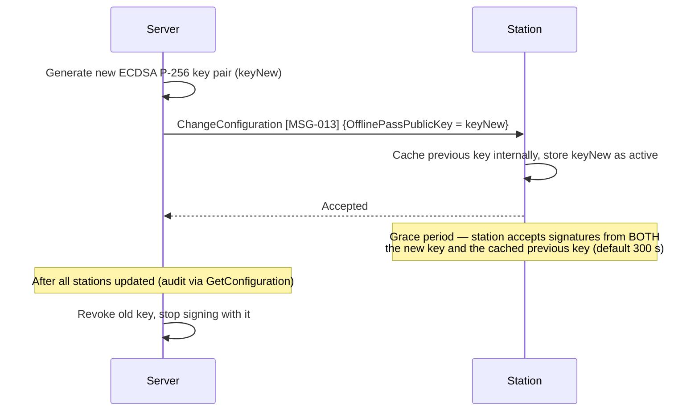

# Chapter 06 — Security

> **Status:** Draft | **OSPP Version:** 0.1.0-draft.1

This chapter defines the complete security model for the OSPP protocol, covering threat analysis, authentication, authorization, cryptographic requirements, message integrity, offline security, anti-abuse mechanisms, and data protection.

The keywords **MUST**, **MUST NOT**, **REQUIRED**, **SHALL**, **SHALL NOT**, **SHOULD**, **SHOULD NOT**, **RECOMMENDED**, **MAY**, and **OPTIONAL** in this document are to be interpreted as described in [RFC 2119](https://www.rfc-editor.org/rfc/rfc2119) and [RFC 8174](https://www.rfc-editor.org/rfc/rfc8174).

For message references, see [Chapter 03 — Message Catalog](03-messages.md). Messages are referenced as **[MSG-XXX]**.

---

## 1. Threat Model

OSPP operates in a **hostile physical environment** — self-service points are deployed in public spaces, communicate over untrusted networks, and must handle financial transactions both online and offline. This section enumerates the threats specific to this domain and maps each to the countermeasures defined in subsequent sections.

### 1.1 Threat Summary

| ID | Threat | Impact | Severity | Countermeasure |
|:--:|--------|--------|:--------:|----------------|
| T01 | [Replay Attack](#t01---replay-attack) | Duplicate service activation or credit deduction | High | §5.3 HMAC with messageId, §6.3 monotonic counter |
| T02 | [Man-in-the-Middle](#t02---man-in-the-middle) | Eavesdrop or modify station commands | Critical | §2.1 mTLS (TLS 1.3), §5 HMAC-SHA256 |
| T03 | [Credit Fraud / Double-Spend](#t03---credit-fraud--double-spend) | Unauthorized service without payment | Critical | §6.1 OfflinePass limits, §6.2 signed receipts with txCounter, §6.6 epoch revocation, §7.4 fraud scoring |
| T04 | [Unauthorized Station Access](#t04---unauthorized-station-access) | Rogue station impersonation or topic hijacking | Critical | §2.1 mTLS + CN-based ACL, §4.2 PKI |
| T05 | [Session Hijacking](#t05---session-hijacking) | Take over another user's session | High | §2.2 JWT short-lived, §2.3 session token UUID, §5 HMAC |
| T06 | [Offline Abuse](#t06---offline-abuse) | Exploit offline mode for unlimited free services | High | §6.1-§6.6 OfflinePass constraints, §7.4 fraud detection |
| T07 | [Payment Fraud](#t07---payment-fraud) | Bypass payment via forged webhooks or repeated attempts | High | §2.5 HMAC-SHA512 webhook, §7.3 anti-abuse layers |
| T08 | [Firmware Tampering](#t08---firmware-tampering) | Install malicious firmware to bypass security | Critical | §4.6 firmware code-signing, §4.5 secure storage, A/B rollback, SecurityEvent [MSG-012] |
| T09 | [Physical Tampering](#t09---physical-tampering) | Access internal components, extract keys | Critical | §4.5 secure element, tamper detection, SecurityEvent [MSG-012] |
| T10 | [Certificate Compromise](#t10---certificate-compromise) | Impersonate a station after private key extraction | Critical | §4.3 CRL/OCSP, on-device key generation, §4.5 secure storage |
| T11 | [Webhook Spoofing](#t11---webhook-spoofing) | Forge payment confirmations | High | §2.5 HMAC-SHA512 + IP whitelist + timing-safe comparison |
| T12 | [BLE Eavesdropping](#t12---ble-eavesdropping) | Intercept offline pass or session data over-the-air | Medium | §6.4 LESC encryption (AES-CCM-128), §6.5 session key HKDF |
| T13 | [Denial of Service](#t13---denial-of-service) | Station becomes unresponsive to legitimate users | High | §7.1 rate limiting, BLE connection throttling, MQTT message rate cap |

### T01 - Replay Attack

**Description:** An attacker captures a valid MQTT message or BLE message and retransmits it to trigger duplicate actions (e.g., replay a StartService to get a free service, replay a TransactionEvent to double-charge a user).

**Countermeasures:**
- Every MQTT message carries a unique `messageId` (UUID v4). Receivers maintain a deduplication window (last 1000 IDs or 1 hour) and reject duplicates (see [Chapter 02](02-transport.md), §3.3).
- HMAC-SHA256 binds the `messageId` and `timestamp` to the session key — replayed messages with old timestamps are detectable.
- BLE OfflineAuthRequest [MSG-031] includes a **monotonic counter** that MUST be strictly greater than the last seen counter; replaying an old counter value triggers error `2005 OFFLINE_COUNTER_REPLAY`.
- BLE session keys are derived per-handshake from fresh nonces (HKDF-SHA256), so captured messages from a previous session are invalid.

### T02 - Man-in-the-Middle

**Description:** An attacker intercepts the network path between the station and broker (or between the app and server) to eavesdrop, modify, or inject messages.

**Countermeasures:**
- **TLS 1.3 mandatory** on all MQTT and HTTPS connections; no fallback to TLS 1.2. 0-RTT MUST NOT be used (replay risk).
- **mTLS** (mutual TLS) — both the station and broker present X.509 certificates. The station verifies the broker's certificate, and the broker verifies the station's certificate, preventing impersonation on either side.
- **HMAC-SHA256 defense-in-depth** — even if TLS were compromised, message tampering is detectable via the MAC field.
- **BLE LE Secure Connections** (LESC) with AES-CCM-128 encryption prevents over-the-air interception.

### T03 - Credit Fraud / Double-Spend

**Description:** A malicious user or device attempts to obtain service without payment, or to spend the same credits multiple times (especially in offline mode where real-time balance checks are not possible).

**Countermeasures:**
- **OfflinePass** (see §6.1) enforces hard limits: `maxTotalCredits`, `maxUses`, `maxCreditsPerTx`, `allowedServiceTypes` (see §6.1).
- **Epoch-based revocation** (§6.6) — incrementing the global `RevocationEpoch` invalidates ALL passes issued before that epoch. Constant-time check on station; no CRL distribution required.
- **ECDSA P-256 signed receipts with txCounter** (§6.2) — stations cryptographically sign every transaction including a monotonic counter. Counter gaps trigger fraud alerts. Unsigned or incorrectly signed transactions are flagged as CRITICAL.
- **Fraud scoring** (§7.4) — post-reconciliation scoring with automatic response (disable offline, revoke pass, block user).

### T04 - Unauthorized Station Access

**Description:** A rogue device impersonates a legitimate station to receive commands, intercept session data, or inject fake telemetry.

**Countermeasures:**
- **mTLS with CN-based ACL** — the broker verifies the station's X.509 certificate and enforces that CN = `stn_{station_id}`. A station can ONLY subscribe to its own `to-station` topic and publish to its own `to-server` topic.
- **Private keys generated on-device** (§4.5) — TLS and ECDSA private keys never leave the station. Even the provisioning server never sees the private key.
- **CRL/OCSP revocation** — compromised certificates are revoked and rejected by the broker.

### T05 - Session Hijacking

**Description:** An attacker takes over another user's active session to control the service (start/stop) or receive their receipts.

**Countermeasures:**
- **JWT access tokens** (§2.2) expire in 15 minutes, limiting the window of a stolen token.
- **Web payment session tokens** (§2.3) are UUID v4, 10-minute TTL, stored in Redis (not cookies or localStorage), and scoped to a single payment flow.
- **MQTT session isolation** — each station's messages flow through its own topic pair. There is no station-to-station communication.

### T06 - Offline Abuse

**Description:** A user exploits offline mode to obtain unlimited free services — e.g., by modifying the OfflinePass, replaying passes, or using a pass after it has been revoked.

**Countermeasures:**
- **10-check OfflinePass validation** (§6.1) performed by the station: signature, expiry, epoch, device binding, limits, interval, and counter.
- **Monotonic counter** — prevents replay of the same pass data.
- **Per-pass constraints**: `maxUses`, `maxTotalCredits`, `maxCreditsPerTx`, `minIntervalSec`, `stationOfflineWindowHours`, `stationMaxOfflineTx`.
- **Epoch revocation** — one server-side increment invalidates all outstanding passes.
- **Negative wallet balance allowed** during reconciliation — the user is charged even if their balance goes negative (collected as debt).

### T07 - Payment Fraud

**Description:** Attacker forges payment webhooks, exploits the web payment flow to lock bays without paying, or performs card testing attacks.

**Countermeasures:**
- **HMAC-SHA512 webhook verification** (§2.5) with timing-safe comparison.
- **IP whitelist** — only payment processor IPs are accepted for webhook endpoints.
- **5-layer anti-abuse** (§7.3): IP rate limiting, device fingerprinting, progressive CAPTCHA, abandon scoring, and bay-lock-at-payment-only.

### T08 - Firmware Tampering

**Description:** Attacker installs modified firmware to bypass security checks, disable offline validation, or exfiltrate keys.

**Countermeasures:**
- **ECDSA P-256 firmware code-signing** — see §4.6.
- **SHA-256 checksum verification** before installation.
- **A/B partition scheme** with automatic rollback on failed self-test.
- **FirmwareIntegrityFailure** SecurityEvent [MSG-012] on checksum mismatch or signature failure.
- Firmware URL uses HTTPS — binary is integrity-protected in transit.

### T09 - Physical Tampering

**Description:** Attacker opens the station enclosure to access the hardware, extract keys from storage, or modify the hardware.

**Countermeasures:**
- **Secure element / TPM** for private key storage (§4.5) — keys are non-extractable.
- **Tamper detection switch** — enclosure opening triggers `TamperDetected` SecurityEvent [MSG-012] (severity: Critical).
- **Encrypted NVS** — even if storage is accessed, data is encrypted at rest.

### T10 - Certificate Compromise

**Description:** Station's TLS private key is extracted (e.g., via physical access or firmware exploit), allowing impersonation.

**Countermeasures:**
- **On-device key generation** — private keys are generated on the station's secure element and never transmitted.
- **CRL/OCSP revocation** — compromised certificates are revoked; the broker rejects connections from revoked certificates.
- **Certificate renewal alerts** — background job alerts when a certificate is within 30 days of expiry.

### T11 - Webhook Spoofing

**Description:** Attacker sends forged payment webhooks to trigger service activation without actual payment.

**Countermeasures:**
- **HMAC-SHA512** signature verification (`X-PG-Signature` header).
- **Timing-safe comparison** prevents timing attacks on HMAC verification.
- **IP whitelist** — only traffic from payment processor IP ranges is accepted.
- **Idempotency** — duplicate webhooks for the same payment are safely ignored.

### T12 - BLE Eavesdropping

**Description:** Attacker within BLE range captures over-the-air traffic to steal OfflinePass data or session credentials.

**Countermeasures:**
- **LE Secure Connections** (LESC) with AES-CCM-128 encryption — all BLE traffic is encrypted.
- **Per-session key derivation** via HKDF-SHA256 (§6.5) — even if one session key is compromised, others are not affected.
- **Station limits concurrent BLE connections** to 1 (configurable up to 3), reducing the attack surface.

### T13 - Denial of Service

**Description:** Attacker floods the station with BLE connection requests, malformed MQTT messages, or rapid connect/disconnect cycles, rendering it unresponsive to legitimate users.

**Countermeasures:**
- Station **SHOULD** implement rate limiting on BLE connections (max 5 connection attempts per 30 seconds per device, max 20 total per minute).
- Station **SHOULD** implement MQTT message rate limiting (max 100 messages per second; excess messages logged and dropped).
- Station **SHOULD** implement connection rate limiting (max 3 MQTT reconnection attempts per minute from same IP, if detectable).
- Broker **SHOULD** enforce per-client rate limits: max 100 PUBLISH/minute per station. Excess messages **SHOULD** be dropped with MQTT DISCONNECT reason code `0x96` (Message rate too high). This default assumes ≤4 bays with standard `MeterValuesInterval` (15s). Operators deploying stations with more bays or `MeterValuesInterval` below 10 seconds **SHOULD** increase this limit proportionally (recommended formula: `bays × 60/MeterValuesInterval + 20` overhead).
- Station **SHOULD** implement exponential backoff on repeated failures (initial delay 1 second, max delay 60 seconds, jitter ±20%).
- Server **SHOULD** monitor for anomalous traffic patterns (message frequency spikes, unusual topic access) and alert operators.

---

## 2. Authentication Mechanisms

OSPP uses **channel-specific authentication** — each communication channel has its own authentication mechanism appropriate to its threat model and operational constraints. The active security profile is configurable via `SecurityProfile` (see §8 Configuration).

### 2.1 Station ↔ Server — Mutual TLS (mTLS)

| Property | Value |
|----------|-------|
| **Protocol** | TLS 1.3 ([RFC 8446](https://www.rfc-editor.org/rfc/rfc8446)) |
| **Authentication** | Mutual — both station and broker present X.509 certificates |
| **Station Certificate CN** | `stn_{station_id}` (e.g., `stn_a1b2c3d4`) |
| **Applies to** | MQTT (port 8883), Station REST fallback (mTLS) |

**Requirements:**
- The station MUST present a valid X.509 client certificate signed by the OSPP Station CA.
- The broker MUST verify the station certificate against the OSPP trust chain (Root CA → Station CA → Station Cert).
- The station MUST verify the broker's server certificate.
- The broker MUST extract the CN from the client certificate and use it for **topic ACL enforcement** (see §3.3).
- TLS session resumption is RECOMMENDED for reconnection performance. **0-RTT MUST NOT be used** (replay risk).

**TLS 1.3 cipher suites** (in preference order):

| Priority | Cipher Suite |
|:--------:|--------------|
| 1 | `TLS_AES_256_GCM_SHA384` |
| 2 | `TLS_CHACHA20_POLY1305_SHA256` |
| 3 | `TLS_AES_128_GCM_SHA256` |

**Key exchange groups:** X25519 (preferred), secp256r1.

### 2.2 User ↔ Server — JWT (Mobile App)

| Property | Value |
|----------|-------|
| **Protocol** | HTTPS REST |
| **Header** | `Authorization: Bearer {access_token}` |
| **Access Token** | ES256 (ECDSA P-256), 15-minute expiry |
| **Refresh Token** | ES256 (ECDSA P-256), 30-day expiry, one-time-use, server-stored, revocable |

**Access token payload:**

| Claim | Type | Description |
|-------|------|-------------|
| `sub` | string | User identifier (`sub_{uuid}`) |
| `email` | string | User email |
| `iat` | integer | Issued-at timestamp (Unix epoch) |
| `exp` | integer | Expiration timestamp (Unix epoch) |

**Requirements:**
- Access tokens MUST be short-lived (15 minutes).
- Refresh tokens MUST be one-time-use — each refresh generates a new refresh token and invalidates the old one.
- Refresh tokens MUST be stored server-side (Redis or database) and revocable.
- The server MUST reject expired access tokens with `401 Unauthorized`.
- The server MUST reject revoked or reused refresh tokens with `401 Unauthorized` and SHOULD invalidate all sessions for that user (refresh token reuse indicates compromise).

### 2.3 User ↔ Server — Session Token (Web Payment)

| Property | Value |
|----------|-------|
| **Protocol** | HTTPS REST |
| **Token** | UUID v4 in URL path (e.g., `/pay/sessions/{sessionToken}/status`) |
| **TTL** | 10 minutes |
| **Storage** | Redis with TTL |
| **Scope** | Single payment flow only |

**Requirements:**
- Session tokens MUST be UUID v4 (122 bits of entropy).
- Tokens MUST NOT be stored in cookies, localStorage, or sessionStorage (URL-only).
- Tokens MUST expire after 10 minutes.
- Tokens MUST be scoped to a single station + bay + service combination.
- The server MUST invalidate the token after the session completes.
- **CORS policy:** `https://pay.{domain}` only — no wildcard origins.

### 2.4 User ↔ Station — BLE Challenge-Response

| Property | Value |
|----------|-------|
| **Protocol** | BLE GATT |
| **Mechanism** | HELLO/CHALLENGE handshake + OfflinePass or ServerSignedAuth |
| **Encryption** | LE Secure Connections (AES-CCM-128) |

**Authentication flows** (see [Chapter 04 — Flows](04-flows.md), §5a/b/c):

| Scenario | Auth Message | Validation |
|----------|-------------|------------|
| Full Offline | OfflineAuthRequest [MSG-031] | Station validates ECDSA P-256 signature + 10 checks locally |
| Partial A (phone online) | ServerSignedAuth [MSG-032] | Station verifies ECDSA P-256 server signature |
| Partial B (station online) | OfflineAuthRequest [MSG-031] | Station forwards to server via AuthorizeOfflinePass [MSG-002] |

**Handshake security:**
- Fresh nonces (32 bytes) on every handshake (app nonce + station nonce) prevent replay.
- Session key derived via HKDF-SHA256 (§6.5) binds the handshake to the specific BLE connection.
- `sessionProof` in OfflineAuthRequest proves the sender possesses the derived session key.

### 2.5 Payment Processor → Server — HMAC-SHA512 Webhook

| Property | Value |
|----------|-------|
| **Protocol** | HTTPS POST (server-to-server) |
| **Endpoint** | `POST /webhooks/{processor}/payment` |
| **Signature Header** | `X-PG-Signature` (or processor-specific) |
| **Algorithm** | HMAC-SHA512 |

**Requirements:**
- The server MUST verify the HMAC-SHA512 signature using the processor's shared secret.
- Verification MUST use **timing-safe comparison** (constant-time) to prevent timing attacks.
- The server SHOULD enforce **IP whitelist** — only accept webhook traffic from known processor IP ranges.
- Duplicate webhooks (same payment ID) MUST be idempotently handled (do not double-credit or double-start).

### 2.6 Management Dashboard — JWT + RBAC + MFA

| Property | Value |
|----------|-------|
| **Protocol** | HTTPS |
| **Authentication** | JWT (same mechanism as §2.2) |
| **Authorization** | Role-Based Access Control (see §3.1) |
| **MFA** | TOTP (Time-based One-Time Password) REQUIRED for admin roles |

---

## 3. Authorization Model

### 3.1 RBAC Roles

OSPP defines 7 roles with scoped permissions:

| Role | Scope | Description |
|------|-------|-------------|
| **Platform Admin** | Global | Full access to all resources across all organizations |
| **Operator Admin** | All owned locations | Manage stations, bays, prices, sessions for their locations |
| **Location Manager** | Assigned locations | Bay status, maintenance mode, view sessions |
| **Accounting** | Financial data | View transactions, reports, issue refunds |
| **Corporate Admin** | Their organization | Manage vehicles, policy, view usage |
| **Support Agent** | Read + user actions | View sessions, issue refunds, assist users |
| **User** | Own data | Profile, wallet, sessions, vehicles, offline pass |

### 3.2 Per-Message Authorization

Each MQTT message has an implicit authorization based on its direction and the authenticated identity:

| Message | Authorized Sender | Verified By |
|---------|-------------------|-------------|
| BootNotification [MSG-001] | Station (via mTLS CN) | Server verifies CN matches `stationId` in payload |
| Heartbeat [MSG-008] | Station (via mTLS CN) | Server verifies topic matches CN |
| StatusNotification [MSG-009] | Station (via mTLS CN) | Server verifies `bayId` belongs to station |
| MeterValues [MSG-010] | Station (via mTLS CN) | Server verifies `sessionId` belongs to station |
| TransactionEvent [MSG-007] | Station (via mTLS CN) | Server verifies receipt signature |
| SecurityEvent [MSG-012] | Station (via mTLS CN) | Server logs unconditionally |
| StartService [MSG-005] | Server | Station verifies HMAC (session key) |
| StopService [MSG-006] | Server | Station verifies HMAC (session key) |
| ReserveBay [MSG-003] | Server | Station verifies HMAC (session key) |
| ChangeConfiguration [MSG-013] | Server | Station verifies HMAC (session key) |
| UpdateFirmware [MSG-016] | Server | Station verifies HMAC + checksum |
| All server→station commands | Server | Station MUST verify HMAC before execution |

### 3.3 MQTT Topic ACL

The MQTT broker MUST enforce topic-level access control based on the client certificate CN:

| Client | Subscribe | Publish | Deny |
|--------|-----------|---------|------|
| Station `stn_X` | `ospp/v1/stations/stn_X/to-station` | `ospp/v1/stations/stn_X/to-server` | All other topics |
| Server | `$share/ospp-servers/ospp/v1/stations/+/to-server` | `ospp/v1/stations/+/to-station` | All other topics |

**Rules:**
- A station MUST NOT subscribe to another station's topics.
- A station MUST NOT publish to another station's topics.
- ACL enforcement MUST be at the broker level, based on the mTLS client certificate CN.
- ACL violations MUST be logged by the broker and SHOULD trigger a SecurityEvent [MSG-012].

### 3.4 REST API Authorization

| Endpoint Group | Required Role | Auth Method |
|----------------|--------------|-------------|
| `/sessions/*` | User | JWT Bearer |
| `/wallet/*` | User | JWT Bearer |
| `/me/*` | User | JWT Bearer |
| `/pay/*` | Anonymous | Session token (UUID) |
| `/admin/stations/*` | Operator Admin+ | JWT Bearer + RBAC |
| `/admin/users/*` | Support Agent+ | JWT Bearer + RBAC |
| `/webhooks/*` | Payment Processor | HMAC-SHA512 signature |
| `/station/{id}/offline-txs` | Station | mTLS certificate |
| `/station/{id}/config` | Station | mTLS certificate |
| `/api/v1/stations/provision` | Station (unprovisioned) | Provisioning token |

---

## 4. Cryptographic Requirements

### 4.1 Algorithm Inventory

| # | Key / Operation | Algorithm | Key Size | Standard | Purpose |
|:-:|-----------------|-----------|:--------:|----------|---------|
| 1 | TLS transport | TLS 1.3 | — | RFC 8446 | Channel encryption (all connections) |
| 2 | Station TLS cert | ECDSA P-256 | 256 bit | X.509 v3 | mTLS authentication |
| 3 | MQTT HMAC session key | HMAC-SHA256 | 256 bit (32 bytes) | FIPS 198-1 | Per-boot message integrity (selective — see §5) |
| 4 | OfflinePass signing | ECDSA P-256 (RFC 6979) | 256 bit | FIPS 186-4, RFC 6979 | Server signs offline authorization |
| 5 | Receipt signing | ECDSA P-256 (RFC 6979) | 256 bit | FIPS 186-4, RFC 6979 | Station signs transaction receipts (includes txCounter) |
| 6 | BLE session key | HKDF-SHA256 | 256 bit (32 bytes) | RFC 5869 | Per-handshake BLE session key |
| 7 | BLE encryption | AES-CCM-128 | 128 bit | BLE 4.2 LESC | BLE over-the-air encryption |
| 8 | Webhook verification | HMAC-SHA512 | 512 bit | FIPS 198-1 | Payment webhook integrity |
| 9 | JWT signing | ES256 (ECDSA P-256) | 256 bit | RFC 7518 | Access/refresh token signing |
| 10 | Root CA | ECDSA P-384 | 384 bit | X.509 v3 | Trust anchor (offline, air-gapped) |

> **Note:** All software-based ECDSA signing operations **MUST** use **RFC 6979** deterministic nonce generation. This eliminates the catastrophic failure mode where a reused or weak random nonce leaks the private key. Hardware secure elements (e.g., ATECC608B) that use internal hardware RNG for nonce generation are exempt from this requirement, as hardware RNG prevents software nonce reuse.

**Deprecated/prohibited algorithms:**
- MD5 — MUST NOT be used anywhere
- SHA-1 — MUST NOT be used for signatures or HMAC
- TLS 1.2 or earlier — MUST NOT be used
- RC4, DES, 3DES — MUST NOT be used
- RSA key exchange (non-PFS) — MUST NOT be used
- Ed25519 — MUST NOT be used (replaced by ECDSA P-256 for secure element compatibility)
- RSA (any key size) — MUST NOT be used for station certificates or signing operations (replaced by ECDSA P-256/P-384)

### 4.2 PKI Architecture

```
OSPP Root CA (ECDSA P-384, OFFLINE, air-gapped HSM, 20-year validity)
  └── OSPP Station CA (ECDSA P-256, online HSM, 5-year validity)
        ├── stn_a1b2c3d4.pem (ECDSA P-256, 1-year validity)
        ├── stn_e5f6a7b8c9d0.pem (ECDSA P-256, 1-year validity)
        └── ... (one certificate per station)

Server Signing Key (ECDSA P-256, server-side HSM)
  └── OfflinePass signatures
  └── ServerSignedAuth (Partial A)
```

| CA Level | Algorithm | Validity | Storage | Purpose |
|----------|-----------|:--------:|---------|---------|
| Root CA | ECDSA P-384 | 20 years | Air-gapped HSM | Signs Station CA only |
| Station CA | ECDSA P-256 | 5 years | Online HSM | Signs station certificates |
| Station Cert | ECDSA P-256 | 1 year | Station secure element | mTLS authentication + receipt signing |
| Server Signing Key | ECDSA P-256 | Annual rotation | Server HSM / Vault | OfflinePass + ServerSignedAuth signing |

**Trust distribution:**
- Root CA public certificate is embedded in station firmware and server trust store.
- Station CA public certificate is distributed during provisioning.
- Station certificates are issued during provisioning ([Flow §2](04-flows.md#2-station-provisioning)).
- Server signing public key is distributed via provisioning and ChangeConfiguration [MSG-013].

### 4.3 Key Management Lifecycle

#### Station TLS Key Pair

| Phase | Action |
|-------|--------|
| **Generation** | On-device during provisioning (private key NEVER leaves the station) |
| **Storage** | Secure element, TPM, or encrypted NVS |
| **Renewal** | Station generates new CSR; server signs via Station CA. Background alert when cert < 30 days to expiry. |
| **Revocation** | CRL published by Station CA (checked by MQTT broker). OCSP RECOMMENDED. |
| **Rotation** | Annual (1-year certificate validity) |

#### HMAC Session Key (per-boot)

| Phase | Action |
|-------|--------|
| **Generation** | Server generates 32 random bytes at BootNotification `Accepted` |
| **Distribution** | Sent in BootNotification RESPONSE [MSG-001] `sessionKey` field (protected by TLS) |
| **Storage** | Station: volatile memory (RAM). Server: in-memory session store. |
| **Lifetime** | One MQTT session (from boot to disconnect) |
| **Rotation** | Automatic on every reconnection (new BootNotification → new key) |

#### Server ECDSA P-256 Key (OfflinePass + ServerSignedAuth signing)

| Phase | Action |
|-------|--------|
| **Generation** | Server generates ECDSA P-256 key pair (RFC 6979 deterministic nonces for signing) |
| **Distribution** | Public key sent to stations via provisioning and ChangeConfiguration [MSG-013] |
| **Storage** | Private: server HSM / Vault. Public: station NVS (`OfflinePassPublicKey`). |
| **Rotation** | Annual. See §6.7 for the rotation protocol. |

#### Station ECDSA P-256 Key (mTLS + Receipt signing)

| Phase | Action |
|-------|--------|
| **Generation** | On-device during provisioning (private key NEVER leaves the station) |
| **Distribution** | Public key sent to server during provisioning; also used as TLS client cert |
| **Storage** | Station secure element (non-extractable). ATECC608B fully supports ECDSA P-256. |
| **Rotation** | Annual (new key pair generated, public key re-registered with server, new TLS cert issued) |

### 4.4 Certificate Requirements

Station certificates MUST comply with:

| Field | Requirement |
|-------|-------------|
| Version | X.509 v3 |
| Subject CN | `stn_{station_id}` (e.g., `stn_a1b2c3d4`). Current serial number available via read-only key `CertificateSerialNumber` (see §8 Configuration). |
| Key Algorithm | ECDSA P-256 |
| Signature Algorithm | ECDSA with SHA-256 (minimum) or SHA-384 |
| Validity | Maximum 1 year (RECOMMENDED) |
| Key Usage | digitalSignature |
| Extended Key Usage | clientAuth |
| Subject Alternative Name | OPTIONAL (DNS name or IP of station) |
| CRL Distribution Points | REQUIRED (URL to CRL published by Station CA) |
| Authority Info Access | RECOMMENDED (OCSP responder URL) |

If a TLS certificate expires during an active MQTT session, the TLS connection will terminate at the next renegotiation or keepalive. The station treats this as a standard connection loss and follows the reconnection procedure in [Chapter 02 — Transport](02-transport.md), §4.4.

### 4.7 Certificate Lifecycle Management

Certificate renewal enables stations to obtain new TLS certificates before their current certificates expire, without requiring physical access or manual provisioning. The protocol is inspired by OCPP 2.0.1 Security Profile 3 certificate management, adapted to the OSPP architecture.

Three MQTT messages support the certificate lifecycle:

| Message | Direction | Purpose |
|---------|-----------|---------|
| SignCertificate [MSG-022] | Station → Server | Station submits a PKCS#10 CSR for signing |
| CertificateInstall [MSG-023] | Server → Station | Server delivers the signed certificate and CA chain |
| TriggerCertificateRenewal [MSG-024] | Server → Station | Server instructs the station to initiate renewal |

#### 4.7.1 Automatic Renewal

The station **SHOULD** initiate certificate renewal automatically when the current certificate is within `CertificateRenewalThresholdDays` (default: 30 days, configurable 7–90) of expiry. See [Chapter 08 — Configuration](08-configuration.md), §4.

**Automatic renewal flow:**

1. Station generates a new ECDSA P-256 keypair on-device (the private key **MUST NOT** leave the station)
2. Station creates a PKCS#10 CSR with Subject CN = `stn_{station_id}`
3. Station sends the CSR via SignCertificate REQUEST [MSG-022]
4. Server validates the CSR (correct format, CN matches mTLS station ID, ECDSA P-256)
5. Server forwards the CSR to the Certificate Authority
6. CA signs the certificate and returns it to the server
7. Server delivers the signed certificate (and optionally the CA chain) via CertificateInstall REQUEST [MSG-023]
8. Station validates the certificate chain, CN match, key usage, and validity period
9. Station installs the certificate to its secure element, TPM, or encrypted NVS
10. Station updates the `CertificateSerialNumber` configuration key
11. On the next TLS reconnection, the station uses the new certificate

#### 4.7.2 Server-Triggered Renewal

The server **MAY** trigger a certificate renewal at any time using TriggerCertificateRenewal [MSG-024]. Use cases include:

- The server detects an approaching expiry that the station has not yet addressed
- The CA has been rotated and all station certificates need reissuing
- A certificate has been compromised and must be replaced immediately

Upon receiving a TriggerCertificateRenewal REQUEST, the station responds with `Accepted` and initiates the automatic renewal flow (steps 1–11 above).

#### 4.7.3 Emergency Renewal

| Days to Expiry | Priority | Behavior |
|:-:|:---:|---|
| > 30 | Normal | Station checks daily. No action unless server-triggered. |
| 7–30 | Elevated | Station initiates automatic renewal. Server logs a background alert. |
| < 7 | High | Station initiates renewal immediately. Server sends TriggerCertificateRenewal if station has not already started. Server alerts operator. |
| 0 (expired) | Emergency | Certificate has expired. Station enters offline-only mode (BLE). Recovery requires server-triggered renewal over an existing session or physical re-provisioning. |

#### 4.7.4 Failure Handling

- **CSR Rejected:** Station retries once after 60 seconds. If retry fails, log SecurityEvent with `type: CertificateError`.
- **Certificate Installation Failed:** Station continues using current certificate and reports CertificateInstall RESPONSE with `status: Rejected`.
- **CA Unreachable:** Server responds to SignCertificate with `status: Accepted` (acknowledging receipt), retries internally. Alerts operator after 24 hours.
- **Keypair Generation Failed:** Station rejects TriggerCertificateRenewal with error `4014 KEYPAIR_GENERATION_FAILED` and logs SecurityEvent with `type: HardwareFault`.

#### 4.7.5 Certificate Renewal Security Requirements

- The station **MUST** generate the new private key on-device. The private key **MUST NOT** be transmitted to the server or included in the CSR.
- The CSR **MUST** use ECDSA P-256. Other algorithms **MUST** be rejected by the server.
- The server **MUST** verify that the CSR's Subject CN matches the station ID from the mTLS session.
- All three certificate lifecycle messages **MUST** be HMAC-signed in `Critical` and `All` modes (see §5.6).
- The station **SHOULD** keep the old certificate until the new certificate is successfully used for a TLS connection.

For the complete certificate renewal profile, see [Certificate Renewal](profiles/security/certificate-renewal.md).

### 4.5 Key Storage Requirements

- Private keys (TLS, ECDSA) MUST be stored in a **secure element**, TPM, or TEE if available.
- If no hardware security module is available, keys MUST be stored in **encrypted NVS** with access controls.
- Keys MUST NOT be:
  - Logged in any log file
  - Included in diagnostics uploads (GetDiagnostics [MSG-018])
  - Transmitted in plaintext over any channel
  - Accessible to unprivileged firmware components
- The HMAC session key MUST be stored in **volatile memory only** (RAM) — it MUST NOT be persisted to non-volatile storage.

### 4.6 Firmware Code-Signing

Firmware images **MUST** be cryptographically signed by the manufacturer or operator using ECDSA P-256. The station **MUST** verify the firmware signature against a trusted signing certificate before installation. SHA-256 checksum verification alone is **NOT** sufficient — it protects against corruption but not against malicious replacement.

**Firmware signing certificate chain:**

```
Operator / Manufacturer Root CA
  └── Firmware Signing Certificate (ECDSA P-256, annual rotation)
        └── Signs each firmware image
```

The station validates the firmware signature against a pre-provisioned Firmware Signing Certificate (or its CA) stored in the station's secure element or encrypted NVS.

The UpdateFirmware [MSG-016] message **MUST** include a `signature` field containing the Base64-encoded ECDSA P-256 signature of the firmware image. If the signature is invalid, the station **MUST** reject the update with error `5112 FIRMWARE_SIGNATURE_INVALID` and send a `FirmwareIntegrityFailure` SecurityEvent [MSG-012].

#### 4.6.1 Anti-Downgrade Protection

The station **SHOULD** reject firmware updates where the offered `firmwareVersion` is older than the currently installed version (downgrade). If a downgrade is rejected, the station **MUST** respond with error `5016 VERSION_ALREADY_INSTALLED` and log a SecurityEvent [MSG-012] with `type: FirmwareDowngradeAttempt`.

To support legitimate rollback scenarios (e.g., reverting a faulty update), the server **MAY** include a `forceDowngrade` flag in the UpdateFirmware request. When `forceDowngrade` is `true`, the station **SHOULD** accept the older version after signature verification. The station **MUST** log a `FirmwareDowngradeAttempt` SecurityEvent regardless of whether the downgrade is forced or not.

#### 4.6.2 Unrecoverable Firmware Failure

If firmware installation fails and rollback to the previous version also fails, the station **MUST** enter `Faulted` state, send a SecurityEvent [MSG-012] with `type: FirmwareIntegrityFailure` and `severity: Critical`, and await manual intervention via physical access. The station **MUST NOT** attempt to continue normal operation with potentially corrupted firmware.

---

## 5. Message Integrity — HMAC-SHA256

### 5.1 Overview

The `MessageSigningMode` configuration key controls HMAC-SHA256 message signing. Three modes are defined:

| Mode | Behavior | Use Case |
|------|----------|----------|
| `All` | HMAC on every MQTT message | High-security deployments |
| `Critical` **(default)** | HMAC only on financial and command messages (see §5.6) | Production deployments |
| `None` | No HMAC — TLS-only integrity | Development/testing |

When `MessageSigningMode` is `Critical` or `All`, applicable MQTT messages MUST include an HMAC-SHA256 message authentication code in the `mac` envelope field. This provides **defense-in-depth** — message integrity protection independent of TLS.

> **Rationale for selective signing:** The MQTT broker terminates TLS on both sides (Server↔Broker and Broker↔Station are separate TLS sessions). A compromised broker sees plaintext. HMAC protects against broker compromise — a real threat for financial and command messages. However, high-frequency informational messages (Heartbeat, StatusNotification, MeterValues) have zero financial impact, and signing them adds CPU overhead with no security value.

### 5.2 Session Key Establishment

1. Station sends BootNotification REQUEST [MSG-001] (exempt from signing — no key yet)
2. Server generates a cryptographically random 32-byte key
3. Server includes `sessionKey` (Base64-encoded) in the BootNotification RESPONSE [MSG-001]
4. The session key is protected in transit by TLS 1.3 encryption
5. Both sides store the key in volatile memory for the duration of the MQTT session

### 5.3 Canonical Form

To compute the HMAC, the message MUST first be reduced to **canonical form**:

1. Take the complete message JSON object
2. **Remove** the `mac` field if present
3. **Sort all keys** alphabetically at every nesting level (recursive)
4. Serialize as **compact JSON** (no whitespace)
5. Encode as **UTF-8** bytes

**Example:**

Original message:
```json
{
  "protocolVersion": "0.1.0",
  "messageId": "cmd_550e8400",
  "action": "StartService",
  "timestamp": "2026-01-30T12:00:00.000Z",
  "source": "Server",
  "messageType": "Request",
  "payload": { "serviceId": "svc_eco", "bayId": "bay_c1d2e3f4a5b6" },
  "mac": "will-be-removed"
}
```

Canonical form (sorted keys, no `mac`, compact):
```
{"action":"StartService","messageId":"cmd_550e8400","messageType":"Request","payload":{"bayId":"bay_c1d2e3f4a5b6","serviceId":"svc_eco"},"protocolVersion":"0.1.0","source":"Server","timestamp":"2026-01-30T12:00:00.000Z"}
```

### 5.4 MAC Computation

```
mac = Base64(HMAC-SHA256(sessionKey, UTF8(canonical_json)))
```

The computed `mac` string is placed in the top-level `mac` field of the message envelope before transmission.

### 5.5 Verification

The receiver MUST verify the MAC before processing the payload:

1. Extract and remove the `mac` field from the received message
2. Compute the canonical form of the remaining message
3. Compute `expected_mac = HMAC-SHA256(sessionKey, canonical_bytes)`
4. Compare `expected_mac` with the received `mac` using **timing-safe comparison** (constant-time)
5. If the comparison fails → reject the message

**Critical:** Implementations MUST use constant-time comparison to prevent timing attacks. Language-specific examples:
- Python: `hmac.compare_digest()`
- Node.js: `crypto.timingSafeEqual()`
- C: `CRYPTO_memcmp()` (OpenSSL)

### 5.6 Message Signing Classification

#### Mode `All`

All MQTT messages MUST include a valid `mac` field, except BootNotification REQUEST and ConnectionLost (exempt — see below).

#### Mode `Critical` (default)

Messages are classified as **critical** (HMAC required) or **exempt** (HMAC not required) based on their financial impact, command authority, and state-changing potential:

| # | Action | Direction | HMAC Required | Rationale |
|--:|--------|-----------|:---:|-----------|
| 1 | BootNotification REQ | Station → Server | **NO** | Informational. No HMAC key available yet (key is issued in the response). |
| 2 | BootNotification RES | Server → Station | **YES** | Contains HMAC session key and configuration. |
| 3 | AuthorizeOfflinePass REQ | Station → Server | **YES** | Auth decision — financial gate. |
| 4 | AuthorizeOfflinePass RES | Server → Station | **YES** | Auth verdict — controls resource access. |
| 5 | ReserveBay REQ | Server → Station | **YES** | Blocks physical resources. |
| 6 | ReserveBay RES | Station → Server | **YES** | Confirms resource allocation. |
| 7 | CancelReservation REQ | Server → Station | **YES** | Releases resources, triggers refund. |
| 8 | CancelReservation RES | Station → Server | **YES** | Confirms release. |
| 9 | StartService REQ | Server → Station | **YES** | Activates hardware. Direct financial impact. |
| 10 | StartService RES | Station → Server | **YES** | Confirms hardware activation. |
| 11 | StopService REQ | Server → Station | **YES** | Terminates service, triggers finalization. |
| 12 | StopService RES | Station → Server | **YES** | Confirms termination. |
| 13 | TransactionEvent REQ | Station → Server | **YES** | Financial record. |
| 14 | TransactionEvent RES | Server → Station | **YES** | Financial acknowledgement. |
| 15 | Heartbeat REQ | Station → Server | **NO** | Zero financial impact, high frequency. |
| 16 | Heartbeat RES | Server → Station | **NO** | Time sync only. |
| 17 | StatusNotification | Station → Server | **NO** | Informational, high frequency. |
| 18 | MeterValues | Station → Server | **NO** | Informational, high frequency. |
| 19 | ConnectionLost (LWT) | Broker → Server | **NO** | Broker-generated. Station cannot pre-sign. |
| 20 | SecurityEvent | Station → Server | **NO** | Station-originated report, not a command. |
| 21 | ChangeConfiguration REQ | Server → Station | **YES** | Modifies station behavior. |
| 22 | ChangeConfiguration RES | Station → Server | **YES** | Confirms configuration applied. |
| 23 | GetConfiguration REQ | Server → Station | **NO** | Read-only query. |
| 24 | GetConfiguration RES | Station → Server | **NO** | Read-only response. |
| 25 | Reset REQ | Server → Station | **YES** | Reboots station. Availability impact. |
| 26 | Reset RES | Station → Server | **YES** | Confirms reset accepted. |
| 27 | UpdateFirmware REQ | Server → Station | **YES** | Supply chain security critical. |
| 28 | UpdateFirmware RES | Station → Server | **YES** | Confirms update accepted. |
| 29 | FirmwareStatusNotification | Station → Server | **NO** | Informational progress. |
| 30 | GetDiagnostics REQ | Server → Station | **NO** | Non-financial. |
| 31 | GetDiagnostics RES | Station → Server | **NO** | Non-financial. |
| 32 | DiagnosticsNotification | Station → Server | **NO** | Informational progress. |
| 33 | SetMaintenanceMode REQ | Server → Station | **YES** | Changes operational state. |
| 34 | SetMaintenanceMode RES | Station → Server | **YES** | Confirms maintenance mode change. |
| 35 | UpdateServiceCatalog REQ | Server → Station | **YES** | Modifies pricing/services. |
| 36 | UpdateServiceCatalog RES | Station → Server | **YES** | Confirms catalog applied. |
| 37 | SignCertificate REQ | Station → Server | **YES** | Certificate material — security critical. |
| 38 | SignCertificate RES | Server → Station | **YES** | Certificate material — security critical. |
| 39 | CertificateInstall REQ | Server → Station | **YES** | Certificate material — security critical. |
| 40 | CertificateInstall RES | Station → Server | **YES** | Certificate material — security critical. |
| 41 | TriggerCertificateRenewal REQ | Server → Station | **YES** | Certificate management command. |
| 42 | TriggerCertificateRenewal RES | Station → Server | **YES** | Confirms renewal initiated. |
| 43 | DataTransfer REQ | Bidirectional | **NO** | Vendor data — not critical by default. Signed in `All` mode only. |
| 44 | DataTransfer RES | Bidirectional | **NO** | Vendor data response. Signed in `All` mode only. |
| 45 | TriggerMessage REQ | Server → Station | **YES** | Server command that triggers station behavior. |
| 46 | TriggerMessage RES | Station → Server | **YES** | Confirms trigger accepted. |

**Summary:** 31 of 46 message types require HMAC in `Critical` mode, 15 are exempt. The exempt messages (BootNotification REQ, Heartbeat, StatusNotification, MeterValues, ConnectionLost, SecurityEvent, GetConfiguration, GetDiagnostics, FirmwareStatusNotification, DiagnosticsNotification, DataTransfer) represent ~70% of message *volume* in normal operation.

#### Mode `None`

No messages require HMAC. TLS provides the only integrity protection. This mode is intended for development and testing only and **SHOULD NOT** be used in production.

#### Always-Exempt Messages

Regardless of `MessageSigningMode`, the following messages are always exempt:

| Message | Reason |
|---------|--------|
| BootNotification REQUEST [MSG-001] | Session key not yet established |
| ConnectionLost (LWT) [MSG-011] | Pre-configured at CONNECT time, published by broker |

### 5.7 Failure Handling

| Condition | Error Code | Action |
|-----------|------------|--------|
| `mac` field missing (signing enabled) | `1013 MAC_MISSING` | Reject message, log SecurityEvent [MSG-012] |
| `mac` verification fails | `1012 MAC_VERIFICATION_FAILED` | Reject message, log SecurityEvent [MSG-012] |
| 3+ MAC failures from same station in 60s | — | Flag station as potentially compromised, alert operator |

---

## 6. Offline Security

Offline mode introduces unique security challenges: the station cannot contact the server for real-time authorization, so cryptographic credentials must be validated locally. This section defines the complete offline security model.

### 6.1 OfflinePass Structure

The OfflinePass is a server-signed credential that authorizes offline service usage within strict constraints. It is issued to the mobile app while online and presented to the station via BLE [MSG-031].

#### Fields

| Field | Type | Description |
|-------|------|-------------|
| `passId` | string | Unique pass identifier (`opass_{uuid}`) |
| `sub` | string | User subject identifier (`sub_{uuid}`) |
| `deviceId` | string | Bound mobile device identifier |
| `issuedAt` | string | ISO 8601 UTC — when the pass was issued |
| `expiresAt` | string | ISO 8601 UTC — when the pass expires (max 24 hours from issuance) |
| `policyVersion` | integer | Policy version for backward compatibility |
| `revocationEpoch` | integer | Epoch at time of issuance (pass is invalid if station epoch is higher) |
| `offlineAllowance` | object | Spending limits — see below |
| `offlineAllowance.maxTotalCredits` | integer | Maximum total credits across all transactions |
| `offlineAllowance.maxUses` | integer | Maximum number of transactions |
| `offlineAllowance.maxCreditsPerTx` | integer | Maximum credits per single transaction |
| `offlineAllowance.allowedServiceTypes` | array | List of permitted service IDs |
| `constraints` | object | Operational constraints — see below |
| `constraints.minIntervalSec` | integer | Minimum seconds between transactions from this pass |
| `constraints.stationOfflineWindowHours` | integer | Max hours a station can be offline and still accept this pass |
| `constraints.stationMaxOfflineTx` | integer | Max offline transactions a station can accumulate |
| `signatureAlgorithm` | string | Signature algorithm identifier. MUST be `"ECDSA-P256-SHA256"` for v0.1. |
| `signature` | string | ECDSA P-256 signature over all fields above (Base64-encoded, RFC 6979 deterministic nonces) |

#### Example

```json
{
  "passId": "opass_a8b9c0d1e2f3",
  "sub": "sub_xyz789",
  "deviceId": "device_uuid_123",
  "issuedAt": "2026-02-05T10:00:00.000Z",
  "expiresAt": "2026-02-06T10:00:00.000Z",
  "policyVersion": 1,
  "revocationEpoch": 42,
  "offlineAllowance": {
    "maxTotalCredits": 100,
    "maxUses": 5,
    "maxCreditsPerTx": 30,
    "allowedServiceTypes": ["svc_eco", "svc_standard"]
  },
  "constraints": {
    "minIntervalSec": 60,
    "stationOfflineWindowHours": 72,
    "stationMaxOfflineTx": 100
  },
  "signatureAlgorithm": "ECDSA-P256-SHA256",
  "signature": "ECDSA-P256-base64-signature..."
}
```

### 6.1.1 OfflinePass Validation — 10 Checks

The station MUST perform all 10 checks when validating an OfflinePass locally (Full Offline scenario). If any check fails, the station MUST reject the pass with the corresponding error code.

> **Implementation note:** Before performing the checks below, implementations SHOULD validate structural integrity first (required fields present, correct types, valid base64 encoding of the signature). Rejecting malformed passes before the expensive ECDSA verification (check #1) mitigates denial-of-service via crafted payloads. Structural validation failures SHOULD use error code `2002 OFFLINE_PASS_INVALID`.

| # | Check | Error Code | Description |
|:-:|-------|:----------:|-------------|
| 1 | **ECDSA P-256 signature** | `2002` | Verify signature against the current `OfflinePassPublicKey` (or the internally cached previous key during the grace period; see §6.7) |
| 2 | **Expiry** | `2003` | `expiresAt` MUST be in the future |
| 3 | **Revocation epoch** | `2004` | `revocationEpoch` >= station's `RevocationEpoch` configuration value |
| 4 | **Device binding** | `2002` | `deviceId` MUST match the `deviceId` from the Hello [MSG-029] message |
| 5 | **Station restriction** | `2006` | If pass contains a station allowlist, this station MUST be in it |
| 6 | **Max uses** | `4002` | Number of transactions using this pass MUST be < `maxUses` |
| 7 | **Max total credits** | `4002` | Cumulative credits charged MUST be < `maxTotalCredits` |
| 8 | **Max per-tx credits** | `4004` | Requested service cost MUST be <= `maxCreditsPerTx` |
| 9 | **Min interval** | `4003` | Time since last transaction from this pass MUST be >= `minIntervalSec` |
| 10 | **Counter anti-replay** | `2005` | `counter` MUST be > `lastSeenCounter` for this pass on this station |

**Implementation note:** Implementations SHOULD perform structural and temporal checks before cryptographic verification to mitigate denial-of-service. The error code returned SHOULD correspond to the first failed check in the canonical order (1–10).

### 6.2 Transaction Receipt Signing — ECDSA P-256

Every offline transaction produces a cryptographically signed receipt, ensuring non-repudiation and tamper detection during reconciliation.

#### Signing Process

```
1. receipt_fields = {offlineTxId, bayId, serviceId, startedAt, endedAt,
                     durationSeconds, creditsCharged, meterValues, txCounter}
2. receipt_data  = canonical_json(receipt_fields)      // sorted keys, compact
3. data_bytes    = base64_encode(receipt_data)
4. digest        = SHA-256(data_bytes)
5. signature     = ECDSA-P256-Sign(station_private_key, digest)  // RFC 6979 deterministic nonces
6. receipt = {
     data:               base64(receipt_data),
     signature:          base64(signature),
     signatureAlgorithm: "ECDSA-P256-SHA256"
   }
```

> **Note:** The `txCounter` field is included in the signed receipt data to enable gap detection during reconciliation. The server can verify monotonically increasing counters and detect missing transactions (e.g., counter 5 → 7 indicates a missing transaction) without requiring a hash chain.

#### Verification (Server-Side)

During reconciliation ([Flow §10](04-flows.md#10-offline--online-reconciliation)), the server verifies each receipt:

1. Look up the station's ECDSA P-256 public key (received during provisioning)
2. Decode `receipt.data` from Base64
3. Compute `digest = SHA-256(receipt.data)`
4. Verify `receipt.signature` against `digest` using the station's public key
5. If verification fails → CRITICAL alert, flag transaction for investigation

### 6.3 Signed Counter — Transaction Ordering and Gap Detection

Each offline transaction includes a monotonically increasing `txCounter` (per station) in the ECDSA-signed receipt data (§6.2). This provides ordering and tamper detection without the complexity of a hash chain.

**Properties:**
- **Ordering:** The `txCounter` ensures transactions are processed in the correct order during reconciliation.
- **Gap detection:** A counter gap (e.g., 5 → 7) reveals a missing transaction, triggering a fraud score of +0.30 (see §7.4).
- **Non-repudiation:** The `txCounter` is included in the ECDSA-signed receipt data. A station cannot retroactively change the counter without invalidating the signature.
- **Crash resilience:** The station only needs to persist a single integer (`txCounter`) atomically to NVS. No hash chain state to corrupt on power loss.

**Station requirements:**
- The station MUST maintain a monotonically increasing `txCounter` per station, starting at 1.
- The `txCounter` MUST be persisted to NVS before the transaction receipt is signed.
- The `txCounter` MUST be included in the `receipt_fields` before signing (see §6.2).

**Server verification during reconciliation:**
1. Receive TransactionEvent [MSG-007] with `txCounter` and `receipt`
2. Verify ECDSA signature on the receipt (§6.2)
3. Verify that `txCounter` is strictly greater than the previous transaction's counter for this station
4. If counter gap detected → log WARNING, process transaction anyway (do not reject — the financial record matters), increase fraud score (+0.30)

### 6.4 BLE Transport Encryption

BLE connections MUST use **LE Secure Connections** (LESC) introduced in Bluetooth 4.2:

| Property | Value |
|----------|-------|
| **Pairing** | LE Secure Connections (LESC) — REQUIRED |
| **Encryption** | AES-CCM-128 |
| **Key Exchange** | ECDH P-256 (Bluetooth standard) |
| **Legacy Pairing** | MUST NOT be used (vulnerable to passive eavesdropping) |
| **Bonding** | RECOMMENDED for repeat users (avoids re-pairing) |
| **Man-in-the-Middle Protection** | Numeric Comparison or Passkey Entry RECOMMENDED for first pair |

### 6.5 BLE Session Key Derivation — HKDF-SHA256

A per-handshake session key is derived from the BLE LTK and the nonces exchanged in Hello [MSG-029] / Challenge [MSG-030]:

```
SessionKey = HKDF-SHA256(
  ikm    = LTK || appNonce || stationNonce,
  salt   = "OSPP_BLE_SESSION_V1",
  info   = deviceId || stationId,
  length = 32 bytes
)
```

| Parameter | Source |
|-----------|--------|
| `LTK` | BLE Long-Term Key (from LESC pairing) |
| `appNonce` | 32 random bytes from Hello [MSG-029] |
| `stationNonce` | 32 random bytes from Challenge [MSG-030] |
| `deviceId` | From Hello [MSG-029] |
| `stationId` | From StationInfo [MSG-027] |

**Purpose:** The session key binds the authentication to the specific BLE session. The `sessionProof` in OfflineAuthRequest [MSG-031] is an HMAC computed with this key, proving the sender participated in the handshake.

### 6.5.1 sessionProof Computation (Normative)

The `sessionProof` field in OfflineAuthRequest [MSG-031] **MUST** be computed as follows:

```
sessionProof = HMAC-SHA256(
  key:  SessionKey,
  data: UTF8(offlinePassId) || UTF8("|") ||
        BE32(txCounter)     || UTF8("|") ||
        UTF8(bayId)         || UTF8("|") ||
        UTF8(serviceId)
)
```

**Output:** hex-encoded lowercase string, 64 characters (256 bits).

**Notation:**
- `BE32` = big-endian 32-bit unsigned integer (4 bytes).
- `||` = byte concatenation.
- `|` = literal pipe character (0x7C), used as a domain separator.
- `UTF8()` = UTF-8 encoding of the string value.

**Parameters:**

| Parameter | Source | Example |
|-----------|--------|---------|
| `SessionKey` | Derived via HKDF-SHA256 (§6.5) | 32-byte key |
| `offlinePassId` | `offlinePass.passId` from the OfflineAuthRequest | `"opass_abc123"` |
| `txCounter` | `counter` field from the OfflineAuthRequest | `42` → `0x0000002A` |
| `bayId` | The bay the user is requesting service on | `"bay_01"` |
| `serviceId` | The service the user is requesting | `"svc_wash_basic"` |

**Verification:** Both the app and the station independently compute `sessionProof` using the same SessionKey (derived from shared HKDF inputs). The station **MUST** verify that the received `sessionProof` matches its own computation. Mismatch indicates the sender did not participate in the BLE handshake or the message was tampered with.

**Pseudocode:**

```
function computeSessionProof(sessionKey, passId, counter, bayId, serviceId):
    counterBytes = uint32ToBytesBigEndian(counter)  // 4 bytes
    pipe = encode("UTF-8", "|")                     // 1 byte: 0x7C

    data = encode("UTF-8", passId)
         + pipe
         + counterBytes
         + pipe
         + encode("UTF-8", bayId)
         + pipe
         + encode("UTF-8", serviceId)

    mac = HMAC_SHA256(key = sessionKey, data = data)
    return hexEncodeLowercase(mac)  // 64 hex chars
```

**Test vector:**

```
SessionKey (hex):   a1b2c3d4e5f6a7b8c9d0e1f2a3b4c5d6
                    a7b8c9d0e1f2a3b4c5d6e7f8a9b0c1d2
offlinePassId:      "opass_abc123"
txCounter:          42
bayId:              "bay_01"
serviceId:          "svc_wash_basic"

data (hex):         6f706173735f616263313233           # "opass_abc123"
                    7c                                 # "|"
                    0000002a                           # BE32(42)
                    7c                                 # "|"
                    6261795f3031                       # "bay_01"
                    7c                                 # "|"
                    7376635f776173685f6261736963       # "svc_wash_basic"

sessionProof:       "e3a1f8b2c4d6e8f0a2b4c6d8e0f2a4b6c8d0e2f4a6b8c0d2e4f6a8b0c2d4e6f8"
```

> **Note:** The test vector above uses an illustrative `sessionProof` output. Implementors MUST use a known-good HMAC-SHA256 library and verify their implementation produces identical output for the given inputs before deployment.

### 6.6 Epoch-Based Revocation

OSPP uses a global **revocation epoch** for batch OfflinePass invalidation, avoiding the complexity of Certificate Revocation Lists:

| Property | Value |
|----------|-------|
| **Mechanism** | Global monotonically increasing integer |
| **Storage** | Station: `RevocationEpoch` configuration key. Server: database. |
| **Distribution** | Pushed to stations via ChangeConfiguration [MSG-013] or BootNotification RESPONSE [MSG-001] |
| **Validation** | OfflinePass `revocationEpoch` MUST be >= station's `RevocationEpoch` |

**Workflow:**
1. Security incident occurs (e.g., compromised user account, mass fraud)
2. Server increments the global `RevocationEpoch`
3. Server pushes new epoch to all online stations via ChangeConfiguration [MSG-013] (`key: "RevocationEpoch"`)
4. Offline stations receive the new epoch on next BootNotification [MSG-001]
5. All OfflinePasses issued before the new epoch are now invalid
6. Users must re-arm their OfflinePass (which will include the new epoch)

**Advantages over CRL:**
- Constant-time check on station (`pass.epoch >= station.epoch`)
- No list to distribute or search
- Single integer covers all users
- Works without network connectivity

### 6.7 Server Signing Key Rotation (ECDSA P-256)

The server's ECDSA P-256 key (used for signing OfflinePasses and ServerSignedAuth [MSG-032]) MUST be rotated periodically:



**Steps:**
1. Server generates a new ECDSA P-256 key pair (RFC 6979 deterministic nonces for signing)
2. Push the **new** public key as `OfflinePassPublicKey` via ChangeConfiguration [MSG-013]
3. Upon receiving the new key, the station MUST store it as the active key and SHOULD cache the previous key internally for a configurable grace period (default 300 seconds). No separate configuration key is required for the previous key.
4. **Grace period:** During the grace period the station accepts ECDSA P-256 signatures from both the new and the cached previous key. After the grace period expires the station MUST discard the cached key.
5. After ALL stations have been updated (verified via GetConfiguration [MSG-014]), revoke the old key

---

## 7. Anti-Abuse Mechanisms

### 7.1 Rate Limiting

| Channel | Limit | Scope | Action on Exceed |
|---------|-------|-------|------------------|
| Mobile API (general) | 60 req/min | Per user (JWT `sub`) | 429 Too Many Requests |
| Mobile API (auth) | 5 attempts / 15 min | Per email | 429 + progressive delay |
| Web Payment sessions | 5 sessions / 30 min | Per IP | 429 |
| Web Payment sessions | 3 sessions / 30 min | Per device fingerprint | 429 |
| BLE connections | 3 attempts / 5 min | Per device | Station ignores further attempts |
| MQTT commands per station | No explicit limit | Per station | Server-controlled sending rate |

### 7.2 Deduplication

Both the station and server maintain a deduplication window to handle at-least-once delivery (QoS 1):

| Property | Value |
|----------|-------|
| **Window size** | Last 1000 `messageId` values OR 1 hour (whichever is larger) |
| **Duplicate REQUEST** | Receiver MUST re-send the same cached RESPONSE (do NOT re-process) |
| **Duplicate RESPONSE** | Receiver MUST discard |
| **Duplicate EVENT** | Receiver MUST discard |
| **Implementation** | Hash map or LRU cache keyed by `messageId` |

### 7.3 Web Payment Anti-Abuse (5 Layers)

The web payment flow is vulnerable to abuse because it is anonymous and publicly accessible. OSPP implements 5 layers of protection:

| Layer | Mechanism | Configuration | Action |
|:-----:|-----------|---------------|--------|
| 1 | **IP rate limiting** | 5 sessions / 30 min per IP | Block IP temporarily |
| 2 | **Device fingerprint** | 3 sessions / 30 min per fingerprint | Block fingerprint temporarily |
| 3 | **Progressive CAPTCHA** | Cloudflare Turnstile or equivalent | Show CAPTCHA on suspicious patterns |
| 4 | **Abandon scoring** | 5+ abandoned payment flows | 15-minute block |
| 5 | **Lock-at-payment only** | Bay NOT reserved at browse, only at `POST /pay/{code}/start` | Prevent browse-based bay locking |

**Key principle:** Bay reservation occurs **only** when the user initiates payment (Layer 5). Browsing station info and selecting services does NOT lock any bays. This prevents browse-based denial-of-service attacks.

### 7.4 Fraud Detection — Offline Transactions

During reconciliation ([Flow §10](04-flows.md#10-offline--online-reconciliation)), the server computes a **fraud score** (0.00 — 1.00) for each offline transaction:

| Factor | Score | Detection |
|--------|------:|-----------|
| Counter gap detected | +0.30 | `txCounter` gap indicates missing transaction (e.g., 5 → 7) |
| Invalid timestamps | +0.50 | Timestamps out of order, in the future, or impossibly spaced |
| Duration exceeds allowance | +0.20 | `durationSeconds` exceeds `maxSessionDuration` or pass limits |
| High offline frequency | +0.20 | > 10 transactions from same user in 24 hours |
| Exceeds per-tx credit limit | +0.15 | `creditsCharged` > `maxCreditsPerTx` from OfflinePass |
| Station not in allowlist | +0.10 | Transaction from a station the user has not previously used |
| Pass was revoked at tx time | +0.30 | `revocationEpoch` was already incremented before `startedAt` |
| User has negative wallet balance | +0.10 | Wallet balance below zero after deduction |

**Thresholds and automated responses:**

| Score Range | Classification | Automated Response |
|-------------|---------------|-------------------|
| 0.00 — 0.29 | **Normal** | Accept silently |
| 0.30 — 0.59 | **Review** | Flag for manual review, accept transaction |
| 0.60 — 0.79 | **Alert** | Disable offline mode for user, notify admin, accept transaction |
| 0.80 — 1.00 | **Block** | Revoke OfflinePass, block user account, notify security team |

### 7.5 Automated Security Responses

| Trigger | Response |
|---------|----------|
| 3+ MAC failures from same station in 60s | Flag station as potentially compromised |
| Certificate approaching expiry (< 30 days) | Background alert to operator |
| BootNotification from revoked certificate | Reject with `1004 CERTIFICATE_ERROR` |
| Repeated OFFLINE_COUNTER_REPLAY from same device | Revoke that device's OfflinePass |
| FirmwareIntegrityFailure SecurityEvent [MSG-012] | Alert operator, quarantine station |
| FirmwareDowngradeAttempt SecurityEvent [MSG-012] | Log event, alert operator if `forceDowngrade` was not set |
| TamperDetected SecurityEvent [MSG-012] | Alert operator, disable offline mode for station |

---

## 8. Data Protection

### 8.1 PII Handling

| Data Category | Classification | Storage | Encryption |
|---------------|---------------|---------|------------|
| Email address | PII | Server database | At rest (AES-256) |
| Phone number | PII | Server database | At rest (AES-256) |
| JWT tokens | Credential | Redis (access), DB (refresh) | TLS in transit |
| OfflinePass | Credential | App secure storage, station RAM | TLS/BLE encryption in transit |
| Payment card data | PCI | Never stored — handled by payment processor | N/A |
| Station telemetry | Operational | Server database | At rest |
| IP addresses (web payment) | PII | Hashed (SHA-256), 24h TTL | Hashed at collection |
| Device fingerprints (web) | PII | Hashed (SHA-256), 24h TTL | Hashed at collection |

**Principles:**
- **Data minimization:** Collect only what is necessary. Web payments require no PII by default.
- **No payment card storage:** Card data is never stored or processed by OSPP servers — all card handling is delegated to the PCI-compliant payment processor.
- **Hash before store:** IP addresses and device fingerprints used for anti-abuse are hashed before storage.

### 8.2 Data Retention

| Data | Retention Period | After Retention |
|------|:----------------:|-----------------|
| User account data | Duration of account + 30-day deletion grace | Anonymize (see §8.3) |
| Transaction records | 2 years | Archive or anonymize |
| Audit logs | 2 years | Delete |
| Session telemetry (MeterValues) | 90 days | Aggregate and delete raw data |
| Web payment anti-abuse data | 24 hours | Auto-delete (Redis TTL) |
| Diagnostics uploads | 30 days | Delete |
| Offline transaction receipts | 2 years (aligned with transaction records) | Archive |

### 8.3 GDPR Compliance

OSPP is designed for deployment in the European Union and MUST comply with the General Data Protection Regulation (GDPR):

| Requirement | Implementation |
|-------------|---------------|
| **Right to be informed** | Privacy policy at signup and at web payment entry |
| **Right of access** | `GET /me` returns all user data; data export available (JSON) |
| **Right to erasure** | Account deletion: 30-day grace period → anonymize user record, retain transactions for 2 years (legal obligation) |
| **Right to data portability** | JSON export of profile, wallet history, session history |
| **Data minimization** | Web payments are anonymous by default (no PII required) |
| **Purpose limitation** | Anti-abuse data (IP hash, fingerprint hash) used only for fraud prevention, 24h TTL |
| **Consent** | Explicit consent for optional data collection (e.g., marketing email) |
| **Data protection by design** | Hashing of PII at collection, encryption at rest, minimal data retention |

**Account deletion flow:**
1. User requests account deletion via `DELETE /me`
2. Server marks account for deletion (30-day grace period)
3. User can cancel deletion within 30 days
4. After 30 days: anonymize user record (replace PII with hashes), revoke all tokens, revoke OfflinePass
5. Transaction records are retained for 2 years (legal obligation) but with anonymized user reference

### 8.4 Web Payment Privacy

Web payments are designed to be **anonymous by default**:

- No account required
- No PII required (email is optional, for receipt only)
- No cookies or localStorage tokens
- Session token is URL-path only (no query parameters for sensitive data)
- IP addresses are hashed before storage (SHA-256, 24h TTL)
- Device fingerprints are hashed before storage (SHA-256, 24h TTL)
- No tracking cookies or third-party analytics on payment pages
- CORS restricted to payment domain only
- When redirecting users to external payment pages, the server **SHOULD** set the HTTP header `Referrer-Policy: no-referrer` to prevent session tokens or payment identifiers from leaking via the Referer header. Payment callback URLs **SHOULD** use POST method with tokens in the request body, not GET parameters.

### 8.5 Log Redaction

Implementations **MUST** redact sensitive data in security event logs, application logs, and diagnostic reports. Specifically:

| Data Type | Redaction Rule |
|-----------|---------------|
| Session tokens / session IDs | Show only first 8 characters (e.g., `sess_a1b2****`) |
| Payment credentials | **MUST NOT** be logged under any circumstances |
| MAC values (`mac` field) | Show only first 8 characters |
| Certificate private keys | **MUST NOT** be logged |
| OfflinePass content | Log only `passId`, not cryptographic material or allowance details |
| HMAC session keys | **MUST NOT** be logged |
| User email / phone | Mask after first 3 characters (e.g., `use****@example.com`) |

Diagnostic uploads via GetDiagnostics [MSG-018] **MUST** apply the same redaction rules before transmission.

### 8.6 Compliance Considerations

| Regulation | Relevance | OSPP Approach |
|------------|-----------|---------------|
| **GDPR** (EU) | User data, PII handling | Full compliance (see §8.3) |
| **PSD2** (EU Payment Services Directive) | Strong Customer Authentication | 3D Secure for card payments; credit purchases are pre-paid (no direct payment per service) |
| **EMD2** (EU E-Money Directive) | Credits as stored value | Credits are non-refundable, non-transferable, used within a closed-loop system. Under the limited network exemption (Article 3(k) of PSD2 / EMD2), OSPP credits **SHOULD** qualify as exempt when usage is restricted to a single operator's stations. Implementers **MUST** consult local legal counsel to confirm exemption applicability in their jurisdiction. |
| **PCI DSS** | Card data handling | OSPP servers never store, process, or transmit card data — fully delegated to PCI-compliant payment processor |
| **ePrivacy Directive** | Cookies, tracking | No cookies used in web payment flow; no tracking pixels |

---

## Appendix A — Security Checklist for Implementers

### Station Implementation

- [ ] TLS 1.3 mandatory, no TLS 1.2 fallback
- [ ] mTLS client certificate with CN = `stn_{station_id}`
- [ ] Private keys stored in secure element / TPM (never exported)
- [ ] HMAC-SHA256 verification on all incoming messages per `MessageSigningMode` (except LWT)
- [ ] HMAC-SHA256 signing on outgoing messages per `MessageSigningMode` (default: `Critical` — signs security-sensitive messages only; except BootNotification REQUEST which is always exempt)
- [ ] Timing-safe HMAC comparison
- [ ] OfflinePass 10-check validation for Full Offline mode
- [ ] ECDSA P-256 signature verification for ServerSignedAuth
- [ ] ECDSA P-256 receipt signing for all offline transactions
- [ ] txCounter maintenance (monotonically increasing, persisted to NVS)
- [ ] BLE LE Secure Connections (no legacy pairing)
- [ ] Tamper detection (if hardware supports it)
- [ ] Diagnostics exclude private keys
- [ ] Firmware checksum verification before installation
- [ ] Firmware ECDSA P-256 signature verification before installation (§4.6)

### Server Implementation

- [ ] TLS 1.3 for all external connections
- [ ] mTLS verification for station connections (CN extraction for ACL)
- [ ] JWT ES256 signing with key rotation
- [ ] Refresh token one-time-use enforcement
- [ ] ECDSA P-256 key generation and rotation for OfflinePass signing
- [ ] ECDSA P-256 receipt verification during reconciliation
- [ ] txCounter sequence verification during reconciliation
- [ ] Fraud scoring for offline transactions
- [ ] Webhook HMAC-SHA512 verification (timing-safe)
- [ ] IP whitelist for webhook endpoints
- [ ] Rate limiting on all public endpoints
- [ ] CORS restricted to payment domain
- [ ] PII encryption at rest
- [ ] Data retention enforcement (auto-delete expired data)
- [ ] GDPR data export and deletion support

### BLE Implementation (Mobile App)

- [ ] LE Secure Connections (no legacy pairing)
- [ ] HKDF-SHA256 session key derivation
- [ ] Session proof generation with derived key
- [ ] Biometric/PIN confirmation before OfflineAuthRequest
- [ ] OfflinePass secure storage (platform keychain / keystore)
- [ ] Receipt storage in local encrypted database
