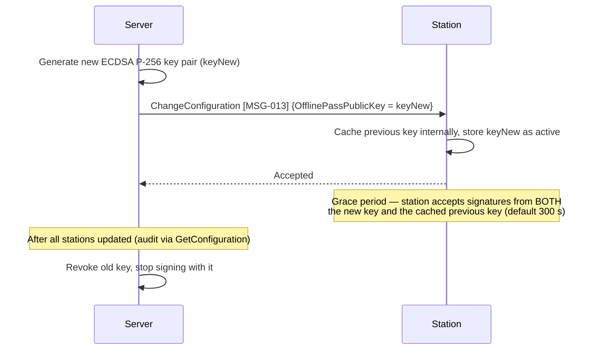

# Chapter 06 — Security

> **Status:** Draft | **OSPP Version:** 0.6.0

This chapter defines the complete security model for the OSPP protocol, covering threat analysis, authentication, authorization, cryptographic requirements, message integrity, offline security, anti-abuse mechanisms, and data protection.

The keywords **MUST**, **MUST NOT**, **REQUIRED**, **SHALL**, **SHALL NOT**, **SHOULD**, **SHOULD NOT**, **RECOMMENDED**, **MAY**, and **OPTIONAL** in this document are to be interpreted as described in [RFC 2119](https://www.rfc-editor.org/rfc/rfc2119) and [RFC 8174](https://www.rfc-editor.org/rfc/rfc8174).

For message references, see [Chapter 03 — Message Catalog](03-messages.md). Messages are referenced as **[MSG-XXX]**.

---

## 1. Threat Model

OSPP operates in a **hostile physical environment** — self-service points are deployed in public spaces, communicate over untrusted networks, and must handle financial transactions both online and offline. This section enumerates the threats specific to this domain and maps each to the countermeasures defined in subsequent sections.

### 1.1 Threat Summary

| ID | Threat | Impact | Severity | Countermeasure |
|:--:|--------|--------|:--------:|----------------|
| T01 | [Replay Attack](#t01---replay-attack) | Duplicate service activation or credit deduction | High | §5.3 HMAC with messageId, §6.3 monotonic counter |
| T02 | [Man-in-the-Middle](#t02---man-in-the-middle) | Eavesdrop or modify station commands | Critical | §2.1 mTLS (TLS 1.3), §5 HMAC-SHA256 |
| T03 | [Credit Fraud / Double-Spend](#t03---credit-fraud--double-spend) | Unauthorized service without payment | Critical | §6.1 OfflinePass limits, §6.2 signed receipts with txCounter, §6.6 epoch revocation, §7.4 fraud scoring |
| T04 | [Unauthorized Station Access](#t04---unauthorized-station-access) | Rogue station impersonation or topic hijacking | Critical | §2.1 mTLS + CN-based ACL, §4.2 PKI |
| T05 | [Session Hijacking](#t05---session-hijacking) | Take over another user's session | High | §2.2 JWT short-lived, §2.3 session token UUID, §5 HMAC |
| T06 | [Offline Abuse](#t06---offline-abuse) | Exploit offline mode for unlimited free services | High | §6.1-§6.6 OfflinePass constraints, §7.4 fraud detection |
| T07 | [Payment Fraud](#t07---payment-fraud) | Bypass payment via forged webhooks or repeated attempts | High | §2.5 HMAC-SHA512 webhook, §7.3 anti-abuse layers |
| T08 | [Firmware Tampering](#t08---firmware-tampering) | Install malicious firmware to bypass security | Critical | §4.6 firmware code-signing, §4.5 secure storage, A/B rollback, SecurityEvent [MSG-012] |
| T09 | [Physical Tampering](#t09---physical-tampering) | Access internal components, extract keys | Critical | §4.5 secure element, tamper detection, SecurityEvent [MSG-012] |
| T10 | [Certificate Compromise](#t10---certificate-compromise) | Impersonate a station after private key extraction | Critical | §4.3 CRL/OCSP, on-device key generation, §4.5 secure storage |
| T11 | [Webhook Spoofing](#t11---webhook-spoofing) | Forge payment confirmations | High | §2.5 HMAC-SHA512 + IP whitelist + timing-safe comparison |
| T12 | [BLE Eavesdropping](#t12---ble-eavesdropping) | Intercept offline pass or session data over-the-air | Medium | §6.5.3 application-layer AEAD (ChaCha20-Poly1305) over an ECDH-authenticated channel, §6.5.2 StationIdentity verification |
| T13 | [Denial of Service](#t13---denial-of-service) | Station becomes unresponsive to legitimate users | High | §7.1 rate limiting, BLE connection throttling, MQTT message rate cap |
| T14 | [BLE Presence Tracking](#t14---ble-presence-tracking) | Track a device's physical presence via the plaintext `deviceId` in Hello | Low | Accepted residual for v0.6.0; mitigation deferred to a future design revision (see T14) |

### T01 - Replay Attack

**Description:** An attacker captures a valid MQTT message or BLE message and retransmits it to trigger duplicate actions (e.g., replay a StartService to get a free service, replay a TransactionEvent to double-charge a user).

**Countermeasures:**
- Every MQTT message carries a unique `messageId` (UUID v4). Receivers maintain a deduplication window (last 1000 IDs or 1 hour) and reject duplicates (see [Chapter 02](02-transport.md), §3.3).
- HMAC-SHA256 binds the `messageId` and `timestamp` to the session key — replayed messages with old timestamps are detectable.
- BLE OfflineAuthRequest [MSG-031] includes a **monotonic counter** that MUST be strictly greater than the last seen counter; replaying an old counter value triggers error `2005 OFFLINE_COUNTER_REPLAY`.
- BLE session keys are derived per-handshake from fresh ephemeral ECDH keys and nonces (§6.5), so captured messages from a previous session are invalid and cannot be decrypted later (forward secrecy).

### T02 - Man-in-the-Middle

**Description:** An attacker intercepts the network path between the station and broker (or between the app and server) to eavesdrop, modify, or inject messages.

**Countermeasures:**
- **TLS 1.3 mandatory** on all MQTT and HTTPS connections; no fallback to TLS 1.2. 0-RTT MUST NOT be used (replay risk).
- **mTLS** (mutual TLS) — both the station and broker present X.509 certificates. The station verifies the broker's certificate, and the broker verifies the station's certificate, preventing impersonation on either side.
- **HMAC-SHA256 defense-in-depth** — even if TLS were compromised, message tampering is detectable via the MAC field.
- **BLE application-layer AEAD** (ChaCha20-Poly1305 over an ECDH-authenticated channel, §6.5) protects all post-Challenge traffic end-to-end; an active MITM cannot derive the session key without the station's certified static key, and the app refuses to send a credential to any station whose StationIdentity certificate does not verify (§6.5.2).

### T03 - Credit Fraud / Double-Spend

**Description:** A malicious user or device attempts to obtain service without payment, or to spend the same credits multiple times (especially in offline mode where real-time balance checks are not possible).

**Countermeasures:**
- **OfflinePass** (see §6.1) enforces hard limits: `maxTotalCredits`, `maxUses`, `maxCreditsPerTx`, `allowedServiceTypes` (see §6.1).
- **Epoch-based revocation** (§6.6) — incrementing the global `RevocationEpoch` invalidates ALL passes issued before that epoch. Constant-time check on station; no CRL distribution required.
- **ECDSA P-256 signed receipts with txCounter** (§6.2) — stations cryptographically sign every transaction including a monotonic counter. Counter gaps trigger fraud alerts. Unsigned or incorrectly signed transactions are flagged as CRITICAL.
- **Fraud scoring** (§7.4) — post-reconciliation scoring with automatic response (disable offline, revoke pass, block user).

### T04 - Unauthorized Station Access

**Description:** A rogue device impersonates a legitimate station to receive commands, intercept session data, or inject fake telemetry.

**Countermeasures:**
- **mTLS with CN-based ACL** — the broker verifies the station's X.509 certificate and enforces that CN = `stn_{station_id}`. A station can ONLY subscribe to its own `to-station` topic and publish to its own `to-server` topic.
- **Private keys generated on-device** (§4.5) — TLS and ECDSA private keys never leave the station. Even the provisioning server never sees the private key.
- **CRL/OCSP revocation** — compromised certificates are revoked and rejected by the broker.

### T05 - Session Hijacking

**Description:** An attacker takes over another user's active session to control the service (start/stop) or receive their receipts.

**Countermeasures:**
- **JWT access tokens** (§2.2) expire in 15 minutes, limiting the window of a stolen token.
- **Web payment session tokens** (§2.3) are UUID v4, 10-minute TTL, stored in Redis (not cookies or localStorage), and scoped to a single payment flow.
- **MQTT session isolation** — each station's messages flow through its own topic pair. There is no station-to-station communication.

### T06 - Offline Abuse

**Description:** A user exploits offline mode to obtain unlimited free services — e.g., by modifying the OfflinePass, replaying passes, or using a pass after it has been revoked.

**Countermeasures:**
- **10-check OfflinePass validation** (§6.1) performed by the station: signature, expiry, epoch, device binding, limits, interval, and counter.
- **Monotonic counter** — prevents replay of the same pass data.
- **Per-pass constraints**: `maxUses`, `maxTotalCredits`, `maxCreditsPerTx`, `minIntervalSec`, `stationOfflineWindowHours`, `stationMaxOfflineTx`.
- **Epoch revocation** — one server-side increment invalidates all outstanding passes.
- **Negative wallet balance allowed** during reconciliation — the user is charged even if their balance goes negative (collected as debt).

### T07 - Payment Fraud

**Description:** Attacker forges payment webhooks, exploits the web payment flow to lock bays without paying, or performs card testing attacks.

**Countermeasures:**
- **HMAC-SHA512 webhook verification** (§2.5) with timing-safe comparison.
- **IP whitelist** — only payment processor IPs are accepted for webhook endpoints.
- **5-layer anti-abuse** (§7.3): IP rate limiting, device fingerprinting, progressive CAPTCHA, abandon scoring, and bay-lock-at-payment-only.

### T08 - Firmware Tampering

**Description:** Attacker installs modified firmware to bypass security checks, disable offline validation, or exfiltrate keys.

**Countermeasures:**
- **ECDSA P-256 firmware code-signing** — see §4.6.
- **SHA-256 checksum verification** before installation.
- **A/B partition scheme** with automatic rollback on failed self-test.
- **FirmwareIntegrityFailure** SecurityEvent [MSG-012] on checksum mismatch or signature failure.
- Firmware URL uses HTTPS — binary is integrity-protected in transit.

### T09 - Physical Tampering

**Description:** Attacker opens the station enclosure to access the hardware, extract keys from storage, or modify the hardware.

**Countermeasures:**
- **Secure element / TPM** for private key storage (§4.5) — keys are non-extractable.
- **Tamper detection switch** — enclosure opening triggers `TamperDetected` SecurityEvent [MSG-012] (severity: Critical).
- **Encrypted NVS** — even if storage is accessed, data is encrypted at rest.

### T10 - Certificate Compromise

**Description:** Station's TLS private key is extracted (e.g., via physical access or firmware exploit), allowing impersonation.

**Countermeasures:**
- **On-device key generation** — private keys are generated on the station's secure element and never transmitted.
- **CRL/OCSP revocation** — compromised certificates are revoked; the broker rejects connections from revoked certificates.
- **Certificate renewal alerts** — background job alerts when a certificate is within 30 days of expiry.

### T11 - Webhook Spoofing

**Description:** Attacker sends forged payment webhooks to trigger service activation without actual payment.

**Countermeasures:**
- **HMAC-SHA512** signature verification (`X-PG-Signature` header).
- **Timing-safe comparison** prevents timing attacks on HMAC verification.
- **IP whitelist** — only traffic from payment processor IP ranges is accepted.
- **Idempotency** — duplicate webhooks for the same payment are safely ignored.

### T12 - BLE Eavesdropping

**Description:** Attacker within BLE range captures over-the-air traffic to steal OfflinePass data or session credentials.

**Countermeasures:**
- **Application-layer AEAD** (ChaCha20-Poly1305 IETF, §6.5.3) encrypts and authenticates all post-Challenge traffic end-to-end, independent of any BLE link-layer pairing. The OfflinePass and receipt are never exposed in plaintext over the air.
- **Authenticated, forward-secret key agreement** (§6.5): the per-handshake ECDH (ephemeral-static + ephemeral-ephemeral) means a passive capture cannot be decrypted even if a station's static key is later compromised, and an active attacker cannot impersonate the station without a valid StationIdentity certificate (§6.5.2).
- **Station limits concurrent BLE connections** to 1 (configurable up to 3) with per-connection isolation ([ble-transport.md §13](profiles/offline/ble-transport.md)), reducing the attack surface.

### T13 - Denial of Service

**Description:** Attacker floods the station with BLE connection requests, malformed MQTT messages, or rapid connect/disconnect cycles, rendering it unresponsive to legitimate users.

**Countermeasures:**
- Station **SHOULD** implement rate limiting on BLE connections (max 5 connection attempts per 30 seconds per device, max 20 total per minute).
- Station **SHOULD** implement MQTT message rate limiting (max 100 messages per second; excess messages logged and dropped).
- Station **SHOULD** implement connection rate limiting (max 3 MQTT reconnection attempts per minute from same IP, if detectable).
- Broker **SHOULD** enforce per-client rate limits: max 100 PUBLISH/minute per station. Excess messages **SHOULD** be dropped with MQTT DISCONNECT reason code `0x96` (Message rate too high). This default assumes ≤4 bays with standard `MeterValuesInterval` (15s). Operators deploying stations with more bays or `MeterValuesInterval` below 10 seconds **SHOULD** increase this limit proportionally (recommended formula: `bays × 60/MeterValuesInterval + 20` overhead).
- Station **SHOULD** implement exponential backoff on repeated failures (initial delay 1 second, max delay 60 seconds, jitter ±20%).
- Server **SHOULD** monitor for anomalous traffic patterns (message frequency spikes, unusual topic access) and alert operators.

### T14 - BLE Presence Tracking

**Description:** The `Hello` message ([ble-handshake.md §2](profiles/offline/ble-handshake.md)) is sent in **plaintext**, as the first handshake step — **before** the AEAD channel exists and before the app verifies the station's certificate. It carries `deviceId`, a **stable** device identifier. Any BLE radio within range (~10–20 m) — including a passive fake station or a dedicated tracker that merely advertises the OSPP service UUID — can capture `deviceId` from the `Hello` write and use it to track the physical presence and movement of that device over time.

This is a **privacy** exposure, **not** a credential compromise: the OfflinePass, the receipt, and all session data remain confidential (they travel only inside the AEAD channel, §6.5.3); only the `deviceId` identifier leaks.

**Severity: Low.** Exploitation requires the attacker to operate BLE-range hardware at locations of interest and to correlate `deviceId` with a real-world identity to be meaningful; it yields presence/movement metadata, never the credential or funds.

**Status — accepted residual for v0.6.0.** Mitigation is a **future design revision**, deliberately not taken now because it would touch the (Red-Team-validated) key schedule: `deviceId` is bound into the HKDF `info` (§6.5 Pin 3) and is the app-chosen client identity used in the device-binding checks (§6.1.1 #4). Replacing it with an ephemeral/rotating identifier — or removing it from the plaintext `Hello` — is coupled with (a) the intended-station binding (§6.5.2) and (b) the real mobile client (B6), since all three concern *what an unauthenticated peer can observe or assume before the channel exists*. Changing it now — against a mock-only app with no field deployment — is disproportionate risk to the validated construction for a small metadata leak. Tracked for a future revision.

**Partial measures available today (non-normative):** an app MAY reduce exposure by minimizing BLE scan/advertising footprint and by not reusing the same `deviceId` across unrelated accounts; these reduce but do not eliminate the leak.

---

## 2. Authentication Mechanisms

OSPP uses **channel-specific authentication** — each communication channel has its own authentication mechanism appropriate to its threat model and operational constraints. The active security profile is configurable via `SecurityProfile` (see §8 Configuration).

### 2.1 Station ↔ Server — Mutual TLS (mTLS)

| Property | Value |
|----------|-------|
| **Protocol** | TLS 1.3 ([RFC 8446](https://www.rfc-editor.org/rfc/rfc8446)) |
| **Authentication** | Mutual — both station and broker present X.509 certificates |
| **Station Certificate CN** | `stn_{station_id}` (e.g., `stn_a1b2c3d4`) |
| **Applies to** | MQTT (port 8883), Station REST fallback (mTLS) |

**Requirements:**
- The station MUST present a valid X.509 client certificate signed by the OSPP Station CA.
- The broker MUST verify the station certificate against the OSPP trust chain (Root CA → Station CA → Station Cert).
- The station MUST verify the broker's server certificate. If the provisioning response includes `brokerRootCa`, the station MUST use it as the trust anchor for this verification; otherwise, the station MAY use its system trust store.
- The broker MUST extract the CN from the client certificate and use it for **topic ACL enforcement** (see §3.3).
- TLS session resumption is RECOMMENDED for reconnection performance. **0-RTT MUST NOT be used** (replay risk).

**TLS 1.3 cipher suites** (in preference order):

| Priority | Cipher Suite |
|:--------:|--------------|
| 1 | `TLS_AES_256_GCM_SHA384` |
| 2 | `TLS_CHACHA20_POLY1305_SHA256` |
| 3 | `TLS_AES_128_GCM_SHA256` |

**Key exchange groups:** X25519 (preferred), secp256r1.

### 2.2 User ↔ Server — JWT (Mobile App)

| Property | Value |
|----------|-------|
| **Protocol** | HTTPS REST |
| **Header** | `Authorization: Bearer {access_token}` |
| **Access Token** | ES256 (ECDSA P-256), 15-minute expiry |
| **Refresh Token** | ES256 (ECDSA P-256), 30-day expiry, one-time-use, server-stored, revocable |

**Access token payload:**

| Claim | Type | Description |
|-------|------|-------------|
| `sub` | string | User identifier (`sub_{uuid}`) |
| `email` | string | User email |
| `iat` | integer | Issued-at timestamp (Unix epoch) |
| `exp` | integer | Expiration timestamp (Unix epoch) |

**Requirements:**
- Access tokens MUST be short-lived (15 minutes).
- Refresh tokens MUST be one-time-use — each refresh generates a new refresh token and invalidates the old one.
- Refresh tokens MUST be stored server-side (Redis or database) and revocable.
- The server MUST reject expired access tokens with `401 Unauthorized`.
- The server MUST reject revoked or reused refresh tokens with `401 Unauthorized` and SHOULD invalidate all sessions for that user (refresh token reuse indicates compromise).

### 2.3 User ↔ Server — Session Token (Web Payment)

| Property | Value |
|----------|-------|
| **Protocol** | HTTPS REST |
| **Token** | UUID v4 in URL path (e.g., `/pay/sessions/{sessionToken}/status`) |
| **TTL** | 10 minutes |
| **Storage** | Redis with TTL |
| **Scope** | Single payment flow only |

**Requirements:**
- Session tokens MUST be UUID v4 (122 bits of entropy).
- Tokens MUST NOT be stored in cookies, localStorage, or sessionStorage (URL-only).
- Tokens MUST expire after 10 minutes.
- Tokens MUST be scoped to a single station + bay + service combination.
- The server MUST invalidate the token after the session completes.
- **CORS policy:** `https://pay.{domain}` only — no wildcard origins.

### 2.4 User ↔ Station — BLE Challenge-Response

| Property | Value |
|----------|-------|
| **Protocol** | BLE GATT |
| **Mechanism** | HELLO/CHALLENGE handshake (ECDH P-256 + StationIdentity cert) + OfflinePass or ServerSignedAuth |
| **Encryption** | Application-layer AEAD — ChaCha20-Poly1305 IETF (§6.5.3). LESC link encryption OPTIONAL (§6.4), not assumed. |

**Authentication flows** (see [Chapter 04 — Flows](04-flows.md), §5a/b/c):

| Scenario | Auth Message | Validation |
|----------|-------------|------------|
| Full Offline | OfflineAuthRequest [MSG-031] | Station validates ECDSA P-256 signature + 10 checks locally |
| Partial A (phone online) | ServerSignedAuth [MSG-032] | Station verifies ECDSA P-256 server signature |
| Partial B (station online) | OfflineAuthRequest [MSG-031] | Station forwards to server via AuthorizeOfflinePass [MSG-002] |

**Handshake security:**
- Fresh ephemeral P-256 key pairs and 32-byte nonces on every handshake prevent replay and provide forward secrecy.
- The app **verifies the StationIdentity certificate before sending any credential** (§6.5.2), so a pass is never leaked to an impersonating station.
- The session key is derived via ECDH P-256 + HKDF-SHA256 (§6.5), binding the session to the authenticated station identity and the full handshake transcript.
- `sessionProof` proves participation, and all post-Challenge traffic is encrypted/authenticated by the AEAD channel (§6.5.3).

### 2.5 Payment Processor → Server — HMAC-SHA512 Webhook

| Property | Value |
|----------|-------|
| **Protocol** | HTTPS POST (server-to-server) |
| **Endpoint** | `POST /webhooks/{processor}/payment` |
| **Signature Header** | `X-PG-Signature` (or processor-specific) |
| **Algorithm** | HMAC-SHA512 |

**Requirements:**
- The server MUST verify the HMAC-SHA512 signature using the processor's shared secret.
- Verification MUST use **timing-safe comparison** (constant-time) to prevent timing attacks.
- The server SHOULD enforce **IP whitelist** — only accept webhook traffic from known processor IP ranges.
- Duplicate webhooks (same payment ID) MUST be idempotently handled (do not double-credit or double-start).

### 2.6 Management Dashboard — JWT + RBAC + MFA

| Property | Value |
|----------|-------|
| **Protocol** | HTTPS |
| **Authentication** | JWT (same mechanism as §2.2) |
| **Authorization** | Role-Based Access Control (see §3.1) |
| **MFA** | TOTP (Time-based One-Time Password) REQUIRED for admin roles |

---

## 3. Authorization Model

### 3.1 RBAC Roles

OSPP defines 7 roles with scoped permissions:

| Role | Scope | Description |
|------|-------|-------------|
| **Platform Admin** | Global | Full access to all resources across all organizations |
| **Operator Admin** | All owned locations | Manage stations, bays, prices, sessions for their locations |
| **Location Manager** | Assigned locations | Bay status, maintenance mode, view sessions |
| **Accounting** | Financial data | View transactions, reports, issue refunds |
| **Corporate Admin** | Their organization | Manage vehicles, policy, view usage |
| **Support Agent** | Read + user actions | View sessions, issue refunds, assist users |
| **User** | Own data | Profile, wallet, sessions, vehicles, offline pass |

### 3.2 Per-Message Authorization

Each MQTT message has an implicit authorization based on its direction and the authenticated identity:

| Message | Authorized Sender | Verified By |
|---------|-------------------|-------------|
| BootNotification [MSG-001] | Station (via mTLS CN) | Server verifies CN matches `stationId` in payload |
| Heartbeat [MSG-008] | Station (via mTLS CN) | Server verifies topic matches CN |
| StatusNotification [MSG-009] | Station (via mTLS CN) | Server verifies `bayId` belongs to station |
| MeterValues [MSG-010] | Station (via mTLS CN) | Server verifies `sessionId` belongs to station |
| TransactionEvent [MSG-007] | Station (via mTLS CN) | Server verifies receipt signature |
| SecurityEvent [MSG-012] | Station (via mTLS CN) | Server logs unconditionally |
| StartService [MSG-005] | Server | Station verifies HMAC (session key) |
| StopService [MSG-006] | Server | Station verifies HMAC (session key) |
| ReserveBay [MSG-003] | Server | Station verifies HMAC (session key) |
| ChangeConfiguration [MSG-013] | Server | Station verifies HMAC (session key) |
| UpdateFirmware [MSG-016] | Server | Station verifies HMAC + checksum |
| All server→station commands | Server | Station MUST verify HMAC before execution |

### 3.3 MQTT Topic ACL

The MQTT broker MUST enforce topic-level access control based on the client certificate CN:

| Client | Subscribe | Publish | Deny |
|--------|-----------|---------|------|
| Station `stn_X` | `ospp/v1/stations/stn_X/to-station` | `ospp/v1/stations/stn_X/to-server` | All other topics |
| Server | `$share/ospp-servers/ospp/v1/stations/+/to-server` | `ospp/v1/stations/+/to-station` | All other topics |

**Rules:**
- A station MUST NOT subscribe to another station's topics.
- A station MUST NOT publish to another station's topics.
- ACL enforcement MUST be at the broker level, based on the mTLS client certificate CN.
- ACL violations MUST be logged by the broker and SHOULD trigger a SecurityEvent [MSG-012].

### 3.4 REST API Authorization

| Endpoint Group | Required Role | Auth Method |
|----------------|--------------|-------------|
| `/sessions/*` | User | JWT Bearer |
| `/wallet/*` | User | JWT Bearer |
| `/me/*` | User | JWT Bearer |
| `/pay/*` | Anonymous | Session token (UUID) |
| `/admin/stations/*` | Operator Admin+ | JWT Bearer + RBAC |
| `/admin/users/*` | Support Agent+ | JWT Bearer + RBAC |
| `/webhooks/*` | Payment Processor | HMAC-SHA512 signature |
| `/station/{id}/offline-txs` | Station | mTLS certificate |
| `/station/{id}/config` | Station | mTLS certificate |
| `/api/v1/stations/provision` | Station (unprovisioned) | Provisioning token |

---

## 4. Cryptographic Requirements

### 4.1 Algorithm Inventory

| # | Key / Operation | Algorithm | Key Size | Standard | Purpose |
|:-:|-----------------|-----------|:--------:|----------|---------|
| 1 | TLS transport | TLS 1.3 | — | RFC 8446 | Channel encryption (all connections) |
| 2 | Station TLS cert | ECDSA P-256 | 256 bit | X.509 v3 | mTLS authentication |
| 3 | MQTT HMAC session key | HMAC-SHA256 | 256 bit (32 bytes) | FIPS 198-1 | Per-boot message integrity (selective — see §5) |
| 4 | OfflinePass signing | ECDSA P-256 (RFC 6979) | 256 bit | FIPS 186-4, RFC 6979 | Server signs offline authorization |
| 5 | Receipt signing | ECDSA P-256 (RFC 6979) | 256 bit | FIPS 186-4, RFC 6979 | Station signs transaction receipts (includes txCounter) |
| 6 | BLE session key | ECDH P-256 + HKDF-SHA256 | 256 bit (32 bytes) | RFC 5903, RFC 5869 | Per-handshake BLE session key (ephemeral-static + ephemeral-ephemeral ECDH; §6.5). Replaces the v0.5.x LTK input. |
| 7 | BLE channel AEAD | ChaCha20-Poly1305 (IETF) | 256-bit key | RFC 8439 | Post-Challenge BLE message confidentiality + integrity (§6.5.3). LESC AES-CCM link encryption is now OPTIONAL (§6.4), not a security premise. |
| 8 | Webhook verification | HMAC-SHA512 | 512 bit | FIPS 198-1 | Payment webhook integrity |
| 9 | JWT signing | ES256 (ECDSA P-256) | 256 bit | RFC 7518 | Access/refresh token signing |
| 10 | Root CA | ECDSA P-384 | 384 bit | X.509 v3 | Trust anchor (offline, air-gapped) |

> **Note:** All software-based ECDSA signing operations **MUST** use **RFC 6979** deterministic nonce generation. This eliminates the catastrophic failure mode where a reused or weak random nonce leaks the private key. Hardware secure elements (e.g., ATECC608B) that use internal hardware RNG for nonce generation are exempt from this requirement, as hardware RNG prevents software nonce reuse.

**Deprecated/prohibited algorithms:**
- MD5 — MUST NOT be used anywhere
- SHA-1 — MUST NOT be used for signatures or HMAC
- TLS 1.2 or earlier — MUST NOT be used
- RC4, DES, 3DES — MUST NOT be used
- RSA key exchange (non-PFS) — MUST NOT be used
- Ed25519 — MUST NOT be used (replaced by ECDSA P-256 for secure element compatibility)
- RSA (any key size) — MUST NOT be used for station certificates or signing operations (replaced by ECDSA P-256/P-384)

### 4.2 PKI Architecture

```
OSPP Root CA (ECDSA P-384, OFFLINE, air-gapped HSM, 20-year validity)
  └── OSPP Station CA (ECDSA P-256, online HSM, 5-year validity)
        ├── stn_a1b2c3d4.pem (ECDSA P-256, 1-year validity)
        ├── stn_e5f6a7b8c9d0.pem (ECDSA P-256, 1-year validity)
        └── ... (one certificate per station)

Server Signing Key (ECDSA P-256, server-side HSM)
  └── OfflinePass signatures
  └── ServerSignedAuth (Partial A)
```

| CA Level | Algorithm | Validity | Storage | Purpose |
|----------|-----------|:--------:|---------|---------|
| Root CA | ECDSA P-384 | 20 years | Air-gapped HSM | Signs Station CA only |
| Station CA | ECDSA P-256 | 5 years | Online HSM | Signs station certificates |
| Station Cert | ECDSA P-256 | 1 year | Station secure element | mTLS authentication + receipt signing |
| Server Signing Key | ECDSA P-256 | Annual rotation | Server HSM / Vault | OfflinePass + ServerSignedAuth signing |

**Trust distribution:**
- Root CA public certificate is embedded in station firmware and server trust store.
- Station CA public certificate is distributed during provisioning.
- Station certificates are issued during provisioning ([Flow §2](04-flows.md#2-station-provisioning)).
- Server signing public key is distributed via provisioning and ChangeConfiguration [MSG-013].
- Broker server CA trust anchor is delivered via the provisioning response `brokerRootCa` field when the broker uses a private CA hierarchy. The station uses its system trust store when this field is absent (broker uses publicly-trusted CA hierarchy).

### 4.3 Key Management Lifecycle

#### Station TLS Key Pair

| Phase | Action |
|-------|--------|
| **Generation** | On-device during provisioning (private key NEVER leaves the station) |
| **Storage** | Secure element, TPM, or encrypted NVS |
| **Renewal** | Station generates new CSR; server signs via Station CA. Background alert when cert < 30 days to expiry. |
| **Revocation** | CRL published by Station CA (checked by MQTT broker). OCSP RECOMMENDED. |
| **Rotation** | Annual (1-year certificate validity) |

#### HMAC Session Key (per-boot)

| Phase | Action |
|-------|--------|
| **Generation** | Server generates 32 random bytes at BootNotification `Accepted` |
| **Distribution** | Sent in BootNotification RESPONSE [MSG-001] `sessionKey` field (protected by TLS) |
| **Storage** | Station: volatile memory (RAM). Server: in-memory session store. |
| **Lifetime** | One MQTT session (from boot to disconnect) |
| **Rotation** | Automatic on every reconnection (new BootNotification → new key) |

#### Server ECDSA P-256 Key (OfflinePass + ServerSignedAuth signing)

| Phase | Action |
|-------|--------|
| **Generation** | Server generates ECDSA P-256 key pair (RFC 6979 deterministic nonces for signing) |
| **Distribution** | Public key sent to stations via provisioning and ChangeConfiguration [MSG-013] |
| **Storage** | Private: server HSM / Vault. Public: station NVS (`OfflinePassPublicKey`). |
| **Rotation** | Annual. See §6.7 for the rotation protocol. |

#### Station ECDSA P-256 Key (mTLS + Receipt signing)

| Phase | Action |
|-------|--------|
| **Generation** | On-device during provisioning (private key NEVER leaves the station) |
| **Distribution** | Public key sent to server during provisioning; also used as TLS client cert |
| **Storage** | Station secure element (non-extractable). ATECC608B fully supports ECDSA P-256. |
| **Rotation** | Annual (new key pair generated, public key re-registered with server, new TLS cert issued) |

### 4.4 Certificate Requirements

Station certificates MUST comply with:

| Field | Requirement |
|-------|-------------|
| Version | X.509 v3 |
| Subject CN | `stn_{station_id}` (e.g., `stn_a1b2c3d4`). Current serial number available via read-only key `CertificateSerialNumber` (see §8 Configuration). |
| Key Algorithm | ECDSA P-256 |
| Signature Algorithm | ECDSA with SHA-256 (minimum) or SHA-384 |
| Validity | Maximum 1 year (RECOMMENDED) |
| Key Usage | digitalSignature |
| Extended Key Usage | clientAuth |
| Subject Alternative Name | OPTIONAL (DNS name or IP of station) |
| CRL Distribution Points | REQUIRED (URL to CRL published by Station CA) |
| Authority Info Access | RECOMMENDED (OCSP responder URL) |

If a TLS certificate expires during an active MQTT session, the TLS connection will terminate at the next renegotiation or keepalive. The station treats this as a standard connection loss and follows the reconnection procedure in [Chapter 02 — Transport](02-transport.md), §4.4.

### 4.7 Certificate Lifecycle Management

Certificate renewal enables stations to obtain new TLS certificates before their current certificates expire, without requiring physical access or manual provisioning. The protocol is inspired by OCPP 2.0.1 Security Profile 3 certificate management, adapted to the OSPP architecture.

Three MQTT messages support the certificate lifecycle:

| Message | Direction | Purpose |
|---------|-----------|---------|
| SignCertificate [MSG-022] | Station → Server | Station submits a PKCS#10 CSR for signing |
| CertificateInstall [MSG-023] | Server → Station | Server delivers the signed certificate and CA chain |
| TriggerCertificateRenewal [MSG-024] | Server → Station | Server instructs the station to initiate renewal |

#### 4.7.1 Automatic Renewal

The station **SHOULD** initiate certificate renewal automatically when the current certificate is within `CertificateRenewalThresholdDays` (default: 30 days, configurable 7–90) of expiry. See [Chapter 08 — Configuration](08-configuration.md), §4.

**Automatic renewal flow:**

1. Station generates a new ECDSA P-256 keypair on-device (the private key **MUST NOT** leave the station)
2. Station creates a PKCS#10 CSR with Subject CN = `stn_{station_id}`
3. Station sends the CSR via SignCertificate REQUEST [MSG-022]
4. Server validates the CSR (correct format, CN matches mTLS station ID, ECDSA P-256)
5. Server forwards the CSR to the Certificate Authority
6. CA signs the certificate and returns it to the server
7. Server delivers the signed certificate (and optionally the CA chain) via CertificateInstall REQUEST [MSG-023]
8. Station validates the certificate chain, CN match, key usage, and validity period
9. Station installs the certificate to its secure element, TPM, or encrypted NVS
10. Station updates the `CertificateSerialNumber` configuration key
11. On the next TLS reconnection, the station uses the new certificate

#### 4.7.2 Server-Triggered Renewal

The server **MAY** trigger a certificate renewal at any time using TriggerCertificateRenewal [MSG-024]. Use cases include:

- The server detects an approaching expiry that the station has not yet addressed
- The CA has been rotated and all station certificates need reissuing
- A certificate has been compromised and must be replaced immediately

Upon receiving a TriggerCertificateRenewal REQUEST, the station responds with `Accepted` and initiates the automatic renewal flow (steps 1–11 above).

#### 4.7.3 Emergency Renewal

| Days to Expiry | Priority | Behavior |
|:-:|:---:|---|
| > 30 | Normal | Station checks daily. No action unless server-triggered. |
| 7–30 | Elevated | Station initiates automatic renewal. Server logs a background alert. |
| < 7 | High | Station initiates renewal immediately. Server sends TriggerCertificateRenewal if station has not already started. Server alerts operator. |
| 0 (expired) | Emergency | Certificate has expired. Station enters offline-only mode (BLE). Recovery requires server-triggered renewal over an existing session or physical re-provisioning. |

#### 4.7.4 Failure Handling

- **CSR Rejected:** Station retries once after 60 seconds. If retry fails, log SecurityEvent with `type: CertificateError`.
- **Certificate Installation Failed:** Station continues using current certificate and reports CertificateInstall RESPONSE with `status: Rejected`.
- **CA Unreachable:** Server responds to SignCertificate with `status: Accepted` (acknowledging receipt), retries internally. Alerts operator after 24 hours.
- **Keypair Generation Failed:** Station rejects TriggerCertificateRenewal with error `4014 KEYPAIR_GENERATION_FAILED` and logs SecurityEvent with `type: HardwareFault`.

#### 4.7.5 Certificate Renewal Security Requirements

- The station **MUST** generate the new private key on-device. The private key **MUST NOT** be transmitted to the server or included in the CSR.
- The CSR **MUST** use ECDSA P-256. Other algorithms **MUST** be rejected by the server.
- The server **MUST** verify that the CSR's Subject CN matches the station ID from the mTLS session.
- All three certificate lifecycle messages **MUST** be HMAC-signed in `Critical` and `All` modes (see §5.6).
- The station **SHOULD** keep the old certificate until the new certificate is successfully used for a TLS connection.

For the complete certificate renewal profile, see [Certificate Renewal](profiles/security/certificate-renewal.md).

### 4.5 Key Storage Requirements

- Private keys (TLS, ECDSA) MUST be stored in a **secure element**, TPM, or TEE if available.
- If no hardware security module is available, keys MUST be stored in **encrypted NVS** with access controls.
- Keys MUST NOT be:
  - Logged in any log file
  - Included in diagnostics uploads (GetDiagnostics [MSG-018])
  - Transmitted in plaintext over any channel
  - Accessible to unprivileged firmware components
- The HMAC session key MUST be stored in **volatile memory only** (RAM) — it MUST NOT be persisted to non-volatile storage.

### 4.6 Firmware Code-Signing

Firmware images **MUST** be cryptographically signed by the manufacturer or operator using ECDSA P-256. The station **MUST** verify the firmware signature against a trusted signing certificate before installation. SHA-256 checksum verification alone is **NOT** sufficient — it protects against corruption but not against malicious replacement.

**Firmware signing certificate chain:**

```
Operator / Manufacturer Root CA
  └── Firmware Signing Certificate (ECDSA P-256, annual rotation)
        └── Signs each firmware image
```

The station validates the firmware signature against a pre-provisioned Firmware Signing Certificate (or its CA) stored in the station's secure element or encrypted NVS.

The UpdateFirmware [MSG-016] message **MUST** include a `signature` field containing the Base64-encoded ECDSA P-256 signature of the firmware image. If the signature is invalid, the station **MUST** reject the update with error `5112 FIRMWARE_SIGNATURE_INVALID` and send a `FirmwareIntegrityFailure` SecurityEvent [MSG-012].

#### 4.6.1 Anti-Downgrade Protection

The station **SHOULD** reject firmware updates where the offered `firmwareVersion` is older than the currently installed version (downgrade). If a downgrade is rejected, the station **MUST** respond with error `5016 VERSION_ALREADY_INSTALLED` and log a SecurityEvent [MSG-012] with `type: FirmwareDowngradeAttempt`.

To support legitimate rollback scenarios (e.g., reverting a faulty update), the server **MAY** include a `forceDowngrade` flag in the UpdateFirmware request. When `forceDowngrade` is `true`, the station **SHOULD** accept the older version after signature verification. The station **MUST** log a `FirmwareDowngradeAttempt` SecurityEvent regardless of whether the downgrade is forced or not.

#### 4.6.2 Unrecoverable Firmware Failure

If firmware installation fails and rollback to the previous version also fails, the station **MUST** enter `Faulted` state, send a SecurityEvent [MSG-012] with `type: FirmwareIntegrityFailure` and `severity: Critical`, and await manual intervention via physical access. The station **MUST NOT** attempt to continue normal operation with potentially corrupted firmware.

### 4.8 OSPP Canonical Form

OSPP defines a single deterministic JSON serialization — the **OSPP Canonical Form** — used wherever a JSON value must be reduced to a stable byte sequence for cryptographic operations (HMAC-SHA256 of MQTT messages in §5, ECDSA-P256 of transaction receipts in §6.2, ECDSA-P256 of OfflinePass payloads in [`profiles/offline/offline-pass.md`](profiles/offline/offline-pass.md), and any future signature primitive). All OSPP cryptographic flows that compute a signature or MAC over a JSON value **MUST** use this form.

#### 4.8.1 Algorithm

Given a JSON value `V`:

1. **Recursively sort object keys** at every nesting level using lexicographic byte ordering of the UTF-8 encoded key strings. Array element order is preserved (arrays are not reordered).
2. **Serialize compactly**: emit the JSON without any insignificant whitespace (no spaces, tabs, or newlines between tokens). Field separators are `,` and `:` only.
3. **Use canonical scalar forms**:
    - Strings: emit as JSON strings with the minimal required escaping (control characters, `"`, `\`). Other characters MUST be emitted literally — JSON escape sequences (e.g., `A`) MUST NOT be used for characters that do not require escaping.
    - Integers: emit without leading zeros, without a leading `+`, and without a trailing decimal point.
    - Booleans / null: emit as `true`, `false`, `null`.
    - OSPP messages do not currently use floating-point numbers in fields subject to canonicalization; if added in a future version, IEEE 754 number serialization rules will be defined here.
4. **Encode as UTF-8 bytes**. The resulting byte sequence is the canonical form.

#### 4.8.2 Worked Example

Input JSON value (key order non-canonical):

```json
{
  "protocolVersion": "0.2.1",
  "messageId": "cmd_550e8400",
  "action": "StartService",
  "payload": {
    "sessionId": "sess_a1b2c3d4",
    "bayId": "bay_c1d2e3f4a5b6",
    "durationSeconds": 300
  }
}
```

OSPP Canonical Form (sorted keys, compact, UTF-8):

```
{"action":"StartService","messageId":"cmd_550e8400","payload":{"bayId":"bay_c1d2e3f4a5b6","durationSeconds":300,"sessionId":"sess_a1b2c3d4"},"protocolVersion":"0.2.1"}
```

The canonical byte sequence is then fed into HMAC-SHA256 (§5), SHA-256-then-ECDSA-P256 (§6.2), or any other signature primitive that requires deterministic input.

#### 4.8.3 Relationship to RFC 8785 (JCS)

OSPP Canonical Form is **materially similar to RFC 8785 JCS but does not require Unicode NFKC normalization** of string content. For payloads where string content is restricted to ASCII (the dominant case for OSPP messages — UUIDs, ISO 8601 timestamps, `PascalCase` enum values, identifier strings), implementations that target RFC 8785 JCS produce output identical to OSPP Canonical Form.

OSPP does not pin RFC 8785 normatively because:

- Existing OSPP message vocabulary is ASCII-only; Unicode normalization adds implementation cost without observable behavior.
- IEEE 754 number serialization rules from JCS apply only to floating-point numbers, which OSPP does not use in canonicalized fields today.

A future OSPP version MAY adopt RFC 8785 strictly if message vocabulary is extended with non-ASCII strings or floating-point numbers.

---

## 5. Message Integrity — HMAC-SHA256

### 5.1 Overview

The `MessageSigningMode` configuration key controls HMAC-SHA256 message signing. Three modes are defined:

| Mode | Behavior | Use Case |
|------|----------|----------|
| `All` | HMAC on every MQTT message | High-security deployments |
| `Critical` **(default)** | HMAC only on financial and command messages (see §5.6) | Production deployments |
| `None` | No HMAC — TLS-only integrity | Development/testing |

When `MessageSigningMode` is `Critical` or `All`, applicable MQTT messages MUST include an HMAC-SHA256 message authentication code in the `mac` envelope field. This provides **defense-in-depth** — message integrity protection independent of TLS.

> **Rationale for selective signing:** The MQTT broker terminates TLS on both sides (Server↔Broker and Broker↔Station are separate TLS sessions). A compromised broker sees plaintext — and because the per-station session key is itself delivered through the broker at boot (§5.2), HMAC does **not** defend against a fully-compromised broker. What it does protect against is an adversary that can **publish** to the broker without intercepting its traffic — a leaked management-API credential, an ACL regression, or another publish-capable service — which is the realistic threat for financial and command messages. However, high-frequency informational messages (Heartbeat, StatusNotification, MeterValues) have zero financial impact, and signing them adds CPU overhead with no security value.

### 5.2 Session Key Establishment

1. Station sends BootNotification REQUEST [MSG-001] (exempt from signing — no key yet)
2. Server generates a cryptographically random 32-byte key
3. Server includes `sessionKey` (Base64-encoded) in the BootNotification RESPONSE [MSG-001]
4. The session key is protected in transit by TLS 1.3 encryption
5. Both sides store the key in volatile memory for the duration of the MQTT session

### 5.3 Canonical Form

To compute the HMAC, the message MUST first be reduced to canonical form:

1. **Remove** the `mac` field from the message envelope if present (HMAC-specific — the MAC field cannot be part of the input that produces it).
2. Apply the **OSPP Canonical Form** algorithm defined in §4.8 to the resulting object.

The output is a UTF-8 byte sequence suitable for HMAC-SHA256 input.

**Example:**

Original message:
```json
{
  "protocolVersion": "0.2.1",
  "messageId": "cmd_550e8400",
  "action": "StartService",
  "timestamp": "2026-01-30T12:00:00.000Z",
  "source": "Server",
  "messageType": "Request",
  "payload": { "sessionId": "sess_a1b2c3d4", "bayId": "bay_c1d2e3f4a5b6", "serviceId": "svc_eco", "durationSeconds": 300, "sessionSource": "MobileApp" },
  "mac": "will-be-removed"
}
```

Canonical form (sorted keys, no `mac`, compact):
```
{"action":"StartService","messageId":"cmd_550e8400","messageType":"Request","payload":{"bayId":"bay_c1d2e3f4a5b6","durationSeconds":300,"serviceId":"svc_eco","sessionId":"sess_a1b2c3d4","sessionSource":"MobileApp"},"protocolVersion":"0.2.1","source":"Server","timestamp":"2026-01-30T12:00:00.000Z"}
```

### 5.4 MAC Computation

```
mac = Base64(HMAC-SHA256(sessionKey, UTF8(canonical_json)))
```

The computed `mac` string is placed in the top-level `mac` field of the message envelope before transmission.

### 5.5 Verification

The receiver MUST verify the MAC before processing the payload:

1. Extract and remove the `mac` field from the received message
2. Compute the canonical form of the remaining message
3. Compute `expected_mac = HMAC-SHA256(sessionKey, canonical_bytes)`
4. Compare `expected_mac` with the received `mac` using **timing-safe comparison** (constant-time)
5. If the comparison fails → reject the message

**Critical:** Implementations MUST use constant-time comparison to prevent timing attacks. Language-specific examples:
- Python: `hmac.compare_digest()`
- Node.js: `crypto.timingSafeEqual()`
- C: `CRYPTO_memcmp()` (OpenSSL)

### 5.6 Message Signing Classification

#### Mode `All`

All MQTT messages MUST include a valid `mac` field, except BootNotification (REQUEST and RESPONSE) and ConnectionLost (exempt — see below).

#### Mode `Critical` (default)

Messages are classified as **critical** (HMAC required) or **exempt** (HMAC not required) based on their financial impact, command authority, and state-changing potential:

| # | Action | Direction | HMAC Required | Rationale |
|--:|--------|-----------|:---:|-----------|
| 1 | BootNotification REQ | Station → Server | **NO** | Informational. No HMAC key available yet (key is issued in the response). |
| 2 | BootNotification RES | Server → Station | **NO** | Carries the session key that would verify it — the MAC is cryptographically void; delivery integrity is provided by mTLS, not HMAC. |
| 3 | AuthorizeOfflinePass REQ | Station → Server | **YES** | Auth decision — financial gate. |
| 4 | AuthorizeOfflinePass RES | Server → Station | **YES** | Auth verdict — controls resource access. |
| 5 | ReserveBay REQ | Server → Station | **YES** | Blocks physical resources. |
| 6 | ReserveBay RES | Station → Server | **YES** | Confirms resource allocation. |
| 7 | CancelReservation REQ | Server → Station | **YES** | Releases resources, triggers refund. |
| 8 | CancelReservation RES | Station → Server | **YES** | Confirms release. |
| 9 | StartService REQ | Server → Station | **YES** | Activates hardware. Direct financial impact. |
| 10 | StartService RES | Station → Server | **YES** | Confirms hardware activation. |
| 11 | StopService REQ | Server → Station | **YES** | Terminates service, triggers finalization. |
| 12 | StopService RES | Station → Server | **YES** | Confirms termination. |
| 13 | TransactionEvent REQ | Station → Server | **YES** | Financial record. |
| 14 | TransactionEvent RES | Server → Station | **YES** | Financial acknowledgement. |
| 15 | Heartbeat REQ | Station → Server | **NO** | Zero financial impact, high frequency. |
| 16 | Heartbeat RES | Server → Station | **NO** | Time sync only. |
| 17 | StatusNotification | Station → Server | **NO** | Informational, high frequency. |
| 18 | MeterValues | Station → Server | **NO** | Informational, high frequency. |
| 19 | SessionEnded EVENT | Station → Server | **YES** | Contains `creditsCharged` used directly for online billing at timer expiry — sole billing source when no StopService command is issued. |
| 20 | ConnectionLost (LWT) | Broker → Server | **NO** | Broker-generated. Station cannot pre-sign. |
| 21 | SecurityEvent | Station → Server | **NO** | Station-originated report, not a command. |
| 22 | ChangeConfiguration REQ | Server → Station | **YES** | Modifies station behavior. |
| 23 | ChangeConfiguration RES | Station → Server | **YES** | Confirms configuration applied. |
| 24 | GetConfiguration REQ | Server → Station | **NO** | Read-only query. |
| 25 | GetConfiguration RES | Station → Server | **NO** | Read-only response. |
| 26 | Reset REQ | Server → Station | **YES** | Reboots station. Availability impact. |
| 27 | Reset RES | Station → Server | **YES** | Confirms reset accepted. |
| 28 | UpdateFirmware REQ | Server → Station | **YES** | Supply chain security critical. |
| 29 | UpdateFirmware RES | Station → Server | **YES** | Confirms update accepted. |
| 30 | FirmwareStatusNotification | Station → Server | **NO** | Informational progress. |
| 31 | GetDiagnostics REQ | Server → Station | **NO** | Non-financial. |
| 32 | GetDiagnostics RES | Station → Server | **NO** | Non-financial. |
| 33 | DiagnosticsNotification | Station → Server | **NO** | Informational progress. |
| 34 | SetMaintenanceMode REQ | Server → Station | **YES** | Changes operational state. |
| 35 | SetMaintenanceMode RES | Station → Server | **YES** | Confirms maintenance mode change. |
| 36 | UpdateServiceCatalog REQ | Server → Station | **YES** | Modifies pricing/services. |
| 37 | UpdateServiceCatalog RES | Station → Server | **YES** | Confirms catalog applied. |
| 38 | SignCertificate REQ | Station → Server | **YES** | Certificate material — security critical. |
| 39 | SignCertificate RES | Server → Station | **YES** | Certificate material — security critical. |
| 40 | CertificateInstall REQ | Server → Station | **YES** | Certificate material — security critical. |
| 41 | CertificateInstall RES | Station → Server | **YES** | Certificate material — security critical. |
| 42 | TriggerCertificateRenewal REQ | Server → Station | **YES** | Certificate management command. |
| 43 | TriggerCertificateRenewal RES | Station → Server | **YES** | Confirms renewal initiated. |
| 44 | DataTransfer REQ | Bidirectional | **NO** | Vendor data — not critical by default. Signed in `All` mode only. |
| 45 | DataTransfer RES | Bidirectional | **NO** | Vendor data response. Signed in `All` mode only. |
| 46 | TriggerMessage REQ | Server → Station | **YES** | Server command that triggers station behavior. |
| 47 | TriggerMessage RES | Station → Server | **YES** | Confirms trigger accepted. |

**Summary:** 31 of 47 message types require HMAC in `Critical` mode, 16 are exempt. The exempt messages (BootNotification REQ, BootNotification RES, Heartbeat, StatusNotification, MeterValues, ConnectionLost, SecurityEvent, GetConfiguration, GetDiagnostics, FirmwareStatusNotification, DiagnosticsNotification, DataTransfer) represent ~70% of message *volume* in normal operation.

#### Mode `None`

No messages require HMAC. TLS provides the only integrity protection. This mode is intended for development and testing only and **SHOULD NOT** be used in production.

#### Always-Exempt Messages

Regardless of `MessageSigningMode`, the following messages are always exempt:

| Message | Reason |
|---------|--------|
| BootNotification REQUEST [MSG-001] | Session key not yet established |
| BootNotification RESPONSE [MSG-001] | Carries the session key that would verify it; integrity via mTLS, not HMAC |
| ConnectionLost (LWT) [MSG-011] | Pre-configured at CONNECT time, published by broker |

### 5.7 Failure Handling

| Condition | Error Code | Action |
|-----------|------------|--------|
| `mac` field missing (signing enabled) | `1013 MAC_MISSING` | Reject message, log SecurityEvent [MSG-012] |
| `mac` verification fails | `1012 MAC_VERIFICATION_FAILED` | Reject message, log SecurityEvent [MSG-012] |
| 3+ MAC failures from same station in 60s | — | Flag station as potentially compromised, alert operator |

---

## 6. Offline Security

Offline mode introduces unique security challenges: the station cannot contact the server for real-time authorization, so cryptographic credentials must be validated locally. This section defines the complete offline security model.

### 6.1 OfflinePass Structure

The OfflinePass is a server-signed credential that authorizes offline service usage within strict constraints. It is issued to the mobile app while online and presented to the station via BLE [MSG-031].

#### Fields

| Field | Type | Description |
|-------|------|-------------|
| `passId` | string | Unique pass identifier (`opass_{uuid}`) |
| `sub` | string | User subject identifier (`sub_{uuid}`) |
| `deviceId` | string | Bound mobile device identifier |
| `issuedAt` | string | ISO 8601 UTC — when the pass was issued |
| `expiresAt` | string | ISO 8601 UTC — when the pass expires (max 24 hours from issuance) |
| `policyVersion` | integer | Policy version for backward compatibility |
| `revocationEpoch` | integer | Epoch at time of issuance (pass is invalid if station epoch is higher) |
| `offlineAllowance` | object | Spending limits — see below |
| `offlineAllowance.maxTotalCredits` | integer | Maximum total credits across all transactions |
| `offlineAllowance.maxUses` | integer | Maximum number of transactions |
| `offlineAllowance.maxCreditsPerTx` | integer | Maximum credits per single transaction |
| `offlineAllowance.allowedServiceTypes` | array | List of permitted service IDs |
| `constraints` | object | Operational constraints — see below |
| `constraints.minIntervalSec` | integer | Minimum seconds between transactions from this pass |
| `constraints.stationOfflineWindowHours` | integer | Max hours a station can be offline and still accept this pass |
| `constraints.stationMaxOfflineTx` | integer | Max offline transactions a station can accumulate |
| `signatureAlgorithm` | string | Signature algorithm identifier. MUST be `"ECDSA-P256-SHA256"` for v0.1. |
| `signature` | string | ECDSA P-256 signature over all fields above (Base64-encoded, RFC 6979 deterministic nonces) |

#### Example

```json
{
  "passId": "opass_a8b9c0d1e2f3",
  "sub": "sub_xyz789",
  "deviceId": "device_uuid_123",
  "issuedAt": "2026-02-05T10:00:00.000Z",
  "expiresAt": "2026-02-06T10:00:00.000Z",
  "policyVersion": 1,
  "revocationEpoch": 42,
  "offlineAllowance": {
    "maxTotalCredits": 100,
    "maxUses": 5,
    "maxCreditsPerTx": 30,
    "allowedServiceTypes": [
      "svc_eco",
      "svc_standard"
    ]
  },
  "constraints": {
    "minIntervalSec": 60,
    "stationOfflineWindowHours": 72,
    "stationMaxOfflineTx": 100
  },
  "signatureAlgorithm": "ECDSA-P256-SHA256",
  "signature": "MEUCIQDXKT0ewRBp/nkPY/qh6mBjwSn4BE7fmjDTdjcP1dhIyQIgPyXM1VnFZtrG6WaOgpRwiQIeFF2I2zeFsb05dyel1rE="
}
```

### 6.1.1 OfflinePass Validation — 10 Checks

The station MUST perform all 10 checks when validating an OfflinePass locally (Full Offline scenario). If any check fails, the station MUST reject the pass with the corresponding error code.

> **Implementation note:** Before performing the checks below, implementations SHOULD validate structural integrity first (required fields present, correct types, valid base64 encoding of the signature). Rejecting malformed passes before the expensive ECDSA verification (check #1) mitigates denial-of-service via crafted payloads. Structural validation failures SHOULD use error code `2002 OFFLINE_PASS_INVALID`.

| # | Check | Error Code | Description |
|:-:|-------|:----------:|-------------|
| 1 | **ECDSA P-256 signature** | `2002` | Verify signature against the current `OfflinePassPublicKey` (or the internally cached previous key during the grace period; see §6.7) |
| 2 | **Expiry** | `2003` | `expiresAt` MUST be in the future |
| 3 | **Revocation epoch** | `2004` | `revocationEpoch` >= station's `RevocationEpoch` configuration value |
| 4 | **Device binding** | `2002` | `deviceId` MUST match the `deviceId` from the Hello [MSG-029] message |
| 5 | **Station restriction** | `2006` | If pass contains a station allowlist, this station MUST be in it |
| 6 | **Max uses** | `4002` | Number of transactions using this pass MUST be < `maxUses` |
| 7 | **Max total credits** | `4002` | Cumulative credits charged MUST be < `maxTotalCredits` |
| 8 | **Max per-tx credits** | `4004` | Requested service cost MUST be <= `maxCreditsPerTx` |
| 9 | **Min interval** | `4003` | Time since last transaction from this pass MUST be >= `minIntervalSec` |
| 10 | **Counter anti-replay (station-local horizon)** | `2005` | `counter` MUST be strictly greater than `lastSeenCounter` for this pass on this station. See the counter-model note below. |

**Implementation note:** Implementations SHOULD perform structural and temporal checks before cryptographic verification to mitigate denial-of-service. The error code returned SHOULD correspond to the first failed check in the canonical order (1–10).

**Counter model — app-global value, station-local horizon (finding N7).** The `counter` carried in `OfflineAuthRequest` is a **single app-global monotonic value per pass**: the app — the sole holder of the pass — increments it on **every** use, regardless of which station the pass is presented to. The phrase "for this pass on this station" in check #10 describes the **offline station's verification horizon, not a per-station scoping of the value**. An offline station can only compare `counter` against what its own NVS has seen (it has no cross-station knowledge), so its anti-replay is necessarily local; because the value is app-global and strictly increasing, it trivially passes each station's local `>` check, and a station seeing this pass for the first time uses `lastSeenCounter = -1` so any value passes. The **cross-station** guarantee — that a cloned pass replayed across multiple stations is caught — is **not** provided by this local check; it is enforced **server-side at reconcile** via global `(offlinePassId, passCounter)` uniqueness ([`profiles/offline/reconciliation.md` §6.1](profiles/offline/reconciliation.md#61-check-list) checks #12/#13). The station **MUST** echo the `counter` it verified into the signed receipt as `passCounter` (§6.2 `receipt_fields`), so the server performs that global check on a value it can cryptographically trust.

**Client-conformance consequence (finding M4, named explicitly).** The app's global-increment is a normative MUST that nothing cryptographically enforces. A buggy or modified app that **resets the counter per station** would emit `(pass, 1)` at station A and `(pass, 1)` at station B — and the reconcile gate (check #13) would hard-reject the second as a replay (`2005`), even though that second use was legitimate. This is **intended**: a non-global counter is indistinguishable from a clone, so it is treated as one. The app **MUST** maintain a single global monotonic counter per pass; the consequence of not doing so is reconcile-time rejection of the app's *own* legitimate transactions, not a false acceptance.

### 6.2 Transaction Receipt Signing — ECDSA P-256

Every offline transaction produces a cryptographically signed receipt, ensuring non-repudiation, tamper detection, and reconcile-time identity binding (pass / user / device) during reconciliation.

#### Signing Process

```
1. receipt_fields — discriminated by session type (one of two forms):

   pass-form (Full Offline / Partial B) =
     {offlineTxId, offlinePassId, passCounter, userId, deviceId,
      bayId, serviceId, startedAt, endedAt,
      durationSeconds, creditsCharged, meterValues, txCounter}

   auth-form (Partial A — ServerSignedAuth, no pass) =
     {offlineTxId, authId, sessionId, userId, deviceId,
      bayId, serviceId, startedAt, endedAt,
      durationSeconds, creditsCharged, meterValues, txCounter}

   // A Partial-A session carries no OfflinePass: the auth-form replaces the
   // {offlinePassId, passCounter} pair with the server-issued {authId, sessionId}
   // join key (findings N2 / Q4), binding the buffered transaction back to its
   // ServerSignedAuth authorization and its issue-time debit. All other fields
   // are shared. The two forms are mutually exclusive (schema `oneOf`); the
   // reconcile gate branches on which pair is present (reconciliation.md §6.1
   // checks #2 / #4).
   // `meterValues` is OMITTED from the canonical body when not present (Note 4).
   // In each form, every field except `meterValues` is REQUIRED and signed.
   // `authId` / `sessionId` are signed (finding Q4) so the Partial-A join key is
   // non-spoofable at reconcile (the envelope copy alone is forgeable).
   // For the auth-form, `sessionId` MUST be the SERVER-issued session identifier
   // (the value the server minted at POST /sessions/offline-auth and signed into
   // the ServerSignedAuth claims), NOT a station-local id (finding F2). The station
   // adopts this server sessionId for the whole session — StartServiceResponse and
   // the signed receipt — so it is the settle-once correlation key
   // (reconciliation.md §6.7 / §8.2). (Full-Offline / pass-form sessions, which
   // have no server-issued sessionId, mint a station-local one — ble-session.md §1.)
   // `passCounter` (finding N7) is the pass's app-global monotonic usage counter,
   // signed so the server enforces global (offlinePassId, passCounter) uniqueness
   // at reconcile (reconciliation.md §6.1 checks #12/#13). Distinct from
   // `txCounter`, the per-station boot counter.
2. receipt_data = OSPP_Canonical_Form(receipt_fields)  // see §4.8
3. digest       = SHA-256(receipt_data)                // hash the canonical bytes directly
4. (r, s)       = ECDSA-P256-Sign(station_private_key, digest)  // RFC 6979 deterministic nonces
5. if s > n/2 then s := n - s                          // low-s normalisation (see Note 6)
6. signature    = DER_Encode(r, s)
7. receipt = {
     data:               base64(receipt_data),
     signature:          base64(signature),
     signatureAlgorithm: "ECDSA-P256-SHA256"
   }
```

> **Note 1 (v0.4.2):** The digest is computed over the **canonical bytes** (`receipt_data`), NOT over the base64-encoded form. Base64 is the wire encoding for the `receipt.data` field only; it is not part of the cryptographic input. Implementations MUST NOT hash `base64(receipt_data)`. Prior pseudocode (carried since v0.2.x) inadvertently hashed the base64 form; v0.4.2 aligns the spec with the implementation-level behavior shared by csms-server `EcdsaService` and the OSPP receipt-signing path. See CHANGELOG (M) fix.

> **Note 2:** The mandatory fields listed in `receipt_fields` for the applicable form — pass-form or auth-form (plus `meterValues` when present — see Note 4) — are the only fields canonicalized for signing. The receipt envelope's `data`, `signature`, and `signatureAlgorithm` fields are **not** part of the signed input — they are the output container produced by the signing process. Implementations MUST NOT include them in the canonicalized receipt body.

> **Note 3:** The `txCounter` field is included in the signed receipt data to enable gap detection during reconciliation. The server can verify monotonically increasing counters and detect missing transactions (e.g., counter 5 → 7 indicates a missing transaction) without requiring a hash chain.

> **Note 4 (v0.4.2):** `meterValues` is signed **when present** in the transaction payload and **omitted from the canonical body when absent** — implementations MUST NOT emit an empty `meterValues: {}` object into the canonical form (doing so would change the canonical bytes and break signature verification on the server). The server-side verifier reconstructs the canonical body conditionally on `meterValues` presence, matching the station's omit-when-absent behavior.

> **Note 5 (v0.4.2):** `offlinePassId`, `userId`, and `deviceId` are signed to provide cryptographic binding of the receipt to the offline pass, the user, and the device — not merely envelope claims. The server's reconcile-time re-validation gate (`profiles/offline/reconciliation.md` §6) cross-checks these signed values against the TransactionEvent envelope (for `offlinePassId` and `userId`) and against the pass record's `device_id` field (for `deviceId`). This closes the cross-station-replay attack class where a station could wrap an authentic receipt with arbitrary pass / user / device claims in the envelope. v0.6.0 extends the same signed-and-cross-checked binding to `passCounter` (pass-form, finding N7 — gate check #12) and to the `authId` / `sessionId` join key (auth-form / Partial A, finding Q4 — gate check #2), so neither the app-global counter value nor the authorization a buffered transaction settles against can be forged in the envelope.

> **Firmware-timing note (v0.4.2 migration):** Firmware MUST sign per the v0.4.2 `receipt_fields` definition and the canonical-bytes digest rule from initial integration. Receipts signed under the v0.4.1 9-field shape OR with the v0.4.1 base64-hash rule will fail server-side signature verification (`2002 OFFLINE_PASS_INVALID`) or reconcile-time cross-checks (`2017 OFFLINE_RECEIPT_MISMATCH`). The v0.4.1 → v0.4.2 stack upgrade is a coordinated break — pre-launch context (no v0.4.1 firmware deployments) makes the wire-format + digest-rule expansion clean.

> **Note 6 (low-s normalisation, MUST):** After RFC 6979 produces `(r, s)`, software implementations **MUST** normalise `s` to the lower half of the curve order — if `s > n/2`, replace it with `n - s` (where `n` is the order of the P-256 base point). RFC 6979 alone leaves `s` in either half; the unmodified `s` and its complement are BOTH valid signatures over the same `(key, digest)` pair (ECDSA signature malleability). Two RFC 6979 implementations that differ on this single step produce the same `r` but a complemented `s` — each verifies on either side, but the DER bytes diverge, which breaks the byte-reproducibility property published conformance vectors and signed examples rely on. Low-s normalisation is the industry convention (BIP-66 in Bitcoin, `@noble/curves` p256 default, OpenSSL ≥ 1.1) and the OSPP cross-language test corpus (`sdk-ts` ↔ `sdk-php`) is locked to it. This requirement applies identically to all OSPP ECDSA P-256 signing flows: receipt signing (this section), OfflinePass signing (`profiles/offline/offline-pass.md` §3), ServerSignedAuth signing (`profiles/offline/ble-handshake.md` §4.2.1), and any future signature primitive defined under §4.8. Hardware secure elements that produce both halves of `s` MUST apply the normalisation in firmware before publishing the DER bytes; SEs that already produce the low-s form natively (a common configuration) satisfy this requirement intrinsically.

#### Verification (Server-Side)

During reconciliation ([Flow §10](04-flows.md#10-offline--online-reconciliation)), the server verifies each receipt:

```
1. Look up the station's ECDSA P-256 public key (received during provisioning)
2. canonical_bytes = base64_decode(receipt.data)   // decode wire encoding
3. digest          = SHA-256(canonical_bytes)      // hash the canonical bytes (NOT the receipt.data field directly)
4. Verify(receipt.signature, digest, stationPublicKey) using ECDSA-P256
   // Verification is malleability-agnostic: it MUST accept any valid DER
   // ECDSA P-256 signature regardless of which half of the order `s` lies
   // in. Low-s normalisation (Note 6) is a signing-time requirement only.
5. If verification fails → CRITICAL alert, flag transaction for investigation
                          (errorCode 2002 OFFLINE_PASS_INVALID at reconcile-time)
```

The cross-check semantics on the verified canonical body (`receipt_fields` decoded from `canonical_bytes`) are defined in `profiles/offline/reconciliation.md` §6 (Reconcile-Time Re-validation Gate) checks #1, #2, #3, #6.

### 6.3 Signed Counter — Transaction Ordering and Gap Detection

Each offline transaction includes a monotonically increasing `txCounter` (per station) in the ECDSA-signed receipt data (§6.2). This provides ordering and tamper detection without the complexity of a hash chain.

**Properties:**
- **Ordering:** The `txCounter` ensures transactions are processed in the correct order during reconciliation.
- **Gap detection:** A counter gap (e.g., 5 → 7) reveals a missing transaction. The reconciliation-time handling of a gap — its HIGH-severity fraud classification and the `Deferred` hold until the missing transactions arrive or an operator manually resolves it — is defined normatively in [reconciliation.md §4.2](profiles/offline/reconciliation.md#42-txcounter-gap-detection); this chapter does not restate it.
- **Non-repudiation:** The `txCounter` is included in the ECDSA-signed receipt data. A station cannot retroactively change the counter without invalidating the signature.
- **Crash resilience:** The station only needs to persist a single integer (`txCounter`) atomically to NVS. No hash chain state to corrupt on power loss.

**Station requirements:**
- The station MUST maintain a monotonically increasing `txCounter` per station, starting at 1.
- The `txCounter` MUST be persisted to NVS before the transaction receipt is signed.
- The `txCounter` MUST be included in the `receipt_fields` before signing (see §6.2).

**Server verification during reconciliation:**
1. Receive TransactionEvent [MSG-007] with `txCounter` and `receipt`
2. Verify ECDSA signature on the receipt (§6.2)
3. Verify that `txCounter` is strictly greater than the previous transaction's counter for this station
4. If a counter gap is detected, apply the normative gap handling defined in [reconciliation.md §4.2](profiles/offline/reconciliation.md#42-txcounter-gap-detection): flag the gap, log a SecurityEvent, and **defer** reconciliation of the affected transactions (`status: "Deferred"`) until the missing in-sequence transactions arrive or an operator manually unblocks. `reconciliation.md` is the single source of truth for gap severity and handling; this chapter does not restate it. (The earlier "process anyway / +0.30" text here was a stale mirror that contradicted §4.2.)

### 6.4 BLE Transport Security

**The security of the BLE channel is provided end-to-end at the application layer** — the ECDH P-256 handshake (§6.5), the StationIdentity certificate (§6.5.2), and the AEAD channel (§6.5.3). **BLE pairing is OPTIONAL and MUST NOT be relied upon as a security premise.** This is a deliberate change from v0.5.x: the prior model leaned on LESC pairing (and the unobtainable LTK), which is unenforceable from a third-party mobile app, does not scale for public self-service (bond-table exhaustion across thousands of distinct phones), and triggers an OS pairing dialog mid-handshake that breaks the time budget. Confidentiality, integrity, and authentication now come from §6.5, not from the link layer.

| Property | Value |
|----------|-------|
| **Pairing** | **OPTIONAL.** If a deployment enables it, it **MUST** be LE Secure Connections (LESC); it provides defense-in-depth only and is never assumed by the protocol. |
| **Legacy Pairing** | **MUST NOT** be used (if any pairing is enabled). |
| **Link-layer encryption** | OPTIONAL (a side effect of LESC if enabled). The protocol does not require it; all sensitive traffic is already encrypted by the §6.5.3 AEAD channel. |
| **Bonding** | OPTIONAL; **MUST NOT** be required. Every session performs a fresh handshake regardless of bonding state (no bond-table dependency). |
| **MITM / impersonation protection** | Provided by the StationIdentity certificate + ECDH (§6.5.2), **not** by pairing. Numeric Comparison / Passkey Entry are neither required nor assumed (stations are NoInputNoOutput). |
| **GATT characteristic security** | Characteristics operate without link-layer encryption requirements; per-characteristic confidentiality is provided by the AEAD channel for post-Challenge traffic. |

**Pin 8 — canonical JSON (byte-exact).** Every BLE artifact that is signed or MAC'd over a JSON value — the StationIdentity certificate (§6.5.2) and the transaction receipt (§6.2) — uses the **OSPP Canonical Form** (§4.8): recursively sorted object keys, compact separators, UTF-8, integers without leading zeros. Station firmware **MUST** replicate this canonicalization byte-for-byte; the reference implementations are the `CanonicalJsonSerializer` in the PHP and TypeScript SDKs. (The handshake *transcript* of §6.5 Pin 4 is the one place that deliberately uses **raw wire bytes** rather than canonical JSON — see that pin.)

### 6.5 BLE Session Key Derivation — HKDF-SHA256

A per-handshake session key is derived from an **ephemeral-static + ephemeral-ephemeral ECDH P-256 exchange** combined with the nonces exchanged in Hello [MSG-029] / Challenge [MSG-030]. This construction replaces the BLE Long-Term Key (LTK) derivation used through v0.5.x. The LTK is **unobtainable by a third-party mobile application** on both iOS (Core Bluetooth exposes no key material) and Android (link keys live in the system Bluetooth stack), so the v0.5.x derivation was never executable by a real app — and reducing the LTK to a public/zero value collapses the session key onto values every endpoint knows, turning the OfflinePass into a bearer token. The design rationale is recorded in [ADR-002](../adr/ADR-002-ble-handshake-security-architecture.md). Security no longer depends on BLE pairing (§6.4); it is provided end-to-end at the application layer by this exchange, the StationIdentity certificate (§6.5.2), and the AEAD channel (§6.5.3).

**Two ECDH operations — full forward secrecy:**

| Secret | Computation | Property |
|--------|-------------|----------|
| `es` | `ECDH(appEphemeralPriv, stationStaticPub)` | **Authenticates the station** — only the holder of the certified static BLE key (§6.5.2) can compute it. |
| `ee` | `ECDH(appEphemeralPriv, stationEphemeralPub)` | **Forward secrecy** — both ephemeral keys are destroyed after the session, so a later static-key compromise cannot decrypt recorded sessions. |

`stationStaticPub` is the `stationPubKey` carried in the **verified** StationIdentity certificate (§6.5.2). The app's ephemeral key pair (`appEphemeralPriv`/`appEphemeralPubKey`) and the station's ephemeral key pair (`stationEphemeralPriv`/`stationEphemeralPubKey`) are freshly generated per handshake and carried in Hello and Challenge respectively (see [ble-handshake.md](profiles/offline/ble-handshake.md)).

**Pin 1 — ECDH shared-secret encoding (byte-exact).** Each ECDH secret (`es`, `ee`) is encoded as the **X-coordinate of the shared point, big-endian, exactly 32 bytes, zero-left-padded** (RFC 5903 §8.1). Implementations MUST take the X-coordinate only and left-pad it to 32 bytes. Library behaviour differs and MUST be normalised: `@noble/curves` `getSharedSecret` returns a **33-byte compressed point** (`0x02`/`0x03` prefix) — the prefix byte MUST be stripped and the remaining X left-padded to 32 bytes; PHP `openssl_pkey_derive` and mbedTLS return the X coordinate **without a prefix byte** and at **fixed 32-byte width** — `openssl_pkey_derive` does **NOT** strip leading zeros on the ECDH path (empirically confirmed: an 8000-iteration brute force produced no short output; OpenSSL writes the field element at the curve's full byte width). The ~1/256 leading-zero strip that motivates this pin is a property of the **ECDSA private scalar** read via `openssl_pkey_get_details` (`ec.d`) — a *different* code path, already handled by the `ospp/protocol` 0.5.7 left-pad in `EcdsaService` — **not** the ECDH derive path. Implementations **MUST nevertheless left-pad the ECDH X coordinate to exactly 32 bytes unconditionally, on every backend** — a no-op on OpenSSL/mbedTLS full-width output, kept as the correct cross-backend rule because another curve library or MCU stack may emit a minimal-length X — and **MUST NOT assume a particular backend either strips or is fixed-width**. (Same byte-exactness class as the EC-scalar fix in `ospp/protocol` 0.5.7; the reference `tools/ble-crypto.mjs` applies `leftPad32` unconditionally.)

**Pin 3 — Key schedule (byte-exact).**

```
IKM  = es ‖ ee ‖ appNonce ‖ stationNonce          // 4 × 32 bytes = 128 bytes, in exactly this order
salt = UTF8("OSPP_BLE_SESSION_V2")                 // the _V2 suffix domain-separates this ECDH
                                                    // construction from the retired LTK one (_V1)
info = LP(deviceId) ‖ LP(transcriptHash)           // stationId is NOT duplicated here — it is
                                                    // already bound by transcriptHash (Pin 4)
SessionKey = HKDF-SHA256(IKM, salt, info, L = 32)  // RFC 5869 (Extract-then-Expand), 32-byte output
```

- `appNonce` / `stationNonce` are the **decoded 32-byte nonce values**, NOT their Base64 text.
- `LP(x)` denotes a **length-prefixed field**: `U16BE(byteLength(x)) ‖ x`, where `U16BE` is an unsigned 16-bit big-endian length. Length-prefixing every `info` component removes the concatenation ambiguity that an attacker-chosen `deviceId` would otherwise introduce (this closes finding N23 — the v0.5.x `info = deviceId || stationId` had no delimiter).
- `deviceId` is taken from Hello [MSG-029] and is bound explicitly (it is the app-chosen client identity). `stationId` is **deliberately not a separate `info` component**: it is already bound by `transcriptHash` (Pin 4), which hashes the entire Challenge — including the StationIdentity certificate that carries the authenticated `stationId`. Duplicating it in `info` would add nothing.
- `transcriptHash` is defined in Pin 4.

**Pin 4 — Handshake transcript (byte-exact).**

```
transcriptHash = SHA-256( LP16(helloBytes) ‖ LP16(challengeBytes) )
```

where `LP16(x) = U16BE(byteLength(x)) ‖ x`, and `helloBytes` / `challengeBytes` are the Hello and Challenge messages, concatenated in that fixed order.

**`helloBytes` / `challengeBytes` MUST be the fully-reassembled wire octets of each message, exactly as transmitted and received** — the byte sequence obtained after fragment reassembly ([ble-transport.md §11](profiles/offline/ble-transport.md)) and before any AEAD framing, with **no further processing**. Concretely:

- Each party **MUST** hash, for the message it **sent**, the exact octets it placed on the wire, and for the message it **received**, the exact octets it received (post-reassembly). On the lossless, in-order GATT link these are byte-identical on both ends, which is why the two parties derive the same `transcriptHash`.
- An implementation **MUST NOT** parse the received JSON and re-serialize it, apply the OSPP Canonical Form (§4.8), pretty-print, re-order keys, or perform any other normalization before hashing. The transcript is over the **raw message bytes**, not a canonical or re-encoded form.
- This is the deliberate opposite of Pin 8 / §4.8 (canonical JSON), and for a different reason: the canonical form exists so that parties who never shared the exact bytes can reproduce a **signature** input (cert, receipt); the transcript exists to detect that the two handshake endpoints saw the **same bytes**, so it must hash those bytes verbatim. Mixing the two — canonicalizing the transcript — would break it.
- **Capture the trap (class N1):** two implementations that disagree on *how* to reduce a message to bytes fail at the **first** handshake (this is exactly the N1 failure mode — a spec ambiguity that two conformant implementations resolve differently). The firmware, the app, and the simulator all hash **what they received on the wire**, never what they would have re-generated.
- The hash is over the **complete reassembled message**, never over individual fragments.

Binding `transcriptHash` into `info` makes the SessionKey depend on **every field of both handshake messages** — both ephemeral public keys, both nonces, the certificate, `stationConnectivity`, `availableServices`, `appVersion` — so tampering with any plaintext handshake field produces divergent keys on the two ends and the handshake fails at the first AEAD frame or the `sessionProof` check.

**Directional AEAD sub-keys.** The 256-bit `SessionKey` is expanded into two independent directional keys for the AEAD channel (§6.5.3):

```
k_app_to_station = HKDF-Expand(SessionKey, UTF8("OSPP-BLE-v0.6.0-key-app-to-station"), 32)
k_station_to_app = HKDF-Expand(SessionKey, UTF8("OSPP-BLE-v0.6.0-key-station-to-app"), 32)
```

The two `info` labels are distinct fixed ASCII constants (no length-prefix needed — each is a single fixed string, not a concatenation of variable fields). `SessionKey` itself keys the `sessionProof` (§6.5.1) and the `sessionKeyConfirmation` (`HMAC-SHA256(SessionKey, UTF8("AuthResponse_OK"))`). These two HMAC data inputs and the two HKDF-Expand labels are mutually domain-separated by distinct leading bytes, so deriving the directional keys from `SessionKey` while also using it for the proofs leaks nothing between them (HMAC-SHA256 is a PRF).

**Derivation timing.** The app has all inputs once it receives Challenge; the station has all inputs once it has received Hello and generated/sent Challenge. Both parties therefore derive `SessionKey` immediately after Challenge, before any Authentication message. Station authentication is **implicit** — only the holder of the certified static key can compute `es` and hence `SessionKey` — and is confirmed **explicitly** by `sessionKeyConfirmation` in the AuthResponse and by the first AEAD frame the station emits (model: "Noise-N(X) + key confirmation").

| Parameter | Source |
|-----------|--------|
| `es`, `ee` | ECDH P-256 shared secrets (Pin 1) |
| `appNonce` | 32 random bytes from Hello [MSG-029] |
| `stationNonce` | 32 random bytes from Challenge [MSG-030] |
| `appEphemeralPubKey` | Hello [MSG-029] — compressed SEC1 (Pin 2, §6.5.2) |
| `stationEphemeralPubKey` | Challenge [MSG-030] — compressed SEC1 (Pin 2, §6.5.2) |
| `stationStaticPub` | `stationPubKey` from the verified StationIdentity (§6.5.2) |
| `deviceId` | Hello [MSG-029] (the only standalone `info` component besides the transcript) |

**Purpose:** The session key binds the authentication to this specific handshake **and** to the cryptographically authenticated station identity (a stronger binding than the v0.5.x LTK channel binding). The `sessionProof` in OfflineAuthRequest [MSG-031] is an HMAC computed with this key (§6.5.1), and all post-Challenge traffic is encrypted and authenticated under the directional keys (§6.5.3).

**Rationale — HMAC here vs ECDSA elsewhere.** OSPP uses ECDSA-P256 wherever the verifier holds only the signer's *public* key and the artifact must be transferable and non-repudiable across parties that never shared a secret — the OfflinePass, the transaction receipt, and the ServerSignedAuth blob. It uses HMAC-SHA256 wherever both parties already hold a *fresh shared secret* (the per-handshake session key) and the only property required is ephemeral proof-of-participation — the `sessionProof` and the `sessionKeyConfirmation`, neither of which has to outlive the BLE session or convince a third party. Using ECDSA for those would force a per-app key pair plus certificate distribution while buying nothing (the proof is deliberately non-transferable), and symmetric MAC verification is also markedly cheaper on the station MCU.

### 6.5.1 sessionProof Computation (Normative)

> **The canonical `sessionProof` construction is defined once, in [`ble-handshake.md` §4.1](profiles/offline/ble-handshake.md). That section governs; this is a pointer (finding N1).**

For convenience, the construction is:

```
sessionProof = Base64( HMAC-SHA256( SessionKey,
                 LP(UTF8("OfflineAuthRequest")) ‖ LP(UTF8(passId)) ‖ LP(UTF8(decimal(counter))) ) )
```

— a Base64-encoded 256-bit HMAC keyed by the `SessionKey` of §6.5, over three **length-prefixed** components, where `LP(x) = U16BE(byteLength(x)) ‖ x` is the same length-prefix used for the HKDF `info` and the transcript (§6.5 Pin 3 / Pin 4): the message-type literal `"OfflineAuthRequest"`, the `offlinePass.passId`, and the **counter rendered as its shortest base-10 ASCII string** (no leading zeros, no sign). Length-prefixing makes the input injective — no two distinct `(passId, counter)` tuples can collide. Output is exactly 44 Base64 characters.

**N1 reconciliation — the prior 4-input hex form is WITHDRAWN.** Through v0.5.x this section carried a different construction — `HMAC` over `offlinePassId | BE32(counter) | bayId | serviceId`, output as 64 lowercase hex characters — and `ble-handshake.md §4.1` was made to defer to it. v0.6.0 **inverts that**: §4.1 is canonical and this section points to it. The reasons:

- Under the AEAD channel (§6.5.3) the `bayId`/`serviceId` selection happens at `StartService`, *inside* the authenticated channel where in-flight tampering is impossible — so the proof no longer needs to bind bay/service at authentication time.
- The Base64/3-input *structure* (`type`, `passId`, `counter`, keyed by a raw session key — independent of the §6.5 key-derivation change) is what the conformance vectors and `tools/*.mjs` have always used; v0.6.0 refines it to the **length-prefixed** form above (Decision #1) for injectivity, updating the spec prose, the reference tooling, and the regenerated sessionProof vectors in lockstep.

**Relationship to the AEAD channel.** Because `OfflineAuthRequest` now travels inside the §6.5.3 AEAD channel, the frame's Poly1305 tag already proves the sender holds a key derived from `SessionKey`. The `sessionProof` is retained as an explicit, deliberately non-transferable proof-of-participation that additionally binds the specific `(passId, counter)` tuple under the session key (rationale: HMAC vs ECDSA, below).

### 6.5.2 StationIdentity Certificate

The **StationIdentity certificate** is a server-signed credential that binds a station's business identity and issuing organization to its **dedicated static BLE ECDH public key**. It is the trust anchor that lets a mobile app authenticate a station offline, before transmitting any OfflinePass. It is carried in the BLE Challenge [MSG-030] and is defined by [`station-identity.schema.json`](../schemas/ble/station-identity.schema.json).

**Certificate body (signed):**

| Field | Type | Description |
|-------|------|-------------|
| `stationId` | string | Business station ID (`stn_<hex>`). Becomes the authenticated `stationId` in the key-derivation `info` (§6.5 Pin 3). |
| `organizationId` | string | Issuing organization (`org_<uuid>`). |
| `stationPubKey` | string | The station's **static BLE ECDH P-256** public key, compressed SEC1, Base64 (Pin 2 below). This is `stationStaticPub` in `es = ECDH(appEphemeral, stationStaticPub)` (§6.5). |
| `issuedAt` | string | ISO 8601 UTC issuance time. |
| `expiresAt` | string | ISO 8601 UTC expiry — SHOULD be short (see residual risks). |

The wrapper adds `signatureAlgorithm` (`"ECDSA-P256-SHA256"`) and `signature`. The signature is computed over the **OSPP Canonical Form** (§4.8) of the body (all fields above, excluding `signature`/`signatureAlgorithm`), using **the same server signing key that signs OfflinePasses and ServerSignedAuth** (§4.2), with RFC 6979 deterministic nonces and low-s normalisation (§6.2 Note 6). No new server key is introduced.

**Pin 2 — public-key wire encoding (byte-exact).** Every P-256 public key transmitted on the BLE wire — `stationPubKey` in this certificate, `appEphemeralPubKey` in Hello, and `stationEphemeralPubKey` in Challenge — MUST be **compressed SEC1** (33 bytes: a `0x02`/`0x03` prefix byte followed by the 32-byte big-endian X coordinate), Base64-encoded to exactly 44 characters with no padding. NOTE: `@noble/curves` emits compressed points by default; the 65-byte uncompressed (`0x04`-prefixed) form MUST NOT be used on the BLE wire. The 65-byte uncompressed form remains reserved for the PEM-delivered server signing key (`serverVerifyKey`, unchanged), which is an ECDSA verify key, not an ECDH key.

**Public-key validation (Normative).** Before using any received P-256 public key in an ECDH operation — `appEphemeralPubKey` (Hello), `stationEphemeralPubKey` (Challenge), and the certificate's `stationPubKey` — the receiver **MUST** validate it: the compressed-SEC1 point **MUST** decompress to a valid point on the P-256 curve (a non-decompressable X is rejected), and the point **MUST NOT** be the identity / point at infinity. On failure the receiver **MUST** abort the handshake with `2013 BLE_AUTH_FAILED`. On P-256 (prime order, cofactor 1 — no small-order subgroups) with single-use ephemeral keys, invalid-curve and small-subgroup attacks are already inapplicable by construction, and a compliant library (`@noble/curves`, mbedTLS) rejects bad points on decode; this explicit MUST is **defense-in-depth** and a mandated B5 conformance test, stated so that no implementation silently skips the check. It adds a validation obligation only — the wire encoding (Pin 2) is unchanged.

**Dedicated BLE key pair (key separation).** `stationPubKey` is a key pair **distinct from** the station's ECDSA P-256 mTLS/receipt key (§4.3): one P-256 key MUST NOT be used for both ECDSA signing and ECDH key agreement (NIST SP 800-56A key-separation). The station generates this ECDH key pair **on-device** at provisioning (the private key never leaves the station, exactly as for the TLS key) and submits the public key in the provisioning request alongside its TLS CSR.

> **Note (proof-of-possession).** The provisioning request submits the BLE ECDH *public* key, but v0.6.0 does not mandate an explicit proof that the station holds the corresponding *private* key (unlike the TLS CSR, which is self-signed). This is benign: a certificate issued over a public key whose private key the requester does not control is cryptographically useless — `es = ECDH(appEphemeral, stationPubKey)` cannot be reproduced by anyone lacking that private key, so no station gains anything by certifying a key it cannot use. An explicit proof-of-possession (e.g. signing the provisioning request with the BLE key, or an ECDH challenge at issuance) would be cleaner defense-in-depth and **MAY** be added in a future revision; it is not required for v0.6.0.

**Issuance, delivery, and rotation.**
- **Issuance.** At provisioning the server signs the StationIdentity over the station-submitted `stationPubKey` and returns it in the provisioning response `stationIdentity` field ([`provisioning-response.schema.json`](../schemas/provisioning-response.schema.json)). Server-side this reuses the existing OfflinePass signing path; no new cryptographic machinery is added.
- **Delivery to the station.** Provisioning response, and thereafter ChangeConfiguration [MSG-013] (key `StationIdentityCertificate`) for re-issuance — mirroring `OfflinePassPublicKey` distribution (§6.7).
- **Rotation.** `expiresAt` SHOULD be short; the server re-issues before expiry. During the re-issuance window a station MAY hold both its current and previous certificate. **Server-key** rotation (§6.7) interacts with verification: the app MUST accept a StationIdentity whose signature verifies under **any** server signing key currently in its trusted set (the overlap set the server publishes during rotation), exactly as a station accepts OfflinePasses under the current or previous server key.

**What the app holds (no per-station keys).** The mobile app holds only the **server signing public key(s)** — obtained when it last fetched OfflinePasses (it is online by definition then) — plus one freshly generated ephemeral key per handshake. It verifies *every* station with the server key, root-CA style; it stores **zero** per-station keys. The app SHOULD refresh the server-key set on every online contact.

**App verification gate (Normative).** Before transmitting any OfflinePass [MSG-031] or ServerSignedAuth [MSG-032], the app **MUST**:
1. verify the StationIdentity `signature` (ECDSA P-256) over the canonical body against a server signing key it trusts;
2. verify `expiresAt` is in the future (with a small clock-skew margin);
3. **if the app holds an intended `stationId` from an out-of-band channel** — e.g. a QR code on the physical station, an NFC tag, or a deep link the user opened — verify `cert.stationId == intended_stationId`;
4. on any of the checks above failing, **abort the handshake and send no credential**, surfacing error `2013 BLE_AUTH_FAILED`.

**Intended-station binding (Normative, with its limit).** Step 3 is what binds the cryptographic identity to the *physical* station the user chose, narrowing the relay/wrong-station gap (the certificate alone proves "a legitimate provisioned station of the organization", not "the station in front of the user"). Its limit MUST be understood honestly: the `stationId` read from **StationInfo (FFF1) is delivered before the handshake and is unauthenticated** — a fake or relaying station can advertise any `stationId` — so the app **MUST NOT** treat a `cert.stationId == StationInfo.stationId` comparison as a security binding; against an unauthenticated source it is purely advisory. Only an **out-of-band** intended `stationId` (QR/NFC/deep-link, established through a channel the attacker does not control) provides a real binding in step 3. When no out-of-band `stationId` is available, the certificate's `stationId` is informational only and the **Relay** residual below applies in full.

Only after the gate passes does the app use `stationPubKey` as `stationStaticPub` (§6.5); the certificate's `stationId` is bound into the session key via the transcript (§6.5 Pin 4), not as a separate `info` component.

**What this gate stops — and what it does not.** The gate stops a **fake / unprovisioned** station from harvesting a pass: such a station cannot produce a certificate that verifies under the server key, and even if it **replays a genuine station's certificate** it cannot compute `es = ECDH(appEph, stationStaticPub)` (it lacks that station's static private key), so when the app transmits the AEAD-encrypted OfflineAuthRequest the fake station receives only **opaque ciphertext** — it cannot decrypt the pass. (This is the single property no symmetric arrangement provides without an extra round-trip.) The gate does **NOT** stop a **provisioned-but-malicious or compromised** station: such a station presents its *own* valid certificate, computes `es` with its own static key, and **does** decrypt the pass presented to it. The certificate authenticates that the peer is *a provisioned station of the organization*, **not that it is honest**. A malicious provisioned station that harvests a pass can then replay it across stations — finding **N7 (cross-station double-spend)**, which the per-station anti-replay counter does not prevent. v0.6.0 (S2/D2) closes this **at settlement**: the station echoes the pass's app-global `counter` into the signed receipt as `passCounter`, and the reconcile gate enforces global `(offlinePassId, passCounter)` uniqueness ([`profiles/offline/reconciliation.md` §6.1](profiles/offline/reconciliation.md#61-check-list) check #13 — a same-value replay/clone hard-reject — plus the complementary cross-station cumulative `maxUses` / `maxTotalCredits` fraud factor (§7.4) for the disjoint-counter-stream clone). The gate's guarantee is therefore precise: *no pass leakage to fake/unprovisioned stations*; and cross-station replay of a harvested pass is **detected and hard-rejected at reconcile** (the harvesting station still cannot decrypt a pass it was never presented — see above).

**Residual risks (Normative acknowledgement).** The certificate authenticates *identity*; it does not make the channel unconditionally safe. Implementers MUST account for:
- **Offline revocation is best-effort.** An offline app cannot fetch a CRL/OCSP. A station whose static BLE key is compromised remains impersonatable until its certificate `expiresAt`. Mitigation = short `expiresAt` + rotation; this is a deliberate availability/security trade-off, not an oversight.
- **Server-key freshness on the phone.** A phone that has been offline since before a server-key rotation holds only the old key. Mitigation = the server publishes an **overlapping set** of valid signing keys and the app refreshes on every online contact (above).
- **Blast radius is one station.** Compromise of a single station's static BLE key permits impersonation of **that station only**, bounded by its `expiresAt` + rotation — not a fleet-wide break.
- **Relay is not prevented; impersonation is.** The certificate proves "a legitimate station of this organization", not "the station physically in front of the user". A pure relay that forwards a genuine station's Challenge is not stopped by the certificate; it establishes an end-to-end channel between the app and the *real* (possibly distant) station through a passive conduit — the relay cannot read or alter the traffic (any modification is fail-closed, §6.5 Pin 4). OSPP is **more resistant than the proximity-unlock class** (e.g. Tesla/Kwikset): there, possession-by-proximity *is* the authorization (passive); here, authorization requires the user's **explicit, deliberate action** — the OfflinePass plus the biometric/PIN confirmation taken before the OfflineAuthRequest. It is **not immune**, however: a relay can solicit a remote victim's authorization for a session at a station the victim never physically approached (range extension), which a single honest station cannot do. The residual risk is therefore **relay + social engineering** (the user induced to authorize a session they did not intend); the explicit-authorization requirement **reduces but does not eliminate** it. Where an out-of-band intended `stationId` is available (e.g. a scanned QR code), the intended-station binding (App verification gate, above) narrows this further.

### 6.5.3 BLE AEAD Channel

Every BLE message **after** the Challenge — `OfflineAuthRequest`, `ServerSignedAuth`, `AuthResponse`, `StartServiceRequest`/`StartServiceResponse`, `StopServiceRequest`/`StopServiceResponse`, the FFF5 ServiceStatus notifications, and the FFF6 Receipt value — **MUST** be encrypted and authenticated with the directional keys derived in §6.5. Hello and Challenge themselves are sent in plaintext (they establish the keys) and are instead integrity-bound by the transcript hash (§6.5 Pin 4). **No post-Challenge message may travel in plaintext.** This makes the "optionally encrypt subsequent payloads" gesture of earlier drafts a hard requirement and closes the unauthenticated-command findings (N4, N15, N17).

**Pin 6 — AEAD algorithm (byte-exact).** The AEAD is **ChaCha20-Poly1305, IETF construction, RFC 8439**, with a **96-bit (12-byte) nonce**. The **XChaCha20-Poly1305** variant (24-byte nonce) **MUST NOT** be used — it is a different construction and a known cross-implementation drift point. ChaCha20-Poly1305 is chosen over AES-GCM because it needs no AES hardware acceleration and is byte-identical across `@noble/ciphers`, libsodium (`crypto_aead_chacha20poly1305_ietf_*`), and mbedTLS (`MBEDTLS_CHACHAPOLY_C`).

**Directional keys.** `k_app_to_station` and `k_station_to_app` are the two keys from §6.5. Frames written by the app (FFF3) use `k_app_to_station`; frames sent by the station (FFF4/FFF5/FFF6) use `k_station_to_app`. The two directions therefore never share a (key, nonce) pair.

**Pin 5 — nonce construction (byte-exact).** Each direction maintains its **own** 64-bit frame counter, starting at **0** and incrementing by **1 per frame** emitted in that direction. The 96-bit AEAD nonce is:

```
nonce96 = 0x00 00 00 00 ‖ U64BE(counter)     // 4 zero bytes ‖ big-endian uint64
```

An endpoint **MUST** abort the session (no wraparound) before a direction's counter would exceed 2^64−1. This frame counter is **distinct from** the 32-bit little-endian block counter internal to ChaCha20 (which RFC 8439 fixes and which implementations manage internally); the value pinned here is the OSPP frame nonce, not the cipher's block counter.

**Pin 7 — AAD (byte-exact).** The Additional Authenticated Data for **every** frame is the 32-byte `transcriptHash` (§6.5 Pin 4): `AAD = transcriptHash`. This binds each frame to the exact handshake instance, so a frame can never be lifted into a different session even in the theoretical event of a key collision.

**Frame format.** A secure frame is the JSON object defined by [`ble-secure-frame.schema.json`](../schemas/ble/ble-secure-frame.schema.json):

```
plaintext = UTF8(<the inner message's exact JSON bytes>)
sealed    = ChaCha20-Poly1305-IETF-Encrypt(key = k_<direction>, nonce = nonce96,
                                            plaintext = plaintext, aad = transcriptHash)
            // `sealed` is ciphertext ‖ 16-byte Poly1305 tag (the standard
            //  libsodium / @noble output order)
frame     = { "n": <counter>, "ct": base64(sealed) }
```

`n` is the same per-direction counter used to build `nonce96`. On receipt an endpoint **MUST**: (1) check `n` equals the next expected counter for that direction (a mismatch is a drop/replay/desync → abort); (2) reconstruct `nonce96` from `n`; (3) decrypt-and-verify with the directional key and `AAD = transcriptHash`. Any authentication-tag failure or counter mismatch **MUST** abort the session with `2013 BLE_AUTH_FAILED`; the plaintext **MUST NOT** be processed.

**Encrypt-then-fragment.** The `{n, ct}` frame is the unit handed to the fragmentation layer ([ble-transport.md §11](profiles/offline/ble-transport.md)) — encryption happens first, fragmentation second, and the frame JSON is the "valid JSON" the reassembler validates. Reassembly never sees plaintext for post-Challenge messages.

**Findings closed.** Because Start/Stop and every other post-Challenge message now travel only inside this authenticated, per-connection channel: a co-located central without the session key can neither forge nor replay a `StopServiceRequest` against another central's session (**N4**); the FFF6 receipt (which carries `userId`/`deviceId`/amounts) is confidential to the handshake peer and a reconnecting app must complete a fresh handshake to read it, because the per-connection key is discarded on disconnect ([ble-transport.md §13](profiles/offline/ble-transport.md); receipt retention and re-handshake pickup in [ble-session.md](profiles/offline/ble-session.md)) (**N15**); and a forged post-Challenge `Rejected` cannot be injected without the key (**N17**). The residual unauthenticated surface is limited to pre-key rejections (malformed Hello, etc.), which is acceptable and disclosed.

### 6.6 Epoch-Based Revocation

OSPP uses a global **revocation epoch** for batch OfflinePass invalidation, avoiding the complexity of Certificate Revocation Lists:

| Property | Value |
|----------|-------|
| **Mechanism** | Global monotonically increasing integer |
| **Storage** | Station: `RevocationEpoch` configuration key. Server: database. |
| **Distribution** | Pushed to stations via ChangeConfiguration [MSG-013] or BootNotification RESPONSE [MSG-001] |
| **Validation** | OfflinePass `revocationEpoch` MUST be >= station's `RevocationEpoch` |

**Workflow:**
1. Security incident occurs (e.g., compromised user account, mass fraud)
2. Server increments the global `RevocationEpoch`
3. Server pushes new epoch to all online stations via ChangeConfiguration [MSG-013] (`key: "RevocationEpoch"`)
4. Offline stations receive the new epoch on next BootNotification [MSG-001]
5. All OfflinePasses issued before the new epoch are now invalid
6. Users must re-arm their OfflinePass (which will include the new epoch)

**Advantages over CRL:**
- Constant-time check on station (`pass.epoch >= station.epoch`)
- No list to distribute or search
- Single integer covers all users
- Works without network connectivity

### 6.7 Server Signing Key Rotation (ECDSA P-256)

The server's ECDSA P-256 key (used for signing OfflinePasses and ServerSignedAuth [MSG-032]) MUST be rotated periodically:


```mermaid
sequenceDiagram
    participant Server
    participant SSP as Station

    Server->>Server: Generate new ECDSA P-256 key pair (keyNew)
    Server->>SSP: ChangeConfiguration [MSG-013] {OfflinePassPublicKey = keyNew}
    SSP->>SSP: Cache previous key internally, store keyNew as active
    SSP-->>Server: Accepted

    Note over SSP: Grace period — station accepts signatures from BOTH<br/>the new key and the cached previous key (default 300 s)

    Note over Server: After all stations updated (audit via GetConfiguration)
    Server->>Server: Revoke old key, stop signing with it
```

**Steps:**
1. Server generates a new ECDSA P-256 key pair (RFC 6979 deterministic nonces for signing)
2. Push the **new** public key as `OfflinePassPublicKey` via ChangeConfiguration [MSG-013]
3. Upon receiving the new key, the station MUST store it as the active key and SHOULD cache the previous key internally for a configurable grace period (default 300 seconds). No separate configuration key is required for the previous key.
4. **Grace period:** During the grace period the station accepts ECDSA P-256 signatures from both the new and the cached previous key. After the grace period expires the station MUST discard the cached key.
5. After ALL stations have been updated (verified via GetConfiguration [MSG-014]), revoke the old key

---

## 7. Anti-Abuse Mechanisms

### 7.1 Rate Limiting

| Channel | Limit | Scope | Action on Exceed |
|---------|-------|-------|------------------|
| Mobile API (general) | 60 req/min | Per user (JWT `sub`) | 429 Too Many Requests |
| Mobile API (auth) | 5 attempts / 15 min | Per email | 429 + progressive delay |
| Web Payment sessions | 5 sessions / 30 min | Per IP | 429 |
| Web Payment sessions | 3 sessions / 30 min | Per device fingerprint | 429 |
| BLE connections | 3 attempts / 5 min | Per device | Station ignores further attempts |
| MQTT commands per station | No explicit limit | Per station | Server-controlled sending rate |

### 7.2 Deduplication

Both the station and server maintain a deduplication window to handle at-least-once delivery (QoS 1):

| Property | Value |
|----------|-------|
| **Window size** | Last 1000 `messageId` values OR 1 hour (whichever is larger) |
| **Duplicate REQUEST** | Receiver MUST re-send the same cached RESPONSE (do NOT re-process) |
| **Duplicate RESPONSE** | Receiver MUST discard |
| **Duplicate EVENT** | Receiver MUST discard |
| **Implementation** | Hash map or LRU cache keyed by `messageId` |

### 7.3 Web Payment Anti-Abuse (5 Layers)

The web payment flow is vulnerable to abuse because it is anonymous and publicly accessible. OSPP implements 5 layers of protection:

| Layer | Mechanism | Configuration | Action |
|:-----:|-----------|---------------|--------|
| 1 | **IP rate limiting** | 5 sessions / 30 min per IP | Block IP temporarily |
| 2 | **Device fingerprint** | 3 sessions / 30 min per fingerprint | Block fingerprint temporarily |
| 3 | **Progressive CAPTCHA** | Cloudflare Turnstile or equivalent | Show CAPTCHA on suspicious patterns |
| 4 | **Abandon scoring** | 5+ abandoned payment flows | 15-minute block |
| 5 | **Lock-at-payment only** | Bay NOT reserved at browse, only at `POST /pay/{code}/start` | Prevent browse-based bay locking |

**Key principle:** Bay reservation occurs **only** when the user initiates payment (Layer 5). Browsing station info and selecting services does NOT lock any bays. This prevents browse-based denial-of-service attacks.

### 7.4 Fraud Detection — Offline Transactions

During reconciliation ([Flow §10](04-flows.md#10-offline--online-reconciliation)), the server computes a **fraud score** (0.00 — 1.00) for each offline transaction:

| Factor | Score | Detection |
|--------|------:|-----------|
| Counter gap detected | +0.30 | `txCounter` gap indicates missing transaction (e.g., 5 → 7) |
| Invalid timestamps | +0.50 | Timestamps out of order, in the future, or impossibly spaced |
| Duration exceeds allowance | +0.20 | `durationSeconds` exceeds `maxSessionDuration` or pass limits |
| High offline frequency | +0.20 | > 10 transactions from same user in 24 hours |
| Rapid consecutive (< `minIntervalSec`) | +0.15 | Two transactions for the same `offlinePassId` spaced less than `minIntervalSec` apart — the reconcile-time backstop for the per-pass rate limit (authorize-time hard check, `4003`) |
| Exceeds per-tx credit limit | +0.15 | `creditsCharged` > `maxCreditsPerTx` from OfflinePass |
| Station not in allowlist | +0.10 | Transaction from a station the user has not previously used |
| Pass was revoked at tx time | +0.30 | `revocationEpoch` was already incremented before `startedAt` |
| Cumulative uses exceed `maxUses` (cross-station) | +0.30 | Total reconciled transactions for this `offlinePassId` across **all** stations exceed `maxUses` |
| Cumulative credits exceed `maxTotalCredits` (cross-station) | +0.30 | Total reconciled credits for this `offlinePassId` across **all** stations exceed `maxTotalCredits` |
| User has negative wallet balance | +0.10 | Wallet balance below zero after deduction |

> **Cross-station cumulative computation (finding N7).** The two cumulative factors are evaluated **server-side across the full fleet**, not per-station: at each reconcile the server sums the count of distinct reconciled `offlineTxId`s (and the sum of settled credits) for the transaction's `offlinePassId` **over all stations**, then compares to the pass's `maxUses` / `maxTotalCredits`. This is what catches the **disjoint-counter-stream clone** — two copies of a pass run on separate, non-overlapping counter ranges never collide on `(offlinePassId, passCounter)`, so the `reconciliation.md` §6.1 check #13 hard-gate misses them, but their transactions sum past `maxUses` in the aggregate. The hard gate (check #13) stops the same-value replay/clone; this soft cumulative signal flags the disjoint clone for manual review. Together they deliver the N7 "complementary defenses" (§6.5.2; `reconciliation.md` §6.1 check #13 + §7).

**Thresholds and automated responses:**

| Score Range | Classification | Automated Response |
|-------------|---------------|-------------------|
| 0.00 — 0.29 | **Normal** | Accept silently |
| 0.30 — 0.59 | **Review** | Flag for manual review, accept transaction |
| 0.60 — 0.79 | **Alert** | Disable offline mode for user, notify admin, accept transaction |
| 0.80 — 1.00 | **Block** | Revoke OfflinePass, block user account, notify security team |

### 7.5 Automated Security Responses

| Trigger | Response |
|---------|----------|
| 3+ MAC failures from same station in 60s | Flag station as potentially compromised |
| Certificate approaching expiry (< 30 days) | Background alert to operator |
| BootNotification from revoked certificate | Reject with `1004 CERTIFICATE_ERROR` |
| Repeated OFFLINE_COUNTER_REPLAY from same device | Revoke that device's OfflinePass |
| FirmwareIntegrityFailure SecurityEvent [MSG-012] | Alert operator, quarantine station |
| FirmwareDowngradeAttempt SecurityEvent [MSG-012] | Log event, alert operator if `forceDowngrade` was not set |
| TamperDetected SecurityEvent [MSG-012] | Alert operator, disable offline mode for station |

---

## 8. Data Protection

### 8.1 PII Handling

| Data Category | Classification | Storage | Encryption |
|---------------|---------------|---------|------------|
| Email address | PII | Server database | At rest (AES-256) |
| Phone number | PII | Server database | At rest (AES-256) |
| JWT tokens | Credential | Redis (access), DB (refresh) | TLS in transit |
| OfflinePass | Credential | App secure storage, station RAM | TLS/BLE encryption in transit |
| Payment card data | PCI | Never stored — handled by payment processor | N/A |
| Station telemetry | Operational | Server database | At rest |
| IP addresses (web payment) | PII | Hashed (SHA-256), 24h TTL | Hashed at collection |
| Device fingerprints (web) | PII | Hashed (SHA-256), 24h TTL | Hashed at collection |

**Principles:**
- **Data minimization:** Collect only what is necessary. Web payments require no PII by default.
- **No payment card storage:** Card data is never stored or processed by OSPP servers — all card handling is delegated to the PCI-compliant payment processor.
- **Hash before store:** IP addresses and device fingerprints used for anti-abuse are hashed before storage.

### 8.2 Data Retention

| Data | Retention Period | After Retention |
|------|:----------------:|-----------------|
| User account data | Duration of account + 30-day deletion grace | Anonymize (see §8.3) |
| Transaction records | 2 years | Archive or anonymize |
| Audit logs | 2 years | Delete |
| Session telemetry (MeterValues) | 90 days | Aggregate and delete raw data |
| Web payment anti-abuse data | 24 hours | Auto-delete (Redis TTL) |
| Diagnostics uploads | 30 days | Delete |
| Offline transaction receipts | 2 years (aligned with transaction records) | Archive |

### 8.3 GDPR Compliance

OSPP is designed for deployment in the European Union and MUST comply with the General Data Protection Regulation (GDPR):

| Requirement | Implementation |
|-------------|---------------|
| **Right to be informed** | Privacy policy at signup and at web payment entry |
| **Right of access** | `GET /me` returns all user data; data export available (JSON) |
| **Right to erasure** | Account deletion: 30-day grace period → anonymize user record, retain transactions for 2 years (legal obligation) |
| **Right to data portability** | JSON export of profile, wallet history, session history |
| **Data minimization** | Web payments are anonymous by default (no PII required) |
| **Purpose limitation** | Anti-abuse data (IP hash, fingerprint hash) used only for fraud prevention, 24h TTL |
| **Consent** | Explicit consent for optional data collection (e.g., marketing email) |
| **Data protection by design** | Hashing of PII at collection, encryption at rest, minimal data retention |

**Account deletion flow:**
1. User requests account deletion via `DELETE /me`
2. Server marks account for deletion (30-day grace period)
3. User can cancel deletion within 30 days
4. After 30 days: anonymize user record (replace PII with hashes), revoke all tokens, revoke OfflinePass
5. Transaction records are retained for 2 years (legal obligation) but with anonymized user reference

### 8.4 Web Payment Privacy

Web payments are designed to be **anonymous by default**:

- No account required
- No PII required (email is optional, for receipt only)
- No cookies or localStorage tokens
- Session token is URL-path only (no query parameters for sensitive data)
- IP addresses are hashed before storage (SHA-256, 24h TTL)
- Device fingerprints are hashed before storage (SHA-256, 24h TTL)
- No tracking cookies or third-party analytics on payment pages
- CORS restricted to payment domain only
- When redirecting users to external payment pages, the server **SHOULD** set the HTTP header `Referrer-Policy: no-referrer` to prevent session tokens or payment identifiers from leaking via the Referer header. Payment callback URLs **SHOULD** use POST method with tokens in the request body, not GET parameters.

### 8.5 Log Redaction

Implementations **MUST** redact sensitive data in security event logs, application logs, and diagnostic reports. Specifically:

| Data Type | Redaction Rule |
|-----------|---------------|
| Session tokens / session IDs | Show only first 8 characters (e.g., `sess_a1b2****`) |
| Payment credentials | **MUST NOT** be logged under any circumstances |
| MAC values (`mac` field) | Show only first 8 characters |
| Certificate private keys | **MUST NOT** be logged |
| OfflinePass content | Log only `passId`, not cryptographic material or allowance details |
| HMAC session keys | **MUST NOT** be logged |
| User email / phone | Mask after first 3 characters (e.g., `use****@example.com`) |

Diagnostic uploads via GetDiagnostics [MSG-018] **MUST** apply the same redaction rules before transmission.

### 8.6 Compliance Considerations

| Regulation | Relevance | OSPP Approach |
|------------|-----------|---------------|
| **GDPR** (EU) | User data, PII handling | Full compliance (see §8.3) |
| **PSD2** (EU Payment Services Directive) | Strong Customer Authentication | 3D Secure for card payments; credit purchases are pre-paid (no direct payment per service) |
| **EMD2** (EU E-Money Directive) | Credits as stored value | Credits are non-refundable, non-transferable, used within a closed-loop system. Under the limited network exemption (Article 3(k) of PSD2 / EMD2), OSPP credits **SHOULD** qualify as exempt when usage is restricted to a single operator's stations. Implementers **MUST** consult local legal counsel to confirm exemption applicability in their jurisdiction. |
| **PCI DSS** | Card data handling | OSPP servers never store, process, or transmit card data — fully delegated to PCI-compliant payment processor |
| **ePrivacy Directive** | Cookies, tracking | No cookies used in web payment flow; no tracking pixels |

---

## Appendix A — Security Checklist for Implementers

### Station Implementation

- [ ] TLS 1.3 mandatory, no TLS 1.2 fallback
- [ ] mTLS client certificate with CN = `stn_{station_id}`
- [ ] Private keys stored in secure element / TPM (never exported)
- [ ] HMAC-SHA256 verification on all incoming messages per `MessageSigningMode` (except LWT and BootNotification RESPONSE)
- [ ] HMAC-SHA256 signing on outgoing messages per `MessageSigningMode` (default: `Critical` — signs security-sensitive messages only; except BootNotification REQUEST which is always exempt)
- [ ] Timing-safe HMAC comparison
- [ ] OfflinePass 10-check validation for Full Offline mode
- [ ] ECDSA P-256 signature verification for ServerSignedAuth
- [ ] ECDSA P-256 receipt signing for all offline transactions
- [ ] txCounter maintenance (monotonically increasing, persisted to NVS)
- [ ] BLE handshake: ECDH P-256 (ephemeral) + StationIdentity certificate + ChaCha20-Poly1305 AEAD channel (§6.5); dedicated static BLE ECDH key (separate from the mTLS/receipt key); BLE pairing OPTIONAL (never assumed)
- [ ] Tamper detection (if hardware supports it)
- [ ] Diagnostics exclude private keys
- [ ] Firmware checksum verification before installation
- [ ] Firmware ECDSA P-256 signature verification before installation (§4.6)

### Server Implementation

- [ ] TLS 1.3 for all external connections
- [ ] mTLS verification for station connections (CN extraction for ACL)
- [ ] JWT ES256 signing with key rotation
- [ ] Refresh token one-time-use enforcement
- [ ] ECDSA P-256 key generation and rotation for OfflinePass signing
- [ ] ECDSA P-256 receipt verification during reconciliation
- [ ] txCounter sequence verification during reconciliation
- [ ] Fraud scoring for offline transactions
- [ ] Webhook HMAC-SHA512 verification (timing-safe)
- [ ] IP whitelist for webhook endpoints
- [ ] Rate limiting on all public endpoints
- [ ] CORS restricted to payment domain
- [ ] PII encryption at rest
- [ ] Data retention enforcement (auto-delete expired data)
- [ ] GDPR data export and deletion support

### BLE Implementation (Mobile App)

- [ ] StationIdentity certificate verification BEFORE sending any pass (§6.5.2); abort on failure
- [ ] ECDH P-256 (ephemeral) + HKDF-SHA256 session key derivation (§6.5); BLE pairing OPTIONAL
- [ ] sessionProof generation + ChaCha20-Poly1305 AEAD framing of all post-Challenge messages (§6.5.3)
- [ ] Biometric/PIN confirmation before OfflineAuthRequest
- [ ] OfflinePass secure storage (platform keychain / keystore)
- [ ] Receipt storage in local encrypted database
